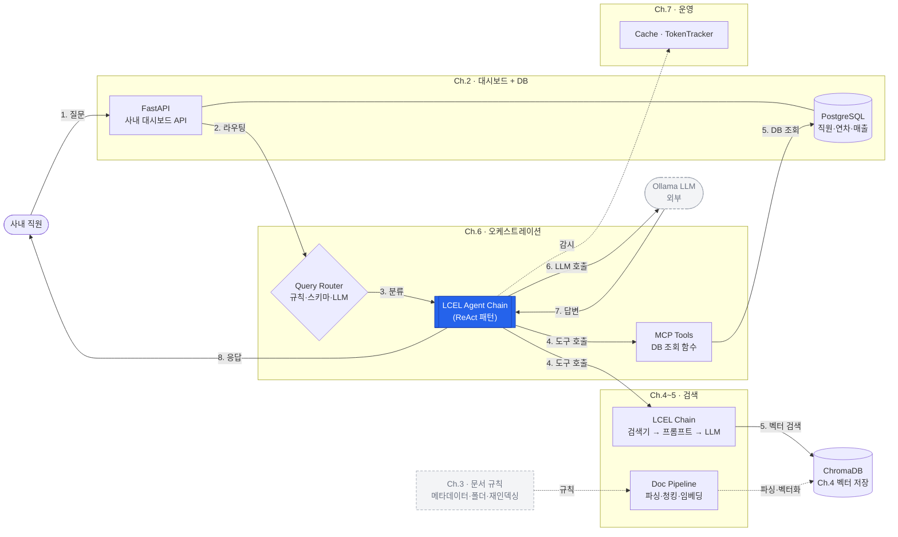
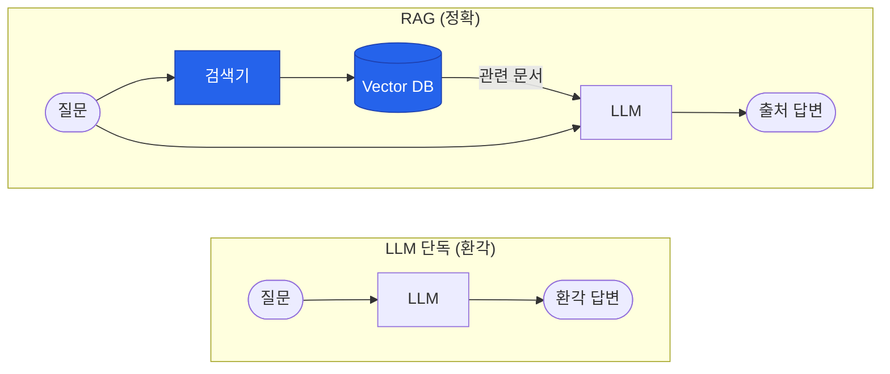
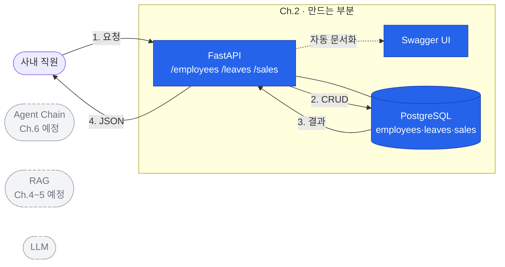
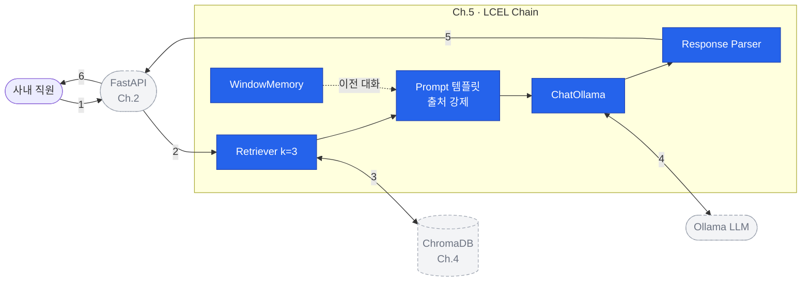
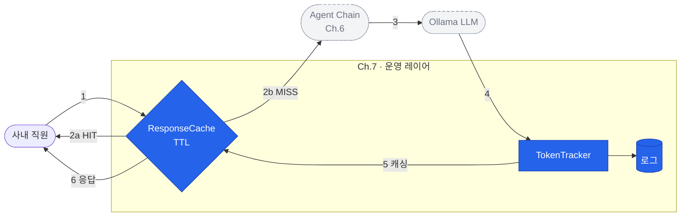
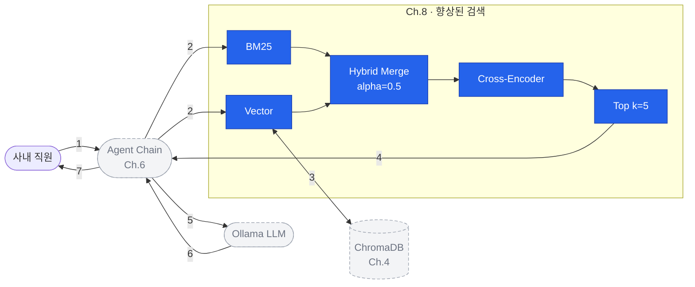
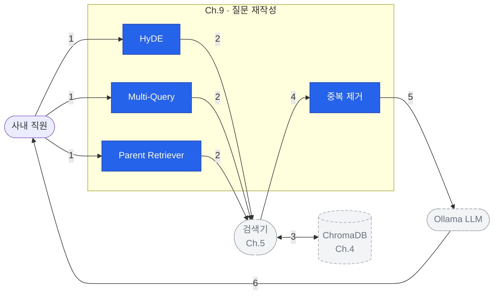
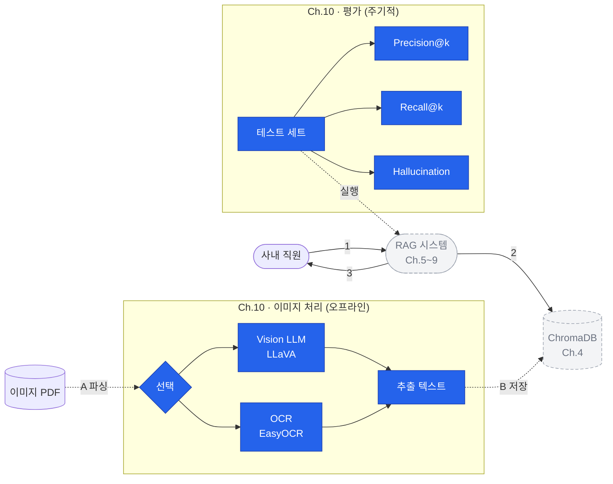

# ConnectHR 아키텍처 레퍼런스

> 이전에 확정한 전체 맵 구조 및 챕터별 포커스 컴포넌트 정리
> (Mermaid v8 기준 — 문법 오류 수정 전 상태)

---

## 전체 맵 (요청 → 응답 8단계)

### 구조

- **User**: 사내 직원
- **Ch.2 대시보드 + DB**: FastAPI + PostgreSQL (같이 배치)
- **Ch.6 오케스트레이션**: Query Router, LCEL Agent Chain (ReAct 패턴), MCP Tools
- **Ch.4~5 검색**: Doc Pipeline (Ch.4), LCEL Chain (Ch.5)
- **Ch.4 데이터**: ChromaDB (벡터 저장소)
- **Ch.7 운영**: ResponseCache · TokenTracker
- **외부**: Ollama LLM (DeepSeek-R1:8b)
- **Ch.3 참조**: 문서 규칙 (이론, 외부 박스)

### 요청·응답 8단계

| # | 단계 | 입력 | 출력 | 담당 Ch |
|---|---|---|---|---|
| 1 | **질문 접수** | 자연어 텍스트 | HTTP POST | Ch.2 |
| 2 | **라우팅** | JSON {query, session_id} | 라우터 입력 | Ch.2·6 |
| 3 | **분류** | 원본 질문 | 경로 태그 (DB/RAG) | Ch.6 |
| 4 | **도구 호출** | 경로 + 질문 | Tool call 명령 | Ch.6 |
| 5 | **데이터 조회** | SQL / 임베딩 벡터 | 행 / 관련 문서 k개 | Ch.2·4 |
| 6 | **LLM 호출** | 컨텍스트 + 프롬프트 | LLM 입력 토큰 | Ch.5·6 |
| 7 | **LLM 답변** | 프롬프트 | 답변 텍스트 + 출처 | Ch.1 |
| 8 | **응답 반환** | LLM 원본 답변 | JSON {answer, sources, tokens} | Ch.2·6 |

### 부가 흐름

- **오프라인 파싱·벡터화**: Ch.3 규칙 → 준비된 문서 → Doc Pipeline → ChromaDB (재인덱싱 주기적)
- **운영 감시**: 모든 요청·응답을 Cache/TokenTracker가 기록 (Ch.7)

---

## 챕터별 포커스 (만드는 부분 · 추상화)

### Ch.1 · 맛보기
- **디테일**: LLM 단독(환각) vs RAG(정확) 비교
- **추상화**: 없음 (맛보기 전체가 포커스)
- **핵심 컴포넌트**: Retriever, Vector DB

### Ch.2 · 대시보드
- **디테일**: FastAPI 엔드포인트 (/employees /leaves /sales) + PostgreSQL + Swagger
- **추상화**: Agent Chain, RAG, LLM (앞으로 만들 것)
- **요청·응답**: User → FastAPI → PostgreSQL → FastAPI → User

### Ch.3 · 문서 규칙 (이론)
- **디테일**: 메타데이터 · 폴더 구조 · 재인덱싱 전략 + PDF·Word·Excel·HWP 준비
- **추상화**: Doc Pipeline (Ch.4 예정), ChromaDB, RAG 시스템
- **특징**: 코드 없음, 문서 준비 완료 후 Ch.4로 전달

### Ch.4 · 벡터 DB 구축
- **디테일**: Parser (pypdf·python-docx·openpyxl) → Chunker (500자·100 오버랩) → Embedder (ko-sroberta-multitask) → ChromaDB
- **추상화**: FastAPI, 검색기(Ch.5 예정), Ollama LLM
- **오프라인 파이프라인**: 문서 → 벡터 → DB

### Ch.5 · LCEL 파이프라인
- **디테일**: LCEL Chain 5개 컴포넌트
  - Retriever (k=3)
  - Prompt 템플릿 (출처 강제)
  - ChatOllama
  - Response Parser (`<think>` 제거)
  - WindowMemory (멀티턴)
- **추상화**: FastAPI (Ch.2), ChromaDB (Ch.4), Ollama LLM
- **요청·응답**: 6단계 사이클

### Ch.6 · 통합 에이전트
- **디테일**:
  - Query Router 3단계 (Rule → Schema → LLMClass)
  - LCEL Agent Chain · ReAct 패턴 (Think → Act → Observe)
  - MCP Tools 3개 (leave_balance, sales_sum, search_documents)
- **추상화**: FastAPI, LCEL Chain, DB들, LLM
- **요청·응답**: 8단계 사이클

### Ch.7 · 운영
- **디테일**: ResponseCache (TTL 체크, HIT/MISS 분기), TokenTracker, 로그 저장
- **추상화**: Agent Chain, Ollama LLM
- **요청·응답**: Cache HIT은 2a에서 바로 반환, MISS는 Agent → LLM → Tracker → Cache 경로

### Ch.8 · 검색 품질 튜닝
- **디테일**: Hybrid Search + Reranker 파이프라인
  - BM25 (키워드 top N)
  - Vector (의미 top N, ChromaDB)
  - Hybrid Merge (alpha=0.5)
  - Cross-Encoder Reranker
  - Top k=5
- **추상화**: 사용자, Agent Chain, LLM
- **요청·응답**: User → Agent → [튜닝 파이프라인] → LLM → User

### Ch.9 · 질문 이해 강화
- **디테일**: 질문 재작성 3전략
  - HyDE (가상 답변 생성)
  - Multi-Query (질문 5개 생성)
  - Parent Retriever (작은 → 부모 청크)
  - 중복 제거
- **추상화**: 검색기, ChromaDB, LLM
- **요청·응답**: User → [재작성] → Retriever → Dedup → LLM → User

### Ch.10 · 이미지 + 평가
- **디테일**:
  - 이미지 처리 (오프라인): Vision LLM (LLaVA) vs OCR (EasyOCR) 선택
  - 평가 프레임워크 (주기적): Precision@k, Recall@k, Hallucination Rate
- **추상화**: ChromaDB, RAG 시스템 (Ch.5~9)
- **3가지 흐름**: 오프라인 이미지 파싱 + 실시간 쿼리 + 평가 루프

---

## 색상 · 표기 규칙

- **파란색 (primary)**: 해당 챕터가 실제로 만드는 부분
- **회색 점선 (abstract)**: 이미 있거나 앞으로 만들 부분 (이름만 표시)
- **실선**: 실시간 쿼리 흐름
- **점선**: 오프라인 파이프라인 · 외부 의존성 · 미래 연결
- **번호**: 요청부터 응답까지 단일 순차 번호 (1 → 2 → ... → N)

---

## 메인 방향 원칙

1. 모든 다이어그램 `flowchart LR` (가로 방향)
2. 전체 맵에는 Ch.1·Ch.8~10 포함 안 함 (Ch.1은 맛보기, Ch.8~10은 튜닝·평가로 별도)
3. 각 챕터 다이어그램은 **전체 시스템 맥락 포함** — 해당 챕터 포커스만 파란색 디테일, 나머지는 회색 추상화
4. 요청·응답 사이클 전체 표시 (User부터 User까지)
5. 오프라인/실시간 구분 명확히

---

## Mermaid 코드 (수정 필요 — 신택스 에러 존재)

> 아래 코드는 v8 원본. 실제 렌더링 시 일부 노드명/라벨 이스케이프 필요.
> 최종 MD 문서 또는 mermaid.live에 붙여넣고 검증 후 사용.

### 전체 맵



### Ch.1 · 맛보기 (LLM 단독 vs RAG)



### Ch.2 · 대시보드



### Ch.3 · 문서 규칙

```mermaid
flowchart LR
    subgraph Ch3Detail["Ch.3 · 만드는 부분"]
        direction LR
        Meta[메타데이터]
        Folder[폴더 구조]
        Reindex[재인덱싱]
        PDF[(PDF)]
        Word[(Word)]
        Excel[(Excel)]
        HWP[(HWP)]
        Meta --> PDF
        Folder --> PDF
    end
    Pipeline(["Doc Pipeline<br/>Ch.4 예정"])
    VDB[("ChromaDB<br/>Ch.4 예정")]
    System(["RAG 시스템<br/>Ch.5~ 예정"])
    PDF -. 입력 .-> Pipeline
    Word -. 입력 .-> Pipeline
    Excel -. 입력 .-> Pipeline
    HWP -. 입력 .-> Pipeline
    Pipeline -. .-> VDB -. .-> System
    classDef primary fill:#2563eb,stroke:#1e40af,color:#fff
    classDef abstract fill:#f3f4f6,stroke:#9ca3af,stroke-dasharray:5 3,color:#6b7280
    class Meta,Folder,Reindex,PDF,Word,Excel,HWP primary
    class Pipeline,VDB,System abstract
```

### Ch.4 · 벡터 DB 구축

```mermaid
flowchart LR
    subgraph Ch4Offline["Ch.4 · 오프라인 파이프라인"]
        direction LR
        Docs[("사내 문서<br/>PDF·Word·Excel·HWP")]
        Parser["Parser<br/>pypdf·python-docx"]
        Chunker["Chunker<br/>500자·100 오버랩"]
        Embedder["Embedder<br/>ko-sroberta"]
        VDB[("ChromaDB")]
        Docs --> Parser --> Chunker --> Embedder --> VDB
    end
    User([사내 직원])
    FastAPI(["FastAPI<br/>Ch.2"])
    Retriever(["검색기<br/>Ch.5 예정"])
    LLM(["Ollama LLM"])
    User -. 질문 .-> FastAPI -. .-> Retriever -. .-> VDB -. .-> LLM -. .-> User
    classDef primary fill:#2563eb,stroke:#1e40af,color:#fff
    classDef abstract fill:#f3f4f6,stroke:#9ca3af,stroke-dasharray:5 3,color:#6b7280
    class Docs,Parser,Chunker,Embedder,VDB primary
    class FastAPI,Retriever,LLM abstract
```

### Ch.5 · LCEL 파이프라인



### Ch.6 · 통합 에이전트

```mermaid
flowchart LR
    User([사내 직원])
    FastAPI(["FastAPI<br/>Ch.2"])
    subgraph Ch6Detail["Ch.6 · 오케스트레이션"]
        direction LR
        subgraph Rt["Query Router"]
            Rule --> Schema --> LLMClass
        end
        subgraph AL["Agent Chain (ReAct)"]
            Think --> Act --> Observe
            Observe -. 재시도 .-> Think
        end
        subgraph Tl["MCP Tools"]
            T1[leave_balance]
            T2[sales_sum]
            T3[search_documents]
        end
    end
    LCEL(["LCEL Chain<br/>Ch.5"])
    PostgreSQL[("PostgreSQL<br/>Ch.2")]
    ChromaDB[("ChromaDB<br/>Ch.4")]
    LLM(["Ollama LLM"])
    User -- "1" --> FastAPI -- "2" --> Rt
    Rt -- "3" --> AL
    AL -- "4" --> Tl
    T1 -. .-> PostgreSQL
    T3 -. .-> LCEL -. .-> ChromaDB
    AL -- "5" --> LLM -- "6" --> AL -- "7" --> FastAPI -- "8" --> User
    classDef primary fill:#2563eb,stroke:#1e40af,color:#fff
    classDef abstract fill:#f3f4f6,stroke:#9ca3af,stroke-dasharray:5 3,color:#6b7280
    class Rule,Schema,LLMClass,Think,Act,Observe,T1,T2,T3 primary
    class FastAPI,LCEL,PostgreSQL,ChromaDB,LLM abstract
```

### Ch.7 · 운영



### Ch.8 · 검색 품질 튜닝



### Ch.9 · 질문 이해 강화



### Ch.10 · 이미지 + 평가



---

## 신택스 에러 대응 가이드

v8 원본에서 발견된 문제:
1. `"1."`, `"1'"` 같은 짧은 라벨이 일부 Mermaid 버전에서 파싱 안 됨 → `"1"`, `"1a"`로 변경
2. `<br/>` 태그가 htmlLabels 설정 없으면 깨질 수 있음 → `mermaid.initialize({ htmlLabels: true })`
3. `( )` 안에 `,` 포함 시 파싱 오류 → 라벨 내 `,` 대신 `·` 사용
4. `%` 같은 특수문자는 라벨에 큰따옴표로 감싸기: `"50%"`

최종 검증: [mermaid.live](https://mermaid.live)에 붙여넣고 렌더 확인 후 사용.
