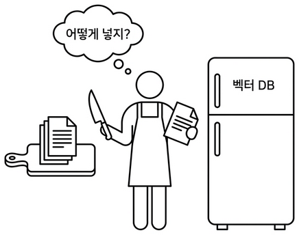
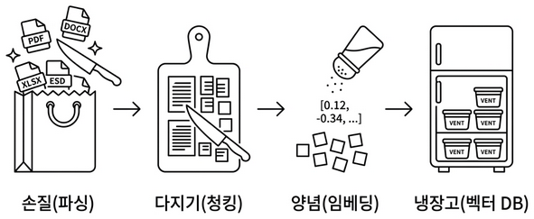
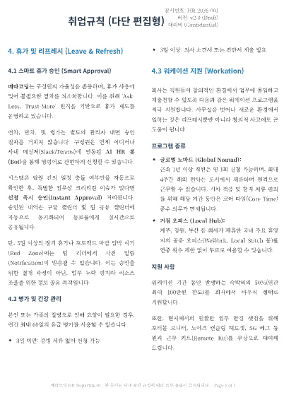
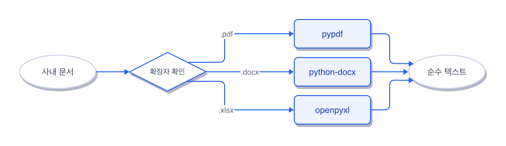
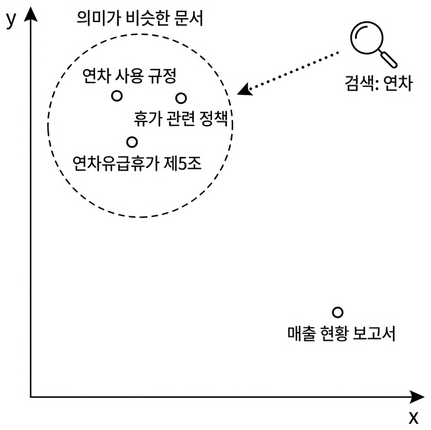
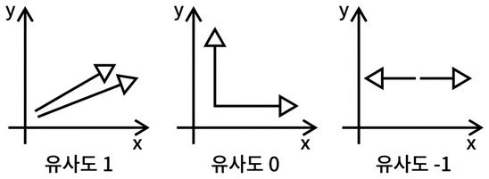

# Ch.4: 파싱 · 청킹 · 임베딩 · ChromaDB (ex04)

> 한 줄 요약: 문서는 조각내야 찾는다. 손질(파싱), 다지기(청킹), 양념(임베딩), 냉장고(벡터DB).  
> 핵심 개념: 문서 파싱, 청킹, 임베딩, 벡터 저장/검색, 임베딩 모델 선택 기준


<!-- [GEMINI PROMPT: 04_chapter-opening]
path: assets/CH04/04_chapter-opening.png
A minimalist black and white technical diagram with a strict 16:9 aspect ratio
on a solid white background. No shading, no 3D effects, only clean thin line art.
The entire assembly of icons, lines, and text is perfectly centered globally
within the 16:9 frame, leaving generous and equal white space on all sides.

Center: a minimalist line-art person icon wearing an apron, standing between
a cutting board with neatly stacked documents on the left
and a large refrigerator icon labeled '벡터 DB' on the right.
The person holds a kitchen knife in one hand and a document page in the other.
Above the person: a thought bubble containing '어떻게 넣지?'.
Style: scene-opener
-->


*문서를 잘게 쪼개고 벡터로 변환하여 검색 가능한 지식으로 만듭니다*

### 1.1 "정리는 했는데, 어떻게 넣지?"

CH03에서 사내 문서를 정리했습니다. 분류도 마쳤고 메타데이터 라벨도 부착했습니다. 이제 이 문서들을 벡터 DB에 넣어서 AI 비서가 검색할 수 있게 만들 차례입니다.

그런데 문서를 그냥 통째로 넣으면 될까요? CH01에서 이미 경험했습니다. 더미 문서 3개는 괜찮았습니다. 하지만 실제 사내 문서는 다릅니다. 취업규칙만 해도 수십 페이지인데, 이걸 통째로 넣으면 "연차 몇 일이야?"라고 물었을 때 보안규정이랑 매출 현황까지 딸려옵니다. 문서를 **검색 가능한 지식**으로 바꾸려면 몇 단계를 거쳐야 합니다.


### 1.2 네 단계 파이프라인

**팀장**: "재료 손질 안 하고 요리해본 적 있어?"

냉장고에 식재료를 넣는 걸 생각해보겠습니다. 마트에서 사온 재료를 봉지째로 냉장고에 던져 넣으면 어떻게 될까요? 나중에 찾을 수가 없습니다. 양파가 어디 있는지, 고기는 아직 쓸 수 있는지 뒤져봐야 알 수 있습니다.
제대로 하려면 이런 과정을 거칩니다.

1. **손질한다** — 흙을 씻고, 껍질을 벗기고, 뼈를 발라낸다. 먹을 수 없는 부분을 제거한다.
2. **다진다** — 요리에 맞게 적당한 크기로 자른다. 너무 크면 익지 않고, 너무 작으면 형체가 없어진다.
3. **양념한다** — 소금에 절이거나 밑간을 한다. 나중에 바로 쓸 수 있게 맛을 입힌다.
4. **냉장고에 정리한다** — 라벨을 붙이고, 구분해서 넣는다. "닭가슴살 — 3월 5일 — 볶음용"

사내 문서도 똑같습니다.

| 요리 과정 | 문서 처리 | 무슨 일이 벌어지나 |
|----------|----------|--------------|
| 손질 | **파싱** (Parsing) | PDF/DOCX/XLSX에서 텍스트를 꺼낸다 |
| 다지기 | **청킹** (Chunking) | 텍스트를 적당한 크기로 조각낸다 |
| 양념 | **임베딩** (Embedding) | 텍스트 조각을 숫자 벡터로 변환한다 |
| 냉장고 정리 | **벡터 DB 저장** | 벡터를 ChromaDB에 넣고 검색 가능하게 한다 |

<!-- [GEMINI PROMPT: 04_vectordb-pipeline]
path: assets/CH04/04_vectordb-pipeline.png
A minimalist black and white technical diagram with a strict 16:9 aspect ratio
on a solid white background. No shading, no 3D effects, only clean thin line art.
The entire assembly of icons, lines, and text is perfectly centered globally
within the 16:9 frame, leaving generous and equal white space on all sides.

Four steps from left to right, connected by arrows:
Step 1 labeled '손질(파싱)': a minimalist line-art grocery bag icon with
document icons (PDF/DOCX/XLSX) being cleaned with a knife.
Step 2 labeled '다지기(청킹)': a minimalist line-art cutting board
with text blocks being sliced into small even pieces.
Step 3 labeled '양념(임베딩)': small text pieces being sprinkled with
numbers [0.12, -0.34, ...] from a minimalist spice shaker icon.
Step 4 labeled '냉장고(벡터 DB)': a minimalist line-art refrigerator
with neatly labeled containers inside.
Style: step-by-step-infographic
-->

*문서를 벡터 DB에 넣는 과정은 요리의 손질 → 다지기 → 양념 → 냉장고 정리와 같다.*


### 1.3 파싱 — 문서에서 텍스트 꺼내기



*예제로 포함된 취업규칙 PDF 파일의 원본 화면*

위 예제로 들어가 있는 취업규칙 PDF 파일을 확인해 보겠습니다. 사람 눈에는 글자가 보이지만 컴퓨터 입장에서는 그냥 바이너리 데이터입니다. "취업규칙 제1조"라는 텍스트를 꺼내려면 **파서(Parser)** 가 필요합니다.

문제는 형식마다 파서가 다르다는 점입니다. PDF는 PDF 파서가, DOCX는 DOCX 파서가, XLSX는 XLSX 파서가 필요합니다. CH03에서 허용한 형식 세 가지, 그대로입니다.

| 형식 | 파서 라이브러리 | 특징 |
|------|-------------|------|
| PDF | pypdf | 텍스트 기반 PDF에서 페이지별 텍스트 추출 |
| DOCX | python-docx | 단락(Paragraph)과 표(Table) 추출, 제목을 마크다운으로 변환 |
| XLSX | openpyxl | 시트별 셀 데이터를 행 단위로 읽기 |

그런데 모든 PDF가 잘 읽히는 건 아닙니다. **이미지로 된 PDF** (스캔한 문서나 캡처 화면)는 텍스트가 아예 추출되지 않습니다. 이 문제는 CH10에서 OCR과 Vision LLM으로 해결합니다. 지금은 텍스트 기반 문서만 다룹니다.


*파일 확장자에 따라 적절한 파서를 선택한다. 통합 함수 하나로 자동 분기.*

실제 우리 프로젝트의 `data/docs/` 폴더. 6개 문서가 있습니다.

```
data/docs/
├── hr/
│   ├── HR_취업규칙_v1.0.pdf
│   └── HR_정보보안서약서.pdf
├── security/
│   └── SEC_보안규정_v1.0.docx
├── finance/
│   ├── FIN_2025_상반기_매출현황.xlsx
│   └── FIN_부서별_예산기안서.xlsx
└── ops/
    └── OPS_신규서비스_런칭전략.pdf
```

CH03에서 설계한 분류 구조 그대로입니다. 이 6개 문서를 파싱하면, 순수 텍스트가 추출됩니다.


### 1.4 청킹 — 적당한 크기로 자르기

텍스트를 꺼냈습니다. 그런데 취업규칙 전문이 한 덩어리로 들어가면 안 됩니다. CH01에서 겪은 바로 그 문제입니다 — 문서가 너무 크면 관련 없는 내용까지 딸려옵니다.

요리에서 재료를 다지듯이 텍스트를 **적당한 크기의 조각(chunk)** 으로 잘라야 합니다.

CH03에서 설계한 대로 **고정 크기 500자 + 100자 오버랩**으로 갑니다.

처음에는 오버랩 없이 500자씩 딱딱 잘라봤습니다.

*500자마다 자르면... 문장 중간에서 잘리는 거 아니야?*

맞습니다. 실제로 어떻게 잘리는지 보겠습니다.

오버랩 없이 500자에서 딱 자르면 이렇게 됩니다.

```
[청크 1] ...신입사원은 입사 후 처음 3년 동안은 법정 연차가 발생하지 않습니다.
[청크 2] 대신 매월 1회의 유급 '리프레시 데이'를 휴가로 사용할 수 있습니다...
```

"연차가 없다"만 남고 "대신 리프레시 데이가 있다"는 다음 조각으로 넘어갔습니다. AI 비서가 청크 1만 검색하면 "연차 없음"이라고만 답합니다.

100자 오버랩을 주면 앞뒤 조각이 겹칩니다.

```
[청크 1] ...신입사원은 입사 후 처음 3년 동안은 법정 연차가 발생하지 않습니다.
          대신 매월 1회의 유급 '리프레시 데이'를 휴가로...
[청크 2] ...법정 연차가 발생하지 않습니다. 대신 매월 1회의 유급 '리프레시
          데이'를 휴가로 사용할 수 있습니다. 3년 근속 시 30일의 연차가...
```

어느 조각을 검색하든 "연차 없음 + 리프레시 데이" 문맥이 이어집니다.

각 조각에는 **메타데이터**도 함께 붙습니다. CH03에서 설계한 라벨이 여기서 쓰입니다.

```json
{
  "text": "신입사원은 입사 후 처음 3년 동안은 법정 연차가 발생하지 않습니다. 대신 매월 1회의 유급 '리프레시 데이'를 휴가로...",
  "metadata": {
    "file_name": "HR_취업규칙_v1.0.pdf",
    "file_type": "pdf",
    "source_path": "data/docs/hr/HR_취업규칙_v1.0.pdf",
    "doc_id": "hr_취업규칙_v1_0",
    "page": 3
  }
}
```

나중에 AI 비서가 "이 답변의 출처는 취업규칙 3페이지입니다"라고 말할 수 있는 이유가 바로 이 메타데이터입니다.


### 1.5 임베딩 — 의미를 숫자로 바꾸기

텍스트를 자르고 라벨을 붙이는 것까지는 사람이 이해할 수 있는 작업입니다. 

하지만 여기서부터 좀 다릅니다. "연차 사용 규정"이라는 텍스트를 컴퓨터가 이해할 수 있을까요? 컴퓨터는 자연어 글자를 모릅니다. 단지 숫자만 연산할 수 있습니다. **임베딩(Embedding)** 은 텍스트의 **의미**를 숫자 벡터(768개의 숫자 리스트)로 바꾸는 과정입니다. 여기서 핵심은 단순히 글자를 숫자로 치환하는 게 아니라 **의미가 비슷한 텍스트는 비슷한 숫자**가 된다는 점입니다.

"연차 사용 규정" → [0.12, -0.34, 0.87, ...]
"휴가 관련 정책" → [0.11, -0.33, 0.85, ...]  ← 비슷!
"매출 현황 보고서" → [-0.45, 0.22, -0.11, ...] ← 완전 다름

<!-- [GEMINI PROMPT: 04_embedding-concept]
path: assets/CH04/04_embedding-concept.png
A minimalist black and white technical diagram with a strict 16:9 aspect ratio
on a solid white background. No shading, no 3D effects, only clean thin line art.
The entire assembly of icons, lines, and text is perfectly centered globally
within the 16:9 frame, leaving generous and equal white space on all sides.

A 2D coordinate plane (x-y axes) with scattered dots representing text chunks.
Top-left cluster: three dots close together labeled '연차 사용 규정',
'휴가 관련 정책', '연차유급휴가 제5조' — grouped inside a dashed circle
labeled '의미가 비슷한 문서'.
Bottom-right: an isolated dot labeled '매출 현황 보고서' — far from the cluster.
A dotted arrow from a minimalist search icon labeled '검색: 연차' points
toward the top-left cluster.
Style: concept-diagram
-->

*임베딩은 의미가 비슷한 텍스트를 가까운 좌표에 배치한다. "연차"를 검색하면 의미상 가까운 문서들이 먼저 발견된다.*

벡터 검색의 핵심이 바로 이것입니다. "연차 사용 규정"을 검색하면 숫자가 비슷한 "휴가 관련 정책" 청크를 찾아올 수 있습니다. 키워드가 정확히 일치하지 않아도 의미가 가까우면 찾아냅니다.

그런데 "숫자가 비슷하다"는 걸 어떻게 판단할까요? 768개나 되는 숫자를 하나하나 비교할 수는 없습니다. 여기서 **코사인 유사도(Cosine Similarity)** 라는 방법을 씁니다. 벡터를 좌표 위의 **화살표**라고 생각해 보겠습니다. 두 화살표가 같은 방향을 가리키면 의미가 비슷한 거고, 반대 방향이면 의미가 다른 겁니다. 코사인 유사도는 이 **두 화살표 사이의 각도**를 측정합니다.

- 같은 방향(각도 0°) → 유사도 **1** (완전히 같은 의미)
- 직각(90°) → 유사도 **0** (관련 없음)
- 반대 방향(180°) → 유사도 **-1** (반대 의미)

<!-- [GEMINI PROMPT: 04_cosine-similarity]
path: assets/CH04/04_cosine-similarity.png
A minimalist black and white technical diagram with a strict 16:9 aspect ratio
on a solid white background. No shading, no 3D effects, only clean thin line art.
The entire assembly of icons, lines, and text is perfectly centered globally
within the 16:9 frame, leaving generous and equal white space on all sides.

Three simple coordinate systems (x-y axes) side by side.
On the left coordinate system, two vector arrows pointing in the exact same direction (angle 0 degrees) with simple text '유사도 1'.
In the middle coordinate system, two vector arrows at a right angle (90 degrees) with text '유사도 0'.
On the right coordinate system, two vector arrows pointing in completely opposite directions (180 degrees) with text '유사도 -1'.
Style: concept-diagram
-->

*코사인 유사도의 각도에 따른 값의 변화*

"연차 사용 규정"과 "휴가 관련 정책"은 거의 같은 방향을 가리킵니다. "매출 현황 보고서"는 완전히 다른 방향입니다. 벡터 DB는 이 각도를 계산해서 가장 비슷한 방향의 문서부터 순서대로 가져옵니다.

#### 왜 ko-sroberta-multitask인가?

임베딩 모델은 여러 가지가 있습니다. OpenAI의 text-embedding-ada-002도 있고 다국어 모델도 존재합니다. 우리는 **ko-sroberta-multitask**를 선택했습니다. 이유는 간단합니다.

1. **한국어에 특화됐다** — 한국어 문장 유사도 태스크로 파인튜닝된 모델입니다. "연차"와 "휴가"가 의미상 가깝다는 걸 잘 잡아냅니다.
2. **로컬에서 돌릴 수 있다** — OpenAI 임베딩은 API 호출 과정에서 과금이 발생합니다. 반면 ko-sroberta는 단일 다운로드만 마치면 로컬 환경에서 무료로 사용할 수 있습니다.
3. **사내 문서에 적합하다** — 사내 민감 정보를 외부 API에 보내지 않아도 됩니다. 보안 규정 관점에서도 안전합니다.

> CH08(검색 품질 튜닝)에서 다른 임베딩 모델과 비교 실험을 해봅니다. 지금은 ko-sroberta로 시작하고, 나중에 더 나은 선택지가 있는지 확인합니다.


### 1.6 ChromaDB — 벡터 DB에 저장

양념까지 끝난 재료를 냉장고에 정리합니다. 라벨 붙이고 구분해서 나중에 바로 꺼낼 수 있게.

**ChromaDB**가 우리의 냉장고입니다. CH01에서 이미 써봤지만 그때는 `Chroma.from_documents()` 명령 한 줄로 끝냈습니다. 이번에는 우리가 직접 넣습니다. ChromaDB에 저장하는 항목은 네 가지입니다.

| 저장 항목 | 내용 | 예시 |
|----------|------|------|
| id | 청크 고유 ID | `hr_취업규칙_v1_0_text_p001_c0003` |
| document | 청크 텍스트 원문 | "제5조 연차유급휴가는..." |
| embedding | 768차원 벡터 | [0.12, -0.34, ...] |
| metadata | 출처 정보 | {file_name: "HR_취업규칙_v1.0.pdf", page: 3} |

저장할 때 **upsert** 연산을 사용합니다. 같은 ID가 이미 존재하면 덮어쓰고, 없으면 새로 추가합니다. 파이프라인을 여러 번 실행해도 저장소에서 데이터가 중복되지 않습니다. CH03에서 설계한 **전체 재인덱싱** 전략과 방향이 맞닿는 부분입니다.

손질(파싱) → 다지기(청킹) → 양념(임베딩) → 냉장고 정리(벡터 DB 저장). 네 단계를 알았습니다. 기술 파트에서 직접 파이프라인을 돌려보고 "연차 사용 규정"이 정말 검색되는지 확인해 보겠습니다.

이제 실습으로 문서를 벡터 DB에 저장하는 파이프라인을 만들어 보겠습니다.


### 2.1 용어 정리

| 이야기 속 표현 | 진짜 용어 | 정식 정의 |
|------------|----------|---------|
| "손질" | 파싱 (Parsing) | 파일 형식(PDF/DOCX/XLSX)에서 순수 텍스트를 추출하는 과정 |
| "다지기" | 청킹 (Chunking) | 긴 텍스트를 벡터 DB에 적합한 크기로 분할하는 과정. 고정 크기 500자 + 100자 오버랩 |
| "양념" | 임베딩 (Embedding) | 텍스트의 의미를 768차원 숫자 벡터로 변환하는 과정 |
| "냉장고" | 벡터 DB (Vector Database) | 벡터를 저장하고, 유사한 벡터를 빠르게 검색하는 특수 데이터베이스 |
| "의미가 비슷한 숫자" | 코사인 유사도 (Cosine Similarity) | 두 벡터 사이의 각도로 유사도를 측정. 1에 가까울수록 유사 |
| "덮어쓰기" | 업서트 (Upsert) | 같은 ID가 있으면 업데이트, 없으면 삽입하는 연산 |


### 2.2 소스 코드 준비

이 책의 실습은 GitHub 레포를 클론해서 진행합니다.

| 레포 | 용도 | 주소 |
|------|------|------|
| **rag-start** | 실습용 (빈 파일 — 챕터 따라 코드 작성) | `https://github.com/metacoding-18-ai-applied-v4/rag-start` |
| **rag-end** | 완성 코드 (막히면 참고) | `https://github.com/metacoding-18-ai-applied-v4/rag-end` |

아직 클론하지 않으셨다면 터미널에서 아래 명령어를 실행해 보겠습니다.

```bash
git clone https://github.com/metacoding-18-ai-applied-v4/rag-start.git
cd rag-start/ex04
```

이미 클론하셨다면 `ex04` 폴더로 이동해 보겠습니다.

```bash
cd rag-start/ex04
```


### 2.3 실습 환경 구축

> 기본 환경(Python 3.12)이 없다면 **교육자료**를 먼저 확인해 주시기 바랍니다.

```bash
cp .env.example .env
python3.12 -m venv .venv
source .venv/bin/activate  # Windows: .venv\Scripts\activate
pip install -r requirements.txt
```

| 패키지 | 버전 | 역할 |
|--------|------|------|
| pypdf | 4.3.1 | PDF 텍스트 추출 |
| python-docx | 1.1.2 | DOCX 단락/표 추출 |
| openpyxl | 3.1.5 | XLSX 셀 데이터 추출 |
| sentence-transformers | 3.3.1 | ko-sroberta 임베딩 모델 |
| chromadb | 1.5.1 | 벡터 DB (로컬 영속) |

> ko-sroberta-multitask 모델은 최초 실행 시 HuggingFace에서 자동 다운로드됩니다 (약 400MB). 이후에는 로컬 캐시를 사용합니다.

```
ex04/
├── requirements.txt
├── data/
│   ├── docs/                      ← 사내 문서 원본
│   │   ├── hr/                    (PDF 2개)
│   │   ├── security/              (DOCX 1개)
│   │   ├── finance/               (XLSX 2개)
│   │   └── ops/                   (PDF 1개)
│   ├── markdown/                  ← 파싱 결과 (실행 시 생성)
│   └── chroma_db/                 ← ChromaDB 영속 저장소 (실행 시 생성)
└── src/
    ├── chunker.py       [실습] 청킹 핵심 로직 (TODO 1개)     ◀ CH04 핵심
    ├── store.py         [실습] ChromaDB 저장+검색 (TODO 2개)
    ├── main.py          [실습] 파이프라인 조립 (TODO 5개)
    ├── cli_search.py    [실습] 벡터 검색 CLI (TODO 4개)
    ├── _chunk_utils.py  [참고] 청크 생성/메타데이터 결합
    ├── _store_utils.py  [참고] 임베딩 모델 로딩/컬렉션 관리
    ├── _pipeline_utils.py [참고] argparse/마크다운 저장
    ├── _search_utils.py [참고] 유사도 변환/출력 포맷
    ├── extractor.py     [설명] 형식별 텍스트 추출 통합 모듈
    ├── extract_pdf.py   [참고] PDF 파싱 → Markdown 변환
    ├── extract_docx.py  [참고] DOCX 파싱 → Markdown 변환
    └── extract_xlsx.py  [참고] XLSX 파싱 → Markdown 변환
```

`[실습]` 파일에는 함수 시그니처와 힌트가 준비되어 있습니다. 챕터를 따라 하며 TODO를 하나씩 채워 넣어 보겠습니다. `[참고]` 파일은 보조 함수가 완성되어 있으니 열어볼 필요 없이 import만으로 동작합니다. 막히는 부분이 있다면 rag-end의 완성 코드를 참고해 주시기 바랍니다.

### 2.4 실습 순서

1. `chunker.py` — 청킹 핵심 로직 작성
2. `store.py` — 벡터DB 저장+검색 작성
3. `main.py` — 파이프라인 조립 작성
4. `cli_search.py` — 검색 CLI 작성
5. `main.py --step 1` — 파싱 결과 확인
6. `main.py` — 전체 파이프라인 실행 (청킹+임베딩+벡터DB)
7. `cli_search.py` — 벡터 검색 테스트


### 2.5 실습 1: 청킹 핵심 로직 (chunker.py)

이제 핵심인 **청킹 코드**를 직접 작성합니다. `ex04/src/chunker.py`를 열어 `split_text_into_chunks` TODO의 `pass`를 지우고 아래 코드를 작성합니다.

```python
# chunker.py — TODO: chunk_size 단위로 텍스트를 자르되, overlap만큼 겹치게 합니다

chunks = []
step = chunk_size - overlap
start = 0

while start < len(text):
    end = start + chunk_size
    chunk = text[start:end].strip()
    if chunk:
        chunks.append(chunk)
    start += step

return chunks
```

`step = chunk_size - overlap`이 핵심입니다. 500 - 100 = 400자씩 이동하니까, 앞 청크의 마지막 100자가 다음 청크의 처음 100자와 겹칩니다.

> 청크 크기와 오버랩을 바꾸면 검색 결과가 달라집니다. `--chunk-size 300 --overlap 50`으로 다시 돌려보고, 검색 결과가 어떻게 바뀌는지 직접 비교해 보시길 권장합니다.

각 청크에는 출처 추적용 메타데이터가 함께 붙습니다. `_chunk_utils.py`의 `build_text_chunk`가 이 구조를 만듭니다.

| 필드 | 예시 | 용도 |
|------|------|------|
| `id` | `hr_취업규칙_v1_0_text_p003_c0005` | ChromaDB upsert 키 |
| `file_name` | `HR_취업규칙_v1.0.pdf` | 출처 파일명 |
| `page` | `3` | 출처 페이지 |
| `chunk_index` | `5` | 문서 내 순번 |


### 2.6 실습 2: 벡터DB 저장+검색 (store.py)

청킹이 되면 임베딩해서 ChromaDB에 넣어야 합니다. `ex04/src/store.py`를 열어 두 TODO의 `pass`를 지우고 아래 코드를 각각 작성합니다.

`store_chunks_to_chroma`가 이야기 파트의 "냉장고 정리"에 해당합니다. `embed_chunks()`로 768차원 벡터를 만들고, `collection.upsert()`로 ChromaDB에 넣습니다.

```python
# store.py — TODO: 위 4단계를 순서대로 구현합니다

model = load_embedding_model(embedding_model_name)

client = chromadb.PersistentClient(
    path=chroma_dir,
    settings=Settings(anonymized_telemetry=False),
)
collection = get_or_create_collection(client, collection_name)

ids, documents, embeddings, metadatas = embed_chunks(chunks, model)

for batch_start in range(0, len(ids), BATCH_SIZE):
    batch_end = batch_start + BATCH_SIZE
    collection.upsert(
        ids=ids[batch_start:batch_end],
        documents=documents[batch_start:batch_end],
        embeddings=embeddings[batch_start:batch_end],
        metadatas=metadatas[batch_start:batch_end],
    )

return {
    "collection_name": collection_name,
    "chroma_dir": chroma_dir,
    "total_chunks": len(chunks),
    "collection_count": collection.count(),
}
```

`PersistentClient`가 핵심입니다. 메모리가 아닌 디스크(`data/chroma_db/`)에 저장하므로 프로그램을 종료해도 데이터가 남아 있습니다. `embed_chunks()`는 `_store_utils.py`에 있는 보조 함수로, 청크 텍스트를 배치 단위로 임베딩하고 ChromaDB가 허용하지 않는 `None`이나 `bool` 값을 정제합니다. `normalize_embeddings=True`로 벡터를 단위 벡터로 정규화하여 코사인 유사도 계산에 사용합니다.

`search_chroma`는 검색 함수입니다. 쿼리를 임베딩하고 ChromaDB에서 유사한 청크를 찾아옵니다.

```python
# store.py — TODO: 쿼리 임베딩 → collection.query() → 결과 정리

model = load_embedding_model(embedding_model_name)
query_embedding = model.encode([query], normalize_embeddings=True).tolist()

client = chromadb.PersistentClient(
    path=str(Path(chroma_dir).resolve()),
    settings=Settings(anonymized_telemetry=False),
)
collection = client.get_collection(name=collection_name)

results = collection.query(
    query_embeddings=query_embedding,
    n_results=top_k,
    include=["documents", "distances", "metadatas"],
)

search_results = []
docs = results.get("documents", [[]])[0]
dists = results.get("distances", [[]])[0]
metas = results.get("metadatas", [[]])[0]

for rank, (doc, dist, meta) in enumerate(zip(docs, dists, metas), start=1):
    search_results.append({
        "rank": rank, "text": doc,
        "distance": round(dist, 4), "metadata": meta,
    })

return search_results
```


### 2.7 실습 3: 파이프라인 조립 (main.py)

chunker와 store를 채웠으면 이제 **파이프라인을 조립**합니다. `ex04/src/main.py`를 열어 세 TODO의 `pass`를 지우고 아래 코드를 각각 작성합니다.

```python
# main.py — TODO: extract_all_from_directory()로 문서 추출 → 마크다운 저장

results = extract_all_from_directory(docs_dir)
save_results_as_markdown(results)
return results
```

```python
# main.py — TODO: chunk_all_documents()로 청킹 → store_chunks_to_chroma()로 저장

all_chunks = chunk_all_documents(python_results, chunk_size, overlap)
store_result = store_chunks_to_chroma(
    chunks=all_chunks,
    chroma_dir=chroma_dir,
    collection_name=collection_name,
    embedding_model_name=embedding_model_name,
)
return store_result
```

`main()` 함수에도 TODO가 있습니다. step1과 step2를 순서대로 호출하고, step1 결과가 없으면 자동으로 먼저 실행하는 로직을 넣어줍니다. `pass`를 지우고 아래 코드를 작성합니다.

```python
# main.py — TODO: 1 in steps_to_run이면 step1_python_parsing 실행

if 1 in steps_to_run:
    python_results = step1_python_parsing(docs_dir=args.docs_dir)
```

```python
# main.py — TODO: 2 in steps_to_run이면 step2_embed_and_store 실행

if 2 in steps_to_run:
    if not python_results:
        python_results = step1_python_parsing(docs_dir=args.docs_dir)
    step2_embed_and_store(
        python_results=python_results,
        chroma_dir=args.chroma_dir,
        collection_name=args.collection,
        embedding_model_name=args.embedding_model,
        chunk_size=args.chunk_size,
        overlap=args.overlap,
    )
```

TODO를 모두 채웠으면 **전체를 한 번에 돌리기 전에 파싱만 먼저** 확인합니다.

```bash
# 파싱만 실행
python src/main.py --step 1
```

파싱이 끝나면 `data/markdown/` 폴더에 마크다운 파일이 생성됩니다. `data/markdown/HR_취업규칙_v1.0.md`를 열어보겠습니다.

```markdown
# HR_취업규칙_v1.0.pdf

- 파일 형식: pdf
- 추출 글자 수: 1916자


## 페이지 1

취업규칙  ( 다 단  편 집 형 )문서번호 : HR-2026-001
버전: v2.0 (Draft)
대외비  (Confidential)
4. 휴가  및  리 프 레 시  (Leave & Refresh)
4.1 스마트  휴 가  승 인  (Smart Approval)
...
```

파일 정보가 상단에 요약되어 있고 `## 페이지 1`처럼 페이지 단위로 텍스트가 잘 추출된 걸 볼 수 있습니다. **파싱이 잘 됐는지 눈으로 확인하는 과정**, 이 단계를 건너뛰지 않도록 주의해야 합니다.

> 파싱은 RAG의 첫 단추입니다. 여기서 텍스트가 깨지면 뒤에서 아무리 고쳐도 소용이 없습니다. 생성된 `data/markdown/` 폴더 결과물을 반드시 확인하여 원문과 꼼꼼히 대조해 보시길 권장합니다.

파싱 결과가 깨끗하면 이제 전체 파이프라인을 실행합니다.

```bash
# 전체 실행
python src/main.py

# 청크 크기를 바꿔보고 싶다면
python src/main.py --chunk-size 300 --overlap 50
```

`--chunk-size` 옵션으로 청크 크기를 바꿀 수 있습니다.

1. **Step 1: 손질(파싱) + 마크다운 변환** — `data/docs/`의 6개 문서에서 텍스트를 추출하고 마크다운으로 변환하여 `data/markdown/`에 저장합니다.
2. **Step 2: 다지기 + 양념 + 저장** — 마크다운 텍스트를 청크로 자르고 임베딩한 뒤 ChromaDB에 넣습니다.

[CAPTURE NEEDED]
*6개 사내 문서가 마크다운으로 변환된 뒤, 18개 청크로 잘려 벡터 DB에 저장됐다.*


### 2.8 실습 4: 벡터 검색 CLI (cli_search.py)

파이프라인을 돌렸으면 이제 **검색이 작동하는지 직접 확인해 보겠습니다.** `ex04/src/cli_search.py`를 열어 두 TODO의 `pass`를 지우고 아래 코드를 각각 작성합니다.

```python
# cli_search.py — TODO: search_chroma()로 검색 실행 → 결과 출력

results = search_chroma(
    query=query, chroma_dir=chroma_dir,
    collection_name=collection_name,
    embedding_model_name=embedding_model_name, top_k=top_k,
)
for result in results:
    print_search_result(result)
```

```python
# cli_search.py — TODO: while 루프로 input() 반복 → run_single_query() 호출

while True:
    query = input("검색 쿼리를 입력하십시오: ").strip()
    if query.lower() in {"quit", "exit", "q"}:
        break
    run_single_query(query, top_k, chroma_dir, collection_name, embedding_model_name)
```

`main()` 함수의 TODO도 채워줍니다. `--query`가 있으면 단일 쿼리, 없으면 대화형 모드로 실행합니다.

```python
# cli_search.py — TODO: 단일 쿼리 모드 — run_single_query() 호출

run_single_query(
    query=args.query, top_k=args.top_k,
    chroma_dir=args.chroma_dir,
    collection_name=args.collection,
    embedding_model_name=args.embedding_model,
)
```

```python
# cli_search.py — TODO: 대화형 반복 검색 모드 — run_interactive_mode() 호출

run_interactive_mode(
    top_k=args.top_k,
    chroma_dir=args.chroma_dir,
    collection_name=args.collection,
    embedding_model_name=args.embedding_model,
)
```

TODO를 모두 채운 뒤 실행합니다.

```bash
# 실행: 단일 쿼리
python src/cli_search.py --query "휴가 규정" --top-k 3

# 실행: 대화형 모드 (반복 검색)
python src/cli_search.py
```

검색 결과의 유사도는 어떻게 계산될까요? ChromaDB는 코사인 **거리** (0~2)를 반환합니다. 직관적이지 않으므로 **유사도** (0~100%)로 변환합니다.

```python
# cli_search.py — 유사도 변환

def format_distance_as_similarity(distance: float) -> float:
    """코사인 거리를 백분율 유사도로 변환합니다."""
    return max(0.0, (1.0 - distance / 2.0)) * 100
```

거리가 0이면 유사도 100%(완전 일치), 거리가 2로 도출되면 유사도 0%(완전 의미 반대 대척점) 상태입니다. "휴가 규정" 텍스트 키워드를 검색했을 때 출력 엔진상에서 검색 스코어가 71%가 나왔다면, 역으로 코사인 거리 환산 지표로 따졌을 때 약 0.58에 해당하는 수치라는 명확한 뜻입니다.

[CAPTURE NEEDED]
*"휴가 규정"을 검색하자 취업규칙에서 글로벌 노마드, 스마트 휴가 승인 등의 관련 내용을 찾아냈다.*

1~3위 모두 취업규칙에서 휴가(글로벌 노마드, 스마트 휴가, 워케이션) 관련 내용을 찾아왔습니다. 모델이 문맥을 잘 파악해서 정답을 찾아낸 거예요. 다만 유사도가 71%대로 아주 높지는 않고 `--top-k 5`처럼 검색수를 늘리면 전혀 관계없는 문서가 억지로 딸려올 수도 있습니다. 벡터 DB는 키워드 매칭이 아니라 '그나마 의미가 가까운 순서'대로 k개를 무조건 채워서 가져오기 때문입니다. 검색 품질을 높이는 심화 기법은 CH08에서 집중적으로 다룹니다.

> **참고: 검색 결과는 다를 수 있습니다**
> 임베딩 모델의 버전이나 PC 환경 등에 따라 검색된 청크의 순서나 유사도 수치(%)는 책의 예시와 조금 다르게 나올 수 있습니다. 최상위(Top 1~3) 검색 결과에 취업규칙의 휴가/연차 관련 내용이 잘 나왔다면 정상적으로 벡터 DB가 구축된 것입니다.


### 2.9 [설명] extractor.py — 형식별 텍스트 추출

파일 확장자를 보고 적절한 파서를 자동 선택하는 통합 모듈입니다.
핵심은 `extract_text()` 함수입니다. 확장자를 보고 파서 함수를 고르는 매핑 딕셔너리를 씁니다.

```python
# extractor.py — 핵심 구조

def extract_text(file_path: str | Path) -> dict:
    """파일 형식을 자동 감지하여 텍스트를 추출하는 통합 함수."""
    file_path = Path(file_path)
    suffix = file_path.suffix.lower()

    extractor_map = {
        ".pdf": extract_from_pdf,
        ".docx": extract_from_docx,
        ".xlsx": extract_from_xlsx,
    }

    if suffix not in extractor_map:
        raise ValueError(f"지원하지 않는 파일 형식입니다: '{suffix}'")

    return extractor_map[suffix](file_path)
```

**패턴: 전략 패턴(Strategy Pattern)**
`extractor_map` 딕셔너리가 확장자별로 다른 함수를 선택합니다. if-elif-else 분기문 대신에 딕셔너리 매핑을 사용하면, 추후에 문서 새 형식을 추가할 때 단 한 줄만 입력해 추가하면 됩니다.

PDF 파서를 예로 보겠습니다. 핵심은 `extract_text() or ""` 한 줄입니다.

```python
# extractor.py — PDF 파서

def extract_from_pdf(file_path: str | Path) -> dict:
    """PDF 파일에서 텍스트를 페이지별로 추출합니다."""
    file_path = Path(file_path)

    pages_data = []
    with open(file_path, "rb") as f:
        reader = pypdf.PdfReader(f)
        for page_num, page in enumerate(reader.pages, start=1):
            page_text = page.extract_text() or ""
            pages_data.append({"page": page_num, "text": page_text.strip()})

    full_text = "\n\n".join(p["text"] for p in pages_data if p["text"])
    return {
        "source_path": str(file_path.resolve()),
        "file_name": file_path.name,
        "file_type": "pdf",
        "pages": pages_data,
        "full_text": full_text,
    }
```

`page.extract_text()` 가 `None` 을 반환하는 경우가 있습니다. **이미지로 된 PDF**(스캔 문서나 캡처 화면)는 텍스트 레이어가 없어서 pypdf가 아무것도 꺼내지 못합니다. `or ""` 방어 코드 없이는 `None.strip()` 에서 바로 에러가 납니다. 실제로 예제 파일 중 'HR_정보보안서약서.pdf'가 이미지 기반 PDF입니다. 이 파일은 텍스트가 하나도 추출되지 않아 파싱에서 텍스트 청크가 0개인 걸 **그림 4-4**에서 확인할 수 있습니다.

이 문제는 CH10에서 Vision LLM을 사용해 해결합니다. 지금은 "텍스트 기반 PDF만 파싱된다"는 한계만 알고 넘어갑니다.

형식별 파서 함수는 각각 다른 라이브러리를 사용하지만 모두 같은 구조의 딕셔너리를 반환합니다.

| 함수 | 라이브러리 | 핵심 동작 | 주의점 |
|------|----------|----------|--------|
| `extract_from_pdf()` | pypdf | 페이지별 `extract_text()` 호출 | 이미지 기반 PDF는 빈 문자열 반환 (CH10에서 해결) |
| `extract_from_docx()` | python-docx | 단락 순회 + Heading → 마크다운 헤더 변환 | 페이지 개념 없음 (전체가 1페이지) |
| `extract_from_xlsx()` | openpyxl | 시트별 행 단위 읽기 → 마크다운 표 변환 | 첫 행을 헤더로 사용 |

**응답 반환 구조** — 세 파서 모두 같은 형태입니다:

```python
{
    "source_path": "절대 경로",
    "file_name": "파일명",
    "file_type": "pdf | docx | xlsx",
    "pages": [{"page": 번호, "text": "텍스트"}, ...],
    "full_text": "전체 텍스트"
}
```


### 2.10 더 알아보기

**마크다운 일괄 변환 처리 기조** — 현재 구축 중인 파이프라인 시스템은 텍스트를 마크다운 구문으로 깔끔하게 변환 구조화하여 `data/markdown/` 스토리지 상단에 정리 저장한 뒤 추출 임베딩합니다. 임베딩 모델의 내부 엔진 학습 체계 상 마크다운 문서 레이아웃 구조(제목 해시태그 `#`, 특수 표 `|`, 하이픈 점찍기 구문 불릿 리스트 `-`)를 체득했기 때문에 포맷이 보존 방어된 체계 안에서 정확히 핵심 문맥 텍스트일수록 스마트하게 기계적 숫자 벡터 치환 처리를 변환합니다. `extract_pdf.py`, `extract_docx.py`, `extract_xlsx.py` 파일을 단독 실행 환경에서 구동하면 엣지 확장 모듈별로 문서 단일 변환도 확인할 수 있습니다.

**배치 크기 튜닝** — 코드 설계 환경 상 `BATCH_SIZE = 64` 밸류가 파라미터 기본값입니다. 컴퓨터 GPU 하드웨어 메모리가 부족하다면 스텝을 작게 줄이고 환경이 충분할 때는 늘릴 수 있습니다. ko-sroberta는 단독 CPU 환경에서도 호환되어 동작하지만, 다발적인 GPU 스펙 환경이 구비된다면 연산 속도는 비약적으로 크게 상승합니다.


### 2.11 이것만은 기억하세요

- **문서는 조각내야 찾습니다.** 손질(파싱) → 다지기(청킹) → 양념(임베딩) → 냉장고 정리(벡터 DB). 이 네 단계가 RAG의 기초 체력입니다.
- **임베딩은 "의미를 숫자로 바꾸는 것"입니다.** 키워드가 달라도 의미가 비슷하면 좌표 상에서 가까운 벡터가 됩니다.
- 다음 챕터에서는 이 벡터 DB를 활용해서 **진짜 질문-답변 엔진(RAG Q&A)** 을 만듭니다. "연차 몇 일이야?"라고 물으면 검색한 문서를 근거로 LLM이 자연어로 답변해주는 시스템입니다.
