# Ch.5: LCEL 파이프라인 (ex05)

> 한 줄 요약: 검색은 재료, 답변은 요리다. LCEL 파이프라인이 이 레시피다.  
> 핵심 개념: LCEL 파이프라인, 출처 강제(Source Grounding), WindowMemory 멀티턴


<!-- [GEMINI PROMPT: 05_chapter-opening]
path: assets/CH05/05_chapter-opening.png
A minimalist black and white technical diagram with a strict 16:9 aspect ratio
on a solid white background. No shading, no 3D effects, only clean thin line art.
The entire assembly of icons, lines, and text is perfectly centered globally
within the 16:9 frame, leaving generous and equal white space on all sides.

Center: a minimalist line-art librarian icon at a desk, with open books around,
reading one book with a magnifying glass.
Right: a large speech bubble from the librarian containing text lines
and a small tag labeled '[출처: ...]' — representing an answer with source citation.
Style: scene-opener
-->
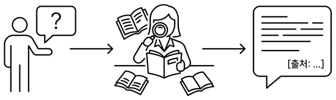

*저장된 지식을 바탕으로 AI가 드디어 사내 질문에 답합니다*

지난 챕터에서 사내 문서를 벡터 DB에 저장하고 CLI로 검색까지 해봤습니다. "연차 사용 규정"을 검색하면 관련 문서 조각이 유사도 점수와 함께 나왔습니다.
그런데 문제가 생겼습니다.

### 1.1 "그냥 답을 알려줘"

벡터 검색을 사내 시스템에 붙이고 일주일쯤 지났을 때였습니다.

**동료**: "야, 병가 쓸 때 증빙 서류 필요해?"<br>
"연차 몇 일 남았는지 어떻게 확인해?"<br>
"신규 서비스 런칭 전략 문서 어디 있어?"

동료들의 질문이 하루에 서너 번씩 날아왔습니다. 매번 같은 유형입니다. 답은 전부 사내 문서 어딘가에 있는데 말입니다.

처음엔 벡터 검색 결과를 공유해 보았습니다.

```
[1] HR_취업규칙_v1.0 (p.3) — 유사도: 87.2%
    "제15조(병가) 질병이나 부상으로 인하여 직무를 수행할 수 없을 때에는..."

[2] HR_취업규칙_v1.0 (p.4) — 유사도: 81.5%
    "병가 기간이 3일 이상인 경우에는 의사의 진단서를..."
```

돌아오는 반응은 한결같았습니다.

**동료**: "이걸 내가 읽어?"<br>
"그냥 답을 알려줘."

*맞다. 사람들은 문서 조각을 원하는 게 아니라, **답변**을 원한다.*

검색 결과 5개를 받아서 직접 읽고 "아, 3일 미만이면 증빙 불필요고 3일 이상이면 진단서가 필요하구나"라고 해석하는 건 결국 사람 몫이었습니다. 벡터 검색은 **재료를 찾아주는 것**이지 **요리를 해주는 것**이 아니었습니다.

이번 챕터에서는 그 "요리"를 해줄 **RAG Q&A 엔진**을 만들어 보겠습니다. 질문하면 문서를 검색하고 검색 결과를 읽어서 자연어로 답변해 주는 시스템입니다.

### 1.2 검색에서 답변으로

지금까지 만든 벡터 검색은 **도서관의 검색 시스템**과 비슷합니다. "한국 역사"를 검색하면 관련 책이 어디 있는지 알려줍니다. 하지만 그 책을 직접 꺼내서 읽어보고 핵심을 정리해서 답해주지는 않습니다.

우리에게 필요한 건 **AI 비서**입니다. AI 비서에게 "조선시대 과거 제도가 뭐야?"라고 물으면 이런 일이 벌어집니다.

1. **질문을 듣는다** — "조선 과거 제도"가 핵심이군
2. **서가에서 책을 찾는다** — 한국사 개론 3장 부근을 꺼냄
3. **읽고 답변을 정리한다** — "문과·무과·잡과 세 종류가 있었습니다"
4. **출처를 알려준다** — "한국사 개론 3장에 나와 있어요"

이 네 단계가 바로 RAG Q&A 파이프라인입니다.


*RAG Q&A 흐름 — 질문이 들어오면 벡터 검색으로 문서 조각을 찾고, LLM이 읽어서 자연어 답변을 만든다*

벡터 검색(CH04)은 2번까지였습니다. 이번 챕터에서 3번과 4번을 추가합니다. AI 비서가 문서를 찾는 것뿐 아니라 **읽고 답변까지 해주는** 시스템을 만드는 것입니다.

### 1.3 LCEL — 파이프 연산자로 조립하기

AI 비서가 일하는 순서를 코드로 옮기려면 어떻게 해야 할까요? 검색 → 프롬프트 → LLM → 파싱, 각 단계를 직접 이어 붙여도 되지만 이걸 편하게 해주는 도구가 있습니다. **LangChain**은 검색, 프롬프트, LLM 호출 같은 단계를 부품으로 제공하고 이 부품을 조립할 수 있게 해주는 Python 프레임워크입니다. RAG 시스템을 만들 때 가장 널리 쓰입니다.
LangChain은 이 조립을 **파이프(|) 연산자**로 합니다. LCEL(LangChain Expression Language)이라고 부릅니다. 파이프는 주방의 레시피와 같습니다.

> 질문 → **검색**(벡터 DB에서 문서 조각 찾기) → **프롬프트**(찾은 문서 + 질문을 합치기) → **LLM**(읽고 답변 생성) → **파싱**(답변 텍스트 추출)

각 단계가 파이프(|)로 연결되고, 앞 단계의 출력이 다음 단계의 입력이 됩니다. 요리 레시피 순서와 똑같습니다.


*LCEL 파이프라인 구조 — 각 단계가 파이프 연산자로 연결된다*

이 구조의 장점은 **블록을 바꿀 수 있다**는 것입니다. LLM을 DeepSeek에서 GPT-4o로 바꾸고 싶으면? LLM 블록만 교체하면 됩니다. 검색 방식을 바꾸고 싶으면? 검색 블록만 교체하면 됩니다.

### 1.4 Source Grounding — 출처 강제

AI 비서에게 한 가지 더 요구할 게 있습니다. **출처**입니다.

CH01에서 LLM이 그럴듯하게 거짓말하는 걸 봤습니다. RAG로 문서를 넣어줬다고 환각이 완전히 사라지는 것은 아닙니다. LLM은 문서에 없는 내용을 지어내기도 합니다. CH01의 step3에서 프롬프트에 "참고 정보를 바탕으로 답하세요"라는 제약을 넣었던 것을 기억하시나요? 이번에는 더 엄격하게 규칙을 넣습니다.

> "반드시 제공된 문서에서만 답하세요. 답변 마지막에 출처를 명시하세요. 문서에서 찾을 수 없으면 '확인되지 않습니다'라고 답하세요."

이걸 **출처 강제(Source Grounding)** 라고 부릅니다. LLM에게 "근거 없이 답하지 마"라고 제한을 거는 것입니다. 출처가 붙으면 독자가 직접 확인할 수도 있고, 신뢰도가 훨씬 올라갑니다.

### 1.5 WindowMemory — 멀티턴 대화
도서관에서 AI 비서에게 묻습니다.

**방문자**: "한국 역사 관련 책 어디 있어요?"

**AI 비서**: "2층 인문학 서가에 있습니다. '한국사 편지'가 가장 인기 있어요."

바로 이어서 묻습니다.

**방문자**: "그러면 거기에 세계사 책도 있어?"

여기서 "거기"가 가리키는 건 무엇입니까? **2층 인문학 서가**입니다. 이전 대화를 기억하고 있어야 "거기 = 2층 인문학 서가"라는 맥락을 이해할 수 있습니다.

사람이라면 당연히 기억합니다. 하지만 LLM은 기본적으로 **기억력이 없습니다**. 매 요청이 독립적이라 이전에 뭘 물어봤는지 모릅니다. 그래서 **대화 히스토리**를 직접 관리해야 합니다. 이전 대화를 메모해뒀다가 새 질문이 올 때마다 같이 넘겨주는 것입니다. 다만 모든 대화를 다 기억할 수는 없으니 **최근 5턴만 유지**하는 슬라이딩 윈도우 방식을 씁니다.

AI 비서가 메모장을 들고 있다고 생각하면 됩니다. 새 메모가 들어오면 가장 오래된 메모를 지우고 항상 최근 5장만 남깁니다.

<!-- [GEMINI PROMPT: 05_sliding-window]
path: assets/CH05/05_sliding-window.png
A minimalist black and white technical diagram with a strict 16:9 aspect ratio
on a solid white background. No shading, no 3D effects, only clean thin line art.
The entire assembly of icons, lines, and text is perfectly centered globally
within the 16:9 frame, leaving generous and equal white space on all sides.

A horizontal row of 5 minimalist line-art memo note icons
(labeled 'Turn 1' through 'Turn 5'), each containing tiny text lines.
An arrow labeled '새 메모 (Turn 6)' pushes in from the right side.
On the left, 'Turn 1' is shown falling off the row with a downward arrow,
labeled '가장 오래된 메모 제거'.
A bracket above the 5 notes reads 'maxlen = 5'.
Style: concept-diagram
-->
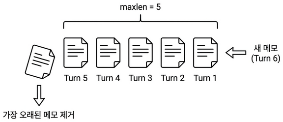
*메모장에 6번째 메모가 들어오면 가장 오래된 1번째가 빠진다. 항상 최근 5장만 유지.*

### 1.6 이번 버전에서 뭘 만드나

ex05에서는 네 가지를 추가합니다.

| 기능 | 비유 | 코드 |
|------|------|------|
| LCEL 파이프라인 | AI 비서의 업무 순서 (검색→읽기→답변) | `rag_chain.py` |
| 출처 강제 프롬프트 | "근거 문서를 대" | `RAG_SYSTEM_PROMPT` |
| 멀티턴 대화 | 최근 5장짜리 메모장 | `conversation.py` |
| 채팅 웹 UI | 창구 — 질문을 입력하면 답변이 나오는 화면 | `chat.html`, `chat.js` |

FastAPI 서버에 채팅 UI까지 붙입니다. 브라우저에서 바로 질문하실 수 있습니다.
ex04에서 재료를 다 모았습니다. 이번 챕터(ex05)에서 드디어 **요리**해 보겠습니다. 검색만 하던 시스템이 답변을 해 줄 것입니다.

<!-- [CAPTURE NEEDED: 05_rag-qa-result
  path: assets/CH05/05_rag-qa-result.png
  desc: ex05 실행 결과. 질문 "병가 쓸 때 증빙 서류가 필요한가요?"에 대한 답변 + [출처: HR_취업규칙_v1.0] 표시.
] -->
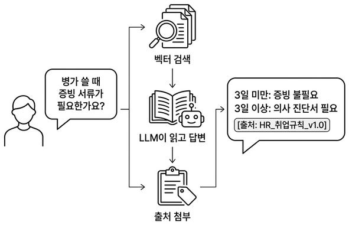
*드디어 답해준다. 문서를 검색하고, 읽어서, 출처와 함께 자연어로 답변한다.*

이제 실습으로 검색 결과를 답변으로 바꾸는 체인을 만들어 보겠습니다.


### 2.1 용어 정리

| 이야기 속 표현 | 진짜 이름 | 정의 |
|---------------|----------|------|
| 부품 + 조립 도구 | **LangChain** | LLM 애플리케이션에 필요한 부품(Retriever, Prompt, LLM, Parser)을 제공하고 파이프라인으로 조립할 수 있게 해주는 Python 프레임워크 |
| AI 비서의 업무 순서 | **LCEL 파이프라인** | LangChain Expression Language. 파이프 연산자(`\|`)로 Retriever → Prompt → LLM → Parser를 연결하는 체인 조립 방식 |
| 근거를 대 | **출처 강제(Source Grounding)** | 프롬프트에 "제공된 문서에서만 답하고 출처를 명시하라"는 제약을 거는 기법. 환각을 줄이고 답변 신뢰도를 높인다 |
| 5장짜리 메모장 | **WindowMemory** | 최근 N턴의 대화만 유지하는 슬라이딩 윈도우 방식의 대화 히스토리 관리. `deque(maxlen=k)` 기반 |
| 파이프(`\|`) | **LCEL 파이프 연산자** | `A \| B`는 A의 출력을 B의 입력으로 전달. Unix 파이프(`cat file \| grep`)와 같은 개념 |
| 메모장 관리인 | **ConversationManager** | 세션별로 WindowMemory를 관리하고, TTL 기반으로 만료된 세션을 정리하는 클래스 |

### 2.2 소스 코드 준비

이 책의 실습은 GitHub 레포를 클론해서 진행합니다.

| 레포 | 용도 | 주소 |
|------|------|------|
| **rag-start** | 실습용 (빈 파일 — 챕터 따라 코드 작성) | `https://github.com/metacoding-18-ai-applied-v4/rag-start` |
| **rag-end** | 완성 코드 (막히면 참고) | `https://github.com/metacoding-18-ai-applied-v4/rag-end` |

아직 클론하지 않으셨다면 터미널에서 아래 명령어를 실행해 보겠습니다.

```bash
git clone https://github.com/metacoding-18-ai-applied-v4/rag-start.git
cd rag-start/ex05
```

이미 클론하셨다면 `ex05` 폴더로 이동해 보겠습니다.

```bash
cd rag-start/ex05
```


### 2.3 실습 환경 구축

> 기본 환경(Python 3.12, Ollama)이 없다면 **교육자료**를 먼저 확인해 주시기 바랍니다.

CH01에서 맛보기로 썼던 LangChain을 이번 챕터에서 본격적으로 활용합니다. ex04에서는 ChromaDB와 sentence-transformers를 직접 사용했지만 ex05에서는 LangChain의 LCEL 파이프라인으로 검색, 프롬프트, LLM을 연결합니다.

```bash
cp .env.example .env
python3.12 -m venv .venv
source .venv/bin/activate  # Windows: .venv\Scripts\activate
ollama pull deepseek-r1:8b
pip install -r requirements.txt
```

| 패키지 | 버전 | 역할 |
|--------|------|------|
| `langchain` | 0.3.21 | 체인 조립 프레임워크 |
| `langchain-community` | 0.3.20 | HuggingFaceEmbeddings 등 커뮤니티 통합 |
| `langchain-ollama` | 0.2.3 | Ollama LLM 연결 |
| `langchain-openai` | 0.3.7 | OpenAI LLM 연결 (선택) |
| `langchain-chroma` | 0.2.6 | ChromaDB Retriever 래퍼 |
| `fastapi` | 0.115.8 | 웹 API 서버 |
| `uvicorn` | 0.34.0 | ASGI 서버 |

`.env` 핵심 설정:

```shell
# 사용할 LLM 제공자 (ollama 또는 openai)
LLM_PROVIDER=ollama
# Ollama에서 사용할 모델 이름
OLLAMA_MODEL=deepseek-r1:8b
# 문서 임베딩(벡터화)에 사용할 모델
EMBEDDING_MODEL=jhgan/ko-sroberta-multitask
# ChromaDB 데이터가 저장될 로컬 영구 저장소 경로
CHROMA_PERSIST_DIR=./data/chroma_db
# 질문당 검색해서 가져올 관련 문서 조각 개수
RETRIEVER_TOP_K=5
# LLM 프롬프트에 포함할 최근 대화 유지 턴(Turn) 수
CONVERSATION_WINDOW_SIZE=5
```

> **팁: LLM 선택** — 기본값은 Ollama + `deepseek-r1:8b`입니다. 이후 챕터 부터는`.env`에서 `LLM_PROVIDER=openai`로 바꾸면 GPT-4o-mini도 쓸 수 있습니다. (단, API 비용이 발생합니다. .env 파일에 OPENAI_API_KEY=sk-xxxxxx 형태로 key를 등록해서 사용하십시오.)

```
ex05/
├── run.py                  [참고] 서버 플로우 실행
├── .env                    [참고] 환경 변수
├── README.md               [참고] 프로젝트 설명서
├── requirements.txt        [참고] 의존성 목록
├── data/                   
│   ├── docs/               [참고] 원본 PDF/Word 문서 저장소
│   ├── markdown/           [참고] 마크다운 변환 문서 저장소
│   └── chroma_db/          [참고] 생성된 벡터 DB 영구 저장소
├── src/
│   ├── rag_chain.py        [실습] LCEL 파이프라인 + 출처 강제 프롬프트
│   ├── conversation.py     [실습] WindowMemory(k=5) 멀티턴 대화
│   ├── llm_factory.py      [참고] LLM 인스턴스 생성 (Ollama/OpenAI 분기)
│   ├── vectorstore.py      [참고] ChromaDB Retriever 생성 + 문서 파싱/청킹
│   ├── session_manager.py  [참고] 세션별 ConversationManager + RAG 체인 싱글턴 관리
│   └── response_parser.py  [설명] DeepSeek <think> 제거 + 출처 추출
├── templates/
│   ├── base.html           [참고] 공통 레이아웃
│   └── chat.html           [참고] 채팅 UI 페이지
├── static/
│   ├── css/chat.css        [참고] 채팅 UI 스타일
│   └── js/chat.js          [참고] 질문 전송 + 답변 렌더링
└── app/
    ├── main.py             [참고] FastAPI 앱 진입점 + UI 라우팅
    ├── chat_api.py         [설명] POST /api/chat 엔드포인트
    └── session.py          [참고] 세션 쿠키 관리
```

`[실습]` 파일에는 import와 데이터가 미리 준비되어 있습니다. 챕터를 따라 하며 TODO 부분을 하나씩 채워 넣어 보겠습니다. 막히는 부분이 있다면 rag-end의 완성 코드를 참고해 주시기 바랍니다.

### 2.4 실습 순서

1. `rag_chain.py` — RAG 파이프라인 구축
2. `conversation.py` — 멀티턴 대화 메모리
3. `chat_api.py` — API 엔드포인트 확인
4. `python run.py` — 서버 실행 + 웹 UI 테스트

핵심 코드를 먼저 작성하고 마지막에 서버를 띄워 채팅 UI에서 챗봇과 대화해 보겠습니다. 질문이 `/api/chat`으로 들어온 뒤 답변이 나가기까지 전체 흐름을 담당하는 라우터부터 살펴보겠습니다.


### 2.5 [설명] chat_api.py — POST /api/chat

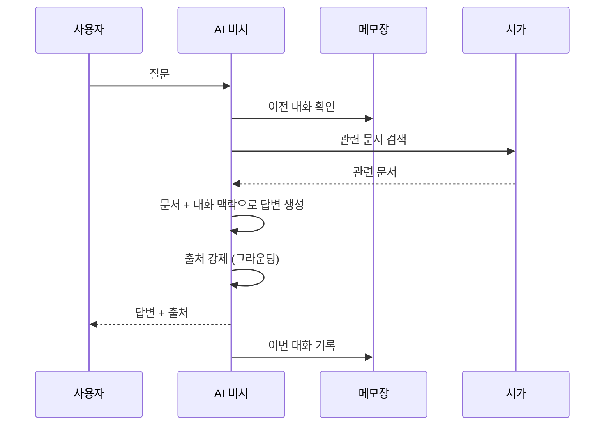

*AI 비서가 질문을 받고 → 메모장 확인 → 서가에서 문서 검색 → 답변 생성 → 출처 강제 → 메모장 기록하는 전체 흐름이다.*

이 라우터 코드는 `ex05/app/chat_api.py` 파일에 있습니다. AI 비서에게 질문을 전달하는 창구 역할입니다. 웹 브라우저나 API 클라이언트가 여기로 질문을 보냅니다.

```python
# prefix="/api"로 실제 URL은 /api/chat
router = APIRouter(prefix="/api", tags=["chat"])

@router.post("/chat")
async def chat_endpoint(body: ChatRequest, request: Request):
    # 세션 ID: 요청 본문 > 쿠키 > 신규 생성 순으로 결정
    session_id = body.session_id or get_session_id(request)

    # 대화 매니저에서 이전 대화 히스토리 조회
    conv_manager = get_conversation_manager()
    history_text = conv_manager.get_history_text(session_id)

    # RAG 체인과 Retriever 로드 (싱글턴 — session_manager.py에서 캐시 관리)
    chain, retriever = get_rag_chain()

    # Retriever로 관련 문서 검색 (출처 표시에 사용)
    docs = retriever.invoke(question)

    # LCEL 체인 실행: {"question": ..., "history": ...} 형식으로 입력
    # 체인 내부에서 question → 검색 → 포맷 → 프롬프트 → LLM 순서로 처리
    raw_answer = chain.invoke({
        "question": question,   # ① 검색 및 프롬프트에 사용
        "history": history_text,  # ② 이전 대화 맥락 주입
    })

    # 응답 구조 생성 (answer 정제 + sources 추출)
    response_data = build_response(raw_answer=raw_answer, docs=docs)

    # 세션 히스토리에 이번 대화 저장
    conv_manager.save_turn(session_id, question, response_data["answer"])
```

전체 흐름이 한눈에 들어옵니다. 세션 확인 → 히스토리 조회 → 문서 검색 → 체인 실행 → 응답 정제 → 히스토리 저장. AI 비서가 질문을 받고 → 메모장 확인하고 → 서가에서 문서 꺼내고 → 읽고 답변하고 → 메모장에 기록하는 과정과 같습니다.


### 2.6 실습 1: LCEL 파이프라인 (rag_chain.py)

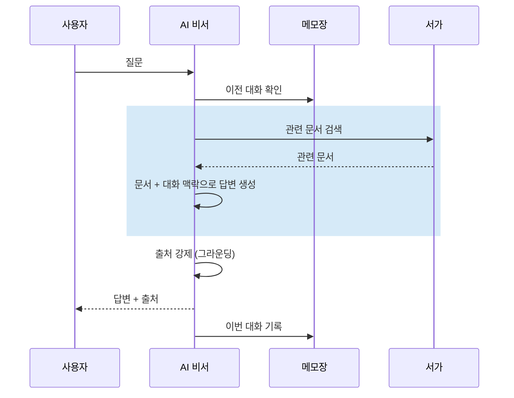

*파란색이 이번 실습에서 만드는 부분이다. 검색 → 맥락 조립 → 답변 생성 파이프라인을 LCEL로 만든다.*

`chat_api.py` 의 3~5단계에서 호출되는 파이프라인이며 이번 챕터의 핵심입니다. RAG의 핵심인 검색(Retrieval) → 생성(Generation) 흐름을 코드로 만듭니다. AI 비서의 업무 순서, 즉 질문 받기 → 문서 찾기 → 읽고 답변하기를 코드로 옮긴 것입니다. `ex05/src/rag_chain.py`를 열어 TODO의 `pass`를 지우고 아래 코드를 작성합니다.

import와 프롬프트 템플릿(`RAG_SYSTEM_PROMPT`, `RAG_HUMAN_PROMPT`)은 이미 파일에 준비되어 있습니다. "제공된 문서에서만", "출처를 명시", "모르면 모른다고". 이 세 가지가 환각을 잡는 장치입니다.

```python
# rag_chain.py — TODO: 검색된 Document를 "[문서 N] 출처: ..." 텍스트로 변환

# 1. 검색된 Document 리스트를 프롬프트에 넣을 텍스트로 변환
parts = []
for i, doc in enumerate(docs, start=1):
    source = doc.metadata.get("source", "알 수 없음")
    page = doc.metadata.get("page", "-")
    parts.append(f"[문서 {i}] 출처: {source} (p.{page})\n{doc.page_content}")
return "\n\n".join(parts)
```

```python
# rag_chain.py — TODO: build_llm()으로 LLM 생성 ~ (chain, retriever) 튜플 반환


# 1. LLM 인스턴스 생성 (llm_factory.py에서 Ollama/OpenAI 선택)
llm = build_llm()
# 2. ChromaDB에서 문서를 검색하는 Retriever 생성
retriever = build_retriever()

# 3. 시스템 프롬프트 + 사용자 프롬프트 조립
prompt = ChatPromptTemplate.from_messages([
    ("system", RAG_SYSTEM_PROMPT),
    ("human", RAG_HUMAN_PROMPT),
])

# 4. LCEL 파이프로 체인 조립 — 질문→검색→포맷→프롬프트→LLM→텍스트 추출
chain = (
    {
        "context": itemgetter("question") | retriever | _format_docs,
        "history": itemgetter("history"),
        "question": itemgetter("question"),
    }
    | prompt
    | llm
    | StrOutputParser()
)

# 5. 체인과 검색기를 함께 반환
return chain, retriever
```

`chain` 변수가 AI 비서의 업무 순서 전체입니다. `itemgetter("question") | retriever | _format_docs`가 질문으로 벡터 DB를 검색하고 문서를 텍스트로 포맷합니다. `| prompt | llm | StrOutputParser()`가 프롬프트를 완성하고 LLM을 호출합니다.

`build_llm()` 함수는 `llm_factory.py` 에 분리되어 있습니다. `.env` 의 `LLM_PROVIDER` 값에 따라 Ollama 또는 OpenAI를 선택합니다. `temperature=0.1` 로 낮춘 건 의도적입니다. Q&A 비서는 창의적인 답변이 아니라 **정확한 답변**이 필요하기 때문입니다.

`rag_chain.py` 에서 사용하는 인프라 함수는 별도 모듈로 분리되어 있습니다.

| 파일 | 함수 | 역할 |
|------|------|------|
| `llm_factory.py` | `build_llm()` | Ollama/OpenAI LLM 인스턴스 생성 |
| `vectorstore.py` | `build_retriever()` | ChromaDB Retriever 생성 (DB 없으면 자동 구축) |
| `vectorstore.py` | `_parse_and_chunk_docs()` | PDF/DOCX/XLSX 파싱 → 청킹 (CH04 로직 재사용) |


### 2.7 [설명] response_parser.py — 답변 정제

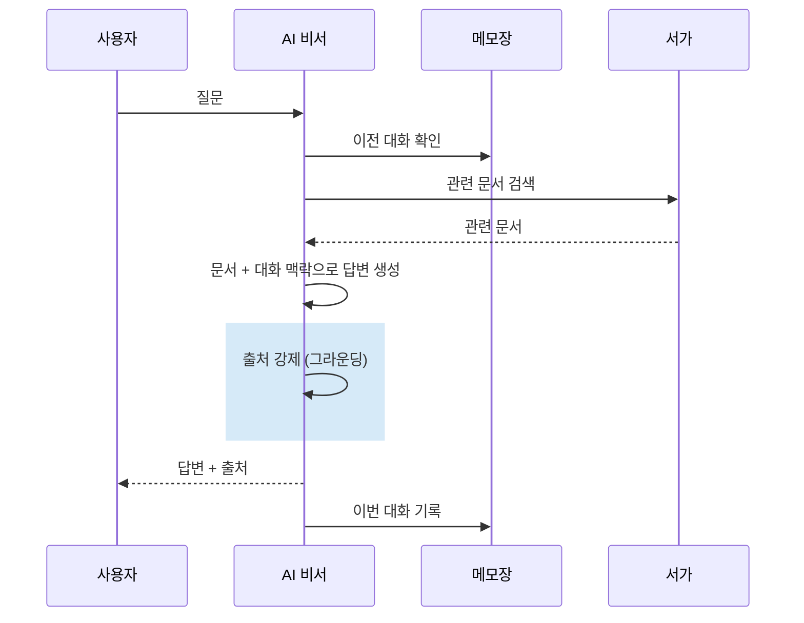

*파란색이 이번 섹션에서 설명하는 부분이다. LLM 원문에서 추론 태그를 제거하고 출처를 추출한다.*

이 코드는 `ex05/src/response_parser.py` 파일에 분리되어 있습니다. 출처 없는 답변은 근거 없는 주장입니다. 그라운딩으로 환각을 잡습니다. LLM이 내놓는 원문 응답은 깨끗하지 않을 수 있습니다. 특히 DeepSeek R1 모델은 `<think>...</think>` 태그로 추론 과정을 포함해서 내보내게 됩니다. 이걸 제거하고 깔끔한 답변만 뽑아내는 것이 이 모듈의 역할입니다.

```python
def parse_answer_text(raw_answer):
    """LLM 원문 응답에서 <think>...</think> 태그를 제거하고 답변 텍스트만 반환한다."""
    text = raw_answer
    # DeepSeek R1의 <think> 추론 토큰 제거
    text = re.sub(r"<think>.*?</think>", "", text, flags=re.DOTALL)
    text = text.strip()

    # 빈 문자열이면 기본 메시지 반환
    if not text:
        text = "답변을 생성하지 못했습니다. 다시 시도해 주세요."
    return text
```

`<think>...</think>` 태그를 통째로 지웁니다. LLM의 추론 과정은 사용자에게 보여줄 필요가 없기 때문입니다.

```
LLM 원문:  <think>연차 규정을 찾아보자...</think> 신입사원은 3년간 연차가 없습니다.
정제 후:   신입사원은 3년간 연차가 없습니다.
```

`build_response()` 함수는 정제된 답변과 출처를 하나의 딕셔너리로 묶습니다.

```python
def build_response(raw_answer, docs):
    """LLM 원문 응답과 검색 문서로부터 최종 API 응답 딕셔너리를 구성한다."""
    answer = parse_answer_text(raw_answer)
    sources = parse_sources_from_docs(docs)
    return {"answer": answer, "sources": sources}
```

API 응답 형태는 이렇습니다.

```json
{
  "answer": "3일 미만 병가는 증빙이 불필요하고, 3일 이상은 의사 진단서가 필요합니다.",
  "sources": [
    {"doc": "HR_취업규칙_v1.0", "page": 3, "snippet": "제15조(병가) 질병이나..."}
  ]
}
```


### 2.8 실습 2: 멀티턴 대화 (conversation.py)

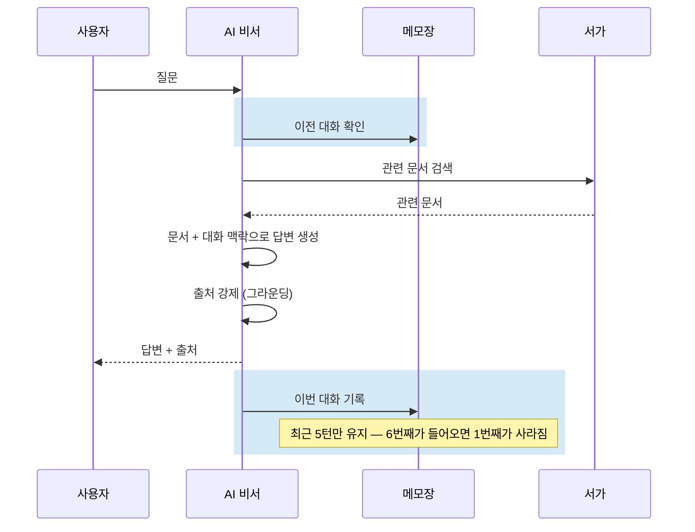

*파란색이 이번 실습에서 만드는 부분이다. 이전 대화를 기억하고 기록하는 메모장을 만든다.*

"그러면"이 무엇을 가리키는지 AI가 알려면 이전 대화를 기억해야 합니다. AI 비서의 메모장에 해당하는 `WindowMemory` 클래스입니다. `ex05/src/conversation.py`를 열어 세 TODO의 `pass`를 지우고 아래 코드를 작성합니다.

```python
# conversation.py — 세 TODO의 pass를 지우고 작성

class WindowMemory:
    def __init__(self, k=5, human_prefix="사용자", ai_prefix="AI 비서"):
        self.k = k
        self.human_prefix = human_prefix
        self.ai_prefix = ai_prefix
        self._turns = deque(maxlen=k)  # 최근 k턴만 유지, 넘치면 오래된 것부터 삭제

    def get_history(self):
        # TODO: self._turns의 (question, answer) 쌍을 순회하며
        # 1. 저장된 대화를 "사용자: 질문 / AI: 답변" 텍스트로 변환
        lines = []
        for question, answer in self._turns:
            lines.append(f"{self.human_prefix}: {question}")
            lines.append(f"{self.ai_prefix}: {answer}")
        return "\n".join(lines)

    def save_turn(self, question, answer):
        # TODO: (question, answer) 튜플을 self._turns에 추가
        # 1. 질문-답변 1턴을 메모장에 저장
        self._turns.append((question, answer))

    def clear(self):
        # TODO: self._turns 초기화
        # 1. 메모장 비우기
        self._turns.clear()
```

`deque(maxlen=k)`가 핵심입니다. `maxlen=5`면 6번째 메모가 들어올 때 1번째가 자동으로 사라집니다. `get_history()`가 반환하는 텍스트가 프롬프트의 `{history}`에 들어갑니다.

```
사용자: 병가 쓸 때 증빙 필요해?
AI 비서: 3일 미만은 불필요하고, 3일 이상은 진단서가 필요합니다.
사용자: 그러면 연차로 대체할 수 있어?
AI 비서: 네, 병가 대신 연차를 사용할 수 있습니다.
```

LLM이 이 히스토리를 보면 "그러면"이 병가를 가리킨다는 걸 이해할 수 있습니다.

`WindowMemory`를 세션별로 관리하는 기능은 `session_manager.py`에 분리되어 있습니다. `ConversationManager`는 여러 사용자(세션)의 메모장을 따로 관리하는 래퍼입니다. 세션별로 `WindowMemory`를 하나씩 만들고 TTL(기본 1시간)이 지나면 자동으로 정리합니다. AI 비서가 손님이 1시간 넘게 안 오면 메모장을 치우는 거라고 생각하면 됩니다.

| 파일 | 함수/메서드 | 역할 |
|------|------------|------|
| `session_manager.py` | `ConversationManager` | 세션별 WindowMemory 관리 + TTL 기반 만료 정리 |
| `session_manager.py` | `get_conversation_manager()` | ConversationManager 싱글턴 반환 |
| `session_manager.py` | `get_history_text(session_id)` | 해당 세션의 대화 히스토리를 텍스트로 반환 |
| `session_manager.py` | `save_turn(session_id, q, a)` | 질문-답변 1턴을 세션에 저장 |

> **주의: 메모리 기반입니다**
> `ConversationManager`의 세션 데이터는 서버 메모리에만 존재합니다. 서버를 재시작하면 대화 히스토리가 사라집니다. 실전 운영 환경에서는 Redis 같은 외부 저장소를 쓰는 게 일반적입니다. (CH07에서 운영을 위한 캐시 개념을 배우지만, 실습 환경의 복잡도를 낮추기 위해 외부 서비스(Redis) 연동 대신 인메모리 방식을 유지합니다.)

> **팁: 다른 메모리 방식도 있습니다**
> 슬라이딩 윈도우(최근 N턴 유지)는 가장 단순한 방식입니다. 대화가 길어지면 앞부분이 통째로 사라지는 단점이 있습니다. 다른 접근도 있습니다.
> - **Summary Memory** — LLM이 이전 대화를 요약해서 저장. 긴 대화도 맥락을 유지하지만 요약할 때마다 LLM을 한 번 더 호출합니다.
> - **Token Buffer Memory** — 턴 수가 아니라 토큰 수 기준으로 제한. LLM의 컨텍스트 창을 효율적으로 사용합니다.
> - **Summary Buffer Memory** — 최근 대화는 원문 그대로, 오래된 대화는 요약. 위 두 방식의 절충안입니다.
>
> 이 책에서는 구현이 간단하고 LLM 추가 호출이 없는 슬라이딩 윈도우를 씁니다.


### 2.9 실행 결과

핵심 코드를 모두 살펴봤습니다. 이제 서버를 실행하고 브라우저에서 직접 질문해 보겠습니다. FastAPI 서버를 실행해 봅니다.

```bash
# 주의: Ollama가 미리 실행되어 있어야 합니다. (ollama serve 또는 앱 실행)
# FastAPI 서버 실행
python run.py
```

<!-- [CAPTURE NEEDED: 05_server-start
  path: assets/CH05/05_server-start.png
  desc: FastAPI 서버 시작 로그. `[INFO] 서버 시작: http://0.0.0.0:8000` + `[INFO] 채팅 UI: http://localhost:8000/chat` 메시지.
] -->
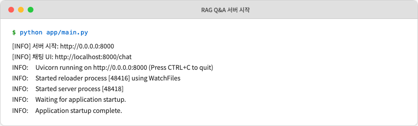
*서버가 시작되면 채팅 UI 주소가 함께 출력된다.*

브라우저에서 `http://localhost:8000/chat`을 열어 보겠습니다.

<!-- [CAPTURE NEEDED: 05_chat-ui
  path: assets/CH05/05_chat-ui.png
  desc: 채팅 UI 화면. 상단에 "RAG Q&A 채팅" 제목, 가운데 AI 환영 메시지("안녕하세요! 메타코딩 Q&A 비서입니다..."), 하단에 질문 입력창.
] -->
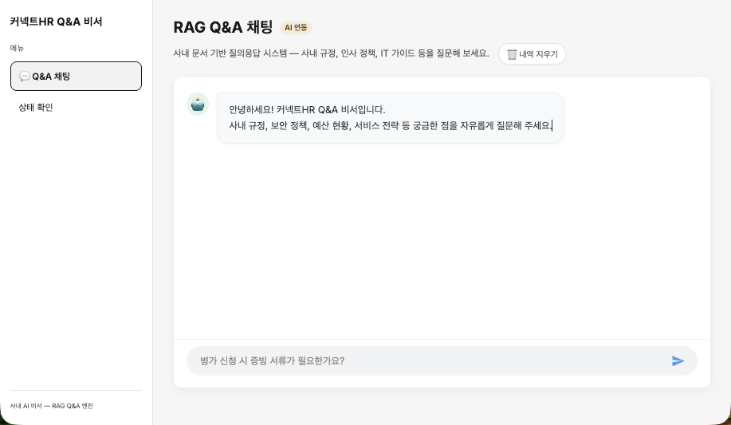
*브라우저에서 바로 질문할 수 있는 채팅 창구. AI 비서가 자리에 앉았다.*

"병가 쓸 때 증빙 서류가 필요한가요?"를 입력하고 잠시 기다려 봅니다.

> **참고: 첫 답변 대기 시간**
> 로컬 환경에서 모델을 처음 메모리에 올리고 추론하는 과정에서 약 60~120초 정도 시간이 소요될 수 있습니다. 응답이 올 때까지 조금만 기다려주세요!
<!-- [CAPTURE NEEDED: 05_chat-response
  path: assets/CH05/05_chat-response.png
  desc: 질문 입력 후 AI 답변 화면. "3일 미만은 불필요, 3일 이상은 진단서 필요" + [출처: HR_취업규칙_v1.0] 표시.
] -->
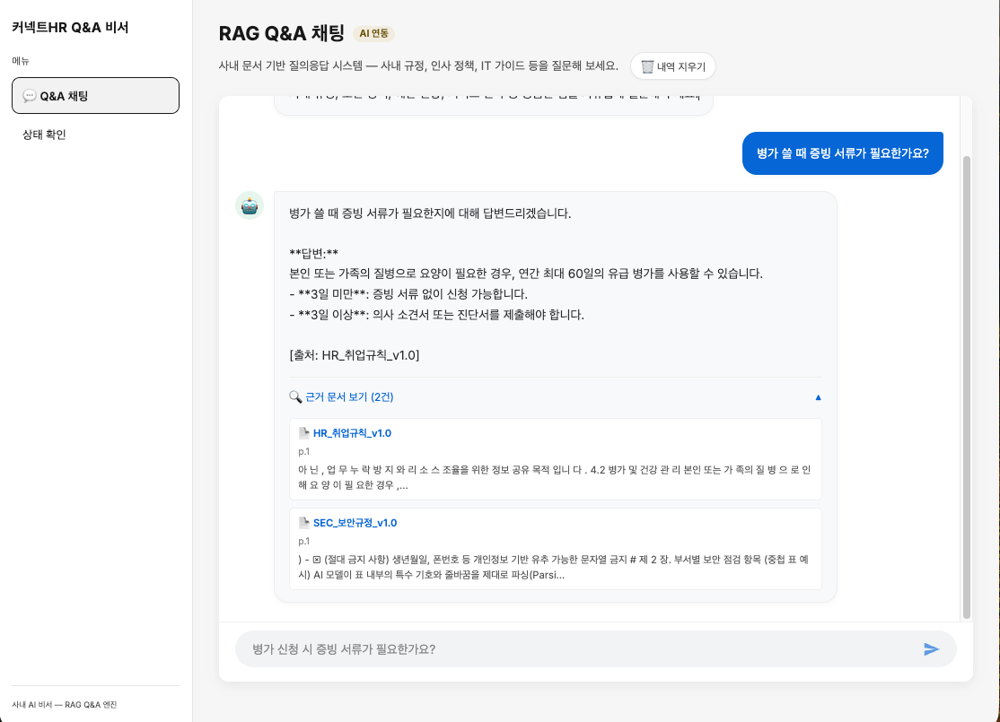
*드디어 답해준다. 문서를 검색하고, 읽어서, 출처와 함께 자연어로 답변한다.*

이어서 "그러면 연차로 대체할 수 있어?"를 입력해 봅니다. 이전 대화를 기억하고 병가 맥락을 이어서 답변합니다. AI 비서가 메모장을 보고 있다는 뜻임을 알 수 있습니다.

<!-- [CAPTURE NEEDED: 05_chat-response-followup
  path: assets/CH05/05_chat-response-followup.png
  desc: 두 번째 질문("그러면 연차로 대체할 수 있어?")에 연속해서 답변하는 AI 화면. 
] -->
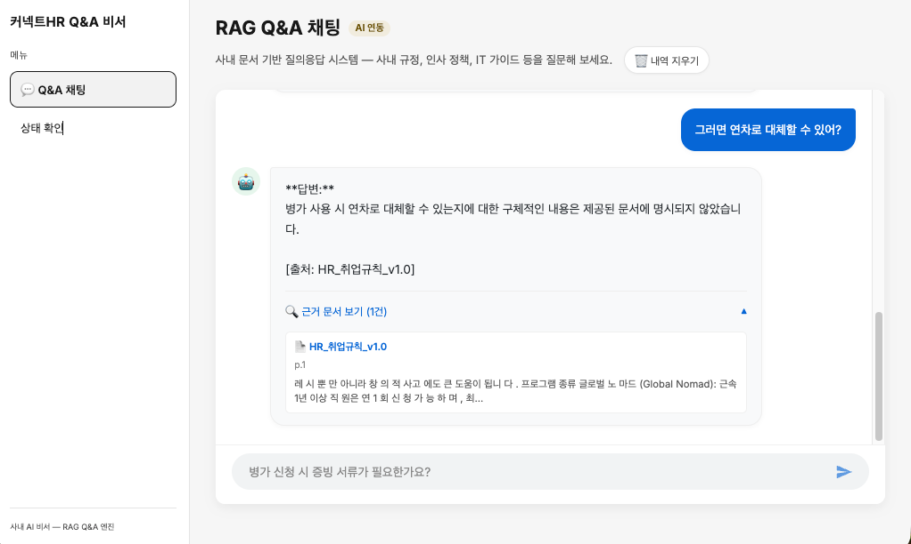
*이전 대화 맥락(병가)을 기억하고 답변을 이어나간다.*

> `Ctrl + C`를 눌러 서버를 종료해 주시기 바랍니다.


### 2.10 더 알아보기

**LCEL vs 레거시 체인** — LangChain 초기에는 `RetrievalQA`, `ConversationalRetrievalChain` 같은 미리 만들어진 체인을 썼습니다. 하지만 내부가 블랙박스라 커스터마이징이 어려웠습니다. LCEL은 각 단계를 파이프로 직접 조립하기 때문에 어디에 무슨 로직이 들어가는지 명확하게 보입니다. LangChain 0.2 이후부터는 LCEL이 권장 방식입니다.

**temperature와 RAG** — Q&A 시스템에서 `temperature=0.1`을 쓰는 건 일반적입니다. 0에 가까울수록 LLM이 확률 높은 토큰을 선택하므로 일관된 답변이 나옵니다. 반대로 창의적 글쓰기에서는 0.7~1.0을 씁니다. RAG에서 temperature를 높이면 문서에 없는 내용을 "창작"할 위험이 커집니다.

**윈도우 크기 튜닝** — `CONVERSATION_WINDOW_SIZE=5`는 최근 5턴을 기억한다는 뜻입니다. 이 숫자를 키우면 맥락을 더 많이 유지할 수 있지만 프롬프트가 길어져서 연산 비용이 올라가고 응답이 느려집니다. 상용 API 모델은 아주 큰 컨텍스트 창을 지원하므로 대화 내용을 전부 밀어 넣어도 무리 없이 동작합니다. 하지만 실습에서 쓰려는 로컬 LLM(DeepSeek-R1:8B) 환경에서는 컨텍스트 창 제한과 처리 속도를 고려하면 최근 5턴만 유지하는 슬라이딩 윈도우가 현실적인 적정선입니다.


### 2.11 이것만은 기억하세요

- **검색은 재료, 답변은 요리입니다.** 벡터 검색으로 재료(문서 조각)를 찾고 LLM이 요리(자연어 답변)로 만들어줍니다. LCEL 파이프라인이 이 레시피입니다.
- **출처 없는 답변은 근거 없는 주장입니다.** 프롬프트에 출처 강제를 넣어 환각을 잡습니다.
- 다음 챕터에서는 이 Q&A 엔진과 CH02의 사내 시스템(DB)을 합쳐서 "김대리 연차 개수와 사용 규정은?"이라는 **복합 질문**에 답하는 **통합 에이전트**를 만듭니다.
