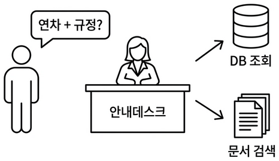
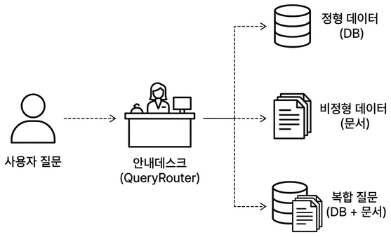
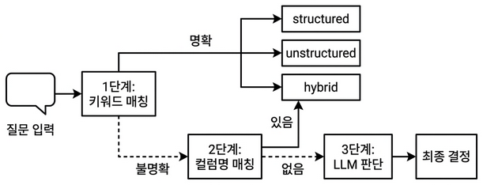
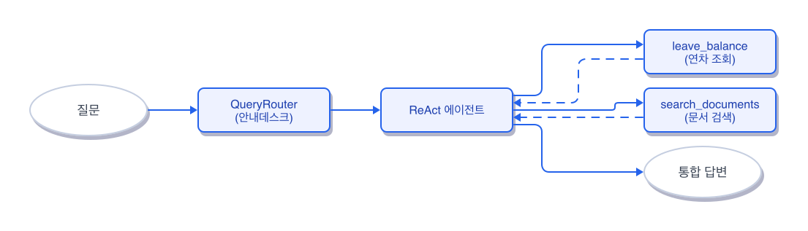
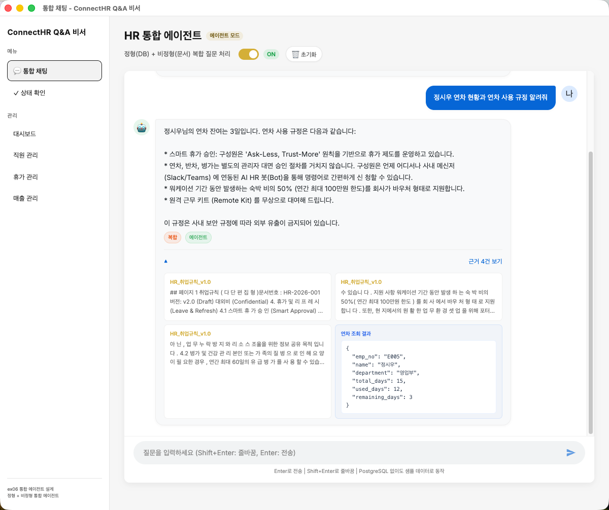
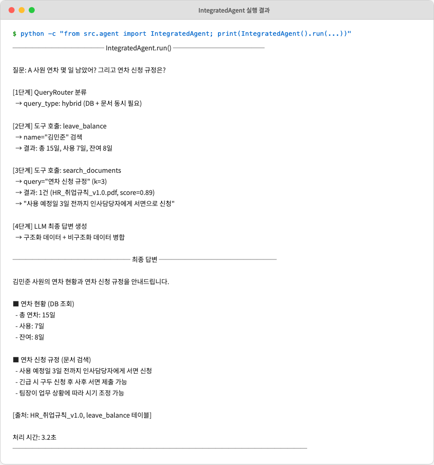

# 챕터 6 연차도 규정도 한번에. QueryRouter와 ReAct Agent

:::goal
**이번 챕터가 끝나면**

- 질문을 정형(DB) / 비정형(문서) / 복합으로 분류하는 **3단계 QueryRouter**를 만듭니다
- **@tool 데코레이터**로 DB 조회, 문서 검색을 에이전트가 선택할 수 있는 도구로 감쌉니다
- **ReAct 패턴**(Reason, Act, Observe 반복)으로 복잡한 질문을 단계적으로 해결합니다
- "A 사원 연차 며칠? 그리고 신청 절차도 알려줘" 같은 복합 질문에 한 번의 답으로 응답합니다
:::

::::prep
**준비하기**. 실습 시작 전 한 번만 설정

### 1. 실습 폴더 이동

```bash [터미널] 폴더 이동
cd rag-start/ex06
```

파일 구조는 다음과 같습니다.

```text ex06 디렉토리
ex06/
├── run.py
├── src/
│   ├── router.py          # [실습] 3단계 QueryRouter
│   ├── mcp_tools.py       # [실습] @tool 4개
│   ├── agent.py           # [실습] ReAct 에이전트 조립
│   ├── llm_factory.py     # [참고] Ollama/OpenAI 분기
│   ├── db_helper.py       # [참고] PostgreSQL + ChromaDB 헬퍼
│   └── agent_helpers.py   # [참고] 결과 파싱 유틸
├── app/
│   ├── main.py            # [참고] FastAPI 진입점
│   ├── chat_api.py        # [설명] 에이전트/RAG 모드 선택 API
│   ├── admin_views.py     # [참고] 관리자 대시보드 라우터
│   └── database.py        # [참고] PostgreSQL 연결
├── templates/             # [참고] 채팅 UI + 관리자 대시보드
└── static/                # [참고] UI 스타일
```

### 2. 실습 환경 구축

```bash [터미널] 환경 구성. macOS / Linux
cd ex06
cp .env.example .env
python3.12 -m venv .venv
source .venv/bin/activate
docker compose up -d
ollama pull llama3.1:8b
pip install -r requirements.txt
```

```bash [터미널] 환경 구성. Windows
cd ex06
copy .env.example .env
py -3.12 -m venv .venv
.venv\Scripts\activate
docker compose up -d
ollama pull llama3.1:8b
pip install -r requirements.txt
```

:::tip
**이전 챕터 Docker가 떠 있으면 포트 충돌**

챕터 2의 Docker가 실행 중이라면 `cd ex02 && docker compose down`으로 먼저 종료해 주세요. 같은 포트(5432)를 씁니다.
:::

### 3. 사용할 라이브러리

| 패키지 | 역할 |
|-------|------|
| `langchain` | 체인·에이전트 프레임워크 |
| `langchain-ollama` | Ollama LLM 연결 (Tool Calling 지원 모델 필수) |
| `langchain-chroma` · `chromadb` | 벡터 DB 래퍼·저장소 |
| `psycopg2-binary` | PostgreSQL 드라이버 |
| `fastapi` · `uvicorn` | 웹 API 서버 |

:::tip
**Tool Calling 지원 모델을 써야 합니다**

모든 Ollama 모델이 Tool Calling을 지원하지는 않습니다. 이 책에서는 `llama3.1:8b`를 씁니다 (16GB RAM에서 무리 없이 돌고 Tool Calling, 한국어 품질 균형이 좋음). `deepseek-r1`은 추론 특화라 Tool Calling을 지원하지 않으니 이 챕터에서는 피해 주세요.
:::

`.env` 핵심 상수입니다. 챕터 5에서 쓰던 `.env`와 비교해 LLM 모델이 바뀌고, DB 접속 정보가 추가됩니다.

| 상수 | 기본값 | 역할 |
|------|-------|------|
| `LLM_PROVIDER` | `ollama` | LLM 제공자 (`ollama` 또는 `openai`). 이 챕터는 Tool Calling 지원 모델만 가능 |
| `OLLAMA_MODEL` | `llama3.1:8b` | 챕터 5의 `deepseek-r1:8b`에서 변경. Tool Calling 지원 |
| `OPENAI_MODEL` | `gpt-4o-mini` | OpenAI 쓸 때 권장. Ollama보다 Tool Calling이 안정적 |
| `POSTGRES_*` | `rag_db` / `rag_user` / ... | 챕터 2에서 띄운 DB 접속 정보 |
| `CHROMA_PERSIST_DIR` | `../ex05/data/chroma_db` | 챕터 5에서 만든 벡터 DB 재사용 |
| `RETRIEVER_TOP_K` | `3` | `search_documents` 도구가 가져올 청크 수 |

### 4. 실습 순서

1. `src/router.py`. 3단계 QueryRouter
2. `src/mcp_tools.py`. @tool 4개 (연차, 매출, 직원, 문서)
3. `src/agent.py`. ReAct 에이전트 조립
4. `python run.py`. 서버 실행 후 `http://localhost:8000/chat` 에서 복합 질문 테스트
::::

## 6.1 RAG가 답 못 하는 질문


*그림 6-1. 안내데스크. 질문을 듣고 담당자에게 넘기는 통합 에이전트*

목요일 오후 4시. 사무실 창밖이 살짝 노랗게 물들고 있었습니다.

챕터 5에서 채팅 UI를 띄워 두고 동료들이 한 번씩 써 보게 했습니다. 반응이 나쁘지 않았어요. 그런데 얼마 후 다른 동료가 노트북을 들고 제 책상 앞까지 왔습니다.

**동료**: "이게 그 AI 비서예요? 한번 써봐도 되죠?"

**오픈이**: "당연하죠. 뭐든 물어보세요."

동료가 채팅창에 입력을 시작했습니다.

**동료**: "A 사원 남은 연차는? 그리고 연차 신청 절차 알려줘."

잠시 후 돌아온 답변.

```text RAG 엔진 응답
죄송합니다. 해당 직원에 대한 정보를 찾지 못했습니다.
```

**동료**: "직원 이름도 모르는 AI 비서예요?"

*아…*

RAG는 사내 문서에서 'A 사원'을 찾으려 했습니다. 당연히 없죠. 직원 연차 정보는 문서가 아니라 **PostgreSQL DB**에 있습니다. 챕터 2에서 저장해 둔 데이터요. 문서 검색이 아니라 DB 조회가 필요한 질문인데, AI 비서는 그 차이를 몰랐습니다.

## 6.2 정형 데이터와 비정형 데이터

지금 만들어 둔 것을 정리하면:

- **챕터 2**: 직원, 연차, 매출을 PostgreSQL에 저장하는 API
- **챕터 4~5**: 사내 문서를 벡터 DB에 넣고 검색, 답변하는 RAG 엔진

둘이 따로 놀고 있습니다. AI 비서는 RAG만 쓸 줄 알지 DB에 접근하는 법을 모릅니다.

| 질문 | 경로 |
|------|------|
| "A 사원 연차 몇 개?" | PostgreSQL 조회 (정형) |
| "연차 신청 절차?" | 취업규칙 문서 검색 (비정형) |
| "A 사원 연차 + 신청 절차?" | 둘 다 (복합) |

진짜 비서가 되려면 이 둘을 상황에 맞게 고르거나, 필요하면 동시에 써야 합니다.

## 6.3 안내데스크 구조

회사 건물 1층 안내데스크를 떠올려 보세요.

**방문자**: "인사 관련 서류는 어디서 받아요?"
**안내데스크**: "인사팀은 3층이에요. 엘리베이터 내리시면 오른쪽입니다."

며칠 후 복잡한 질문.

**방문자**: "신입 교육 신청이랑, 노트북 배정은 어디서 해요?"
**안내데스크**: "교육 신청은 3층 인사팀, 노트북은 2층 IT 지원팀이에요. 두 곳 다 가셔야 해요."

안내데스크는 질문을 듣고 어떤 부서 소관인지 파악해 담당자를 연결합니다. 복합 질문이면 여러 부서로 동시에 안내합니다.


*그림 6-2. 사용자 질문을 목적지에 맞게 담당자에게 배정하는 안내데스크*

AI 비서도 같은 구조가 됩니다. 질문을 보고 DB가 필요한지 문서가 필요한지 둘 다인지 판단합니다. 판단 후 각 담당자(도구)에게 작업을 맡기고 결과를 하나로 묶어 답합니다. 이번 챕터의 **통합 에이전트**가 이 안내데스크입니다.

## 6.4 QueryRouter: 3단계 질문 분류

에이전트 안에는 **QueryRouter**라는 판단 규칙이 들어갑니다. 모든 질문은 3단계를 거치는데, 베테랑 안내 직원이 일하는 방식과 같습니다.

**1단계. 키워드 매칭 (빠르고 확실)**
- "연차", "매출"이 들리면 DB(정형)
- "절차", "규정"이 들리면 문서(비정형)
- 둘 다 들리면 복합

**2단계. 컬럼명 매칭 (전문 용어)**
개발자가 쓴 `remaining_days`, `emp_no` 같은 DB 컬럼명이 섞여 있는지 확인. 있으면 DB로.

**3단계. LLM 판단 (최후의 수단)**
단어만으로 모르겠으면 LLM에게 직접 물어 최종 경로를 결정.

대부분 질문은 1단계에서 끝납니다. 2, 3단계는 예비책입니다. 쉬운 건 빠르게, 어려운 것만 시간 들여 고민하는 구조예요.


*그림 6-3. QueryRouter 3단계 흐름. 단계마다 결론이 나면 바로 다음 단계를 건너뜁니다*

## 6.5 Tool: @tool 데코레이터

안내데스크 뒤에는 실제로 일하는 **담당자(도구)** 들이 있습니다. 우리는 네 명을 준비합니다.

| 도구 | 역할 | 데이터 원천 |
|-----|------|------------|
| `get_leave_balance` | 특정 직원 연차 잔여일 | PostgreSQL `leave_balances` |
| `get_sales_sum` | 부서·기간별 매출 합계 | PostgreSQL `sales` |
| `list_employees` | 이름·부서로 직원 목록 | PostgreSQL `employees` |
| `search_documents` | 문서 기반 질문 답변 | ChromaDB (챕터 4~5 파이프라인) |

LangChain은 평범한 Python 함수에 `@tool` 데코레이터만 붙이면 에이전트가 호출 가능한 도구로 승격시켜 줍니다. 함수 시그니처, docstring이 그대로 LLM에게 전달돼 "이 도구가 무슨 일 하는지, 인자는 무엇인지"를 LLM이 읽고 스스로 고릅니다.

## 6.6 ReAct 패턴: Reason, Act, Observe 반복

안내 직원은 복합 질문에 한 번에 답하지 않습니다. 머릿속에서 다음 루프를 돕니다.

1. **Reason (추론)**. "연차 잔여일이 먼저 필요하겠네. 그다음 신청 절차."
2. **Act (행동)**. `get_leave_balance(emp_no="E003")` 호출
3. **Observe (관찰)**. "총 15일, 잔여 8일이 돌아왔군"
4. **Reason**. "이제 신청 절차를 문서에서 찾자"
5. **Act**. `search_documents(query="연차 신청 절차")`
6. **Observe**. "그룹웨어 → 근태관리 → 연차신청"
7. **최종 답변 생성**

이 Reason, Act, Observe 반복이 **ReAct 패턴**입니다. LangChain의 `create_tool_calling_agent` + `AgentExecutor`가 루프를 자동으로 돌려 줍니다.


*그림 6-4. ReAct 루프. 도구를 한 번 호출할 때마다 Observe 후 다음 Reason으로 돌아갑니다*

## 6.7 실습 1: router.py: 3단계 QueryRouter

`ex06/src/router.py` 상단에는 세 상수가 이미 준비돼 있습니다. 1, 2단계 매칭의 **사전**이에요. 실제 내용을 먼저 눈으로 보고 넘어갑니다.

```python [설명] ex06/src/router.py. 판단 기준 키워드 (상수)
STRUCTURED_KEYWORDS = [
    "잔여", "잔량", "연차", "휴가", "남은", "며칠",
    "매출", "합계", "총액", "금액", "얼마", "실적",
    "목록", "명단", "직원", "사원", "리스트", "조회",
    "통계", "평균", "부서별", "합산", "입사일",
]

UNSTRUCTURED_KEYWORDS = [
    "절차", "방법", "어떻게", "규정", "정책", "기준",
    "온보딩", "가이드", "매뉴얼", "복지", "혜택",
    "보안", "출장", "비용", "설명해", "무엇인가",
]

SCHEMA_TERMS = {
    "remaining_days": "structured", "used_days": "structured",
    "total_days": "structured",     "amount": "structured",
    "emp_no": "structured",         "department": "structured",
    "hire_date": "structured",
}
```

정형은 **숫자·조회 중심 단어**, 비정형은 **절차·방법 중심 단어**. `SCHEMA_TERMS`는 개발자가 실수로 컬럼명을 섞어 쓸 때를 대비한 보조 사전입니다. `"알려줘"`, `"뭐야"` 같은 **범용 어미는 일부러 뺐어요** — 어느 질문에나 붙을 수 있어 판별력이 없기 때문입니다.

이제 `QueryRouter` 클래스의 네 메서드 TODO를 채웁니다. 공개 인터페이스 `classify_query`와 내부 `_step1/2/3`.

```python [실습 1] ex06/src/router.py. 3단계 순차 분류
def classify_query(self, query):
    # TODO: classify_query. 3단계로 질문 분류 (키워드 → 스키마 → LLM)
    # 1. 규칙 기반 키워드 매칭
    step1_result = self._step1_rule_based(query)
    if step1_result is not None:
        return step1_result
    # 2. DB 스키마 컬럼명 매칭
    step2_result = self._step2_schema_based(query)
    if step2_result is not None:
        return step2_result
    # 3. LLM 판단 (폴백)
    if self._llm is not None:
        step3_result = self._step3_llm_based(query)
        if step3_result is not None:
            return step3_result
    # 4. 기본값: 비정형으로 처리
    return "unstructured"
```

1단계는 정형/비정형 키워드 히트 수를 비교합니다. 양쪽 모두 히트면 2배 이상 우세한 쪽을 고르고, 아니면 `hybrid`입니다.

```python [실습 1] ex06/src/router.py. _step1_rule_based
def _step1_rule_based(self, query):
    # TODO: _step1_rule_based. 키워드 매칭으로 경로 결정
    query_lower = query.lower()
    structured_hits = sum(1 for kw in STRUCTURED_KEYWORDS if kw in query_lower)
    unstructured_hits = sum(1 for kw in UNSTRUCTURED_KEYWORDS if kw in query_lower)

    if structured_hits > 0 and unstructured_hits > 0:
        if structured_hits > unstructured_hits * 2:
            return "structured"
        if unstructured_hits > structured_hits * 2:
            return "unstructured"
        return "hybrid"
    if structured_hits > 0:
        return "structured"
    if unstructured_hits > 0:
        return "unstructured"
    return None
```

2단계는 `emp_no`, `remaining_days` 같은 DB 컬럼명이 질문에 섞여 있는지 확인합니다.

```python [실습 1] ex06/src/router.py. _step2_schema_based
def _step2_schema_based(self, query):
    # TODO: _step2_schema_based. DB 컬럼명 매칭으로 경로 결정
    query_lower = query.lower()
    for term in SCHEMA_TERMS:
        if term in query_lower:
            return SCHEMA_TERMS[term]
    return None
```

3단계는 두 단계로도 결정 못 한 질문만 LLM에 맡깁니다. JSON으로 `{"route": "...", "reason": "..."}` 형식을 강제해 파싱 안정성을 높입니다.

```python [실습 1] ex06/src/router.py. _step3_llm_based
def _step3_llm_based(self, query):
    # TODO: _step3_llm_based. LLM에게 질문 분류 위임
    prompt = f"""다음 질문을 아래 세 가지 유형 중 하나로 분류하세요.

질문: {query}

유형:
- structured: 숫자, 통계, 목록 등 데이터베이스 조회가 필요한 질문
- unstructured: 절차, 정책, 설명 등 문서 검색이 필요한 질문
- hybrid: 두 가지가 모두 필요한 복합 질문

반드시 JSON 형식으로만 답하세요:
{{"route": "structured|unstructured|hybrid", "reason": "한 줄 근거"}}"""

    response = self._llm.invoke(prompt)
    content = response.content if hasattr(response, "content") else str(response)
    content = re.sub(r"<think>.*?</think>", "", content, flags=re.DOTALL).strip()
    json_match = re.search(r"\{.*\}", content, re.DOTALL)
    if json_match:
        parsed = json.loads(json_match.group())
        route = parsed.get("route", "unstructured")
        if route in ("structured", "unstructured", "hybrid"):
            return route
    return None
```

## 6.8 실습 2: mcp_tools.py: @tool 4개

`src/mcp_tools.py`에 네 개의 함수가 스켈레톤으로 있습니다. `@tool`과 docstring, 인자를 채웁니다.

```python [실습 2] ex06/src/mcp_tools.py. @tool 데코레이터
@tool
def get_leave_balance(emp_no: str, year: int = 2025) -> dict:
    """주어진 사번(emp_no)의 해당 연도 연차 잔여일수를 반환합니다.
    인자:
        emp_no: 사번 (예: E003)
        year: 조회 연도 (기본 2025)
    반환: {'total_days': int, 'used_days': int, 'remaining_days': int}
    """
    # TODO: PostgreSQL에서 leave_balances 테이블 조회
    with db_connection() as conn:
        row = conn.execute(
            "SELECT total_days, used_days, remaining_days FROM leave_balances "
            "WHERE emp_no=%s AND year=%s", (emp_no, year)
        ).fetchone()
    return dict(row) if row else {"error": "해당 직원 정보를 찾을 수 없습니다."}


@tool
def search_documents(query: str, top_k: int = 3) -> list[dict]:
    """사내 규정·정책 문서에서 의미 기반으로 관련 청크를 검색합니다."""
    # TODO: ChromaDB Retriever로 검색
    docs = vectorstore.similarity_search(query, k=top_k)
    return [{"source": d.metadata["file_name"], "content": d.page_content} for d in docs]
```

나머지 두 개(`get_sales_sum`, `list_employees`)도 같은 방식으로 채웁니다. 도구의 docstring이 **LLM의 판단 근거**가 되므로 "이 도구는 언제 써야 하는가"를 명확히 써 주세요.

:::term-box
**MCP Tools? Tool?** 이 책에서는 LangChain `@tool`로 만든 함수를 포괄해 **MCP Tools**라고 부릅니다. Model Context Protocol의 의미를 확장해 "AI가 호출 가능한 도구 계층"이라는 개념적 명칭으로 씁니다. 구현 수단은 LangChain의 Tool Calling입니다.
:::

## 6.9 실습 3: agent.py: ReAct 에이전트 조립

`src/agent.py`에 에이전트 조립 TODO가 있습니다. `create_tool_calling_agent` + `AgentExecutor`로 ReAct 루프를 만듭니다.

```python [실습 3] ex06/src/agent.py. ReAct 에이전트
# TODO: 도구 + LLM + 프롬프트로 에이전트 생성
tools = [get_leave_balance, get_sales_sum, list_employees, search_documents]

system_prompt = """당신은 사내 AI 비서 '커넥트HR 에이전트'입니다.
질문을 분석해 필요한 도구를 고르고, 결과를 모아 자연어로 답변하세요.
DB에서 얻은 수치와 문서에서 얻은 절차를 함께 제시해도 됩니다.
답변 마지막에는 사용한 출처(파일명 또는 테이블명)를 명시하세요."""

prompt = ChatPromptTemplate.from_messages([
    ("system", system_prompt),
    MessagesPlaceholder("history", optional=True),
    ("human", "{question}"),
    MessagesPlaceholder("agent_scratchpad"),
])

agent = create_tool_calling_agent(llm, tools, prompt)
executor = AgentExecutor(agent=agent, tools=tools, verbose=True, max_iterations=6)
```

등장한 LangChain 부품 세 개를 한 줄씩 정리합니다.

| 부품 | 역할 |
|-----|------|
| `create_tool_calling_agent(llm, tools, prompt)` | LLM·도구·프롬프트를 묶어 "판단만 하는" 에이전트 코어 생성. 도구 호출 결정까지만 책임짐 |
| `AgentExecutor(agent, tools, ...)` | 에이전트 코어를 받아 **ReAct 루프를 실제로 돌리는** 실행기. 도구 호출, 결과 주입, 다음 판단 요청을 반복. `max_iterations`로 무한 루프 방지 |
| `MessagesPlaceholder("agent_scratchpad")` | ReAct 루프의 **메모장**. 각 Reason·Act·Observe 단계가 여기에 쌓이고, 에이전트가 매 턴 이전 기록을 참고해 다음 결정을 내림 |

"LLM이 도구를 한 번 고르는 것"과 "복잡한 질문을 풀기 위해 도구를 여러 번 반복 호출하는 것"은 다릅니다. 전자는 `create_tool_calling_agent`만으로 되지만, 후자는 `AgentExecutor`가 루프를 돌려야 가능해요. `agent_scratchpad`는 그 루프의 기억 창구입니다.

## 6.10 서버 실행 + 복합 질문 테스트

```bash [터미널] 서버 실행
python run.py
```

브라우저에서 `http://localhost:8000/chat`을 엽니다. 이번엔 모드 토글이 생겼어요. **Agent 모드**로 바꾼 뒤 동료가 처음 했던 복합 질문을 던져 봅니다.

**동료**: "A 사원 연차 며칠 남았어요? 그리고 연차 신청 절차도 알려주세요."


*그림 6-5. 복합 질문에 대한 답변. DB에서 숫자를 꺼내고 문서에서 절차를 찾아 한 답으로 정리합니다*

에이전트가 내부에서 `get_leave_balance` → `search_documents` 순으로 도구를 호출하고, 결과를 묶어 자연어로 답변한 모습입니다.


*그림 6-6. 터미널 `verbose=True` 로그. Reason, Act, Observe 루프가 실제로 돌아가는 모습*

**동료**: "이제 진짜 비서 같은데요."

## 6.11 전체 구성도에서 챕터 6의 자리

<div class="arch-fullmap">
  <div class="arch-fullmap-title">전체 구성도. 짙은 박스가 챕터 6 범위</div>

  <div class="afm-row afm-user">
    <div class="afm-box afm-faint afm-round"><div class="afm-label">사내 직원 · 관리자</div></div>
  </div>

  <div class="afm-zone">
    <span class="afm-zone-ch">챕터 2</span>
    <span class="afm-zone-label">대시보드</span>
    <div class="afm-row">
      <div class="afm-box afm-faint"><div class="afm-label">FastAPI</div><div class="afm-sub">REST API · 관리자 웹</div></div>
    </div>
  </div>

  <div class="afm-zone">
    <span class="afm-zone-ch">챕터 6</span>
    <span class="afm-zone-label">오케스트레이션</span>
    <div class="afm-row afm-three">
      <div class="afm-box afm-on"><div class="afm-tag">오늘 만든 부분</div><div class="afm-label">Query Router</div><div class="afm-sub">규칙·스키마·LLM</div></div>
      <div class="afm-box afm-on"><div class="afm-tag">오늘 만든 부분</div><div class="afm-label">LCEL Agent Chain</div><div class="afm-sub">ReAct 패턴</div></div>
      <div class="afm-box afm-on"><div class="afm-tag">오늘 만든 부분</div><div class="afm-label">MCP Tools</div><div class="afm-sub">DB 조회 · 문서 검색</div></div>
    </div>
  </div>

  <div class="afm-zone">
    <span class="afm-zone-ch">챕터 5</span>
    <span class="afm-zone-label">검색 (실시간)</span>
    <div class="afm-row">
      <div class="afm-box afm-faint"><div class="afm-label">LCEL Chain</div><div class="afm-sub">검색기 → 프롬프트 → LLM</div></div>
    </div>
  </div>

  <div class="afm-zone">
    <span class="afm-zone-ch">챕터 4</span>
    <span class="afm-zone-label">파싱·벡터화 (오프라인)</span>
    <div class="afm-row afm-three">
      <div class="afm-box afm-faint afm-dashed"><div class="afm-label">챕터 3 문서 규칙</div><div class="afm-sub">PDF·Word·Excel·HWP</div></div>
      <div class="afm-box afm-faint"><div class="afm-label">Doc Pipeline</div><div class="afm-sub">파싱·청킹·임베딩</div></div>
      <div class="afm-box afm-faint"><div class="afm-label">ChromaDB</div><div class="afm-sub">벡터 저장소</div></div>
    </div>
  </div>

  <div class="afm-zone">
    <span class="afm-zone-ch">챕터 2</span>
    <span class="afm-zone-label">데이터</span>
    <div class="afm-row">
      <div class="afm-box afm-faint"><div class="afm-label">PostgreSQL</div><div class="afm-sub">직원·연차·매출</div></div>
    </div>
  </div>

  <div class="afm-row afm-ext">
    <div class="afm-box afm-faint afm-dashed"><div class="afm-label">Ollama LLM (외부)</div></div>
  </div>

  <div class="afm-note">
    오늘 채운 건 <b>Query Router, LCEL Agent Chain, MCP Tools</b> 세 박스입니다. 위쪽 사용자 입력부터 아래쪽 데이터, 문서 저장소까지 전 구간이 하나로 연결됐어요. 챕터 7에서는 이 에이전트를 실제 운영에 올렸을 때 생기는 속도, 비용 문제를 ResponseCache와 TokenTracker로 잡습니다.
  </div>
</div>

## 용어 정리

| 본문 속 표현 | 진짜 용어 | 정식 정의 |
|-------------|---------|----------|
| "안내데스크 전체" | **에이전트 (Agent)** | 질문을 받아 스스로 판단하고 도구를 선택·실행해 답변을 만드는 자율 프로그램 |
| "안내데스크 분류 기준" | **QueryRouter** | 질문을 분석해 처리 경로(structured·unstructured·hybrid)를 결정하는 분류기 |
| "담당자" | **도구 (Tool)** | `@tool` 데코레이터로 감싼 함수. 에이전트가 선택 실행하는 원자 작업 단위 |
| "생각 → 행동 → 관찰" | **ReAct 패턴** | Reason·Act·Observe 반복으로 복잡 질문을 단계적 해결하는 에이전트 전략 |
| "반복 실행기" | **AgentExecutor** | ReAct 루프를 돌리고 도구 호출을 관리하는 LangChain 컴포넌트 |

:::remember
**이것만은 기억하자**

- **문서 검색만으론 진짜 비서가 될 수 없습니다.** 정형 데이터(DB)와 비정형 데이터(문서)를 한 에이전트에서 통합해야 "연차 며칠?", "신청 절차?", "둘 다"를 모두 답할 수 있습니다.
- **QueryRouter는 단순 → 정교 순서로 판단합니다.** 키워드 → 컬럼명 → LLM. 쉬운 건 빨리, 어려운 것만 비용을 들여 판단하는 계층 구조입니다.
- **ReAct 루프가 복합 질문을 풉니다.** Reason, Act, Observe 반복으로 에이전트가 도구를 여러 번 호출하고 결과를 묶어 한 답으로 돌려 줍니다. 챕터 7에서는 이 에이전트의 속도, 비용을 잡는 운영 기술을 다룹니다.
:::
