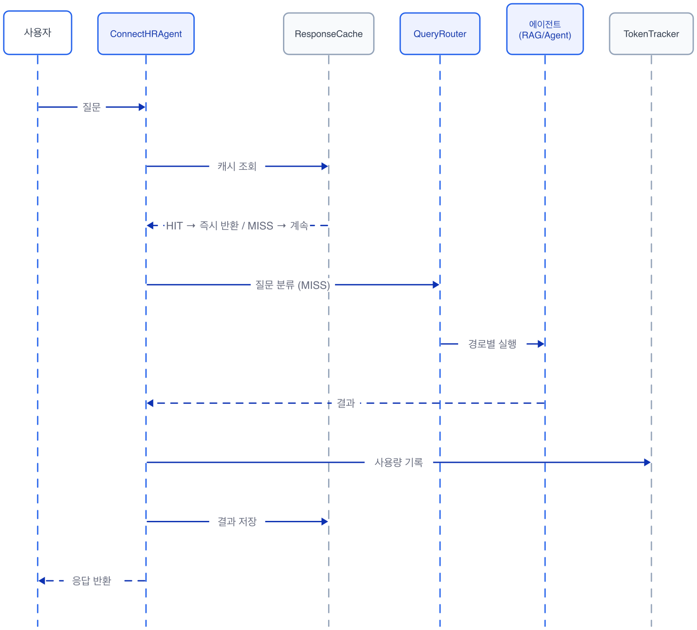
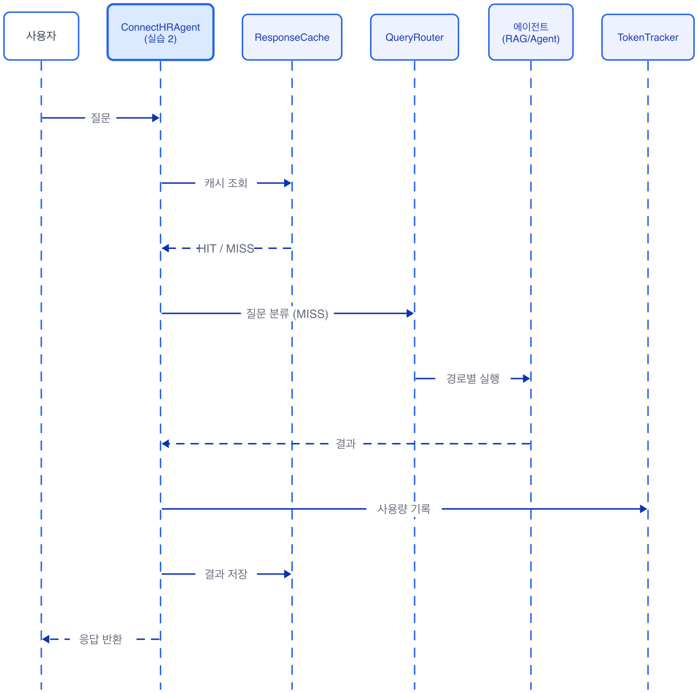

# Ch.7: 캐시와 모니터링 (ex07)

> 한 줄 요약: 통합 에이전트에 메모장과 업무 일지를 달아, 같은 질문엔 바로 답하고 하루 사용량을 기록한다.
> 핵심 개념: ResponseCache(TTL), EmbeddingCache, TokenTracker, ConnectHRAgent


<!-- [GEMINI PROMPT: 07_chapter-opening]
path: assets/CH07/07_chapter-opening.png
A minimalist black and white technical diagram with a strict 16:9 aspect ratio
on a solid white background. No shading, no 3D effects, only clean thin line art.
The entire assembly of icons, lines, and text is perfectly centered globally
within the 16:9 frame, leaving generous and equal white space on all sides.

Center: a minimalist line-art reception desk icon (same as CH06)
with a small notebook icon on the desk labeled '메모장'.
Left: a clock icon with circular arrow labeled 'TTL 1h'.
Right: a clipboard icon with checkmarks labeled '업무 일지'.
Below the desk: a retry arrow (circular) with '3x' label.
Style: scene-opener
-->


*팀원이 실제로 사용하면서 드러나는 속도 문제와 운영 사각지대를 마주합니다*

## 사서에게 메모장이 필요해졌다

### 1.1 일주일 뒤, 불만이 시작되다

CH06에서 통합 에이전트를 완성했습니다. 질문을 분류하고 도구를 골라 실행하는 AI 비서. 동료도 "이제 진짜 비서 같은데요"라고 했습니다. 오픈이는 자리에 앉아 모니터를 바라보며 속으로 작은 보람을 느꼈습니다.

일주일이 흘렀습니다.

오전 10시. 슬랙 알림이 연달아 울립니다. 오픈이가 채널을 열었습니다.

**동료**: "병가 증빙 서류 뭐가 필요한지 아까도 물어봤는데, 또 물어보니까 또 20초 걸리네요."

20초. 커서만 깜빡이는 화면을 바라보며 기다리는 20초는 꽤 깁니다.

*같은 질문인데 왜 매번 처음부터 찾는 거야...*

**동료**: "우리 팀에서 하루에 30번은 쓰는 것 같은데, 얼마나 쓰고 있는 건지 파악이 안 돼요."

오픈이가 터미널을 열어 로그를 뒤져봤습니다. 호출 횟수나 응답 시간을 정리해둔 곳이 없었습니다. 하루에 몇 건 처리하는지, 평균 응답 시간이 얼마인지. 아무 기록도 없었습니다.

문제는 또 있었습니다. 간간이 슬랙에 올라오는 "에러가 났어요" 메시지. 확인해 보면 네트워크 타임아웃이거나 LLM 파싱 실패. 잠깐 뒤에 다시 물어보면 정상인데 사용자 입장에서는 "고장났다"고 느낄 수밖에 없죠. ex06의 에이전트는 에러가 한 번 나면 그대로 멈춰버렸습니다.


### 1.2 캐시 -- 사서의 메모장 두 권

오픈이가 팀장 자리로 갔습니다. 노트북 화면에 슬랙 불만 메시지를 띄워 보여줬습니다.

**팀장**: "같은 질문에 매번 서가를 뒤지는 사서가 있으면 어떻겠어?"

**오픈이**: "비효율적이죠."

**팀장**: "그럼 뭐가 필요해?"

잠시 생각했습니다.

*메모장. 한 번 찾은 답을 적어두는 메모장이 있으면 되잖아.*

오픈이가 화이트보드에 펜을 잡았습니다. 마커 뚜껑을 딸깍 열고 네모 두 개를 그렸습니다.

첫 번째 메모장. 누군가 "병가 증빙 서류가 뭐예요?"라고 물었습니다. 사서가 서가를 뒤져서 답을 찾았습니다. 그 답을 메모장에 적어둡니다. 30분 뒤에 같은 질문이 또 오면 서가에 가지 않고 메모장을 읽어줍니다. 다만 메모장에는 유통기한이 있습니다. 규정이 바뀌었을 수도 있으니까요. 1시간이 지나면 메모를 지우고 다시 서가에서 찾아옵니다.

두 번째 메모장. 사서가 문서를 검색하려면 질문 문장을 숫자 배열로 바꿔야 합니다. 이 변환에도 시간이 걸리는데, 같은 문장을 매번 다시 변환할 필요는 없습니다. 한 번 계산한 결과를 파일에 적어두면 다음에는 바로 꺼내 씁니다.

**팀장**: "그 메모장에 유통기한을 붙이는 게 핵심이야. 너무 오래된 메모를 읽어주면 안 되니까."

<!-- [GEMINI PROMPT: 07_cache-concept]
path: assets/CH07/gemini/07_cache-concept.png
A minimalist black and white technical diagram with a strict 16:9 aspect ratio
on a solid white background. No shading, no 3D effects, only clean thin line art.
The entire assembly of icons, lines, and text is perfectly centered globally
within the 16:9 frame, leaving generous and equal white space on all sides.

Two side-by-side diagrams:
Left diagram labeled '답변 메모장 (ResponseCache)':
  A question bubble '병가 증빙?' with arrow to a box '메모장 조회',
  dashed arrow labeled 'HIT → 바로 답변' going right to answer bubble,
  solid arrow labeled 'MISS → 서가에서 찾기' going down to bookshelf icon then up to answer.
  A small clock showing 'TTL: 1h' with label '유통기한'.
Right diagram labeled '임베딩 메모장 (EmbeddingCache)':
  A text box '연차 규정' with arrow to a box '파일 조회',
  dashed arrow labeled 'HIT → 파일 로드' going right to vector icon [0.12, 0.87, ...],
  solid arrow labeled 'MISS → 변환 계산' going down to model icon then up to vector.
  Label below: '유통기한 없음 (영구 보관)'.
Style: concept-diagram
-->

*같은 질문이 또 오면 서가에 가지 않고 메모장을 읽어줍니다. 임베딩 변환 결과도 파일로 보관합니다.*

오픈이가 고개를 끄덕였습니다.


### 1.3 TokenTracker와 Retry -- 업무 일지와 재시도 매뉴얼

동료의 두 번째 불만이 떠올랐습니다. "얼마나 쓰고 있는 건지 파악이 안 돼요."

**오픈이**: "사용량 추적이 안 되고 있어요. 하루에 몇 건 처리하는지, 응답 시간이 평균 얼마인지 아무것도 모릅니다."

**팀장**: "사서한테 업무 일지를 쓰게 해."

업무 일지. 매 질문마다 한 줄씩 기록을 남기는 겁니다. 몇 시에 어떤 질문을 받았고 응답에 몇 초 걸렸는지. 토큰을 얼마나 사용했는지. 이 기록이 쌓이면 "이번 주 평균 응답 시간이 얼마야?"에 답할 수 있게 됩니다.

*로컬 모델이니까 비용은 0원이지만, 응답 시간이랑 사용량은 알아야 하잖아.*

지금은 Ollama라서 비용은 0원이지만, 토큰 수와 응답 시간을 기록해두는 습관이 먼저입니다.

에러 문제도 간단합니다. 사서에게 매뉴얼 한 장을 주면 됩니다. "한 번 실패하면 3번까지 다시 시도해. 시도 사이에는 2초씩 쉬고." 네트워크가 잠깐 끊기거나 모델이 과부하에 걸리는 일시적 문제는 잠깐 뒤에 재시도하면 대부분 풀립니다.


### 1.4 ConnectHRAgent -- 세 가지를 달아보다

화이트보드에 정리한 내용을 코드로 옮기기 시작합니다. 메모장 두 개, 업무 일지 하나, 재시도 매뉴얼 하나.

*오, 이거면 불만이 싹 사라지겠는데?*

캐시를 붙이고 같은 질문을 다시 던져봤습니다. 0.1초. 20초가 0.1초로 줄었습니다. 오픈이가 의자 등받이에 기대며 모니터를 바라봤습니다.

슬랙에 결과를 공유하려고 스크린샷을 찍는데, 터미널에 에러 로그가 한 줄 찍혔습니다. "시도 1/3 실패: timeout." 순간 멈칫했습니다. 하지만 바로 아래에 "시도 2/3 성공"이라는 줄이 이어졌습니다.

재시도가 작동한 것입니다. ex06이었으면 그대로 멈춰서 사용자에게 에러를 던졌을 장면. 오픈이가 조용히 주먹을 쥐었습니다.

동료에게 다시 써보라고 했습니다.

**동료**: "어? 이번엔 바로 나오는데요?"

**오픈이**: "같은 질문은 메모장에서 꺼내주거든요."

**동료**: "사용량은 확인할 수 있어요?"

토큰 추적 로그를 열어 보여줬습니다. 오늘 총 47건 처리. 캐시 적중률 72%. 평균 응답 시간 3.2초. 캐시에 걸린 질문은 0.1초도 안 걸리니까 전체 평균을 확 끌어내린 수치입니다.

동료가 고개를 끄덕입니다.

**동료**: "이제 좀 쓸 만하네요."

이제 그 메모장과 업무 일지, 재시도 매뉴얼을 직접 만들어 보겠습니다.


## 캐시, 모니터링, 재시도를 코드로 만들기

### 2.1 용어 정리

| 이야기 속 표현 | 진짜 이름 | 정의 |
|---------------|----------|------|
| 답변 메모장 (유통기한 있음) | **ResponseCache** | TTL(유효시간) 기반 인메모리 응답 캐시. SHA-256 해시 키로 질문을 식별하고 만료 전까지 동일 질문에 캐시된 답변을 반환한다 |
| 임베딩 메모장 (파일 저장) | **EmbeddingCache** | 파일 기반 임베딩 벡터 캐시. pickle로 벡터를 저장하고 프로세스 재시작 후에도 유지된다 |
| 업무 일지 | **TokenTracker** | LLM 호출별 입출력 토큰 수, 응답 시간, 비용(API 전환 시)을 누적 집계하는 추적기 |
| 메모장+재시도가 붙은 AI 비서 | **ConnectHRAgent** | ex06의 IntegratedAgent에 캐시, 모니터링, 재시도를 통합한 운영용 에이전트 |
| 3번까지 다시 시도 | **Retry 로직** | LLM 호출 실패 시 최대 N회까지 재시도하는 안정성 패턴. 재시도 사이에 대기 시간을 포함한다 |


### 2.2 소스 코드 준비

클론한 레포에서 이번 챕터의 폴더로 이동합니다.

```bash
cd rag-start/ex07
```

```
ex07/
├── run.py                    서버 실행 진입점
├── src/
│   ├── agent_config.py     [실습] ConnectHRAgent — 캐시/모니터링/재시도 통합
│   ├── _agent_utils.py            완성 코드 (AgentExecutor 구성 + 재시도)
│   ├── cache.py            [실습] ResponseCache(TTL) + EmbeddingCache
│   ├── _cache_utils.py            완성 코드 (해시 키 생성 + 캐시 통계)
│   ├── monitoring.py       [설명] TokenTracker + setup_logging
│   ├── _monitoring_utils.py       완성 코드 (비용 계산 + Langfuse 연동)
│   ├── llm_factory.py      [참고] LLM 인스턴스 생성 (Ollama/OpenAI 분기)
│   ├── agent_helpers.py    [참고] RAG 체인 구성 + 라우팅 매핑
│   ├── router.py           [참고] 3단계 QueryRouter (CH06에서 작성)
│   └── tools/
│       ├── __init__.py     [참고] 도구 패키지 초기화
│       ├── leave_balance.py  [참고] 연차 조회 도구
│       ├── sales_sum.py      [참고] 매출 합계 도구
│       ├── list_employees.py [참고] 직원 목록 도구
│       └── search_documents.py [참고] 문서 검색 도구
├── app/
│   ├── main.py             [참고] FastAPI 앱 진입점
│   ├── chat_api.py         [참고] Agent API 엔드포인트
│   └── database.py         [참고] PostgreSQL 연결
├── templates/
│   └── chat.html           [참고] 채팅 웹 UI
└── static/
    ├── css/chat.css        [참고] UI 스타일
    └── js/chat.js          [참고] 채팅 로직
```

`[실습]` 파일에는 import와 상수가 미리 준비되어 있습니다. 챕터를 따라 하며 TODO의 `pass`를 지우고 코드를 작성합니다. `_utils` 접두사가 붙은 파일은 완성 코드로, 실습 파일에서 import해 사용하는 보조 함수가 담겨 있습니다. 막히면 rag-end의 완성 코드를 참고해 주시기 바랍니다.


### 2.3 실습 환경 구축

> 기본 환경(Python 3.12, Ollama, Docker)이 없다면 **교육자료**를 먼저 확인해 주시기 바랍니다.

```bash
cd ex07
cp .env.example .env
python3.12 -m venv .venv
source .venv/bin/activate  # Windows: .venv\Scripts\activate
docker compose up -d       # PostgreSQL 실행
pip install -r requirements.txt
```

> **이전 챕터 Docker 종료**: CH06의 Docker가 실행 중이라면 `cd ex06 && docker compose down`으로 먼저 종료해 주시기 바랍니다.

| 패키지 | 역할 |
|--------|------|
| `langchain` | 체인/에이전트 프레임워크 |
| `langchain-ollama` | Ollama LLM 연결 |
| `langchain-chroma` | ChromaDB Retriever |
| `sentence-transformers` | ko-sroberta 임베딩 |
| `psycopg2-binary` | PostgreSQL 드라이버 |
| `fastapi` | 웹 API 서버 |


### 2.4 실습 순서

1. `cache.py` -- 답변 메모장 + 임베딩 메모장
2. `monitoring.py` -- 업무 일지 + JSON 로깅
3. `agent_config.py` -- 메모장과 일지를 단 운영용 에이전트
4. `python run.py` -- 서버 실행 + 캐시 적중 확인

ex07에서 새로 추가되는 파일은 `cache.py`와 `monitoring.py` 두 개입니다. `agent_config.py`는 ex06의 에이전트를 이 둘로 감싸는 역할이고, 나머지는 ex06에서 가져와 구조만 정리한 것입니다.



*질문이 들어오면 먼저 메모장(캐시)을 뒤지고, 없을 때만 서가(LLM)에 갑니다*

메모장(ResponseCache)을 먼저 만들고, 업무 일지(TokenTracker)를 만든 뒤, ConnectHRAgent에서 이 둘을 조립하는 순서입니다. 부품을 먼저 만들고 마지막에 하나로 합칩니다.


### 2.5 실습 1: ResponseCache + EmbeddingCache -- 사서의 메모장 두 권 (cache.py)


*파란색이 실습 1에서 만드는 부분입니다. 질문이 메모장에 있는지 확인하고, 없으면 새로 찾은 답을 메모장에 적어둡니다.*

팀장이 말한 유통기한 있는 메모장, 그리고 벡터 변환 결과를 파일로 적어두는 메모장. 이 두 권을 코드로 만들어 봅니다. `ex07/src/cache.py`를 열어 TODO의 `pass`를 지우고 아래 코드를 작성합니다.

#### 상수와 보조 함수

파일 상단의 import와 상수, 그리고 `_cache_utils.py`에서 가져오는 보조 함수는 이미 준비되어 있습니다.

| 상수 | 기본값 | 역할 |
|------|--------|------|
| `DEFAULT_RESPONSE_TTL` | 3600 (초) | 메모장의 유통기한. 1시간이 지나면 메모를 지운다 |
| `DEFAULT_EMBEDDING_CACHE_DIR` | `./outputs/embedding_cache` | 임베딩 벡터를 저장할 디렉토리 경로 |
| `DEFAULT_RESPONSE_CACHE_MAX_SIZE` | 1000 | 메모장에 적을 수 있는 최대 항목 수 |

`_cache_utils.py`는 완성 코드입니다. 캐시 키 생성(`make_response_key`)과 통계 집계(`response_cache_stats`), 임베딩 파일 읽기/쓰기(`embedding_get`, `embedding_set`) 등 반복적인 보조 로직이 들어 있습니다. 실습에서는 이 함수를 import해서 사용합니다.

| 보조 함수 | 파일 | 역할 |
|----------|------|------|
| `make_response_key(query, context)` | `_cache_utils.py` | query와 context를 합쳐 SHA-256 해시 키를 생성 |
| `response_cache_stats(cache)` | `_cache_utils.py` | 캐시 통계(항목 수, 적중률, TTL)를 딕셔너리로 반환 |
| `response_cache_clear(cache)` | `_cache_utils.py` | 만료된 캐시 항목을 제거하고 삭제 수를 반환 |
| `embedding_get(cache_dir, text, _)` | `_cache_utils.py` | 파일에서 임베딩 벡터를 조회. (벡터, 히트, 미스) 튜플 반환 |
| `embedding_set(cache_dir, text, emb)` | `_cache_utils.py` | 임베딩 벡터를 pickle 파일로 저장 |

#### 1단계: ResponseCache -- 유통기한 있는 답변 메모장

`ResponseCache` 클래스의 `get`과 `set` 메서드를 채워 봅니다. 같은 질문이 또 오면 서가에 가지 않고 메모장을 읽어주는 부분입니다.

```python
# cache.py — TODO: get — 캐시에서 응답을 조회 (TTL 만료 체크)

    def get(self, query, context=""):
        """캐시에서 응답을 조회합니다 (TTL 만료 체크)."""
        # 1. 질문을 해시 키로 변환
        key = make_response_key(query, context)

        # 2. 메모장에서 키 조회
        entry = self._store.get(key)
        if entry is None:
            self._misses += 1
            return None

        # 3. 유통기한 확인
        value, expires_at = entry
        if time.time() > expires_at:
            del self._store[key]
            self._misses += 1
            return None

        # 4. 유효하면 적중 카운트 증가 후 반환
        self._hits += 1
        return value
```

`_store` 딕셔너리에 `(값, 만료시각)` 튜플이 저장되어 있습니다. 현재 시각이 만료시각을 지나면 해당 항목을 삭제하고 `None`을 반환합니다. 팀장이 말한 "유통기한"이 바로 이 만료시각 비교입니다.

```python
# cache.py — TODO: set — 캐시에 응답을 저장 (max_size 초과 시 가장 오래된 항목 제거)

    def set(self, query, value, context=""):
        """캐시에 응답을 저장합니다 (max_size 초과 시 LRU 정리)."""
        # 1. 질문을 해시 키로 변환
        key = make_response_key(query, context)

        # 2. 메모장이 꽉 찼으면 유통기한이 가장 임박한 메모를 지운다
        if len(self._store) >= self.max_size:
            oldest_key = min(self._store, key=lambda k: self._store[k][1])
            del self._store[oldest_key]

        # 3. 만료 시각을 계산하여 저장
        expires_at = time.time() + self.ttl
        self._store[key] = (value, expires_at)
```

`max_size`(기본 1,000)를 넘기면 만료 시각이 가장 가까운 항목부터 제거합니다. 새 항목은 현재 시각 + TTL(기본 3,600초)을 만료 시각으로 기록합니다.

`clear()`와 `stats()` 메서드는 `_cache_utils.py`의 보조 함수를 호출하는 래퍼로 이미 작성되어 있습니다.

#### 2단계: EmbeddingCache -- 벡터 변환 결과를 파일에 적어두기

문서 검색 때마다 질문을 벡터로 변환하는 작업이 반복됩니다. 한 번 계산한 벡터를 파일에 저장해두면 다음에는 계산 없이 바로 꺼내 씁니다.

```python
# cache.py — TODO: get_or_compute — 캐시 히트면 반환, 미스면 계산 후 저장

    def get_or_compute(self, text, compute_fn):
        """캐시 히트면 반환, 미스면 compute_fn으로 계산 후 저장합니다."""
        # 1. 파일 캐시에서 조회
        emb, hits_delta, misses_delta = embedding_get(self.cache_dir, text, None)
        self._hits += hits_delta
        self._misses += misses_delta

        # 2. 히트면 바로 반환
        if emb is not None:
            return emb

        # 3. 미스면 직접 계산
        emb = compute_fn(text)

        # 4. 결과를 파일에 저장
        embedding_set(self.cache_dir, text, emb)
        return emb
```

`embedding_get`은 텍스트의 SHA-256 해시로 `.pkl` 파일을 찾아봅니다. 파일이 있으면 pickle로 읽어서 벡터를 반환하고, 없으면 `compute_fn`이 직접 임베딩을 계산합니다. ResponseCache와 다른 점은 저장 위치가 메모리가 아니라 **파일**이라는 것입니다. 서버를 재시작해도 임베딩 캐시는 남아 있습니다.

#### 3단계: 싱글턴 인스턴스

파일 하단의 싱글턴은 이미 준비되어 있습니다.

```python
# cache.py — 싱글턴 인스턴스 (파일에 이미 작성되어 있음)

response_cache = ResponseCache(
    ttl=int(os.getenv("CACHE_TTL", str(DEFAULT_RESPONSE_TTL))),
    max_size=int(os.getenv("CACHE_MAX_SIZE", str(DEFAULT_RESPONSE_CACHE_MAX_SIZE))),
)
```

모듈이 임포트될 때 인스턴스가 하나 생성됩니다. 어디서든 `from .cache import response_cache`로 같은 인스턴스를 공유합니다. `.env`에서 `CACHE_TTL`과 `CACHE_MAX_SIZE` 값을 바꿀 수 있습니다.

> **ResponseCache vs EmbeddingCache 비교**
>
> | | ResponseCache | EmbeddingCache |
> |---|---|---|
> | 저장 위치 | 메모리 | 파일 (`.pkl`) |
> | 재시작 시 | 사라짐 | 유지됨 |
> | TTL | 있음 (기본 1시간) | 없음 (영구) |
> | 용도 | LLM 응답 재사용 | 임베딩 벡터 재계산 방지 |


### 2.6 설명 1: TokenTracker + JSON 로깅 -- 사서의 업무 일지 (monitoring.py)

메모장(캐시) 다음은 업무 일지(모니터링)입니다. 팀장이 "업무 일지를 쓰게 해"라고 한 것을 코드로 옮겨 봅니다. 이 파일은 `[설명]`이므로 완성 코드를 살펴보겠습니다.

<!-- [GEMINI PROMPT: 07_monitoring-concept]
path: assets/CH07/07_monitoring-concept.png
A minimalist black and white technical diagram with a strict 16:9 aspect ratio
on a solid white background. No shading, no 3D effects, only clean thin line art.
The entire assembly of icons, lines, and text is perfectly centered globally
within the 16:9 frame, leaving generous and equal white space on all sides.

Left: a clipboard icon labeled 'TokenTracker' with three rows:
  row 1: 'model: llama3.1:8b'
  row 2: 'tokens: 120'
  row 3: 'latency: 1523ms'
Right: a log scroll icon labeled 'JSON Logger' with a code block showing:
  {"level": "INFO", "message": "처리 완료"}
An arrow from clipboard to log labeled '매 호출마다 기록'.
Style: concept-diagram
-->

*TokenTracker가 매 호출마다 토큰 수와 응답 시간을 기록하고, JSON 로거가 구조화된 로그를 남깁니다*

#### TokenTracker -- 호출별 사용량 기록

`monitoring.py`의 `TokenTracker` 클래스를 살펴봅니다.

```python
# monitoring.py — TokenTracker.record() (완성 코드)

    # 간략한 비용 기준 (달러/1000토큰, 참고용)
    COST_PER_1K_TOKENS = {
        "gpt-4o-mini": {"input": 0.00015, "output": 0.0006},
        "gpt-4o": {"input": 0.005, "output": 0.015},
        "deepseek-r1:8b": {"input": 0.0, "output": 0.0},  # 로컬 모델: 무료
        "llama3.1:8b": {"input": 0.0, "output": 0.0},      # 로컬 모델: 무료
    }

    def record(self, model, input_tokens, output_tokens, operation="chat", latency_ms=0.0):
        """토큰 사용량을 기록합니다."""
        # 1. 모델별 비용 계산
        cost_usd = calculate_cost(model, input_tokens, output_tokens, self.COST_PER_1K_TOKENS)

        # 2. 레코드 저장
        record = {
            "timestamp": datetime.now(timezone.utc).isoformat(),
            "model": model,
            "operation": operation,
            "input_tokens": input_tokens,
            "output_tokens": output_tokens,
            "total_tokens": input_tokens + output_tokens,
            "cost_usd": cost_usd,
            "latency_ms": round(latency_ms, 2),
        }
        self._records.append(record)

        # 3. 누적 토큰 수 업데이트
        self._total_input_tokens += input_tokens
        self._total_output_tokens += output_tokens
```

`COST_PER_1K_TOKENS` 테이블에 모델별 단가가 들어 있습니다. `llama3.1:8b`는 로컬 모델이라 비용이 0입니다. `record()`를 호출할 때마다 토큰 수, 응답 시간, 비용이 한 줄씩 쌓입니다.

`summary()` 메서드는 `_monitoring_utils.py`의 `token_summary`를 호출해서 누적 통계(총 호출 수, 총 토큰, 평균 응답 시간)를 딕셔너리로 돌려줍니다.

#### setup_logging -- JSON 구조화 로그

로그를 `print`로 찍으면 나중에 파싱이 어렵습니다. JSON 형식으로 남기면 로그 수집 도구가 바로 읽을 수 있습니다.

```python
# monitoring.py — setup_logging (완성 코드)

def setup_logging(level="INFO", use_json=True, log_file=None):
    """애플리케이션 로깅 시스템을 설정합니다."""
    root_logger = logging.getLogger()
    root_logger.setLevel(getattr(logging, level.upper()))
    root_logger.handlers.clear()

    # JSON 포맷 또는 일반 포맷 선택
    if use_json:
        formatter = JsonFormatter()
    else:
        formatter = logging.Formatter(
            fmt="%(asctime)s | %(levelname)-8s | %(name)s | %(message)s",
            datefmt="%Y-%m-%d %H:%M:%S",
        )

    console_handler = logging.StreamHandler()
    console_handler.setFormatter(formatter)
    root_logger.addHandler(console_handler)
```

`setup_logging(use_json=True)`로 설정하면 로그가 JSON 한 줄로 출력됩니다.

```json
{"timestamp": "2026-03-05T09:15:23Z", "level": "INFO", "logger": "src.agent_config", "message": "[ConnectHRAgent] 처리 완료 (경로: rag, 소요: 1523ms)"}
```

운영 환경에서 Elasticsearch나 CloudWatch 같은 시스템에 로그를 보낼 때 JSON 형식이 파싱하기 쉽습니다.

#### LangfuseMonitor (선택)

`LangfuseMonitor` 클래스는 외부 모니터링 도구인 **Langfuse**와의 연동 래퍼입니다. `.env`에 `LANGFUSE_PUBLIC_KEY`와 `LANGFUSE_SECRET_KEY`를 설정하면 자동 활성화됩니다. 패키지가 설치되지 않아도 코드는 정상 동작합니다. 이 책에서는 TokenTracker의 로컬 기록에 집중하고, Langfuse 상세는 다루지 않습니다.


### 2.7 실습 2: ConnectHRAgent -- 메모장과 일지를 단 운영용 에이전트 (agent_config.py)



*실습 2에서 전체 흐름을 하나로 조립합니다. 실습 1의 메모장과 설명 1의 업무 일지가 ConnectHRAgent 안에서 만납니다.*

실습 1에서 만든 메모장(ResponseCache)과 설명 1에서 살펴본 업무 일지(TokenTracker)를 하나의 에이전트로 조립합니다. ex06의 IntegratedAgent를 감싸서 운영에 필요한 안전장치를 모두 달아주는 작업입니다. `ex07/src/agent_config.py`를 열어 TODO의 `pass`를 지우고 아래 코드를 작성합니다.

#### 준비된 코드 확인

import, 시스템 프롬프트(`SYSTEM_PROMPT`), `ConnectHRAgent` 클래스 선언과 `__init__`은 이미 파일에 준비되어 있습니다.

`__init__`에서 주목할 부분은 ex06에 없던 import입니다. `cache`에서 `response_cache`를, `monitoring`에서 `token_tracker`와 `langfuse_monitor`를 가져옵니다. 실습 1에서 만든 메모장과 설명 1에서 본 업무 일지를 여기서 불러오는 것입니다.

`_agent_utils.py`의 보조 함수도 확인해 봅니다.

| 보조 함수 | 파일 | 역할 |
|----------|------|------|
| `build_agent_executor(llm, tools, prompt)` | `_agent_utils.py` | AgentExecutor를 구성. `max_iterations=10`, `max_execution_time=60` 적용 |
| `run_with_retry(executor, query, history)` | `_agent_utils.py` | 최대 3회 재시도. 시도 간 2초 대기 |

`build_agent_executor`가 만드는 AgentExecutor는 CH06과 같은 구조입니다. 달라진 점은 `max_iterations`(최대 반복 10회)와 `max_execution_time`(60초 타임아웃)을 상수로 분리해서 무한 루프나 과도한 실행을 방지한다는 것입니다.

`run_with_retry`가 재시도 매뉴얼입니다. 실패하면 2초 쉬고 다시 시도하고, 3번 모두 실패하면 에러 메시지를 반환합니다.

#### ConnectHRAgent.run() -- 캐시 조회부터 기록까지

`run` 메서드의 TODO를 채워 봅니다. 질문이 들어왔을 때 메모장을 먼저 확인하고, 없으면 서가에 가서 찾고, 결과를 업무 일지에 기록하고, 메모장에 적어두는 전체 흐름입니다.

```python
# agent_config.py — TODO: run — 캐시→라우팅→실행→추적→저장

    def run(self, query, chat_history=None, use_cache=True):
        """사용자 질문을 처리하고 답변을 반환합니다."""
        start_time = time.time()

        # 1. 메모장(캐시) 조회
        if use_cache:
            cached = response_cache.get(query)
            if cached is not None:
                cached["from_cache"] = True
                return cached

        # 2. QueryRouter로 경로 결정
        route = classify_route(query, router=self._router)

        # 3. 경로별 실행 — RAG 또는 Agent
        if route == "rag" and self.rag_chain is not None:
            try:
                answer = self.rag_chain.invoke(query)
                result = {
                    "output": answer,
                    "route": route,
                    "intermediate_steps": [],
                    "from_cache": False,
                }
            except Exception:
                result = run_with_retry(self.agent_executor, query, chat_history)
                result["route"] = "agent_fallback"
                result["from_cache"] = False
        elif self.agent_executor is not None:
            result = run_with_retry(self.agent_executor, query, chat_history)
            result["route"] = route
            result["from_cache"] = False
        else:
            result = {
                "output": "죄송합니다. 에이전트 서비스를 사용할 수 없습니다.",
                "route": "error",
                "intermediate_steps": [],
                "from_cache": False,
            }

        # 4. 업무 일지(TokenTracker)에 기록
        latency_ms = (time.time() - start_time) * 1000
        provider = os.getenv("LLM_PROVIDER", "ollama").lower()
        if provider == "openai":
            model = os.getenv("OPENAI_MODEL", "gpt-4o-mini")
        else:
            model = os.getenv("OLLAMA_MODEL", "deepseek-r1:8b")
        token_tracker.record(
            model=model,
            input_tokens=len(query.split()) * 2,
            output_tokens=len(result["output"].split()) * 2,
            operation="agent_run",
            latency_ms=latency_ms,
        )

        # 5. Langfuse 추적 전송 (선택)
        langfuse_monitor.trace(
            name="agent_run",
            input_data=query,
            output_data=result["output"],
            metadata={"route": result["route"], "latency_ms": latency_ms},
        )

        # 6. 메모장(캐시)에 저장
        if use_cache:
            response_cache.set(query, result)

        return result
```

`run()` 메서드의 흐름을 정리해 보면 이렇습니다.

**1(캐시 조회)과 6(캐시 저장)** -- 실습 1에서 만든 ResponseCache가 여기서 동작합니다. 같은 질문이 캐시에 있으면 바로 반환하고, 새로운 답변은 캐시에 적어둡니다. 질문이 30번 반복되면 첫 번째만 LLM을 호출하고 나머지 29번은 메모장에서 읽어줍니다.

**3(경로별 실행)** -- CH06에서 만든 QueryRouter가 질문을 분류하고, RAG 경로면 rag_chain을 호출합니다. RAG가 실패하면 Agent로 폴백합니다. Agent 경로에서는 `run_with_retry`가 최대 3번까지 재시도합니다.

**4(토큰 기록)** -- 설명 1에서 본 TokenTracker에 매 호출 기록을 남깁니다. `len(query.split()) * 2`는 한국어 기준 대략적인 토큰 추정치입니다. Ollama는 응답에 토큰 수를 포함하지 않기 때문에 추정값을 씁니다.

파일 하단의 싱글턴(`get_agent()`)은 이미 준비되어 있습니다. 어디서든 `get_agent()`를 호출하면 같은 ConnectHRAgent 인스턴스를 공유합니다.


### 2.8 [참고] 도구 모듈화

ex06에서 `mcp_tools.py` 하나에 도구 4개가 몰려 있었습니다. ex07에서는 `tools/` 디렉토리 아래에 파일 하나당 도구 하나씩 분리했습니다.

| 파일 | 도구 | 역할 |
|------|------|------|
| `tools/leave_balance.py` | `get_leave_balance(name)` | 직원 연차 잔여 조회 |
| `tools/sales_sum.py` | `get_sales_sum(department)` | 부서별 매출 합계 조회 |
| `tools/list_employees.py` | `list_employees(department)` | 직원 목록 조회 |
| `tools/search_documents.py` | `search_documents(query)` | 문서 벡터 검색 |

기능은 CH06과 동일합니다. 도구가 늘어나면 파일만 추가하면 됩니다.


### 2.9 실행 결과

코드 작성이 끝났습니다. 서버를 띄우고 메모장과 업무 일지가 실제로 동작하는지 확인해 보겠습니다.

```bash
python run.py
```

서버가 시작되면 브라우저에서 `http://localhost:8000`으로 접속합니다.

#### 1. 첫 질문 -- 에이전트가 도구를 호출한다

채팅창에 "김민준 연차 잔여일수 알려줘"를 입력해 봅니다. 터미널 로그를 위에서 아래로 따라가 보겠습니다.

<!-- [CAPTURE NEEDED: 07_log-first-query
  path: assets/CH07/07_log-first-query.png
  desc: 첫 질문 처리 흐름 로그. ConnectHRAgent 질문 수신 → AgentExecutor 체인 시작 → get_leave_balance 도구 호출 → LLM 응답 생성 → TokenTracker 기록 → ResponseCache 저장 순서.
] -->

*첫 질문 처리 흐름입니다. 에이전트가 도구를 호출하고, 업무 일지에 기록하고, 메모장에 적어둡니다.*

1. **질문 수신** -- ConnectHRAgent가 질문을 받습니다.
2. **AgentExecutor 체인 시작** -- LLM이 질문을 분석하고 `get_leave_balance` 도구를 선택합니다.
3. **도구 호출** -- DB에서 김민준의 연차를 조회합니다.
4. **LLM 응답 생성** -- 조회 결과를 자연어 답변으로 만듭니다.
5. **TokenTracker 기록** -- 토큰 수와 소요 시간을 업무 일지에 남깁니다.
6. **ResponseCache 저장** -- 답변을 메모장에 적어둡니다. 3,600초 후 만료됩니다.

#### 2. 캐시 적중 -- 같은 질문엔 메모장에서 바로 답한다

같은 질문을 다시 입력해 봅니다. 터미널 로그가 확연히 달라집니다.

<!-- [CAPTURE NEEDED: 07_log-cache-hit
  path: assets/CH07/07_log-cache-hit.png
  desc: 같은 질문 반복 시 캐시 적중 로그. [ResponseCache] 적중 한 줄만 출력, LLM 호출 없음.
] -->

*같은 질문을 반복하면 메모장에서 즉시 반환합니다. LLM을 호출하지 않습니다.*

| | 첫 질문 | 캐시 적중 |
|---|---|---|
| LLM 호출 | 2회 (분석 + 생성) | 0회 |
| DB 조회 | 1회 | 0회 |
| 소요 시간 | ~16초 | 즉시 |
| 로그 | AgentExecutor 체인 전체 | `[ResponseCache] 적중` 한 줄 |

`잔여 TTL: 3386초` -- 메모장에 적힌 지 약 3분이 지났다는 뜻입니다(3600 - 3386 = 214초). TTL이 0이 되면 메모가 만료되고, 다음에 같은 질문이 들어오면 다시 서가에서 찾아옵니다.

#### 3. 상태 확인 대시보드

사이드바의 **"상태 확인"** 을 클릭합니다. 캐시 적중률과 토큰 사용량을 한눈에 볼 수 있습니다.

<!-- [CAPTURE NEEDED: 07_stats-dashboard
  path: assets/CH07/07_stats-dashboard.png
  desc: 상태 확인 페이지. 서버 상태(ok), 응답 캐시(적중률 83%), 토큰 사용량(로컬 모델 비용 $0) 세 카드.
] -->

*상태 확인 페이지에서 캐시 적중률과 토큰 사용량을 확인합니다*

세 가지 카드가 표시됩니다.

- **서버 상태** -- 서버가 정상(ok)인지, 버전은 무엇인지 보여줍니다.
- **응답 캐시 (ResponseCache)** -- 적중률 83.33%는 6번 질문 중 5번을 메모장에서 답했다는 뜻입니다. 미스(Miss) 1건은 첫 질문입니다.
- **토큰 사용량 (TokenTracker)** -- 입력/출력 토큰 수와 추정 비용을 표시합니다. 로컬 모델(Ollama)은 비용이 $0으로 표시됩니다.

이 대시보드는 `http://localhost:8000/api/stats` API의 JSON 데이터를 웹 UI로 시각화한 화면입니다.

> `Ctrl + C`를 눌러 서버를 종료해 주시기 바랍니다. Docker 컨테이너도 `docker compose down`으로 정리해 주시기 바랍니다.


### 2.10 더 알아보기

**TTL을 얼마로 설정해야 합니까?**

사내 문서가 자주 갱신되면 짧게(30분), 변동이 거의 없으면 길게(24시간) 설정하시길 권장합니다. 기본값 1시간은 대부분의 사내 환경에 적합합니다. `.env` 파일에서 `CACHE_TTL=3600` 값을 조정할 수 있습니다.

**ResponseCache가 메모리 기반이면 서버 재시작 시 사라지지 않습니까?**

그렇습니다. 운영 환경에서는 Redis 같은 외부 캐시를 사용하는 것이 일반적입니다. 이 책에서는 개념 이해를 위해 인메모리 구현체를 사용합니다. Redis로 변경하려면 `get()`과 `set()` 메서드를 Redis 클라이언트 호출로 교체하면 됩니다.

**토큰 수가 추정값인 이유는 무엇입니까?**

Ollama는 응답에 토큰 사용량을 포함하지 않습니다. `단어 수 x 2`는 한국어 기준 대략적인 추정치입니다.


### 2.11 이것만은 기억하세요

- **같은 질문엔 메모장(캐시)으로 답합니다.** ResponseCache가 유통기한(TTL) 동안 답변을 기억해서 LLM 재호출을 막습니다.
- **운영은 기록에서 시작합니다.** TokenTracker가 매 호출의 토큰 수와 응답 시간을 기록합니다. 기록이 쌓여야 개선할 수 있습니다.

다음 챕터에서는 이 에이전트의 **검색 품질**을 개선합니다. "엉뚱한 문서를 가져온다"는 문제를 청킹 최적화와 리랭킹, 하이브리드 검색으로 해결해 봅니다.
