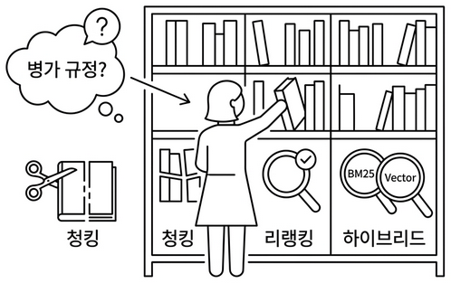
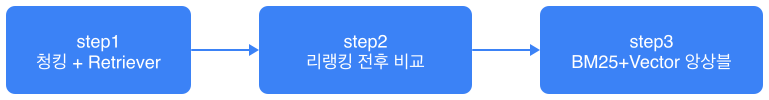
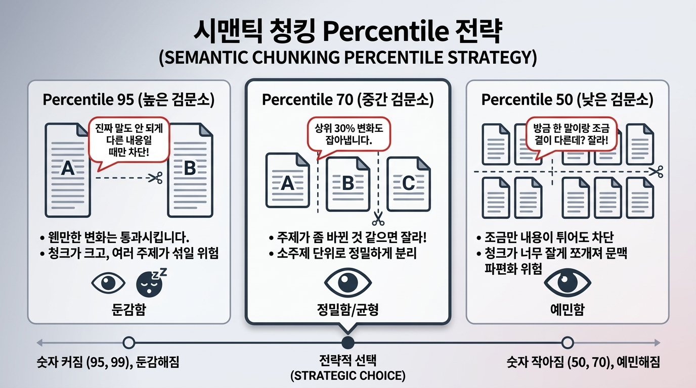
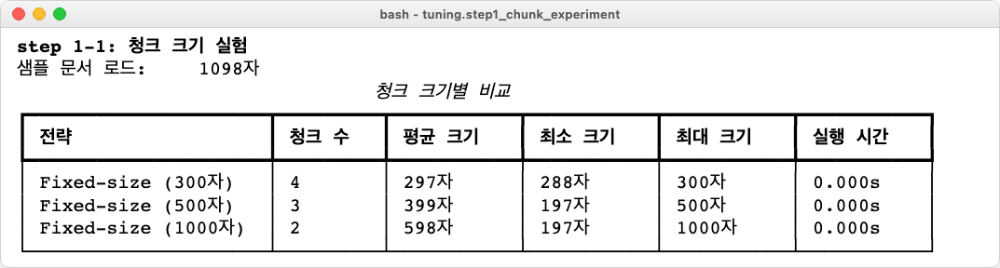
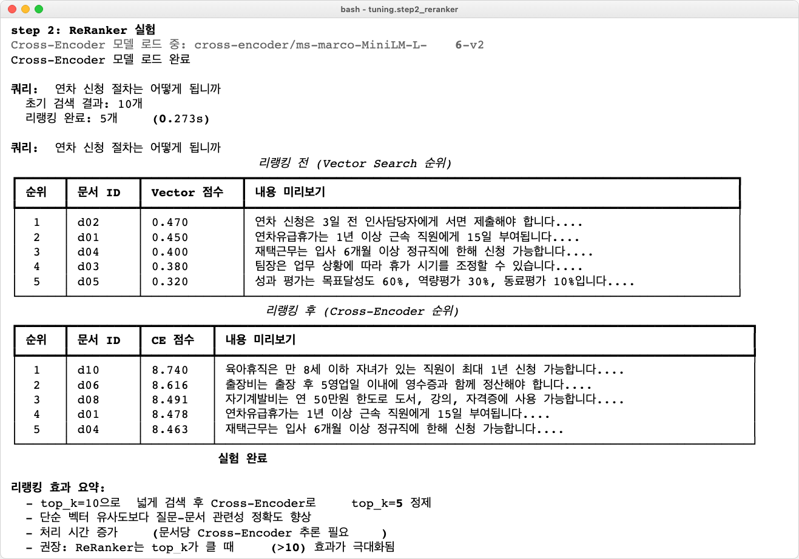
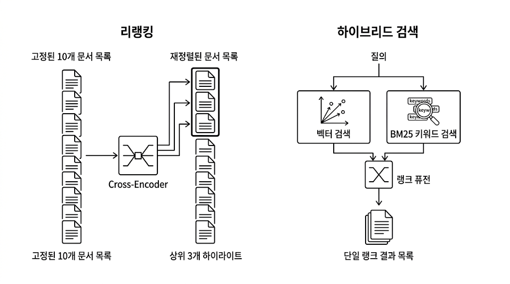
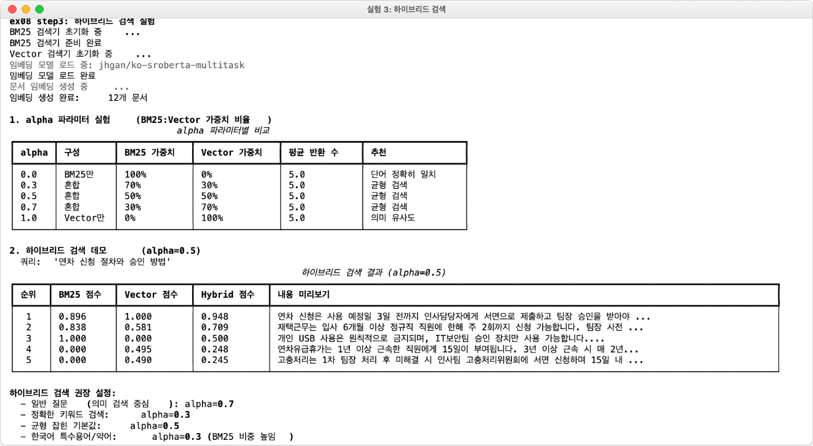
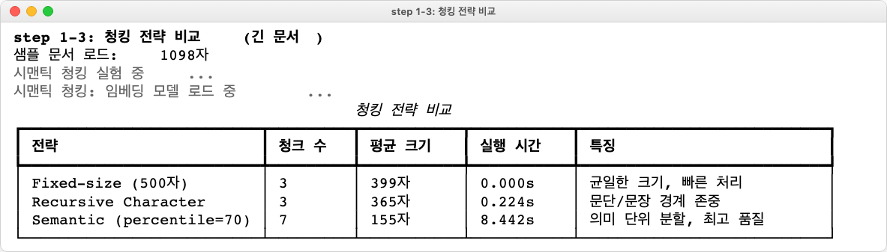

# 챕터 8 엉뚱한 문서를 가져온다. 청킹, 리랭킹, 하이브리드

:::goal
**이번 챕터가 끝나면**

- **Fixed, Recursive, Semantic** 세 가지 청킹 전략을 비교 실험합니다
- **Cross-Encoder Reranker**로 Top-K 검색 결과를 재정렬해 정확도를 끌어올립니다
- **BM25 + Vector** 하이브리드 검색과 **랭크 퓨전(RRF)** 으로 키워드와 의미 검색을 결합합니다
- "병가를 물었는데 출장이 나오는" 현상이 왜 생기는지, 어떻게 잡는지 손으로 확인합니다
:::

::::prep
**준비하기**. 실습 시작 전 한 번만 설정

### 1. 실습 폴더 이동

```bash [터미널] 폴더 이동
cd rag-start/ex08
```

파일 구조는 다음과 같습니다.

```text ex08 디렉토리
ex08/
├── docker-compose.yml
├── requirements.txt
├── data/                         # [참고] 문서·마크다운·ChromaDB
└── tuning/
    ├── step1_chunk_experiment/   # [실습] 청킹 전략 비교
    │   ├── run.py
    │   ├── fixed.py
    │   ├── recursive.py
    │   └── semantic.py
    ├── step2_reranker/           # [실습] Cross-Encoder 리랭커
    │   ├── run.py
    │   └── reranker.py
    └── step3_hybrid_search/      # [실습] BM25 + Vector + RRF
        ├── run.py
        ├── bm25_retriever.py
        └── rrf.py
```

### 2. 실습 환경 구축

```bash [터미널] 환경 구성. macOS / Linux
cd ex08
cp .env.example .env
python3.12 -m venv .venv
source .venv/bin/activate
docker compose up -d
pip install -r requirements.txt
```

```bash [터미널] 환경 구성. Windows
cd ex08
copy .env.example .env
py -3.12 -m venv .venv
.venv\Scripts\activate
docker compose up -d
pip install -r requirements.txt
```

### 3. 사용할 라이브러리

| 패키지 | 역할 |
|-------|------|
| `langchain-text-splitters` | Recursive·Character·Token 스플리터 |
| `langchain-experimental` | SemanticChunker (의미 기반 청킹) |
| `sentence-transformers` | 임베딩 + Cross-Encoder (BAAI/bge-reranker-v2-m3) |
| `rank-bm25` | BM25 알고리즘 (키워드 기반) |
| `chromadb` | 벡터 DB |

### 4. 실습 순서

이번 챕터는 **만들기**가 아니라 **실험, 비교**입니다.

1. `python -m tuning.step1_chunk_experiment.run`. 청킹 전략 비교
2. `python -m tuning.step2_reranker.run`. Cross-Encoder 리랭커
3. `python -m tuning.step3_hybrid_search.run`. BM25 + Vector 하이브리드
::::

## 8.1 "병가를 물었는데 출장 규정이 나왔다"


*그림 8-1. 검색 품질 튜닝. 청킹, 리랭킹, 하이브리드의 세 축*

챕터 7에서 운영까지 안정화했습니다. 캐시도 돌고 토큰도 추적합니다. 그런데 동료가 이상한 걸 발견했습니다.

**동료 C**: "병가 규정이 뭔지 물었는데, 출장 규정을 가져와서 답하던데요?"

*뭐라고?*

검색 결과 로그를 열어 봤습니다. 정말 그랬습니다. "병가 신청 절차"라는 질문에 상위 3건 중 2건이 출장 규정 문서였어요. 챕터 4에서 500자마다 기계적으로 잘라 둔 청크에서 **병가 규정 뒷부분과 출장 규정 앞부분이 한 덩어리**로 섞여 있었습니다.

**LLM은 받은 문서로 성실하게 답했을 뿐**입니다. 잘못된 문서를 가져다 준 건 검색 단계예요. 챕터 6, 챕터 7에서 에이전트, 운영을 다듬었지만, **검색의 뿌리가 약하면** 그 위에 뭘 얹어도 품질이 안 올라옵니다.

## 8.2 사서가 성장하는 세 단계

챕터 4에서 만든 사서는 아직 초보입니다. 사서를 더 똑똑하게 만드는 방법은 세 가지입니다.

**제목만 보고 찾는 사서**. 챕터 4에서 우리가 만든 사서. 문서를 500자 단위로 기계적으로 잘라 둡니다. "병가"와 "출장"이 같은 문서에 있으면 한 청크에 두 내용이 섞여요.

**문단을 보고 찾는 사서**. 문서에는 보통 빈 줄이 있습니다. "제1조"와 "제2조" 사이, 단락 전환 지점이요. 이 사서는 빈 줄이 보이면 먼저 거기서 끊습니다. 주제가 섞일 확률이 줄어요. 이것이 **Recursive Character Chunking**입니다.

**목차를 보고 찾는 사서**. 더 꼼꼼한 사서. 문서를 자를 때 "여기서 주제가 바뀌네?"를 감지합니다. 연차 이야기 → 출장 이야기로 넘어가는 지점을 알아채고 거기서 끊어요. 빈 줄이 없어도 내용 흐름을 읽습니다. **Semantic Chunking**입니다.


*그림 8-2. 사서가 성장하는 과정. 가위로 자르던 사서가 문단을 보고, 의미를 읽고, 두 검색을 섞어 씁니다*

**내용까지 훑고 다시 확인하는 사서**. 상위 10개를 가져왔다고 합시다. 진짜 관련 있는 건 3~4개, 나머지는 비슷해 보이지만 사실 관련 없어요. 사서가 10개를 펼쳐 놓고 질문을 다시 읽으며 하나하나 확인합니다. **리랭킹(ReRanking)** 입니다.

**두 방법을 섞어 쓰는 사서**. 벡터 검색은 "휴가 사용"처럼 의미가 비슷한 문서를, BM25는 "연차 신청"이라는 단어가 정확히 들어간 문서를 찾습니다. 둘을 합치면 의미도 맞고 키워드도 맞는 문서가 상위에 올라옵니다. **하이브리드 검색**입니다.

## 8.3 이 챕터의 세 실험

새 기능을 "만드는" 게 아니라 기존 검색 파이프라인을 "실험, 개선"합니다. 세 실험을 순서대로 진행합니다.

| 순서 | 실험 | 무엇을 알아내나 |
|-----|------|---------------|
| Step 1 | 청킹 전략 + Retriever 튜닝 | 어떻게 자르고, Top-K를 몇으로 할지 |
| Step 2 | 리랭킹 | 가져온 문서를 다시 정렬하면 정확도가 올라가는지 |
| Step 3 | 하이브리드 검색 | BM25 + Vector를 섞으면 효과가 있는지 |


*그림 8-3. 챕터 8의 세 실험. 청킹 → 리랭킹 → 하이브리드 순서로 검색 품질을 올립니다*

## 8.4 실험 1: 청킹 전략 비교 (step1)

`tuning/step1_chunk_experiment/`에 세 가지 청킹 전략이 파일로 분리돼 있습니다. `run.py`가 같은 쿼리를 세 전략 각각으로 돌려 결과를 비교합니다.

```python [실습 1] tuning/step1_chunk_experiment/semantic.py. 의미 기반 청킹
from langchain_experimental.text_splitter import SemanticChunker
from langchain_huggingface import HuggingFaceEmbeddings

def make_semantic_chunks(text: str, breakpoint_percentile: int = 95) -> list[str]:
    """의미가 바뀌는 지점을 감지해서 자른다."""
    embeddings = HuggingFaceEmbeddings(model_name="jhgan/ko-sroberta-multitask")
    splitter = SemanticChunker(
        embeddings,
        breakpoint_threshold_type="percentile",
        breakpoint_threshold_amount=breakpoint_percentile,
    )
    return [doc.page_content for doc in splitter.create_documents([text])]
```

`breakpoint_percentile=95`는 "임베딩 거리 상위 5% 지점에서 자른다"는 뜻입니다. 주제 전환이 뚜렷한 곳을 경계로 삼는 셈이에요.


*그림 8-4. Percentile 임계값에 따른 청크 경계. 값이 낮을수록 자주 자릅니다*

```bash [터미널] 실험 1 실행
python -m tuning.step1_chunk_experiment.run --query "병가 신청 절차"
```


*그림 8-5. 청킹 전략 비교. Recursive, Semantic으로 갈수록 상위 결과에서 "출장 규정" 혼입이 줄어듭니다*

:::tip
**청크 사이즈, 오버랩도 같이 실험**

`step1`의 `run.py`에는 `--chunk-size`, `--overlap` 옵션이 있습니다. 500/100 외에 300/50, 800/200 등을 돌려 보면 "크게 자를수록 재현율 ↑ / 정확도 ↓" 트레이드오프가 눈에 보입니다.
:::

## 8.5 실험 2: Cross-Encoder 리랭커 (step2)

벡터 검색은 **질문과 문서를 따로따로 임베딩**하고 거리를 잽니다(Bi-Encoder). 빠르지만 미세한 의미 차이는 놓치기 쉬워요. **Cross-Encoder**는 질문과 문서를 **한 번에** 모델에 넣어 직접 관련성을 점수화합니다. 느리지만 정확합니다.

**전략**: 1단계에서 벡터 검색으로 Top-20을 빠르게 가져온 뒤, 2단계에서 Cross-Encoder로 재정렬해 Top-3만 LLM에 넘깁니다.

```python [실습 2] tuning/step2_reranker/reranker.py. BGE Cross-Encoder
from sentence_transformers import CrossEncoder

class Reranker:
    def __init__(self, model_name: str = "BAAI/bge-reranker-v2-m3"):
        self.model = CrossEncoder(model_name)

    def rerank(self, query: str, docs: list[str], top_k: int = 3) -> list[tuple[str, float]]:
        # TODO: [query, doc] 쌍으로 점수 계산 → 내림차순 정렬 → top_k 반환
        pairs = [(query, d) for d in docs]
        scores = self.model.predict(pairs)
        ranked = sorted(zip(docs, scores), key=lambda x: x[1], reverse=True)
        return ranked[:top_k]
```

```bash [터미널] 실험 2 실행
python -m tuning.step2_reranker.run --query "병가 신청 절차"
```


*그림 8-6. 리랭킹 전/후 비교. 벡터만 썼을 때 3위 밖으로 밀려 있던 "제15조 병가" 조항이 1위로 올라왔습니다*

:::term-box
**Bi-Encoder vs Cross-Encoder**. Bi-Encoder는 질문과 문서를 따로 벡터화해 유사도를 계산(빠름, 부정확). Cross-Encoder는 한 쌍씩 동시에 모델을 통과시켜 직접 관련성 점수를 산출(느림, 정확). 그래서 **Bi로 많이 가져오고 Cross로 정렬**하는 2단계 전략을 씁니다.
:::

## 8.6 실험 3: 하이브리드 검색 + 랭크 퓨전 (step3)

벡터 검색은 **의미**, BM25는 **키워드**. 각자의 강점이 다르니 **둘을 섞습니다**. 문제는 두 검색의 점수 스케일이 달라 단순 합산이 안 된다는 점이에요. 그래서 **Reciprocal Rank Fusion(RRF)** 으로 순위를 합칩니다.

```python [실습 3] tuning/step3_hybrid_search/rrf.py. 랭크 퓨전
def reciprocal_rank_fusion(rankings: list[list[str]], k: int = 60) -> list[tuple[str, float]]:
    """각 검색 결과의 순위를 1/(k+rank)로 변환해 합산한다."""
    scores: dict[str, float] = {}
    for ranking in rankings:
        for rank, doc_id in enumerate(ranking, start=1):
            scores[doc_id] = scores.get(doc_id, 0) + 1 / (k + rank)
    return sorted(scores.items(), key=lambda x: x[1], reverse=True)
```


*그림 8-7. 하이브리드 = 벡터 검색(의미) + BM25(키워드) → RRF로 합친 최종 순위*

```bash [터미널] 실험 3 실행
python -m tuning.step3_hybrid_search.run --query "연차 신청 절차"
```


*그림 8-8. 하이브리드 결과. 벡터만 쓸 때 놓쳤던 정확 키워드 일치 조항이 상위로 올라왔습니다*

## 8.7 세 실험 종합: 튜닝 전/후 비교

세 실험을 모두 적용한 파이프라인(Semantic 청킹 + Reranker + Hybrid)과 챕터 4 기본 파이프라인(Fixed 청킹 + Vector only)을 같은 쿼리 세트로 비교합니다.


*그림 8-9. 검색 전략 전체 비교. "병가를 물었더니 출장이 나오는" 현상이 사라졌습니다*

동료 C에게 다시 써 보라고 했습니다.

**동료 C**: "이번엔 병가 규정이 제대로 나오네요."

## 8.8 전체 구성도에서 챕터 8의 자리

<div class="arch-fullmap">
  <div class="arch-fullmap-title">전체 구성도. 짙은 박스가 챕터 8 튜닝 대상</div>

  <div class="afm-row afm-user">
    <div class="afm-box afm-faint afm-round"><div class="afm-label">사내 직원 · 관리자</div></div>
  </div>

  <div class="afm-zone">
    <span class="afm-zone-ch">챕터 2</span>
    <span class="afm-zone-label">대시보드</span>
    <div class="afm-row">
      <div class="afm-box afm-faint"><div class="afm-label">FastAPI</div><div class="afm-sub">REST API · 관리자 웹</div></div>
    </div>
  </div>

  <div class="afm-zone">
    <span class="afm-zone-ch">챕터 6+7</span>
    <span class="afm-zone-label">오케스트레이션 + 운영</span>
    <div class="afm-row afm-three">
      <div class="afm-box afm-faint"><div class="afm-label">Query Router</div><div class="afm-sub">규칙·스키마·LLM</div></div>
      <div class="afm-box afm-faint"><div class="afm-label">ConnectHRAgent</div><div class="afm-sub">ReAct + 캐시</div></div>
      <div class="afm-box afm-faint"><div class="afm-label">MCP Tools</div><div class="afm-sub">DB · 문서</div></div>
    </div>
  </div>

  <div class="afm-zone">
    <span class="afm-zone-ch">챕터 5</span>
    <span class="afm-zone-label">검색 (실시간)</span>
    <div class="afm-row">
      <div class="afm-box afm-on"><div class="afm-tag">오늘 튜닝한 부분</div><div class="afm-label">LCEL Chain</div><div class="afm-sub">Semantic 청킹 · Reranker · Hybrid(BM25+Vector)</div></div>
    </div>
  </div>

  <div class="afm-zone">
    <span class="afm-zone-ch">챕터 4</span>
    <span class="afm-zone-label">파싱·벡터화 (오프라인)</span>
    <div class="afm-row afm-three">
      <div class="afm-box afm-faint afm-dashed"><div class="afm-label">챕터 3 문서 규칙</div><div class="afm-sub">PDF·Word·Excel·HWP</div></div>
      <div class="afm-box afm-on"><div class="afm-tag">청킹 전략 교체</div><div class="afm-label">Doc Pipeline</div><div class="afm-sub">Fixed → Recursive → Semantic</div></div>
      <div class="afm-box afm-faint"><div class="afm-label">ChromaDB</div><div class="afm-sub">벡터 저장소</div></div>
    </div>
  </div>

  <div class="afm-zone">
    <span class="afm-zone-ch">챕터 2</span>
    <span class="afm-zone-label">데이터</span>
    <div class="afm-row">
      <div class="afm-box afm-faint"><div class="afm-label">PostgreSQL</div><div class="afm-sub">직원·연차·매출</div></div>
    </div>
  </div>

  <div class="afm-row afm-ext">
    <div class="afm-box afm-faint afm-dashed"><div class="afm-label">Ollama LLM (외부)</div></div>
  </div>

  <div class="afm-note">
    챕터 8은 <b>Doc Pipeline(청킹 전략)</b> 과 <b>LCEL Chain(리랭커, 하이브리드)</b> 을 튜닝했습니다. 검색 단계의 품질이 올라가면 위의 에이전트, 운영 층은 그대로 두고도 답이 단단해집니다. 챕터 9에서는 **질문 자체**의 모호함을 잡습니다.
  </div>
</div>

## 용어 정리

| 본문 속 표현 | 진짜 용어 | 정식 정의 |
|-------------|---------|----------|
| "제목만 보고 자르기" | **Fixed-size Chunking** | 일정 글자 수(500자)로 기계적 분할. 빠르지만 주제 혼입 위험 |
| "문단을 보고 자르기" | **Recursive Character Chunking** | 빈 줄·단락 경계를 우선 분할 기준으로 삼는 스플리터 |
| "목차를 보고 자르기" | **Semantic Chunking** | 임베딩 거리 변화로 주제 전환을 감지해 자름 |
| "다시 확인하기" | **Cross-Encoder Reranker** | 질문·문서를 한 번에 모델에 넣어 직접 관련성 점수를 매김 |
| "두 방법 섞기" | **Hybrid Search (BM25 + Vector)** | 키워드 기반 BM25와 의미 기반 벡터 검색을 병행 |
| "순위 합치기" | **Reciprocal Rank Fusion (RRF)** | 각 검색의 순위를 `1/(k+rank)`로 합산해 최종 순위 산출 |

:::remember
**이것만은 기억하자**

- **검색이 바뀌면 답이 바뀝니다.** RAG의 품질은 LLM이 아니라 Retriever가 결정합니다. 엉뚱한 문서가 들어가면 LLM은 성실히 엉뚱한 답을 합니다.
- **청킹은 주제 경계에서.** Fixed → Recursive → Semantic으로 갈수록 주제 혼입이 줄어듭니다. 문서 성격에 맞춰 고르세요.
- **Reranker와 Hybrid는 싸게 얻는 품질 향상입니다.** 인프라를 크게 바꾸지 않고 검색 정확도를 끌어올리는 코스트 대비 효율이 가장 높은 기법입니다. 다음 챕터 9에서는 **질문 자체**의 모호함을 해석하는 쿼리 재작성을 다룹니다.
:::
