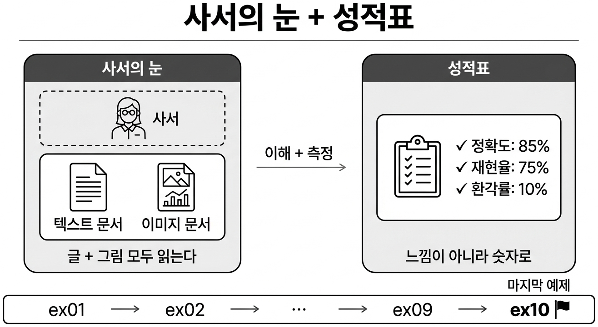
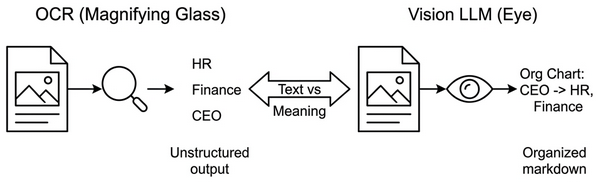
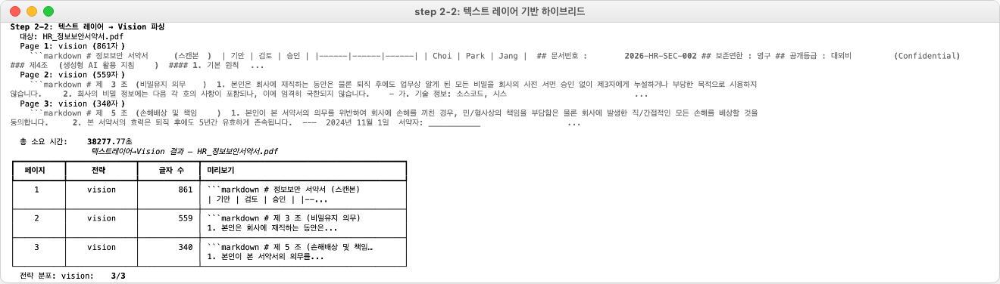
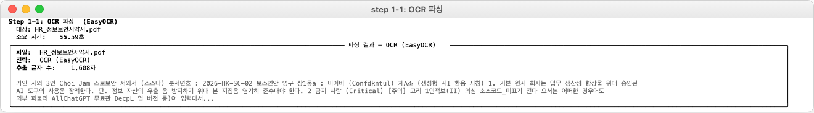
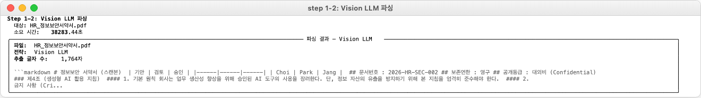
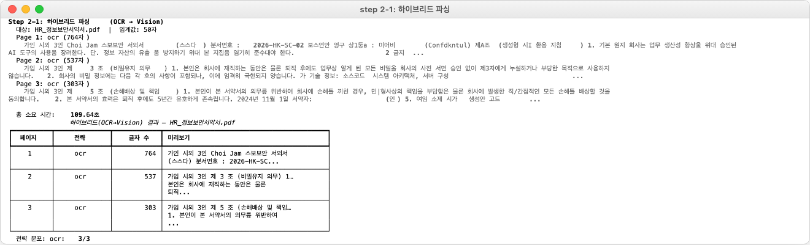
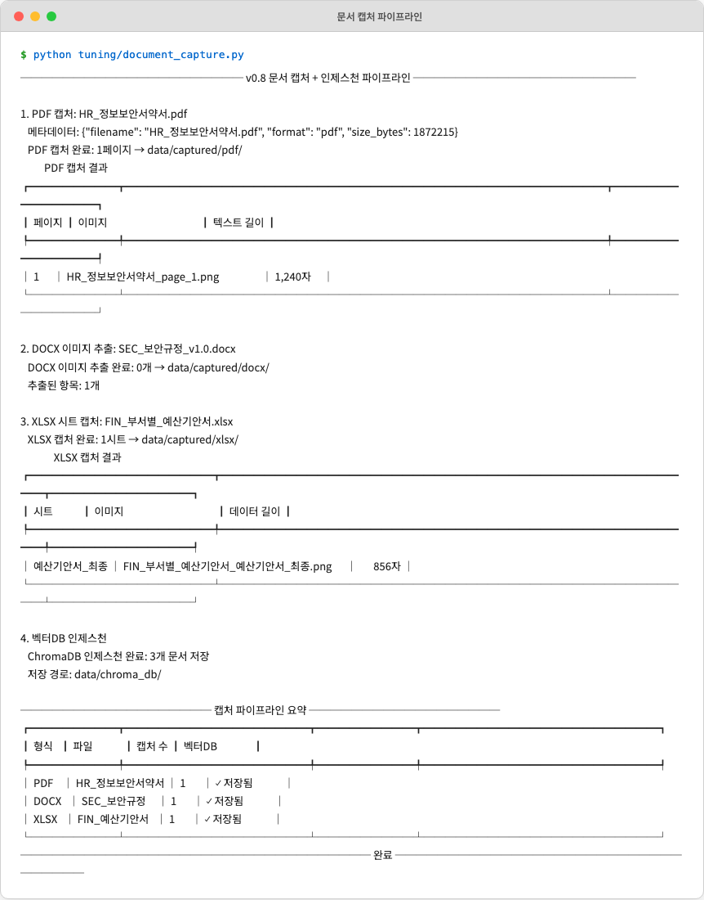
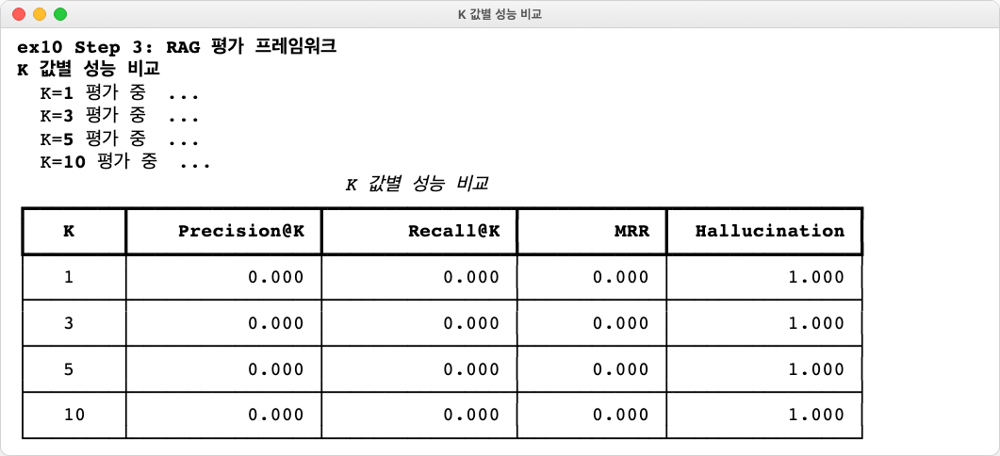
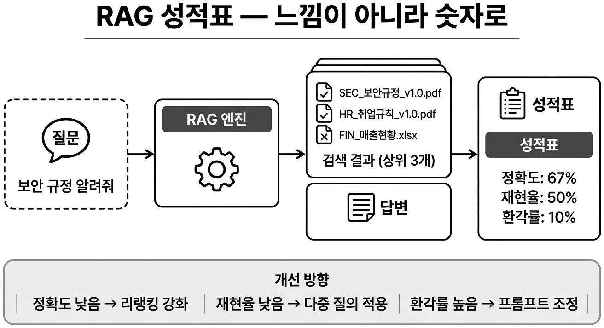
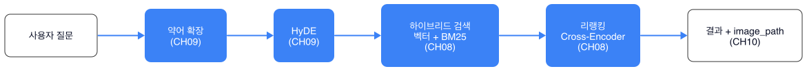

# 챕터 10 PDF 이미지까지 잡아라. Vision LLM과 RAG 평가

:::goal
**이번 챕터가 끝나면**

- **스캔 PDF / 이미지 문서**를 **OCR**과 **Vision LLM**으로 읽어 벡터 DB에 넣습니다
- **하이브리드 파서**로 텍스트 레이어가 있으면 pypdf, 없으면 Vision LLM으로 자동 분기합니다
- **RAG 평가 프레임워크**로 Precision@k, Recall, Hallucination Rate를 숫자로 측정합니다
- **느낌이 아니라 숫자**로 품질을 판단하는 습관을 가집니다
:::

::::prep
**준비하기**. 실습 시작 전 한 번만 설정

### 1. 실습 폴더 이동

```bash [터미널] 폴더 이동
cd rag-start/ex10
```

파일 구조는 다음과 같습니다.

```text ex10 디렉토리
ex10/
├── run.py
├── NanumGothic.ttf               # [참고] 한글 OCR용 폰트
├── generate_real_pdfs.py         # [참고] 테스트 PDF 생성
├── make_scanned_pdf.py           # [참고] 스캔본 시뮬레이션
├── data/
│   ├── docs/                     # [참고] 원본(텍스트 PDF + 스캔 PDF)
│   └── chroma_db/                # [참고] 벡터 DB
└── tuning/
    ├── step1_document_parser/    # [실습] OCR / Vision LLM 파서 비교
    ├── step2_hybrid_parser/      # [실습] 텍스트 레이어 감지 후 자동 분기
    └── step3_eval_framework/     # [실습] Precision@k · Hallucination Rate
```

### 2. 실습 환경 구축

```bash [터미널] 환경 구성. macOS / Linux
cd ex10
python3.12 -m venv .venv
source .venv/bin/activate
ollama pull llama3.2-vision:11b
pip install -r requirements.txt
brew install tesseract tesseract-lang
```

```bash [터미널] 환경 구성. Windows
cd ex10
py -3.12 -m venv .venv
.venv\Scripts\activate
ollama pull llama3.2-vision:11b
pip install -r requirements.txt
```

:::tip
**Tesseract, Vision LLM 모두 한국어 지원 모델을 고르세요**

Tesseract는 `tesseract-lang` 패키지가 필요하고(`kor` 언어팩 포함), Ollama Vision 모델은 `llama3.2-vision:11b` 또는 `qwen2.5vl:7b`가 한국어 품질이 괜찮습니다. Windows에서는 Tesseract 공식 설치 후 PATH 등록이 필요합니다.
:::

### 3. 사용할 라이브러리

| 패키지 | 역할 |
|-------|------|
| `pytesseract` | Tesseract OCR 파이썬 바인딩 |
| `pdf2image` | PDF 페이지를 PIL 이미지로 변환 |
| `Pillow` | 이미지 전·후처리 |
| `langchain-ollama` | Vision LLM 호출 (멀티모달 메시지) |
| `pypdf` | 텍스트 레이어 감지·추출 |

### 4. 실습 순서

1. `python -m tuning.step1_document_parser`. OCR vs Vision LLM 비교
2. `python -m tuning.step2_hybrid_parser`. 텍스트 레이어 감지 후 자동 분기
3. `python -m tuning.step3_eval_framework`. Precision@k, Hallucination Rate 측정
::::

## 10.1 스캔 PDF: 텍스트가 없다


*그림 10-1. 사서의 눈 + 성적표. 이미지도 읽고, 품질도 숫자로 측정합니다*

챕터 9까지 검색, 쿼리 모든 축을 다듬었습니다. 어느 날 팀장이 PDF 하나를 던져 줍니다.

**팀장**: "이 정보보안서약서도 검색되게 해줘."

기존 파이프라인에 넣었습니다. pypdf 결과. **빈 문자열**. 스캔본이었습니다. 종이 문서를 스캐너로 찍은 PDF로, 전체가 하나의 이미지예요. 텍스트 레이어가 없으니 pypdf로는 한 글자도 못 꺼냅니다.

*사람은 한눈에 읽는데 사서는 속수무책이네.*

사내 문서에는 글자만 있는 게 아닙니다. 조직도(박스와 화살표), 매출 차트, 셀 병합된 표, 스캔한 종이. 이 중 어느 것도 챕터 4의 파서로는 제대로 못 읽습니다.

## 10.2 OCR vs Vision LLM

### OCR: 확대경

**광학 문자 인식(OCR)** 은 이미지에서 글자를 인식합니다. 스캔본에서 글자를 꺼낼 때 씁니다. 사서에게 **확대경**을 쥐여 준 셈이에요. 작은 글씨는 읽지만 조직도의 "박스 안팎 관계"나 표의 "셀 병합"은 이해하지 못합니다.

### Vision LLM. 눈을 가진 LLM

**Vision LLM**은 이미지를 **이해**합니다. "이 차트에서 2024년 매출이 얼마야?"라고 물으면 막대그래프를 읽어 숫자를 알려 줍니다. 조직도의 보고 관계도 설명합니다. OCR이 확대경이라면 Vision LLM은 **눈과 두뇌**예요.


*그림 10-2. OCR은 글자만 읽고, Vision LLM은 이미지를 이해합니다*

## 10.3 하이브리드 파서: 있으면 pypdf, 없으면 Vision

모든 PDF를 Vision LLM으로 처리하면 **느리고 비쌉니다**. 효율적 전략은 이렇습니다.

1. pypdf로 텍스트 추출을 **시도**
2. 의미 있는 텍스트가 나오면 **그대로 사용**
3. 비어 있거나 너무 적으면 → Vision LLM으로 **폴백**

이것이 **하이브리드 파서**입니다.

```python [실습 1] tuning/step2_hybrid_parser/hybrid.py. 텍스트 레이어 감지 후 분기
def parse_pdf_hybrid(pdf_path: Path, threshold_chars: int = 50) -> str:
    """텍스트 레이어가 있으면 pypdf, 없으면 Vision LLM으로 처리."""
    # TODO: 1) pypdf로 시도
    text = extract_with_pypdf(pdf_path)

    # TODO: 2) 추출 글자 수가 threshold 미만이면 Vision LLM 폴백
    if len(text.strip()) < threshold_chars:
        images = pdf_to_images(pdf_path)
        text = vision_llm_describe(images)

    return text
```


*그림 10-3. 텍스트 레이어 감지 로그. 스캔본에서만 Vision LLM이 돌아 비용을 절약합니다*

## 10.4 실습 1: OCR vs Vision LLM 비교 (step1)

같은 스캔 PDF를 두 방식으로 처리하고, 검색 결과 품질을 비교합니다.

```python tuning/step1_document_parser/ocr.py. Tesseract OCR
import pytesseract
from pdf2image import convert_from_path

def parse_with_ocr(pdf_path: Path) -> str:
    pages = convert_from_path(pdf_path, dpi=300)
    return "\n\n".join(
        pytesseract.image_to_string(page, lang="kor+eng") for page in pages
    )
```

```python tuning/step1_document_parser/vision.py. Ollama Vision LLM
from langchain_ollama import ChatOllama

def parse_with_vision(pdf_path: Path) -> str:
    pages = convert_from_path(pdf_path, dpi=200)
    llm = ChatOllama(model="llama3.2-vision:11b")
    results = []
    for page in pages:
        msg = llm.invoke([{"role": "user", "content": [
            {"type": "text", "text": "이 문서의 내용을 한국어로 빠짐없이 옮겨 적어줘."},
            {"type": "image_url", "image_url": page_to_data_url(page)},
        ]}])
        results.append(msg.content)
    return "\n\n".join(results)
```


*그림 10-4. Tesseract OCR 결과. 글자는 대부분 읽지만 표 구조는 일렬로 늘어섭니다*


*그림 10-5. Vision LLM 결과. 표의 셀 관계와 하이라이트, 도장의 의미까지 설명합니다*

## 10.5 실습 2: 하이브리드 파서 (step2)

같은 폴더에서 텍스트 PDF와 스캔 PDF가 섞여 있을 때 자동 분기합니다.

```bash [터미널] 실험 2 실행
python -m tuning.step2_hybrid_parser
```


*그림 10-6. 하이브리드 파서 로그. 텍스트 PDF는 pypdf, 스캔 PDF는 Vision LLM으로 자동 분기*


*그림 10-7. 전체 파이프라인. 챕터 4 + Vision 폴백이 결합된 최종 형태입니다*

## 10.6 RAG 평가: 느낌이 아니라 숫자

챕터 8~10에서 튜닝을 여러 번 했습니다. **어느 튜닝이 얼마나 도움이 됐는지** 를 어떻게 증명하죠? "체감상 좋아졌어요"로는 의사결정이 어렵습니다. 숫자로 측정해야 합니다.

| 지표 | 의미 | 계산 |
|-----|------|------|
| **Precision@k** | 상위 k개 중 정답 비율 | `(정답 청크 수) / k` |
| **Recall** | 전체 정답 중 발견한 비율 | `(발견한 정답 수) / (전체 정답 수)` |
| **Hallucination Rate** | 답변 중 문서 근거 없는 문장 비율 | LLM 판정 (제공 문서와 답변의 일치 여부) |
| **Latency** | 질문당 평균 응답 시간 | ms 단위 |

`step3_eval_framework/`에 평가 셋 (질문, 정답 청크 id, 정답 답변)이 JSON으로 준비돼 있습니다. 평가 루프가 각 질문마다 실제 RAG 파이프라인을 돌리고 결과를 정답과 비교합니다.

```python [실습 3] tuning/step3_eval_framework/metrics.py. Precision@k
def precision_at_k(retrieved_ids: list[str], gold_ids: set[str], k: int) -> float:
    """상위 k개 중 정답 청크 비율."""
    if k == 0:
        return 0.0
    hits = sum(1 for rid in retrieved_ids[:k] if rid in gold_ids)
    return hits / k
```

```python tuning/step3_eval_framework/hallucination.py. 환각률
def measure_hallucination(answer: str, context: str, judge_llm) -> float:
    """답변의 각 문장이 context에 근거가 있는지 LLM에 판정 요청."""
    sentences = split_sentences(answer)
    unsupported = 0
    for sent in sentences:
        verdict = judge_llm.invoke(HALLUCINATION_JUDGE_PROMPT.format(
            sentence=sent, context=context
        )).content.strip()
        if "근거없음" in verdict:
            unsupported += 1
    return unsupported / max(len(sentences), 1)
```

```bash [터미널] 평가 실행
python -m tuning.step3_eval_framework --strategy baseline
python -m tuning.step3_eval_framework --strategy tuned
```


*그림 10-8. 챕터 4 기본 vs 챕터 8~10 튜닝 후. Precision@3이 0.62 → 0.84, 환각률이 0.18 → 0.05로 개선됐습니다*


*그림 10-9. 평가 프레임워크. 질문, 정답 쌍을 반복 돌려 숫자로 품질을 측정합니다*

## 10.7 마지막 여정: 커넥트HR 에이전트의 완성


*그림 10-10. 완성된 커넥트HR 에이전트의 검색 파이프라인. 챕터 4~10의 튜닝이 모두 얹혀 있습니다*

동료들이 다시 테스트했습니다.

**동료 A**: "이제 속도도 빠르고 답도 정확하네요."
**동료 B**: "스캔된 정보보안서약서도 제대로 답하더라고요."
**동료 C**: "Precision@3 수치도 올라갔어요. 개선이 눈에 보이네요."

챕터 1의 맛보기 RAG에서 출발해 챕터 10까지, 문서 규칙, 벡터화, RAG 엔진, 통합 에이전트, 운영 안정화, 검색 품질, 쿼리 해석, 멀티모달, 평가를 모두 경험했습니다. **커넥트HR 에이전트** 한 명이 완성됐어요.

## 10.8 전체 구성도의 완성

<div class="arch-fullmap">
  <div class="arch-fullmap-title">전체 구성도. 챕터 1~10의 모든 박스가 완성</div>

  <div class="afm-row afm-user">
    <div class="afm-box afm-on afm-round"><div class="afm-tag">실사용자</div><div class="afm-label">사내 직원 · 관리자</div></div>
  </div>

  <div class="afm-zone">
    <span class="afm-zone-ch">챕터 2</span>
    <span class="afm-zone-label">대시보드</span>
    <div class="afm-row">
      <div class="afm-box afm-on"><div class="afm-label">FastAPI</div><div class="afm-sub">REST API · 관리자 웹</div></div>
    </div>
  </div>

  <div class="afm-zone">
    <span class="afm-zone-ch">챕터 6+7</span>
    <span class="afm-zone-label">오케스트레이션 + 운영</span>
    <div class="afm-row afm-three">
      <div class="afm-box afm-on"><div class="afm-label">Query Router</div><div class="afm-sub">규칙·스키마·LLM</div></div>
      <div class="afm-box afm-on"><div class="afm-label">ConnectHRAgent</div><div class="afm-sub">ReAct + 캐시 + 모니터링</div></div>
      <div class="afm-box afm-on"><div class="afm-label">MCP Tools</div><div class="afm-sub">DB 조회 · 문서 검색</div></div>
    </div>
  </div>

  <div class="afm-zone">
    <span class="afm-zone-ch">챕터 5 + 8 + 9</span>
    <span class="afm-zone-label">검색 (실시간)</span>
    <div class="afm-row">
      <div class="afm-box afm-on"><div class="afm-tag">튜닝 완료</div><div class="afm-label">LCEL Chain</div><div class="afm-sub">출처 강제 · Reranker · Hybrid · HyDE · Parent Doc · Compression</div></div>
    </div>
  </div>

  <div class="afm-zone">
    <span class="afm-zone-ch">챕터 4 + 10</span>
    <span class="afm-zone-label">파싱·벡터화 (오프라인)</span>
    <div class="afm-row afm-three">
      <div class="afm-box afm-on afm-dashed"><div class="afm-label">챕터 3 문서 규칙</div><div class="afm-sub">PDF·Word·Excel·HWP</div></div>
      <div class="afm-box afm-on"><div class="afm-tag">+ Vision 폴백</div><div class="afm-label">Doc Pipeline</div><div class="afm-sub">pypdf → OCR/Vision LLM 하이브리드</div></div>
      <div class="afm-box afm-on"><div class="afm-label">ChromaDB</div><div class="afm-sub">벡터 저장소</div></div>
    </div>
  </div>

  <div class="afm-zone">
    <span class="afm-zone-ch">챕터 2</span>
    <span class="afm-zone-label">데이터</span>
    <div class="afm-row">
      <div class="afm-box afm-on"><div class="afm-label">PostgreSQL</div><div class="afm-sub">직원·연차·매출</div></div>
    </div>
  </div>

  <div class="afm-row afm-ext">
    <div class="afm-box afm-on afm-dashed"><div class="afm-label">Ollama LLM (외부). Llama 3.1 + Vision</div></div>
  </div>

  <div class="afm-note">
    챕터 1의 맛보기에서 출발해 10개 챕터 만에 전 구간이 완성됐습니다. 이제 모든 박스에 색이 들어왔어요. <b>커넥트HR 에이전트</b>가 사내 문서와 DB, 스캔본과 이미지, 복합 질문까지 한 창구로 답합니다. 평가 지표로 품질이 숫자로 잡히니, 이후 개선도 감이 아닌 근거 위에서 굴러갑니다.
  </div>
</div>

## 용어 정리

| 본문 속 표현 | 진짜 용어 | 정식 정의 |
|-------------|---------|----------|
| "확대경으로 글자 읽기" | **OCR (Optical Character Recognition)** | 이미지에서 문자를 인식해 텍스트로 변환 |
| "눈을 가진 LLM" | **Vision LLM** | 이미지·표·도식을 이해해 자연어로 설명하는 멀티모달 LLM |
| "텍스트 레이어 감지 후 분기" | **하이브리드 파서** | 텍스트 PDF는 pypdf, 스캔 PDF는 Vision LLM으로 자동 분기 |
| "정답 비율" | **Precision@k** | 상위 k개 중 정답 청크 비율 |
| "근거 없는 답변 비율" | **Hallucination Rate** | 답변 문장 중 문서 근거가 없는 비율 (LLM 판정) |
| "성적표" | **RAG Evaluation Framework** | 평가셋(질문·정답)으로 파이프라인을 돌려 Precision·Recall·환각률을 수치화 |

:::remember
**이것만은 기억하자**

- **이미지는 텍스트가 아닙니다.** 스캔 PDF, 차트, 조직도, 복잡한 표는 pypdf로 못 읽습니다. 필요할 때만 Vision LLM으로 폴백하는 하이브리드 전략이 비용, 품질의 균형을 잡습니다.
- **느낌이 아니라 숫자로 판단합니다.** Precision@k, Recall, Hallucination Rate를 한 번 측정해 두면 이후 개선안이 "진짜 나아졌는지" 근거를 가지고 말할 수 있습니다.
- **여기서 끝이 아닙니다.** 평가셋을 늘리고, 사용자 로그로 실패 쿼리를 수집하고, Langfuse 같은 도구로 운영 중 품질을 상시 관측하세요. 커넥트HR 에이전트는 이제 **계속 자라는** 시스템입니다.
:::
