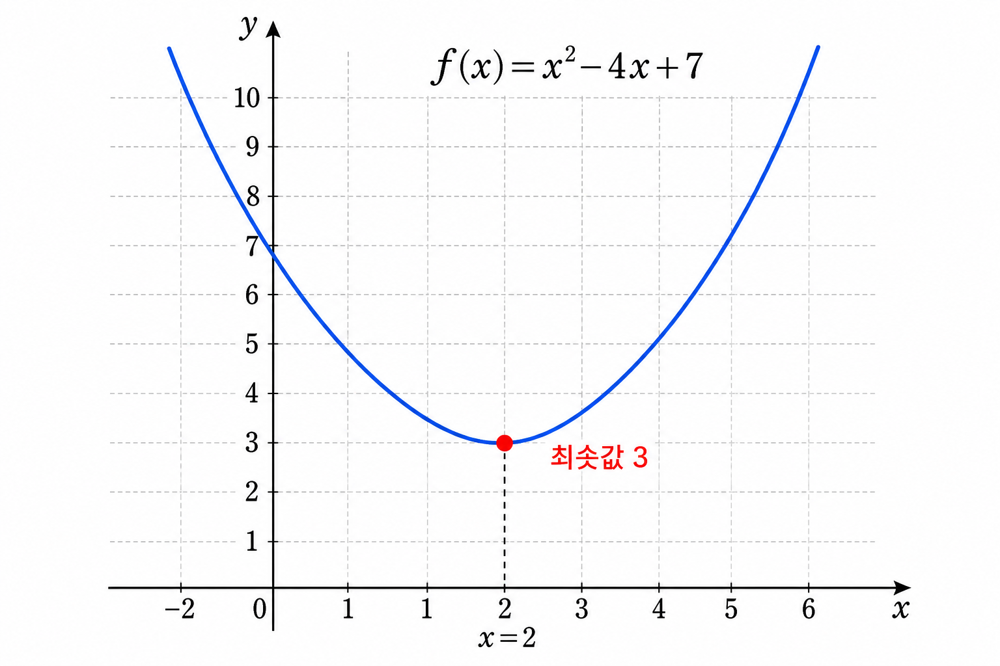

# Ch.1 · 가장 낮은 점 하나 : 2차방정식과 최솟값 — v0.1

> 이번 강: (시작) → 최솟값을 *찾는다*는 감각
> 한 줄 요약: AI가 배운다는 건, 결국 가장 낮은 점 하나를 찾아가는 일입니다.
> 핵심 개념: 최솟값 · 포물선 · 꼭짓점

---

## 이야기 파트

### 손실 : "가장 작게"라는 말에 걸려 넘어지다

AI 강의를 듣던 오픈이는 어느 문장 앞에서 멈췄습니다.

*"학습이란, 손실을 가장 작게 만드는 과정입니다."*

강사는 아무렇지 않게 다음 슬라이드로 넘어갔습니다. 그런데 오픈이의 머릿속에는 작은 가시 하나가 박혔습니다.

*가장 작게 만든다고? 그래, 작게 만드는 건 알겠어. 그런데 — 어떻게 '가장' 작은 걸 찾지?*

손실(損失)이라는 말은 어렵지 않았습니다. AI가 내놓은 답과 정답 사이의 어긋남, 그러니까 **틀린 정도**입니다. 그걸 줄이고 싶다는 것도 당연했습니다. 틀린 정도가 0에 가까울수록 똑똑한 AI일 테니까요.

문제는 그다음이었습니다. 줄이고 줄이다 보면, 어느 순간 **더는 줄어들지 않는 바닥**이 있을 겁니다. 바로 그 바닥을 찾는 것이 학습이라는데 — 그 바닥이 어디인지, 무슨 수로 안다는 걸까요?

오픈이는 이 질문이 생각보다 깊다는 걸 직감했습니다. 그리고 이 한 문장이, 앞으로 만날 모든 수학의 입구라는 것도요.

### 그릇 : 공은 늘 바닥에서 멈춘다

잠시 강의를 멈추고, 오픈이는 책상 위 국그릇을 바라봤습니다.

밥을 먹다 만 둥근 그릇. 거기에 구슬 하나를 톡 떨어뜨리면 어떻게 될까요? 굳이 해보지 않아도 압니다. 구슬은 벽을 타고 내려가다가, **가장 낮은 한 점**에서 멈춥니다. 왼쪽으로 굴려도, 오른쪽 끝에서 놓아도, 결국 같은 자리로 모입니다.

그 자리가 특별한 이유는 단 하나입니다. **거기서는 더 내려갈 데가 없기 때문**입니다.

오픈이는 무릎을 쳤습니다.

*손실이란 게 이 그릇 같은 거구나. 어떤 값에서 시작하든, 굴러서 도착하는 가장 낮은 한 점. 학습은 그 점을 찾아가는 일이고.*

그릇의 옆모습을 떠올려 보세요. 가운데가 푹 꺼지고 양옆이 올라간, 부드러운 골짜기 모양. 학창 시절 칠판에서 한 번쯤 봤던 그 곡선입니다. 누군가는 'U자 곡선'이라 불렀고, 수학 시간에는 다른 이름으로 불렀습니다. 이름이야 어떻든, 중요한 건 이 곡선에는 **반드시 가장 낮은 점이 하나 있다**는 사실입니다.

그리고 더 반가운 소식. 그 점이 어디인지는, 그래프를 그려 눈으로 더듬지 않아도 됩니다. **종이 위에서 손으로 정확히 짚어낼 수 있습니다.** 고등학교 때 이미 배운 방법으로요. 단지 그때는 "이걸 어디다 쓰나" 싶었을 뿐입니다.

### 다시 펴기 : 이번 강에서 새로 쌓는 것

이 책의 약속은 하나입니다. **이해한 척하고 넘어가지 않기.** 비유로 감을 잡았으면, 직접 손으로 풀어서 진짜 내 것으로 만듭니다.

그래서 이번 강에서 우리가 쌓을 벽돌은 두 가지입니다.

첫째, 골짜기 모양 곡선 — 그러니까 **2차함수** — 이 어떻게 생겼는지. 둘째, 그 곡선의 **가장 낮은 점을 계산으로 찾는 법**. 그래프를 정밀하게 그릴 필요도, 점을 하나하나 찍어볼 필요도 없습니다. 식을 살짝 고쳐 쓰는 것만으로 바닥의 위치가 툭 튀어나옵니다.

별것 아닌 것 같나요? 하지만 이게 바로, 한참 뒤에 만날 **경사하강법**과 **역전파**가 하는 일의 가장 단순한 원형입니다. 거대한 AI도 결국은, 이 그릇 바닥 하나를 찾는 일을 어마어마하게 큰 규모로 반복하는 것뿐입니다. 그 첫 삽을 지금 뜹니다.

### 이것만은 기억하자

- **AI가 배운다는 건, 손실이라는 그릇의 가장 낮은 점 하나를 찾아가는 일입니다.**
- 그 그릇의 옆모습이 2차함수(포물선)이고, 가장 낮은 점은 식을 고쳐 쓰면 손으로 찾을 수 있습니다.
- 다음 강에서는 곡선을 더 자유롭게 다루기 위해, 숫자를 접었다 펴는 도구 — **지수와 제곱근** — 을 챙깁니다.

---

## 기술 파트

### 용어 정리

이야기 속 비유를 진짜 수학 용어로 정리합니다. 앞으로는 이 이름들로 부릅니다.

| 이야기 속 비유 | 진짜 용어 | 정식 정의 |
|--------------|----------|----------|
| 그릇의 옆모습(골짜기 곡선) | 포물선(parabola) | 2차함수 $y = ax^2 + bx + c$ ($a \ne 0$)의 그래프 |
| 그릇의 가장 낮은 점 | 최솟값(minimum) | 함수가 가질 수 있는 가장 작은 출력값 |
| 바닥의 위치 | 꼭짓점(vertex) | 포물선이 방향을 바꾸는 점. $a>0$이면 이곳에서 최솟값을 가짐 |
| 틀린 정도 | 손실(loss) | AI의 예측과 정답 사이의 어긋난 정도 (3강·15강에서 본격적으로 다룸) |

### 포물선은 어느 쪽으로 열리는가

2차함수의 일반형은 다음과 같습니다.

$$f(x) = ax^2 + bx + c \quad (a \ne 0)$$

여기서 가장 중요한 글자는 맨 앞의 $a$입니다. 이 부호 하나가 그릇이 놓인 방향을 정합니다.

- $a > 0$ : 그릇이 **위로 열립니다**(∪ 모양). 바닥이 생기므로 **최솟값**이 있습니다.
- $a < 0$ : 그릇이 **뒤집힙니다**(∩ 모양). 천장이 생기므로 최댓값이 있습니다.

우리가 다루는 손실은 "가장 작게" 만들고 싶은 값이니, 늘 $a > 0$인 ∪ 모양에 관심을 둡니다. 바닥, 즉 최솟값을 찾는 게 목표입니다.

### 식을 고쳐 바닥을 드러내기 — 완전제곱식

문제는 일반형 $ax^2 + bx + c$만 봐서는 바닥이 어디인지 한눈에 보이지 않는다는 점입니다. 그래서 식을 **완전제곱식(perfect square form)** 으로 고쳐 씁니다.

$$f(x) = a(x - h)^2 + k$$

이 모양이 좋은 이유는, 제곱 항 $(x-h)^2$의 성질 때문입니다. 어떤 실수를 제곱하든 그 값은 절대 음수가 될 수 없습니다.

$$(x - h)^2 \ge 0$$

그러니 $a>0$일 때 $f(x)$가 가장 작아지는 순간은, 제곱 항이 0이 되는 바로 그때입니다. 즉 $x = h$일 때 제곱 항이 사라지고, 남는 값 $k$가 바로 **최솟값**입니다. 점 $(h,\ k)$가 꼭짓점이고요.

정리하면 이렇습니다.

- $x = h$ → 바닥의 가로 위치
- $f(h) = k$ → 바닥의 높이(= 최솟값)

손으로 일일이 고쳐 쓰기 번거로울 때를 위한 지름길도 있습니다. 완전제곱식을 전개해 비교하면 꼭짓점의 가로 위치가 다음과 같이 나옵니다.

$$h = -\frac{b}{2a}$$

이 공식은 검산용으로 아주 요긴합니다.

### 계산 예제 : 직접 바닥을 짚어보기

말로만 보면 미끄러집니다. 숫자로 한 번 끝까지 풀어봅니다.

**문제.** $f(x) = x^2 - 4x + 7$ 의 최솟값과, 그때의 $x$를 구하세요.

**1단계 — 완전제곱 묶기.**
일차항 계수 $-4$의 절반은 $-2$입니다. 이 $-2$를 제곱한 $4$를 더했다 빼서 짝을 맞춥니다.

$$f(x) = (x^2 - 4x + 4) + 3$$

(원래 상수 $7$에서, 채워 넣은 $4$를 뺀 $3$이 남습니다.)

**2단계 — 제곱으로 접기.**
괄호 안은 완전제곱이 되었습니다.

$$f(x) = (x - 2)^2 + 3$$

**3단계 — 바닥 읽기.**
$(x-2)^2 \ge 0$ 이므로, 가장 작아질 때는 $(x-2)^2 = 0$, 즉 $x = 2$입니다. 이때 남는 값은 $3$.

$$\therefore \ \text{최솟값 } 3 \ (\text{이때 } x = 2)$$

**검산 — 꼭짓점 공식.**
$$h = -\frac{b}{2a} = -\frac{-4}{2 \cdot 1} = 2, \qquad f(2) = 4 - 8 + 7 = 3$$

두 방법의 답이 $x=2$, 최솟값 $3$으로 똑같습니다. 바닥을 정확히 짚었습니다.

### 그래프로 확인하기

<!-- [IMAGE PROMPT: 01_parabola]
path: assets/CH01/01_parabola.png
2차함수 f(x)=x^2-4x+7의 포물선 그래프. 위로 열린 ∪ 모양. 꼭짓점 (2, 3)을 빨간 점으로 강조하고 '최솟값 3' 라벨을 붙인다. 가로축 x, 세로축 y 표시. 꼭짓점에서 x=2 위치까지 수직 점선을 내린다. 흰 배경의 깔끔한 교육용 일러스트, 한글 라벨.
Style: math-graph
-->

*그림 1-1: f(x)=x²−4x+7의 그래프 — 가장 낮은 점이 꼭짓점 (2, 3)이고, 그 높이 3이 최솟값이다.*

그래프를 보면 방금 계산한 점 $(2,\ 3)$이 정확히 곡선의 가장 낮은 자리에 앉아 있습니다. 손으로 구한 답과 눈으로 본 그림이 일치합니다 — 이게 "직접 풀어서 확실히"의 첫 경험입니다.

### 연습문제

직접 풀어보세요. 해답은 책 뒤 부록에 모아 두었습니다.

1. $f(x) = x^2 - 6x + 10$ 의 최솟값과 그때의 $x$를 구하세요.
2. $f(x) = 2x^2 + 8x + 5$ 의 최솟값을 구하세요. (제곱 항 앞의 $2$를 먼저 묶어내야 합니다.)
3. 어떤 손실 함수가 $L(w) = (w - 3)^2 + 1$ 로 주어졌습니다. 이 손실을 가장 작게 만드는 $w$ 값은 무엇이고, 그때 손실은 얼마인가요?

### 이게 AI 어디에 쓰이나

학습의 한 문장 "손실을 가장 작게"는, 결국 이 그릇의 바닥 하나를 찾는 일입니다. 지금은 손으로 식을 고쳐 바닥을 짚었지만, 변수가 수백만 개로 늘어나면 손으로는 불가능해집니다. 그래서 8강에서 **경사하강법**으로 "굴러 내려가며 바닥을 찾는" 방법을, 15강에서 이 손실을 제곱으로 재는 **MSE**를 만납니다. 그 모든 이야기의 씨앗이 바로 이 한 점입니다.
