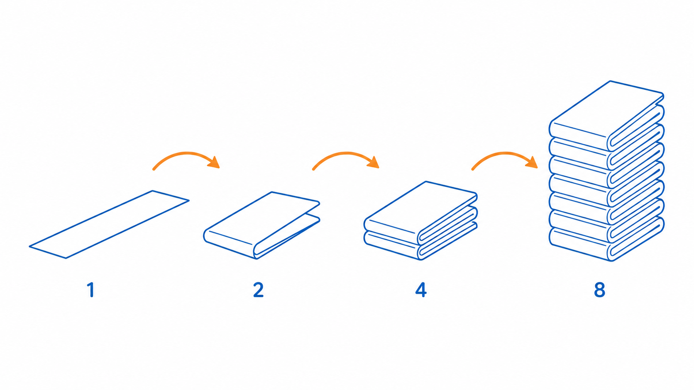
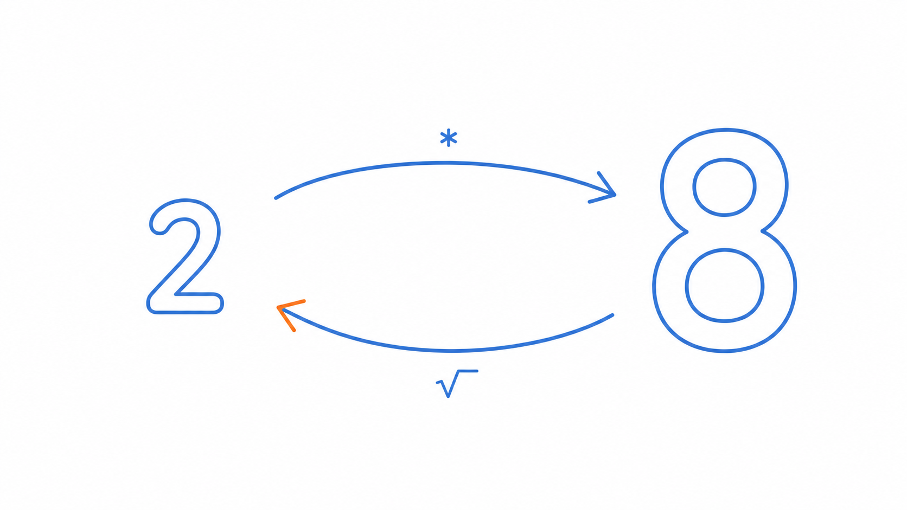
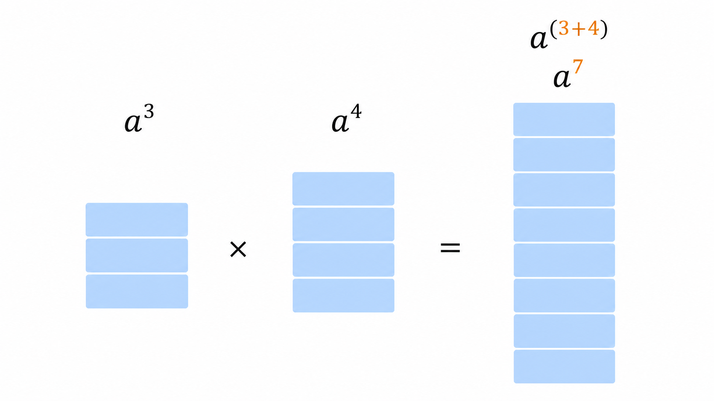
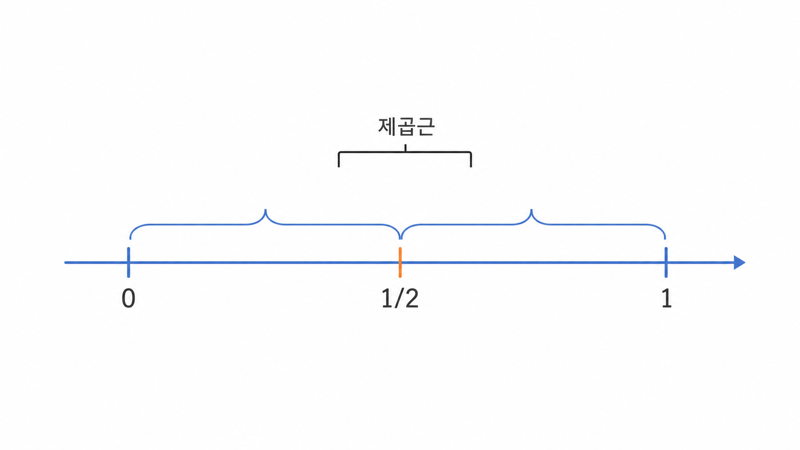
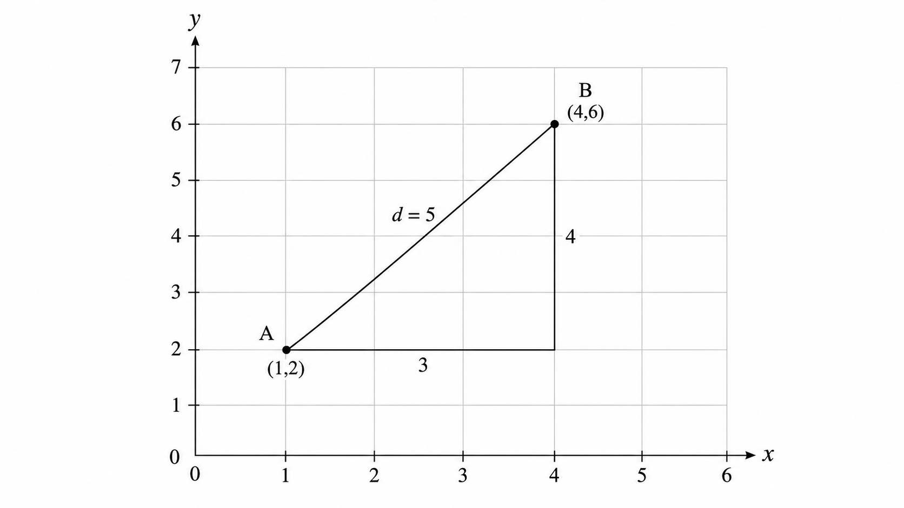

# Ch.2 · 접으면 두 배 : 지수와 제곱근 — v0.2

> 이번 강: (도구 채우기) → 숫자를 *접었다 펴는* 감각
> 한 줄 요약: 거리와 스케일을 다루려면, 숫자를 접는 도구(지수)와 펴는 도구(제곱근)가 필요합니다.
> 핵심 개념: 거듭제곱 · 제곱근 · 분수지수 · 피타고라스 거리

---

## 이야기 파트

### 거리 : "가깝다"는 말이 발에 걸리다

다시 강의로 돌아온 오픈이. 이번엔 임베딩이라는 단어가 나오는 대목이었습니다.

*"비슷한 단어일수록, 서로 가까이 놓입니다."*

화면에는 점 몇 개가 흩뿌려진 그림이 떠 있었습니다. '왕'과 '여왕'은 붙어 있고, '왕'과 '바나나'는 멀찍이 떨어져 있었습니다. 강사는 말했습니다. "그래서 두 단어가 얼마나 비슷한지는, 두 점 사이의 **거리**로 잽니다."

오픈이는 고개를 끄덕이다 멈췄습니다.

*거리라고? 그래, 지도에서 두 도시 사이 거리는 자로 재면 되지. 그런데 점이 종이 위에 찍혀 있는 것도 아니고, 숫자 쌍으로만 주어졌는데 — 거리를 어떻게 계산으로 구하지?*

게다가 슬라이드 구석에는 처음 보는 기호가 얌전히 앉아 있었습니다. $\sqrt{\ }$ 라는, 지붕 같은 표시. 그 옆엔 $2^{10}=1024$ 같은 숫자도 보였습니다. 작은 2가 위에 붙으니 천 단위가 튀어나왔습니다.

오픈이는 직감했습니다. 거리를 재든 큰 수를 다루든, 그 바닥에는 **숫자를 부풀리고 되돌리는 어떤 도구**가 깔려 있다는 것을요.

### 종이 접기 : 접을수록 두 배, 펴면 제자리

오픈이는 책상 위 메모지 한 장을 집어 들었습니다.

반으로 한 번 접으면 두 겹. 또 접으면 네 겹. 또 접으면 여덟 겹. 손가락으로 세어 보던 오픈이는, 접을 때마다 겹이 **두 배씩 불어난다**는 걸 알아챘습니다. 열 번만 접어도 천 겹이 넘습니다(아까 그 1024가 바로 이것이었습니다). 흔히 하는 이야기로, 종이를 마흔세 번만 접을 수 있다면 그 두께가 달까지 닿는다고 하죠. 접는 횟수는 고작 마흔셋인데, 결과는 상상 밖으로 커집니다.

이게 바로 **같은 수를 반복해서 곱한다**는 것의 힘입니다. 곱하기를 거듭할수록 숫자는 천천히 커지는 게 아니라 가파르게 치솟습니다.

*그림 2-1: 한 번 접을 때마다 겹은 두 배. 접는 횟수는 더디 늘어도 두께는 가파르게 치솟는다.*

그런데 반대로도 생각해 봅시다. 누군가 두께만 알려주고 묻습니다. "이거, 몇 번 접은 거야?" 또는 더 단순하게 — "넓이가 이만큼인 정사각형이 있는데, 한 변의 길이는 얼마지?" 이건 곱하기를 **거꾸로 되돌리는** 질문입니다. 부풀린 걸 도로 펴서 원래 크기를 찾는 일이죠.

접는 도구가 있으면, 펴는 도구도 있어야 짝이 맞습니다. 접는 쪽이 거듭제곱이라면, 펴는 쪽이 바로 그 지붕 기호 — **제곱근**입니다.

*그림 2-2: 접는 도구(거듭제곱)와 펴는 도구(제곱근)는 서로 반대 방향의 한 쌍이다.*

### 다시 펴기 : 이번 강에서 새로 쌓는 것

이 책의 약속을 다시 떠올려 봅니다. **이해한 척하고 넘어가지 않기.** 비유로 감을 잡았으면, 직접 손으로 풀어서 진짜 내 것으로 만듭니다.

그래서 이번 강에서 챙길 도구는 세 가지입니다.

첫째, **거듭제곱**과 그 계산 규칙(지수법칙). 둘째, 그것을 되돌리는 **제곱근**. 셋째, 이 둘이 사실은 한 몸이라는 사실 — **분수지수**. "반쯤 접는다"는 묘한 말이 어떻게 제곱근과 같아지는지 보게 됩니다.

그리고 이 도구들이 처음으로 빛을 보는 곳이 바로 아까 그 **거리** 문제입니다. 평면 위 두 점 사이의 곧은 거리는, 학창 시절 배운 피타고라스 정리 — 그러니까 제곱과 제곱근 — 하나로 깔끔하게 떨어집니다. 임베딩에서 두 단어가 "얼마나 가까운가"를 재는 그 계산의 가장 작은 원형이, 지금 우리 손끝에 있습니다.

별것 아닌 도구 같나요? 하지만 숫자를 자유롭게 부풀리고 되돌릴 줄 알아야, 다음 강의 로그도, 한참 뒤의 거리·유사도 계산도 막힘없이 따라갈 수 있습니다.

### 이것만은 기억하자

- **거듭제곱은 숫자를 접는 도구(반복해서 곱하기), 제곱근은 그걸 펴서 되돌리는 도구입니다.**
- 이 둘은 분수지수로 한 몸이 됩니다 — $\sqrt{a}$ 는 곧 $a^{1/2}$.
- 두 점 사이의 거리는 제곱과 제곱근(피타고라스)으로 구합니다. 이게 임베딩에서 "가깝다"를 재는 계산의 원형입니다.
- 다음 강에서는, 접은 횟수를 거꾸로 캐묻는 도구 — **로그** — 를 만납니다.

---

## 기술 파트

### 용어 정리

이야기 속 비유를 진짜 수학 용어로 정리합니다. 앞으로는 이 이름들로 부릅니다.

| 이야기 속 비유 | 진짜 용어 | 정식 정의 |
|--------------|----------|----------|
| 같은 수를 반복해서 곱하기(접기) | 거듭제곱(power) $a^n$ | 밑 $a$를 $n$번 곱한 값. $a$는 밑(base), $n$은 지수(exponent) |
| 부풀린 걸 도로 펴기 | 제곱근(square root) $\sqrt{a}$ | 제곱하면 $a$가 되는 0 이상의 수 |
| 반쯤 접기 | 분수지수(fractional exponent) $a^{1/n}$ | 지수가 분수인 거듭제곱. 제곱근을 지수로 표현한 것 |
| 두 점 사이의 곧은 거리 | 유클리드 거리(Euclidean distance) | 피타고라스 정리로 구하는 두 점 사이 직선 거리 |

### 접는 도구 : 거듭제곱과 지수법칙

거듭제곱은 같은 수를 여러 번 곱한 것을 짧게 쓴 표기입니다.

$$a^n = \underbrace{a \times a \times \cdots \times a}_{n\text{개}}$$

예를 들어 $2^{10}$ 은 2를 열 번 곱한 1024입니다. 종이를 열 번 접었을 때의 겹 수와 같습니다.

여기서 중요한 건, 거듭제곱끼리 곱하거나 나눌 때 지수만 보고 계산하는 **지수법칙**입니다. 밑이 같을 때, 곱셈은 지수의 덧셈이 되고 나눗셈은 지수의 뺄셈이 됩니다.

$$a^m \times a^n = a^{m+n}, \qquad \frac{a^m}{a^n} = a^{m-n}, \qquad (a^m)^n = a^{m\,n}$$

말로 다시 읽으면 이렇습니다. **곱하면 지수끼리 더하고, 나누면 빼고, 거듭제곱을 또 거듭제곱하면 곱한다.** 두 번 접은 종이를 세 묶음 포개면 결국 여섯 번 접은 두께가 되는 것과 같은 이치입니다.

*그림 2-3: 밑이 같으면 곱셈은 지수의 덧셈 — 블록을 포갠 만큼 지수가 더해진다.*

이 규칙을 끝까지 밀고 가면, 처음엔 이상해 보이는 두 약속이 자연스럽게 따라 나옵니다.

$$a^0 = 1, \qquad a^{-n} = \frac{1}{a^n} \quad (a \ne 0)$$

$a^0=1$ 은 "한 번도 접지 않은 상태(곱한 게 없으니 그대로 1)"로, $a^{-n}$ 은 "거꾸로 펴는 방향"으로 이해하면 됩니다. 음수 지수는 분모로 내려간다 — 이 한 줄만 기억하면 충분합니다.

### 펴는 도구 : 제곱근, 그리고 분수지수

제곱근 $\sqrt{a}$ 는 "제곱하면 $a$ 가 되는 수"입니다. $\sqrt{9}=3$ 인 이유는 $3^2=9$ 이기 때문입니다. 넓이가 9인 정사각형의 한 변을 되찾는 일과 같습니다.

그런데 이 펴는 도구는, 사실 접는 도구와 다른 물건이 아닙니다. **분수지수**로 쓰면 둘은 한 식 안에서 만납니다.

$$\sqrt{a} = a^{1/2}, \qquad \sqrt[n]{a} = a^{1/n}, \qquad \sqrt[n]{a^m} = a^{m/n}$$

왜 $\sqrt{a}=a^{1/2}$ 일까요? 지수법칙에 그대로 넣어 보면 보입니다. $a^{1/2}$ 를 제곱하면,

$$\left(a^{1/2}\right)^2 = a^{\frac{1}{2}\times 2} = a^1 = a$$

제곱해서 $a$ 가 되는 수 — 이게 바로 제곱근의 정의입니다. 그러니 "반쯤 접는다($\tfrac12$ 만큼 거듭제곱한다)"는 말이 곧 "한 번 편다(제곱근)"와 같은 뜻이 됩니다. 접기와 펴기가 같은 자(지수) 위의 양쪽 눈금이었던 셈입니다.

*그림 2-4: 지수를 눈금자로 보면 $a^{1/2}$는 딱 절반 지점 — 그래서 제곱근과 같다.*

### 계산 예제 1 : 접고 펴기를 한 번에

말로만 보면 미끄러집니다. 숫자로 끝까지 풀어봅니다.

**문제.** $\dfrac{2^3 \times 2^4}{2^5}$ 와 $8^{2/3}$ 의 값을 각각 구하세요.

**(1) 지수법칙으로 정리하기.**
밑이 모두 2로 같으니, 곱은 지수를 더하고 나눗셈은 뺍니다.

$$\frac{2^3 \times 2^4}{2^5} = \frac{2^{3+4}}{2^5} = 2^{7-5} = 2^2 = 4$$

**(2) 분수지수를 제곱근으로 읽기.**
$8^{2/3}$ 의 지수 $\tfrac{2}{3}$ 는 "세제곱근을 구한 뒤 제곱하라"는 뜻입니다($\sqrt[3]{8^2}$). 순서를 바꿔, 먼저 세제곱근부터 구하는 편이 쉽습니다.

$$8^{2/3} = \left(8^{1/3}\right)^2 = \left(\sqrt[3]{8}\right)^2$$

$2^3 = 8$ 이므로 $\sqrt[3]{8}=2$. 따라서

$$8^{2/3} = 2^2 = 4$$

**답.** 두 값 모두 $4$ 입니다. 접는 규칙(지수법칙) 하나로 곱·나눗셈·제곱근이 전부 처리되는 걸 확인했습니다.

### 계산 예제 2 : 두 점 사이의 거리 재기

이번엔 도입에서 걸렸던 "거리" 문제를 직접 풀어봅니다.

**문제.** 평면 위 두 점 $A=(1,\ 2)$, $B=(4,\ 6)$ 사이의 거리를 구하세요. (임베딩에서 단어를 좌표로 단순화했다고 생각하면 됩니다.)

**1단계 — 가로·세로로 얼마나 떨어졌나.**
$x$ 방향 차이는 $4-1=3$, $y$ 방향 차이는 $6-2=4$ 입니다. 두 점을 빗변으로 하는 직각삼각형의 두 변이 각각 3과 4인 셈입니다.

**2단계 — 피타고라스 정리 세우기.**
직각삼각형에서 빗변의 제곱은 두 변의 제곱의 합입니다. 거리를 $d$ 라 하면,

$$d^2 = 3^2 + 4^2 = 9 + 16 = 25$$

**3단계 — 제곱근으로 펴기.**
$d^2=25$ 에서 $d$ 를 되찾으려면, 제곱을 되돌리는 제곱근을 씌웁니다.

$$d = \sqrt{25} = 5$$

**답.** 두 점 사이 거리는 $5$ 입니다. 좌표(숫자 쌍)만 주어져도, 제곱과 제곱근만으로 거리가 깔끔하게 떨어집니다.

### 그래프로 확인하기

*그림 2-5: 가로 3, 세로 4인 직각삼각형의 빗변이 두 점 사이 거리 5다. 좌표만 있으면 제곱과 제곱근으로 거리가 나온다.*

그림을 보면, 방금 계산한 직각삼각형이 그대로 보입니다. 가로로 3칸, 세로로 4칸 떨어진 두 점을 잇는 빗변의 길이가 5. 손으로 구한 답과 눈으로 본 그림이 일치합니다 — 이게 "직접 풀어서 확실히"의 두 번째 경험입니다.

### 연습문제

직접 풀어보세요. 해답은 책 뒤 부록에 모아 두었습니다.

1. 다음을 간단히 하세요: $\dfrac{3^5 \times 3^2}{3^4}$.
2. $16^{3/4}$ 의 값을 구하세요. (먼저 네제곱근을 구한 뒤 세제곱하면 쉽습니다.)
3. 두 점 $P=(2,\ 1)$, $Q=(5,\ 5)$ 사이의 거리를 구하세요.

### 이게 AI 어디에 쓰이나

임베딩은 단어 하나를 수백 개의 숫자(좌표)로 바꿔 놓습니다. 그래야 "왕과 여왕은 가깝고, 왕과 바나나는 멀다"를 **거리라는 하나의 숫자**로 잴 수 있으니까요. 그 거리를 구하는 식이 바로 방금 푼 피타고라스의 확장판입니다 — 차이를 제곱해 모두 더한 뒤, 제곱근으로 펴는 것. 좌표가 2개에서 768개로 늘어도 원리는 똑같습니다.

거듭제곱은 또 다른 곳에서 일합니다. AI가 다루는 값은 아주 크거나 아주 작아 자릿수가 들쭉날쭉한데, 지수는 이런 **스케일**을 한 손에 쥐게 해줍니다. 그래서 다음 강에서는, 큰 수를 다루기 좋게 "접은 횟수"로 바꿔 읽는 도구 — **로그** — 로 넘어갑니다. 11강에서는 오늘의 거리 감각이 내적·코사인 유사도로 자라나, 어텐션이 단어들을 서로 견주는 바로 그 계산이 됩니다.
