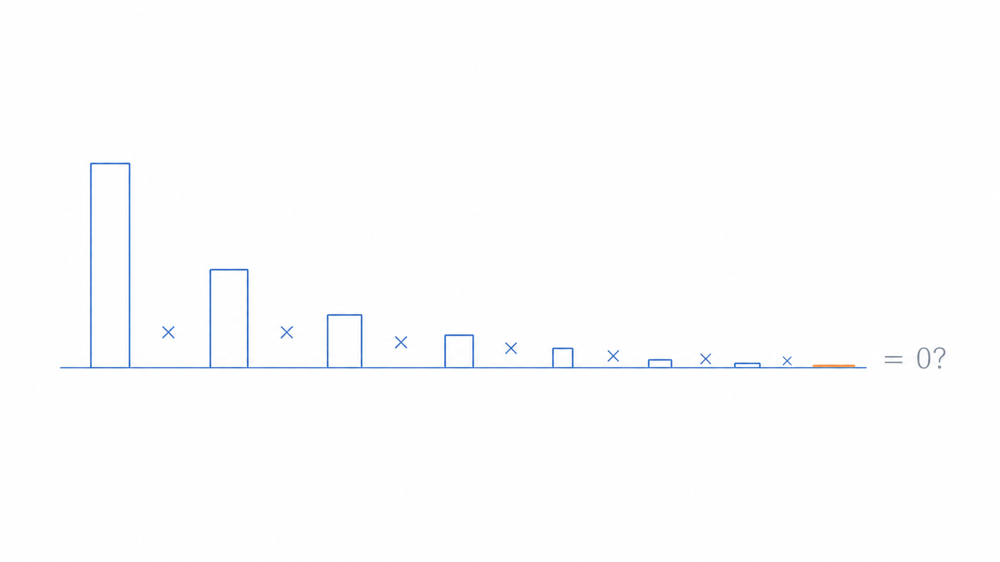
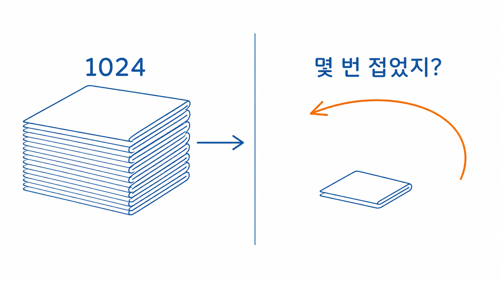
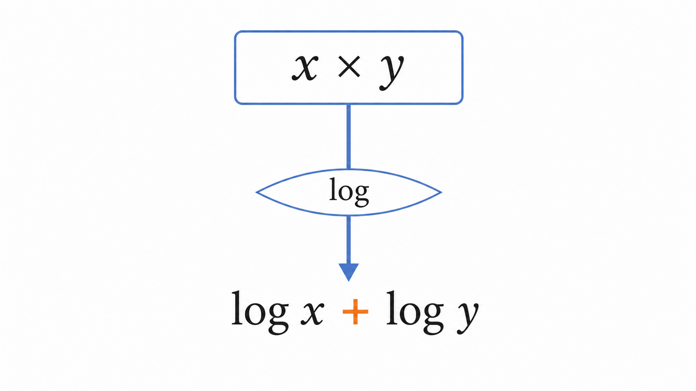
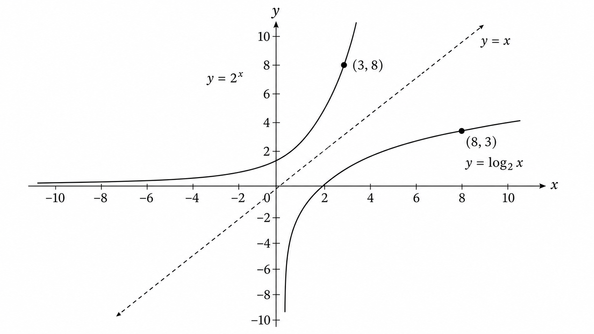

# Ch.3 · 지수의 거울 : 로그 — v0.3

> 이번 강: (도구 채우기) → 곱셈을 *덧셈으로 갈아타는* 감각
> 한 줄 요약: 로그는 "몇 번 접었는지"를 거꾸로 캐묻는 도구이자, 곱셈을 덧셈으로 바꿔주는 변신기입니다.
> 핵심 개념: 로그 · 지수의 역 · 곱→합 변환 · 로그 법칙

---

## 이야기 파트

### 사라지는 확률 : 곱했더니 0이 되어버리다

또 한 번 강의를 듣던 오픈이. 이번엔 "언어 모델이 문장의 확률을 계산한다"는 대목이었습니다.

설명은 이랬습니다. 모델은 단어를 하나씩 예측하는데, 각 단어가 맞을 확률을 쭉 **곱한다**는 겁니다. "나는"이 나올 확률 0.2, 다음에 "밥을"이 나올 확률 0.1, 그다음 "먹었다"가 나올 확률 0.05… 이런 식으로요.

오픈이는 종이에 슬쩍 계산해 봤습니다.

$$0.2 \times 0.1 \times 0.05 = 0.001$$

세 단어만 곱했는데 벌써 0.001입니다. *그럼 단어가 백 개, 천 개인 문장은?* 0.1 같은 수를 수백 번 곱하면, 결과는 0.000…0001처럼 **0에 한없이 달라붙습니다.** 컴퓨터조차 "이건 그냥 0"이라고 포기해버릴 만큼 작은 수가 되죠.

*그림 3-1: 작은 확률을 거듭 곱하면 결과가 0으로 무너져 내린다.*

*확률을 곱하는 건 알겠어. 그런데 이렇게 다 사라져버리면, 모델은 대체 뭘 보고 "이 문장이 저 문장보다 그럴듯하다"를 판단하지?*

오픈이는 직감했습니다. 곱셈을 그대로 두면 안 되겠다고. 이 작아지는 곱셈을, 뭔가 **다루기 쉬운 형태로 갈아탈 도구**가 필요하다는 걸요.

### 거울 : 접은 횟수를 거꾸로 묻기

오픈이는 지난번 종이접기를 다시 떠올렸습니다.

접을 때마다 두께가 두 배. 열 번 접으면 1024겹. 그때는 "몇 번 접으면 얼마나 두꺼워지나"를 물었습니다. 곱하는 방향이었죠.

그런데 이번엔 질문이 거꾸로입니다. **"두께가 1024겹이 됐어. 그럼 몇 번 접은 거지?"** 답은 열 번. 결과를 주고 "접은 횟수"를 되묻는 겁니다.

이 거꾸로 묻기가 바로 **로그**입니다. 지수가 "몇 번 곱했나"를 곱셈으로 키워가는 도구라면, 로그는 그 앞에 거울을 세워 **"몇 번 곱한 거야?"를 되읽는 도구**입니다. 지수와 로그는 같은 사건을 양쪽에서 바라본 한 쌍이에요.

*그림 3-2: 결과(1024겹)를 주고 "몇 번 접었지?"를 거꾸로 묻는 것이 로그다.*

그런데 이 거울에는 묘한 재주가 하나 더 있습니다. 거울 앞에 서면 **곱셈이 덧셈으로 바뀝니다.**

무슨 말이냐면 — 이미 세 번 접어 8겹이 된 뭉치가 있다고 합시다. 여기서 멈추지 않고 **네 번 더 접으면** 어떻게 될까요? 한 번 접을 때마다 두께가 두 배니까, $8 \to 16 \to 32 \to 64 \to 128$겹. 처음 8겹이 16배로 불어나 $8 \times 16 = 128$겹이 됐습니다. (16배라는 건 곧 네 번 더 접는다는 뜻이에요. $16 = 2^4$, 즉 두 배를 네 번이니까요.)

곱셈이 일어났습니다. 그런데 이걸 "접은 횟수"로 세면? 처음 3번에 4번을 더했으니 3 + 4 = **7번.** 두께를 16배로 키우는 곱셈이, 접은 횟수에서는 그저 4를 더하는 덧셈으로 내려앉았습니다. ($2^7 = 128$이 맞죠.)

> 여기서 주의 하나. 접은 종이 두 뭉치를 그냥 **포개기만** 하면 층은 더해질 뿐입니다(8겹 + 16겹 = 24겹). 곱셈 128겹이 나오는 건 포개서가 아니라, 이미 접은 것을 **다시 더 접을 때**입니다. "곱셈 → 덧셈"의 마법은 바로 이 *다시 접기* 에서 나옵니다.

오픈이의 눈이 번쩍였습니다.

*그래, 이거다. 확률을 곱하면 0으로 사라지지만, 로그라는 거울을 통과시키면 곱셈이 덧셈이 돼. 덧셈은 아무리 더해도 갑자기 0으로 사라지지 않잖아.*

### 다시 펴기 : 이번 강에서 새로 쌓는 것

이 책의 약속을 다시 떠올립니다. **이해한 척하고 넘어가지 않기.**

이번 강에서 챙길 도구는 두 가지입니다.

첫째, **로그의 정의** — 그것이 지수의 거울(역연산)이라는 사실. "$2$를 몇 번 곱해야 $8$이 되지?"라는 질문에 답하는 게 로그입니다. 둘째, 그 거울의 핵심 재주인 **로그 법칙** — 곱셈을 덧셈으로, 나눗셈을 뺄셈으로 바꾸는 규칙.

이 도구가 빛을 보는 곳이, 방금 오픈이가 걸렸던 "사라지는 확률" 문제입니다. 작은 확률을 수없이 곱하는 대신, 로그를 씌워 **더하기로 갈아타면** 숫자가 0으로 무너지지 않습니다. 이게 나중에 만날 **로그우도**와 **손실 함수**의 출발점입니다.

별것 아닌 거울 같나요? 하지만 곱셈을 덧셈으로 바꿀 줄 안다는 건, AI가 다루는 수많은 확률을 안전하게 계산하는 첫 번째 열쇠입니다.

### 이것만은 기억하자

- **로그는 지수의 거울입니다.** "몇 번 곱했나"를 거꾸로 되묻는 역연산이에요.
- 로그의 가장 큰 재주는 **곱셈을 덧셈으로 바꾸는 것**입니다 — $\log(xy) = \log x + \log y$.
- 그래서 0으로 사라질 만큼 작은 확률의 곱도, 로그를 씌우면 더하기로 안전하게 다룰 수 있습니다.
- 다음 강에서는, 곡선 위 한 점의 "기울기"를 들여다보기 위해 **함수·극한** 으로 넘어갑니다.

---

## 기술 파트

### 용어 정리

이야기 속 비유를 진짜 수학 용어로 정리합니다. 앞으로는 이 이름들로 부릅니다.

| 이야기 속 비유 | 진짜 용어 | 정식 정의 |
|--------------|----------|----------|
| 접은 횟수를 거꾸로 묻기 | 로그(logarithm) $\log_a x$ | $a^{\,?}=x$ 의 물음표를 구하는 값. $a$는 밑(base) |
| 지수의 거울 | 역함수(inverse) 관계 | $y=a^x$ 와 $y=\log_a x$ 는 서로 역연산 |
| 곱셈이 덧셈으로 내려앉음 | 로그의 곱셈 법칙 | $\log_a(xy)=\log_a x+\log_a y$ |
| 사라지는 확률을 더하기로 | 로그우도(log-likelihood) | 확률의 곱에 로그를 씌워 합으로 바꾼 값 (7강·15강에서 본격적으로 다룸) |

### 로그란 무엇인가 : 지수를 거꾸로 읽기

지수는 "밑 $a$를 몇 번 곱했나"를 묻고, 그 결과를 내놓습니다.

$$a^n = x \quad (\text{밑 } a \text{를 } n \text{번 곱하면 } x)$$

로그는 이 식을 **거꾸로** 읽습니다. 결과 $x$를 주고, 지수 $n$을 되찾는 거죠.

$$\log_a x = n \quad \Longleftrightarrow \quad a^n = x$$

이 두 식은 **완전히 같은 말**입니다. 방향만 다를 뿐이에요. 말로 다시 읽으면, "$\log_a x$는 *$a$를 몇 번 곱해야 $x$가 되는가*라는 질문의 답"입니다.

예를 들어 봅니다.

$$\log_2 8 = 3 \quad (\because 2^3 = 8), \qquad \log_{10} 1000 = 3 \quad (\because 10^3 = 1000)$$

종이를 몇 번 접어야 8겹이 되느냐 — 세 번. 그게 $\log_2 8 = 3$입니다.

> 밑이 $10$인 로그($\log_{10}$)는 상용로그라 부르고, 흔히 밑을 생략해 $\log x$로 씁니다. 밑이 특별한 수 $e$인 자연로그($\ln$)는 6강에서 따로 만납니다.

### 로그의 핵심 재주 : 곱을 합으로

로그가 AI에서 그토록 자주 쓰이는 이유는 단 하나, **곱셈을 덧셈으로 갈아태우기** 때문입니다. 세 가지 법칙으로 정리됩니다.

$$\log_a(xy) = \log_a x + \log_a y$$
$$\log_a\left(\frac{x}{y}\right) = \log_a x - \log_a y$$
$$\log_a(x^k) = k\,\log_a x$$

말로 다시 읽으면 이렇습니다. **곱하면 더해지고, 나누면 빼지고, 거듭제곱은 앞으로 끌어내려 곱한다.**

왜 곱이 합이 될까요? 첫 번째 법칙만 지수로 확인해 봅니다. $x = a^m$, $y = a^n$ 이라 두면(즉 $\log_a x = m$, $\log_a y = n$), 지수법칙에 의해

$$xy = a^m \times a^n = a^{m+n}$$

이 식을 로그로 되읽으면, $xy$를 만들기 위한 지수는 $m+n$입니다. 즉 $\log_a(xy) = m+n = \log_a x + \log_a y$. 2강에서 본 "곱하면 지수끼리 더한다"가, 거울에 비치니 그대로 로그 법칙이 된 겁니다.

*그림 3-3: 로그를 통과하면 곱셈(×)이 덧셈(+)으로 내려앉는다.*

### 계산 예제 : 곱셈을 덧셈으로 갈아타기

말로만 보면 미끄러집니다. 숫자로 끝까지 풀어봅니다.

**문제.** $\log_2 (8 \times 16)$ 의 값을, (1) 곱한 뒤 로그를 취하는 방법과 (2) 로그 법칙으로 쪼개는 방법, 두 가지로 구해 비교하세요.

**(1) 곱한 뒤 로그 취하기.**
먼저 안쪽을 곱합니다.

$$8 \times 16 = 128$$

이제 $2$를 몇 번 곱해야 $128$이 되는지 묻습니다. $2^7 = 128$ 이므로,

$$\log_2 128 = 7$$

**(2) 로그 법칙으로 쪼개기.**
곱셈 법칙 $\log_a(xy) = \log_a x + \log_a y$ 를 그대로 적용합니다.

$$\log_2(8 \times 16) = \log_2 8 + \log_2 16$$

각각은 "몇 번 접었나"로 바로 읽힙니다. $2^3 = 8$ 이니 $\log_2 8 = 3$, $2^4 = 16$ 이니 $\log_2 16 = 4$. 따라서

$$\log_2 8 + \log_2 16 = 3 + 4 = 7$$

**답.** 두 방법 모두 $7$ 입니다. (1)은 큰 수 $128$을 거쳐 갔지만, (2)는 **곱셈을 아예 덧셈 $3+4$로 갈아타** 큰 수를 만들지 않고 답에 도착했습니다. 확률 수백 개를 다룰 때 (2)의 방식이 왜 안전한지가 여기서 보입니다.

### 그래프로 확인하기

*그림 3-4: 지수와 로그는 직선 y=x를 거울축으로 대칭이다. 지수 위의 점 (3, 8)이 로그에서는 (8, 3)으로 뒤집힌다 — "몇 번 곱했나"를 거꾸로 읽은 것.*

그림을 보면, 지수함수와 로그함수가 점선 $y=x$를 사이에 두고 서로 거울처럼 마주 보고 있습니다. 지수 곡선 위의 점 $(3,\ 8)$ — "세 번 접으면 8겹" — 이 로그 곡선에서는 $(8,\ 3)$ — "8겹은 세 번 접은 것" — 으로 뒤집혀 앉아 있습니다. 비유로 잡은 "거울"이 그래프에서 그대로 보입니다.

### 연습문제

직접 풀어보세요. 해답은 책 뒤 부록에 모아 두었습니다.

1. $\log_3 81$ 의 값을 구하세요. ($3$을 몇 번 곱해야 $81$이 되는지 생각하면 됩니다.)
2. 로그 법칙을 이용해 $\log_2 (4 \times 32)$ 를 덧셈으로 쪼개 구하세요.
3. 어떤 문장의 확률이 $P = 0.5 \times 0.25 \times 0.125$ 로 주어졌습니다. 양변에 밑이 $2$인 로그를 씌워 $\log_2 P$ 를 덧셈으로 구하세요. (힌트: $0.5 = 2^{-1}$, $0.25 = 2^{-2}$, $0.125 = 2^{-3}$)

### 이게 AI 어디에 쓰이나

언어 모델은 문장의 확률을 단어별 확률의 **곱**으로 계산합니다. 그런데 작은 확률을 수백 번 곱하면 0으로 사라져 컴퓨터가 다룰 수 없게 됩니다. 그래서 실제로는 확률에 로그를 씌워 **곱을 합으로 바꾼** 값 — **로그우도** — 을 씁니다. $\log(p_1 \times p_2 \times \cdots) = \log p_1 + \log p_2 + \cdots$ 로, 아무리 단어가 많아도 안전한 덧셈이 됩니다.

이 "곱→합" 변환은 한 번 배워두면 곳곳에서 다시 만납니다. 7강에서 자연로그 $\ln$ 과 함께 손실 함수의 토대가 되고, 15강에서 모델이 "얼마나 틀렸나"를 재는 손실을 정의할 때 되돌아옵니다. 곱셈을 덧셈으로 갈아타는 이 거울 하나가, 그 모든 계산을 떠받칩니다.
