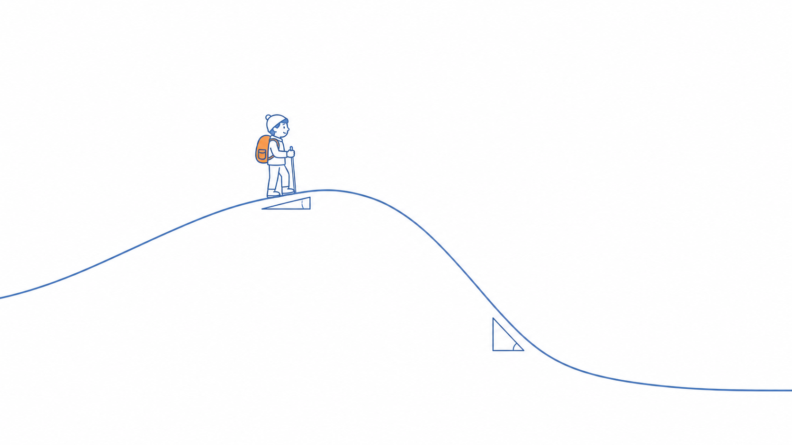
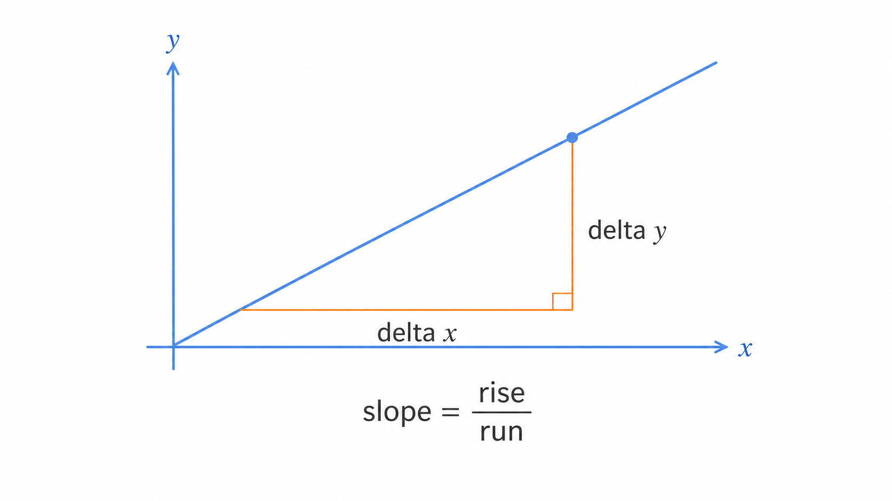
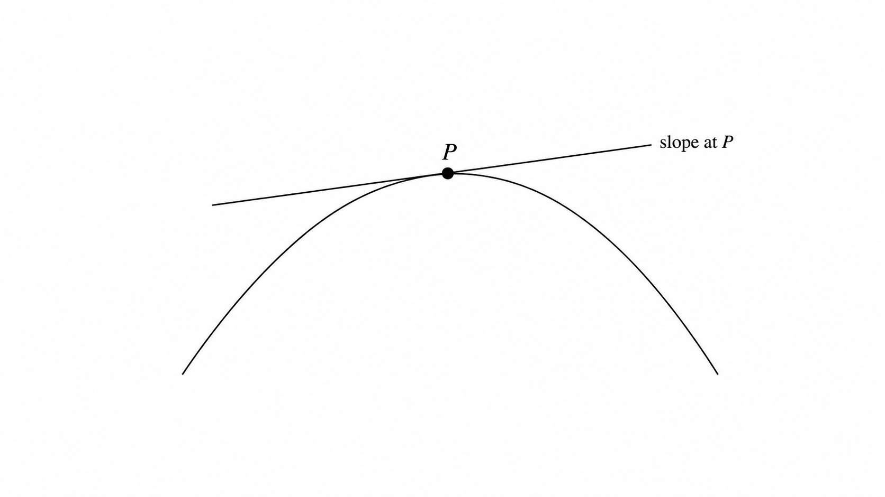
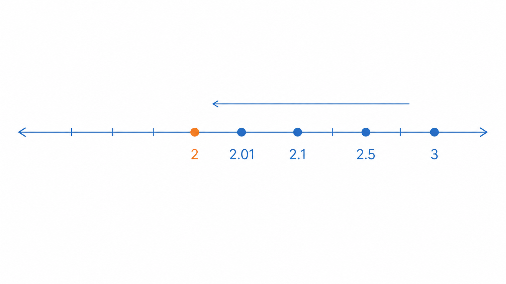
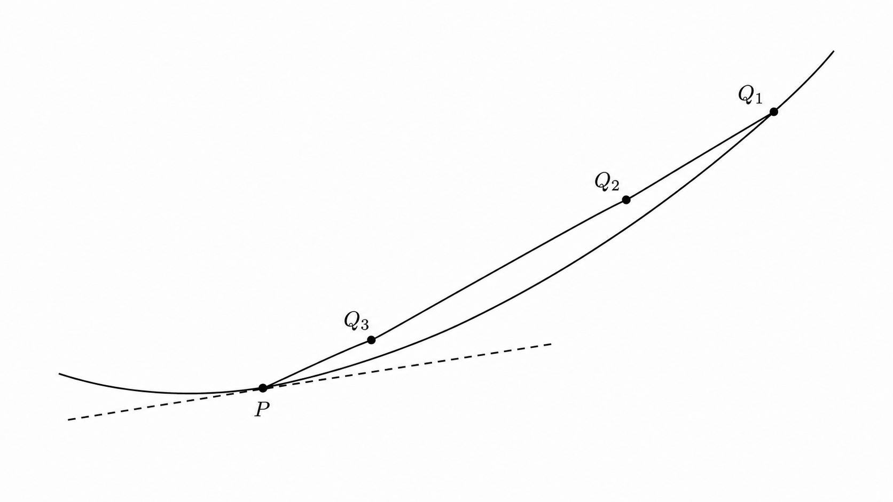

# Ch.4 · 언덕의 경사 : 함수·극한·기울기 — v0.4

> 이번 강: (다리 놓기) → 곡선 위 *한 점의 경사*를 재는 감각
> 한 줄 요약: 곡선은 발밑마다 경사가 다릅니다. 그 "지금 이 점의 경사"를, 두 점을 한없이 좁혀서 재는 게 이번 강입니다.
> 핵심 개념: 함수 · 평균변화율(기울기) · 극한 · 순간기울기

---

## 이야기 파트

### 기울기 : 또 모르는 말이 나왔다

1강에서 오픈이는 손실을 그릇에 비유했습니다. 어떤 값에서 시작하든 굴러서 도착하는 가장 낮은 한 점. 학습은 그 바닥을 찾는 일이라고요.

그런데 강의는 한 발 더 나갔습니다.

*"손실의 **기울기**를 따라, 가장 가파르게 내려가는 방향으로 조금씩 이동합니다."*

오픈이의 손이 또 멈췄습니다. 기울기. 분명 학창 시절에 들어본 말인데, 그게 손실이라는 그릇과 무슨 상관인지 감이 잡히질 않았습니다.

가만 생각해 보니 직관은 있었습니다. 그릇 안에 구슬이 놓이면, 구슬은 **경사가 진 쪽으로** 굴러 내려갑니다. 벽이 가파른 곳에서는 빠르게, 바닥에 가까워 완만한 곳에서는 천천히. 그러다 경사가 완전히 0이 되는 자리 — 그게 바닥이고요.

*그러니까 "어느 쪽으로 굴러야 내려가는지"와 "얼마나 가파른지"를 알려주는 게 기울기구나. 그런데 곡선의 경사를, 정확히 어떻게 숫자로 잰다는 거지?*

직선이라면 쉬울 것 같았습니다. 곧게 뻗은 비탈은 어디서 재든 경사가 똑같으니까요. 문제는 그릇처럼 휜 곡선이었습니다. 곡선은 **자리마다 경사가 다릅니다.** 바로 그 "한 자리의 경사"를 어떻게 집어내는가 — 이게 이번 강의 숙제였습니다.

### 언덕 : 발밑의 경사는 어떻게 재나

오픈이는 등산을 떠올렸습니다.

완만한 비탈을 오를 때와 깎아지른 구간을 오를 때, 다리에 걸리는 힘이 다릅니다. 우리는 "지금 이 지점이 얼마나 가파른가"를 몸으로 느끼죠. 그런데 그걸 숫자로 재라고 하면 어떻게 할까요?

가장 단순한 방법. **두 지점을 잡아, 수평으로 간 거리에 비해 얼마나 높이 올라갔는지**를 보는 겁니다. 100미터 걷는 동안 10미터 올라갔으면, 경사는 "10/100". 이건 직선 비탈에서는 완벽합니다.

하지만 휜 언덕에서는 약간 어긋납니다. 두 지점을 멀찍이 잡으면, 그 사이 어딘가는 가파르고 어딘가는 완만했을 텐데, 둘을 뭉뚱그린 **평균 경사**만 나오니까요. 내가 알고 싶은 건 "바로 지금 발밑"의 경사인데 말입니다.

*그림 4-1: 휜 언덕은 자리마다 경사가 다르다 — 멀리 두 점을 잡으면 평균 경사만, 발밑은 "지금 이 점"의 경사다.*

여기서 오픈이는 영리한 생각을 합니다.

*두 지점을 가깝게, 더 가깝게 잡으면 어떨까? 1미터 간격으로, 1센티미터 간격으로, 점점 더 좁히면 — 그 사이가 거의 직선처럼 보일 만큼 짧아질 테고, 그럼 평균 경사가 "지금 이 점의 경사"에 한없이 가까워지지 않을까?*

바로 이겁니다. 두 점 사이를 **한없이 좁혀 가며** 따라가는 이 발상이, 이번 강의 심장입니다. 좁히고 좁혀서 다가가는 그 값 — 수학은 이걸 **극한**이라 부릅니다.

### 다시 펴기 : 이번 강에서 새로 쌓는 것

이 책의 약속을 다시 떠올립니다. **이해한 척하고 넘어가지 않기.**

이번 강에서 챙길 도구는 세 가지입니다.

첫째, **함수** — 입력을 넣으면 출력을 내놓는 기계로 다시 정리합니다. 곡선은 결국 이 기계의 그림이에요. 둘째, **평균변화율** — 두 점 사이의 경사를 재는 법. 셋째, 그 두 점을 한없이 좁혀 얻는 **순간기울기** — "지금 이 한 점"의 경사입니다.

이 도구가 빛을 보는 곳이, 오픈이가 걸렸던 그 "기울기" 문제입니다. 손실 그릇의 어느 점에서든 경사를 잴 수 있으면, "어느 쪽으로 굴러야 내려가는지"를 알 수 있습니다. 그게 8강 경사하강법의 핵심이고요.

그리고 한 가지 예고. 두 점을 좁혀 한 점의 경사를 구하는 이 과정에는 **이름**이 있습니다. 다음 강에서 그걸 **미분**이라 부르며 공식으로 만듭니다. 이번 강은 그 다리입니다.

### 이것만은 기억하자

- **곡선은 자리마다 경사가 다릅니다.** 한 점의 경사를 알아야 "어느 쪽으로 내려가는지"가 보입니다.
- 한 점의 경사는, **두 점을 한없이 좁혀(극한)** 평균 경사가 다가가는 값으로 잡습니다.
- 그릇의 바닥에서는 경사가 **0**입니다 — 1강의 최솟값과 여기서 만납니다.
- 다음 강에서는, 이 "두 점 좁히기"를 **미분**이라는 공식으로 다듬습니다.

---

## 기술 파트

### 용어 정리

이야기 속 비유를 진짜 수학 용어로 정리합니다. 앞으로는 이 이름들로 부릅니다.

| 이야기 속 비유 | 진짜 용어 | 정식 정의 |
|--------------|----------|----------|
| 입력→출력 기계 | 함수(function) $f(x)$ | 입력 $x$ 하나에 출력 $f(x)$ 하나를 대응시키는 규칙 |
| 두 점 사이의 평균 경사 | 평균변화율(average rate) | 두 점 사이 $\dfrac{\text{높이 변화}}{\text{수평 변화}} = \dfrac{\Delta y}{\Delta x}$ |
| 한없이 좁혀 다가가는 값 | 극한(limit) | 입력을 어떤 값에 한없이 가깝게 보낼 때 출력이 다가가는 값 |
| 지금 이 한 점의 경사 | 순간기울기(접선의 기울기) | 두 점 간격을 0으로 보낸 극한으로 얻는 한 점의 기울기 |

### 함수와 직선의 기울기

**함수**는 입력 $x$를 넣으면 출력 $f(x)$를 돌려주는 기계입니다. 1강의 $f(x) = x^2 - 4x + 7$ 도 함수였고, 그 그림이 포물선이었죠.

직선은 가장 단순한 경우입니다. 직선 위에서는 어디를 재든 기울기가 **일정**합니다. 두 점 $(x_1, y_1)$, $(x_2, y_2)$ 를 지나는 직선의 기울기는,

$$\text{기울기} = \frac{\Delta y}{\Delta x} = \frac{y_2 - y_1}{x_2 - x_1}$$

여기서 $\Delta$(델타)는 "변화량"을 뜻하는 기호입니다. $\Delta y$ 는 높이가 변한 양, $\Delta x$ 는 수평으로 간 양. 말로 다시 읽으면, **수평으로 간 거리에 비해 얼마나 높이 올라갔나**입니다.

*그림 4-2: 직선의 기울기는 어디서 재든 같다 — 수평으로 간 양($\Delta x$)에 대한 높이 변화($\Delta y$)의 비.*

### 곡선에서는 — 두 점을 좁혀 간다

곡선에서는 기울기가 자리마다 다릅니다. 그래서 곡선 위 두 점을 이은 직선(이걸 **할선**이라 합니다)의 기울기는, 그 구간의 **평균** 경사일 뿐입니다.

한 점 $x$ 에서의 진짜 경사를 알려면, 옆에 있는 점을 점점 그 점으로 끌어당깁니다. 옆 점을 $x + h$ 라 두면(여기서 $h$ 는 두 점 사이의 간격), 두 점의 평균변화율은

$$\frac{\Delta y}{\Delta x} = \frac{f(x+h) - f(x)}{h}$$

이제 간격 $h$ 를 **0으로 한없이 좁힙니다.** 그때 이 값이 다가가는 극한이, 점 $x$ 에서의 순간기울기입니다.

$$\text{순간기울기} = \lim_{h \to 0} \frac{f(x+h) - f(x)}{h}$$

$\lim_{h \to 0}$ 은 "$h$ 를 0에 한없이 가깝게 보낼 때 다가가는 값"이라는 뜻입니다. ($h$ 에 그냥 0을 넣으면 분모가 0이 되어 버리니, "넣는" 게 아니라 "다가간다"는 점이 핵심입니다.) 이 한 줄이 다음 강 **미분**의 정의가 됩니다.

*그림 4-3: 곡선 위 한 점 P에 살짝 닿는 직선(접선)의 기울기가, 그 점의 순간기울기다.*

### 계산 예제 : 한 점의 기울기를 좁혀서 구하기

말로만 보면 미끄러집니다. 숫자로 끝까지 풀어봅니다.

**문제.** $f(x) = x^2$ 의 $x = 1$ 에서의 순간기울기를, 간격 $h$ 를 줄여 가며 추정하세요.

**1단계 — 평균변화율 식 세우기.**
$x = 1$ 과 $x = 1 + h$ 사이의 평균변화율을 계산합니다.

$$\frac{f(1+h) - f(1)}{h} = \frac{(1+h)^2 - 1^2}{h}$$

**2단계 — 전개해서 정리하기.**
분자를 풀어 봅니다. $(1+h)^2 = 1 + 2h + h^2$ 이므로,

$$\frac{1 + 2h + h^2 - 1}{h} = \frac{2h + h^2}{h} = 2 + h$$

평균변화율이 깔끔하게 $2 + h$ 로 정리됐습니다.

**3단계 — 간격을 좁혀 보기.**
이제 $h$ 를 0 쪽으로 줄여 가며 값을 봅니다.

| 간격 $h$ | 평균변화율 $2 + h$ |
|:---:|:---:|
| $1$ | $3$ |
| $0.5$ | $2.5$ |
| $0.1$ | $2.1$ |
| $0.01$ | $2.01$ |
| $\to 0$ | $\to 2$ |

$h$ 가 0에 가까워질수록 값이 **2** 에 달라붙습니다.

*그림 4-4: 간격 $h$ 를 줄이면 평균변화율 $2+h$ 가 한 값 $2$ 에 한없이 다가간다 — 이것이 극한이다.*

**답.** $f(x) = x^2$ 의 $x = 1$ 에서의 순간기울기는 $2$ 입니다.

$$\lim_{h \to 0} (2 + h) = 2$$

식 $2 + h$ 에서 $h$ 를 0으로 보내면 곧장 2 — 표가 보여준 것과 똑같습니다. 두 점을 좁히는 일이, 결국 이 깔끔한 극한 하나로 떨어집니다.

*그림 4-5: 옆 점 Q를 P로 한없이 끌어당기면, 두 점을 잇는 할선이 점점 P의 접선으로 수렴한다. 평균 경사가 순간기울기로 다가가는 모습.*

### 연습문제

직접 풀어보세요. 해답은 책 뒤 부록에 모아 두었습니다.

1. 두 점 $(2,\ 5)$ 와 $(6,\ 13)$ 을 지나는 직선의 기울기를 구하세요.
2. $f(x) = x^2$ 의 $x = 3$ 에서의 평균변화율 식을 세우고, $2$단계처럼 전개해 $6 + h$ 가 됨을 보이세요. 그리고 $h \to 0$ 일 때의 순간기울기를 구하세요.
3. 1강의 그릇 바닥(최솟값)에서 순간기울기는 얼마일까요? 곡선의 가장 낮은 점에서 접선이 어떤 모양일지 떠올려 답하세요.

### 이게 AI 어디에 쓰이나

학습은 손실 그릇의 바닥을 찾는 일이라고 했습니다(1강). 그런데 거대한 손실 곡면 위 어디에 서 있든, "지금 여기서 어느 쪽으로 가야 내려가는가"를 알려면 **그 점의 기울기**가 필요합니다. 기울기가 가리키는 반대 방향으로 한 걸음 옮기면 손실이 줄어들죠 — 이게 8강 경사하강법의 원리입니다.

지금은 $h$ 를 줄여 가며 손으로 기울기를 추정했지만, 매번 표를 그릴 수는 없습니다. 그래서 다음 강에서 이 극한을 **미분**이라는 공식으로 만들어, 어떤 함수든 한 점의 기울기를 단번에 구하는 법을 배웁니다. 그 기울기가 곧, 신경망이 "어느 방향으로 배워야 하는지"를 알려주는 나침반이 됩니다.
