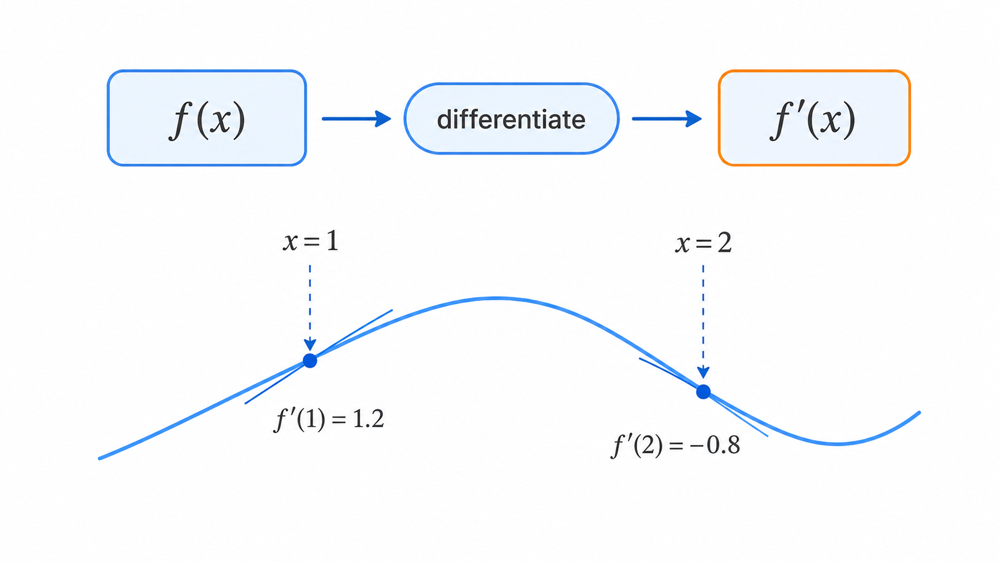
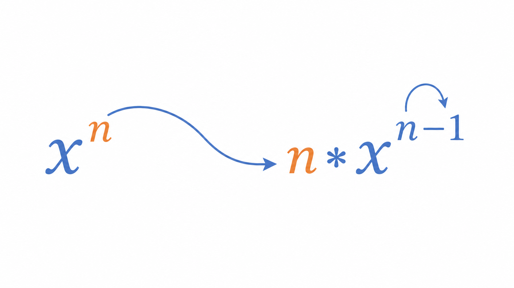
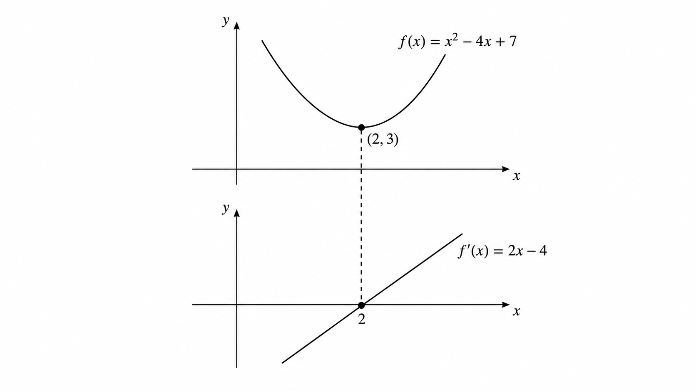

# Ch.5 · 골짜기 바닥 찾기 : 미분 — v0.5

> 이번 강: (합류) → 기울기를 *공식으로* 뽑고, 바닥을 *계산으로* 찍는 감각
> 한 줄 요약: 미분은 모든 점의 경사를 한 번에 내놓는 "기울기 지도"입니다. 그 지도가 0을 가리키는 곳이 골짜기 바닥입니다.
> 핵심 개념: 미분 · 도함수 · 멱법칙 · f'(x)=0

---

## 이야기 파트

### 표를 매번 그릴 순 없잖아

4강에서 오픈이는 곡선 위 한 점의 경사를 재는 법을 익혔습니다. 두 점을 잡고, 간격을 점점 좁혀서, 평균 경사가 다가가는 값을 보는 것. $f(x)=x^2$ 의 $x=1$ 에서 기울기가 2라는 것도 표를 그려 확인했죠.

그런데 책상에 앉아 표를 다시 들여다보던 오픈이는 한숨이 나왔습니다.

*잠깐, 이걸 점마다 매번 해야 한다고?*

손실 그릇 위에는 점이 수없이 많습니다. $x=1$ 에서 한 번, $x=2$ 에서 또 한 번, $x=2.5$ 에서 또… 점 하나하나마다 간격을 좁히는 표를 새로 그린다면, 평생을 계산만 하다 끝날 겁니다. 게다가 진짜 신경망에는 변수가 수백만 개인데 말이죠.

*경사를 한 점씩 재는 게 아니라, 아예 "이 함수의 경사는 이렇게 생겼다"를 한 번에 알려주는 도구가 있으면 좋겠는데.*

오픈이가 바란 건, 점을 넣을 때마다 그 점의 경사를 툭 내놓는 **새로운 함수**였습니다. 원래 함수의 "경사 버전" 같은 것. 그게 있으면 표는 필요 없습니다. 경사가 0인 자리도 식 한 줄로 찾을 수 있고요.

### 기울기 지도 : 경사를 함수로 만들기

오픈이는 등산 지도를 떠올렸습니다.

산을 오를 때, 우리는 한 발짝마다 경사계를 들이대지 않습니다. 대신 **등고선 지도**를 펴면, 어느 지점이 가파르고 어디가 완만한지 한눈에 보이죠. 지도는 산 전체의 경사 정보를 한 장에 담고 있습니다.

*그림 5-1: 등고선 지도는 한 장에 산 전체의 경사를 담는다. 미분의 도함수도 함수 전체의 경사를 한 번에 담는다.*

미분이 하는 일이 딱 이겁니다. 원래 함수에 미분이라는 작업을 한 번 해두면, **모든 점의 경사를 알려주는 새 함수**가 튀어나옵니다. 이 "기울기 지도"를 **도함수**라 부릅니다. 도함수에 $x=1$ 을 넣으면 그 점의 경사가, $x=2$ 를 넣으면 또 그 점의 경사가 바로 나옵니다. 표를 그릴 필요가 없어집니다.

그리고 가장 반가운 쓸모. 골짜기 바닥에서는 경사가 0이었죠(4강). 그러니 **도함수가 0이 되는 $x$ 를 찾으면, 그게 바로 바닥의 위치**입니다. 굴려보지 않아도, 그래프를 그리지 않아도, 식을 풀어 단번에 찍을 수 있습니다.

오픈이는 문득 1강이 떠올랐습니다. 그때 완전제곱식으로 포물선의 꼭짓점을 찾았던 그 작업 — 어쩌면 미분으로도 같은 답이 나오지 않을까? 두 길이 한 점에서 만난다면, 그건 우연이 아닐 겁니다.

### 다시 펴기 : 이번 강에서 새로 쌓는 것

이 책의 약속을 다시 떠올립니다. **이해한 척하고 넘어가지 않기.**

이번 강에서 챙길 도구는 세 가지입니다.

첫째, **미분** — 4강의 "두 점 좁히기(극한)"를 공식으로 굳혀, 도함수를 뽑는 작업. 둘째, **멱법칙** — $x^n$ 같은 항을 손쉽게 미분하는 지름길. 표 없이, 극한을 매번 계산하지 않고도 도함수가 나옵니다. 셋째, **$f'(x)=0$ 풀기** — 도함수가 0인 곳을 찾아 골짜기 바닥(최솟값)을 계산으로 찍는 법.

이 도구가 빛을 보는 곳은 분명합니다. 1강의 최솟값과 4강의 기울기가, 여기서 하나로 합쳐집니다. "바닥은 기울기가 0인 곳"이라는 직관이, 드디어 "$f'(x)=0$ 을 풀면 된다"는 계산이 됩니다.

다만 미리 한마디. 변수가 수백만 개로 늘면 $f'(x)=0$ 을 손으로 푸는 게 불가능해집니다. 그래서 8강에서, 바닥을 한 번에 푸는 대신 **조금씩 굴러 내려가는** 경사하강법을 만납니다. 이번 강은 그 모든 것의 토대입니다.

### 이것만은 기억하자

- **미분은 모든 점의 경사를 내놓는 "기울기 지도(도함수)"를 만드는 작업입니다.**
- 도함수 $f'(x)$ 에 점을 넣으면 그 점의 순간기울기가 바로 나옵니다 — 표가 필요 없습니다.
- **골짜기 바닥은 $f'(x)=0$ 을 푸는 곳**입니다. 1강의 최솟값과 4강의 기울기가 여기서 합류합니다.
- 다음 강에서는, 자기 자신을 미분해도 변하지 않는 신기한 수 — **$e$ 와 자연로그** — 를 만납니다.

---

## 기술 파트

### 용어 정리

이야기 속 비유를 진짜 수학 용어로 정리합니다. 앞으로는 이 이름들로 부릅니다.

| 이야기 속 비유 | 진짜 용어 | 정식 정의 |
|--------------|----------|----------|
| 경사를 함수로 만드는 작업 | 미분(differentiation) | 함수에서 도함수를 구하는 연산 |
| 기울기 지도(경사 버전 함수) | 도함수(derivative) $f'(x)$ | 각 점 $x$의 순간기울기를 출력하는 함수 |
| $x^n$ 미분 지름길 | 멱법칙(power rule) | $(x^n)' = n\,x^{n-1}$ |
| 바닥 = 경사 0인 곳 | 극값의 필요조건 | 최솟값·최댓값에서는 $f'(x)=0$ |

### 미분 : 극한을 공식으로 굳히다

4강에서 한 점 $x$ 의 순간기울기를 극한으로 정의했습니다. 그 극한을, 특정 점이 아니라 **변수 $x$ 그대로** 두고 계산하면, 결과는 $x$ 에 대한 새 함수가 됩니다. 이것이 **도함수** $f'(x)$ 입니다.

$$f'(x) = \lim_{h \to 0} \frac{f(x+h) - f(x)}{h}$$

읽는 법은 "에프 프라임 엑스". 원래 함수 $f$ 의 "기울기 버전"이라는 뜻입니다. ($\frac{dy}{dx}$ 라고도 쓰지만, 이 책에서는 $f'(x)$ 로 통일합니다.)

$f(x) = x^2$ 으로 직접 해봅니다. 4강에서 본 전개를 그대로 따라가면,

$$f'(x) = \lim_{h \to 0} \frac{(x+h)^2 - x^2}{h} = \lim_{h \to 0} \frac{2xh + h^2}{h} = \lim_{h \to 0} (2x + h) = 2x$$

말로 다시 읽으면, $f(x)=x^2$ 의 도함수는 $f'(x)=2x$ 입니다. 이제 점을 넣기만 하면 됩니다. $x=1$ 이면 $f'(1)=2$ — 4강에서 표로 좁혀 얻은 그 값과 정확히 같습니다. 표 없이 한 줄로 나왔죠.

*그림 5-2: 미분은 원함수 f(x)에서 점마다 순간기울기를 내놓는 새 함수 f'(x)를 뽑아낸다.*

### 멱법칙 : 미분의 지름길

매번 극한을 계산하면 번거롭습니다. 다행히 $x^n$ 꼴은 규칙이 있습니다 — **멱법칙**입니다.

$$(x^n)' = n\,x^{n-1}$$

지수를 앞으로 끌어내려 곱하고, 지수는 1 줄인다 — 이 한 줄이 전부입니다. $x^2$ 이면 $2x^{1}=2x$, $x^3$ 이면 $3x^2$. 방금 극한으로 구한 $x^2$ 의 도함수 $2x$ 와 정확히 맞아떨어집니다.

*그림 5-3: 멱법칙 — 지수를 앞으로 끌어내려 곱하고, 지수는 1 줄인다.*

여기에 두 가지 규칙만 더하면 다항식은 전부 미분할 수 있습니다.

- **상수배는 그대로 끌고 간다**: $(c\,f)' = c\,f'$. 예) $(3x^2)' = 3 \cdot 2x = 6x$
- **합은 따로따로 미분한다**: $(f+g)' = f' + g'$
- **상수는 미분하면 0**: $(c)' = 0$ (평평한 직선이라 경사가 없음)

### 계산 예제 1 : 도함수로 한 점의 기울기 구하기

말로만 보면 미끄러집니다. 숫자로 끝까지 풀어봅니다.

**문제.** $f(x) = x^2$ 의 $x = 4$ 에서의 순간기울기를, 도함수를 이용해 구하세요.

**1단계 — 도함수 구하기.**
멱법칙으로 단번에 나옵니다.

$$f'(x) = 2x$$

**2단계 — 점 대입하기.**
$x=4$ 를 넣습니다.

$$f'(4) = 2 \cdot 4 = 8$$

**답.** $x=4$ 에서의 순간기울기는 $8$ 입니다. 4강이라면 $h$ 를 줄이는 표를 또 그렸어야 했지만, 도함수 한 줄이면 어떤 점이든 즉시 답이 나옵니다.

### 계산 예제 2 : 미분으로 골짜기 바닥 찾기

이번엔 1강의 그 함수를, 미분으로 다시 풀어봅니다.

**문제.** $f(x) = x^2 - 4x + 7$ 의 최솟값과 그때의 $x$ 를, $f'(x)=0$ 을 이용해 구하세요.

**1단계 — 도함수 구하기.**
항마다 멱법칙·상수배·상수 규칙을 적용합니다. $x^2 \to 2x$, $-4x \to -4$, $7 \to 0$.

$$f'(x) = 2x - 4$$

**2단계 — 도함수를 0으로 놓기.**
바닥에서는 경사가 0이므로,

$$2x - 4 = 0 \quad \Rightarrow \quad x = 2$$

**3단계 — 그 자리의 높이 구하기.**
원래 함수에 $x=2$ 를 넣습니다.

$$f(2) = 2^2 - 4 \cdot 2 + 7 = 4 - 8 + 7 = 3$$

**답.** $x=2$ 에서 최솟값 $3$. — **1강에서 완전제곱식으로 구한 답과 똑같습니다.** 한쪽은 식을 고쳐 써서(완전제곱), 한쪽은 경사를 0으로 놓아서(미분) 같은 바닥에 도착했습니다. 두 길이 한 점에서 만난 겁니다.

### 그래프로 확인하기

*그림 5-4: 위는 원함수 f(x)=x²−4x+7, 아래는 도함수 f'(x)=2x−4. 도함수가 0을 지나는 x=2에서 원함수가 정확히 바닥을 친다.*

위아래 그래프를 함께 보면 한눈에 들어옵니다. 아래쪽 도함수 직선이 $x$축을 뚫는 자리($x=2$)에서, 위쪽 원함수가 정확히 가장 낮은 점에 앉아 있습니다. "바닥 = 경사 0"이 그림으로 확인됩니다.

### 연습문제

직접 풀어보세요. 해답은 책 뒤 부록에 모아 두었습니다.

1. 멱법칙을 이용해 $f(x) = x^3$ 의 도함수를 구하고, $x=2$ 에서의 기울기를 구하세요.
2. $f(x) = x^2 - 6x + 10$ 의 최솟값과 그때의 $x$ 를, $f'(x)=0$ 으로 구하세요. (1강 연습문제와 같은 함수입니다 — 답이 같은지 확인해 보세요.)
3. 어떤 손실 함수가 $L(w) = w^2 - 2w + 5$ 로 주어졌습니다. 이 손실을 가장 작게 만드는 $w$ 를 미분으로 구하세요.

### 이게 AI 어디에 쓰이나

학습은 손실의 바닥을 찾는 일입니다(1강). 이제 우리는 그 바닥의 조건을 식으로 쓸 수 있습니다 — **손실의 도함수(기울기)가 0이 되는 곳**. 변수가 하나면, 방금처럼 $f'(x)=0$ 을 풀어 단번에 바닥을 찍습니다.

문제는 진짜 신경망입니다. 변수가 수백만 개면 $f'(x)=0$ 을 손으로 푸는 건 불가능합니다. 그래서 8강에서는 바닥을 한 번에 푸는 대신, 도함수가 알려주는 경사를 따라 **조금씩 굴러 내려가는** 경사하강법으로 갈아탑니다. 거기서 보폭(학습률)을 어떻게 잡고, 골짜기가 여러 개일 때 어떤 함정이 있는지도 다룹니다. 그 모든 이야기의 엔진이, 바로 이번 강에서 익힌 "기울기를 구하는 미분"입니다.
