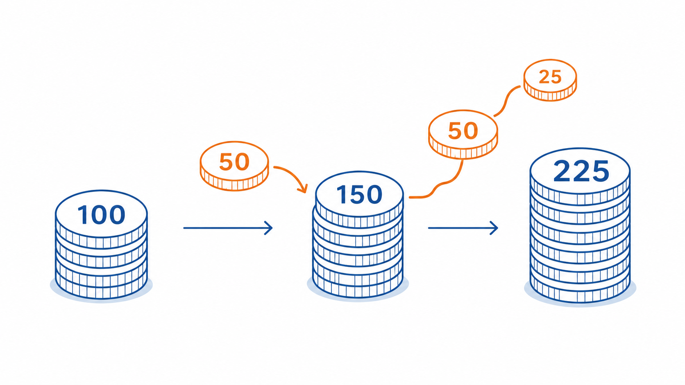
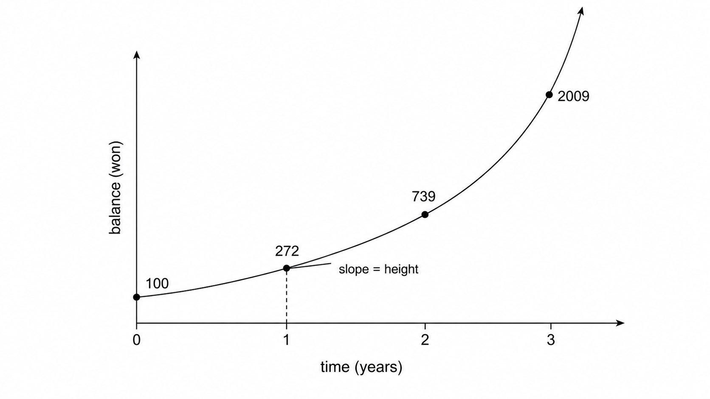
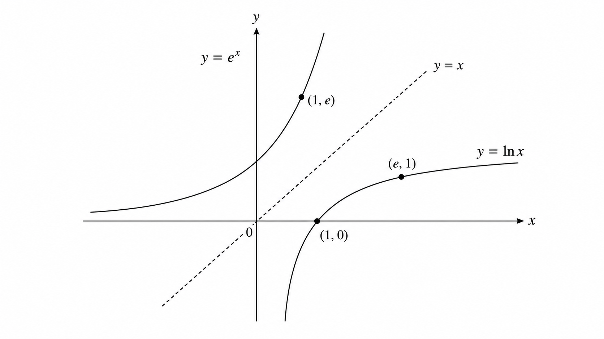
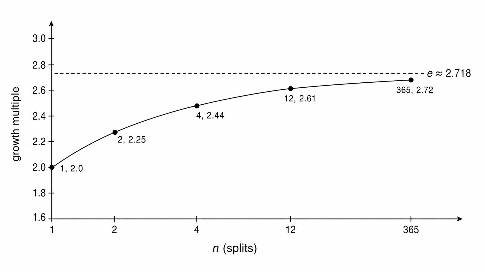
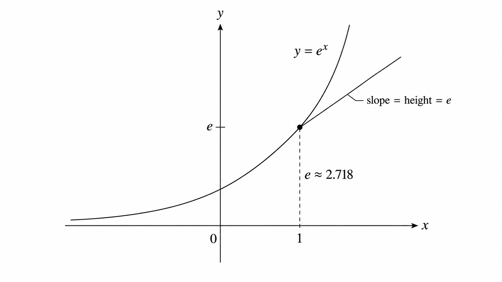
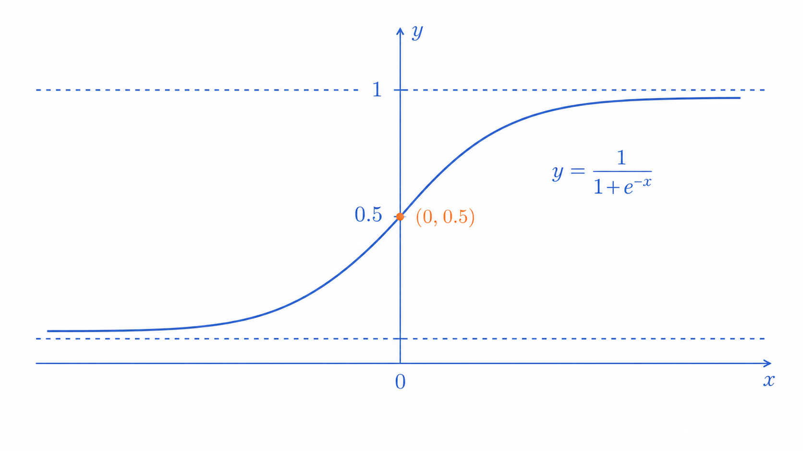

# Ch.6 · 자기 자신을 미분하는 수 : e와 ln — v0.6

> 이번 강: (특별한 수) → *성장 속도가 곧 자기 크기*인 수를 만나는 감각
> 한 줄 요약: e는 "쪼갤 수 있는 만큼 쪼갠 복리의 성장 배수"이고, e^x는 매 순간 자기 크기만큼의 속도로 자라기에 미분해도 자기 자신입니다.
> 핵심 개념: e · 자연지수 e^x · 자연로그 ln · 자기 자신을 미분해도 그대로

---

## 이야기 파트

### 또 그 이상한 수 : 2.718

오픈이는 활성화함수라는 대목에서 또 멈췄습니다. 화면에는 시그모이드라는 함수가 있었는데, 그 안에 낯선 수가 박혀 있었습니다.

$$\frac{1}{1 + e^{-x}}$$

문제는 이 **$e$** 였습니다. 강사는 "$e$ 는 약 2.718인 자연상수입니다" 하고 넘어갔지만, 오픈이의 머릿속엔 의문만 남았습니다.

*2.718? 왜 하필 이런 어중간한 수지? 3도 아니고 2도 아니고… 누가 일부러 이상한 숫자를 골라 넣은 것 같잖아.*

게다가 어디선가 들은 말이 떠올랐습니다. "$e^x$ 는 미분해도 $e^x$ 다." 미분하면 보통 모양이 바뀌는데(5강에서 $x^2$ 이 $2x$ 가 됐듯이), 이 녀석은 미분해도 자기 자신 그대로라니. 마법 같았지만, 마법이라고 외워버리면 이 책의 약속을 어기는 거였습니다.

*이 수가 어디서 왔는지, 왜 미분해도 안 변하는지 — 그걸 모르면 시그모이드도 영원히 외우기만 할 텐데.*

오픈이는 마음먹었습니다. 이번만큼은 이 수의 정체를 끝까지 파보기로요.

### 통장 이야기 : 이자를 잘게 쪼개면

오픈이는 가장 익숙한 것에서 출발했습니다. 돈, 그리고 이자.

통장에 **100원**이 있다고 합시다. 인심 좋은 은행이 **연 100% 이자**를 준다고 해요. 1년 뒤엔 얼마일까요? 쉽습니다. 100원이 그대로 이자로 붙어 **200원**. 두 배죠.

그런데 오픈이는 살짝 욕심을 냈습니다.

*1년을 통째로 기다리지 말고, 반년마다 절반씩(50%) 나눠 받으면 어떨까?*

- 처음 6개월: 100원에 50% → **150원**
- 다음 6개월: 150원에 50% → 150 + 75 = **225원**

어라, 200원이 아니라 **225원**입니다! 똑같은 연 100%인데, 중간에 한 번 받은 이자가 다시 이자를 낳아서 더 불어났어요. 이게 복리(複利)의 힘입니다.

*그림 6-1: 복리는 중간에 받은 이자가 다시 이자를 낳는다. 같은 연 100%라도 반년마다 쪼개면 200원이 아니라 225원이 된다.*

그럼 더 잘게 쪼개면 더 많아질까요? 오픈이는 계속 쪼개 봤습니다.

- 분기마다(4번, 25%씩): 약 **244원**
- 매달(12번): 약 **261원**
- 매일(365번): 약 **271원**

쪼갤수록 늘긴 느는데, 무한정 커지진 않았습니다. 더 잘게 쪼개도 **1년 치 총액**은 어떤 값을 넘지 못하고 거기서 멈췄어요. 매 순간 쉼 없이 이자를 준다고 상상하며 끝까지 쪼개도, **1년 뒤** 통장은 **271.8…원**을 넘지 못했습니다.

처음 100원이 도달한 최종 배수 — 그게 바로 **2.718…**, 이 수가 $e$ 였습니다.

*아, $e$ 는 누가 억지로 고른 이상한 수가 아니구나. "쪼갤 수 있는 만큼 다 쪼개서 복리를 줬을 때 도달하는 성장 배수" — 자연이 정해준 한계값이었어.*

### 왜 미분해도 자기 자신일까

여기서 오픈이는 헷갈리기 쉬운 점부터 짚었습니다. 방금 그 **271.8원은 어디까지나 "1년" 시점의 액수**입니다. "더는 안 올라간다"는 건 *아무리 잘게 쪼개도 1년 치가 271.8원을 못 넘는다*는 뜻이지, 돈이 영영 거기서 멈춘다는 게 아니에요. 통장을 그대로 두고 시간이 더 흐르면, 잔액은 쉬지 않고 불어납니다.

- 1년 뒤: 약 **272원**
- 2년 뒤: 약 **739원**
- 3년 뒤: 약 **2009원**

시간이 갈수록 더 가팔라지며 끝없이 자랍니다. 이 "시간에 따라 자라는 잔액"을 식으로 쓴 게 바로 **$e^t$** 입니다(처음 100원이면 $100\,e^t$). $e$ 가 1년 치 배수(2.718배)라면, $e^t$ 는 **$t$ 년 뒤의 배수**예요. 그러니 $e^x$ 는 "271.8을 억지로 $x$제곱한" 이상한 식이 아니라, **시간에 따라 자라는 통장 그 자체**입니다. (여기선 시간을 $t$ 로 썼지만, 변수 이름을 $x$ 로 바꾸면 우리가 아는 $e^x$ 입니다.)

*그림 6-2: 연 100% 복리를 끝까지 쪼개면 t년 뒤 잔액은 100·eᵗ로, 271.8원(1년)을 지나서도 멈추지 않고 자란다. 곡선 위 어느 점에서나 기울기(속도)=높이(잔액)다.*

이제 미분 차례입니다. 미분은 **순간의 속도** — "지금 잔액이 얼마나 빠르게 늘고 있나"였죠(4·5강). 복리에서 이자는 늘 **현재 잔액에 비례해서** 붙습니다. 그래서 100% 이자를 쉼 없이 주면, 놀라운 일이 벌어져요. **매 순간 불어나는 속도가, 바로 그 순간의 잔액과 정확히 똑같아집니다.**

- 잔액이 272원인 순간 → 불어나는 속도도 **272**(원/년)
- 잔액이 739원인 순간 → 속도도 **739**(원/년)

그림 6-2를 보면 이게 그대로 보입니다. 곡선 위 **어느 점에서든, 그 점의 높이(잔액)와 접선의 기울기(속도)가 같습니다.** 그런데 곡선의 높이는 함수값 $e^t$ 자신이고, 접선의 기울기는 그 함수를 미분한 값이죠. 둘이 같다는 건 곧 — **$e^t$ 를 미분하면 다시 $e^t$** 라는 뜻입니다.

*아, 그래서 미분해도 안 변하는 거였구나. $e^x$ 는 속도가 늘 자기 크기와 똑같게 자라는 통장이라서.*

물론 지금까지는 비유로 잡은 직관입니다. "정말 비례가 딱 1대 1이라서 미분해도 그대로인지", 그리고 "왜 하필 그 밑이 2.718인지"는 — 기술 파트에서 숫자로 직접 좁혀서 두 눈으로 확인합니다.

### 다시 펴기 : 이번 강에서 새로 쌓는 것

이 책의 약속을 다시 떠올립니다. **이해한 척하고 넘어가지 않기.**

이번 강에서 챙길 도구는 세 가지입니다.

첫째, **$e$ 의 정체** — 잘게 쪼갠 복리의 한계 배수, 약 2.718. 둘째, **$e^x$ 가 자기 자신의 도함수인 이유** — 직관(속도=크기)뿐 아니라 극한으로 직접 확인하기. 셋째, **자연로그 $\ln$** — 3강의 로그를 $e$ 라는 밑으로 다시 본 것.

이 도구가 빛을 보는 곳은 많습니다. 시그모이드, softmax처럼 AI가 "확률처럼 부드럽게 누르는" 함수들이 죄다 $e^x$ 로 지어져 있거든요. 그 함수들을 미분할 때 $e^x$ 의 자기복제 성질이 계산을 놀랍도록 깔끔하게 만들어 줍니다. 그게 17강 활성화함수, 그리고 역전파로 이어집니다.

### 이것만은 기억하자

- **$e$(≈2.718)는 잘게 쪼갠 복리가 도달하는 성장 배수입니다.** 억지로 고른 수가 아니라 자연이 정한 한계값이에요.
- **$e^x$ 는 미분해도 $e^x$ 입니다.** 매 순간 자기 크기만큼의 속도로 자라기 때문 — 속도(도함수)가 크기(자기 자신)와 같습니다.
- **자연로그 $\ln$ 은 밑이 $e$ 인 로그**입니다. $e^x$ 의 거울(역함수)이죠(3강).
- 다음 강에서는, 함수 속에 함수가 든 경우를 미분하는 **체인룰** 을 만납니다 — 역전파의 심장입니다.

---

## 기술 파트

### 용어 정리

이야기 속 비유를 진짜 수학 용어로 정리합니다. 앞으로는 이 이름들로 부릅니다.

| 이야기 속 비유 | 진짜 용어 | 정식 정의 |
|--------------|----------|----------|
| 잘게 쪼갠 복리의 한계 배수 | 자연상수 $e$ | $e = \lim\limits_{n\to\infty}\left(1+\frac{1}{n}\right)^n \approx 2.71828$ |
| 속도=크기인 성장 곡선 | 자연지수함수 $e^x$ | 밑이 $e$ 인 지수함수. $(e^x)' = e^x$ |
| 잘게 쪼개는 횟수 | 복리 분할 횟수 $n$ | 1년을 $n$등분해 $\frac{1}{n}$씩 이자를 주는 횟수 |
| $e^x$ 의 거울 | 자연로그 $\ln x$ | 밑이 $e$ 인 로그 $\log_e x$. $e^{?}=x$ 의 물음표 |

### e의 정의 : 쪼갤수록 다가가는 수

이야기의 통장을 식으로 옮겨 봅니다. 1년을 $n$ 번으로 쪼개 매번 $\frac{1}{n}$(=100%÷$n$)씩 복리로 준다면, 1년 뒤 처음 돈은 다음 배수가 됩니다.

$$\left(1 + \frac{1}{n}\right)^n$$

한 번 쪼갤 때마다 $\left(1+\frac{1}{n}\right)$ 배가 되고, 그걸 $n$ 번 반복하니 $n$ 제곱입니다. 이제 $n$ 을 키우며 — 즉 더 잘게 쪼개며 — 이 값이 어디로 가는지 봅니다.

$$e = \lim_{n \to \infty}\left(1 + \frac{1}{n}\right)^n \approx 2.71828\ldots$$

$n$ 을 무한히 키운 극한이 바로 $e$ 입니다. 다음 절의 예제에서 이 표를 직접 채워 2.718에 다가가는 걸 확인합니다.

### 왜 $e^x$ 는 미분해도 자기 자신인가 — 직접 유도

이제 이 강의 심장입니다. "미분해도 그대로"를 마법이 아니라 계산으로 보입니다.

아무 밑 $a$ 나 잡고 $a^x$ 를 미분해 봅니다. 5강의 미분 정의를 그대로 씁니다.

$$(a^x)' = \lim_{h \to 0} \frac{a^{x+h} - a^x}{h}$$

여기서 2강의 지수법칙을 씁니다. $a^{x+h} = a^x \cdot a^h$ 였죠. 분자를 그렇게 바꾸면,

$$= \lim_{h \to 0} \frac{a^x \cdot a^h - a^x}{h} = \lim_{h \to 0} \frac{a^x\,(a^h - 1)}{h}$$

그런데 $a^x$ 은 $h$ 와 아무 상관이 없습니다($h$ 를 0으로 보내는 동안 $a^x$ 은 그냥 상수처럼 가만히 있어요). 그러니 극한 밖으로 빼낼 수 있습니다.

$$(a^x)' = a^x \cdot \underbrace{\lim_{h \to 0} \frac{a^h - 1}{h}}_{\text{밑 } a \text{ 로 정해지는 상수}}$$

여기서 엄청난 사실이 드러납니다. **어떤 지수함수든, 미분하면 "자기 자신 × 어떤 상수" 가 됩니다.** 모양은 그대로고, 앞에 상수만 하나 붙는 거예요. 그 상수는 밑 $a$ 가 정합니다. (참고로 이 상수는 $a^x$ 의 $x=0$ 에서의 기울기와 같습니다. 위 극한에 $x=0$ 을 넣은 꼴이거든요.)

그럼 그 상수가 밑마다 얼마인지 숫자로 봅니다.

| 간격 $h$ | $\dfrac{2^h - 1}{h}$ | $\dfrac{3^h - 1}{h}$ |
|:---:|:---:|:---:|
| $0.1$ | $0.718$ | $1.161$ |
| $0.01$ | $0.696$ | $1.105$ |
| $0.001$ | $0.693$ | $1.099$ |
| $\to 0$ | $\approx 0.693$ | $\approx 1.099$ |

밑이 2면 상수가 약 **0.693**, 밑이 3이면 약 **1.099** 로 다가갑니다. 그러니 $(2^x)' = 0.693 \cdot 2^x$, $(3^x)' = 1.099 \cdot 3^x$ 인 셈이죠. 둘 다 자기 자신은 나오지만, 앞에 거추장스러운 상수가 붙습니다.

여기서 결정적인 질문. **그 상수가 정확히 1이 되는 밑은 없을까?**

$0.693 < 1 < 1.099$ 입니다. 밑이 2일 때 상수가 1보다 작고, 3일 때 1보다 크니, 그 사이 어딘가에 **상수가 딱 1이 되는 밑**이 있습니다. 바로 그 밑이 $e \approx 2.718$ 입니다. (2와 3 사이에 있죠.) $e$ 의 경우 상수가 1이므로,

$$(e^x)' = e^x \cdot 1 = e^x$$

**미분해도 자기 자신.** 마법이 아니라, "앞에 붙는 상수를 1로 만드는 밑"을 골랐기 때문입니다. 그 밑이 $e$ 고요. 비유에서 "성장 속도와 크기를 1대 1로 맞추는 수"라 했던 게 바로 이 상수 1입니다.

### 자연로그 ln : e로 보는 거울

3강에서 로그는 지수의 거울(역함수)이라 했습니다. $e^x$ 의 거울이 바로 **자연로그** $\ln x$ 입니다. 밑이 $e$ 인 로그죠.

$$\ln x = \log_e x \quad \Longleftrightarrow \quad e^{\ln x} = x$$

"$e$ 를 몇 번 곱해야 $x$ 가 되나"의 답입니다. 그런데 이 강의 통장 이야기로 읽으면 훨씬 더 또렷해집니다.

앞에서 $e^t$ 는 "$t$ 년 뒤의 배수"였습니다(그림 6-2). 자연로그는 그 질문을 **정확히 뒤집은** 것입니다 — *"$x$ 배가 되려면 몇 년이 걸리나?"* 즉 $e^t$ 가 **시간 → 배수**라면, $\ln$ 은 **배수 → 시간**입니다. 둘은 같은 사건을 양쪽에서 본 거울이에요.

- $\ln 1 = 0$ : 1배(그대로)가 되는 데 걸리는 시간은 0년.
- $\ln e = \ln 2.718 = 1$ : $e$ 배가 되려면 1년.
- $\ln e^2 = \ln 7.389 = 2$ : $e^2$ 배가 되려면 2년.

표로 정리하면 이렇습니다.

| 배수 $x$ | $\ln x$ = 걸리는 시간(년) |
|:---:|:---:|
| $1$ | $0$ |
| $e \approx 2.718$ | $1$ |
| $e^2 \approx 7.389$ | $2$ |
| $e^3 \approx 20.09$ | $3$ |

배수가 $e$ 배씩 커질 때마다 걸리는 시간은 1년씩 또박또박 늘어납니다. **곱셈(배수)이 덧셈(시간)으로** 바뀌는 것 — 3강에서 본 로그의 그 성질이, 여기서는 "복리 시간"이라는 옷을 입고 다시 나타난 겁니다. (배수가 1보다 작으면, 예컨대 $\ln 0.5 \approx -0.69$ 처럼 음수가 되는데, "거꾸로 되감는 시간"으로 읽으면 됩니다.)

그래프로 보면 $e^x$ 와 $\ln x$ 가 점선 $y=x$ 를 거울축으로 마주 봅니다(그림 6-3). $e^x$ 위의 점 $(1,\ e)$ — "1년이면 $e$ 배" — 가, $\ln x$ 에서는 $(e,\ 1)$ — "$e$ 배는 1년" — 으로 뒤집혀 앉습니다.

*그림 6-3: e^x와 ln x는 y=x를 거울축으로 대칭이다. e^x가 "시간→배수"(1년이면 e배)라면, ln은 "배수→시간"(e배는 1년)이다.*

### 그 상수가 왜 ln a 인가

앞의 "왜 e^x 미분" 절에서, 밑마다 미분 상수가 달랐습니다 — 2면 0.693, 3이면 1.099. 이게 **우연한 숫자가 아니라 자연로그**라는 걸, 열쇠 하나로 풀어 봅니다.

열쇠는 이겁니다: **모든 지수함수는 사실 $e$ 를 어떤 배수만큼 거듭제곱한 것**입니다.

왜냐하면 $\ln a$ 의 뜻이 "$e$ 를 몇 제곱해야 $a$ 가 되나"였으니까요. 그 제곱이 바로 $\ln a$ 라는 거고, 곧 $a = e^{\ln a}$ 입니다. 예를 들어 $\ln 2 = 0.693$ 은 "$e$ 를 $0.693$ 제곱하면 2"라는 뜻이라, $e^{0.693} = 2$. 이걸 $x$ 제곱으로 올리면,

$$2 = e^{0.693} \quad\Rightarrow\quad 2^x = \left(e^{0.693}\right)^x = e^{0.693\,x}$$

마지막 단계는 2강 지수법칙 $\left(e^{m}\right)^x = e^{m x}$ 입니다. 놀랍게도 $2^x$ 는 사실 **$e$ 를 $0.693\,x$ 제곱한 것**이었어요. 어떤 밑이든 마찬가지라,

$$a^x = e^{(\ln a)\,x}$$

이제 미분을 봅니다. $e^x$ 는 미분해도 자기 자신, 상수가 1이었죠. 그런데 $a^x = e^{(\ln a)x}$ 는 지수 자리의 $x$ 에 $\ln a$ 가 곱해져 있어서, $x$ 가 1 움직이면 지수는 $\ln a$ 만큼 움직입니다. 지수가 그만큼 더(혹은 덜) 빠르게 움직이니, 미분하면 그 $\ln a$ 가 상수로 앞에 따라 나옵니다.

$$(a^x)' = a^x \ln a$$

> 왜 지수의 배수가 미분에서 앞으로 따라 나오는지, 그 정식 계산은 7강 **체인룰**에서 합니다. 지금은 "$a^x$ 는 $e$ 를 $\ln a$ 배 속도로 올린 것이라, 미분 상수도 $\ln a$" 정도로 잡아두면 충분합니다.

그러니 우리가 측정한 0.693 이 $\ln 2$ 였던 건 우연이 아니었습니다 — 그건 $2^x$ 의 지수 속에 처음부터 숨어 있던 $\ln 2$ 였어요. 그리고 밑이 $e$ 면 $\ln e = 1$ 이라 상수가 사라지고 깔끔한 $(e^x)' = e^x$ 만 남습니다. **$e$ 는 지수를 1배 속도로 — 더 빠르지도 느리지도 않게 — 올리는 유일한 밑**이라, 미분이 가장 단정합니다. 자연로그가 "자연스러운" 이유가 바로 이것입니다.

### 계산 예제 1 : e를 직접 좁혀서 구하기

말로만 보면 미끄러집니다. 숫자로 끝까지 풀어봅니다.

**문제.** $\left(1 + \dfrac{1}{n}\right)^n$ 의 값을 $n$ 을 키워 가며 계산해, $e$ 에 다가감을 확인하세요.

**풀이.** 통장을 더 잘게 쪼개는 것과 같습니다. $n$ 을 늘려 가며 계산합니다.

| 쪼개는 횟수 $n$ | $\left(1+\frac{1}{n}\right)^n$ | 통장 비유 |
|:---:|:---:|:---|
| $1$ | $2.000$ | 1년에 한 번 |
| $2$ | $2.250$ | 반년마다 |
| $4$ | $2.441$ | 분기마다 |
| $12$ | $2.613$ | 매달 |
| $365$ | $2.715$ | 매일 |
| $\to \infty$ | $\to 2.71828\ldots$ | 매 순간 |

**답.** $n$ 이 커질수록 값이 **2.718…($=e$)** 에 달라붙습니다. 무한정 커지지 않고 한 값에 수렴하는 것 — 이야기 속 통장이 271.8원에서 멈춘 그 장면 그대로입니다.

*그림 6-4: (쪼개기 축) 분할 횟수 n을 늘릴수록 1년 치 성장 배수가 점선 e≈2.718에 수렴한다. 시간이 아니라 "얼마나 잘게 쪼개느냐"의 한계다.*

### 계산 예제 2 : "미분해도 자기 자신"을 두 눈으로 확인

이번엔 이 강의 핵심 주장을 직접 검증합니다. $e^x$ 의 $x=1$ 에서의 기울기가, 정말 그 점의 높이 $e^1 = e$ 와 같은지 봅니다.

**문제.** $f(x) = e^x$ 의 $x=1$ 에서의 순간기울기를, 간격 $h$ 를 줄여 가며 구하고, $e^1$ 과 비교하세요. ($e \approx 2.71828$)

**1단계 — 평균변화율 식 세우기.** (4강과 같은 방식)

$$\frac{f(1+h) - f(1)}{h} = \frac{e^{1+h} - e}{h}$$

**2단계 — 간격을 좁혀 보기.**

| 간격 $h$ | $\dfrac{e^{1+h} - e}{h}$ |
|:---:|:---:|
| $0.1$ | $2.859$ |
| $0.01$ | $2.732$ |
| $0.001$ | $2.719$ |
| $\to 0$ | $\to 2.718$ |

**3단계 — 높이와 비교.**
$x=1$ 에서의 높이는 $f(1) = e^1 = 2.718$. 그리고 방금 구한 그 점의 기울기도 $2.718$ 로 다가갑니다.

$$f'(1) = e \approx 2.718 = f(1)$$

**답.** 기울기와 높이가 똑같습니다. $x=1$ 에서 $e^x$ 는 자기 높이(2.718)와 똑같은 속도로 자라고 있었습니다. 비유로 잡은 "속도=크기"가, 숫자로 확인됐습니다. 이게 "미분해도 자기 자신"의 실체입니다.

*그림 6-5: y=e^x 위의 점 (1, e)에서, 접선의 기울기가 그 점의 높이 e와 정확히 같다. 곡선의 어느 점에서나 "기울기 = 높이"가 성립한다.*

### 연습문제

직접 풀어보세요. 해답은 책 뒤 부록에 모아 두었습니다.

1. 예제 1의 표를 한 칸 더 채워, $n=1000$ 일 때 $\left(1+\frac{1}{n}\right)^n$ 이 약 $2.717$ 임을 계산기로 확인하세요. $e$ 에 더 가까워졌나요?
2. 공식 $(a^x)' = a^x \ln a$ 를 이용해 $(2^x)'$ 를 쓰고, $\ln 2 \approx 0.693$ 을 넣어 $x=0$ 에서의 기울기를 구하세요. (위 표의 0.693과 맞는지 확인해 보세요.)
3. $f(x) = 3e^x$ 의 도함수를 구하세요. (힌트: 5강의 "상수배는 그대로 끌고 간다" 규칙과 $(e^x)'=e^x$ 를 함께 씁니다.) 그리고 $x=0$ 에서의 기울기를 구하세요.

### 이게 AI 어디에 쓰이나

AI는 점수를 "0과 1 사이 확률처럼" 부드럽게 눌러야 할 때가 많습니다. 그때 쓰는 시그모이드 $\dfrac{1}{1+e^{-x}}$ 도, 여러 점수를 확률로 바꾸는 softmax도 모두 $e^x$ 로 지어져 있습니다. 왜 하필 $e$ 일까요? 학습은 결국 미분(기울기)으로 이뤄지는데, $e^x$ 는 미분해도 자기 자신이라 **이 함수들의 기울기 계산이 거짓말처럼 깔끔해지기** 때문입니다. 모양이 안 변하니 역전파에서 식이 엉키지 않죠.

*그림 6-6: 시그모이드 1/(1+e⁻ˣ)는 어떤 입력이든 0과 1 사이로 부드럽게 누른다. e^x로 지어졌기에 미분이 깔끔해 역전파에서 빛난다.*

지금은 $e^x$ 하나만 미분했지만, 시그모이드는 $e^{-x}$ 처럼 지수 안에 또 다른 식이 들어 있습니다. 그 "함수 속의 함수"를 미분하려면 도구가 하나 더 필요합니다. 다음 강의 **체인룰** 입니다. 그것까지 챙기면, 우리는 비로소 AI가 실제로 쓰는 함수들을 손으로 미분할 수 있게 됩니다.
