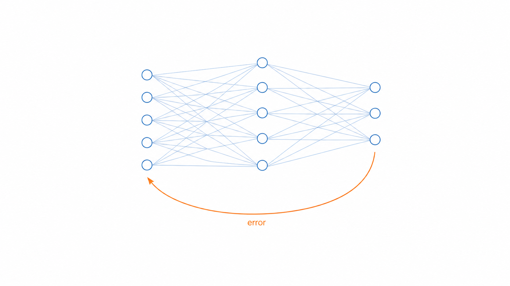
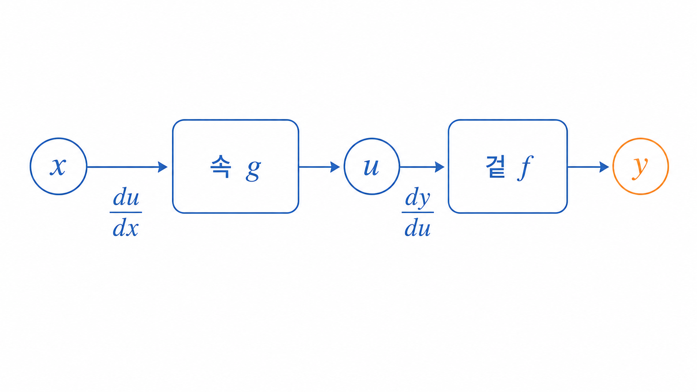
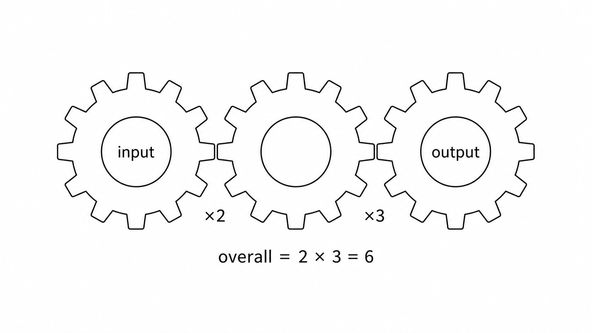

# Ch.7 · 톱니바퀴 연쇄 : 체인룰 — v0.7

> 이번 강: (연결) → 함수 속 함수를 *사슬처럼 이어* 미분하는 감각
> 한 줄 요약: 함수 속에 함수가 들었을 때, 미분은 각 단계의 변화율을 사슬처럼 곱해서 잇습니다. 이게 역전파의 심장입니다.
> 핵심 개념: 합성함수 · 체인룰 · 겉미분 × 속미분

---

## 이야기 파트

### 다시 시그모이드 앞에서

6강에서 오픈이는 $e$ 를 정복했습니다. $e^x$ 는 미분해도 $e^x$ — 자기 자신. 자신감을 안고, 처음 자신을 멈춰 세웠던 그 함수로 돌아왔습니다.

$$\frac{1}{1 + e^{-x}}$$

그런데 또 막혔습니다. 이번엔 $e^{-x}$ 였습니다.

*$e^x$ 미분은 안다고. 그런데 지수 자리에 그냥 $x$ 가 아니라 $-x$ 가 앉아 있잖아? 안에 $-x$ 라는 또 다른 식이 들어 있는데, 이건 어떻게 미분하지?*

생각해 보니 이런 구조가 한둘이 아니었습니다. $e^{-x}$ 는 "$-x$ 를 만든 다음, 그걸 $e$ 의 지수로 올리는" 두 단계짜리였습니다. **함수 속에 함수가 들어 있는** 모양. 6강에서 배운 $e^x$ 미분은 지수가 딱 $x$ 일 때 이야기였고, 안에 뭔가 더 든 경우는 다루지 않았습니다.

오픈이는 직감했습니다. 이 "함수 속 함수"를 미분하는 도구만 손에 넣으면, 시그모이드뿐 아니라 6강에서 미뤄둔 숙제 — 로그의 미분 — 까지 한꺼번에 풀린다는 것을요.

### 톱니바퀴 : 돌림이 전해지는 비율

오픈이는 자전거를 떠올렸습니다. 페달을 밟으면 앞 톱니가 돌고, 체인이 뒷 톱니를 돌리고, 바퀴가 굴러갑니다. 돌림이 사슬을 타고 **연쇄적으로** 전해지죠.

여기 톱니바퀴 세 개가 맞물려 있다고 합시다. 손잡이를 돌리면 첫 번째 톱니가 돌고, 그게 두 번째 톱니를 돌립니다.

- 손잡이를 1바퀴 돌리면, 첫 번째 톱니는 **2바퀴** 돈다고 합시다(2배 빠름).
- 그 첫 번째 톱니가 1바퀴 돌 때, 두 번째 톱니는 **3바퀴** 돈다고 합시다(3배 빠름).

그럼 손잡이를 1바퀴 돌리면 두 번째 톱니는 몇 바퀴 돌까요? 첫 톱니가 2바퀴, 그동안 두 번째는 한 바퀴마다 3배씩이니 — $2 \times 3 = $ **6바퀴**입니다. 비율이 **곱해진** 거예요.

오픈이는 무릎을 쳤습니다.

*함수 속 함수도 이거랑 똑같겠구나. 입력이 살짝 움직이면, 속 함수가 어떤 비율로 변하고, 그 변화가 다시 겉 함수를 어떤 비율로 움직이고. 전체 변화율은 두 비율을 곱한 거야.*

바로 이겁니다. 합성함수를 미분하는 일은, 톱니바퀴 사슬에서 **각 단계의 변화율을 곱해 잇는** 것과 같습니다. 사슬(chain)처럼 잇는다고 해서, 이 규칙의 이름이 **체인룰**입니다.

### 사슬은 곧 신경망이다

이 톱니바퀴 사슬이 왜 그렇게 중요할까요? 신경망이 바로 이 모양이기 때문입니다.

신경망은 입력이 1층을 거쳐 2층으로, 2층을 거쳐 3층으로… 층층이 변환되는 **거대한 합성함수**입니다. 톱니바퀴가 수백만 개 맞물린 기계인 셈이죠. 학습할 때는, 맨 끝(출력)에서 생긴 오차가 "어느 톱니를 얼마나 돌려야 오차가 줄어드는지"를 입력 쪽으로 **거슬러** 계산해야 합니다.

그 거슬러 가는 계산이 정확히 — 각 층의 변화율을 체인룰로 **곱해 나가는** 일입니다. 이걸 **역전파**라고 부릅니다. 그러니 체인룰은 단순한 미분 기술이 아니라, **AI가 배우는 과정의 심장**입니다.

*그림 7-1: 신경망은 층을 거듭하는 거대한 합성함수 — 오차를 거슬러 곱해 가는 일이 곧 체인룰이다.*

### 이것만은 기억하자

- **함수 속에 함수가 들면, 겉미분 × 속미분으로 풉니다.** 톱니 사슬의 변화율을 곱해 잇는 것과 같아요.
- 그래서 이름이 **체인룰** — 변화율을 사슬처럼 이어 곱한다는 뜻입니다.
- 이 도구로 6강에서 미뤄둔 **로그의 미분**도 드디어 풀립니다.
- 신경망은 층층이 쌓인 거대한 합성함수라, 오차를 거슬러 곱해 가는 **역전파**가 곧 체인룰입니다.
- 다음 강에서는, 이렇게 구한 기울기를 따라 골짜기를 굴러 내려가는 **경사하강법** — AI가 '배우는' 그 알고리즘 — 을 만납니다.

---

## 기술 파트

### 용어 정리

이야기 속 비유를 진짜 수학 용어로 정리합니다. 앞으로는 이 이름들로 부릅니다.

| 이야기 속 비유 | 진짜 용어 | 정식 정의 |
|--------------|----------|----------|
| 함수 속에 든 함수 | 합성함수(composite) $f(g(x))$ | 입력에 $g$ 를 먼저 적용하고, 그 결과에 $f$ 를 적용한 함수 |
| 변화율을 사슬처럼 곱하기 | 체인룰(chain rule) | $(f(g(x)))' = f'(g(x)) \cdot g'(x)$ |
| 안쪽 톱니 | 속 함수 $u = g(x)$ | 입력에 먼저 닿는 함수 |
| 바깥 톱니 | 겉 함수 $y = f(u)$ | 속 함수의 결과를 받는 함수 |

### 체인룰 : 변화율을 곱해 잇기

합성함수를 두 단계로 끊어 봅니다. 속 함수가 입력 $x$ 를 받아 $u$ 를 만들고, 겉 함수가 그 $u$ 를 받아 $y$ 를 만듭니다.

$$u = g(x), \qquad y = f(u)$$

*그림 7-2: 합성함수는 x→(속 g)→u→(겉 f)→y 두 단계. 각 화살표의 변화율이 du/dx와 dy/du다.*

이제 $x$ 가 아주 조금 움직였을 때 $y$ 가 얼마나 변하는지($\frac{dy}{dx}$)를 묻습니다. 톱니 사슬의 논리 그대로입니다. $x$ 가 변하면 $u$ 가 $\frac{du}{dx}$ 의 비율로 변하고, $u$ 가 변하면 $y$ 가 $\frac{dy}{du}$ 의 비율로 변합니다. 전체 변화율은 둘의 곱입니다.

$$\frac{dy}{dx} = \frac{dy}{du} \cdot \frac{du}{dx}$$

말로 다시 읽으면, **겉을 미분한 것(속은 그대로 둔 채) 곱하기 속을 미분한 것**입니다. 같은 말을 $f, g$ 로 쓰면 이렇습니다.

$$\big(f(g(x))\big)' = f'(g(x)) \cdot g'(x)$$

기억을 돕는 장치 하나. 위 식에서 $\frac{dy}{du} \cdot \frac{du}{dx}$ 를 분수처럼 보면 가운데 $du$ 가 약분되어 $\frac{dy}{dx}$ 가 됩니다. 진짜 분수는 아니지만, 외우는 데는 요긴합니다.

*그림 7-3: 손잡이를 1 돌리면 첫 톱니가 ×2, 그게 다음 톱니를 ×3 → 전체는 2×3=6. 합성함수 미분은 이렇게 변화율을 곱해 잇는다.*

### 계산 예제 1 : $e^{-x}$ 미분하기

말로만 보면 미끄러집니다. 숫자로… 아니, 식으로 끝까지 풀어봅니다. 도입에서 막혔던 그 $e^{-x}$ 입니다.

**문제.** $f(x) = e^{-x}$ 를 미분하세요.

**1단계 — 속과 겉 나누기.**
속 함수는 지수 자리의 $u = -x$, 겉 함수는 $y = e^u$ 입니다.

**2단계 — 각각 미분.**
겉 $e^u$ 를 미분하면 (6강) $e^u$ 그대로. 속 $-x$ 를 미분하면 $-1$.

$$\frac{dy}{du} = e^u = e^{-x}, \qquad \frac{du}{dx} = -1$$

**3단계 — 곱해 잇기.**

$$\frac{dy}{dx} = e^{-x} \cdot (-1) = -e^{-x}$$

**답.** $(e^{-x})' = -e^{-x}$. 속의 $-x$ 가 만든 $-1$ 이 앞에 붙어 부호가 뒤집혔습니다. 톱니 하나를 더 물렸을 뿐인데, 변화율이 깔끔하게 곱해졌죠. — 처음에 막혔던 벽을 넘었습니다.

### 계산 예제 2 : $(x^2+1)^3$ 미분하기

이번엔 거듭제곱 안에 식이 든 경우입니다.

**문제.** $f(x) = (x^2 + 1)^3$ 을 미분하세요.

**1단계 — 속과 겉 나누기.**
속 $u = x^2 + 1$, 겉 $y = u^3$.

**2단계 — 각각 미분.**
겉 $u^3$ 은 멱법칙(5강)으로 $3u^2 = 3(x^2+1)^2$. 속 $x^2+1$ 은 $2x$.

$$\frac{dy}{du} = 3(x^2+1)^2, \qquad \frac{du}{dx} = 2x$$

**3단계 — 곱해 잇기.**

$$\frac{dy}{dx} = 3(x^2+1)^2 \cdot 2x = 6x\,(x^2+1)^2$$

**답.** $\big((x^2+1)^3\big)' = 6x(x^2+1)^2$. 일일이 전개해서 미분할 필요 없이, 겉과 속을 따로 미분해 곱하기만 하면 됩니다. 이게 "치환해서 풀지 않아도, 공식이라 쉽다"는 체인룰의 힘입니다.

### 약속을 지키다 : 로그를 미분하기

6강에서 "$\ln$ 의 미분은 체인룰을 손에 쥔 뒤에"라며 미뤄둔 숙제가 있었죠. 이제 갚을 차례입니다.

**(1) 먼저 짚을 것 — "$y$ 는 $x$ 의 함수다".**
$y = a^x$ 처럼 $x$ 에 따라 정해지는 $y$ 가 있으면, $x$ 가 움직일 때 $y$ 도 따라 움직입니다. 그래서 $y$ 에는 "$x$ 에 대한 기울기"가 있고, 이를 $y'$ ($=\frac{dy}{dx}$)라 부릅니다.

- $y$ 가 상수였다면 $y' = 0$, $y$ 가 $x$ 자신이었다면 $y' = 1$.
- 하지만 일반적인 $y$ 는 둘 다 아닙니다. $y'$ 는 **아직 값을 모르는 "$y$ 의 기울기"** — 우리가 구하려는 답입니다.

식 속에 $y$ 가 보이면 "$x$ 가 안에 숨은 덩어리"로 읽으세요. 그걸 $x$ 로 미분하면 체인룰에 따라 $y'$ 가 따라 나옵니다.

**(2) $(\ln x)' = \dfrac{1}{x}$ 를 $e$ 로 유도하기.**
$\ln$ 은 그냥 붙들기 까다로우니, 미분이 가장 쉬운 $e$ 로 뒤집습니다(3강 거울). $y = \ln x$ 로 두면 $e^y = x$.

이제 양변을 $x$ 로 미분합니다. 오른쪽 $x$ 는 $1$. 왼쪽 $e^y$ 은 **합성함수**입니다 — 겉은 $e^{(\,)}$, 속은 $y$, 그리고 $y$ 는 $x$ 의 함수죠. 그래서 체인룰로 "겉미분 $e^y$ × 속미분 $y'$":

$$e^y \cdot y' = 1$$

$y'$ 로 풀면 $y' = \dfrac{1}{e^y}$. 그런데 $e^y = x$ 였으니, $y' = \dfrac{1}{x}$.

여기서 한 걸음을 빠뜨리면 안 됩니다. 맨 처음 우리가 $y = \ln x$ 라고 뒀던 걸 기억하세요. 그러니 $y'$ ($y$ 를 $x$ 로 미분한 것)은 다름 아닌 **$\ln x$ 를 미분한 것**입니다 — 즉 $y' = (\ln x)' = \dfrac{d}{dx}\ln x$. 방금 그 $y'$ 가 $\dfrac{1}{x}$ 였으니, 둘을 합치면

$$\frac{d}{dx}\ln x = y' = \frac{1}{x}$$

까다로운 $\ln$ 을 $e$ 로 한 번 뒤집었더니, 미분이 단정한 $\frac{1}{x}$ 로 떨어졌습니다.

**(3) 한 번 만든 공식은 그대로 갖다 쓴다.**
$e$ 로 바꿔 푼 건 **이 공식 $(\ln x)' = \frac{1}{x}$ 를 만드는 딱 한 번**입니다. 한 번 만들어두면, $\ln$ 안에 무엇이 들어 있든 체인룰로 바로 처리됩니다 — 겉 $\ln$ 의 미분은 $\frac{1}{\text{속}}$, 거기에 속미분을 곱합니다.

$$(\ln u)' = \frac{u'}{u}$$

> **$\dfrac{1}{u}$ 와 $\dfrac{u'}{u}$ 는 뭐가 다를까?** $\ln u$ 를 "$u$ 로" 미분하면 $\dfrac{1}{u}$ 입니다. 그런데 우리는 "$x$ 로" 미분하는 중이라, 속 $u$ 의 기울기 $u'$ 를 한 번 더 곱해야 합니다(이 "한 번 더 곱하기"가 바로 체인룰). 그래서 $\dfrac{1}{u} \times u' = \dfrac{u'}{u}$. $\dfrac{1}{u}$ 가 안에 들어 있고, 거기에 $u'$ 가 덧붙은 것뿐입니다.

**(4) 응용 — $a^x$ 를 로그 미분법으로.**
6강에서 $(a^x)' = a^x \ln a$ 를 극한으로 구했습니다. 이제 체인룰로 더 우아하게 다시 구해 봅니다. 핵심은 **양변에 로그를 취하는 것**(로그 미분법)인데, 로그가 지수를 앞으로 끌어내려 곱셈으로 바꿔주기 때문에 쉬워집니다(3강).

$y = a^x$ 로 두고 양변에 로그를 취하면,

$$\ln y = x \ln a$$

양변을 $x$ 로 미분합니다. 왼쪽은 방금 만든 공식으로 $\frac{y'}{y}$($u$ 자리에 $y$), 오른쪽 $x \ln a$ 에서 $\ln a$ 는 상수라 미분하면 $\ln a$:

$$\frac{y'}{y} = \ln a$$

$y'$ 로 정리합니다. 여기서도 맨 처음 $y = a^x$ 로 뒀으니 $y'$ 는 곧 $(a^x)'$ 입니다.

$$(a^x)' = y' = y \ln a = a^x \ln a$$

6강에서 극한으로 구한 답과 **똑같습니다.** 한쪽은 작은 $h$ 를 좁혀서, 한쪽은 로그를 취해서 — 두 길이 같은 곳에서 만났습니다.

### 연습문제

직접 풀어보세요. 해답은 책 뒤 부록에 모아 두었습니다.

1. $f(x) = e^{2x}$ 를 미분하세요. (속 $u = 2x$, 겉 $e^u$ 로 나눠 체인룰을 쓰세요.)
2. $f(x) = (3x - 1)^4$ 를 미분하세요.
3. $f(x) = \ln(x^2 + 1)$ 을 미분하세요. (공식 $(\ln u)' = \frac{u'}{u}$ 에 $u = x^2+1$ 을 넣으면 됩니다.)

### 이게 AI 어디에 쓰이나

신경망은 입력이 여러 층을 거쳐 출력이 되는 거대한 합성함수입니다. 학습은 "출력의 오차를 줄이려면 각 층의 수많은 가중치를 어느 쪽으로 바꿔야 하나"를 알아내는 일인데, 그 답은 **오차를 출력에서 입력 쪽으로 거슬러 가며 각 층의 변화율을 체인룰로 곱해** 구합니다. 이 거슬러 가는 계산이 바로 **역전파**입니다 — 19강에서 이 책의 정점으로 다시 만납니다.

당장의 보상도 있습니다. 도입에서 막혔던 시그모이드 $\frac{1}{1+e^{-x}}$ 를 떠올려 보세요. 예제 1에서 $e^{-x}$ 의 벽은 이미 넘었고($-e^{-x}$), 시그모이드 전체는 톱니를 한 겹 더 물린 것뿐입니다. 같은 체인룰을 한 번 더 돌리면 풀립니다(17강 활성화함수에서 끝까지 미분해 봅니다). 함수가 아무리 겹겹이 쌓여도, 사슬을 따라 변화율을 곱해 가면 된다 — 이 한 문장이 AI의 학습을 떠받칩니다.
