# Ch.8 · 안개 산에서 내려가기 : 경사하강법 — v0.8

> 이번 강: (전환점) → 기계가 *스스로* 답을 찾아 내려가는 첫 장면
> 한 줄 요약: 최솟값을 한 번에 못 풀 때는, 발밑 기울기 반대 방향으로 조금씩 내려갑니다. 이 반복이 바로 'AI가 배운다'는 것입니다.
> 핵심 개념: 경사하강법 · 학습률 · 수렴/발산

---

## 이야기 파트

### 다시 골짜기 앞에서

5강에서 오픈이는 골짜기 바닥을 찾는 법을 손에 넣었습니다. 기울기가 0이 되는 곳, 즉 $f'(x)=0$ 을 풀면 최솟값의 위치가 나온다 — 깔끔했습니다.

그래서 자신만만하게 진짜 AI의 손실 함수를 들여다봤습니다. 그런데 식이 이상했습니다. 변수가 $x$ 하나가 아니었습니다. $w_1, w_2, w_3, \dots$ 수백만 개가 뒤엉켜 있고, 그 안에 지수와 로그와 분수가 겹겹이 들어 있었습니다.

*$f'(x)=0$ 을 풀라고? 변수가 수백만 개인데? 이걸 어떻게 손으로 풀어 …*

방정식을 깔끔하게 풀어 답을 한 번에 구하는 길은 막혀 있었습니다. 식이 너무 거대하고 복잡해서, "기울기가 0인 점"을 대수적으로 찾는 건 사실상 불가능했습니다.

오픈이는 잠시 멍해졌습니다. 최솟값이 **어딘가에 있는 건 분명한데, 그 위치를 한 번에 계산할 수가 없다**니. 답이 있는데 푸는 공식이 없는 셈이었습니다.

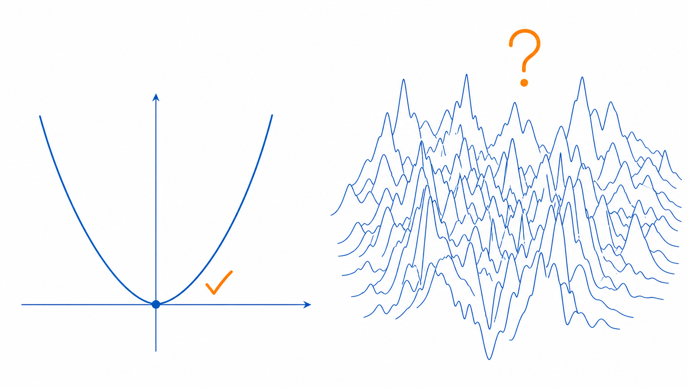

*그림 8-1: 변수가 하나면 최솟값을 한 번에 계산할 수 있지만(왼쪽), 수백만 변수가 뒤엉킨 진짜 손실 함수는 그 길이 막혀 있다(오른쪽).*

### 안개 산에서 내려가기

그날 저녁, 오픈이는 산에 올랐다가 안개에 갇힌 기억을 떠올렸습니다.

해가 지고 안개가 몰려와 한 치 앞도 보이지 않았습니다. 지도도 소용없었습니다. 골짜기 마을로 내려가야 하는데, 마을이 어느 방향인지 눈으로는 도무지 알 수가 없었죠.

그때 오픈이가 한 일은 단순했습니다. **발밑을 더듬는 것.** 한 발을 이리저리 디뎌 보면, 어느 쪽이 내리막인지는 느낄 수 있었습니다. 가장 가파르게 내려가는 쪽으로 한 걸음. 다시 발밑을 더듬어 또 한 걸음. 그걸 반복하니, 마을은 안 보여도 발은 계속 아래로 향했고, 결국 골짜기 바닥에 닿았습니다.

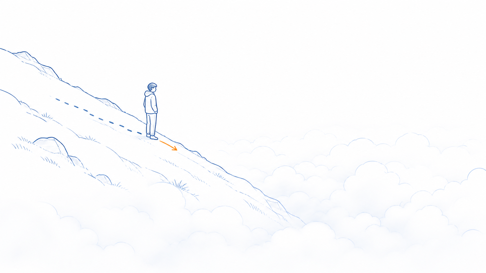

*그림 8-2: 골짜기(목적지)는 안개에 가려 안 보여도 발밑 경사는 느낄 수 있다. 가장 가파른 내리막으로 한 걸음씩 — 이것이 경사하강법의 직관.*

오픈이는 무릎을 쳤습니다.

*손실 함수도 똑같잖아. 전체 지형(최솟값의 위치)은 한눈에 못 봐. 하지만 지금 내가 선 자리의 기울기는 잴 수 있어 — 그게 미분이니까. 그럼 기울기 반대 방향으로 한 걸음씩 내려가면 되는 거 아냐?*

바로 이겁니다. 최솟값을 **한 번에 계산하는 대신**, 현재 위치의 기울기를 재서 **내리막 방향으로 조금씩 내려가는** 방법. 경사(기울기)를 따라 하강한다고 해서, 이 방법의 이름이 **경사하강법**입니다.

기울기가 양수(오르막)면 왼쪽으로, 음수(내리막)면 오른쪽으로 — 즉 **기울기의 반대 방향**으로 한 걸음 갑니다. 그러면 발은 늘 **더 낮은 쪽**으로 향합니다. (다만 지금 내려가는 이 골짜기가 과연 가장 깊은 곳인지는 또 다른 문제인데, 그 이야기는 이 장 뒤 '더 알아보기'에서 합니다.)

### 보폭이 문제다

여기서 한 가지 고민이 생깁니다. 한 걸음을 **얼마나 크게** 디딜까요?

보폭이 너무 작으면, 바닥까지 가는 데 평생이 걸립니다. 안개 산에서 1cm씩 발을 옮긴다고 생각해 보세요.

반대로 보폭이 너무 크면 더 위험합니다. 골짜기 바닥을 **건너뛰어** 반대편 비탈에 착지하고, 거기서 또 크게 디뎌 원래 자리로 튕겨 오고 — 영영 바닥에 못 앉고 좌우로 출렁이게 됩니다.

그래서 보폭의 크기를 정하는 숫자가 따로 있습니다. 이걸 **학습률**이라고 부릅니다. 나중에 보겠지만, 이 학습률을 잘 고르는 일이 AI 학습에서 두고두고 골치 아픈 숙제가 됩니다.

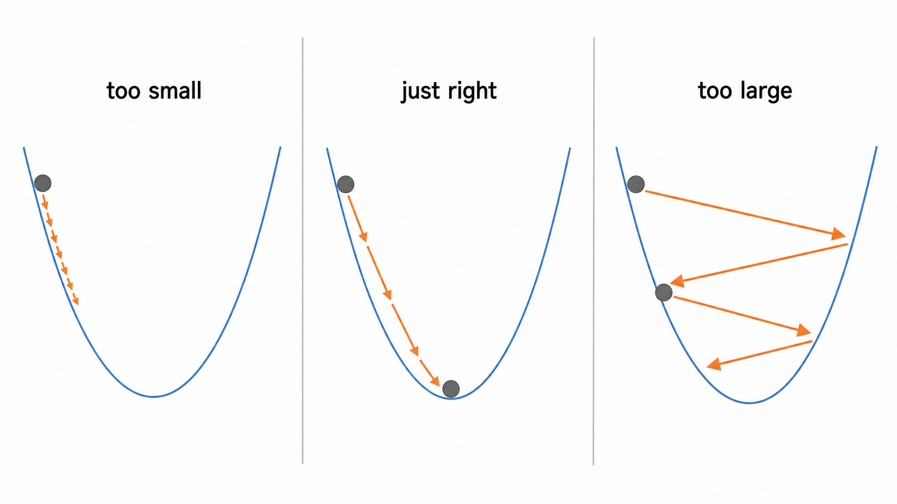

*그림 8-3: 학습률(보폭)에 따른 세 가지 결말 — 너무 작으면 느리고, 적당하면 수렴, 너무 크면 바닥을 건너뛰어 출렁인다.*

### 이게 바로 '배운다'는 것

오픈이는 이 대목에서 한참을 멈춰 섰습니다. 뭔가 큰 것이 지나간 느낌이었거든요.

지금까지의 수학은 전부 "답을 계산하는" 일이었습니다. 식을 세우고, 풀고, 답을 얻고. 그런데 경사하강법은 다릅니다. **답을 모르는 채로 시작해서, 틀린 위치에서 조금씩 고쳐 나가며, 스스로 답에 다가갑니다.**

이게 바로 우리가 "AI가 **학습한다**"고 말할 때의 그 학습입니다. 기계는 처음엔 엉터리 답(아무렇게나 정한 가중치)에서 출발합니다. 그러고는 "지금 답이 얼마나 틀렸는지(손실)"를 재고, 그 손실이 줄어드는 방향으로 가중치를 아주 조금 고칩니다. 또 재고, 또 고치고. 이 과정을 수백만 번 반복하면, 엉터리였던 답이 점점 그럴듯해집니다.

순수한 수학이 처음으로 '학습'이라는 옷을 입는 순간입니다. 1강에서 심었던 "최솟값을 *찾는다*"는 감각과 5강의 "기울기로 골짜기를 *느낀다*"는 감각이, 여기서 하나로 합쳐져 **기계가 스스로 답을 찾아가는 알고리즘**이 되었습니다.

### 이것만은 기억하자

- 최솟값을 **한 번에 못 풀 때**는, 발밑 기울기를 재서 **반대 방향으로 조금씩** 내려갑니다. 이게 **경사하강법**입니다.
- 한 걸음의 크기를 정하는 숫자가 **학습률**입니다. 너무 크면 골짜기를 건너뛰어 출렁이고, 너무 작으면 한없이 느립니다.
- 답을 계산하는 게 아니라 **틀린 답을 조금씩 고쳐 나가는 것** — 이것이 'AI가 배운다'는 말의 정체입니다.
- 이 한 걸음의 규칙은 변수가 수백만 개라도 똑같이 작동합니다(다음 강부터 그 수백만 개를 다룰 도구 — 행렬·벡터 — 를 챙깁니다).
- 단, 골짜기가 여러 개인 진짜 지형에서는 가장 깊은 곳이 아니라 **가까운 골짜기**에 멈출 수도 있습니다(기술 파트 '더 알아보기').
- 그리고 19강에서, 그 수백만 개의 기울기를 한꺼번에 구하는 방법(7강 체인룰)과 이 경사하강법이 만나 **역전파** — 신경망이 진짜로 학습하는 장면 — 을 완성합니다.

---

## 기술 파트

### 용어 정리

이야기 속 비유를 진짜 수학 용어로 정리합니다. 앞으로는 이 이름들로 부릅니다.

| 이야기 속 비유 | 진짜 용어 | 정식 정의 |
|--------------|----------|----------|
| 안개 속 발밑 기울기 | 기울기 $f'(x)$ (5강 미분) | 현재 위치에서 함수가 변하는 비율 |
| 기울기 반대로 한 걸음 | 경사하강법(gradient descent) | $x_{n+1} = x_n - \eta\,f'(x_n)$ 을 반복해 최솟값으로 다가가는 방법 |
| 한 걸음의 크기(보폭) | 학습률(learning rate) $\eta$ | 한 번에 얼마나 이동할지 정하는 양수 |
| 여러 변수의 발밑 기울기 | 기울기 묶음 (정식 이름·기호는 19강) | 변수마다의 기울기를 한 줄로 모은 목록 |

### 경사하강법 : 기울기 반대로 한 걸음

현재 위치를 $x_n$ 이라 합시다. 그 자리의 기울기는 $f'(x_n)$ 입니다(5강). 다음 위치 $x_{n+1}$ 은 기울기의 **반대 방향**으로 학습률 $\eta$ 만큼 이동한 곳입니다.

$$x_{n+1} = x_n - \eta\, f'(x_n)$$

말로 다시 읽으면, **다음 자리 = 지금 자리 − (보폭 × 지금 기울기)** 입니다. 기울기 앞의 빼기 부호 하나가 "반대 방향으로 간다"는 뜻을 담고 있습니다.

부호를 확인해 봅시다. 지금 자리가 오르막이라 $f'(x_n) > 0$ 이면, $x_n$ 에서 양수를 빼므로 왼쪽($x$ 가 작아지는 쪽)으로 갑니다. 내리막이라 $f'(x_n) < 0$ 이면, 음수를 빼므로 오른쪽으로 갑니다. 어느 쪽이든 **낮은 쪽으로** 향하죠. 그리고 바닥($f'(x_n)=0$)에 닿으면 빼는 양이 0이라 더 이상 움직이지 않습니다. 저절로 멈추는 겁니다.

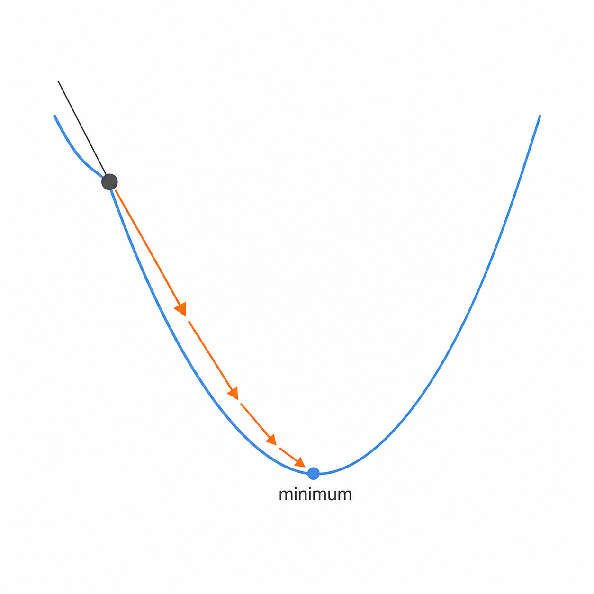

*그림 8-4: 출발점의 기울기를 재서 반대 방향으로 한 걸음. 바닥에 가까워질수록 기울기가 완만해져 걸음이 저절로 작아진다.*

### 학습률 $\eta$ : 보폭 정하기

학습률 $\eta$(에타)는 한 걸음의 크기를 정하는 양수입니다. 이 값 하나가 학습의 성패를 가릅니다.

- $\eta$ 가 **너무 작으면**: 한 걸음이 짧아 바닥까지 너무 오래 걸립니다.
- $\eta$ 가 **적당하면**: 바닥을 향해 매끄럽게 수렴합니다.
- $\eta$ 가 **너무 크면**: 바닥을 건너뛰어 반대편으로 튕기고, 좌우로 출렁이거나 아예 발산합니다.

$\eta$ 는 함수가 정해 주는 값이 아니라 **우리가 골라 넣는 값**입니다. 이렇게 학습 전에 사람이 정해 주는 값을 하이퍼파라미터(hyperparameter)라고 부르는데, 학습률은 그중 가장 중요한 하나입니다. 아래 예제 2에서 보폭이 너무 클 때 어떤 일이 벌어지는지 직접 보겠습니다.

### 계산 예제 1 : 골짜기로 두 걸음 내려가기

말로만 보면 미끄러집니다. 식으로 끝까지 굴려 봅니다. 1강에서 다뤘던 바로 그 함수를 다시 씁니다 — 진짜 최솟값을 이미 알고 있으니, 경사하강법이 정말 그쪽으로 가는지 확인할 수 있습니다.

**문제.** $f(x) = x^2 - 4x + 7$ 을 경사하강법으로 최소화합니다. 시작점 $x_0 = 0$, 학습률 $\eta = 0.1$ 로 두 걸음 내려가세요. (1강에서 구한 진짜 최솟값은 $x = 2$.)

**1단계 — 기울기 함수 구하기.**
5강의 미분으로,

$$f'(x) = 2x - 4$$

**2단계 — 갱신식 준비.**

$$x_{n+1} = x_n - \eta\, f'(x_n) = x_n - 0.1\,(2x_n - 4)$$

**3단계 — 첫 걸음 ($x_0 = 0$).**
$f'(0) = 2\cdot 0 - 4 = -4$ (내리막). 음수를 빼니 오른쪽으로 갑니다.

$$x_1 = 0 - 0.1\,(-4) = 0.4$$

**4단계 — 둘째 걸음 ($x_1 = 0.4$).**
$f'(0.4) = 2\cdot 0.4 - 4 = -3.2$ (아직 내리막, 하지만 덜 가파름).

$$x_2 = 0.4 - 0.1\,(-3.2) = 0.4 + 0.32 = 0.72$$

**답.** $x_0 = 0 \;\to\; x_1 = 0.4 \;\to\; x_2 = 0.72$. 진짜 최솟값 $x = 2$ 를 향해 조금씩 다가갑니다. 바닥에 가까워질수록 기울기($f'$)의 크기가 줄어( $-4 \to -3.2$ ), 걸음 폭도 저절로 작아지는 게 보이죠. 한 번에 답을 구하지 않고, **틀린 자리에서 출발해 점점 정답에 수렴**하는 — 바로 그 장면입니다.

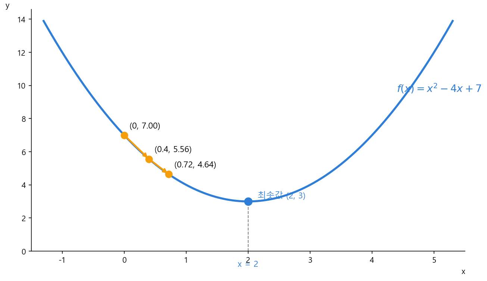

*그림 8-5: 예제 1(η=0.1) — 포물선 위에서 0→0.4→0.72로 바닥(x=2)을 향해 걸음이 점점 작아지며 수렴한다.*

### 계산 예제 2 : 보폭이 너무 크면 (발산)

같은 함수, 같은 출발점에서 학습률만 크게 키워 봅니다. 보폭이 크면 어떤 일이 벌어지는지 눈으로 확인하는 예제입니다.

**문제.** $f(x) = x^2 - 4x + 7$, 시작점 $x_0 = 0$, 이번엔 학습률 $\eta = 1.2$ 로 두 걸음 가세요.

**풀이.** 기울기는 그대로 $f'(x) = 2x - 4$. 갱신식은 $x_{n+1} = x_n - 1.2\,(2x_n - 4)$.

1. 첫 걸음 — $x_1 = 0 - 1.2\,(2\cdot 0 - 4) = 0 - 1.2(-4) = 4.8$
2. 둘째 걸음 — $x_2 = 4.8 - 1.2\,(2\cdot 4.8 - 4) = 4.8 - 1.2(5.6) = 4.8 - 6.72 = -1.92$

**답.** $x_0 = 0 \to x_1 = 4.8 \to x_2 = -1.92 \to \cdots$. 최솟값 $x=2$ 에서 거리가 $2 \to 2.8 \to 3.92$ 로 **걸음마다 더 멀어집니다.** 보폭이 너무 커서 골짜기를 가로지를 때마다 반대편 더 높은 곳에 착지하고, 그 가파른 곳에서 더 크게 튕겨 — 출렁임의 폭이 점점 커지며 **발산**합니다. 예제 1의 $\eta=0.1$ 은 매끄럽게 수렴했는데, 보폭 하나 키웠다고 정반대 결과가 났습니다.

> **딱 경계, $\eta = 1$**: 이 함수에서 학습률이 정확히 $1$ 이면 $0 \to 4 \to 0 \to 4 \to \cdots$ 로 **같은 폭으로 영원히 왕복**합니다(수렴도 발산도 아닌 칼날 위). $\eta < 1$ 이면 수렴, $\eta > 1$ 이면 위처럼 발산이죠. 학습률이 이 경계를 넘느냐가 성패를 가릅니다.

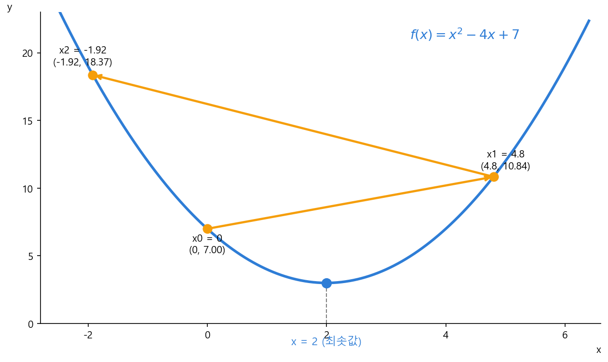

*그림 8-6: 예제 2(η=1.2) — 골짜기를 가로지를 때마다 더 높은 벽에 착지해 출렁임이 커지며 발산한다.*

### 변수가 여럿일 때 : 기울기 묶음

지금까지는 변수가 $x$ 하나였습니다. 그런데 도입에서 막혔던 진짜 손실 함수는 변수가 수백만 개($w_1, w_2, \dots$)였죠. 다행히 규칙은 조금도 바뀌지 않습니다. "발밑 기울기를 재는" 방법만 살짝 손보면 됩니다.

**한 번에 한 방향씩 더듬는다.** 안개 산의 바닥이 이제 동서로도, 남북으로도 기울 수 있는 평평한 땅이라고 해 봅시다. 두 방향의 기울기를 한꺼번에 느끼기는 어려우니, 이렇게 합니다. 남북으로는 발을 **가만히 둔 채** 동서로만 디뎌 보아 동서쪽 기울기를 재고, 다음엔 동서를 멈춰 두고 남북쪽 기울기를 잽니다. 변수가 수백만 개여도 똑같습니다 — **변수 하나하나마다 "그 변수만 움직였을 때 손실이 변하는 비율"을 따로 잽니다.** (이렇게 한 변수만 보고 재는 기울기를 편미분이라 부르는데, 그걸 실제로 *계산하는* 법은 변수 여럿을 본격적으로 다루는 19강에서 만납니다. 지금은 "변수마다 제 기울기가 하나씩 있다"는 직관만으로 충분합니다.)

**기울기들을 한 줄로 모은다.** 이렇게 변수마다 구한 기울기를 가지런히 한 줄로 모아 둔 **기울기 묶음**을 떠올려 봅시다. 말 그대로 "$w_1$ 쪽 기울기, $w_2$ 쪽 기울기, …"를 차례로 적어 둔 목록일 뿐입니다. (이 묶음에도 정식 이름과 기호가 따로 있지만, 그건 변수 여럿을 본격적으로 다루는 19강에서 챙깁니다. 지금은 '방향마다 기울기 하나씩 모은 목록'이라는 그림이면 충분해요.)

갱신하는 방법도 1변수 때와 똑같습니다. 1변수에서 $x \leftarrow x - \eta f'(x)$ 로 "기울기 반대로 한 걸음" 옮겼듯이, 변수가 수백만 개여도 **각 변수를 제 기울기 반대 방향으로 학습률만큼 한꺼번에** 옮기면 됩니다. 안개 산에서 발밑을 더듬어 한 걸음 내려가는 그 동작을, 이제 수백만 방향에서 동시에 하는 셈이죠.

한 가지만 짚고 갑니다. 왜 하필 기울기의 *반대* 방향일까요? 여러 방향의 기울기를 한데 합치면, 이 기울기 묶음은 그 자리에서 함수가 **가장 가파르게 오르는** 방향을 가리키게 됩니다(왜 그렇게 되는지 정확한 이유는 11강 내적에서 봅니다). 가장 빠른 오르막의 반대가 곧 가장 빠른 내리막이니, 그 반대로 가는 겁니다.

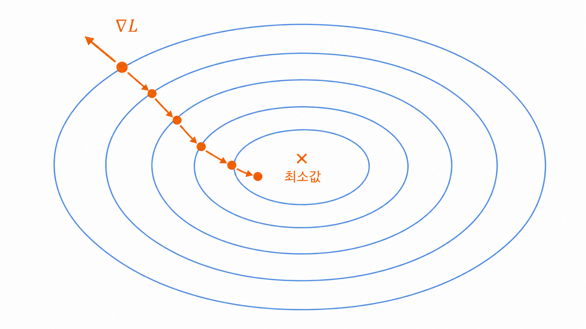

*그림 8-7: 변수가 둘 이상이면 손실은 '그릇' 모양이 된다. 각 자리의 기울기 묶음은 가장 가파른 오르막을 가리키고, 그 반대로 한 걸음씩 디뎌 중심(최솟값)으로 내려간다.*

그러니 변수가 둘이든 수백만이든, 한 일은 똑같습니다 — **변수마다 제 기울기를 재서, 그 묶음의 반대 방향으로 모두 함께 한 걸음.** 1변수에서 손으로 굴려 본 그 동작(예제 1·2) 그대로입니다. 남은 질문은 하나뿐이죠. "그 수백만 개의 기울기를 대체 어떻게 한꺼번에 구하지?" 그 답이 바로 7강에서 배운 체인룰이고, 둘이 만나는 자리가 19강 역전파입니다.

### 맛보기 : 이게 '배운다'로 바뀌는 순간

방금 "수백만 개의 기울기를 어떻게 한꺼번에 구하지?"라는 질문을 7강 체인룰에 넘겼습니다. 그 답 — 수백만 개를 한꺼번에 굴리고, 그렇게 한 걸음을 수십·수백 번 반복해 신경망이 진짜로 '배우는' 전체 장면 — 은 이 책의 정점인 19강 역전파의 몫입니다. 여기서는 그 장면이 **어떤 모양인지**만 미리 그려 두죠.

장난감 포물선(예제 1·2) 대신 진짜 예측을 떠올려 봅시다. 공부 시간으로 시험 점수를 맞히는 기계가 있다고 해요. 이 기계에는 **가중치라는 손잡이 몇 개**(흔히 $w,b$ 로 부릅니다)가 달려 있고, 손잡이를 어떻게 맞추느냐에 따라 예측이 달라집니다. 처음엔 손잡이를 아무렇게나 둬서 예측이 한참 틀리죠. 그러면 **틀린 정도(손실)를 숫자 하나로 재고**, 그 손실이 줄어드는 쪽으로 — 바로 이 강에서 배운 경사하강법으로 — **손잡이를 각자의 기울기 반대 방향으로 조금씩 밉니다.** 딱 한 번만 밀어도 예측은 정답 쪽으로 한 걸음 다가가고, 이 걸음을 수없이 반복하면 기계는 점점 정답을 맞히게 됩니다. 추상적인 포물선이 아니라 진짜 데이터 위에서 본, **'기계가 배운다'의 정체**가 이겁니다.

남은 건 딱 하나, "그 미는 양(손잡이마다의 기울기)을 어떻게 계산하느냐"입니다. 그 답이 7강 체인룰을 신경망 전체에 돌리는 일이고 — 이때 한 변수만 보고 재는 기울기(편미분)가 정식으로 등장합니다 — 예측·손실·미분·갱신을 수백 번 반복하는 전체 학습 루프와 함께 19강 역전파에서 완성됩니다. 오늘 우리는 그 절반, **"어느 방향으로 얼마나 옮길까"**(경사하강법)를 손에 넣은 셈입니다.

### 연습문제

직접 풀어보세요. 해답은 책 뒤 부록에 모아 두었습니다.

1. $f(x) = x^2 - 4x + 7$, 시작점 $x_0 = 0$, 학습률 $\eta = 0.1$ 로 **셋째 걸음** $x_3$ 을 구하세요. (예제 1의 $x_2 = 0.72$ 에서 한 걸음 더.)
2. $f(x) = x^2$ 을 시작점 $x_0 = 3$, 학습률 $\eta = 0.5$ 로 두 걸음 내려가세요. ($f'(x) = 2x$. 한 걸음에 바닥 근처까지 가는지 보세요.)
3. 예제 2를 학습률 $\eta = 1$ 로 바꾸면 $x_0 = 0$ 에서 $x_1, x_2$ 가 어떻게 되는지 구하고, $0$ 과 $4$ 를 같은 폭으로 왕복함(수렴도 발산도 아닌 딱 경계)을 확인하세요.

### 더 알아보기 : 골짜기가 하나가 아닐 때

지금까지 그림은 골짜기가 하나뿐인 깨끗한 그릇이었습니다. 그런데 도입에서 본 진짜 손실 지형은 봉우리와 골짜기가 수없이 뒤엉킨 울퉁불퉁한 산맥입니다. 여기서 경사하강법의 약점이 드러납니다. 발밑만 보고 내려가는 방법이라, 안개 속에선 어쩔 수 없는 한계죠.

**지역 최소(local minimum).** 가장 깊은 골짜기가 아니라 **가까운 골짜기**에 멈출 수 있습니다. 더 깊은 골짜기가 옆에 있어도 안개에 가려 안 보이니까요. 일단 바닥(기울기 0)에 닿으면 더는 움직이지 않습니다.

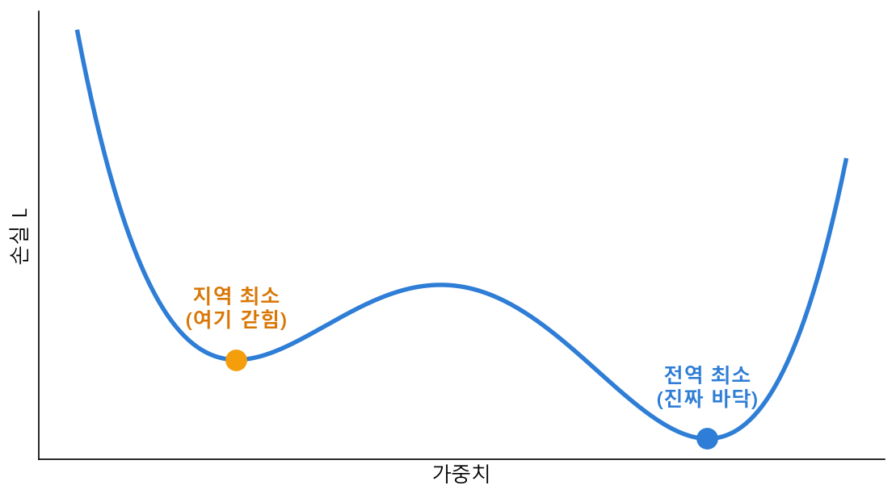

*그림 8-8: 지역 최소 — 발밑만 보고 내려가면, 더 깊은 전역 최소를 옆에 두고도 가까운 (얕은) 지역 최소에 멈춰 설 수 있다.*

**안장점(saddle point).** 한 방향으론 내리막인데 다른 방향으론 오르막인, 말안장처럼 생긴 평평한 지점. 기울기가 거의 0이라 한참 멈칫합니다.

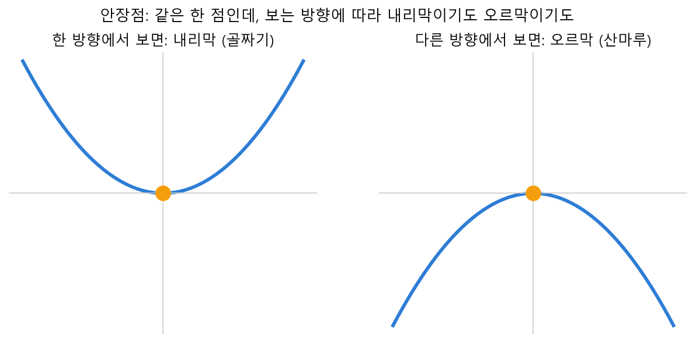

*그림 8-9: 안장점 — 같은 한 점인데 한 방향에서 보면 골짜기(내리막), 다른 방향에서 보면 산마루(오르막). 가운데는 기울기가 거의 0이라 한참 멈칫한다.*

이걸 피하거나 빠져나오려고 여러 개선판이 나왔습니다. 원리는 이 책 범위를 넘으니 **이름과 한 줄 직관만** 챙겨 둡니다.

**모멘텀(momentum).** 내려오던 **관성**을 실어, 작은 웅덩이는 그냥 굴러 지나칩니다.

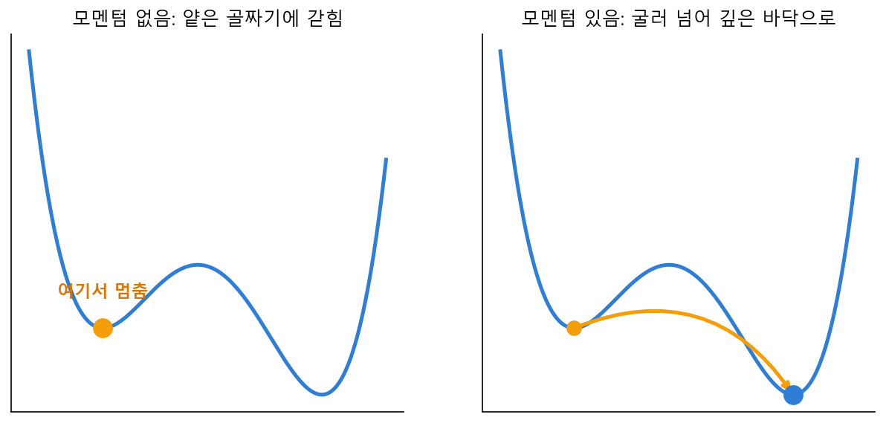

*그림 8-10: 모멘텀 — (왼쪽) 모멘텀이 없으면 얕은 골짜기에 멈추지만, (오른쪽) 내려오던 관성을 실으면 그 봉우리를 굴러 넘어 더 깊은 바닥으로 간다.*

**Adam.** 변수마다 보폭(학습률)을 **자동으로** 조절해 줍니다. 요즘 딥러닝의 기본값.

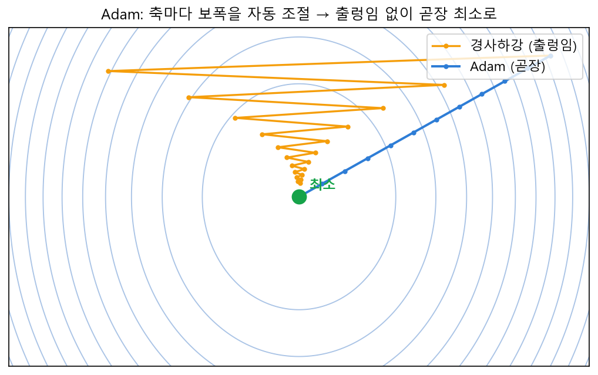

*그림 8-11: Adam — 고정 보폭의 경사하강은 가파른 축에서 좌우로 출렁이며 느리게 가지만, Adam은 축마다 보폭을 자동 조절해 곧장 최소로 향한다.*

**학습률 스케줄링.** 처음엔 큰 보폭으로 성큼성큼, 바닥에 가까워지면 보폭을 줄여 살살.

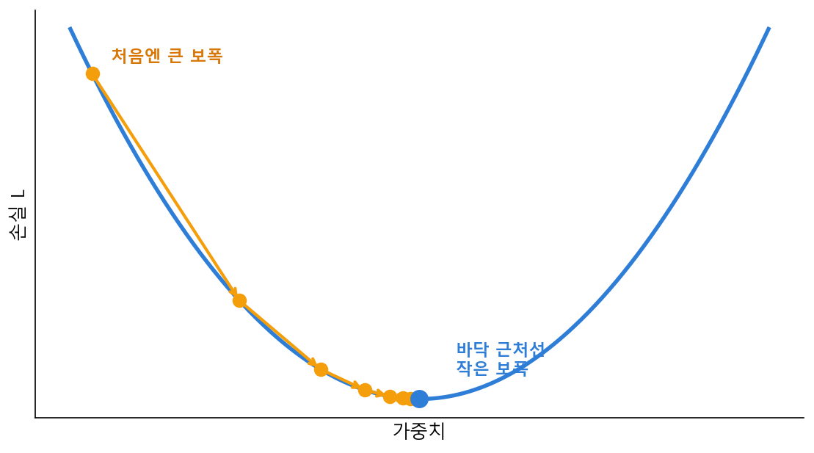

*그림 8-12: 학습률 스케줄링 — 처음엔 보폭을 크게 잡아 성큼성큼 내려오다가, 바닥에 가까워질수록 보폭을 줄여 살살 다가간다.*

> 다행히 큰 신경망에서는 대부분의 지역 최소가 전역 최소와 성능이 비슷하다고 알려져 있어, 실전에선 생각만큼 큰 문제가 되지는 않습니다. "경사하강법에도 함정이 있고, 그걸 다루는 개선판들이 있다"는 것만 기억하면 충분합니다.

### 이게 AI 어디에 쓰이나

경사하강법은 **AI가 '배우는' 바로 그 알고리즘**입니다. 신경망은 처음엔 아무렇게나 정한 가중치로 시작합니다. 그 상태로 답을 내보면 당연히 많이 틀리죠. 그 "틀린 정도"를 숫자 하나로 잰 것이 손실(15강 MSE)이고, 학습이란 이 손실을 최소화하는 가중치를 찾는 일입니다.

그런데 가중치가 수백만 개라 손실이 0이 되는 지점을 한 번에 풀 수 없습니다 — 도입에서 오픈이가 막혔던 바로 그 벽이죠. 그래서 신경망은 정확히 이 강에서 배운 대로 합니다. 손실의 기울기(가중치마다 하나씩 모은 묶음)를 구하고, 가중치를 그 반대 방향으로 아주 조금 옮기고, 다시 손실을 재고, 또 옮기고. 이 걸음을 수없이 반복하면서 신경망은 골짜기 바닥 — 손실이 가장 작은 가중치 — 으로 내려갑니다.

남은 퍼즐은 "수백만 개의 그래디언트를 어떻게 효율적으로 구하느냐" 하나뿐입니다. 그 답이 7강 체인룰이고, 경사하강법과 체인룰이 한 점에서 만나는 자리가 이 책의 정점 — **19강 역전파**입니다. 오늘 우리는 AI가 배운다는 말의 절반(어느 방향으로, 얼마나 옮길까)을 손에 넣었습니다. 나머지 절반(그 방향을 어떻게 계산할까)을 위해, 다음 강부터는 수백만 개의 숫자를 한꺼번에 다루는 도구 — 행렬 — 를 챙기러 갑니다.
