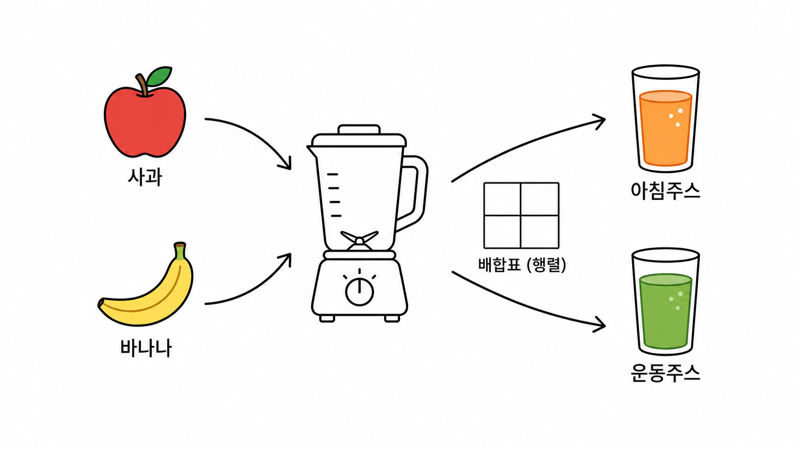
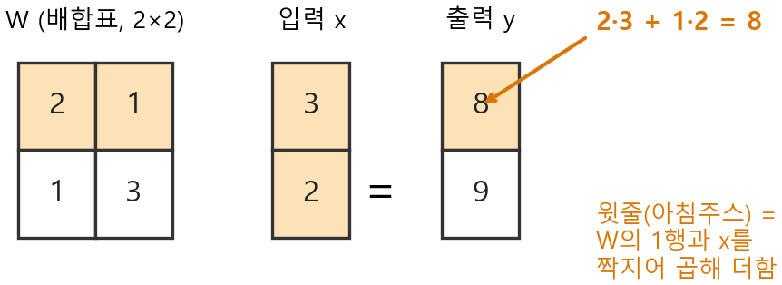

# Ch.9 · 한 번에 섞는 믹서 : 행렬 — v0.9

> 이번 강: (기하·선형대수 블록 시작) → 수백만 개를 *한 번에* 다루는 첫 도구
> 한 줄 요약: 행렬은 여러 입력을 여러 출력으로 **한 번에 섞는 배합표**입니다. 신경망 한 층이 바로 이 믹서예요.
> 핵심 개념: 행렬 · 행렬곱 · 전치

---

## 이야기 파트

### 식이 수백만 줄이 될 판

8강에서 오픈이는 큰 고비를 넘었습니다. 손실을 줄이는 방향으로 가중치를 조금씩 옮기는 법 — 경사하강법 — 을 손에 넣었거든요. 갱신식도 깔끔했습니다.

$$\theta \leftarrow \theta - \eta\, \nabla L$$

"모든 가중치를 한꺼번에, 각자의 기울기 반대로 한 걸음." 말은 멋졌습니다. 그런데 막상 키보드 앞에 앉으니 손이 멈췄습니다.

신경망은 입력을 받아 출력을 내놓습니다. 입력이 $x_1, x_2, \dots$ 수천 개, 출력도 수천 개. 출력 하나하나가 **입력 전부를 제 나름의 비율로 섞은 결과**입니다. 그러니 오픈이가 이걸 곧이곧대로 적으면 이렇게 됩니다.

> 첫 번째 출력 $= w_{11}x_1 + w_{12}x_2 + w_{13}x_3 + \cdots$ (수천 항)
> 두 번째 출력 $= w_{21}x_1 + w_{22}x_2 + w_{23}x_3 + \cdots$ (수천 항)
> … 이런 줄이 또 수천 개 …

식 하나가 수천 항이고, 그런 식이 수천 줄. 전부 적으면 수백만 줄짜리 괴물입니다. 오픈이는 한숨을 쉬었습니다. *이걸 한 줄씩 쓰다간 날 새겠는데. 똑같은 모양이 수백만 번 반복되는데, 묶어서 한 방에 쓰는 방법이 없을까?*

### 믹서에 한꺼번에

그날 오픈이는 주방에서 답을 봤습니다. 아침마다 쓰는 **믹서**였죠.

믹서에 사과와 바나나를 넣고 버튼을 누르면, 주스가 나옵니다. 그런데 오픈이네 믹서는 똑똑해서 한 번에 **두 종류**를 만듭니다. *아침주스*와 *운동주스*. 두 주스는 같은 재료(사과·바나나)를 쓰지만 **섞는 비율이 다릅니다.**

- 아침주스 = 사과를 듬뿍, 바나나는 조금
- 운동주스 = 사과는 조금, 바나나를 듬뿍

여기서 오픈이는 무릎을 쳤습니다. 이 "**섞는 비율 표**"만 정해 두면, 재료를 한 바구니 넣는 순간 두 주스가 동시에 나옵니다. 재료가 입력, 주스가 출력, 그리고 그 사이의 **배합비 표**가 바로 신경망이 곱하는 그 가중치 덩어리였던 겁니다.

수백만 줄을 한 줄씩 쓸 필요가 없었습니다. **배합표 하나**와 **입력 한 바구니**, 그리고 "표대로 섞어라"는 규칙 하나면 끝이었죠. 이 배합표에 붙은 이름이 **행렬**이고, "표대로 섞는" 동작이 **행렬곱**입니다.

*그림 9-1: 행렬은 '배합표'다. 입력(재료)을 한 바구니 넣으면, 표에 적힌 비율대로 섞인 출력(주스)이 한꺼번에 나온다.*

### 배합표를 세우다

오픈이는 작게 시작했습니다. 재료 둘(사과·바나나), 주스 둘(아침·운동). 배합표를 이렇게 적었죠.

|  | 사과 | 바나나 |
|--|------|--------|
| **아침주스** | 2 | 1 |
| **운동주스** | 1 | 3 |

읽는 법은 간단합니다. *아침주스 한 줄*은 "사과 2몫 + 바나나 1몫", *운동주스 한 줄*은 "사과 1몫 + 바나나 3몫". 표의 **가로 한 줄**이 주스 하나의 레시피인 셈입니다.

이제 오늘 아침 바구니에 사과 3, 바나나 2가 있다고 해봅시다. 아침주스가 얼마나 나올까요? 아침주스 줄(2, 1)을 바구니(3, 2)에 대고 **짝을 지어 곱한 뒤 더하면** 됩니다.

$$\text{아침주스} = 2\times 3 + 1\times 2 = 6 + 2 = 8$$

운동주스도 똑같이, 운동주스 줄(1, 3)을 같은 바구니에 대고:

$$\text{운동주스} = 1\times 3 + 3\times 2 = 3 + 6 = 9$$

재료 한 바구니를 넣었더니 주스 둘(8, 9)이 한꺼번에 나왔습니다. 식 두 줄이 끝이에요. 만약 주스가 1000종이었어도 "표의 각 줄을 바구니에 짝지어 곱해 더한다"는 규칙은 **글자 하나 안 바뀝니다.** 줄 수만 늘 뿐이죠. 오픈이가 찾던, 수백만 줄을 한 규칙으로 묶는 방법이 바로 이것이었습니다.

딱 한 번 발을 헛디딘 데가 있었습니다. 오픈이는 처음에 **재료가 3종인 바구니**(사과·바나나·당근)를 위 표(재료 2칸짜리)에 들이밀었습니다. 그런데 표의 한 줄은 칸이 둘(사과·바나나)뿐이라, 당근은 짝지을 자리가 없었죠. 표의 **가로 칸 수**와 바구니의 **재료 수**가 같아야만 짝이 맞아떨어집니다. 안 맞으면 믹서가 아예 안 돌아갑니다 — 이 "칸 수 맞추기"가 뒤에서 또 중요해집니다.

### 이것만은 기억하자

- **행렬은 여러 입력을 여러 출력으로 한 번에 섞는 배합표**입니다. 표의 가로 한 줄 = 출력 하나의 레시피.
- 섞는 법(**행렬곱**)은 딱 하나: **표의 한 줄과 입력을 짝지어 곱한 뒤 더한다.** 줄마다 반복하면 출력이 한꺼번에 나옵니다.
- 표의 **가로 칸 수**와 입력의 **개수**가 같아야 짝이 맞습니다(안 맞으면 못 섞음).
- 그리고 이 믹서가 바로 **신경망 한 층**입니다 — 입력을 가중치로 섞고(행렬곱), 약간의 기본 보정을 더하면(편향) 한 층의 출력이 됩니다.
- 다음 강(10강)에서는 방향과 회전을 다루는 도구 — **삼각함수와 복소평면** — 을 챙기고, 11강에서 이 행렬과 만나 '벡터'를 본격적으로 다룹니다.

---

## 기술 파트

### 용어 정리

이야기 속 비유를 진짜 수학 용어로 정리합니다. 앞으로는 이 이름들로 부릅니다.

| 이야기 속 비유 | 진짜 용어 | 정식 정의 |
|--------------|----------|----------|
| 배합표 (숫자들의 표) | 행렬(matrix) | 숫자를 직사각형으로 늘어놓은 것. 가로줄을 **행**, 세로줄을 **열**이라 한다 |
| 표의 가로 한 줄 | 행(row) | 출력 하나의 레시피(섞는 비율) |
| 표의 세로 한 칸 묶음 | 열(column) | 같은 자리(재료)에 걸리는 비율들 |
| 표대로 섞기 | 행렬곱(matrix multiplication) | 행과 입력을 짝지어 곱해 더하는 연산 |
| 표를 대각선으로 뒤집기 | 전치(transpose) | 행과 열을 맞바꾼 행렬 $A^\top$ |

행렬의 크기는 **(행의 수)×(열의 수)** 로 적습니다. 위 배합표는 가로줄 2개(아침·운동), 세로칸 2개(사과·바나나)라 $2\times 2$ 행렬입니다. 입력 바구니(사과·바나나)처럼 한 줄로 세운 숫자는 세로로 세우면 $2\times 1$ 행렬이 됩니다.

### 행렬과 행렬곱 : 행과 열을 짝지어

배합표 $W$ 와 입력 $x$ 를 이렇게 적습니다. 글자 $w_{ij}$ 는 "$i$번째 출력에 $j$번째 재료가 들어가는 비율"이라고 읽으면 됩니다($i$=행 번호, $j$=열 번호).

$$W = \begin{bmatrix} w_{11} & w_{12} \\ w_{21} & w_{22} \end{bmatrix}, \qquad x = \begin{bmatrix} x_1 \\ x_2 \end{bmatrix}$$

행렬곱 $Wx$ 의 규칙은 이야기에서 본 그대로입니다. **$W$ 의 한 행을 $x$ 에 짝지어 곱한 뒤 더한 것**이 출력의 한 줄이 됩니다.

$$Wx = \begin{bmatrix} w_{11} & w_{12} \\ w_{21} & w_{22} \end{bmatrix}\begin{bmatrix} x_1 \\ x_2 \end{bmatrix} = \begin{bmatrix} w_{11}x_1 + w_{12}x_2 \\ w_{21}x_1 + w_{22}x_2 \end{bmatrix}$$

윗줄을 말로 다시 읽으면 — **1행 $(w_{11}, w_{12})$ 을 입력 $(x_1, x_2)$ 에 짝지어**: $w_{11}\!\cdot\! x_1$ 더하기 $w_{12}\!\cdot\! x_2$. 그게 첫 번째 출력입니다. 아랫줄은 2행으로 똑같이 하면 두 번째 출력이고요.

여기서 **짝이 맞는 조건**이 보입니다. 한 행에는 칸이 2개($w_{i1}, w_{i2}$), 입력도 2개($x_1, x_2$) — 그래서 빠짐없이 짝지어집니다. 일반으로 적으면, **왼쪽 행렬의 열 수**와 **오른쪽(입력)의 행 수**가 같아야 곱할 수 있습니다. 이야기에서 당근이 짝지을 자리가 없던 게 바로 이 조건이 깨진 경우예요. 그리고 결과의 크기는 **(왼쪽의 행 수)×(오른쪽의 열 수)** 가 됩니다 — 여기선 $2\times 2$ 곱하기 $2\times 1$ 이라 $2\times 1$, 출력 2개가 맞습니다.

*그림 9-2: 행렬곱은 'W의 한 행과 입력을 짝지어 곱해 더한다'를 줄마다 반복하는 것. 강조한 윗줄이 첫 번째 출력(아침주스)이 만들어지는 과정이다.*

### 계산 예제 1 : 과일을 주스로

말로만 보면 미끄러지니, 숫자로 끝까지 굴려 봅니다. 이야기의 배합표와 바구니를 그대로 씁니다.

**문제.** 배합표 $W = \begin{bmatrix} 2 & 1 \\ 1 & 3 \end{bmatrix}$, 입력 $x = \begin{bmatrix} 3 \\ 2 \end{bmatrix}$ 일 때 $Wx$ 를 구하세요.

**1단계 — 첫 줄(아침주스): W의 1행 $(2, 1)$ 을 입력 $(3, 2)$ 에 짝지어.**

$$2\times 3 + 1\times 2 = 6 + 2 = 8$$

**2단계 — 둘째 줄(운동주스): W의 2행 $(1, 3)$ 을 같은 입력 $(3, 2)$ 에 짝지어.**

$$1\times 3 + 3\times 2 = 3 + 6 = 9$$

**답.**

$$Wx = \begin{bmatrix} 2 & 1 \\ 1 & 3 \end{bmatrix}\begin{bmatrix} 3 \\ 2 \end{bmatrix} = \begin{bmatrix} 8 \\ 9 \end{bmatrix}$$

재료 한 바구니로 두 주스(8, 9)가 한꺼번에 나왔습니다. 출력이 입력과 같은 2개짜리인 것도 확인했고요.

### 계산 예제 2 : 신경망 한 층 = 섞고 더하기

이제 이 믹서가 왜 AI의 부품인지 봅니다. 신경망의 **한 층**은 입력을 가중치로 섞은 다음, 거기에 **기본 보정값**을 조금 더합니다. 이 기본 보정값을 **편향**이라 하고 $b$ 로 씁니다(8강 맛보기의 $\hat y = wx + b$ 에서 그 $b$ 와 같은 식구입니다. 정식 정의는 16강 '뉴런 하나'에서).

$$y = Wx + b$$

말로 읽으면 **출력 = (입력을 배합표대로 섞고) + (기본 보정)** 입니다. 섞는 부분이 방금 배운 행렬곱이고, 더하는 부분은 칸끼리 그냥 더하기예요.

**문제.** 예제 1의 결과 $Wx = \begin{bmatrix} 8 \\ 9 \end{bmatrix}$ 에 편향 $b = \begin{bmatrix} 1 \\ -2 \end{bmatrix}$ 를 더하세요.

**풀이 — 같은 자리끼리 더한다.**

$$y = \begin{bmatrix} 8 \\ 9 \end{bmatrix} + \begin{bmatrix} 1 \\ -2 \end{bmatrix} = \begin{bmatrix} 8+1 \\ 9+(-2) \end{bmatrix} = \begin{bmatrix} 9 \\ 7 \end{bmatrix}$$

이게 신경망 **한 층**이 하는 일의 전부입니다. 입력을 받아 배합표 $W$ 로 섞고(행렬곱), 편향 $b$ 를 더해(덧셈) 출력을 내놓는 것. 층을 여러 개 쌓아 이 동작을 반복하는 게 18강 '순전파'이고, 거대 언어 모델도 결국 이 $Wx + b$ 가 어마어마하게 많이 쌓인 덩어리입니다.

### 전치 : 표를 대각선으로 뒤집기

행렬에는 자주 쓰는 변형이 하나 있습니다. **표를 대각선으로 뒤집어 행과 열을 맞바꾸는 것** — 이를 **전치**라 하고 $A^\top$ 로 씁니다. 1행이 1열로, 2행이 2열로 자리를 바꿉니다.

예를 들어 가로로 길쭉한 $2\times 3$ 표를 뒤집으면 세로로 길쭉한 $3\times 2$ 표가 됩니다.

$$A = \begin{bmatrix} 1 & 2 & 3 \\ 4 & 5 & 6 \end{bmatrix} \quad\Longrightarrow\quad A^\top = \begin{bmatrix} 1 & 4 \\ 2 & 5 \\ 3 & 6 \end{bmatrix}$$

읽는 법은 간단합니다. $A$ 의 **1행** $(1, 2, 3)$ 이 $A^\top$ 의 **1열**(세로로 1, 2, 3)로 섰고, $A$ 의 **2행** $(4, 5, 6)$ 이 $A^\top$ 의 **2열**로 섰습니다. 크기도 $2\times 3$ 에서 $3\times 2$ 로, 가로세로가 뒤바뀌었죠.

지금은 "행과 열을 맞바꾸는 손쉬운 뒤집기"로만 기억해 두면 충분합니다. 이 뒤집기가 정확히 어디서 필요한지는 19강 '역전파'에서, 출력 쪽의 신호를 입력 쪽으로 거슬러 보낼 때 드러납니다.

### 연습문제

> 해답은 부록에 모았습니다. 손으로 먼저 풀어 보세요.

**1.** 다음 행렬곱을 구하세요.
$$\begin{bmatrix} 1 & 2 \\ 0 & 3 \end{bmatrix}\begin{bmatrix} 2 \\ 1 \end{bmatrix} = \;?$$

**2.** 연습 1의 결과에 편향 $b = \begin{bmatrix} -1 \\ 2 \end{bmatrix}$ 를 더하면(즉 $Wx + b$) 얼마인가요?

**3.** 다음 행렬의 전치 $A^\top$ 를 쓰고, 크기가 어떻게 바뀌는지 적으세요.
$$A = \begin{bmatrix} 2 & 0 & 5 \\ 1 & 3 & 4 \end{bmatrix}$$

**4.** $3\times 2$ 행렬과 $2\times 1$ 입력은 곱할 수 있나요? 곱할 수 있다면 결과의 크기는 얼마인가요? (짝이 맞는 조건을 생각해 보세요.)

### 이게 AI 어디에 쓰이나

신경망의 **한 층**은 통째로 $y = Wx + b$ 한 줄입니다 — 입력을 가중치 행렬 $W$ 로 한꺼번에 섞고, 편향 $b$ 를 더하는 것. 8강에서 오픈이가 "수백만 가중치를 한꺼번에 옮긴다"며 막막해했던 그 수백만 개가, 알고 보니 이 배합표 $W$ 의 칸들이었습니다. 행렬이라는 그릇에 담으니 수백만 줄짜리 식이 단 한 줄로 접혔죠.

이 한 층을 여러 개 쌓아 입력에서 출력까지 흘려보내는 것이 18강 **순전파**이고, 거대 언어 모델(LLM)도 본질은 이 $Wx + b$ 가 수없이 쌓이고 이어진 거대한 행렬곱 덩어리입니다. 행렬은 'AI가 수많은 숫자를 한꺼번에 다루는' 바로 그 언어인 셈입니다.
