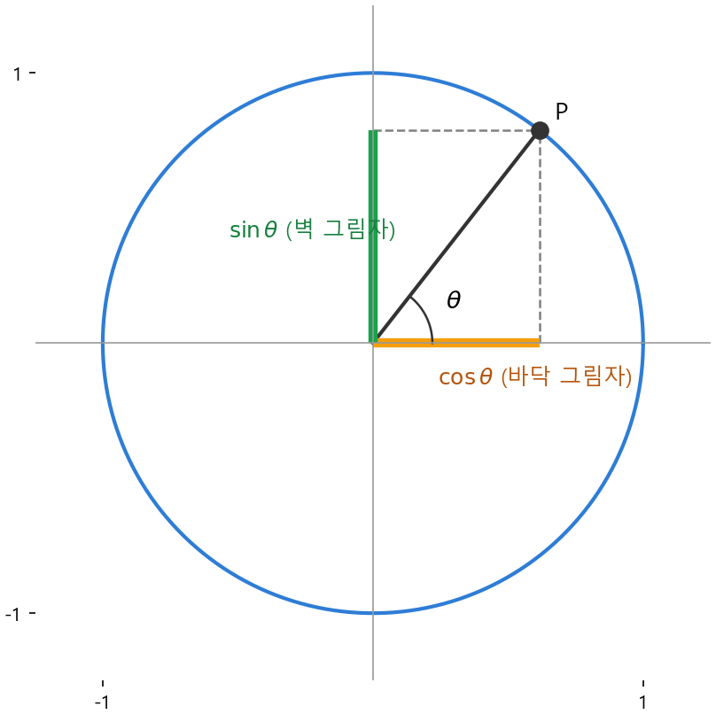
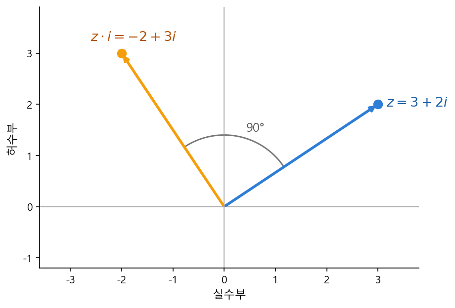

# Ch.10 · 그림자와 회전 : 삼각함수 + 복소평면 — v0.10

> 이번 강: (기하·선형대수 블록 2단계) → '방향'과 '회전'을 숫자로 바꾸는 도구
> 한 줄 요약: 빙글빙글 도는 점이 바닥과 벽에 드리우는 **두 그림자**가 cos·sin이고, 회전 그 자체를 **곱셈 한 번**으로 해내는 게 복소수입니다.
> 핵심 개념: 삼각함수(sin·cos·tan)·단위원 · 복소평면 · 복소수 곱 = 회전

---

## 이야기 파트

### 각도는 아는데, 좌표를 모른다

9강에서 오픈이는 믹서(행렬)를 손에 넣었습니다. 수백만 줄짜리 식을 배합표 한 장으로 접는 법이었죠. 그런데 그 표를 채우려고 입력들을 들여다보던 오픈이에게 새로운 종류의 막막함이 찾아왔습니다. AI가 다루는 숫자 묶음에는 자꾸 **'방향'** 이 끼어 있었거든요.

"이 단어는 저 단어와 **비슷한 쪽**을 가리킨다", "이 둘은 **거의 반대 방향**이다" — 이런 말이 계속 나오는데, 정작 컴퓨터에게 '방향'을 어떻게 건네줘야 할지 알 수가 없었습니다. 사람은 손가락으로 가리키면 되지만, 컴퓨터에게는 결국 **숫자**로 줘야 합니다.

오픈이는 종이에 화살표 하나를 그려 봤습니다. 한가운데에서 비스듬히 뻗은 화살표. "이게 **30도 방향**이야"라고는 말할 수 있는데, 막상 이 화살표 끝이 좌표평면의 어디(가로 얼마, 세로 얼마)에 있는지를 적으려니 손이 멎었습니다. **각도(방향)는 아는데, 좌표(숫자 두 개)를 모르는** 상황이었죠.

*각도 하나를 넣으면 가로·세로 좌표가 툭 튀어나오는 기계가 있으면 좋겠는데.*

### 빙글빙글 도는 점의 두 그림자

답은 놀이공원에서 나왔습니다. 오픈이는 **관람차**를 떠올렸어요.

관람차의 한 칸이 중심을 축으로 빙글빙글 돕니다. 칸은 항상 중심에서 **같은 거리**(바퀴의 반지름)만큼 떨어져 있죠. 도는 동안 칸의 위치를 어떻게 콕 집어 말할까요? 오픈이는 두 개의 그림자를 상상했습니다.

- **머리 위에서 해가 비추면** → 칸의 그림자가 **바닥(가로축)**에 떨어집니다. 이 그림자가 중심에서 얼마나 옆으로 갔는지가 칸의 **가로 위치**.
- **옆에서 해가 비추면** → 그림자가 **벽(세로축)**에 떨어집니다. 이게 칸의 **높이(세로 위치)**.

칸이 한 바퀴 도는 내내, 이 두 그림자는 늘어났다 줄었다 하며 칸의 자리를 정확히 알려줍니다. 각도(칸이 얼마나 돌았나) 하나만 주면, **바닥 그림자와 벽 그림자**라는 두 숫자가 따라 나오는 거예요. 오픈이가 찾던 바로 그 기계였습니다.

이 두 그림자에 붙은 이름이 **코사인(cos)**과 **사인(sin)**입니다. 바닥에 진 가로 그림자가 cos, 벽에 진 세로 그림자가 sin. 그게 전부예요. 어렵게 외울 공식이 아니라, **도는 점이 만드는 두 그림자**일 뿐입니다.

*그림 10-1: 반지름 1인 원 위에서 각도 θ만큼 돈 점 P. 바닥에 진 가로 그림자가 cos θ, 벽에 진 세로 그림자가 sin θ다.*

여기서 오픈이가 영리하게 한 가지를 정해 둡니다 — 관람차 바퀴의 **반지름을 딱 1**로 두는 겁니다. 반지름이 1이면 그림자 길이가 곧 "전체의 몇 할인가"를 그대로 나타내서 숫자가 깔끔해지거든요. 이렇게 **반지름이 1인 원**을 **단위원**이라 부릅니다. 앞으로 cos·sin 이야기는 전부 이 단위원 위에서 합니다.

### 그림자 둘은 남남이 아니다

오픈이는 그림 10-1을 보다가 무릎을 쳤습니다. 점 P, 그리고 그 아래로 내린 바닥 그림자, 그 둘을 잇는 반지름 — 이 셋이 **직각삼각형**을 이루고 있었거든요. 밑변이 cos θ, 높이가 sin θ, 그리고 빗변이 반지름이라 길이가 **1**.

2강에서 배운 피타고라스가 곧바로 떠올랐습니다. "직각삼각형에서 (밑변)² + (높이)² = (빗변)²." 그대로 대입하면:

$$(\cos\theta)^2 + (\sin\theta)^2 = 1^2 = 1$$

각도가 몇 도든, 점이 어디로 돌든 **두 그림자를 제곱해 더하면 항상 1**입니다. 두 그림자는 따로 노는 게 아니라 이렇게 단단히 묶여 있었어요. 하나가 커지면 다른 하나는 그만큼 작아질 수밖에 없죠 — 합이 1로 고정이니까요.

### 회전을, 곱셈 한 번으로

방향은 풀렸습니다. 그런데 오픈이에게 더 큰 숙제가 남아 있었어요. AI는 방향을 **읽기만** 하는 게 아니라 종종 **돌려야** 합니다. "이 화살표를 90도 돌린 건 어디를 가리키지?" 같은 질문이죠.

각도를 일일이 더해 cos·sin을 다시 계산할 수도 있지만, 오픈이는 더 우아한 길이 없을까 궁금했습니다. 그러다 떠올린 게 학창 시절 만났던 **이상한 수**, $i$ 였습니다.

$i$ 는 "제곱하면 $-1$이 되는 수"입니다. 보통 수는 제곱하면 무조건 0 이상인데, $i$ 는 $i^2 = -1$ 이라는 약속을 가진 새 식구예요. 처음엔 "그런 수가 어디 있어?" 싶지만, 오픈이는 이 수를 **숫자가 아니라 평면 위의 점**으로 보면 마법이 일어난다는 걸 알게 됩니다.

가로축은 우리가 아는 보통 수(실수), 세로축은 $i$ 가 붙은 수(허수). 그러면 $3 + 2i$ 같은 수는 평면 위의 점 $(3, 2)$ 가 됩니다. 이 평면이 **복소평면**이에요. 화살표(방향)를 점으로 적는, 9강 좌표평면의 사촌인 셈이죠.

그리고 진짜 마법은 여기서 터집니다. 어떤 점에 $i$ 를 **곱하면**, 그 점이 중심을 축으로 **정확히 90도 돌아갑니다.** 각도를 따로 계산할 필요 없이, 그냥 $i$ 한 번 곱하는 걸로 90도 회전이 끝나요. 회전이라는 동작이 곱셈이라는 계산으로 바뀐 겁니다 — 컴퓨터가 제일 잘하는 그 곱셈으로요.

*그림 10-2: 점 $z=3+2i$ 에 $i$ 를 곱하면 $-2+3i$ 가 된다. 화살표가 중심을 축으로 정확히 90도 돌았다 — 회전이 곱셈 한 번으로 끝난 것이다.*

### 이것만은 기억하자

- **cos·sin은 도는 점의 두 그림자**입니다. 단위원(반지름 1인 원) 위에서 각도 θ만큼 돈 점의 **가로 좌표가 cos θ, 세로 좌표가 sin θ**. 각도(방향) 하나를 넣으면 좌표 둘이 나오는 기계예요.
- 두 그림자는 피타고라스로 묶여 있습니다: $\cos^2\theta + \sin^2\theta = 1$. 항상.
- **복소수 $i$ 는 $i^2=-1$** 인 새 수이고, $a+bi$ 는 **복소평면의 점 $(a, b)$** 입니다.
- **복소수를 곱하면 회전합니다.** 특히 $i$ 를 곱하면 90도. 회전이라는 동작이 곱셈이라는 계산으로 바뀝니다.
- 다음 강(11강)에서는 9강의 행렬과 이번 강의 방향이 만나 **벡터·내적**을 다룹니다. 그때 cos가 "두 방향이 얼마나 같은가"를 재는 핵심 도구로 돌아옵니다.

---

## 기술 파트

### 용어 정리

이야기 속 비유를 진짜 수학 용어로 정리합니다. 앞으로는 이 이름들로 부릅니다.

| 이야기 속 비유 | 진짜 용어 | 정식 정의 |
|--------------|----------|----------|
| 반지름 1인 관람차 바퀴 | 단위원(unit circle) | 중심이 원점이고 반지름이 1인 원 |
| 바닥에 진 가로 그림자 | 코사인 $\cos\theta$ | 단위원 위 점의 x좌표 |
| 벽에 진 세로 그림자 | 사인 $\sin\theta$ | 단위원 위 점의 y좌표 |
| 두 그림자의 비율(기울기) | 탄젠트 $\tan\theta$ | $\dfrac{\sin\theta}{\cos\theta}$ — 점을 잇는 반직선의 기울기 |
| 제곱하면 −1인 수 | 허수단위 $i$ | $i^2 = -1$ 로 약속한 수 |
| 가로=실수, 세로=허수인 평면 | 복소평면 | $a+bi$ 를 점 $(a, b)$ 로 나타내는 평면 |

### 수식 1 — 삼각함수 : 단위원이 정의다

각도 θ만큼 돈 단위원 위의 점을 $P$ 라 하면, 그 좌표가 곧 cos와 sin입니다.

$$P = (\cos\theta,\ \sin\theta)$$

말로 다시 읽으면 — **cos θ = 그 점의 가로 좌표, sin θ = 세로 좌표.** 외워야 할 정의는 이 한 줄뿐입니다. 그리고 점을 원점과 잇는 반직선의 **기울기**(세로 ÷ 가로)가 탄젠트입니다.

$$\tan\theta = \frac{\sin\theta}{\cos\theta}$$

세로 그림자를 가로 그림자로 나눈 것이니, "얼마나 가파른 방향인가"를 한 숫자로 나타낸 셈이죠.

**피타고라스 항등식.** 점 $P$, 그 가로 그림자의 발($(\cos\theta, 0)$), 원점 — 이 셋이 직각삼각형을 이룹니다. 밑변 $\cos\theta$, 높이 $\sin\theta$, 빗변은 반지름이라 길이 1. 2강의 피타고라스 정리(밑변² + 높이² = 빗변²)를 그대로 적으면:

$$\cos^2\theta + \sin^2\theta = 1$$

이 식은 cos와 sin 중 하나를 알면 나머지를 구할 수 있게 해 주는, 삼각함수에서 가장 자주 쓰는 도구입니다.

### 계산 예제 1 : 45도 방향의 좌표 구하기

**문제.** 단위원 위에서 45도만큼 돈 점의 좌표 $(\cos 45^\circ,\ \sin 45^\circ)$ 를 구하세요.

각도표를 외우지 않고 **단위원 + 피타고라스**만으로 풀어 봅니다.

**1단계 — 45도의 특별함을 읽는다.** 45도는 가로축과 세로축의 **딱 가운데** 방향입니다. 그러니 가로로 간 만큼 세로로도 갔습니다. 즉 가로 그림자와 세로 그림자가 같아요.

$$\cos 45^\circ = \sin 45^\circ$$

이 값을 $s$ 라고 부르겠습니다($\cos 45^\circ = \sin 45^\circ = s$).

**2단계 — 피타고라스 항등식에 넣는다.** $\cos^2 45^\circ + \sin^2 45^\circ = 1$ 에 둘 다 $s$ 를 대입하면:

$$s^2 + s^2 = 1$$

**3단계 — $s$ 를 푼다.**

$$2s^2 = 1 \;\Longrightarrow\; s^2 = \frac{1}{2} \;\Longrightarrow\; s = \sqrt{\frac{1}{2}} = \frac{1}{\sqrt{2}}$$

(45도는 1사분면 방향이라 그림자가 양수이므로 양의 제곱근만 취합니다.)

**답.**

$$\cos 45^\circ = \sin 45^\circ = \frac{1}{\sqrt 2} \approx 0.707$$

탄젠트도 바로 나옵니다. $\tan 45^\circ = \dfrac{\sin 45^\circ}{\cos 45^\circ} = \dfrac{s}{s} = 1$ — 45도 방향의 기울기가 1, 즉 정확히 대각선이라는 게 숫자로 확인됩니다.

### 수식 2 — 복소수와 복소평면

제곱하면 $-1$이 되는 수를 **허수단위** $i$ 라 하고, 다음 한 줄로 약속합니다.

$$i^2 = -1$$

이제 실수 $a$ 와 $b$ 를 써서 만든 $a + bi$ 꼴의 수를 **복소수**라 부릅니다. 여기서 $a$ 를 **실수부**, $b$ 를 **허수부**라 합니다. 복소수는 평면 위의 점으로 그릴 수 있어요 — **가로축에 실수부 $a$, 세로축에 허수부 $b$** 를 찍으면 됩니다.

$$a + bi \;\longleftrightarrow\; \text{점 } (a, b)$$

예를 들어 $3 + 2i$ 는 점 $(3, 2)$, $-2 + 3i$ 는 점 $(-2, 3)$ 입니다. 이렇게 복소수를 점으로 그리는 평면이 **복소평면**이고, 9강에서 본 좌표평면과 똑같이 생겼지만 세로축이 "허수부"라는 점만 다릅니다.

### 수식 3 — 복소수 곱 = 회전

이 강의 핵심입니다. **복소수를 곱하면 평면 위에서 회전이 일어납니다.** 가장 깨끗한 경우인 "$i$ 를 곱하기"부터 직접 확인해 봅시다.

복소수 $a + bi$ 에 $i$ 를 곱하면, 곱셈을 분배법칙으로 풀고 $i^2 = -1$ 을 쓰면:

$$(a + bi)\,i = a\,i + b\,i^2 = a\,i + b(-1) = -b + a\,i$$

점으로 보면 $(a, b)$ 가 $(-b, a)$ 로 바뀌었습니다. 이 자리바꿈이 정확히 **90도 회전**입니다. 가로로 $a$, 세로로 $b$ 만큼 가던 화살표가, 가로로 $-b$, 세로로 $a$ 로 — 한 칸씩 따라가 보면 반시계로 직각만큼 꺾인 걸 알 수 있어요.

그러면 90도가 아닌 임의의 각도는요? 일반 규칙은 이렇습니다. 어떤 점에 **$\cos\theta + i\sin\theta$** 라는 복소수를 곱하면, 그 점이 **θ만큼 회전**합니다.

$$(\cos\theta + i\sin\theta)\ \text{를 곱한다} \;=\; \theta \text{만큼 회전}$$

방금 본 $i$ 는 이 규칙의 한 사례일 뿐이에요. $\theta = 90^\circ$ 를 넣으면 $\cos 90^\circ = 0$, $\sin 90^\circ = 1$ 이라 $\cos 90^\circ + i\sin 90^\circ = 0 + i\cdot 1 = i$. 그래서 "$i$ 곱하기 = 90도 회전"이었던 겁니다. 삼각함수(그림자)와 복소수(회전)가 이 한 줄에서 만납니다.

### 계산 예제 2 : i를 곱해 90도 돌리기

**문제.** 복소수 $z = 3 + 2i$ 에 $i$ 를 곱하고, 그 결과가 점 $(3, 2)$ 를 90도 돌린 것임을 확인하세요.

**1단계 — 분배법칙으로 곱을 푼다.**

$$z \cdot i = (3 + 2i)\,i = 3i + 2i\cdot i = 3i + 2i^2$$

**2단계 — $i^2 = -1$ 을 대입한다.**

$$3i + 2(-1) = -2 + 3i$$

**3단계 — 점으로 읽고 회전을 확인한다.** 출발은 $(3, 2)$, 결과는 $(-2, 3)$. 자리바꿈 규칙 $(a, b)\to(-b, a)$ 에 $a=3, b=2$ 를 넣으면 $(-2, 3)$ — 정확히 들어맞습니다. 그림 10-2에서 보듯 화살표가 반시계로 90도 꺾였죠.

**검산.** 회전은 길이(원점에서의 거리)를 바꾸지 않아야 합니다. 2강의 거리 공식으로 두 점의 길이를 재 보면:

$$\sqrt{3^2 + 2^2} = \sqrt{13}, \qquad \sqrt{(-2)^2 + 3^2} = \sqrt{13}$$

길이가 그대로네요. 방향만 90도 돌고 크기는 보존 — 회전이 맞다는 증거입니다.

### 연습문제

> 해답은 부록에 모았습니다. 손으로 먼저 풀어 보세요.

**1.** 단위원 위에서 60도만큼 돈 점을 생각합니다. 이 점의 가로 그림자가 $\cos 60^\circ = \tfrac{1}{2}$ 임이 알려져 있을 때, 피타고라스 항등식 $\cos^2\theta + \sin^2\theta = 1$ 을 써서 $\sin 60^\circ$ 를 구하세요. (점이 1사분면에 있으니 그림자는 양수입니다.)

**2.** 복소수 $z = 1 + 4i$ 에 $i$ 를 곱하면 어떤 복소수가 되나요? 분배법칙과 $i^2=-1$ 을 써서 구하고, 점으로 나타내 보세요.

**3.** 연습 2의 출발점 $(1, 4)$ 와 결과점의 원점으로부터의 거리를 각각 구해, 회전이 길이를 바꾸지 않았음을 확인하세요.

### 이게 AI 어디에 쓰이나

이번 강에서 챙긴 두 도구는 Part Ⅱ의 LLM 한복판에서 다시 만납니다.

- **cos = 방향이 얼마나 같은가.** 바로 다음 11강에서, cos는 "두 방향이 같은 쪽을 보는가, 반대를 보는가"를 하나의 숫자로 재는 도구(코사인 유사도)로 돌아옵니다. 단어와 단어가 의미상 비슷한지를 AI가 이 cos로 잽니다.
- **복소수 곱 = 회전 = 순서를 새기는 법.** 문장에서 단어의 **순서**(몇 번째 단어인가)를 모델에 알려줄 때, 트랜스포머는 각 자리를 조금씩 다른 각도로 **회전**시켜 표시합니다(20강 위치 인코딩). 이번 강의 "회전을 곱셈으로"가 바로 그 토대예요.

각도를 좌표로, 회전을 곱셈으로 — 방향을 숫자로 다루는 이 두 장치가, 다음 강에서 9강의 행렬과 합쳐지며 '벡터'라는 본격적인 무대로 이어집니다.
