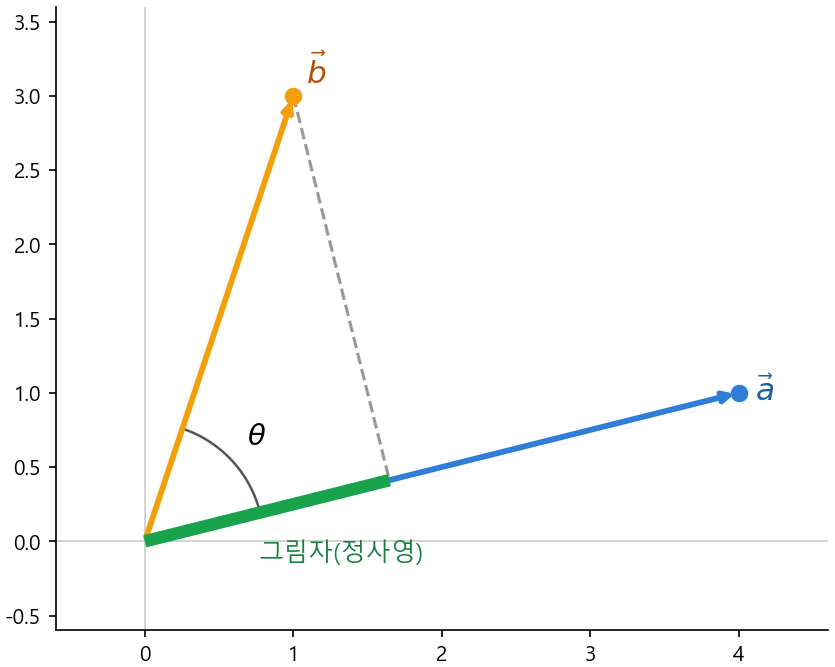

# Ch.11 · 손전등 그림자 : 벡터·내적·정사영·코사인 유사도 — v0.11

> 이번 강: (기하·선형대수 블록 완성) → 9강의 숫자 묶음과 10강의 방향이 만나는 곳
> 한 줄 요약: 화살표 둘을 **짝지어 곱해 더하면**(내적) 두 방향이 얼마나 같은지가 한 숫자로 나옵니다. 이게 AI가 "이 단어와 저 단어가 비슷한가"를 재는 자입니다.
> 핵심 개념: 벡터 · 내적 · 정사영 · 코사인 유사도

---

## 이야기 파트

### 두 화살표가 얼마나 닮았나

10강 끝에서 오픈이는 방향을 숫자로 적는 법을 손에 넣었습니다. 각도를 넣으면 가로·세로 좌표가 나오는 그림자 기계(cos·sin) 말이죠. 그런데 막상 AI가 단어를 다루는 걸 들여다보니, 단어 하나가 방향 하나로 표현되고 있었습니다. '왕'도 화살표, '여왕'도 화살표, '사과'도 화살표. 그리고 AI가 끊임없이 던지는 질문은 똑같았어요.

*이 두 화살표는 얼마나 닮았지?*

'왕'과 '여왕'은 비슷한 쪽을 가리켜야 하고, '왕'과 '사과'는 영 딴 데를 봐야 자연스럽습니다. 사람 눈에는 화살표 둘을 그려 놓으면 "어, 둘이 비슷한 방향이네" 하고 한눈에 보이죠. 그런데 컴퓨터에게는 그 '닮음'을 **숫자 하나**로 줘야 합니다. 두 화살표를 입에 넣으면 "이만큼 닮았어요"라는 점수가 툭 나오는 계산이 필요했어요.

오픈이는 9강의 믹서를 떠올렸습니다. 그때 행렬곱은 "한 줄과 입력을 **짝지어 곱한 뒤 더한다**"였죠. 숫자 묶음 둘을 짝지어 곱해 더하면 숫자 하나가 나온다 — 어쩌면 이 동작이 '닮음 점수'의 씨앗일지도 몰랐습니다. 다만 그게 정말 '방향이 얼마나 같은가'와 연결되는지는 아직 안갯속이었죠.

### 손전등을 비춰 보다

실마리는 밤에 손전등을 만지작거리다 나왔습니다.

화살표 두 개, $\vec a$ 와 $\vec b$ 가 한 점에서 뻗어 있다고 해봅시다. 오픈이는 $\vec a$ 방향과 **나란하게** 손전등을 들어 $\vec b$ 를 비췄습니다. 그러면 $\vec b$ 의 그림자가 $\vec a$ 위에 길게 드리워집니다. 이 **그림자의 길이**가 묘한 걸 알려줬어요.

- 두 화살표가 **같은 방향**일수록 → 그림자가 **길게** 집니다($\vec b$ 가 $\vec a$ 를 따라 쭉 눕는 셈).
- 두 화살표가 **직각**으로 벌어지면 → 그림자가 **한 점으로** 쪼그라듭니다(겹치는 방향이 없음).
- 두 화살표가 **반대 방향**이면 → 그림자가 **반대쪽으로** 집니다(음수 길이처럼).

바로 이거였습니다. "방향이 얼마나 같은가"가 **그림자의 길이**로 고스란히 드러난 거예요. 같은 쪽을 보면 길고, 직각이면 0, 반대면 음수. 이 그림자에 붙은 이름이 **정사영**이고, 그림자 길이를 화살표 $\vec a$ 의 길이와 엮어 만든 숫자가 바로 **내적**입니다.

*그림 11-1: $\vec a$ 방향으로 손전등을 비추면 $\vec b$ 의 그림자(초록, 정사영)가 $\vec a$ 위에 진다. 두 화살표가 같은 쪽을 볼수록 그림자가 길어진다.*

### 닮음을 0과 1 사이로

그림자 길이에는 한 가지 흠이 있었습니다. **화살표가 길면 그림자도 덩달아 길어진다**는 거예요. '왕'을 두 배로 늘린 화살표는 방향이 똑같은데도 그림자 점수가 두 배가 됩니다. 방향만 보고 싶은데 길이가 끼어든 거죠.

오픈이는 영리하게 이걸 걷어냈습니다. 그림자 점수(내적)를 **두 화살표의 길이로 나눠** 버린 겁니다. 그러면 길이 효과가 약분되고, 순수하게 **방향이 얼마나 같은가**만 남습니다. 그 결과로 나오는 숫자가 마침 10강에서 본 그 **cos**예요 — 두 화살표가 벌어진 각도의 코사인.

- 같은 방향이면 각도 0도 → cos = **1** (완전히 닮음)
- 직각이면 90도 → cos = **0** (무관)
- 반대 방향이면 180도 → cos = **−1** (정반대)

방향의 닮음이 깔끔하게 **−1에서 1 사이** 한 숫자로 접혔습니다. 이 자가 바로 **코사인 유사도**이고, AI가 '왕'과 '여왕'이 가깝고 '왕'과 '사과'가 멀다는 걸 재는 바로 그 도구입니다.

### 이것만은 기억하자

- **벡터는 방향과 길이를 가진 화살표**입니다. 9강에서 세로로 세운 숫자 묶음 $(a_1, a_2)$ 이 곧 벡터예요.
- **내적**은 두 벡터를 **짝지어 곱해 더한** 숫자입니다(9강 행렬곱의 그 동작). 이 숫자는 손전등 그림자(정사영)의 길이와 통합니다 — 같은 방향이면 크고, 직각이면 0, 반대면 음수.
- **코사인 유사도**는 내적을 두 벡터의 길이로 나눠 길이 효과를 없앤 것 — 순수하게 방향의 닮음을 **−1~1**로 잰 값이고, 곧 두 벡터 사이 각도의 **cos**입니다.
- 다음 강(12강·Part Ⅱ)부터는 '확률'로 무대가 바뀝니다. 그리고 이 내적은 한참 뒤 20강 **어텐션**에서 LLM의 심장으로 돌아옵니다.

---

## 기술 파트

### 용어 정리

이야기 속 비유를 진짜 수학 용어로 정리합니다. 앞으로는 이 이름들로 부릅니다.

| 이야기 속 비유 | 진짜 용어 | 정식 정의 |
|--------------|----------|----------|
| 방향과 길이를 가진 화살표 | 벡터(vector) | 숫자를 묶어 세운 것 $\vec a = (a_1, a_2)$ — 9강의 세로 숫자 묶음 |
| 화살표의 길이 | 크기(norm) $|\vec a|$ | $\sqrt{a_1^2 + a_2^2}$ — 2강 거리(피타고라스) |
| 짝지어 곱해 더한 닮음 점수 | 내적(dot product) $\vec a \cdot \vec b$ | $a_1 b_1 + a_2 b_2$ |
| 손전등으로 비춘 그림자 | 정사영(projection) | 한 벡터를 다른 벡터 위에 수직으로 내린 그림자 |
| 길이를 걷어낸 방향 닮음 | 코사인 유사도 | $\dfrac{\vec a \cdot \vec b}{|\vec a|\,|\vec b|}$ — 두 벡터 사이 각의 $\cos\theta$ |

### 수식 1 — 내적 : 짝지어 곱해 더하기

벡터는 9강에서 세로로 세운 숫자 묶음과 같은 것입니다. 다만 이제는 '화살표(방향+길이)'라는 그림으로 함께 봅니다. 평면 위의 두 벡터를 이렇게 적습니다.

$$\vec a = (a_1,\ a_2), \qquad \vec b = (b_1,\ b_2)$$

벡터의 **크기**(화살표 길이)는 원점에서 그 점까지의 거리이므로, 2강의 거리 공식 그대로입니다.

$$|\vec a| = \sqrt{a_1^2 + a_2^2}$$

두 벡터의 **내적**은 같은 자리끼리 곱해서 더한 숫자입니다 — 9강에서 행렬의 한 행과 입력을 짝지어 곱해 더하던 그 동작이 바로 내적이었어요.

$$\vec a \cdot \vec b = a_1 b_1 + a_2 b_2$$

**왜 이게 '방향의 닮음'인가 — 정사영.** 그림 11-1처럼 $\vec a$ 방향으로 손전등을 비추면 $\vec b$ 의 그림자(정사영)가 집니다. 두 벡터가 이루는 각을 $\theta$ 라 하면 그림자 길이는 $|\vec b|\cos\theta$ 입니다(직각삼각형에서 빗변 $|\vec b|$ 에 cos를 곱한 밑변 — 10강의 그림자 그대로). 내적은 이 그림자 길이에 $\vec a$ 의 길이를 곱한 값과 같습니다.

$$\vec a \cdot \vec b = |\vec a|\,\big(|\vec b|\cos\theta\big) = |\vec a|\,|\vec b|\cos\theta$$

성분으로 계산한 $a_1 b_1 + a_2 b_2$ 와 이 기하적인 $|\vec a||\vec b|\cos\theta$ 가 **같다**는 것은 코사인 법칙으로 증명되는데, 우리는 손전등 그림으로 그 뜻을 받아들이겠습니다. 중요한 건 결론입니다 — **내적 안에는 cos가, 즉 두 방향이 벌어진 각도가 숨어 있습니다.** 그래서 내적이 닮음을 재는 거예요.

### 계산 예제 1 : 내적과 크기 구하기

**문제.** $\vec a = (3, 4)$, $\vec b = (4, 3)$ 의 내적 $\vec a \cdot \vec b$ 와 각 벡터의 크기를 구하세요.

**1단계 — 내적: 같은 자리끼리 곱해 더한다.**

$$\vec a \cdot \vec b = 3\times 4 + 4\times 3 = 12 + 12 = 24$$

**2단계 — 크기: 거리 공식(피타고라스).**

$$|\vec a| = \sqrt{3^2 + 4^2} = \sqrt{9 + 16} = \sqrt{25} = 5$$
$$|\vec b| = \sqrt{4^2 + 3^2} = \sqrt{16 + 9} = \sqrt{25} = 5$$

**답.** 내적은 24, 두 화살표의 길이는 각각 5입니다. 내적이 양수라는 건 두 화살표가 대체로 같은 쪽을 본다는 신호예요. 다음 예제에서 이걸 0~1 사이 점수로 다듬습니다.

### 계산 예제 2 : 코사인 유사도로 닮음 재기

내적은 길이에 휘둘립니다. 길이를 걷어내고 방향만 보려면 **두 벡터의 길이로 나눕니다.** 그 값이 코사인 유사도예요.

$$\cos\theta = \frac{\vec a \cdot \vec b}{|\vec a|\,|\vec b|}$$

**문제.** 예제 1의 $\vec a = (3,4)$ 에 대해, $\vec b = (4,3)$ 과 $\vec c = (-4, 3)$ 중 어느 쪽이 $\vec a$ 와 더 닮은 방향인지 코사인 유사도로 판정하세요.

**1단계 — $\vec a$ 와 $\vec b$.** 예제 1에서 $\vec a\cdot\vec b = 24$, $|\vec a| = |\vec b| = 5$ 였으니:

$$\cos\theta = \frac{24}{5\times 5} = \frac{24}{25} = 0.96$$

1에 아주 가깝습니다 → **거의 같은 방향**(매우 닮음).

**2단계 — $\vec a$ 와 $\vec c=(-4,3)$.** 먼저 내적과 크기:

$$\vec a\cdot\vec c = 3\times(-4) + 4\times 3 = -12 + 12 = 0, \qquad |\vec c| = \sqrt{(-4)^2 + 3^2} = \sqrt{25} = 5$$

$$\cos\theta = \frac{0}{5\times 5} = 0$$

정확히 0 → **두 화살표가 직각**, 방향이 전혀 안 겹칩니다(무관).

**답.** $\vec b$ 의 유사도 0.96 vs $\vec c$ 의 유사도 0 → **$\vec b$ 가 $\vec a$ 와 훨씬 닮았습니다.** 내적이 0이면 코사인 유사도도 0, 즉 "서로 직각이라 관련 없음"이라는 점도 기억해 두세요 — AI에서 자주 나오는 신호입니다.

### 연습문제

> 해답은 부록에 모았습니다. 손으로 먼저 풀어 보세요.

**1.** $\vec a = (1, 2)$, $\vec b = (3, 1)$ 의 내적 $\vec a \cdot \vec b$ 를 구하세요.

**2.** $\vec a = (6, 8)$ 의 크기 $|\vec a|$ 를 구하세요.

**3.** $\vec a = (1, 0)$ 과 $\vec b = (0, 5)$ 의 코사인 유사도를 구하고, 두 벡터의 방향 관계를 한 줄로 설명하세요.

**4.** 두 벡터의 내적이 음수로 나왔습니다. 두 화살표의 방향에 대해 무엇을 알 수 있나요? (코사인 유사도의 부호를 생각해 보세요.)

### 이게 AI 어디에 쓰이나

AI는 단어·문장·이미지를 **벡터**(숫자 묶음, 화살표)로 바꿔 다룹니다. 이걸 임베딩이라 불러요. 그러면 "두 단어가 의미상 비슷한가?"라는 막연한 질문이 "두 벡터의 **코사인 유사도가 1에 가까운가?**"라는 또렷한 계산으로 바뀝니다. 검색이 질문과 가장 닮은 문서를 찾는 것도, 추천이 내 취향과 가까운 항목을 고르는 것도 전부 이 내적·코사인 유사도예요.

그리고 이 내적은 Part Ⅱ 끝의 20강 **어텐션**에서 다시, 가장 화려하게 등장합니다. 문장 속 단어들이 서로를 "얼마나 봐야 하는지"를 정할 때, 모델은 단어 벡터끼리 내적을 때려 닮음 점수를 매기고 그걸로 서로에게 가중치를 줍니다. 트랜스포머의 심장이 바로 이 강에서 배운 "짝지어 곱해 더하기" 한 줄인 셈입니다. 9강의 행렬, 10강의 방향, 11강의 내적 — 기하·선형대수 블록이 여기서 하나로 모여 LLM의 문을 엽니다.
