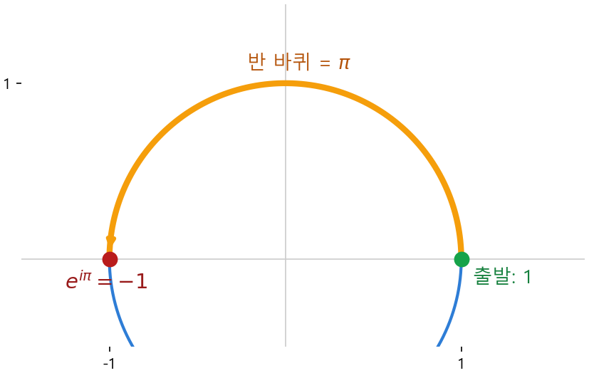

# 칼럼 ① · 다섯 거물의 단체 사진 : 오일러 항등식

> 쉬어가는 페이지입니다. 풀 문제도, 외울 공식도 없습니다. 지금까지 만난 수들이 한 줄에서 만나는 광경을 구경만 하세요.

Part Ⅰ을 여기까지 달려온 당신에게 잠깐의 휴식을 권합니다. 새 개념을 배우는 게 아니라, **이미 만난 친구들**이 한자리에 모이는 단체 사진을 찍을 거예요.

### 다섯 명의 거물

수학에는 유난히 자주, 유난히 중요하게 등장하는 다섯 개의 수가 있습니다. 당신은 이미 다섯을 다 만났어요.

- **0** — 아무것도 없음. 모든 셈의 출발점.
- **1** — 하나. 모든 곱셈의 기준점(1강·2강에서 줄곧).
- **$e$** — 자기 자신을 미분해도 그대로인 그 신기한 수(6강). 자연의 성장률.
- **$\pi$** — 원과 회전의 수. 10강에서 단위원을 한 바퀴 돌 때 그 둘레에 숨어 있었죠.
- **$i$** — 제곱하면 $-1$이 되는, 평면을 회전시키는 수(10강).

출신이 제각각입니다. 0과 1은 산수에서, $e$ 는 미분에서, $\pi$ 는 도형에서, $i$ 는 복소수에서 왔어요. 사는 동네가 전혀 다른 다섯입니다. 그런데 이 다섯이 **단 하나의 식**에, 그것도 한 번씩만 등장하며 딱 맞아떨어지는 자리가 있습니다.

$$e^{i\pi} + 1 = 0$$

이 한 줄이 **오일러 항등식**입니다. 더할 것도 뺄 것도 없이, 다섯 거물이 어깨를 나란히 하고 0으로 수렴하죠. 많은 수학자가 "세상에서 가장 아름다운 식"으로 꼽는 이유예요. 처음 보면 "이게 왜 성립하지?" 싶을 텐데, 놀랍게도 당신은 이미 그 답의 재료를 다 갖고 있습니다.

### 회전 곱셈기를 다시 꺼내자

10강에서 우리는 회전을 곱셈으로 바꿨습니다. 어떤 점에 $\cos\theta + i\sin\theta$ 를 곱하면 그 점이 **θ만큼 회전**한다고 했죠. 이 "회전 곱셈기"가 이야기의 주인공입니다.

오일러가 발견한 건 이거예요. 이 회전 곱셈기가, 사실은 **$e$ 의 거듭제곱**으로 쓰인다는 것.

$$e^{i\theta} = \cos\theta + i\sin\theta$$

왼쪽은 6강의 그 $e$, 오른쪽은 10강의 회전 곱셈기. 둘이 같은 거였습니다. *왜 하필 $e$ 냐*고요? 짧은 직관만 흘리자면 — 원 위를 도는 점은 "지금 위치에 수직인 방향으로 끊임없이 꺾이며" 나아갑니다. '현재 상태에 비례해 변한다'는 이 성질이 바로 6강에서 $e$ 가 "자기 자신을 미분해도 그대로"였던 그 성질과 같은 뿌리예요. 그래서 회전에 $e$ 가 튀어나옵니다. 그 깊은 증명은 이 책의 범위를 넘으니, 여기서는 결과의 우아함만 맛봅니다.

### 반 바퀴만 돌려 보면

이제 $\theta$ 자리에 특별한 각을 하나 넣어 봅니다. 회전의 세계에서는 각을 **라디안**으로도 재는데, **반 바퀴(180도)가 정확히 $\pi$** 입니다(한 바퀴는 $2\pi$). 원의 수 $\pi$ 가 여기서 "반 바퀴 회전량"으로 들어오는 거죠.

$e^{i\theta}$ 는 "1에서 출발해 $\theta$ 만큼 회전한 자리"를 뜻합니다($\theta=0$ 이면 회전 안 함, 즉 출발점 1). 그러니 $\theta = \pi$ 를 넣는다는 건 **출발점 1에서 반 바퀴를 돌린다**는 말입니다. 단위원 위에서 1(오른쪽 끝)에서 반 바퀴를 돌면 어디에 닿을까요? 정반대편, **$-1$**(왼쪽 끝)입니다.

*그림: $e^{i\pi}$ 는 "1에서 반 바퀴($\pi$) 회전"이다. 단위원 위에서 1로부터 반 바퀴를 돌면 정확히 $-1$ 에 닿는다.*

식으로 쓰면 이렇게 됩니다.

$$e^{i\pi} = -1$$

양변에 1을 더하면:

$$e^{i\pi} + 1 = 0$$

방금 본 "반 바퀴 돌면 $-1$"이라는 한 장면이, 다섯 거물이 모인 그 유명한 식이었던 겁니다. 어려운 계산이 아니라 **10강의 회전을 한 번 돌린 것**뿐이에요.

### 잠깐의 음미

이 식이 아름다운 건 단지 예뻐서가 아닙니다. 서로 무관해 보이던 분야들 — 산수(0, 1), 미분(e), 기하(π), 복소수(i) — 이 실은 **하나로 이어져 있다**는 증거이기 때문이에요. 우리가 Part Ⅰ에서 강을 하나씩 건너며 따로 배운 도구들이, 사실은 한 그림의 다른 조각이었던 거죠.

그리고 이 "회전을 $e$ 의 지수로 적는다"는 발상은 단순한 미학이 아닙니다. 한참 뒤 20강에서, 트랜스포머가 문장 속 단어의 **순서**를 표시할 때 바로 이 $e^{i\theta}$ 식 회전을 씁니다(위치 인코딩). 오늘 구경한 단체 사진이, 거기서 다시 일하러 나오는 셈이에요.

자, 숨을 한 번 고르셨다면 — 이제 Part Ⅱ로 넘어갈 차례입니다. 지금까지 '수와 도형'을 다뤘다면, 다음 무대는 **'불확실성'**, 즉 확률과 통계입니다. 12강에서 종 모양 곡선 하나를 들고 다시 만나요.
