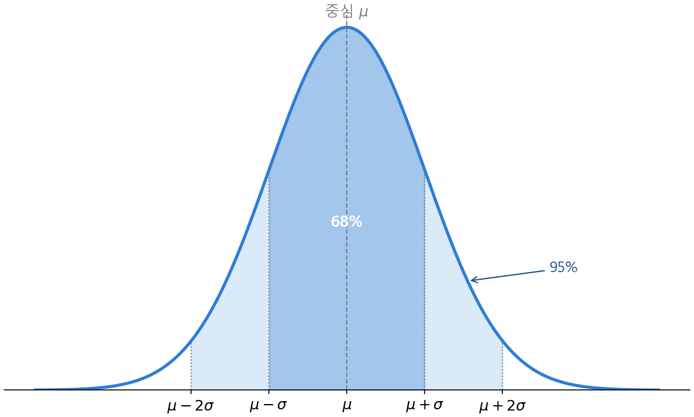
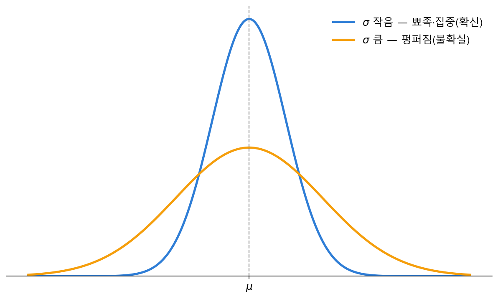

# Ch.12 · 종 모양의 뜻 : 확률·정규분포 — v0.12

> 이번 강: (Part Ⅱ 시작) → 기하·선형대수 블록을 닫고, '확률'로 무대를 옮긴다
> 한 줄 요약: 세상은 딱 떨어지지 않습니다. AI는 "아마 이쪽"이라는 **확률**로 답하고, 그 확률이 모이면 가운데가 봉긋한 **종 모양**(정규분포)이 됩니다. 이 종의 중심과 너비만 알면 "어디쯤일지"를 숫자로 잴 수 있어요.
> 핵심 개념: 확률 · 확률분포 · 정규분포 · 중심 μ · 퍼짐 σ · 68-95-99.7

---

## 이야기 파트

### "아마"라고 답하는 기계

11강까지 오픈이는 화살표와 행렬로 단어를 다루는 법을 손에 넣었습니다. 그런데 막상 AI가 문장을 만들어내는 장면을 들여다보니, 이상한 점이 하나 있었어요. 모델은 다음에 올 단어를 **딱 하나로** 정하지 않았습니다.

"오늘 날씨가 참 ___" 다음에 무엇이 올까요? 모델의 대답은 이랬습니다.

- '좋다' → 62%
- '맑다' → 21%
- '춥다' → 9%
- '이상하다' → 3%
- …

하나의 정답이 아니라 **여러 후보에 점수가 쫙 퍼져 있던** 겁니다. 그리고 그 점수들을 다 더하면 정확히 1(=100%)이 됐어요. 오픈이는 깨달았습니다. AI는 세상을 "맞다/틀리다"로 보지 않고, "이건 이만큼 그럴듯하다"는 **믿음의 크기**로 본다는 걸요. 이 믿음의 크기에 붙은 이름이 바로 **확률**입니다.

생각해 보면 당연합니다. 내일 비가 올지 안 올지, 이 사진이 고양이일지 강아지일지 — 세상의 거의 모든 일은 딱 잘라 말할 수 없으니까요. 확실하지 않은 세상을 다루려면, 확실하지 않음 그 자체를 숫자로 적는 도구가 필요합니다. 그게 이번 강의 주제예요.

### 0과 1 사이의 자

확률은 어렵지 않습니다. **절대 안 일어남을 0, 반드시 일어남을 1**로 놓고, 그 사이 어디쯤인지를 적는 자입니다.

- 동전에서 앞면이 나올 확률 → 0.5 (반반)
- 주사위에서 짝수가 나올 확률 → 6면 중 3면이니 0.5
- 해가 서쪽에서 뜰 확률 → 0 (절대 안 일어남)

규칙은 단 두 개예요. 첫째, 모든 확률은 **0과 1 사이**입니다. 둘째, 일어날 수 있는 일들의 확률을 **다 더하면 정확히 1**이 됩니다(무언가는 반드시 일어나니까). 아까 모델이 뱉은 62% + 21% + 9% + 3% + … 가 1이 됐던 게 바로 이 규칙이었어요.

### 수많은 것을 쌓으면 종이 된다

여기서 한 가지 신기한 일이 벌어집니다.

어느 학교 학생 1000명의 키를 재서, 키별로 사람 수를 막대로 쌓아 봅시다. 아주 작은 사람도 몇 명, 아주 큰 사람도 몇 명 있겠지만, **대부분은 가운데(평균 근처)에 몰려** 있을 거예요. 그 결과 막대들은 가운데가 가장 높고 양옆으로 갈수록 낮아지는, **봉긋한 종(鐘) 모양**을 그립니다.

놀라운 건 이게 키만 그런 게 아니라는 점입니다. 시험 점수, 몸무게, 측정 오차, 공장에서 찍어낸 부품의 길이 — 자연에서 "수많은 작은 것이 모여 생긴 양"은 약속이나 한 듯 이 종 모양을 그립니다. 그래서 이 모양에는 특별한 이름이 붙었어요. **정규분포**(normal distribution), 또는 발견자의 이름을 따 **가우스 분포**라고도 부릅니다. 자연이 가장 즐겨 쓰는 모양인 셈이죠.

*그림 12-1: 정규분포는 중심 μ가 가장 높은 종 모양. 중심에서 ±1칸(σ) 안에 68%, ±2칸 안에 95%가 들어온다.*

종 모양을 정하는 건 딱 두 가지입니다. **종이 어디에 서 있나(중심)** 와 **종이 얼마나 퍼져 있나(너비)**. 키 분포라면 중심은 "평균 키"이고, 너비는 "사람들이 평균에서 얼마나 흩어져 있나"예요. 수학에서는 이 중심을 그리스 문자 **μ**(뮤), 퍼진 너비를 **σ**(시그마)라고 적습니다. 이 두 글자가 종의 위치와 폭을 완전히 결정합니다.

> μ와 σ를 **실제 데이터에서 어떻게 계산해 뽑아내는지**(평균과 표준편차의 정식 공식)는 바로 다음 13강에서 직접 손으로 구합니다. 이번 강에서는 "중심 μ, 너비 σ가 주어졌다"고 보고, 그 종이 무엇을 말해 주는지에 집중할게요.

### 68-95-99.7 : 종이 알려주는 약속

종 모양에는 누구에게나 통하는 약속이 하나 숨어 있습니다. 중심 μ에서 양옆으로 σ만큼씩 걸어 나가며 세어 보면, **들어오는 비율이 늘 똑같이 정해져** 있어요.

- 중심에서 **±1칸(σ)** 안 → 전체의 약 **68%**
- 중심에서 **±2칸(2σ)** 안 → 약 **95%**
- 중심에서 **±3칸(3σ)** 안 → 약 **99.7%**

이게 그 유명한 **68-95-99.7 규칙**입니다(그림 12-1의 색칠된 영역). 키 분포에서 평균이 170cm, 한 칸(σ)이 10cm라면 — 사람들의 68%는 160~180cm 안에 있고, 95%는 150~190cm 안에 있다는 뜻이에요. 종의 중심과 너비, 딱 두 숫자만 알면 "어디쯤에 얼마나 모여 있는지"가 술술 나옵니다. 잠시 뒤 기술 파트에서 이 약속으로 실제 확률을 직접 계산해 봅니다.

### 이것만은 기억하자

- **확률**은 "이게 얼마나 그럴듯한가"를 **0(절대 안 됨)과 1(반드시 됨) 사이**로 적은 자입니다. 일어날 수 있는 일들의 확률을 다 더하면 1이에요.
- 자연에서 수많은 것을 모으면 가운데가 봉긋한 **정규분포(종 모양)**가 됩니다. 이 종은 **중심 μ**와 **퍼진 너비 σ**, 두 숫자로 완전히 정해집니다.
- **68-95-99.7 규칙**: 중심에서 ±1σ 안에 68%, ±2σ 안에 95%, ±3σ 안에 99.7%가 들어옵니다.
- 다음 강(13강)에서는 이 **μ와 σ를 데이터에서 직접 계산하는 법**(평균·분산·표준편차)을 손으로 구합니다. 종의 모양을 봤으니, 이제 그 모양을 만드는 숫자를 뽑을 차례예요.

---

## 기술 파트

### 용어 정리

이야기 속 비유를 진짜 수학 용어로 정리합니다.

| 이야기 속 비유 | 진짜 용어 | 정식 정의 |
|--------------|----------|----------|
| 얼마나 그럴듯한가 (0~1) | 확률(probability) $P(A)$ | 사건 $A$가 일어날 가능성, $0 \le P(A) \le 1$ |
| 후보마다 매긴 점수, 다 더하면 1 | 확률분포(probability distribution) | 모든 경우에 확률을 배정한 것, 전체 합(또는 넓이) = 1 |
| 봉긋한 종 모양 | 정규분포(normal distribution) | 중심 $\mu$, 너비 $\sigma$로 정해지는 종 모양 분포 |
| 종이 선 자리 (중심) | 평균 $\mu$ (뮤) | 분포의 중심 위치 (계산법은 13강) |
| 종이 퍼진 폭 (너비) | 표준편차 $\sigma$ (시그마) | 중심에서 흩어진 정도 (계산법은 13강) |

### 수식 1 — 확률 : 0과 1 사이, 다 더하면 1

확률은 두 가지 규칙으로 요약됩니다. 첫째, 어떤 사건 $A$의 확률은 0과 1 사이입니다.

$$0 \le P(A) \le 1$$

0이면 절대 안 일어나고, 1이면 반드시 일어나며, 0.5면 반반입니다. 둘째, 일어날 수 있는 **모든** 경우 $A_1, A_2, \dots, A_n$ 의 확률을 다 더하면 1입니다(무언가는 반드시 일어나니까).

$$P(A_1) + P(A_2) + \cdots + P(A_n) = 1$$

경우의 수가 똑같이 그럴듯할 때(주사위·동전 같은 경우), 확률은 간단히 **'원하는 경우의 수 ÷ 전체 경우의 수'** 입니다.

$$P(A) = \frac{\text{원하는 경우의 수}}{\text{전체 경우의 수}}$$

예를 들어 주사위에서 짝수(2, 4, 6)가 나올 확률은, 전체 6면 중 짝수가 3면이므로

$$P(\text{짝수}) = \frac{3}{6} = \frac{1}{2} = 0.5$$

입니다. 그런데 키처럼 값이 **뚝뚝 끊기지 않고 매끄럽게 이어지는**(연속) 경우에는 "경우의 수"를 셀 수 없습니다. 이때는 막대 대신 **곡선 아래의 넓이**가 확률이 됩니다. 곡선 전체 아래 넓이를 1로 맞춰 두고, "키가 160~180cm일 확률"은 그 구간 위 곡선 아래의 넓이로 읽는 거예요. 정규분포가 바로 이 매끄러운 곡선입니다.

### 수식 2 — 정규분포 : 종 모양의 식

종 모양 곡선의 높이를 주는 식은 이렇게 생겼습니다. 처음 보면 복잡해 보이지만, 조각조각 뜯어보면 전부 우리가 아는 것들이에요.

$$f(x) = \frac{1}{\sigma\sqrt{2\pi}}\, e^{-\frac{(x-\mu)^2}{2\sigma^2}}$$

겁먹을 필요 없습니다. 핵심은 오른쪽의 $e^{-(\dots)^2}$ 한 덩어리예요. 6강에서 배운 자연상수 $e$의 지수에, **마이너스를 붙인 제곱**이 들어 있습니다. 이 한 조각이 종 모양을 통째로 만듭니다. 하나씩 읽어 봅시다.

- $(x-\mu)^2$ — 중심 $\mu$ 에서 **얼마나 떨어졌나**를 제곱한 값. 중심에서는 0이고, 멀어질수록 커집니다.
- $e^{-(\text{떨어진 정도})}$ — 떨어질수록 지수가 점점 더 **큰 음수**가 되니, $e$의 값은 빠르게 **0을 향해** 줄어듭니다. 그래서 중심에서 가장 높고 양옆으로 갈수록 낮아지는 종이 됩니다. (중심 $x=\mu$ 에서는 $e^0 = 1$ 로 가장 높아요.)
- $\sigma$ (분모의 $2\sigma^2$) — 떨어진 정도를 **얼마로 나눌지**를 정합니다. $\sigma$ 가 크면 같은 거리도 작게 취급돼 종이 옆으로 넓게 퍼지고, $\sigma$ 가 작으면 종이 가운데로 뾰족하게 모입니다.
- 맨 앞의 $\dfrac{1}{\sigma\sqrt{2\pi}}$ — 곡선 **전체 아래 넓이를 정확히 1로** 맞춰 주는 상수입니다(확률의 둘째 규칙). 이 값이 왜 하필 이렇게 생겼는지는 이 책의 범위를 넘습니다 — 우리는 이 식을 **읽을 줄 알고**, 그 모양이 뜻하는 바를 **쓸 줄 알면** 됩니다.

정리하면, 정규분포 곡선은 **중심 μ가 위치를, 너비 σ가 폭을** 정하는 종입니다. 그림 12-2처럼 σ만 바꿔도 종의 인상이 완전히 달라져요.

*그림 12-2: 중심 μ는 같아도 너비 σ가 작으면 뾰족하게 모이고(확신이 큼), 크면 옆으로 퍼진다(불확실함). 두 곡선 아래 넓이는 똑같이 1이다.*

### 계산 예제 : 68-95-99.7로 확률 재기

종 모양에는 앞서 본 약속이 있습니다 — 중심에서 ±1σ 안에 약 68%, ±2σ 안에 약 95%, ±3σ 안에 약 99.7%. (이 비율은 곡선 아래 넓이를 적분해 나오는 값인데, 우리는 결과를 받아 씁니다.) 이 약속만으로 실제 확률 문제를 풀 수 있어요.

**문제.** 어느 나라 성인 남성의 키가 정규분포를 따르고, 중심(평균) $\mu = 170$ cm, 너비 $\sigma = 10$ cm 라고 합시다.
(1) 키가 160~180cm일 확률, (2) 150~190cm일 확률, (3) 180cm보다 클 확률을 구하세요.

**1단계 — 구간을 'μ에서 몇 칸(σ)'으로 바꾼다.**

$$160 = 170 - 10 = \mu - \sigma, \qquad 180 = 170 + 10 = \mu + \sigma$$

즉 160~180cm는 정확히 **중심 ±1σ 구간**입니다.

**2단계 — (1) ±1σ 규칙을 적용한다.**

$$P(160 \le \text{키} \le 180) = P(\mu-\sigma \le x \le \mu+\sigma) \approx 68\%$$

**3단계 — (2) 150~190은 ±2σ 구간이다.**

$$150 = \mu - 2\sigma, \quad 190 = \mu + 2\sigma \;\Rightarrow\; P(150 \le \text{키} \le 190) \approx 95\%$$

**4단계 — (3) '180보다 클 확률'은 남은 꼬리를 반으로 나눈다.**

180cm는 $\mu+\sigma$ 입니다. ±1σ 안이 68%이니, **바깥쪽 양 꼬리**가 합쳐서 $100\% - 68\% = 32\%$. 종 모양은 중심을 기준으로 **좌우 대칭**이라, 이 32%가 양쪽에 똑같이 나뉩니다. 따라서 오른쪽 꼬리(180 초과) 하나는

$$P(\text{키} > 180) = \frac{32\%}{2} = 16\%$$

**답.** (1) 약 68%, (2) 약 95%, (3) 약 16%. 평균과 너비, 단 두 숫자에서 "어디쯤일 가능성이 얼마인지"가 전부 나왔습니다. 이게 정규분포가 **불확실성을 다루는 힘**이에요.

### 연습문제

> 해답은 부록에 모았습니다. 손으로 먼저 풀어 보세요.

**1.** 주사위 한 번을 던질 때, 3보다 큰 눈(4, 5, 6)이 나올 확률을 구하세요.

**2.** 어떤 분포에서 세 사건의 확률이 각각 $P(A)=0.5$, $P(B)=0.2$, $P(C)=?$ 이고 이 셋이 전부라면, $P(C)$ 는 얼마인가요?

**3.** 시험 점수가 정규분포를 따르고 평균 $\mu=60$점, 표준편차 $\sigma=15$점입니다. 점수가 45~75점 사이일 확률을 68-95-99.7 규칙으로 구하세요.

**4.** 같은 시험(μ=60, σ=15)에서 90점보다 높은 점수를 받을 확률은 대략 얼마인가요? (90은 μ에서 몇 σ 떨어져 있는지 먼저 따져 보세요.)

### 이게 AI 어디에 쓰이나

확률과 정규분포는 Part Ⅱ 전체를 떠받치는 토대입니다.

첫째, **언어 모델은 확률분포로 말합니다.** 이야기 앞머리에서 본 "'좋다' 62%, '맑다' 21%…"가 바로 다음 단어에 대한 확률분포예요. 모델은 매 순간 가능한 모든 단어에 확률을 매기고(다 더하면 1), 그중에서 다음 단어를 고릅니다. 17강에서 배울 **softmax**가 바로 이 "점수들을 다 더하면 1이 되는 확률"로 바꿔 주는 장치입니다.

둘째, **정규분포는 신경망의 출발점에서 쓰입니다.** 16강 이후 신경망의 수많은 가중치는 학습을 시작하기 전 보통 정규분포에서 무작위로 뽑아 채웁니다. 중심 0, 적당한 너비 σ의 종에서 값을 꺼내 초기값으로 삼는 거예요.

셋째, **종의 너비 σ는 곧 '확신의 정도'입니다.** 그림 12-2에서 봤듯, σ가 작은 뾰족한 종은 "거의 확실하다", σ가 큰 펑퍼짐한 종은 "잘 모르겠다"를 뜻합니다. AI가 자기 예측에 얼마나 자신 있는지를 이 너비로 표현해요.

그리고 다음 13강에서, 지금까지 "주어졌다"고만 했던 **중심 μ와 너비 σ를 실제 데이터에서 직접 계산하는 법**을 배웁니다. 종의 생김새를 봤으니, 이제 그 종을 만드는 숫자를 손으로 뽑을 차례입니다.
