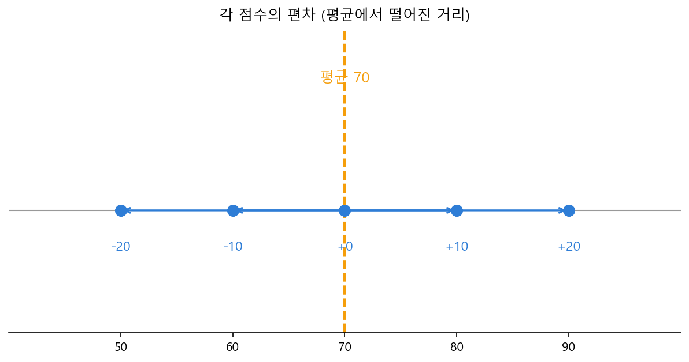

# Ch.13 · 흩어진 정도 : 평균·분산·표준편차·자유도 — v0.13

> 이번 강: 12강에서 "주어졌다"고만 했던 종의 중심 μ와 너비 σ를, 이제 **데이터에서 직접 손으로** 뽑아낸다
> 한 줄 요약: 숫자 더미의 **중심**은 평균으로, **흩어진 정도**는 "평균에서 떨어진 거리를 제곱해 평균낸 것"(분산)과 그 제곱근(표준편차)으로 잽니다. 이 두 숫자가 12강의 종을 완성합니다.
> 핵심 개념: 평균 $\bar x$ · 편차 · 분산 · 표준편차 · 자유도 (n−1)

---

## 이야기 파트

### 종을 만드는 두 숫자를 직접 구하자

12강에서 우리는 종 모양(정규분포)이 **중심 μ**와 **너비 σ**, 딱 두 숫자로 정해진다는 걸 봤습니다. 그런데 그때는 "μ=170, σ=10이라고 하자"처럼 **누가 값을 쥐여 준** 셈이었어요. 현실에서는 그렇지 않습니다. 우리 손에 들린 건 그냥 숫자 더미 — 학생 다섯 명의 시험 점수, 측정값 한 무더기뿐이죠. 이 더미에서 중심과 너비를 **우리가 직접 계산해** 뽑아내야 합니다.

이번 강이 바로 그 일을 합니다. 종의 중심을 구하는 게 **평균**, 종의 너비를 구하는 게 **표준편차**예요.

### 중심은 쉽다 : 평균

중심부터. 점수 다섯 개 50, 60, 70, 80, 90이 있다면, 한가운데가 어디일까요? 다 더해서 개수로 나누면 됩니다.

$$\frac{50+60+70+80+90}{5} = \frac{350}{5} = 70$$

이게 **평균**입니다. 누구나 아는 그 평균이에요. 종의 중심 μ는 바로 이 평균으로 구합니다. 여기까지는 막힐 게 없죠.

### 흩어진 정도는 까다롭다

진짜 문제는 **너비**입니다. "이 점수들이 평균에서 얼마나 흩어져 있나?"를 한 숫자로 적고 싶어요.

가장 자연스러운 생각은 "각 점수가 평균(70)에서 얼마나 떨어졌나"를 재서 평균내는 겁니다. 떨어진 거리를 **편차**라고 불러요. 50은 −20, 60은 −10, 70은 0, 80은 +10, 90은 +20만큼 떨어졌습니다. 그런데 이걸 그냥 다 더하면…

$$(-20) + (-10) + 0 + 10 + 20 = 0$$

**0이 나옵니다.** 위로 떨어진 것과 아래로 떨어진 것이 정확히 상쇄돼 버려요. 사실 이건 우연이 아닙니다. 평균이라는 게 원래 "위아래 편차가 딱 맞아떨어지는 지점"이라서, 편차의 합은 **항상** 0이 됩니다. 이대로는 흩어진 정도를 못 재요.

어디서 본 막힘이죠? 12강에서 편차를 그냥 두면 부호가 상쇄되던 것, 11강에서 화살표 길이를 잴 때 음수를 없애려 제곱했던 것 — 답은 늘 같습니다. **제곱하면 됩니다.** 부호를 없애려고 편차를 제곱하는 거예요.

$$(-20)^2 + (-10)^2 + 0^2 + 10^2 + 20^2 = 400 + 100 + 0 + 100 + 400 = 1000$$

이 제곱한 편차들을 평균낸 것이 **분산**이고, 분산에 제곱근을 씌워 원래 단위(점수)로 되돌린 것이 **표준편차** σ입니다. 표준편차가 바로 12강 종의 너비예요. 흩어짐이 클수록 종이 펑퍼짐해지고, 작을수록 뾰족해집니다.

*그림 13-1: 각 점수가 평균(70)에서 떨어진 거리(편차). 위아래 편차를 그냥 더하면 0이 되므로, 제곱해서 흩어짐을 잰다.*

### 한 가지 미묘함 : n으로 나눌까, n−1로 나눌까

제곱한 편차의 합 1000을 평균낼 때, 보통이라면 개수 5로 나눕니다. 그런데 통계에는 묘한 관습이 하나 있어요. 우리가 가진 다섯 개가 **세상 전부**가 아니라 더 큰 무리에서 **일부 뽑아 온 표본**일 때는, 5가 아니라 **n−1 = 4**로 나눕니다.

왜 하나를 빼고 나눌까요? 직관은 이렇습니다. 편차를 잴 때 우리는 **표본의 평균**을 기준으로 썼는데, 그 평균 자체가 이미 이 표본에서 뽑아낸 값이에요. 그래서 편차들이 완전히 자유롭지 않습니다 — 앞서 봤듯 다섯 편차의 합이 0이라, 넷만 정하면 마지막 하나는 자동으로 따라옵니다. **자유롭게 움직일 수 있는 편차가 5개가 아니라 4개**인 셈이죠. 이 "진짜 자유로운 개수"를 **자유도**라 하고, 그래서 n−1로 나눕니다. 이렇게 안 하면 흩어짐을 살짝 **과소평가**하게 되거든요. 자세한 건 기술 파트에서 두 경우를 나란히 계산해 봅니다.

### 이것만은 기억하자

- **평균** $\bar x$ 는 다 더해 개수로 나눈 중심입니다. 12강 종의 중심 μ가 이것.
- 흩어짐은 **편차(평균에서 떨어진 거리)를 제곱해 평균낸 분산**, 그리고 그 **제곱근인 표준편차** σ로 잽니다. σ가 12강 종의 너비예요. 제곱하는 이유는 편차의 부호가 상쇄되는 걸 막기 위해서.
- 표본으로 전체를 **추정**할 때는 개수 n이 아니라 **자유도 n−1**로 나눕니다(편차 하나는 평균에 묶여 자유롭지 않으므로).
- 다음 강(14강)에서는 변수 **하나**가 아니라 **둘**을 봅니다 — 키와 몸무게처럼 두 양이 "함께 움직이는지"를 재는 공분산·상관으로요.

---

## 기술 파트

### 용어 정리

| 이야기 속 비유 | 진짜 용어 | 정식 정의 |
|--------------|----------|----------|
| 다 더해 개수로 나눈 중심 | 평균(mean) $\bar x$ | $\frac{1}{n}\sum_{i=1}^{n} x_i$ |
| 평균에서 떨어진 거리 | 편차(deviation) | $x_i - \bar x$ |
| 제곱한 편차의 평균 | 분산(variance) $\sigma^2,\ s^2$ | $\frac{1}{n}\sum (x_i-\bar x)^2$ (전체) / $\frac{1}{n-1}\sum$ (표본) |
| 분산의 제곱근 (종의 너비) | 표준편차(standard deviation) $\sigma,\ s$ | $\sqrt{\text{분산}}$ |
| 진짜 자유로운 편차의 개수 | 자유도(degrees of freedom) | $n-1$ (표본에서) |

### 수식 1 — 평균 : 중심을 구한다

$n$ 개의 숫자 $x_1, x_2, \dots, x_n$ 의 평균은 모두 더해 개수로 나눈 것입니다.

$$\bar{x} = \frac{1}{n}\sum_{i=1}^{n} x_i = \frac{x_1 + x_2 + \cdots + x_n}{n}$$

여기서 $\sum$(시그마)는 "다 더하라"는 기호예요 — $\sum_{i=1}^{n} x_i$ 는 $x_1$ 부터 $x_n$ 까지 전부 더하라는 뜻입니다. 말로 다시 읽으면 "평균은 합을 개수로 나눈 값"이고, 이게 12강 종의 중심 μ를 데이터에서 구하는 법입니다.

### 수식 2 — 분산과 표준편차 : 흩어짐을 구한다

흩어진 정도는 편차 $x_i - \bar x$ 를 제곱해 평균낸 **분산**으로 잽니다.

$$\sigma^2 = \frac{1}{n}\sum_{i=1}^{n} (x_i - \bar{x})^2$$

제곱하는 이유는 두 가지예요. 첫째, 편차의 부호(+/−)를 없애 상쇄를 막습니다. 둘째, 큰 편차에 더 큰 벌점을 줍니다(2배 떨어지면 4배). 분산은 단위가 "점수의 제곱"이라 감이 안 오니, 제곱근을 씌워 원래 단위로 되돌린 **표준편차** σ를 너비로 씁니다.

$$\sigma = \sqrt{\sigma^2} = \sqrt{\frac{1}{n}\sum_{i=1}^{n} (x_i - \bar{x})^2}$$

**표본일 때는 n−1.** 가진 데이터가 전체가 아니라 표본이면, 분모를 $n$ 대신 자유도 $n-1$ 로 바꿉니다. 기준으로 쓴 평균 $\bar x$ 가 표본에서 나온 값이라, 편차 $n$ 개 중 하나는 "합이 0"이라는 조건에 묶여 자유롭지 않기 때문입니다(자유로운 건 $n-1$ 개).

$$s^2 = \frac{1}{n-1}\sum_{i=1}^{n} (x_i - \bar{x})^2, \qquad s = \sqrt{s^2}$$

### 계산 예제 1 : 평균과 편차

**문제.** 시험 점수 $50, 60, 70, 80, 90$ 의 평균과 각 편차를 구하세요.

**1단계 — 평균: 다 더해 개수로 나눈다.**

$$\bar{x} = \frac{50+60+70+80+90}{5} = \frac{350}{5} = 70$$

**2단계 — 편차: 각 값에서 평균을 뺀다.**

$$50-70=-20,\quad 60-70=-10,\quad 70-70=0,\quad 80-70=10,\quad 90-70=20$$

**답.** 평균은 70점, 편차는 $-20, -10, 0, 10, 20$. 편차를 다 더하면 $-20-10+0+10+20 = 0$ — 예고대로 상쇄됩니다. 그래서 다음 예제에서 **제곱**해 흩어짐을 잽니다.

### 계산 예제 2 : 분산과 표준편차

**문제.** 같은 점수 $50, 60, 70, 80, 90$ 의 분산과 표준편차를 (1) 전체로 볼 때(÷n)와 (2) 표본으로 볼 때(÷n−1) 각각 구하세요.

**1단계 — 편차를 제곱해 더한다.** (예제 1의 편차 사용)

$$(-20)^2 + (-10)^2 + 0^2 + 10^2 + 20^2 = 400+100+0+100+400 = 1000$$

**2단계 — (1) 전체로 볼 때: 개수 5로 나눈다.**

$$\sigma^2 = \frac{1000}{5} = 200, \qquad \sigma = \sqrt{200} \approx 14.1$$

**3단계 — (2) 표본으로 볼 때: 자유도 n−1 = 4로 나눈다.**

$$s^2 = \frac{1000}{5-1} = \frac{1000}{4} = 250, \qquad s = \sqrt{250} \approx 15.8$$

**답.** 전체로 보면 표준편차 약 14.1점, 표본으로 보면 약 15.8점. n−1로 나눈 쪽이 조금 더 큽니다 — 표본의 흩어짐을 과소평가하지 않으려는 보정이에요. 이 한 숫자(σ)가 12강 종의 너비가 되어, "점수가 평균에서 이만큼 퍼져 있다"를 말해 줍니다.

### 연습문제

> 해답은 부록에 모았습니다. 손으로 먼저 풀어 보세요.

**1.** 네 개의 값 $2, 4, 6, 8$ 의 평균을 구하세요.

**2.** 문제 1의 값들에 대해 각 편차를 구하고, 편차의 합이 0임을 확인하세요.

**3.** 문제 1의 값들의 분산을 **전체로 볼 때(÷n=4)** 구하고, 표준편차를 구하세요.

**4.** 같은 값들을 **표본으로 볼 때(÷n−1=3)** 분산은 얼마인가요? 전체로 본 분산보다 큰가요, 작은가요?

### 이게 AI 어디에 쓰이나

평균과 표준편차는 AI가 데이터를 **다루기 좋게 다듬는** 데 끊임없이 쓰입니다. 가장 흔한 게 **정규화**예요. 키(170 근처)와 나이(30 근처)처럼 단위가 제각각인 값들을 그대로 신경망에 넣으면 큰 숫자가 학습을 휘둘러 버립니다. 그래서 각 값에서 평균을 빼고 표준편차로 나눠 — $\dfrac{x-\bar x}{\sigma}$ — 모든 변수를 "평균 0, 표준편차 1"의 같은 잣대로 맞춥니다. 13강에서 배운 바로 그 두 숫자죠.

신경망 내부에서도 마찬가지입니다. 층과 층 사이에서 값들이 들쭉날쭉해지면 학습이 불안정해지는데, 이때 각 층의 출력을 평균·표준편차로 다시 맞춰 주는 장치(배치 정규화 등)가 들어갑니다. 흩어짐을 재고 다스리는 이 강의 도구가, 안정적인 학습의 바탕이 되는 거예요.

그리고 다음 14강에서는 변수가 둘로 늘어납니다. 한 변수의 흩어짐(분산)을 봤으니, 이제 **두 변수가 함께 움직이는 정도**(공분산)로 나아갑니다 — 어텐션이 "단어들의 관계"를 재기 직전의 마지막 통계 도구입니다.
