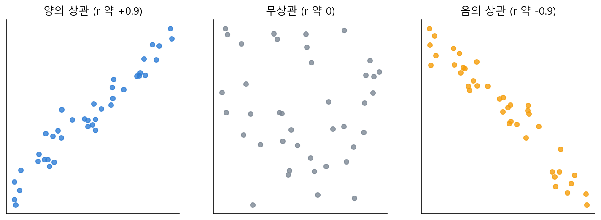

# Ch.14 · 함께 움직이나 : 공분산·상관 — v0.14

> 이번 강: 13강이 변수 *하나*의 흩어짐을 쟀다면, 이제 변수 *둘*이 **함께 움직이는지**를 잰다
> 한 줄 요약: 한 값이 평균보다 클 때 다른 값도 같이 큰가? 두 편차를 **짝지어 곱해 평균내면**(공분산) 함께 움직이는 방향이 한 숫자로 나옵니다. 길이 효과를 걷어내면 −1~1짜리 상관계수 — 11강 코사인 유사도와 똑같은 자예요.
> 핵심 개념: 공분산 · 상관계수 · (11강 내적·코사인과의 재회)

---

## 이야기 파트

### 두 값이 손잡고 움직일 때

13강에서 오픈이는 점수 한 줄의 흩어짐을 재는 법을 익혔습니다. 그런데 데이터는 보통 짝을 지어 옵니다. 학생마다 **공부 시간**과 **시험 점수**가 같이 적혀 있죠. 여기서 누구나 품는 질문이 있어요.

*공부를 많이 한 학생이 점수도 높은가? 두 값이 함께 움직이나?*

눈으로는 보입니다. 공부를 많이 한 쪽이 대체로 점수도 높으면 "함께 움직인다"고 말하죠. 그런데 13강에서처럼, 이 "함께 움직임"도 **숫자 하나**로 적어야 합니다. AI에게 "둘이 관련 있어 보여요" 같은 말은 통하지 않으니까요.

### 편차를 짝지어 곱하기

실마리는 13강에 이미 있었습니다. 그때 각 값이 평균에서 얼마나 떨어졌는지를 **편차**로 쟀죠. 한 학생의 공부 시간 편차(평균보다 +2시간)와 점수 편차(평균보다 +10점)를 나란히 놓고 봅시다.

- 공부도 평균 **위**, 점수도 평균 **위** → 두 편차가 **둘 다 양수** → 곱하면 **양수**
- 공부는 평균 **아래**, 점수도 평균 **아래** → 두 편차가 **둘 다 음수** → 곱하면 또 **양수**
- 공부는 위인데 점수는 아래(또는 그 반대) → 부호가 엇갈려 → 곱하면 **음수**

보이시나요? 두 값이 **같은 쪽으로** 움직이면 편차의 곱이 양수, **엇갈려** 움직이면 음수가 됩니다. 그러니 학생마다 두 편차를 곱해서 전부 **평균내면**, 그 부호와 크기가 "둘이 얼마나 함께 움직이는가"를 말해 줘요. 이 값이 **공분산**입니다.

- 공분산이 **양수** → 한쪽이 크면 다른 쪽도 큰 경향 (공부↑ 점수↑)
- 공분산이 **음수** → 한쪽이 크면 다른 쪽은 작은 경향 (게임시간↑ 점수↓)
- 공분산이 **0 근처** → 둘이 별 상관없음

### 어디서 본 동작인데?

"두 묶음을 짝지어 곱해서 더한다" — 이 동작, 낯익지 않나요? **11강의 내적**이 바로 그거였습니다. 공분산은 사실 **편차 묶음 둘의 내적을 평균낸 것**이에요. 두 변수의 편차를 각각 화살표(벡터)로 보면, 공분산은 그 두 화살표의 내적인 셈이죠.

그렇다면 11강의 다음 수순도 그대로 따라옵니다. 내적은 화살표가 길면 덩달아 커지는 흠이 있었고, 우리는 그걸 **길이로 나눠** 순수한 방향 닮음(코사인 유사도)만 남겼습니다. 공분산도 똑같은 흠이 있어요 — 점수 단위가 점이냐 등급이냐에 따라 숫자가 휙휙 바뀝니다. 그래서 공분산을 **두 변수의 표준편차로 나눠** 길이(흩어짐) 효과를 걷어냅니다. 그 결과가 **−1에서 1 사이**로 깔끔하게 접힌 **상관계수**예요. 11강의 코사인 유사도와 글자 그대로 같은 자입니다.

- 상관계수 **+1**에 가까움 → 거의 완벽하게 같이 움직임
- **0** 근처 → 무관
- **−1**에 가까움 → 거의 완벽하게 반대로 움직임

*그림 14-1: 두 변수를 점으로 찍은 그림. 같이 오르면 양의 상관, 엇갈리면 음의 상관, 흩어지면 무상관. 상관계수가 이 세 모습을 −1~1 숫자로 구분한다.*

### 이것만은 기억하자

- **공분산**은 두 변수의 **편차를 짝지어 곱해 평균낸** 값입니다. 부호가 핵심 — 양수면 같이, 음수면 반대로, 0이면 무관하게 움직입니다. (11강 내적을 평균낸 것)
- **상관계수**는 공분산을 두 표준편차로 나눠 단위·흩어짐 효과를 없앤 것 — **−1~1** 사이로 관계의 세기를 잰 값이고, 11강 **코사인 유사도**와 같은 자입니다.
- 주의: 상관이 높다고 **인과**(하나가 다른 하나의 원인)는 아닙니다. 함께 움직인다는 사실만 말할 뿐이에요.
- 다음 강(15강)부터는 통계에서 **학습**으로 넘어갑니다. AI의 예측이 "얼마나 틀렸나"를 재는 손실(MSE)로, 8강 경사하강이 깎아 내릴 그 지형을 만듭니다.

---

## 기술 파트

### 용어 정리

| 이야기 속 비유 | 진짜 용어 | 정식 정의 |
|--------------|----------|----------|
| 두 편차를 짝지어 곱해 평균낸 값 | 공분산(covariance) $\mathrm{Cov}(x,y)$ | $\frac{1}{n}\sum (x_i-\bar x)(y_i-\bar y)$ |
| 단위·흩어짐을 걷어낸 관계의 세기 | 상관계수(correlation) $r$ | $\dfrac{\mathrm{Cov}(x,y)}{s_x\,s_y}$, 값은 $-1 \le r \le 1$ |
| 편차 묶음 둘의 내적(11강) | — | 공분산 = 편차벡터의 내적 ÷ n |

### 수식 1 — 공분산 : 함께 움직이는 방향

두 변수 $x, y$ 의 짝지어진 데이터 $(x_1,y_1), \dots, (x_n,y_n)$ 가 있을 때, 공분산은 각자의 편차를 곱해 평균낸 것입니다.

$$\mathrm{Cov}(x,y) = \frac{1}{n}\sum_{i=1}^{n} (x_i - \bar{x})(y_i - \bar{y})$$

말로 읽으면 "두 편차를 짝지어 곱해 모두 더한 뒤 개수로 나눈 값"입니다. 13강의 분산 $\frac1n\sum(x_i-\bar x)^2$ 과 비교해 보세요 — 분산은 **자기 자신과** 곱한 것($x$와 $x$), 공분산은 **다른 변수와** 곱한 것($x$와 $y$)일 뿐, 생김새가 똑같습니다. 그래서 $\mathrm{Cov}(x,x)$ 는 곧 $x$ 의 분산이에요.

### 수식 2 — 상관계수 : −1과 1 사이로

공분산은 단위에 휘둘립니다(점수를 점에서 등급으로 바꾸면 값이 변함). 11강에서 내적을 길이로 나눠 코사인을 얻었듯, 공분산을 두 표준편차로 나눠 그 효과를 없앤 것이 상관계수입니다.

$$r = \frac{\mathrm{Cov}(x,y)}{s_x\, s_y}$$

이 값은 항상 $-1 \le r \le 1$ 안에 들어옵니다. 편차들을 벡터로 보면 $r$ 은 정확히 두 편차벡터 사이 각의 $\cos\theta$ — 11강의 코사인 유사도 그 자체예요. 같은 방향(완벽히 함께 움직임)이면 $\cos 0° = 1$, 직각(무관)이면 $\cos 90° = 0$, 반대(완벽히 엇갈림)면 $\cos 180° = -1$ 입니다.

### 계산 예제 : 공부 시간과 점수의 상관

**문제.** 학생 다섯 명의 공부 시간 $x$ 와 점수 $y$ 가 아래와 같습니다. 공분산과 상관계수를 구하세요.

| 공부시간 $x$ | 2 | 3 | 4 | 5 | 6 |
|---|---|---|---|---|---|
| 점수 $y$ | 60 | 65 | 70 | 75 | 80 |

**1단계 — 두 평균을 구한다.**

$$\bar{x} = \frac{2+3+4+5+6}{5} = 4, \qquad \bar{y} = \frac{60+65+70+75+80}{5} = 70$$

**2단계 — 각자의 편차.**

$$x_i-\bar x:\ -2,\ -1,\ 0,\ 1,\ 2 \qquad y_i-\bar y:\ -10,\ -5,\ 0,\ 5,\ 10$$

**3단계 — 편차를 짝지어 곱해 더하고, 공분산을 구한다.**

$$(-2)(-10) + (-1)(-5) + 0 + (1)(5) + (2)(10) = 20+5+0+5+20 = 50$$
$$\mathrm{Cov}(x,y) = \frac{50}{5} = 10 \;>\; 0 \quad(\text{같이 움직임})$$

**4단계 — 두 표준편차를 구한다.** (13강 방식, ÷n)

$$s_x = \sqrt{\frac{(-2)^2+(-1)^2+0+1^2+2^2}{5}} = \sqrt{\frac{10}{5}} = \sqrt{2}$$
$$s_y = \sqrt{\frac{(-10)^2+(-5)^2+0+5^2+10^2}{5}} = \sqrt{\frac{250}{5}} = \sqrt{50}$$

**5단계 — 상관계수: 공분산을 두 표준편차로 나눈다.**

$$r = \frac{\mathrm{Cov}(x,y)}{s_x\, s_y} = \frac{10}{\sqrt{2}\cdot\sqrt{50}} = \frac{10}{\sqrt{100}} = \frac{10}{10} = 1$$

**답.** 공분산은 10(양수, 함께 움직임), 상관계수는 정확히 1 — **완벽한 양의 상관**입니다. 실제로 표를 보면 공부 시간이 1 늘 때마다 점수가 꼭 5씩 올라, 한 치의 흐트러짐도 없죠. 단위(시간·점)가 달라도 상관계수는 그 관계의 세기를 1이라는 한 숫자로 깔끔하게 잡아냅니다.

### 연습문제

> 해답은 부록에 모았습니다. 손으로 먼저 풀어 보세요.

**1.** 두 변수의 공분산이 음수로 나왔습니다. 두 변수의 움직임에 대해 무엇을 알 수 있나요?

**2.** $x$ 의 편차가 $-1, 0, 1$ 이고 $y$ 의 편차가 $-2, 0, 2$ 일 때, 공분산을 구하세요(÷n=3).

**3.** 문제 2에서 $s_x = \sqrt{2/3}$, $s_y = \sqrt{8/3}$ 입니다. 상관계수 $r$ 을 구하세요.

**4.** $\mathrm{Cov}(x, x)$(자기 자신과의 공분산)는 무엇과 같은가요? 13강 용어로 답하세요.

### 이게 AI 어디에 쓰이나

공분산과 상관은 "두 양이 어떻게 엮여 있나"를 재는 도구이고, 이건 AI가 데이터의 **관계 구조**를 파악하는 출발점입니다. 어떤 특징이 결과와 함께 움직이는지(상관이 높은지)를 보면, 모델이 무엇에 주목해야 할지 단서를 얻죠.

더 깊은 연결은 11강에서 이미 깔렸습니다. 상관계수가 곧 편차벡터의 코사인 유사도라는 것 — 즉 "관계를 잰다"는 일이 결국 **내적**으로 돌아간다는 사실입니다. Part Ⅱ 끝 20강의 **어텐션**에서, 모델은 단어 벡터끼리 내적을 때려 "이 단어가 저 단어와 얼마나 관련 있나"를 잽니다. 14강에서 통계의 언어로 본 "함께 움직이는 정도"가, 거기서는 단어들 사이의 주목도로 변신하는 거예요.

그리고 다음 15강부터 무대가 바뀝니다. 지금까지는 데이터를 **묘사**했다면, 이제 AI가 예측을 하고 그 예측이 **얼마나 틀렸는지**를 재기 시작합니다. 8강에서 굴렸던 경사하강법이 깎아 내릴 그 손실의 지형을, 드디어 손으로 만들어 봅니다.
