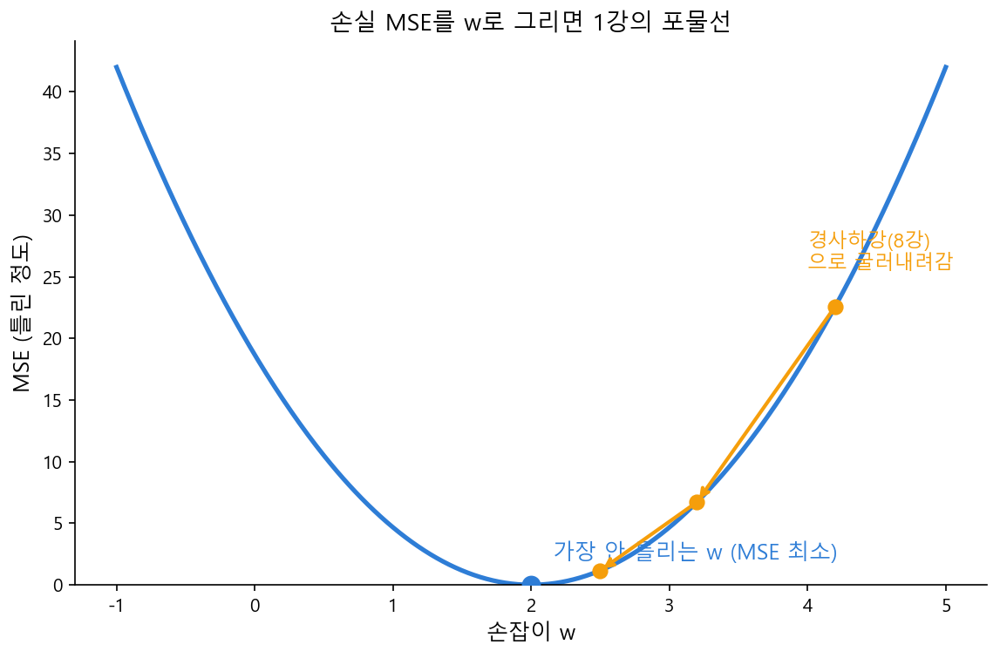

# Ch.15 · 얼마나 틀렸나 : MSE — v0.15

> 이번 강: 통계의 '묘사'를 떠나, AI가 **예측**을 하고 그 예측이 **얼마나 틀렸는지**를 숫자로 재기 시작한다
> 한 줄 요약: 예측에서 정답을 뺀 오차를 **제곱해 평균내면**(MSE) "얼마나 틀렸나"가 한 숫자로 나옵니다. 이 숫자를 어떤 손잡이(w)에 대해 그리면 1강의 포물선이 되고, 그 바닥을 8강의 경사하강으로 굴러 내려가는 것 — 그게 'AI가 배운다'의 전부예요.
> 핵심 개념: 예측 $\hat y$ · 오차 · 손실 · 평균제곱오차(MSE) · 손실 지형

---

## 이야기 파트

### 틀린 정도를 숫자로

여기까지 우리는 데이터를 **묘사**만 했습니다. 중심이 어디고(평균), 얼마나 퍼졌고(표준편차), 둘이 함께 움직이나(상관). 그런데 AI가 진짜 하는 일은 그게 아니에요. AI는 **예측**을 합니다. "이 집은 얼마일까", "다음 단어는 뭘까". 그리고 예측을 했으면 곧바로 따라오는 질문이 있죠.

*내 예측이 정답에서 얼마나 빗나갔나?*

8강에서 안개 산을 내려갈 때, 우리는 "낮은 곳 = 좋은 곳"이라는 지형을 가정하고 굴러 내려갔습니다. 그런데 그 지형, 즉 "높을수록 나쁜" 그 땅이 대체 무엇인지는 미뤄 뒀어요. 이번 강이 바로 그 땅을 만듭니다. AI가 내려가려는 골짜기의 정체 — **틀린 정도를 잰 숫자**, 그게 **손실**입니다.

### 오차를 그냥 더하면 안 되는 이유

집값을 예측한다고 합시다. 세 집의 정답이 2, 5, 6(억)인데, 모델이 3, 5, 8이라고 예측했어요. 각 예측이 얼마나 틀렸는지는 **예측 − 정답**으로 잽니다. 이게 **오차**예요.

$$3-2 = +1, \qquad 5-5 = 0, \qquad 8-6 = +2$$

이 오차들을 그냥 다 더해 "전체가 얼마나 틀렸나"를 재면 될까요? 그런데 만약 한 예측이 +3 틀리고 다른 게 −3 틀렸다면, 더했을 때 0이 나옵니다. 둘 다 한참 틀렸는데 "전혀 안 틀렸다"가 돼 버려요. **어디서 본 함정이죠?** 13강에서 편차를 그냥 더하면 0이 되던 그 함정입니다. 양수 오차와 음수 오차가 상쇄되는 거예요.

해법도 13강과 똑같습니다. **오차를 제곱**합니다. 제곱하면 부호가 사라져 상쇄가 없고, 게다가 크게 틀린 예측에 더 큰 벌점이 붙어요(2배 틀리면 4배 벌점). 이 제곱한 오차를 **평균낸** 것이 바로 **평균제곱오차**, 줄여서 **MSE**(Mean Squared Error)입니다.

$$\text{MSE} = \frac{1^2 + 0^2 + 2^2}{3} = \frac{1+0+4}{3} = \frac{5}{3} \approx 1.67$$

MSE가 작을수록 예측이 정답에 가깝고, 클수록 엉망이라는 뜻입니다. 드디어 "얼마나 틀렸나"가 한 숫자로 잡혔어요.

### 이 숫자가 1강의 포물선이다

여기서 이 책의 모든 실이 한데 묶입니다.

모델에는 돌릴 수 있는 **손잡이**가 있습니다(8강에서 '손잡이'라 불렀죠). 가장 단순한 모델 $\hat y = w\,x$ 를 생각해 봅시다 — 손잡이는 $w$ 하나예요. 이 $w$ 를 이리저리 돌리면 예측이 달라지고, 따라서 MSE도 달라집니다. 그럼 **MSE를 $w$ 의 함수로** 그려 보면 어떤 모양일까요?

MSE는 오차의 **제곱**을 더한 것이고, 오차는 $w$ 에 대한 일차식입니다. 일차식을 제곱해 더하면 — $w$ 에 대한 **2차식**, 즉 **1강에서 본 포물선**이 됩니다! 아래로 볼록한 그 그릇 모양이요. 그리고 포물선에는 가장 낮은 점, **꼭짓점**이 딱 하나 있었죠(1강). 그 꼭짓점이 바로 "MSE가 최소가 되는 $w$", 즉 **가장 안 틀리는 손잡이 값**입니다.

*그림 15-1: 손잡이 w를 바꾸며 MSE를 그리면 1강의 포물선(그릇). 바닥(꼭짓점)이 가장 안 틀리는 w다. 8강 경사하강법은 이 그릇을 굴러 내려가 바닥을 찾는다.*

이게 'AI가 배운다'의 정체입니다. **손실(MSE)이라는 지형을 만들고**(이번 강), **경사하강으로 그 바닥을 찾아 손잡이를 맞추는 것**(8강). 1강의 포물선, 5강의 미분, 8강의 경사하강이 여기서 하나로 만납니다.

### 이것만은 기억하자

- **오차**는 예측 $\hat y$ 에서 정답 $y$ 를 뺀 것입니다. 그냥 더하면 부호가 상쇄되니(13강의 함정), **제곱해서 평균낸** 것이 **MSE(평균제곱오차)** — 모델이 "얼마나 틀렸나"를 재는 손실입니다.
- 손잡이 $w$ 에 대해 MSE를 그리면 **1강의 포물선**이 되고, 그 **바닥(꼭짓점)이 가장 안 틀리는 손잡이 값**입니다.
- AI가 배운다 = **손실 지형(MSE)을 만들고**(이 강) **경사하강(8강)으로 바닥을 찾는** 것. 여기서 책의 미적분 척추가 통계와 만납니다.
- 다음 강(16강)에서는 그 '손잡이를 가진 모델'의 가장 작은 단위, **뉴런** $y=wx+b$ 를 정식으로 만듭니다.

---

## 기술 파트

### 용어 정리

| 이야기 속 비유 | 진짜 용어 | 정식 정의 |
|--------------|----------|----------|
| 모델이 내놓은 추측값 | 예측 $\hat y$ (와이햇) | 모델의 출력 |
| 예측이 정답에서 빗나간 정도 | 오차(error) | $\hat y_i - y_i$ |
| 틀린 정도를 잰 숫자 (낮을수록 좋음) | 손실(loss) | 모델이 얼마나 나쁜지의 척도 |
| 오차를 제곱해 평균낸 손실 | 평균제곱오차(MSE) | $\frac{1}{n}\sum (\hat y_i - y_i)^2$ |

### 수식 1 — MSE : 제곱한 오차의 평균

정답이 $y_1, \dots, y_n$ 이고 모델의 예측이 $\hat y_1, \dots, \hat y_n$ 일 때, 평균제곱오차는 이렇게 정의됩니다.

$$\text{MSE} = \frac{1}{n}\sum_{i=1}^{n} (\hat y_i - y_i)^2$$

말로 읽으면 "예측에서 정답을 뺀 오차를 제곱해 모두 더한 뒤 개수로 나눈 값"입니다. 13강의 분산 $\frac1n\sum(x_i-\bar x)^2$ 과 생김새가 똑같죠? 분산은 "평균에서 떨어진 정도"를, MSE는 "정답에서 빗나간 정도"를 잰다는 점만 다릅니다. 제곱하는 이유도 같아요 — 부호 상쇄를 막고, 큰 오차에 큰 벌점을 주려고.

### 수식 2 — 왜 손실이 포물선이 되나

손잡이 $w$ 하나짜리 모델 $\hat y_i = w\,x_i$ 를 MSE에 대입해 봅시다.

$$\text{MSE}(w) = \frac{1}{n}\sum_{i=1}^{n} (w\,x_i - y_i)^2$$

괄호 안 $w x_i - y_i$ 는 $w$ 에 대한 **1차식**입니다. 이걸 제곱하면 $w^2$ 항이 생기는 **2차식**이 되고, 여러 개를 더해도 여전히 2차식이에요. 즉 $\text{MSE}(w)$ 는 $w$ 에 대한 아래로 볼록한 **2차함수 = 포물선**(1강)입니다. 포물선의 꼭짓점은 5강에서 배웠듯 **미분이 0이 되는 곳**($\text{MSE}'(w)=0$), 곧 손실이 가장 작은 손잡이 값입니다. 손잡이가 여러 개($w, b$, 나아가 수백만 개)면 이 그릇이 여러 방향으로 늘어난 모양이 되고, 그 바닥을 손으로 단번에 못 풀어 **경사하강으로 굴러 내려갑니다**(8강). 그 여러 손잡이의 미분 기계(편미분·그래디언트)는 19강에서 펼칩니다.

### 계산 예제 1 : MSE 직접 구하기

**문제.** 정답이 $y = (2, 5, 6)$ 이고 모델의 예측이 $\hat y = (3, 5, 8)$ 일 때 MSE를 구하세요.

**1단계 — 오차(예측 − 정답).**

$$3-2 = 1, \qquad 5-5 = 0, \qquad 8-6 = 2$$

**2단계 — 오차를 제곱한다.**

$$1^2 = 1, \qquad 0^2 = 0, \qquad 2^2 = 4$$

**3단계 — 제곱오차를 평균낸다.**

$$\text{MSE} = \frac{1+0+4}{3} = \frac{5}{3} \approx 1.67$$

**답.** MSE는 약 1.67입니다. 이 한 숫자가 "이 모델이 이만큼 틀렸다"를 말해 줘요. 이걸 줄이는 게 학습의 목표입니다.

### 계산 예제 2 : 두 모델 중 누가 더 나은가

**문제.** 같은 정답 $y = (2, 5, 6)$ 에 대해 모델 A의 예측은 $\hat y_A = (3, 5, 8)$, 모델 B의 예측은 $\hat y_B = (2, 6, 5)$ 입니다. MSE로 어느 모델이 더 나은지 판정하세요.

**1단계 — 모델 A의 MSE.** (예제 1에서 구함)

$$\text{MSE}_A = \frac{1^2+0^2+2^2}{3} = \frac{5}{3} \approx 1.67$$

**2단계 — 모델 B의 오차와 MSE.**

$$2-2=0,\quad 6-5=1,\quad 5-6=-1 \;\Rightarrow\; \text{MSE}_B = \frac{0^2+1^2+(-1)^2}{3} = \frac{2}{3} \approx 0.67$$

**답.** 모델 B의 MSE(0.67)가 A(1.67)보다 작으니 **모델 B가 더 낫습니다.** 음수 오차(−1)도 제곱하면 양수가 되어 제대로 벌점에 반영된 점을 눈여겨보세요 — 그냥 더했다면 B의 오차 합은 $0+1-1=0$ 이 되어 "완벽하다"는 거짓 결론이 났을 겁니다.

### 연습문제

> 해답은 부록에 모았습니다. 손으로 먼저 풀어 보세요.

**1.** 정답 $y = (10, 20)$, 예측 $\hat y = (12, 18)$ 일 때 MSE를 구하세요.

**2.** 정답 $y=(4,4,4)$, 예측 $\hat y=(4,4,4)$ 일 때 MSE는 얼마인가요? 이 값이 뜻하는 바를 한 줄로 쓰세요.

**3.** 오차를 그냥 더하지 않고 **제곱**해서 더하는 이유를 두 가지 쓰세요.

**4.** 손잡이 $w$ 에 대해 손실 $\text{MSE}(w)$ 를 그렸더니 포물선이 나왔습니다. "가장 안 틀리는 $w$"는 이 포물선의 어디에 있나요? (1강 용어로)

### 더 알아보기 : 크로스엔트로피

MSE는 집값처럼 **수치**를 예측할 때 쓰는 손실입니다. 그런데 LLM이 하는 일은 "다음 단어가 무엇일 확률"을 맞히는 **분류**에 가까워서, 실제로는 MSE 대신 **크로스엔트로피**라는 손실을 주로 씁니다. 이름은 어렵지만 정신은 같아요 — 예측한 확률분포(12강)가 정답에서 얼마나 빗나갔는지를 재고, 그 손실을 경사하강으로 줄입니다. 3강의 로그가 그 안에 들어가죠. 이 책은 "손실을 만들어 경사하강으로 줄인다"는 **구조**를 MSE로 충분히 익히는 데 집중하고, 크로스엔트로피는 이름만 소개합니다.

### 이게 AI 어디에 쓰이나

MSE는 AI 학습의 **목표 그 자체**입니다. 모델을 학습시킨다는 건 결국 "손실(MSE 같은 것)을 가능한 한 작게 만드는 손잡이 값을 찾는다"는 뜻이에요. 8강에서 경사하강법을 배울 때 "낮은 곳으로 내려간다"고 했던 그 **낮은 곳이 바로 손실**입니다. 이번 강에서 드디어 그 지형의 정체를 손으로 만들어 본 거죠.

그리고 이 그림은 책의 클라이맥스인 19강 **역전파**로 곧장 이어집니다. 거기서 우리는 손잡이가 $w$ 하나가 아니라 수백만 개일 때, 손실을 각 손잡이로 **편미분**해(7강 체인룰로!) "어느 손잡이를 어느 쪽으로 돌려야 손실이 줄까"를 계산합니다. 손실을 만든 이번 강이 없으면 내려갈 골짜기도 없어요. 다음 16강부터는 그 손잡이를 가진 모델의 부품 — 뉴런 — 을 하나씩 만들어 갑니다.
