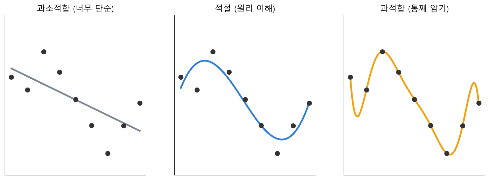

# 칼럼 ② · 외운 것 vs 이해한 것 : 과적합·과소적합

> 쉬어가는 페이지입니다. 풀 문제도, 외울 공식도 없습니다. 15강에서 '손실을 줄이는 게 학습'이라고 했는데 — 손실만 줄이면 정말 다 좋은 걸까요? 그 함정 하나를 구경하고 갑니다.

15강에서 우리는 "손실(MSE)을 가능한 한 작게 만드는 것이 학습"이라고 배웠습니다. 그럼 손실을 **0까지** 끌어내리면 완벽한 모델일까요? 놀랍게도, 그렇지 않습니다. 여기에 AI 학습의 가장 유명한 함정이 숨어 있어요.

### 두 학생 이야기

시험을 앞둔 두 학생을 상상해 봅시다.

**첫째 학생**은 공부를 거의 안 했습니다. 기출문제도 몇 개 안 풀어 보고, 개념도 대충만 압니다. 당연히 시험을 못 보겠죠. 이 학생은 **과소적합**(underfitting)입니다 — 너무 안 배워서 연습 문제조차 제대로 못 푸는 상태예요.

**둘째 학생**은 정반대입니다. 기출문제 500개를 **통째로 외웠어요.** "3번 문제 답은 ②, 7번은 ④"까지 달달. 기출문제로 보는 모의고사라면 만점입니다. 그런데 실제 시험에 **숫자만 살짝 바뀐 새 문제**가 나오자 와르르 무너졌어요. 원리를 이해한 게 아니라 답을 외웠을 뿐이라, 처음 보는 문제 앞에서 속수무책이었던 거죠. 이 학생이 **과적합**(overfitting)입니다 — 본 것에는 완벽한데, 안 본 것에는 형편없는 상태.

우리가 바라는 건 **셋째 학생**입니다. 문제를 통째로 외우는 대신 **원리를 이해**해서, 처음 보는 문제도 척척 푸는 학생. 이렇게 "본 적 없는 데이터에서도 잘하는 능력"을 **일반화**(generalization)라고 부릅니다. 그리고 이게 AI 학습의 진짜 목표예요.

### 모델도 똑같이 군다

AI 모델도 이 세 학생과 똑같이 행동합니다. 점들(데이터)을 지나는 곡선을 찾는다고 해봅시다.

*그림: 같은 점들을 지나는 곡선 세 개. 왼쪽(과소적합)은 너무 뻣뻣해 점들의 흐름을 못 따라가고, 오른쪽(과적합)은 모든 점을 정확히 지나려 구불구불 요동친다. 가운데가 점들의 큰 흐름을 잡은 '일반화'된 곡선이다.*

- **왼쪽(과소적합)**: 직선 하나로 때우려 하니 점들의 출렁임을 전혀 못 따라갑니다. 훈련 데이터에서마저 손실이 큽니다. 첫째 학생이죠.
- **오른쪽(과적합)**: 모든 점을 **하나도 빠짐없이** 지나려고 곡선이 미친 듯이 요동칩니다. 훈련 데이터의 손실은 거의 0이에요 — 점마다 정확히 맞췄으니까. 그런데 점들 사이, 즉 **처음 보는 자리**에서는 엉뚱한 값으로 튀어 버립니다. 둘째 학생, 기출 암기형입니다.
- **가운데(적절)**: 개별 점에 집착하지 않고 점들의 **큰 흐름**만 부드럽게 잡았습니다. 훈련 손실이 0은 아니지만, 처음 보는 자리에서도 그럴듯한 값을 냅니다. 우리가 원하는 셋째 학생이에요.

### 손실이 0인 게 함정이다

여기서 15강의 손실 이야기와 만납니다. 과적합한 오른쪽 모델은 **훈련 데이터의 손실(MSE)이 가장 작습니다** — 어쩌면 0이에요. 손실만 보면 "최고의 모델"이죠. 그런데 정작 새 데이터에서는 가장 나쁩니다.

그래서 AI를 학습시킬 때는 데이터를 둘로 나눕니다. **훈련용**(공부할 기출문제)과 **검증용**(처음 보는 실제 시험). 훈련 손실이 줄어드는 건 당연하고, 진짜로 지켜봐야 할 건 **검증 손실**입니다. 학습을 계속하다 보면 어느 순간부터 훈련 손실은 계속 줄어드는데 검증 손실은 도리어 **늘기 시작**하는 지점이 와요. 바로 그때가 모델이 "이해"를 멈추고 "암기"로 넘어간 순간 — 과적합의 시작입니다.

### 왜 지금 이 이야기를 하나

곧 16강부터 우리는 뉴런을 쌓아 진짜 신경망을 만들기 시작합니다. 신경망은 손잡이(가중치)가 수백만 개라, 마음만 먹으면 훈련 데이터를 **통째로 외워 버릴** 힘이 충분해요. 그래서 현대 AI에서 과적합과의 싸움은 늘 따라다니는 숙제입니다. 데이터를 더 모으고, 모델이 너무 구불대지 않도록 제약을 걸고(규제), 적당한 때 학습을 멈추는 것 — 전부 "둘째 학생이 되지 말자"는 노력이에요.

기억할 한 줄은 이것입니다. **학습의 목표는 손실을 0으로 만드는 게 아니라, 본 적 없는 데이터에서 잘하는 것.** 외우지 말고 이해하기 — 사람에게나 AI에게나 똑같습니다.

자, 숨을 골랐다면 16강으로 갑니다. 드디어 신경망의 가장 작은 부품, **뉴런** 하나를 손으로 만들 차례예요.
