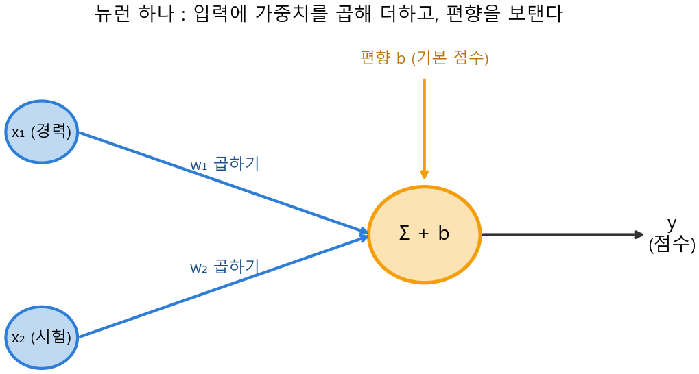

# Ch.16 · 뉴런 하나 : 선형결합 y=wx+b — v0.16

> 이번 강: 손실(15강)을 줄여 가며 학습할 '손잡이를 가진 모델' — 그 가장 작은 부품인 **뉴런** 하나를 정식으로 만든다
> 한 줄 요약: 뉴런은 들어온 입력마다 **중요도(가중치)를 곱해 더하고**(=11강 내적), 마지막에 **기준선(편향)을 보태는** 작은 계산기입니다. $y = wx + b$ — 이 한 줄이 신경망의 벽돌이에요.
> 핵심 개념: 뉴런 · 가중치 $w$ · 편향 $b$ · 선형결합 · (내적·행렬과의 만남)

---

## 이야기 파트

### 모델의 가장 작은 부품

15강에서 우리는 '손잡이를 가진 모델'이 손실을 줄여 가며 학습한다고 했습니다. 그런데 그 '모델'이 대체 어떻게 생긴 물건인지는 아직 안 봤어요. 8강에서 '손잡이'라 부르고, 9강에서 '섞어서 더하는 믹서'라 비유만 했죠. 이제 그 모델을 진짜 부품으로 분해할 차례입니다.

신경망(neural network)은 이름 그대로 **뉴런**이라는 작은 계산기 수백만 개를 그물처럼 엮은 것입니다. 뇌의 신경세포에서 이름을 빌려 왔어요. 그러니 신경망을 이해하려면, 먼저 **뉴런 하나가 무슨 계산을 하는지**부터 알면 됩니다. 다행히 그 계산은 놀랄 만큼 간단해요.

### 점수를 매기는 작은 계산기

채용 담당자가 지원자를 점수로 평가한다고 해봅시다. 두 가지 정보가 있어요 — **경력 연수**와 **시험 점수**. 담당자는 이렇게 계산합니다.

> "경력은 한 해당 **2점**씩 쳐주고, 시험 점수는 **0.5배**로 반영하자. 그리고 기본 점수로 **10점**을 깔고 시작하자."

경력 3년에 시험 80점인 지원자라면, 점수는 $2\times 3 + 0.5\times 80 + 10 = 6 + 40 + 10 = 56$ 점이 됩니다. 방금 한 계산이 정확히 **뉴런 하나가 하는 일**이에요. 뜯어보면 세 부분입니다.

- 각 입력(경력, 시험)에 **중요도**를 곱한다 — 이 중요도가 **가중치**($w$)입니다. 중요한 입력에는 큰 가중치를, 덜 중요한 입력에는 작은 가중치를 줍니다.
- 그렇게 곱한 것들을 **모두 더한다**.
- 마지막으로 **기준선** 하나를 보탠다 — 이 기준선이 **편향**($b$)입니다. "기본으로 깔고 시작하는 점수"예요.

어디서 본 동작이죠? "각 입력에 무언가를 곱해서 다 더한다" — **11강의 내적**, 그리고 **9강의 행렬곱**이 하던 바로 그 동작입니다. 뉴런은 입력 묶음과 가중치 묶음을 내적하고, 편향을 더하는 계산기인 거예요.

### 직선 하나로 긋는 셈

입력이 하나뿐일 때 뉴런은 더 단순해집니다. $y = wx + b$. 이건 4강에서 본 **직선**이에요 — $w$ 는 기울기, $b$ 는 y절편. 즉 뉴런 하나는 "입력 $x$ 에 직선을 그어 점수 $y$ 를 매기는" 일을 합니다. $w$ 를 키우면 직선이 가팔라지고($x$ 에 더 민감), $b$ 를 올리면 직선 전체가 위로 들립니다(기본 점수 상승).

*그림 16-1: 뉴런 하나의 구조. 입력 $x_1, x_2$ 에 각각 가중치 $w_1, w_2$ 를 곱해 더하고(=내적), 편향 $b$ 를 보태 출력 $y$ 를 낸다.*

이 작은 계산기가 가진 **손잡이가 바로 $w$ 와 $b$** 입니다. 15강에서 손실을 줄이려고 돌리던 그 손잡이요. 학습이란 결국 이 수많은 뉴런의 $w, b$ 를 조금씩 돌려 손실을 낮추는 일이에요. 19강에서 그걸 직접 하게 됩니다.

### 이것만은 기억하자

- **뉴런**은 신경망의 가장 작은 부품입니다. 하는 일은 단 셋 — 입력마다 **가중치 $w$ 를 곱하고**, 그것들을 **모두 더하고**, **편향 $b$ 를 보탠다**. 이게 11강 내적 + 편향이에요.
- 입력이 하나면 $y = wx + b$ — 4강의 **직선**입니다($w$=기울기, $b$=절편). 입력이 여럿이면 가중치와 입력을 내적해 더합니다.
- 뉴런의 **손잡이는 $w$ 와 $b$**. 학습은 이 손잡이를 돌려 15강의 손실을 줄이는 일이고, 그 정식 방법이 19강 역전파입니다.
- 다음 강(17강)에서는 이 직선짜리 뉴런에 **곡선의 힘**(활성화함수)을 더합니다 — 직선만으로는 못 푸는 문제를 풀기 위해서요.

---

## 기술 파트

### 용어 정리

| 이야기 속 비유 | 진짜 용어 | 정식 정의 |
|--------------|----------|----------|
| 입력의 중요도 | 가중치(weight) $w$ | 각 입력에 곱하는 수 |
| 기본으로 깔고 시작하는 점수 | 편향(bias) $b$ | 가중합에 더하는 상수 |
| 곱해서 다 더하고 기준선 보태기 | 선형결합(linear combination) | $y = w_1x_1 + \cdots + w_nx_n + b$ |
| 입력에 점수 매기는 작은 계산기 | 뉴런(neuron) | 선형결합을 계산하는 단위 |

### 수식 1 — 뉴런 : 가중합에 편향을 더한다

입력이 하나일 때 뉴런은 가장 단순합니다.

$$y = w\,x + b$$

$w$ 는 입력의 중요도(가중치), $b$ 는 기준선(편향)입니다. 이건 4강에서 본 직선의 식 그대로예요 — $w$ 가 기울기, $b$ 가 y절편. 입력이 여러 개($x_1, \dots, x_n$)면, 각자에 가중치를 곱해 모두 더하고 편향을 보탭니다.

$$y = w_1 x_1 + w_2 x_2 + \cdots + w_n x_n + b$$

이 "각 입력에 가중치를 곱해 더한" 부분은 11강의 **내적** 바로 그것입니다. 가중치 묶음 $\vec w = (w_1, \dots, w_n)$ 과 입력 묶음 $\vec x = (x_1, \dots, x_n)$ 을 벡터로 보면, 뉴런은 이렇게 깔끔히 적힙니다.

$$y = \vec w \cdot \vec x + b$$

말로 읽으면 "가중치와 입력을 내적하고, 편향을 더한다"입니다. 여러 입력에 가중치를 곱해 하나로 합치는 이 꼴을 **선형결합**이라고 불러요.

### 수식 2 — 한 층 : 행렬로 묶기

뉴런 하나는 출력 하나를 냅니다. 그런데 보통은 같은 입력을 보는 뉴런을 **여러 개** 나란히 둬서 출력을 여럿 만듭니다(이게 한 '층'이에요, 18강에서 자세히). 뉴런이 $m$ 개면 가중치 묶음도 $m$ 줄이 되는데, 이 $m$ 줄을 위아래로 쌓으면 **9강의 행렬** $W$ 가 됩니다.

$$\vec y = W\vec x + \vec b$$

여기서 $W$ 의 한 행이 뉴런 하나의 가중치, $\vec b$ 의 한 칸이 그 뉴런의 편향입니다. 9강에서 "행렬곱은 행과 입력을 짝지어 곱해 더한 것"이라고 했죠 — 그 한 줄 한 줄이 바로 뉴런 하나의 내적이었던 겁니다. 9강의 행렬곱이 사실은 "뉴런 여러 개를 한 번에 계산하는 일"이었어요.

### 계산 예제 1 : 입력 하나짜리 뉴런

**문제.** 가중치 $w = 2$, 편향 $b = 1$ 인 뉴런에 입력 $x = 3$ 을 넣으면 출력은?

**1단계 — 식에 대입한다.**

$$y = w\,x + b = 2\times 3 + 1$$

**2단계 — 계산.**

$$y = 6 + 1 = 7$$

**답.** 출력은 7입니다. 가중치 2가 입력 3을 6으로 키우고, 편향 1이 기본으로 더해졌어요.

### 계산 예제 2 : 입력 둘짜리 뉴런 (내적 + 편향)

**문제.** 가중치 $\vec w = (2, 0.5)$, 편향 $b = 10$ 인 뉴런에 입력 $\vec x = (3, 80)$ (경력 3년, 시험 80점)을 넣으면 출력은?

**1단계 — 가중치와 입력을 내적한다.** (11강 방식: 짝지어 곱해 더함)

$$\vec w \cdot \vec x = 2\times 3 + 0.5\times 80 = 6 + 40 = 46$$

**2단계 — 편향을 더한다.**

$$y = \vec w \cdot \vec x + b = 46 + 10 = 56$$

**답.** 출력은 56점입니다. 이야기 속 채용 점수와 정확히 같죠. 경력(가중치 2)과 시험(가중치 0.5)의 중요도가 다르게 반영되고, 기본 점수 10이 편향으로 더해졌습니다. 뉴런 하나가 곧 "내적 + 편향"이라는 게 손으로 확인됩니다.

### 연습문제

> 해답은 부록에 모았습니다. 손으로 먼저 풀어 보세요.

**1.** 가중치 $w = -3$, 편향 $b = 5$ 인 뉴런에 입력 $x = 2$ 를 넣으면 출력은?

**2.** 가중치 $\vec w = (1, 1, 1)$, 편향 $b = 0$ 인 뉴런에 입력 $\vec x = (4, 5, 6)$ 을 넣으면 출력은? 이 뉴런은 무슨 일을 하는 셈인가요?

**3.** 뉴런 $y = wx + b$ 에서 $b$ 만 3 늘리면 출력은 어떻게 변하나요? $w$ 는 출력의 무엇을 정하나요? (4강 직선 용어로)

**4.** 가중치 $\vec w = (0.2, 0.8)$, 편향 $b = -1$ 인 뉴런에 입력 $\vec x = (10, 5)$ 를 넣으면 출력은?

### 이게 AI 어디에 쓰이나

뉴런은 **신경망을 짓는 벽돌**입니다. GPT 같은 거대 모델도, 뜯어보면 이 $y = \vec w \cdot \vec x + b$ 짜리 뉴런 수십억 개가 층층이 쌓인 것에 불과해요. 모델이 "안다"는 지식은 전부 이 뉴런들의 **가중치 $w$ 와 편향 $b$ 값** 안에 들어 있습니다. 학습이란 그 수십억 개의 손잡이를 데이터에 맞게 조금씩 돌리는 일이고요.

다만 뉴런 하나는 결국 **직선**(선형결합)밖에 못 그립니다. 그리고 직선을 아무리 쌓아도 직선이에요 — 휘어진 결정 경계나 복잡한 패턴은 직선만으로 표현할 수 없습니다. 그래서 다음 17강에서 뉴런의 출력에 **곡선의 힘**, 즉 활성화함수를 더해 줍니다. 직선짜리 뉴런이 비로소 곡선을 그릴 수 있게 되는 그 한 끗이, 신경망을 진짜 똑똑하게 만드는 비밀이에요.
