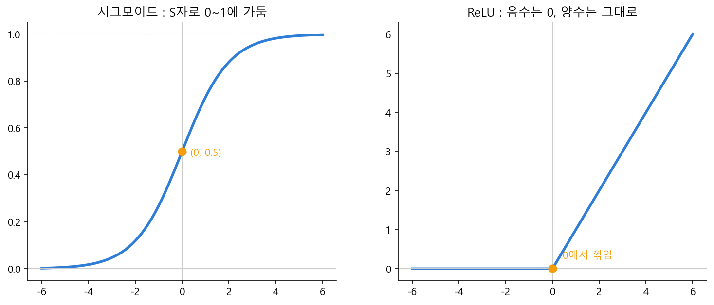

# Ch.17 · 직선을 곡선으로 : 활성화함수 — v0.17

> 이번 강: 16강의 직선짜리 뉴런에 **곡선의 힘**을 더한다 — 직선을 아무리 쌓아도 직선뿐인 한계를 깨는 장치
> 한 줄 요약: 뉴런의 출력을 그대로 두지 않고 **휘어 주는** 함수가 활성화함수입니다. S자로 누르는 시그모이드, 음수를 잘라 버리는 ReLU, 여러 점수를 확률로 바꾸는 softmax — 이 곡선들이 신경망을 비로소 똑똑하게 만들어요.
> 핵심 개념: 비선형성 · 시그모이드 · ReLU · softmax

---

## 이야기 파트

### 직선만으로는 안 되는 이유

16강에서 뉴런 하나는 $y = wx + b$, 곧 **직선**이라는 걸 봤습니다. 그럼 뉴런을 잔뜩 쌓으면 복잡한 걸 표현할 수 있을까요? 여기에 함정이 있습니다.

직선에 직선을 이어 보세요. $y = 2x$ 의 결과를 다시 $z = 3y$ 에 넣으면 $z = 6x$ — 여전히 직선입니다. 직선을 몇 번을 거듭 통과시켜도 결과는 또 직선이에요. 즉 **직선짜리 뉴런만 쌓으면, 백만 개를 쌓아도 전체는 한 개의 직선과 다를 바 없습니다.** 그런데 세상의 문제는 직선으로 안 그어집니다 — "고양이냐 개냐"를 가르는 경계, 휘어진 패턴, 이런 건 직선 하나로는 절대 못 잡아요.

빠진 건 **곡선**, 더 정확히는 **휘어짐**입니다. 어딘가에서 직선을 한 번 꺾거나 구부려 줘야 합니다.

### 출력을 휘어 주는 장치

그래서 신경망은 뉴런의 출력 $y = wx + b$ 를 곧장 다음으로 넘기지 않고, **휘어 주는 함수 하나를 통과시킨** 뒤 넘깁니다. 이 함수를 **활성화함수**라고 불러요. "이 뉴런을 얼마나 활성화(작동)시킬까"를 정한다는 뜻입니다. 대표적인 세 가지를 만나 봅시다.

**시그모이드(sigmoid).** 어떤 값이 들어오든 부드러운 **S자 곡선**을 따라 **0과 1 사이**로 눌러 줍니다. 아주 큰 값은 1에 가깝게, 아주 작은(음수) 값은 0에 가깝게, 0 근처는 0.5로. 출력이 0~1이라 "그럴 확률"처럼 읽을 수 있죠. 6강의 자연상수 $e$ 가 이 곡선을 만듭니다.

**ReLU.** 더 거칠고 단순합니다. **음수면 0, 양수면 그대로.** 그래프로 보면 왼쪽은 바닥에 붙어 있다가 0을 지나며 위로 꺾이는 모양이에요. 직선을 딱 한 번 꺾은 셈인데, 이 "꺾임" 하나가 비선형성을 만들고, 계산이 워낙 빨라 현대 신경망이 가장 많이 씁니다.

*그림 17-1: 두 활성화함수. 시그모이드는 어떤 값이든 S자로 0~1에 가두고, ReLU는 음수를 0으로 자르고 양수는 그대로 둔다. 둘 다 직선을 '휘어' 비선형성을 만든다.*

**softmax.** 마지막 주자는 출력이 **여러 개**일 때 쓰입니다. 점수 묶음(예: 단어마다의 점수)을 받아서, 12강에서 배운 **확률분포**로 바꿔 줘요 — 모두 0~1 사이이고 **다 더하면 1**이 되도록. 큰 점수는 큰 확률로, 작은 점수는 작은 확률로 부드럽게 나눕니다. LLM이 "다음 단어가 '좋다'일 확률 62%…"를 뱉을 때 마지막에 거치는 게 바로 이 softmax예요. 12강 이야기 앞머리의 그 확률이 여기서 만들어집니다.

### 이것만은 기억하자

- 직선(뉴런)만 쌓으면 결과도 직선입니다. **활성화함수**가 출력을 **휘어 줘야** 신경망이 곡선·복잡한 패턴을 표현할 수 있어요. 이 휘어짐을 **비선형성**이라 합니다.
- **시그모이드**는 S자로 **0~1**에 가두고($e$ 사용), **ReLU**는 음수를 0으로 자릅니다(0에서 꺾인 직선). ReLU가 빠르고 흔해요.
- **softmax**는 점수 묶음을 **확률분포**(다 더하면 1, 12강)로 바꿉니다 — LLM의 다음 단어 확률이 여기서 나와요.
- 다음 강(18강)에서는 이 '뉴런 + 활성화'를 옆으로·위로 쌓아 **층**을 만들고, 입력이 출력으로 흘러가는 **순전파**를 봅니다.

---

## 기술 파트

### 용어 정리

| 이야기 속 비유 | 진짜 용어 | 정식 정의 |
|--------------|----------|----------|
| 출력을 휘어 주는 장치 | 활성화함수(activation) | 뉴런 출력에 적용하는 비선형 함수 |
| 직선이 아닌 휘어짐 | 비선형성(nonlinearity) | 직선으로 표현 안 되는 성질 |
| S자로 0~1에 누르기 | 시그모이드 $\sigma(x)$ | $\dfrac{1}{1+e^{-x}}$ |
| 음수는 0, 양수는 그대로 | ReLU | $\max(0, x)$ |
| 점수를 확률분포로 | softmax | $\dfrac{e^{z_i}}{\sum_j e^{z_j}}$ |

### 수식 1 — 시그모이드 : S자로 누르기

시그모이드는 6강의 자연상수 $e$ 로 만든 S자 곡선입니다.

$$\sigma(x) = \frac{1}{1 + e^{-x}}$$

읽어 봅시다. $x$ 가 아주 크면 $e^{-x}$ 가 0에 가까워져 $\sigma(x) \approx \frac{1}{1+0} = 1$. $x$ 가 아주 작은(큰 음수) 값이면 $e^{-x}$ 가 엄청 커져 $\sigma(x) \approx \frac{1}{\text{큰 수}} \approx 0$. $x = 0$ 이면 $e^0 = 1$ 이라 $\sigma(0) = \frac{1}{1+1} = 0.5$. 그래서 출력이 **0과 1 사이**에 부드럽게 갇히고, 가운데(0)에서 0.5를 지나는 S자가 됩니다.

### 수식 2 — ReLU와 softmax

**ReLU**는 음수를 잘라 버리는 함수입니다.

$$\text{ReLU}(x) = \max(0,\ x) = \begin{cases} x & (x \ge 0) \\ 0 & (x < 0) \end{cases}$$

양수는 그대로 통과, 음수는 0으로. 0에서 한 번 꺾이는 이 단순한 동작이 비선형성을 만듭니다.

**softmax**는 점수 묶음 $z_1, \dots, z_n$ 을 확률분포로 바꿉니다. 각 점수를 $e$ 의 지수로 올린 뒤, 전체 합으로 나눠요.

$$\text{softmax}(z_i) = \frac{e^{z_i}}{e^{z_1} + e^{z_2} + \cdots + e^{z_n}}$$

$e$ 의 지수라 항상 양수이고, 전체 합으로 나눴으니 **모두 더하면 1**이 됩니다 — 12강에서 본 확률분포의 두 조건을 정확히 만족하죠. 큰 점수일수록 $e^{z}$ 가 가파르게 커져 더 큰 확률을 가져갑니다.

### 계산 예제 1 : 시그모이드와 ReLU 통과시키기

**문제.** 뉴런 출력이 각각 $x = 0$, $x = 2$, $x = -3$ 일 때 시그모이드와 ReLU 값을 구하세요. ($e^{-2} \approx 0.135$ 사용)

**1단계 — 시그모이드.**

$$\sigma(0) = \frac{1}{1+e^{0}} = \frac{1}{2} = 0.5$$
$$\sigma(2) = \frac{1}{1+e^{-2}} = \frac{1}{1+0.135} = \frac{1}{1.135} \approx 0.88$$
$$\sigma(-3) = \frac{1}{1+e^{3}} = \frac{1}{1+20.1} \approx 0.05$$

**2단계 — ReLU.**

$$\text{ReLU}(0) = 0, \qquad \text{ReLU}(2) = 2, \qquad \text{ReLU}(-3) = 0$$

**답.** 시그모이드는 0, 2, −3을 각각 0.5, 0.88, 0.05로 **0~1 사이에** 눌러 담았습니다(큰 값일수록 1에 가까움). ReLU는 양수 2만 통과시키고 음수 −3은 0으로 잘랐어요.

### 계산 예제 2 : softmax로 확률 만들기

**문제.** 세 단어의 점수가 $z = (2, 1, 0)$ 입니다. softmax로 확률분포를 구하세요. ($e^2 \approx 7.39$, $e^1 \approx 2.72$, $e^0 = 1$)

**1단계 — 각 점수를 $e$ 의 지수로 올린다.**

$$e^{2} \approx 7.39, \qquad e^{1} \approx 2.72, \qquad e^{0} = 1$$

**2단계 — 전체 합을 구한다.**

$$7.39 + 2.72 + 1 = 11.11$$

**3단계 — 각자를 전체 합으로 나눈다.**

$$\frac{7.39}{11.11} \approx 0.67, \qquad \frac{2.72}{11.11} \approx 0.24, \qquad \frac{1}{11.11} \approx 0.09$$

**답.** 확률분포는 약 $(0.67,\ 0.24,\ 0.09)$ 입니다. 셋을 더하면 1이 되죠(12강 규칙). 점수가 가장 높던 첫 단어가 67%로 가장 큰 확률을 가져갔습니다. LLM이 다음 단어를 고르는 게 바로 이 계산이에요.

### 연습문제

> 해답은 부록에 모았습니다. 손으로 먼저 풀어 보세요.

**1.** $\text{ReLU}(5)$, $\text{ReLU}(-1)$, $\text{ReLU}(0)$ 의 값을 각각 구하세요.

**2.** 시그모이드 $\sigma(0)$ 의 값은 얼마인가요? 그리고 $x$ 가 아주 큰 양수일 때 $\sigma(x)$ 는 어떤 값에 가까워지나요?

**3.** 점수가 $z = (1, 1)$ 로 똑같을 때 softmax 확률분포를 구하세요. (직관적으로 답을 먼저 예상해 보세요.)

**4.** "직선짜리 뉴런만 쌓으면 전체도 직선"이라는 게 왜 문제인가요? 활성화함수가 이걸 어떻게 해결하나요? (한두 줄)

### 이게 AI 어디에 쓰이나

활성화함수는 신경망에 **표현력**을 주는 장치입니다. ReLU 덕분에 신경망은 직선들을 여러 번 꺾어 어떤 복잡한 곡선·경계도 흉내 낼 수 있게 됩니다. 층 사이사이에 이 꺾임이 끼어 있어야, 깊게 쌓은 신경망이 비로소 "깊은" 값을 하는 거예요. 활성화가 없으면 백 층을 쌓아도 한 층짜리 직선과 똑같습니다.

그리고 출력층의 **softmax**는 LLM의 얼굴이라 할 만합니다. 모델이 내부에서 단어마다 점수를 매기면, 마지막에 softmax가 그 점수들을 "다음 단어일 확률"로 바꿔 주죠. 12강에서 본 "'좋다' 62%…"가 정확히 이 softmax의 출력입니다. 다음 18강에서는 이 뉴런과 활성화를 층층이 쌓아, 입력이 출력으로 흘러가는 **순전파**의 전체 그림을 완성합니다.
