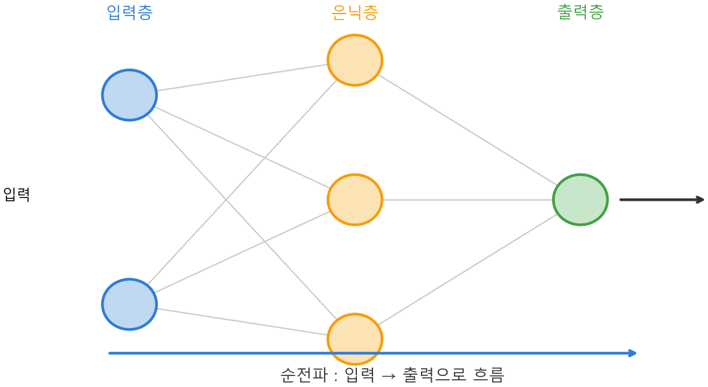

# Ch.18 · 층층이 쌓고 흘리기 : 층 구조와 순전파 — v0.18

> 이번 강: 뉴런(16강)과 활성화(17강)를 옆으로·위로 쌓아 **신경망**을 짓고, 입력이 출력으로 흘러가는 길 — **순전파**를 완성한다
> 한 줄 요약: 뉴런을 옆으로 나란히 놓으면 한 **층**, 층을 위로 포개면 **깊은 신경망**입니다. 입력이 층을 차례로 통과해(행렬곱 → 편향 → 활성화) 출력에 닿는 흐름이 **순전파** — GPT가 답을 내놓는 그 길이에요.
> 핵심 개념: 층(입력·은닉·출력) · 순전파 · (행렬곱의 반복)

---

## 이야기 파트

### 뉴런 하나로는 부족하다

16강에서 뉴런 하나를 만들었고, 17강에서 거기에 곡선(활성화)을 입혔습니다. 그런데 뉴런 하나는 결국 입력에 점수 하나를 매기는 작은 계산기일 뿐이에요. 사진이 고양이인지 판단하거나 다음 단어를 고르는 복잡한 일을, 계산기 하나로 할 수는 없습니다.

해법은 단순합니다. **많이, 그리고 층층이 쌓는다.** 뉴런을 옆으로 잔뜩 늘어놓고, 그 줄을 위로 여러 겹 포개는 거예요. 이렇게 쌓은 그물이 바로 **신경망**입니다.

### 옆으로 한 줄 = 층, 위로 여러 줄 = 깊은 망

같은 입력을 보는 뉴런을 **옆으로** 여러 개 나란히 놓은 한 줄을 **층**(layer)이라고 부릅니다. 입력이 두 개라도, 그걸 보는 뉴런이 세 개면 출력이 세 개 나오죠. 한 층은 입력 묶음을 받아 출력 묶음을 내놓는 셈입니다.

그리고 이 층을 **위로** 포갭니다. 첫 층의 출력이 둘째 층의 입력이 되고, 둘째 층의 출력이 셋째 층의 입력이 되고… 이렇게요. 신경망에는 세 종류의 층이 있습니다.

- **입력층** — 데이터가 처음 들어오는 곳(사진의 픽셀, 단어의 숫자).
- **은닉층** — 중간에서 묵묵히 계산하는 층들. 깊을수록 이 은닉층이 많아져요("딥러닝"의 '딥'이 이거예요).
- **출력층** — 최종 답을 내놓는 곳(고양이 확률, 다음 단어 점수).

*그림 18-1: 입력층 → 은닉층 → 출력층. 각 동그라미가 뉴런이고, 선이 가중치다. 입력이 왼쪽에서 오른쪽으로 흐르며 매 층에서 '행렬곱 + 편향 + 활성화'를 거친다.*

### 입력이 출력으로 흐른다 : 순전파

이제 데이터가 이 그물을 통과하는 장면을 봅시다. 입력이 첫 층에 들어가면, 그 층의 뉴런들이 각자 **가중치를 곱해 더하고(=행렬곱, 9강) 편향을 보탠 뒤(16강) 활성화로 휘어(17강)** 출력을 냅니다. 그 출력이 다음 층의 입력이 되어 똑같은 과정을 반복하고, 마지막 출력층에서 답이 나와요.

이렇게 **입력에서 출력 방향으로 한 번 쭉 흘려보내는 계산**을 **순전파**(forward propagation)라고 합니다. GPT에게 질문을 던지면, 그 질문이 숫자가 되어 수십·수백 개의 층을 차례로 통과해 "다음 단어 점수"로 나오는 것 — 그게 전부 순전파예요. 핵심은, 매 층이 하는 일이 결국 **행렬곱 + 편향 + 활성화의 반복**이라는 겁니다. 9강에서 "신경망 한 층 = 행렬곱+덧셈"이라 예고했던 게 여기서 완성됩니다.

### 이것만은 기억하자

- 뉴런을 **옆으로** 나란히 놓으면 한 **층**, 층을 **위로** 포개면 **깊은 신경망**입니다. 층에는 입력층·은닉층·출력층이 있어요.
- 입력이 층을 차례로 통과하며 **행렬곱(9강) → 편향(16강) → 활성화(17강)** 를 반복해 출력에 닿는 흐름이 **순전파**입니다.
- 거대 모델이 답을 내놓는 일은, 뜯어보면 이 순전파 — 행렬곱과 활성화의 반복 — 일 뿐입니다.
- 다음 강(19강)은 책의 정점입니다. 순전파로 나온 예측이 틀렸을 때(손실, 15강), 그 오차를 **거꾸로 거슬러 올려** 각 가중치를 고치는 **역전파**를 배웁니다.

---

## 기술 파트

### 용어 정리

| 이야기 속 비유 | 진짜 용어 | 정식 정의 |
|--------------|----------|----------|
| 옆으로 나란한 뉴런 한 줄 | 층(layer) | 같은 입력을 받는 뉴런들의 묶음 |
| 중간에서 계산하는 층 | 은닉층(hidden layer) | 입력층과 출력층 사이의 층 |
| 입력 → 출력으로 한 번 흘리기 | 순전파(forward propagation) | 입력에서 출력 방향으로의 계산 |
| 행렬곱+편향+활성화 반복 | (한 층의 계산) | $\vec a^{(l)} = f(W^{(l)}\vec a^{(l-1)} + \vec b^{(l)})$ |

### 수식 1 — 한 층의 계산

$l$ 번째 층은 이전 층의 출력 $\vec a^{(l-1)}$ 를 입력으로 받아, 행렬곱과 편향(16강)을 거친 뒤 활성화 $f$(17강)를 씌워 출력 $\vec a^{(l)}$ 를 냅니다.

$$\vec a^{(l)} = f\!\left(W^{(l)}\vec a^{(l-1)} + \vec b^{(l)}\right)$$

여기서 위첨자 $(l)$ 은 "몇 번째 층인가"를 나타내는 번호일 뿐, 거듭제곱이 아닙니다. $W^{(l)}$ 은 그 층의 가중치 행렬, $\vec b^{(l)}$ 은 편향, $f$ 는 활성화함수(ReLU 등)예요. 괄호 안 $W\vec a + \vec b$ 가 16강의 뉴런(여러 개를 행렬로 묶은 것), 바깥의 $f$ 가 17강의 곡선. 한 층은 딱 이 한 줄입니다.

### 수식 2 — 순전파 : 층을 이어 붙이기

순전파는 이 한 줄을 층마다 반복하는 것입니다. 입력 $\vec x$ 가 들어와 2개 층을 지나는 신경망이라면:

$$\vec a^{(1)} = f\!\left(W^{(1)}\vec x + \vec b^{(1)}\right) \quad\rightarrow\quad \vec a^{(2)} = f\!\left(W^{(2)}\vec a^{(1)} + \vec b^{(2)}\right)$$

첫 층의 출력 $\vec a^{(1)}$ 이 둘째 층의 입력으로 그대로 들어가는 게 보이시죠. 층이 100개면 이 과정을 100번 이어 붙일 뿐이에요. 입력에서 출력까지, 행렬곱과 활성화가 번갈아 반복되는 한 줄기 흐름 — 그게 순전파입니다.

### 계산 예제 : 작은 신경망에 입력을 흘려보내기

**문제.** 입력 $\vec x = (1, 2)$ 를 아래 2층 신경망에 순전파시켜 최종 출력을 구하세요. 은닉층 활성화는 ReLU입니다.

- 은닉층: $W^{(1)} = \begin{pmatrix} 1 & -1 \\ 0 & 2 \end{pmatrix}$, $\vec b^{(1)} = (0, 1)$
- 출력층: $W^{(2)} = (1\ \ 2)$, $b^{(2)} = 1$ (활성화 없음)

**1단계 — 은닉층의 행렬곱 + 편향.** (9강 행렬곱)

$$W^{(1)}\vec x = \begin{pmatrix} 1 & -1 \\ 0 & 2 \end{pmatrix}\begin{pmatrix} 1 \\ 2 \end{pmatrix} = \begin{pmatrix} 1\cdot1 + (-1)\cdot2 \\ 0\cdot1 + 2\cdot2 \end{pmatrix} = \begin{pmatrix} -1 \\ 4 \end{pmatrix}$$
$$W^{(1)}\vec x + \vec b^{(1)} = \begin{pmatrix} -1 \\ 4 \end{pmatrix} + \begin{pmatrix} 0 \\ 1 \end{pmatrix} = \begin{pmatrix} -1 \\ 5 \end{pmatrix}$$

**2단계 — ReLU 활성화.** (음수는 0, 양수는 그대로)

$$\vec a^{(1)} = \text{ReLU}\begin{pmatrix} -1 \\ 5 \end{pmatrix} = \begin{pmatrix} 0 \\ 5 \end{pmatrix}$$

**3단계 — 출력층의 행렬곱 + 편향.**

$$y = W^{(2)}\vec a^{(1)} + b^{(2)} = (1\cdot 0 + 2\cdot 5) + 1 = 10 + 1 = 11$$

**답.** 최종 출력은 11입니다. 입력 $(1,2)$ 가 은닉층에서 $(0,5)$ 로 바뀌고(ReLU가 음수 −1을 0으로 잘랐죠), 출력층을 거쳐 11이 나왔어요. 이 한 줄기 계산이 바로 순전파입니다. GPT는 이 과정을 어마어마하게 큰 행렬로, 수백 층에 걸쳐 할 뿐이에요.

### 연습문제

> 해답은 부록에 모았습니다. 손으로 먼저 풀어 보세요.

**1.** 위첨자 $(l)$ 은 무엇을 뜻하나요? 거듭제곱인가요?

**2.** 한 층이 하는 계산을 세 단계로 나눠 쓰세요. (어떤 강에서 배운 것들인가요?)

**3.** 입력 $\vec x = (2, 0)$, $W^{(1)} = \begin{pmatrix} 1 & 1 \\ 1 & -1 \end{pmatrix}$, $\vec b^{(1)} = (0, 0)$, 활성화 ReLU일 때 은닉층 출력 $\vec a^{(1)}$ 을 구하세요.

**4.** 순전파는 어느 방향으로 흐르나요? (다음 19강의 '역전파'는 반대로 흐릅니다 — 미리 짐작해 보세요.)

### 이게 AI 어디에 쓰이나

순전파는 **AI가 답을 내놓는 과정 그 자체**입니다. ChatGPT에 문장을 넣으면, 그 문장이 숫자 벡터가 되어 수십·수백 개의 층을 통과하며 매번 거대한 행렬곱과 활성화를 거칩니다. 그 끝의 출력층에서 softmax(17강)를 거쳐 "다음 단어 확률"이 나오고, 그렇게 한 단어씩 글이 만들어져요. 우리가 9강부터 쌓아 온 행렬·내적·뉴런·활성화가 전부 이 한 흐름 안에서 일합니다.

하지만 순전파만으로는 AI가 **똑똑해지지** 않습니다. 처음엔 가중치가 엉터리(무작위, 12강의 정규분포로 초기화)라 예측도 엉망이거든요. 그 엉터리 예측이 정답에서 얼마나 틀렸는지를 손실(15강)로 재고, 그 오차를 **거꾸로 거슬러 올려보내** 모든 가중치를 조금씩 고치는 과정이 필요합니다. 그게 다음 19강, 책의 정점인 **역전파**입니다. 순전파로 흘려보내고, 역전파로 고치고 — 이 두 흐름의 반복이 'AI가 배운다'의 완전한 모습이에요.
