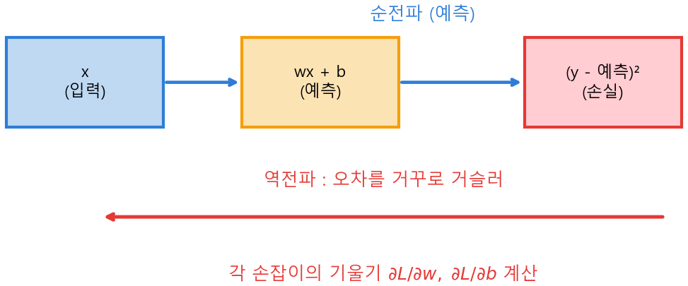
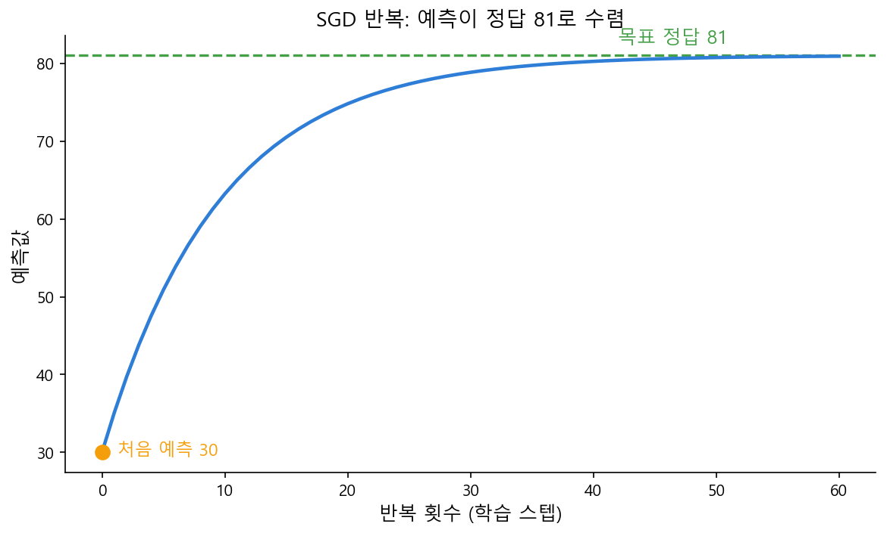

# Ch.19 · 오차를 거슬러 : 역전파 — v0.19 ★정점

> 이번 강: 이 책의 정상입니다. 순전파(18강)로 나온 예측이 틀렸을 때, 그 **오차를 거꾸로 거슬러 올려** 모든 가중치를 고치는 법 — AI가 '배우는' 바로 그 알고리즘을 처음부터 정식으로 펼친다.
> 한 줄 요약: 손실을 각 손잡이로 **편미분**하면(7강 체인룰로) "그 손잡이를 어느 쪽으로 돌려야 손실이 줄지"가 나옵니다. 그 반대로 한 걸음(8강) 옮기기를 반복하면 예측이 정답으로 수렴해요. 이게 학습의 심장입니다.
> 핵심 개념: 편미분 ∂ · 그래디언트 ∇ · 가중치 갱신 $\theta \leftarrow \theta - \eta\nabla L$ · 역전파

---

## 이야기 파트

### 틀렸다. 그런데 무엇을 얼마나 고치지?

18강에서 신경망은 입력을 순전파시켜 예측을 내놓았습니다. 그런데 처음엔 가중치가 무작위(12강 정규분포로 초기화)라, 예측이 엉망이에요. 15강에서 그 틀린 정도를 손실로 쟀고요. 이제 진짜 질문이 남았습니다.

*수백만 개의 손잡이($w, b$) 중에서, 어느 것을 어느 쪽으로 얼마나 돌려야 손실이 줄어들까?*

8강에서 답의 절반은 이미 봤습니다. 손실이라는 골짜기에서 **기울기를 재서 반대로 한 걸음** 내려가는 것 — 경사하강법이죠. 그때 우리는 손잡이가 여럿이면 "변수마다 제 기울기를 하나씩 재서, 그 묶음의 반대로 모두 함께 한 걸음"이라고 비유로만 말하고 넘어갔습니다. 그 "변수마다 기울기 재기"와 "묶음"의 정식이 바로 이번 강이에요.

핵심 도구는 **7강의 체인룰**입니다. 손실은 예측을 거쳐 가중치에 연결돼 있어서(손잡이 → 예측 → 손실), 톱니바퀴 연쇄를 거꾸로 따라가야 "이 손잡이가 손실에 끼친 영향"을 알 수 있거든요. 그래서 이 방법의 이름이 **역전파** — 오차를 출력에서 입력 쪽으로 거꾸로 흘려보낸다는 뜻입니다.

### 손잡이 하나만 살짝 흔들어 보기

손실 $L$ 은 손잡이 $w$ 와 $b$ 두 개에 동시에 달려 있습니다. 이럴 때 "$w$ 하나만 아주 살짝 흔들면 손실이 얼마나 변하나"를 재고 싶어요($b$ 는 가만히 둔 채로). 이렇게 **다른 변수는 상수로 묶어 두고 한 변수로만 미분**하는 것을 **편미분**이라 하고, $\dfrac{\partial L}{\partial w}$ 로 씁니다. 5강의 미분 $\frac{d}{dx}$ 와 똑같은 '기울기'인데, 변수가 여럿이라 "지금 흔드는 건 $w$ 야"를 표시하려고 $d$ 대신 $\partial$(라운드 디)를 쓸 뿐이에요.

이 $\dfrac{\partial L}{\partial w}$ 의 **부호**가 길을 알려줍니다. 양수면 "$w$ 를 키우면 손실이 는다 → 줄이려면 $w$ 를 내려라", 음수면 "$w$ 를 키우면 손실이 준다 → $w$ 를 올려라". 그래서 8강처럼 **기울기의 반대 방향으로** $w$ 를 한 걸음 옮기면 손실이 줄어요. $b$ 도 똑같이 $\dfrac{\partial L}{\partial b}$ 를 재서 반대로 옮깁니다. 이걸 수백만 손잡이에 동시에 하는 게 신경망 학습입니다.

### 이것만은 기억하자

- **역전파**는 예측의 오차를 출력에서 입력 쪽으로 **거꾸로 흘려**, 각 손잡이가 손실에 끼친 영향(기울기)을 7강 체인룰로 구하는 방법입니다.
- 한 손잡이의 기울기는 **편미분** $\dfrac{\partial L}{\partial w}$ — 다른 변수는 상수로 두고 그 손잡이로만 미분한 값. 그 **반대 방향으로 한 걸음**(8강) 옮기면 손실이 줄어요.
- 모든 편미분을 모은 묶음이 **그래디언트** $\nabla L$, 손잡이 전체를 한 번에 갱신하는 식이 $\theta \leftarrow \theta - \eta\nabla L$ 입니다(8강에서 비유로만 남겨 둔 그 식의 정식).
- 이 한 걸음을 **수없이 반복**하면 예측이 정답으로 수렴합니다. 다음 20강에서는 이렇게 학습된 신경망 위에 LLM의 핵심, **어텐션**을 올립니다.

---

## 기술 파트

### 용어 정리

| 이야기 속 비유 | 진짜 용어 | 정식 정의 |
|--------------|----------|----------|
| 한 손잡이만 흔들 때의 기울기 | 편미분 $\dfrac{\partial L}{\partial w}$ | 다른 변수를 상수로 두고 $w$ 로 미분 |
| 모든 손잡이의 기울기 묶음 | 그래디언트 $\nabla L$ | 편미분들을 모은 벡터 $\left(\frac{\partial L}{\partial w}, \frac{\partial L}{\partial b}, \dots\right)$ |
| 기울기 반대로 한 걸음의 보폭 | 학습률 $\eta$ | 한 번에 옮기는 양(작은 양수) |
| 오차를 거꾸로 흘려 기울기 구하기 | 역전파(backpropagation) | 출력→입력 방향으로 체인룰 적용 |
| 전체 데이터로 한 바퀴 학습 | 에폭(epoch) | 갱신 반복의 한 주기 |

### 수식 1 — 예측과 손실 (출발점)

가장 단순한 뉴런 하나로 시작합니다. 공부 시간 $x$ 로 시험 점수를 예측한다고 해요.

$$\hat y = wx + b$$

$w$ 는 가중치, $b$ 는 편향(16강)입니다. 정답 $y$ 와의 손실은 15강의 제곱오차를 데이터 한 점에 대해 쓴 것입니다(여러 점이면 평균내면 MSE).

$$L = (y - \hat y)^2 = \big(y - (wx + b)\big)^2$$

제곱하는 이유는 15강 그대로 — 오차의 부호를 없애고 큰 오차에 큰 벌점을 주기 위해서. 이제 이 $L$ 을 줄이려고, $w$ 와 $b$ 각각으로 편미분해 기울기를 구합니다.

### 수식 2 — 체인룰로 손실 미분하기

손실 $L = (y-(wx+b))^2$ 은 "$w$ 가 들어간 안쪽 식을 제곱한" 합성함수입니다. 그러니 **7강 체인룰**이 필요해요.

$$\frac{d}{dx}f(g(x)) = f'(g(x))\cdot g'(x)$$

**$w$ 로 편미분.** 안쪽 식을 $g(w) = y - (wx + b)$ 라 두면 $L = \big(g(w)\big)^2$ 입니다($b$ 는 상수 취급). 체인룰로 한 단계씩 깝니다.

$$\frac{\partial L}{\partial w} = 2\,g(w)\cdot g'(w)$$

여기서 $g'(w)$ 는 $g(w) = y - wx - b$ 를 $w$ 로 미분한 것 — $y$ 와 $b$ 는 상수라 사라지고 $-wx$ 만 남아 $-x$ 입니다. $g(w) = y - \hat y$ 이므로:

$$\frac{\partial L}{\partial w} = 2(y - \hat y)\cdot(-x) = -2x(y - \hat y)$$

**$b$ 로 편미분.** 똑같이 $L = (g(b))^2$, $g(b) = y - (wx+b)$. 이번엔 $g'(b) = -1$($w x$ 는 상수, $-b$ 만 미분):

$$\frac{\partial L}{\partial b} = 2(y - \hat y)\cdot(-1) = -2(y - \hat y)$$

두 기울기 모두 $(y - \hat y)$, 즉 **오차**가 핵심 재료입니다. 오차가 크면 기울기도 크고(많이 고침), 오차가 0이면 기울기도 0(고칠 게 없음)이에요. 역전파가 "오차를 거슬러 보낸다"는 말이 이 식에 그대로 들어 있습니다.

### 수식 3 — 갱신, 그리고 그래디언트로 일반화

기울기를 얻었으니 8강처럼 **반대 방향으로 한 걸음** 옮깁니다. 보폭이 학습률 $\eta$ 예요.

$$w \leftarrow w - \eta\,\frac{\partial L}{\partial w}, \qquad b \leftarrow b - \eta\,\frac{\partial L}{\partial b}$$

손잡이가 $w, b$ 둘이 아니라 수백만 개라도 똑같습니다. 모든 손잡이를 $\theta = (w_1, w_2, \dots, b_1, \dots)$ 로 묶고, 각자의 편미분을 모은 묶음을 **그래디언트** $\nabla L$ 이라 부릅니다.

$$\nabla L = \left(\frac{\partial L}{\partial w_1},\ \frac{\partial L}{\partial w_2},\ \dots,\ \frac{\partial L}{\partial b_1},\ \dots\right)$$

그러면 수백만 손잡이의 갱신이 단 한 줄로 적힙니다.

$$\theta \leftarrow \theta - \eta\,\nabla L$$

8강에서 "변수마다 기울기 재서 묶음의 반대로 모두 함께 한 걸음"이라고 비유로만 남겨 둔 그 문장이, 바로 이 식이었어요. $\nabla L$ 이 그 "기울기 묶음", 빼기가 "반대 방향", $\eta$ 가 "한 걸음의 보폭"입니다. 8강의 안개 산 비유가 여기서 정식 수식으로 완성됩니다.

*그림 19-1: 순전파는 입력→예측→손실로 흐르고(파랑), 역전파는 손실의 오차를 거꾸로(빨강) 흘려 각 손잡이의 편미분(기울기)을 구한다.*

### 계산 예제 1 : 한 걸음 학습시키기

**문제.** 공부 2시간이면 81점이 정답($x=2$, $y=81$)이라고 합시다. 처음 손잡이가 $w=5$, $b=20$(무작위), 학습률 $\eta = 0.01$ 일 때, 한 걸음 갱신한 뒤의 $w, b$ 와 새 예측을 구하세요.

**1단계 — 예측과 오차.**

$$\hat y = wx + b = 5\times 2 + 20 = 30, \qquad y - \hat y = 81 - 30 = 51$$

엉터리 손잡이라 81점짜리를 30점으로 예측했어요. 손실은 $L = 51^2 = 2601$ 로 큽니다.

**2단계 — 두 기울기(편미분)를 구한다.** (수식 2의 공식에 대입)

$$\frac{\partial L}{\partial w} = -2x(y-\hat y) = -2\times 2\times 51 = -204$$
$$\frac{\partial L}{\partial b} = -2(y-\hat y) = -2\times 51 = -102$$

둘 다 **음수**입니다. "$w$(또는 $b$)를 키우면 손실이 준다"는 신호 — 즉 손잡이를 **올려야** 합니다.

**3단계 — 반대 방향으로 한 걸음.**

$$w \leftarrow 5 - 0.01\times(-204) = 5 + 2.04 = 7.04$$
$$b \leftarrow 20 - 0.01\times(-102) = 20 + 1.02 = 21.02$$

기울기가 음수라 빼기(−)가 결국 **더하기**가 되어 손잡이가 올라갔죠.

**4단계 — 새 예측.**

$$\hat y_{\text{new}} = 7.04\times 2 + 21.02 = 14.08 + 21.02 = 35.1$$

**답.** 예측이 $30 \to 35.1$ 로, 정답 81을 향해 **올라갔습니다.** 딱 한 걸음에 손실이 줄어든 거예요. 이 한 걸음이 신경망이 "한 번 배우는" 동작입니다.

### 계산 예제 2 : 반복하면 정답으로 수렴

한 걸음으로는 35.1, 아직 81에는 멀었습니다. 그래서 **같은 과정을 반복**합니다. 새 $w=7.04, b=21.02$ 로 다시 예측·기울기·갱신을 한 번 더 해 볼게요.

$$\hat y = 7.04\times 2 + 21.02 = 35.1,\qquad y - \hat y = 81 - 35.1 = 45.9$$
$$w \leftarrow 7.04 - 0.01\times(-2\times2\times45.9) = 7.04 + 1.836 = 8.876$$
$$b \leftarrow 21.02 - 0.01\times(-2\times45.9) = 21.02 + 0.918 = 21.938$$
$$\hat y_{\text{new}} = 8.876\times 2 + 21.938 = 39.69$$

예측이 $35.1 \to 39.69$ 로 또 올랐어요. 매 걸음 오차가 약 0.9배로 줄어, 반복할수록 예측이 81에 점점 가까이 다가갑니다. 그림 19-2가 그 수렴을 보여줘요. 어느 순간 더는 좋아지지 않으면(예: 100번을 더 돌려도 손실이 거의 안 줄면) 학습을 **멈춥니다**. 그게 "다 배웠다"의 신호예요.

*그림 19-2: 한 걸음 갱신을 반복하면 예측이 30에서 출발해 정답 81로 부드럽게 수렴한다. 더 좋아지지 않으면 멈추는 것이 학습 종료다.*

### 연습문제

> 해답은 부록에 모았습니다. 손으로 먼저 풀어 보세요.

**1.** 편미분 $\dfrac{\partial L}{\partial w}$ 와 보통 미분 $\dfrac{dL}{dw}$ 은 무엇이 다른가요? (한 줄)

**2.** 예측 $\hat y = wx + b$ 에서 $w=1, b=0, x=4, y=10$ 일 때, 오차 $y-\hat y$ 와 기울기 $\dfrac{\partial L}{\partial w}, \dfrac{\partial L}{\partial b}$ 를 구하세요. ($\frac{\partial L}{\partial w}=-2x(y-\hat y)$, $\frac{\partial L}{\partial b}=-2(y-\hat y)$ 사용)

**3.** 문제 2에서 학습률 $\eta = 0.1$ 로 한 걸음 갱신한 $w, b$ 를 구하세요.

**4.** 손잡이가 100만 개인 신경망의 갱신을 한 줄로 적으면? ($\theta$ 와 $\nabla L$ 를 써서) 이 식이 8강의 어떤 비유를 정식화한 것인가요?

### 이게 AI 어디에 쓰이나

역전파는 **AI 학습의 심장**입니다. 이름이 알려진 모든 신경망 — 이미지 인식, 번역, 그리고 GPT 같은 LLM — 은 예외 없이 이 방법으로 학습합니다. 방대한 데이터로 순전파해 예측을 내고(18강), 손실을 재고(15강), 역전파로 수십억 개 가중치의 그래디언트를 한 번에 구해(7강 체인룰), 모두 반대 방향으로 한 걸음씩 옮기는 것(8강). 이 순전파↔역전파의 왕복을 수십억 번 반복한 결과가, 우리가 쓰는 똑똑한 모델이에요.

놀라운 건, 그 거대한 학습의 한 걸음 한 걸음이 방금 손으로 푼 예제 1과 **똑같은 계산**이라는 사실입니다. 규모만 천문학적으로 클 뿐, 원리는 "오차를 체인룰로 거슬러 기울기를 구하고 반대로 한 걸음"이 전부예요. 1강의 최솟값, 5강의 미분, 7강의 체인룰, 8강의 경사하강, 15강의 손실 — 이 책의 미적분 척추가 여기 역전파에서 하나로 모여 'AI가 배운다'를 완성합니다. 이제 마지막 20강에서, 이렇게 학습되는 신경망 위에 LLM을 LLM답게 만든 장치 — 어텐션 — 을 올릴 차례입니다.
