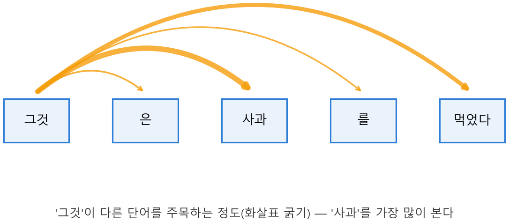

# Ch.20 · 전학생 한 명에 모두의 관계 : 어텐션·트랜스포머 — v0.20 ★피날레

> 이번 강: 책의 마지막. 9강부터 쌓아 온 모든 도구가 한자리에 모여 LLM의 심장 — **어텐션** — 을 만든다.
> 한 줄 요약: 문장 속 한 단어가 다른 모든 단어를 "얼마나 봐야 할지"를, **내적(11강)으로 닮음 점수를 매기고 softmax(17강)로 가중치를 만들어** 정합니다. 이 어텐션을 층층이 쌓은 게 트랜스포머, 곧 GPT예요.
> 핵심 개념: 어텐션 · Query·Key·Value · 어텐션 점수(내적) · 트랜스포머 · 위치 인코딩

---

## 이야기 파트

### 같은 단어, 다른 뜻

"사과를 먹었다"와 "사과를 했다". 똑같은 '사과'인데 뜻이 전혀 다릅니다. 무엇이 뜻을 갈랐나요? **주변 단어**예요. '먹었다'가 곁에 있으면 과일, '했다'가 곁에 있으면 미안하다는 그 사과. 즉 한 단어의 의미는 혼자 정해지지 않고, **문장 속 다른 단어들과의 관계**에서 나옵니다.

그러니 AI가 문장을 이해하려면, 각 단어가 **다른 단어들을 둘러보고** "내 뜻을 정하는 데 누가 중요하지?"를 따져야 합니다. '사과'는 '먹었다'를 많이 봐야 하고, 관사나 조사는 덜 봐도 되죠. 이렇게 **단어들이 서로를 얼마나 주목할지 정하는 장치**가 바로 **어텐션**(attention, 주목)입니다.

### 전학생의 질문

비유를 하나 들어 볼게요. 한 단어를 **새 교실에 들어온 전학생**이라고 합시다. 이 전학생('그것')은 자기 자리를 잡으려고 반 친구들(다른 단어들)에게 묻습니다. "내가 누구와 친해져야 하지?"

이때 세 가지가 등장합니다.

- **Query(질문)** — 전학생이 들고 다니는 질문. "나는 이런 걸 찾고 있어."
- **Key(이름표)** — 친구들이 각자 달고 있는 이름표. "나는 이런 사람이야."
- **Value(내용)** — 친구들이 실제로 가진 정보. "친해지면 이걸 줄게."

전학생은 자기 **Query**를 친구들의 **Key**에 하나씩 맞춰 봅니다. 질문과 이름표가 잘 맞을수록(닮을수록) "이 친구가 중요하다"는 점수가 높아져요. 그리고 이 "맞춰 보기", 즉 **두 벡터가 얼마나 닮았는지 재는 일**이 바로 **11강의 내적**입니다! Query와 Key를 내적하면 닮음 점수가 나오죠. 어텐션의 심장이 우리가 11강에서 배운 "짝지어 곱해 더하기" 한 줄이었던 거예요.

### 점수를 가중치로, 그리고 섞기

각 친구에 대한 점수가 나왔으면, 이제 그걸 "얼마나 주목할지"의 **비율**로 바꿔야 합니다. 점수 묶음을 다 더하면 1이 되는 비율로 — 어디서 봤죠? **17강의 softmax**(그리고 12강의 확률분포)입니다. softmax를 거치면 "친구 A에 42%, B에 16%, C에 42% 주목"처럼 깔끔한 가중치가 나와요.

마지막으로 전학생은 친구들의 **Value(내용)** 를 이 가중치대로 **섞어** 받습니다. 많이 주목한 친구의 내용은 듬뿍, 적게 주목한 친구의 것은 조금. 그렇게 버무린 결과가 전학생('그것')의 **새로운 의미**가 됩니다 — 주변과의 관계가 녹아든 의미죠. 문장의 모든 단어가 동시에 이 짓을 하면, 단어 하나하나가 문맥을 머금은 벡터로 다시 태어납니다.

*그림 20-1: '그것'이 문장 속 다른 단어들을 주목하는 정도(화살표가 굵을수록 많이 봄). 내적으로 점수를 매기고 softmax로 이 비율을 만든다.*

### 이것만은 기억하자

- **어텐션**은 한 단어가 다른 단어들을 "얼마나 주목할지" 정해, 문맥을 머금은 의미를 만드는 장치입니다.
- 방법은 셋 — 한 단어의 **Query**와 다른 단어들의 **Key**를 **내적(11강)** 해 닮음 점수를 내고, **softmax(17강)** 로 합이 1인 가중치로 바꾼 뒤, 그 가중치로 **Value를 섞습니다.**
- 이 어텐션을 여러 겹 쌓고(18강 층 구조), 역전파(19강)로 학습시킨 신경망이 **트랜스포머** — GPT의 뼈대입니다.
- 1강부터 19강까지 쌓은 모든 도구가 여기서 하나로 만납니다. 이게 이 책의 도착점이에요.

---

## 기술 파트

### 용어 정리

| 이야기 속 비유 | 진짜 용어 | 정식 정의 |
|--------------|----------|----------|
| 전학생의 질문 | Query $\vec q$ | 주목할 대상을 찾는 벡터 |
| 친구들의 이름표 | Key $\vec k$ | 각 단어가 내거는 벡터 |
| 친구들의 실제 내용 | Value $\vec v$ | 섞여서 전달될 정보 벡터 |
| 질문과 이름표의 닮음 | 어텐션 점수 | $\vec q \cdot \vec k$ (11강 내적) |
| 주목 비율(합 1) | 어텐션 가중치 | $\text{softmax}(\text{점수})$ (17강) |
| 어텐션을 쌓은 신경망 | 트랜스포머 | 어텐션 층의 반복 |

### 수식 1 — 어텐션 점수와 가중치

한 단어의 Query $\vec q$ 가 단어들의 Key $\vec k_1, \dots, \vec k_n$ 을 얼마나 주목할지는, 각각을 **내적**(11강)해 점수를 낸 뒤 **softmax**(17강)로 비율로 바꿔 구합니다.

$$\text{점수}_i = \vec q \cdot \vec k_i, \qquad \alpha_i = \text{softmax}(\text{점수}_i) = \frac{e^{\text{점수}_i}}{\sum_j e^{\text{점수}_j}}$$

$\alpha_i$ 가 "$i$ 번째 단어를 얼마나 볼지"의 가중치예요(모두 더하면 1). 내적이 클수록(Query와 Key가 닮을수록) 점수가 높고, softmax를 거쳐 더 큰 가중치를 받습니다.

### 수식 2 — 어텐션 전체 식

가중치 $\alpha_i$ 로 Value $\vec v_i$ 들을 가중합한 것이 그 단어의 어텐션 출력입니다.

$$\text{출력} = \sum_{i} \alpha_i\, \vec v_i$$

이걸 모든 단어에 대해 한꺼번에 행렬로 적으면(9강), 그 유명한 트랜스포머 어텐션 식이 됩니다.

$$\text{Attention}(Q, K, V) = \text{softmax}\!\left(\frac{QK^{\top}}{\sqrt{d}}\right)V$$

겁먹지 마세요, 전부 우리가 아는 것들입니다. $QK^{\top}$ 는 모든 Query와 Key의 **내적을 한 번에** 한 것(9강 행렬곱·전치), $\sqrt{d}$ 로 나누는 건 점수가 너무 커지지 않게 **안정시키는** 장치, $\text{softmax}$ 는 비율로 바꾸기(17강), 마지막 $V$ 를 곱하는 건 Value를 가중합하기. 한 줄에 9·11·17강이 다 들어 있죠.

### 계산 예제 1 : 어텐션 점수와 가중치 구하기

**문제.** Query $\vec q = (1, 0)$ 가 세 단어의 Key $\vec k_1 = (1,0)$, $\vec k_2 = (0,1)$, $\vec k_3 = (1,1)$ 을 주목하는 가중치를 구하세요. ($e^1 \approx 2.72$, $e^0 = 1$)

**1단계 — 내적으로 점수.** (11강)

$$\vec q\cdot\vec k_1 = 1\cdot1+0\cdot0 = 1,\quad \vec q\cdot\vec k_2 = 1\cdot0+0\cdot1 = 0,\quad \vec q\cdot\vec k_3 = 1\cdot1+0\cdot1 = 1$$

**2단계 — softmax로 가중치.** (17강)

$$e^{1}, e^{0}, e^{1} \approx 2.72,\ 1,\ 2.72 \quad\Rightarrow\quad \text{합} = 6.44$$
$$\alpha = \left(\frac{2.72}{6.44},\ \frac{1}{6.44},\ \frac{2.72}{6.44}\right) \approx (0.42,\ 0.16,\ 0.42)$$

**답.** 가중치는 약 $(0.42, 0.16, 0.42)$, 셋을 더하면 1입니다. Query와 점수가 높던 1번·3번 단어(점수 1)를 각각 42%씩 주목하고, 2번(점수 0)은 16%만 봅니다.

### 계산 예제 2 : Value를 섞어 출력 만들기

**문제.** 예제 1의 가중치 $\alpha = (0.42, 0.16, 0.42)$ 로, Value $\vec v_1 = (10, 0)$, $\vec v_2 = (0, 10)$, $\vec v_3 = (5, 5)$ 를 가중합해 어텐션 출력을 구하세요.

**1단계 — 각 Value에 가중치를 곱한다.**

$$0.42\,(10,0) = (4.2,\ 0),\quad 0.16\,(0,10) = (0,\ 1.6),\quad 0.42\,(5,5) = (2.1,\ 2.1)$$

**2단계 — 모두 더한다.**

$$\text{출력} = (4.2+0+2.1,\ \ 0+1.6+2.1) = (6.3,\ 3.7)$$

**답.** 어텐션 출력은 $(6.3, 3.7)$ 입니다. 많이 주목한 1번·3번 단어의 Value가 듬뿍, 덜 본 2번은 조금 섞였어요. 이 벡터가 바로 "주변 문맥이 녹아든 새 의미"입니다. 트랜스포머는 이 계산을 수천 개 단어, 수백 층에 걸쳐 거대한 행렬로 할 뿐이에요.

### 위치는 어떻게 알까 — 10강의 회전

어텐션에는 한 가지 빈틈이 있습니다. 내적은 순서를 모릅니다 — "철수가 영희를 본다"와 "영희가 철수를 본다"의 단어들을 그냥 섞으면 누가 누구를 봤는지 사라져요. 그래서 트랜스포머는 각 단어에 **위치 정보**를 더해 넣습니다. 이때 쓰는 게 **10강의 복소수 회전**이에요. 단어의 자리(첫째·둘째·셋째…)를 각기 다른 **회전각**으로 바꿔 표시하면($e^{i\theta}$, 칼럼①), 모델이 "이 단어가 몇 번째인지"를 읽을 수 있습니다. 10강에서 "회전을 곱셈으로"라고 배우고 칼럼①에서 $e^{i\theta}$ 로 만난 그 회전이, 여기 **위치 인코딩**으로 일하러 나온 거예요.

### 연습문제

> 해답은 부록에 모았습니다. 손으로 먼저 풀어 보세요.

**1.** 어텐션에서 Query와 Key로 "닮음 점수"를 낼 때 쓰는 연산은 무엇인가요? (몇 강에서 배웠나요?)

**2.** 어텐션 점수를 "합이 1인 가중치"로 바꿀 때 쓰는 함수는 무엇인가요? (몇 강?)

**3.** Query $\vec q=(2,0)$ 와 Key $\vec k_1=(1,0)$, $\vec k_2=(0,3)$ 의 어텐션 점수를 각각 구하세요. 어느 Key를 더 주목하게 될까요?

**4.** 어텐션 가중치가 $(0.5, 0.5)$ 이고 Value가 $\vec v_1=(2,0)$, $\vec v_2=(0,4)$ 일 때 어텐션 출력을 구하세요.

### 이게 AI 어디에 쓰이나 — 그리고 우리의 도착점

어텐션은 **트랜스포머**의 핵심이고, 트랜스포머는 GPT·Claude를 비롯한 거의 모든 현대 LLM의 뼈대입니다. 모델은 문장을 단어 벡터로 바꾸고(임베딩), 위치 인코딩을 더한 뒤, 어텐션 층을 수십·수백 번 통과시켜 단어마다 문맥을 머금게 합니다. 마지막에 softmax로 "다음 단어 확률"을 뽑아 한 단어씩 글을 이어 가죠. 우리가 12강에서 본 "'좋다' 62%…"가 이 모든 과정의 끝에서 나온 결과입니다.

여기서 잠깐, 우리가 걸어온 길을 돌아봅시다. **9강의 행렬**이 단어를 한 번에 섞고, **10강의 회전**이 순서를 새기고, **11강의 내적**이 단어들의 관계를 재고, **12·17강의 확률·softmax**가 그걸 비율로 바꾸고, **16~18강의 뉴런·층·순전파**가 그물을 짜고, **19강의 역전파**가 그 그물을 데이터로 학습시킵니다. 그리고 그 모든 학습의 뿌리에는 **1강의 최솟값, 5강의 미분, 8강의 경사하강** — "손실을 가장 낮은 곳으로"라는 이 책의 척추가 있었어요.

처음에 우리는 'AI가 배운다'는 말 하나를 이해하고 싶었습니다. 이제 그 문장은 수식으로 또렷합니다 — **예측하고(순전파), 틀린 만큼 손실을 재고(MSE), 그 손실의 기울기를 거꾸로 구해(역전파), 가장 낮은 곳으로 한 걸음씩 내려가는 것($\theta \leftarrow \theta - \eta\nabla L$).** 거대한 LLM도 결국 이 한 문장의 어마어마한 반복일 뿐입니다. 어렵다고 미뤄 뒀던 그 수학이, 사실은 손으로 풀 수 있는 친절한 도구였다는 것 — 그게 이 책이 끝까지 보여 주고 싶었던 한 가지입니다.
