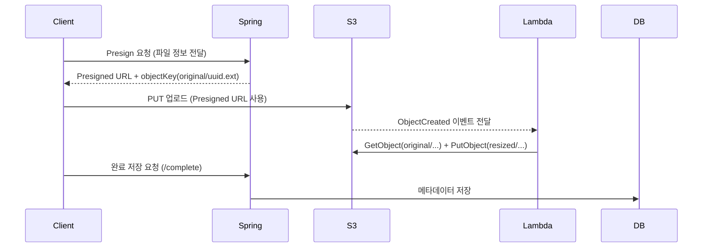

# 5.2 아키텍처 구조

presigned 업로드 흐름의 구성요소, 데이터 흐름, 규칙을 한눈에 정리합니다.

## **1) 전체 아키텍처**

Spring API는 presigned 발급, 완료 저장, 조회 API를 담당합니다. S3는 업로드 원본과 리사이즈 결과를 저장하며, Lambda는 S3 이벤트를 받아 이미지를 처리합니다. H2는 메타 데이터를 저장하고, Postman은 전체 흐름 테스트에 사용합니다.

---

---

## **2) 데이터 흐름 요약**

1. Client → Spring: Presigned URL 발급 요청(업로드용 key 포함)
2. Client → S3: Presigned URL로 원본 업로드(original/uuid.ext)
3. S3 → Lambda: 업로드 이벤트 발생 → 리사이즈 처리
4. Lambda → S3: 결과 저장(resized/uuid.jpg)
5. Client → Spring: /complete 호출 → Spring → DB: 메타데이터 저장

---

## **3) 완료 저장 규칙**

/complete는 “업로드가 끝났다”는 **최종 확정 신호**입니다. 서버는 **key 규칙**만 신뢰하고, 리사이즈 결과 경로는 resized/{uuid}.jpg로 **서버가 직접 조합**해 저장합니다.

AWS 환경에서는 `localhost`가 Lambda 자신을 의미하므로 로컬 서버에 도달할 수 없습니다. 따라서 서버가 직접 리사이즈 URL을 조합해 저장하는 구조를 사용합니다.