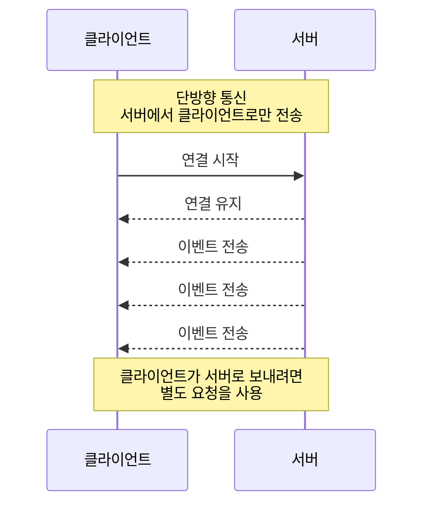

# 6.3 SSE 구현 (Server-Sent Events)



SSE는 서버가 클라이언트에게 이벤트를 계속 밀어주는 단방향 스트리밍 방식입니다. 이 실습에서는 채팅 메시지를 저장하면 서버가 연결된 모든 브라우저에 즉시 전파하는 흐름을 구현합니다.

---

SSE 구현은 ****아래 깃주소를 git clone 하고 직접 서버를 실행하여 실습합니다.

**실습 코드**

```java
https://github.com/metacoding-11-spring-reference/spring-sse
```

---

## **1) SSE 서버 구현**

### **1. SSE - Emitter 레지스트리**

**(확인) 경로: src/main/java/com/metacoding/sse/config/SseEmitters.java**

### **1.1 클래스 선언과 저장소**

```java
@Slf4j
@Component
public class SseEmitters {

    private final Map<String, SseEmitter> emitters = new ConcurrentHashMap<>();
```

emitters: 접속 중인 클라이언트의 SseEmitter를 보관하는 레지스트리입니다.

ConcurrentHashMap: 다중 요청/다중 스레드 환경에서 안전하게 추가/삭제하기 위한 선택입니다.

<aside>
💡

ConcurrentHashMap을 쓰는 이유는 SSE처럼 **여러 요청/스레드가 동시에 연결 목록(Map)을 추가·삭제·순회**하기 때문입니다. HashMap은 동시 접근 시 데이터 꼬임이나 예외가 날 수 있지만, ConcurrentHashMap은 이런 상황에서도 **스레드 안전하게 emitter를 관리**할 수 있어 연결 레지스트리(emitters)에 기본으로 사용합니다.

</aside>

---

### **1.2 add()**

**클라이언트 연결 등록**

```java
public SseEmitter add(String clientId, SseEmitter emitter) {
    if (emitters.containsKey(clientId)) {
        SseEmitter prevEmitter = emitters.get(clientId);
        prevEmitter.complete();
    }

    emitters.put(clientId, emitter);
```

clientId 기준으로 emitter를 등록합니다(세션 id )

같은 clientId가 이미 연결되어 있으면 기존 emitter를 complete()로 종료하고 새 emitter로 교체합니다.

이렇게 하면 “동일 사용자 중복 연결”이 생겨도 레지스트리가 깔끔하게 유지됩니다.

 **정리 핸들러 설정**

```java
    final SseEmitter currentEmitter = emitter;
    emitter.onCompletion(() -> emitters.remove(clientId, currentEmitter));
    emitter.onTimeout(() -> emitter.complete());
    emitter.onError((e) -> emitter.complete());

    return emitter;
}
```

onCompletion: 연결이 정상 종료되면 레지스트리에서 제거합니다.

onTimeout: 타임아웃이 나면 emitter를 종료합니다.

onError: 에러가 발생해도 emitter를 종료합니다.

핵심은 “끊긴 연결을 Map에 계속 들고 있지 않도록 정리”하는 것입니다.

---

### **1.3 sendAll(): 현재 연결된 모든 클라이언트에게 브로드캐스트**

```java
public void sendAll(Chat chat) {
    emitters.entrySet().forEach(entry -> {
        String clientId = entry.getKey();
        SseEmitter emitter = entry.getValue();

        try {
            emitter.send(SseEmitter.event()
                    .name("chat")
                    .data(chat));
        } catch (Exception e) {
            emitter.complete();
            emitters.remove(clientId);
        }
    });
}
```

모든 emitter에 동일한 이벤트를 전송하는 “브로드캐스트” 메서드입니다.

이벤트 이름은 "chat"으로 고정했고, 클라이언트는 이 이벤트를 구독해서 화면을 갱신합니다.

전송 중 실패하면 해당 emitter는 종료하고 Map에서 제거하여 “죽은 연결”을 정리합니다.

---

### **2. SSE - 컨트롤러**

### **2.1 SSE 연결 엔드포인트: /chats/connect**

**(입력) 경로: src/main/java/com/metacoding/sse/chat/ChatController.java**

```java
@GetMapping(value = "/chats/connect", produces = MediaType.TEXT_EVENT_STREAM_VALUE)
public ResponseEntity<SseEmitter> connect() {
    String clientId = session.getId();
    SseEmitter emitter = new SseEmitter(60 * 1000L);

    sseEmitters.add(clientId, emitter);
```

이 엔드포인트는 브라우저가 EventSource로 접속할 때 **SSE 스트림 연결을 생성**하는 역할을 합니다. 

서버는 SseEmitter를 만들어 연결을 유지하며, 60초를 만료 시간으로 설정해 일정 시간 동안 이벤트가 없으면 연결을 정리할 수 있도록 합니다. 

또한 HttpSession의 세션 ID를 clientId로 사용해 “어떤 클라이언트의 연결인지”를 식별하고, 생성한 emitter를 레지스트리(SseEmitters)에 등록해 이후 sendAll() 같은 브로드캐스트 시점에 해당 연결로 이벤트를 전송할 수 있게 합니다.

<aside>
💡

produces = MediaType.TEXT_EVENT_STREAM_VALUE`는 

이 응답이 일반 JSON이 아니라 `text/event-stream` 형식의 SSE 스트림임을 선언하는 설정입니다. 이 설정이 있어야 스프링이 연결을 끊지 않고 유지하며, `emitter.send()`가 호출될 때마다 이벤트를 스트리밍 방식으로 클라이언트에 즉시 전달할 수 있습니다.

</aside>

---

```java
    try {
        emitter.send(SseEmitter.event().name("connect").data("connected"));
    } catch (Exception e) {
        emitter.complete();
    }

    return ResponseEntity.ok(emitter);
}
```

연결 직후 "connect" 이벤트를 한 번 보내 “연결이 열렸다”는 것을 클라이언트가 확인할 수 있게 합니다.

최종적으로 emitter를 반환하면 브라우저는 스트림 연결을 유지합니다.

<aside>
💡

connect 이벤트를 보내는 이유

브라우저 EventSource는 서버 정한 시간동안 **데이터를 push하지 않으면 재연결을 시도하고**
재연결시 403(**세션/CSRF/권한 검증**)에러가 나기에 더미데이터를 보내어 연결을 유지하도록 합니다.

</aside>

---

### **2.4 채팅 저장 API: 저장 후 즉시 브로드캐스트**

```java
@PostMapping("/chats")
@ResponseBody
public Chat save(@RequestBody ChatRequest req) {
    Chat saved = chatService.save(req);
    sseEmitters.sendAll(saved);
    return saved;
}
```

클라이언트가 메시지를 보내면 DB에 저장합니다.

저장된 결과(saved)를 sendAll()로 모든 SSE 연결에게 즉시 전송합니다.

즉, “저장 성공 → 바로 실시간 전파”가 SSE 흐름의 핵심입니다.

---

### **2.5 채팅 목록 API(초기 로딩용)**

```java
@GetMapping("/chats")
@ResponseBody
public List<Chat> list() {
    return chatService.findAll();
}
```

페이지 최초 진입 시 기존 채팅 목록을 그리기 위한 일반 조회 API입니다.

실시간은 SSE로 받고, 초기 데이터는 GET으로 한 번 가져오는 구조입니다.

---

## **2) Front(SSE) - index.mustache**

**(확인) 경로: src/main/resources/templates/index.mustache**

### **1. EventSource로 SSE 스트림 연결**

```java
const sse = new EventSource("/chats/connect");
```

/chats/connect에 연결을 열어두면 서버가 이벤트를 push할 수 있습니다.

---

### **2. 연결 확인 이벤트 수신**

```jsx
sse.addEventListener("connect", (e) => {
  console.log("connected:", e.data);
});
```

서버가 연결 직후 보낸 "connect" 이벤트를 받습니다.

---

### 3. **chat 이벤트 수신 → 화면 반영**

```jsx
sse.addEventListener("chat", (e) => {
  const chat = JSON.parse(e.data);
  appendChat(chat.message);
});
```

서버의 sendAll()이 .name("chat").data(chat)로 보낸 이벤트를 수신합니다.

데이터를 파싱해 메시지를 즉시 화면에 추가합니다.

---

### **4. 메시지 전송(HTTP POST)**

```jsx
async function sendMessage() {
  const messageInput = document.getElementById("message");
  const message = messageInput.value.trim();

  await fetch("/chats", {
    method: "POST",
    headers: { "Content-Type": "application/json" },
    body: JSON.stringify({ message })
  });

  messageInput.value = "";
  messageInput.focus();
}
```

SSE는 “서버 → 클라이언트” 단방향이므로, 클라이언트 → 서버 전송은 HTTP POST로 처리합니다.

---

### **5. 화면 추가 함수**

```jsx
function appendChat(message) {
  const box = document.getElementById("chat-box");
  const li = document.createElement("li");
  li.innerText = message;
  box.prepend(li);
}
```

새 메시지를 상단에 쌓기 위해 prepend를 사용합니다.

---

## 3) SSE 실행

서버를 실행하여 결과를 확인합니다.

/image.png)

실행시 브라우저에서 /chats/connect로 eventsource 요청되어 스트림이 연결됩니다.

/image%201.png)

EventStream에서는 더미데이터로 보낸 connected 데이터를 확인할 수 있습니다.

---

 

/image%202.png)

/image%203.png)

메세지를 요청하면 연결된 스트림에 chat으로 메세지가 서버에서 클라언트로 send된 걸 확인할 수 있습니다.