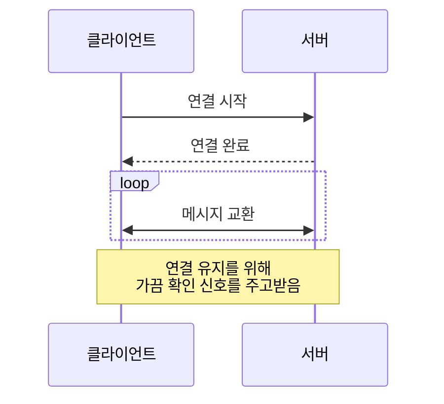
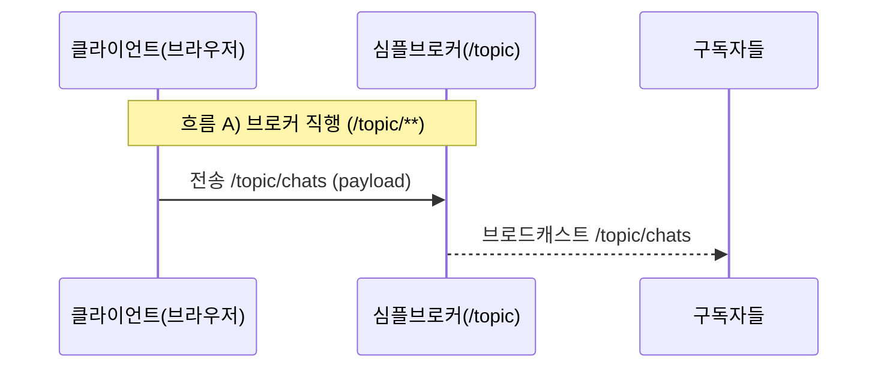
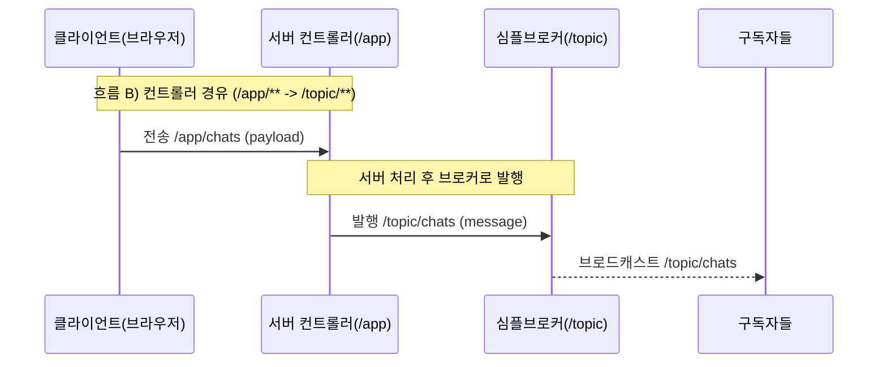

# 6.4 WebSocket 구현 (STOMP)

## WebSocket 시퀸스 다이어그램



WebSocket은 HTTP처럼 요청할 때마다 새로 연결하는 방식이 아니라, 처음에 한 번 연결을 맺고 그 연결을 계속 유지하면서 서버와 클라이언트가 실시간으로 메시지를 주고받는 통신 방식입니다.

---

WebSocket 구현은 ****아래 깃주소를 git clone 하고 직접 서버를 실행하여 실습합니다.

**실습코드**

```java
https://github.com/metacoding-11-spring-reference/spring-websoket.git
```

---

## **1) 2가지 흐름**

이번 실습에서는 WebSocket(STOMP)을 목적지 기반 pub/sub 구조로 이해하고, 메시지 흐름이 /topic/**로 브로커에 직접 전송되는 방식과 /app/**로 서버 컨트롤러에 전송되어 처리 후 /topic/**로 발행되는 방식 두 가지로 나뉜다는 점을 확인합니다. 실습 구현은 컨트롤러 경유(/app/chats → /topic/chats) 흐름을 사용합니다.

---

### **1. 브로커 직행**



브로커 직행 흐름은 클라이언트가 목적지(/topic/**)로 바로 메시지를 보내는 방식입니다. 이 경우 서버 컨트롤러 로직을 거치지 않고, 심플 브로커가 해당 토픽을 구독 중인 모든 클라이언트에게 즉시 브로드캐스트합니다.

---

### **2. 컨트롤러 경유**



컨트롤러 경유 흐름은 클라이언트가 /app/**로 메시지를 보내 서버의 @MessageMapping 메서드가 먼저 처리하는 방식입니다. 컨트롤러는 메시지 가공이나 검증 같은 작업을 수행한 뒤, SimpMessagingTemplate을 통해 /topic/**로 발행하고, 마지막 전달은 브로커가 구독자에게 브로드캐스트합니다.

---

## **2) WebSocket 서버 구성**

**(확인) 경로: src/../build.gradle**

```
// Spring에서 WebSocket(STOMP 포함) 서버를 구성하고 메시지 브로커 기능을 사용하기 위한 의존성
implementation 'org.springframework.boot:spring-boot-starter-websocket'
```

WebSocket(STOMP) 실습을 위해 spring-boot-starter-websocket 의존성을 추가합니다. 이 의존성이 있어야 스프링이 WebSocket 연결과 STOMP 메시지 처리를 지원합니다.

---

**(확인) 경로: src/main/java/com/metacoding/websocket/config/WebSocketConfig.java**

```java
@Configuration
@EnableWebSocketMessageBroker
public class WebSocketConfig implements WebSocketMessageBrokerConfigurer {

    @Override
    public void registerStompEndpoints(StompEndpointRegistry registry) {
        registry.addEndpoint("/ws")
                .setAllowedOriginPatterns("*");
    }

    @Override
    public void configureMessageBroker(MessageBrokerRegistry registry) {
        registry.setApplicationDestinationPrefixes("/app");
        registry.enableSimpleBroker("/topic");
    }
}

```

WebSocket의 라우팅 규칙은 WebSocketConfig에서 결정됩니다. /ws는 브라우저가 연결을 맺는 엔드포인트이고, /app은 서버 컨트롤러로 들어가는 메시지 경로, /topic은 브로커가 중계하는 구독 채널 경로입니다. 즉 /app과 /topic을 분리해 “컨트롤러 경유”와 “브로커 전달” 흐름을 명확히 나눕니다.

---

**(확인) 경로: src/main/java/com/metacoding/websocket/chat/ChatController.java**

```java
@RequiredArgsConstructor
@Controller
public class ChatController {

    private final ChatService chatService;
    private final SimpMessagingTemplate messagingTemplate;

    @MessageMapping("/chats")
    public void handle(ChatRequest payload) {
        Chat saved = chatService.save(payload);
        messagingTemplate.convertAndSend("/topic/chats", saved);
    }
}
```

이 컨트롤러는 WebSocket으로 들어온 채팅 메시지를 받아 먼저 DB에 저장하고, 저장된 결과를 /topic/chats로 발행(publish)합니다. 즉 클라이언트가 보낸 메시지가 “서버 처리(저장) → 브로커 발행 → 구독자 수신” 순서로 흘러가도록 만드는 것이 이 실습의 기본 흐름입니다.

<aside>
💡

클라이언트에서 `SEND`할 때는 `/app/chats`처럼 **prefix가 붙은** 목적지로 보내야 합니다. 이는 `WebSocketConfig`의 `setApplicationDestinationPrefixes("/app")` 설정 때문에, 서버의 `@MessageMapping("/chats")`는 실제로 `/app/chats` 목적지에 매칭되기 때문입니다.

</aside>

반면 컨트롤러 코드에서 @MessageMapping에 /app을 직접 쓰지 않는 이유는, **prefix는 설정에서 공통으로 붙는 규칙**이기 때문입니다. 개발자는 매핑할 “실제 경로 부분(/chats)”만 적고, 앞의 /app은 설정이 자동으로 붙여주는 구조로 이해하면 됩니다.

그리고 /topic/chats는 브로커가 전달하는 구독 채널이므로, 클라이언트는 SUBSCRIBE /topic/chats로 수신을 받게 됩니다.

---

## **3) Front 구현 (Vanilla JS)**

### **1) 연결 객체 만들기 (WebSocket + STOMP)**

```jsx
const socketUrl = (location.protocol === "https:" ? "wss://" : "ws://") + location.host + "/ws";
const stompClient = Stomp.over(new WebSocket(socketUrl));
```

브라우저는 /ws로 연결을 맺고, 그 위에 STOMP를 얹어 목적지 기반 전송(/app/**)과 구독(/topic/**)을 사용합니다.

---

### **2) 연결 성공 시 구독 설정**

```jsx
stompClient.connect({}, () => {
  stompClient.subscribe("/topic/chats", (msg) => {
    const data = JSON.parse(msg.body);
    appendChat(data.message);
  });
});

```

연결 성공 후 /topic/chats를 구독하면 서버가 발행하는 메시지를 실시간으로 수신합니다.

---

### **3) 메시지 전송**

```jsx
function sendMessage() {
  const messageInput = document.getElementById("message");
  const message = messageInput.value.trim();

  if (!stompClient.connected) {
    alert("연결 중입니다. 잠시 후 다시 시도하세요.");
    return;
  }

  stompClient.send("/app/chats", {}, JSON.stringify({ message }));
  messageInput.value = "";
  messageInput.focus();
}

```

전송은 /app/chats로 보내고, 서버 컨트롤러가 처리한 뒤 /topic/chats로 브로드캐스트합니다.

---

### **4) 화면에 메시지 추가하기**

```jsx
function appendChat(message) {
  const box = document.getElementById("chat-box");
  const li = document.createElement("li");
  li.innerText = message;
  box.prepend(li);
}

```

수신한 메시지를 <li>로 만들어 <ul id="chat-box">에 추가합니다. prepend를 쓰기 때문에 최신 메시지가 위로 쌓입니다.

---

## **4) WebSocket 특징 정리**

WebSocket은 연결을 한 번 맺으면 끊기 전까지 양방향으로 메시지를 주고받을 수 있어 실시간 UX가 가장 뛰어납니다. 대신 연결이 유지되는 동안 끊김과 재연결, 중복 구독, 인증 갱신 같은 상태 관리 문제가 생기기 쉬워 운영 관점의 처리가 필요합니다. 또한 서버를 여러 대로 확장할 경우에는 세션이 어느 서버로 붙는지(스티키)와 브로커를 어떻게 분산할지 같은 구조적 고려가 뒤따르게 됩니다.

---

## 5) WebSocket 실행

서버를 실행하여 결과를 확인합니다.

/image.png)

DevTools 에서 ws요청을 확인합니다.

---

/image%201.png)

/topic/chats으로 구독이 되었습니다.

---

/image%202.png)

클라이언트가 메시지를 **/app/chats로 SEND**하면 서버의 @MessageMapping("/chats")가 이를 받아 저장 같은 처리를 한 뒤, 결과를 **/topic/chats로 PUBLISH**합니다. 

그러면 SUBSCRIBE /topic/chats로 구독 중인 모든 연결(클라이언트)에게 브로커가 메시지를 전달하고, 그 메시지가 화면에 반영되는 것을 확인할 수 있습니다.

---