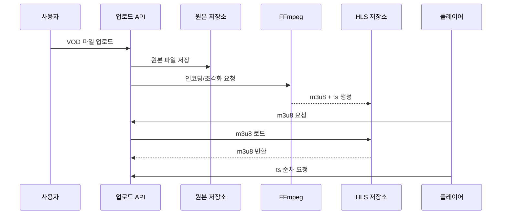

# 7.1 준비

스트리밍 실습에서는 **VOD 방식**을 사용합니다. 즉, 사용자가 영상을 업로드하면 서버가 이를 **HLS(m3u8/ts)** 형태로 변환하고, 재생 시에는 조각 파일을 순서대로 받아 보도록 구성합니다. 실습을 시작하기 전에 **대표적인 스트리밍 방식 4가지(VOD, 라이브, CCTV, WebRTC)** 와 각각의 사용 예시를 간단히 비교해 봅니다.

---

## **1) 스트리밍 방식 4가지 비교**

| **방식** | **한 줄 정의** | **지연(느낌)** | **프로토콜(전송 방식)** | **대표 기술/도구(프로토콜 외)** | **언제 쓰는지(대표 상황)** | **예시 서비스/상황** |
| --- | --- | --- | --- | --- | --- | --- |
| **VOD** | 녹화된 영상을 올려두고 보는 방식 | 조금 있음 | **HLS(HTTP 기반)** | **FFmpeg(변환)**, **CDN(전송 가속)** | 업로드한 영상을 **많은 사람이 안정적으로** 볼 때 | 유튜브 업로드 영상, 넷플릭스, 온라인 강의 |
| **실시간 방송(라이브)** | 지금 찍는 영상을 바로 보내는 방식 | 약간 있음 | **RTMP(송출: 방송자→서버)**, **HLS(시청: 서버→시청자)** | **OBS(송출 도구)**, **FFmpeg/트랜스코딩(서버에서 변환)** | 지금 방송을 **동시에 많은 사람이** 볼 때 | 유튜브/트위치 라이브, 라이브커머스 |
| **CCTV** | 카메라 화면을 계속 감시하는 방식 | 약간 있음 | **RTSP(카메라→서버/뷰어)** | **NVR/DVR(녹화/관리)** | 매장/시설을 **계속 모니터링/녹화**할 때 | 매장 CCTV, 공장 설비 모니터 |
| **WebRTC(화상통신)** | 서로 대화하듯 거의 실시간으로 보는 방식 | 거의 없음 | **WebRTC** | **연결보조 서버(환경에 따라)** | 사람끼리 **대화/상담**처럼 상호작용할 때 | 줌, 구글밋, 1:1 상담 |

**핵심만 기억하기**

- **많은 사람이 보는 영상 서비스** → 보통 **VOD**
- **방송처럼 “지금” 보여줘야 함** → **라이브**
- **감시/모니터링 목적** → **CCTV**
- **대화/상호작용(끊기면 안 됨)** → **WebRTC**

---

## **2) VOD 회사 예시 (유튜브, 넷플릭스)**

- **유튜브(VOD)**: 영상을 업로드해두면 사람들이 원하는 시간에 봅니다.
- **넷플릭스(VOD)**: 영화/드라마를 서버에 올려두고, 사용자가 골라서 봅니다.
- 공통점은 “미리 만들어 둔 영상”을 사람들이 스트리밍으로 받아 보는 구조입니다.

---

## **3) VOD가 동작하는 아주 쉬운 흐름**

1. 사용자가 영상을 **업로드**한다
2. 서버가 영상을 **보기 편한 형태로 변환**한다
3. 사용자는 **재생 버튼**을 누르면, 영상이 끊기지 않게 **조각조각** 받아서 재생된다

---

## **4) 스트리밍 파이프라인 개요**

1. 사용자가 원본 영상을 업로드하면 서버가 파일을 저장합니다.
2. FFmpeg가 원본을 인코딩하고 HLS 조각(m3u8/ts)을 생성합니다.
3. 플레이어는 m3u8을 요청하고, 목록에 있는 ts를 순서대로 다운로드합니다.

---