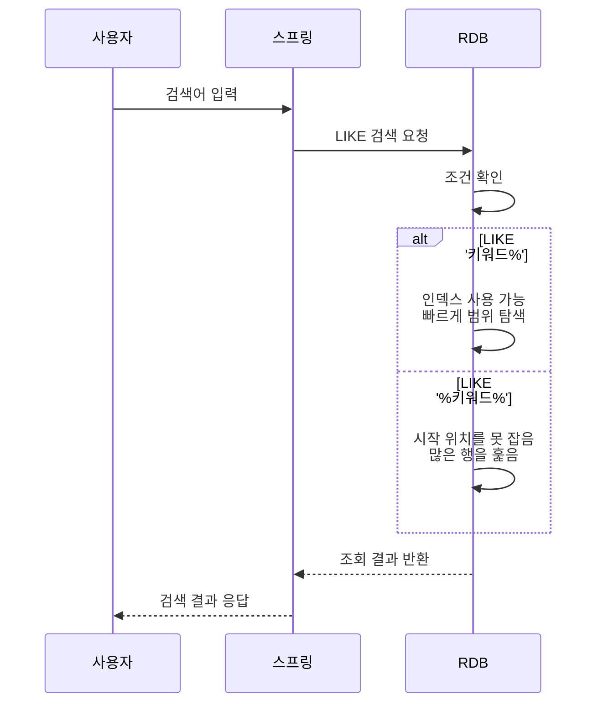
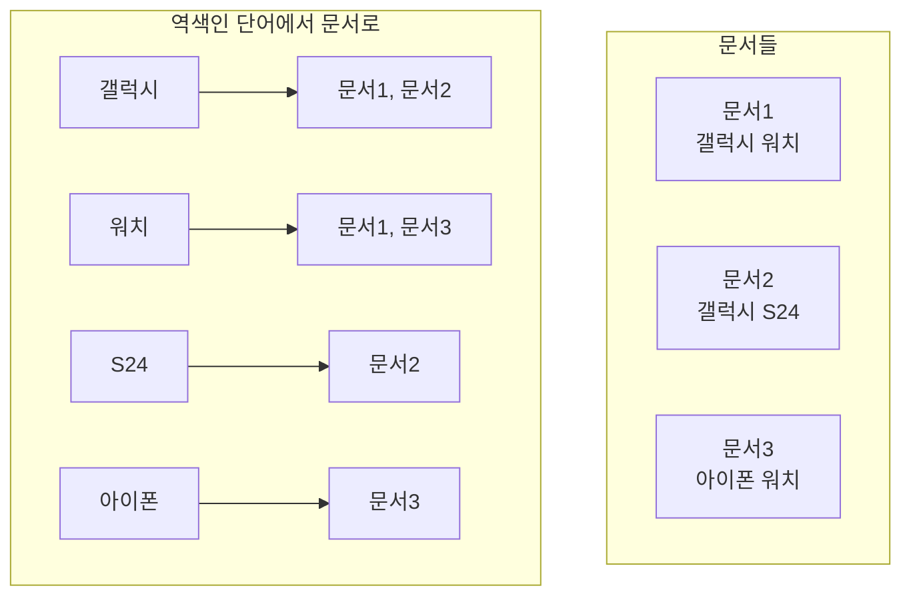

# 8.1 왜 Elasticsearch가 필요한가

---

## **1) RDB LIKE 검색의 한계**

RDB는 본래 **정확한 조건 조회(=, 범위, 조인)** 에 강합니다. 하지만 “검색창”처럼 사용자가 문장을 입력하고, 오타도 나고, 관련도를 따져 정렬해야 하는 요구에는 LIKE만으로 한계가 빠르게 드러납니다.



---

### **1. 선행 와일드카드로 인한 인덱스 무력화**

```sql
SELECT *
FROM device_entity
WHERE content LIKE '%갤럭시%';
```

DB 인덱스는 책 맨 뒤의 “찾아보기”처럼 특정 값을 빠르게 찾기 위한 정렬된 목록입니다. 

이 구조는 “갤럭시로 시작하는 글”처럼 앞부분이 정해진 조건(예: LIKE '갤럭시%')에서는 빠르게 찾을 수 있지만, “어디엔가 갤럭시가 들어있는 글”(예: LIKE '%갤럭시%')처럼 앞이 비어 있으면 어느 위치를 찾아가야 할지 몰라 결국 많은 데이터를 훑게 됩니다.

결과적으로 DB는 많은 경우 **행을 대량으로 훑는 방식(전체 스캔/대량 스캔)** 으로 처리하게 되고, 데이터가 커질수록 비용이 급격히 증가합니다.

정리하면, LIKE '%키워드%' 는 작은 데이터에서는 편하지만, 검색 트래픽이 늘거나 데이터가 커지면 전체 속도를 느리게 만드는 지점(병목)이 되기 쉽습니다.

---

### **2. 단어 단위 검색/오타 허용의 부재**

```sql
-- "갤럭시"를 "갈럭시"로 입력하면 매칭 실패
SELECT *
FROM device_entity
WHERE content LIKE '%갈럭시%';
```

LIKE는 기본적으로 “문자열에 그 글자가 포함되었나”를 보는 수준이라 아래 기능을 직접 만들기 어렵습니다.

- **단어 단위 검색(토큰화)**: “갤럭시 s24 울트라”에서 “울트라”만 검색해도 잘 나오게 만들기
- **오타 허용**: “갈럭시”처럼 한 글자 틀려도 결과에 포함
- **동의어 처리**: “휴대폰” 검색 시 “스마트폰”도 함께 찾기
    - **관련도 점수(랭킹)**: 제목/본문/태그 중 어디에 있느냐에 따라 결과를 더 그럴듯하게 정렬

즉, 검색 품질을 올리려면 결국 애플리케이션에서 별도 로직을 붙이거나, 다른 검색 엔진을 붙이는 방향으로 가게 됩니다.

---

## **2) Elasticsearch: Full-text Search와 분석기(Analyzer) 기반 검색**

Elasticsearch는 “검색”을 위해 설계된 엔진입니다. 핵심은 두 가지입니다.

1. **분석기(Analyzer)** 로 텍스트를 단어 단위로 쪼갭니다.
2. 그 단어들을 **역색인(Inverted Index)** 형태로 저장해 빠르게 찾습니다.

<aside>
💡

역색인(Inverted Index)은 “문서를 처음부터 끝까지 훑는 방식”이 아니라, **단어를 기준으로 어떤 문서에 들어있는지 미리 목록을 만들어두는 구조**입니다.

### **예시**

### **문서 3개가 있다고 가정**

- 문서1: “갤럭시 워치”
- 문서2: “갤럭시 S24”
- 문서3: “아이폰 워치”

### **역색인(단어 → 문서 목록)**

- 갤럭시 → [문서1, 문서2]
- 워치 → [문서1, 문서3]
- S24 → [문서2]
- 아이폰 → [문서3]

검색어가 “워치”면, DB처럼 모든 문서를 스캔하는 게 아니라 **역색인에서 “워치” 키만 보고 [문서1, 문서3]으로 바로 점프**합니다.

---



</aside>

---

**(확인) 경로: src/main/java/com/metacoding/spring_elasticsearch/ElasticSearch/ElasticSearchService.java**

### **1. 분석기 기반 match/multi_match 검색**

```java
public List<DeviceEntity> searchAll(String keyword) {
    NativeQuery query = NativeQuery.builder()
            .withQuery(q -> q.bool(b -> b
                    .should(s -> s.multiMatch(m -> m
                            .fields("title^3", "content")
                            .query(keyword)
                            .fuzziness("AUTO")))
                    .minimumShouldMatch("1")))
            .build();
    ...
}
```

여기서 알아야 할 포인트는 3가지입니다.

- **multi_match**: 여러 필드에서 동시에 검색합니다.
    - 예: title, content 둘 다에서 찾습니다.
- **title^3**: 제목에 **가중치**를 줍니다.
    - 같은 단어가 본문에 있는 것보다 제목에 있으면 더 중요한 문서로 판단하도록 점수를 올립니다.
- **bool + should + minimumShouldMatch(“1”)**: 여러 조건 중 하나라도 맞으면 결과에 포함시키되, 최소 1개는 맞아야 한다는 의미입니다.
    - 검색에서는 “완전 일치”만 고집하기보다 “관련 있는 것”을 넓게 가져오고 점수로 정렬하는 방식이 흔합니다.

정리하면, Elasticsearch는 단순 포함 여부가 아니라 **검색 품질(관련도)** 을 코드로 설계할 수 있습니다.

---

### **2. 오타 허용(Fuzzy)까지 포함한 검색 품질**

```java
public List<DeviceEntity> searchAll(String keyword) {
    ...
    .fuzziness("AUTO");
    ...
}
```

- Fuzzy는 입력 단어가 조금 틀려도(철자/타이핑 실수) 비슷한 단어를 매칭해 주는 기능입니다.
    
    ```
    사용자 입력: 갈럭시
    실제 데이터: 갤럭시
    ```
    
- AUTO는 단어 길이에 따라 “얼마나 틀린 것을 허용할지”를 자동으로 조절합니다.
    - 예: “갤럭시” ↔ “갈럭시”처럼 한 글자 정도 틀린 케이스를 결과에 포함시키는 식입니다.

사용자 검색창에서는 오타가 매우 흔하기 때문에, 오타 허용 여부가 검색 만족도를 크게 좌우합니다. RDB LIKE로는 이 품질을 만들기 어렵고, Elasticsearch는 기능으로 제공합니다.

---