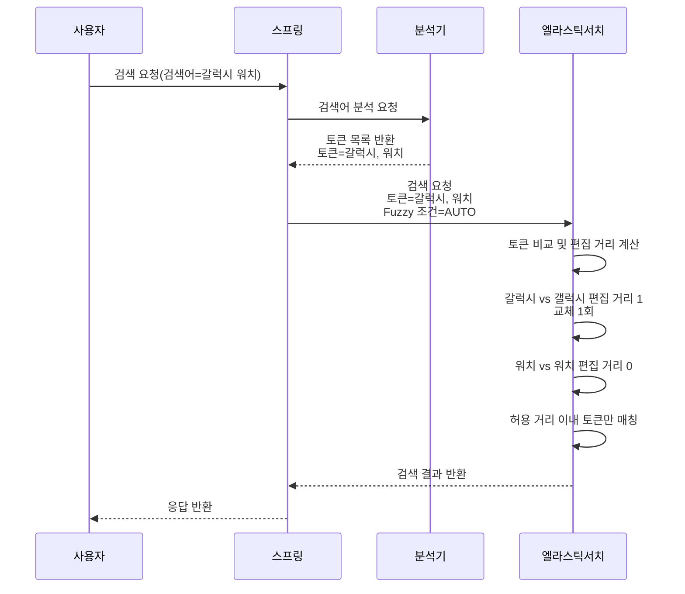
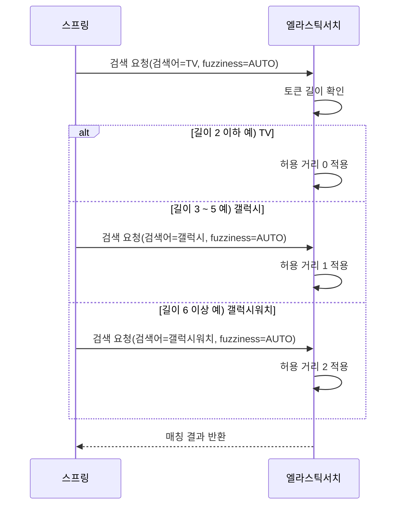

# 8.7 오타 허용 검색(Fuzzy) 개념과 적용 기준

이번 절에서는 Elasticsearch가 오타가 있는 검색어도 “비슷한 단어”로 판단해 결과를 찾아주는 Fuzzy 검색 개념을 정리합니다. 

---

## **1) Fuzzy는 “토큰 단위 + 편집 거리”로 동작합니다.**



Elasticsearch는 텍스트를 그대로 비교하지 않고, 분석기(Analyzer)가 문장을 단어 단위로 쪼개 만든 토큰을 기준으로 검색합니다. Fuzzy도 전체 문장이 아니라 토큰 단위로 오타 허용 여부를 판단합니다.

```java
예) 입력 문장: 갤럭시 워치
분석 토큰: ["갤럭시", "워치"]
```

Fuzzy는 토큰끼리 얼마나 비슷한지를 판단할 때 편집 거리(Edit Distance)를 사용합니다. 편집 거리는 한 단어를 다른 단어로 만들기 위해 필요한 최소 수정 횟수이며, 수정 방법은 아래 3가지입니다.

- 교체(Replace): 한 글자를 다른 글자로 바꿈
- 추가(Insert): 글자를 하나 더 넣음
- 삭제(Delete): 글자를 하나 뺌

편집 거리 예시

```java
- 갤럭시 → 갈럭시 : 교체 1회(편집 거리 1)
- 아이폰 → 아이폰X : 추가 1회(편집 거리 1)
- 갤럭시S → 갤럭시 : 삭제 1회(편집 거리 1)
```

편집 거리가 작을수록 더 비슷한 단어로 판단되어 검색 결과에 포함될 가능성이 높습니다.

참고로 keyword 타입처럼 분석되지 않는 필드는 토큰화가 되지 않기 때문에 Fuzzy 효과가 제한적입니다. 실습에서는 기본적으로 Text 필드에 Fuzzy를 적용하는 방식으로 진행합니다.

---

## **2) AUTO 규칙은 “단어 길이”로 허용 거리를 자동 결정합니다**



Fuzzy의 허용 수준을 직접 숫자로 지정할 수도 있지만, 실무에서는 보통 AUTO를 많이 사용합니다. AUTO는 검색어 길이에 따라 허용 편집 거리를 자동으로 결정합니다.

- 길이 **0~2** → 허용 거리 **0** (오타 허용 안 함)
- 길이 **3~5** → 허용 거리 **1**
- 길이 **6+** → 허용 거리 **2**

짧은 검색어는 한 글자만 달라져도 의미가 크게 바뀌고 오탐이 늘어나기 때문에 AUTO는 짧은 단어에 보수적으로 동작합니다.

---

## **3) 적용 기준과 주의점**

Fuzzy는 편리하지만 무조건 적용하면 검색 품질과 비용에 문제가 생길 수 있습니다. 

- **짧은 검색어는 제외**: 1~2글자는 **잘못된 탐지(오탐)가** 많아 Fuzzy 적용을 피합니다.
- **정확한 코드/모델명은 제외**: SKU, 모델번호 같은 값은 정확 매칭이 적합합니다.
- **필드 범위를 좁히기**: 제목처럼 중요한 필드에만 Fuzzy를 적용하면 품질이 올라갑니다.
- **성능 비용 인지**: 오타 허용은 후보 단어를 늘리므로 검색 비용이 증가합니다.

필요하면 `prefix_length`, `max_expansions` 같은 옵션으로 검색 범위를 줄이는 방법도 있습니다.

---