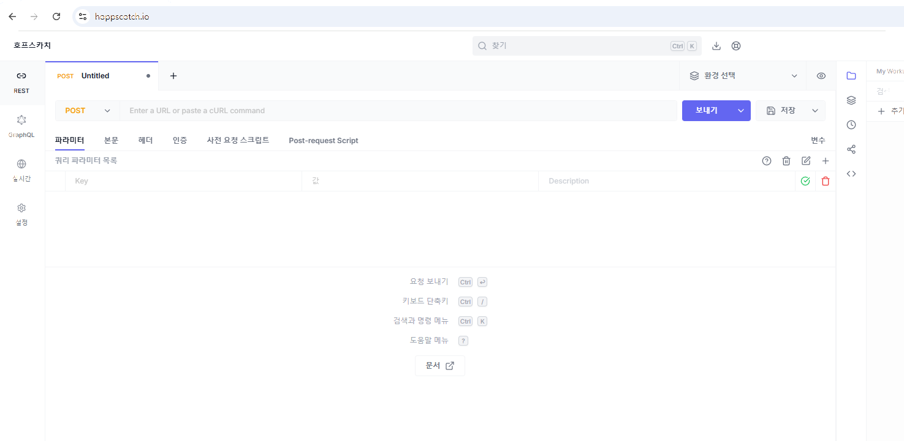
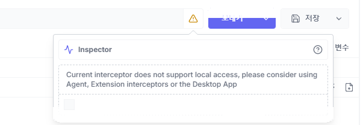
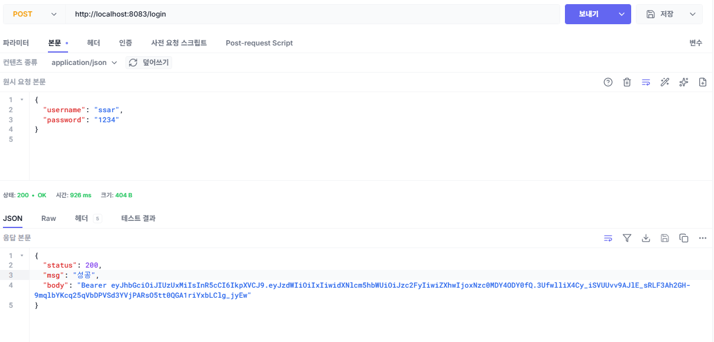
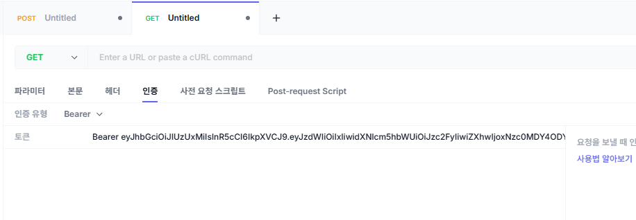
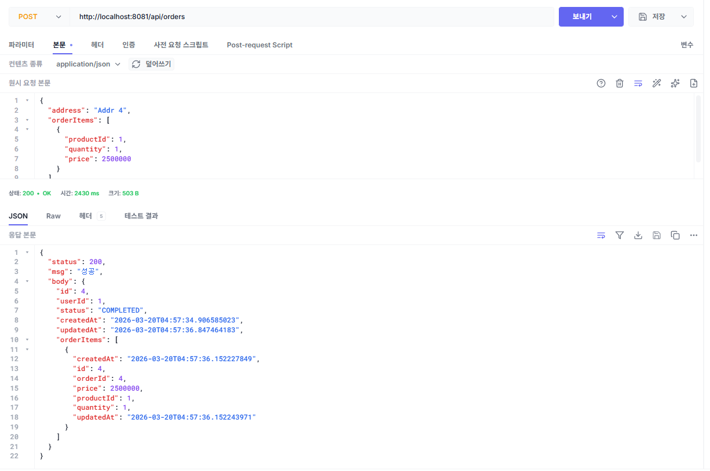
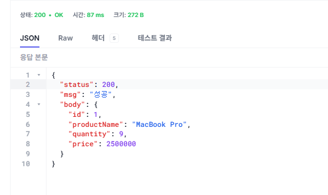
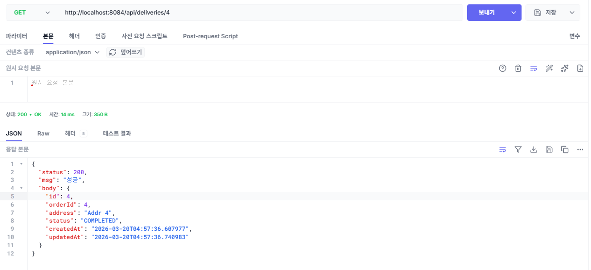
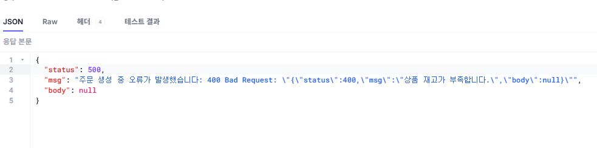
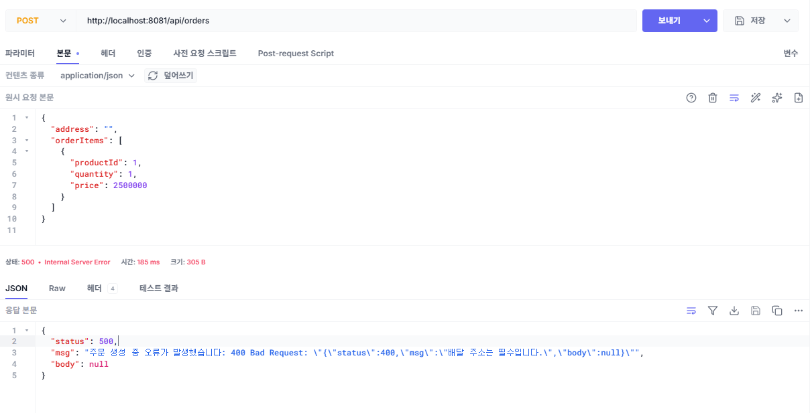
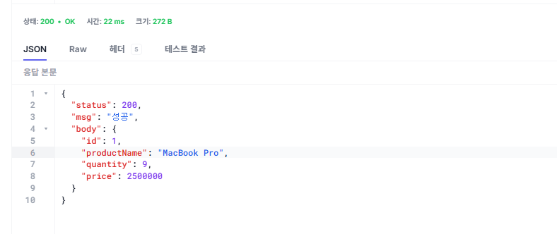

# 챕터 2. 동기식 MSA 구현 - 서비스를 연결하다

> 이 챕터의 전체 소스코드는 **https://github.com/metacoding-12-msa/ex01** 에서 확인할 수 있습니다.

<div class="svg-figure">
<svg viewBox="0 0 1020 480" xmlns="http://www.w3.org/2000/svg" role="img" aria-label="챕터 2 한눈에 보기: 1단계는 클라이언트가 User에 로그인하여 JWT를 받고, 2단계는 클라이언트가 Order에 주문을 요청하면 Order가 Product와 Delivery를 동기 호출하고 응답을 받은 뒤 클라이언트에 주문 완료를 응답하는 흐름. 모든 서비스는 Docker Compose로 묶여 있음">
  <defs>
    <marker id="c2f0-i" markerWidth="10" markerHeight="10" refX="8" refY="3" orient="auto"><path d="M0,0 L0,6 L8,3 z" fill="#4f46e5"/></marker>
  </defs>
  <text x="510" y="26" text-anchor="middle" font-size="17" font-weight="700" fill="#0f172a">챕터 2 한눈에 보기 — 로그인부터 주문까지</text>
  <rect x="230" y="50" width="760" height="400" rx="14" fill="none" stroke="#4f46e5" stroke-width="1.6" stroke-dasharray="6,4"/>
  <text x="250" y="70" font-size="12" font-weight="700" fill="#3730a3">Docker Compose · msa-network</text>
  <text x="40" y="95" font-size="13" font-weight="700" fill="#475569">1단계 — 로그인</text>
  <rect x="40" y="105" width="140" height="70" rx="8" fill="#fff" stroke="#475569" stroke-width="1.6"/>
  <text x="110" y="135" text-anchor="middle" font-size="16" font-weight="700" fill="#0f172a">Client</text>
  <text x="110" y="157" text-anchor="middle" font-size="12" fill="#6b7280">사용자</text>
  <rect x="380" y="105" width="180" height="70" rx="8" fill="#fff" stroke="#475569" stroke-width="1.6"/>
  <text x="470" y="135" text-anchor="middle" font-size="16" font-weight="700" fill="#0f172a">User</text>
  <text x="470" y="157" text-anchor="middle" font-size="12" fill="#6b7280">:8083 회원</text>
  <text x="40" y="225" font-size="13" font-weight="700" fill="#475569">2단계 — 주문 생성</text>
  <rect x="40" y="235" width="140" height="70" rx="8" fill="#fff" stroke="#475569" stroke-width="1.6"/>
  <text x="110" y="265" text-anchor="middle" font-size="16" font-weight="700" fill="#0f172a">Client</text>
  <text x="110" y="287" text-anchor="middle" font-size="12" fill="#6b7280">사용자</text>
  <rect x="380" y="235" width="180" height="70" rx="8" fill="#eef2ff" stroke="#4f46e5" stroke-width="1.8"/>
  <text x="470" y="265" text-anchor="middle" font-size="16" font-weight="700" fill="#3730a3">Order</text>
  <text x="470" y="287" text-anchor="middle" font-size="12" fill="#3730a3">:8081 주문</text>
  <rect x="680" y="130" width="180" height="70" rx="8" fill="#fff" stroke="#475569" stroke-width="1.6"/>
  <text x="770" y="160" text-anchor="middle" font-size="16" font-weight="700" fill="#0f172a">Product</text>
  <text x="770" y="182" text-anchor="middle" font-size="12" fill="#6b7280">:8082 상품</text>
  <rect x="680" y="340" width="180" height="70" rx="8" fill="#fff" stroke="#475569" stroke-width="1.6"/>
  <text x="770" y="370" text-anchor="middle" font-size="16" font-weight="700" fill="#0f172a">Delivery</text>
  <text x="770" y="392" text-anchor="middle" font-size="12" fill="#6b7280">:8084 배달</text>
  <line x1="180" y1="125" x2="378" y2="125" stroke="#4f46e5" stroke-width="1.6" marker-end="url(#c2f0-i)"/>
  <text x="279" y="118" text-anchor="middle" font-size="13" font-weight="600" fill="#4f46e5">1. 로그인 (POST /login)</text>
  <line x1="378" y1="155" x2="182" y2="155" stroke="#3730a3" stroke-width="1.6" stroke-dasharray="4,3" marker-end="url(#c2f0-i)"/>
  <text x="280" y="170" text-anchor="middle" font-size="13" font-weight="600" fill="#3730a3">2. JWT 응답</text>
  <line x1="180" y1="255" x2="378" y2="255" stroke="#4f46e5" stroke-width="1.6" marker-end="url(#c2f0-i)"/>
  <text x="279" y="248" text-anchor="middle" font-size="13" font-weight="600" fill="#4f46e5">3. 주문 생성 (JWT 첨부)</text>
  <line x1="560" y1="245" x2="678" y2="165" stroke="#4f46e5" stroke-width="1.6" marker-end="url(#c2f0-i)"/>
  <text x="619" y="190" text-anchor="middle" font-size="13" font-weight="600" fill="#4f46e5">4. 재고 차감</text>
  <line x1="678" y1="185" x2="562" y2="265" stroke="#3730a3" stroke-width="1.6" stroke-dasharray="4,3" marker-end="url(#c2f0-i)"/>
  <text x="619" y="240" text-anchor="middle" font-size="13" font-weight="600" fill="#3730a3">5. 차감 응답</text>
  <line x1="560" y1="285" x2="678" y2="365" stroke="#4f46e5" stroke-width="1.6" marker-end="url(#c2f0-i)"/>
  <text x="619" y="315" text-anchor="middle" font-size="13" font-weight="600" fill="#4f46e5">6. 배달 생성</text>
  <line x1="678" y1="385" x2="562" y2="305" stroke="#3730a3" stroke-width="1.6" stroke-dasharray="4,3" marker-end="url(#c2f0-i)"/>
  <text x="619" y="355" text-anchor="middle" font-size="13" font-weight="600" fill="#3730a3">7. 생성 응답</text>
  <line x1="378" y1="285" x2="182" y2="285" stroke="#3730a3" stroke-width="1.6" stroke-dasharray="4,3" marker-end="url(#c2f0-i)"/>
  <text x="280" y="305" text-anchor="middle" font-size="13" font-weight="600" fill="#3730a3">8. 주문 완료 응답</text>
</svg>
</div>

*그림 2-1. 챕터 2 한눈에 보기 - 로그인부터 주문까지*

:::goal
이번 챕터가 끝나면

- Spring Boot로 4개 서비스를 독립적으로 실행하고 REST로 연결할 수 있습니다.
- JWT 인증 필터를 구현하고 서비스 간 Authorization 헤더를 전달할 수 있습니다.
- 주문 생성 시 재고 감소 → 배달 생성 흐름을 동기적으로 구현할 수 있습니다.
- 중간에 실패가 발생했을 때 이전 작업을 되돌리는 보상 트랜잭션을 작성할 수 있습니다.
:::

<!-- [FLOW CARD: ch2-arc]
사건: 만들다 부딪힌 배달 실패 — "재고는 줄었는데 어떻게 되돌리지?"
깨달음: 분산 트랜잭션은 자동 안 됨. 보상은 직접 짠다 (보상 트랜잭션)
결과: ex01 — 플래그 기반 try/catch 보상이 자동 동작
-->

::::prep
**준비하기**. 실습 시작 전 한 번만 설정

### 1. 소스 코드 클론

```bash [터미널] 레포 클론
git clone https://github.com/metacoding-12-msa/ex01.git
cd ex01
```

### 2. 파일 구조

```text ex01 디렉토리
ex01/
├── user/               # 포트 8083
├── product/            # 포트 8082
├── order/              # 포트 8081
├── delivery/           # 포트 8084
└── docker-compose.yml  # 전체 서비스 실행
```

각 서비스 내부는 동일한 구조입니다. 주문 서비스 기준으로 보여드리며, 회원/상품/배달 서비스도 같은 구조입니다.

```text 주문 서비스 패키지 구조
src/main/java/com/metacoding/order/
├── OrderApplication.java                 # [참고]
├── core/
│   ├── config/
│   │   ├── WebConfig.java                # [참고] JWT 필터 등록
│   │   └── RestClientConfig.java         # [참고] JWT 헤더 전달 인터셉터
│   ├── filter/
│   │   └── JwtAuthenticationFilter.java  # [참고] JWT 인가 필터
│   ├── handler/
│   │   ├── GlobalExceptionHandler.java   # [참고] 전역 예외 처리
│   │   └── ex/                           # 커스텀 예외 (Exception400~500)
│   └── util/
│       ├── JwtProvider.java              # [참고] JWT 파싱/검증
│       ├── JwtUtil.java                  # [참고] JWT 생성
│       └── Resp.java                     # [참고] 표준 응답 래퍼
├── orders/
│   ├── Order.java                        # [참고] JPA 엔티티
│   ├── OrderStatus.java                  # [참고] 주문 상태 enum
│   ├── OrderController.java              # [참고] REST 컨트롤러
│   ├── OrderService.java                 # [작성] 비즈니스 로직
│   ├── OrderRepository.java              # [참고] Spring Data JPA
│   └── OrderRequest.java / OrderResponse.java  # [참고]
└── adapter/                              # 주문 서비스에만 존재
    ├── ProductClient.java                # [참고] 상품 서비스 호출
    ├── DeliveryClient.java               # [참고] 배달 서비스 호출
    └── dto/                              # 어댑터용 DTO (ProductRequest, DeliveryRequest)
Dockerfile                                # [참고] Docker 이미지 빌드
```

:::note
**회원/상품/배달 서비스는 `adapter/` 패키지와 `RestClientConfig`가 없고, 나머지 구조는 동일합니다.**
:::

### 3. 실습 환경

| 도구 | 용도 | 비고 |
|------|------|------|
| **Docker Desktop** | 4개 서비스를 컨테이너로 실행 | https://www.docker.com/products/docker-desktop/ |
| **Hoppscotch** | API 호출 결과 확인 | https://hoppscotch.io/ (설치 불필요, 브라우저 확장만 추가) |

### 4. 실습 순서

1. 공통 설정(JWT·표준 응답·예외 처리)을 `core/` 패키지에 두기
2. 회원·상품·배달 서비스의 핵심 코드 살펴보기
3. 주문 서비스에 RestClient + 보상 트랜잭션 작성하기
4. Docker Compose로 4개 서비스를 한 번에 띄우고 시나리오 3개 검증하기
::::

**오픈이**: "선배님, 서비스 네 개로 나누는 건 알겠는데, 이걸 어떻게 코드로 옮겨요?"

**선배**: "일단 각자 따로 띄워서 REST로 연결해 봐요. 서로 전화를 거는 것처럼 직접 호출하는 거예요. 제일 단순한 방법이죠."

방향이 보였습니다. 이제 만들어 봅니다.

주문 서비스가 이번 챕터의 핵심입니다. 주문 하나를 만들려면 상품 서비스의 재고를 줄이고, 배달 서비스에 배달을 만들어야 합니다. 머릿속에 흐름을 그려 봤습니다.

> 주문 저장 → 상품 재고 차감 → 배달 생성 → 주문 완료

*재고를 줄였는데, 그 다음 배달 생성이 실패하면... 어떻게 되돌리지?*

모놀리식이라면 `@Transactional` 한 줄이 다 롤백해 줍니다. 그런데 HTTP로 보낸 재고 차감 요청은 되돌릴 수 없습니다. 상품 DB의 재고는 줄어든 채로 남고, 자동으로 재고가 복구되지 않습니다.

챕터 1에서 머리로만 알았던 분산 트랜잭션을 그제야 실감했습니다. 선배 자리로 갔습니다.

**오픈이**: "선배님, 재고는 줄였는데 그 다음 배달 생성이 실패하면요? 자동으로 안 돌아가요."

**선배**: "기억나죠? 보상 트랜잭션. 자동으로 안 되니 직접 짜는 거예요. 재고를 줄였으면 다시 늘리고, 배달을 만들었으면 취소하고. 어디까지 진행됐는지 플래그로 기록하고. 그게 **보상 트랜잭션**이에요."

*보상 트랜잭션. 챕터 1에서 배운 그거. 그걸 손으로 짜는 거였구나.*

## 2.1 이야기의 시작 - 네 개의 서비스가 만나다

챕터 1에서 설계한 네 개의 서비스(회원, 상품, 주문, 배달)를 이제 직접 만들어 보겠습니다.

**주문 서비스**가 두 서비스를 엮는 자리입니다. 주문을 생성하려면 상품 서비스에서 재고를 줄이고, 배달 서비스에서 배달을 만들어야 합니다. 즉 주문 서비스가 두 서비스를 직접 호출해야 합니다.

각 서비스는 독립된 스프링 프로젝트입니다. 하나의 서비스를 배포할 때 다른 서비스를 건드릴 필요가 없습니다. 디렉토리 구조와 패키지 구조는 준비하기에서 미리 살펴봤습니다.

## 2.2 공통 설정 - 모든 서비스가 공유하는 뼈대

MSA에서는 서비스마다 서버가 다르므로 세션을 공유할 수 없습니다. 대신 JWT 토큰을 발급하고, 각 서비스가 토큰만 검증하는 방식을 사용합니다.

4개 서비스 모두 JWT 인증, 표준 응답 형식, 예외 처리가 필요합니다. 이를 `core/` 패키지에 모아 두면, 각 서비스는 비즈니스 로직에 집중할 수 있습니다.

각 컴포넌트의 역할은 다음과 같습니다.

| 컴포넌트 | 역할 |
|---|---|
| **JwtAuthenticationFilter** | 매 요청마다 JWT를 검증하고 사용자 정보를 컨트롤러로 전달합니다. |
| **JwtUtil / JwtProvider** | JwtUtil은 토큰을 발급하고, JwtProvider는 토큰을 검증합니다. |
| **Resp** | 모든 API 응답을 동일한 형태로 통일하는 래퍼입니다. |
| **GlobalExceptionHandler** | 전역에서 발생한 예외를 잡아 일관된 에러 응답으로 변환합니다. |
| **WebConfig** | JWT 필터를 인증이 필요한 경로에 등록합니다. |

공통 설정이 준비되었습니다. 주문 서비스의 보상 트랜잭션을 직접 작성하기 전에, 나머지 세 서비스의 핵심 코드를 먼저 살펴보겠습니다. 아래 2.3~2.5는 참고 코드라 클래스 단위로 요약만 짚습니다. 자세한 구현은 완성 레포(GitHub)를 참고하세요.

## 2.3 회원 서비스 - JWT로 로그인하다

회원 서비스는 로그인과 사용자 조회를 담당합니다. 사용자가 `POST /login`으로 아이디와 비밀번호를 보내면, 회원 서비스가 DB에서 조회하고 비밀번호를 검증합니다. 검증에 성공하면 JWT 토큰을 응답 바디에 담아 돌려줍니다. 이 토큰이 이후 모든 서비스 요청의 인증 수단이 됩니다.

| HTTP 메서드 | 경로 | 기능 |
|---|---|---|
| POST | /login | 로그인 (JWT 발급) |
| GET | /api/users/{userId} | 사용자 조회 |

### 2.3.1 클래스 구성

회원 서비스의 로그인과 사용자 조회를 다음 네 클래스가 처리합니다.

| 클래스 | 역할 |
|---|---|
| **User** | 사용자 정보를 담는 엔티티입니다. |
| **UserRepository** | 사용자 데이터를 DB에서 조회·저장합니다. |
| **UserService** | 로그인 시 비밀번호를 검증하고 JWT를 발급하며, 사용자 조회 요청을 처리합니다. |
| **UserController** | 로그인과 사용자 조회 API를 제공합니다. |

## 2.4 상품 서비스 - 재고를 관리하다

상품 서비스는 상품 목록 조회와 재고 증감을 담당합니다. 주문 서비스가 주문을 생성할 때 이 서비스의 재고 감소 API를 호출하고, 주문이 취소되거나 실패하면 재고 증가 API로 되돌립니다.

| HTTP 메서드 | 경로 | 기능 |
|---|---|---|
| GET | /api/products/{productId} | 상품 조회 |
| PUT | /api/products/{productId}/decrease | 재고 감소 |
| PUT | /api/products/{productId}/increase | 재고 증가 |

### 2.4.1 클래스 구성

상품 조회와 재고 증감을 다음 네 클래스가 처리합니다.

| 클래스 | 역할 |
|---|---|
| **Product** | 상품 정보를 담는 엔티티이며, 재고 증감 로직을 자기 안에 둡니다. |
| **ProductRepository** | 상품 데이터를 DB에서 조회·저장합니다. |
| **ProductService** | 재고 감소 전 상품 존재·재고·가격을 검증한 뒤 재고를 줄이거나 늘립니다. |
| **ProductController** | 상품 조회와 재고 증감 API를 제공합니다. |

## 2.5 배달 서비스 - 배달을 생성하고 취소하다

배달 서비스는 배달 생성과 취소를 담당합니다. 이번 챕터에서는 배달 생성과 동시에 완료 처리합니다. PENDING 상태로 생성한 뒤 즉시 COMPLETED로 전이되며, 배달 취소 요청이 들어오면 CANCELLED로 바뀝니다.

| HTTP 메서드 | 경로 | 기능 |
|---|---|---|
| POST | /api/deliveries | 배달 생성 |
| GET | /api/deliveries/{deliveryId} | 배달 조회 |
| PUT | /api/deliveries/{orderId} | 배달 취소 |

### 2.5.1 클래스 구성

배달 생성과 취소를 다음 네 클래스가 처리합니다.

| 클래스 | 역할 |
|---|---|
| **Delivery** | 배달 정보와 상태 전이(PENDING → COMPLETED / CANCELLED)를 담는 엔티티입니다. |
| **DeliveryRepository** | 배달 데이터를 DB에서 조회·저장합니다. |
| **DeliveryService** | 배달을 생성하고 취소 요청을 처리합니다. |
| **DeliveryController** | 배달 생성·조회·취소 API를 제공합니다. |

*회원, 상품, 배달까지는 각자 제 일만 하면 된다. 진짜 문제는 이것들을 엮는 주문 서비스다.*

**선배**: "이제 주문 서비스예요. 어디까지 진행됐는지 기록해 뒀다가, 실패하면 역순으로 취소해요."

## 2.6 주문 서비스 - 보상 트랜잭션의 현장

배달 서비스까지 살펴봤으니, 이제 주문 서비스로 넘어갑니다.

| HTTP 메서드 | 경로 | 기능 |
|---|---|---|
| POST | /api/orders | 주문 생성 |
| GET | /api/orders/{orderId} | 주문 조회 |
| PUT | /api/orders/{orderId} | 주문 취소 |

### 2.6.1 클래스 구성

주문 생성과 보상 트랜잭션을 다음 여섯 클래스가 처리합니다.

| 클래스 | 역할 |
|---|---|
| **Order** | 주문 정보와 상태 전이(PENDING → COMPLETED / CANCELLED)를 담는 엔티티입니다. |
| **OrderStatus** | 주문 상태(대기·완료·취소)를 정의하는 열거형입니다. |
| **OrderRepository** | 주문 데이터를 DB에서 조회·저장합니다. |
| **OrderRequest / OrderResponse** | 주문 API의 요청과 응답 형식을 정의합니다. |
| **OrderController** | 주문 생성·조회·취소 API를 제공합니다. |
| **OrderService** | **[작성]** 주문 생성 시 보상 트랜잭션을 수행하며, 조회와 취소도 처리합니다. |

주문 한 건에 상품 한 개를 담는 단순한 모델로 시작하여, 분산 트랜잭션 보상 흐름에 집중합니다.

### 2.6.2 보상 트랜잭션 흐름

엔티티가 준비되었으니, 이제 주문 서비스의 진짜 역할을 살펴봅니다. 주문 서비스는 상품 서비스와 배달 서비스를 **직접 호출**합니다. 직접 호출했으니 실패 시 되돌리는 보상도 직접 처리합니다. 이미 발송한 택배를 취소하려면 받는 사람에게 직접 "되돌려달라"고 요청해야 하는 것과 같습니다.

어느 단계에서 실패하면 무엇을 되돌려야 하는지 먼저 그려 보겠습니다.

| 단계 | 동작 | 실패 시 보상 |
|---|---|---|
| 1 | 재고 감소 (상품 서비스) | 없음 (아직 진행 안 함) |
| 2 | 배달 생성 (배달 서비스) | 재고 복구 (1단계 되돌리기) |
| 3 | 주문 완료 | 배달 취소 + 재고 복구 (2, 1단계 되돌리기) |
| 4 | 성공 응답 반환 | — |

예를 들어 2단계 배달 생성에서 실패하면, 이미 줄어든 재고 한 단계만 되돌리면 됩니다. 3단계에서 실패하면 배달 취소와 재고 복구를 모두 되돌립니다. 진행한 만큼만 거꾸로 거슬러 올라가려면, 어디까지 갔는지를 코드에서 기록해 둬야 합니다.


<div class="svg-figure">
<svg viewBox="0 0 880 460" xmlns="http://www.w3.org/2000/svg" role="img" aria-label="주문 실패 시 보상 트랜잭션 시퀀스: 배달 실패 후 재고 복구와 주문 트랜잭션 롤백을 역순으로 실행">
  <defs>
    <marker id="c2f2-i" markerWidth="10" markerHeight="10" refX="8" refY="3" orient="auto"><path d="M0,0 L0,6 L8,3 z" fill="#4f46e5"/></marker>
    <marker id="c2f2-o" markerWidth="10" markerHeight="10" refX="8" refY="3" orient="auto"><path d="M0,0 L0,6 L8,3 z" fill="#4f46e5"/></marker>
  </defs>
  <text x="440" y="30" text-anchor="middle" font-size="17" font-weight="700" fill="#0f172a">주문 실패 시 보상 트랜잭션 — 배달 실패 후 역순 복구</text>
  <rect x="80" y="60" width="180" height="50" rx="8" fill="#eef2ff" stroke="#4f46e5" stroke-width="1.8"/>
  <text x="170" y="92" text-anchor="middle" font-size="15" font-weight="700" fill="#3730a3">Order</text>
  <rect x="350" y="60" width="180" height="50" rx="8" fill="#fff" stroke="#475569" stroke-width="1.6"/>
  <text x="440" y="92" text-anchor="middle" font-size="15" font-weight="700" fill="#0f172a">Product</text>
  <rect x="620" y="60" width="180" height="50" rx="8" fill="#fff" stroke="#475569" stroke-width="1.6"/>
  <text x="710" y="92" text-anchor="middle" font-size="15" font-weight="700" fill="#0f172a">Delivery</text>
  <line x1="170" y1="110" x2="170" y2="430" stroke="#cbd5e1" stroke-width="1.2" stroke-dasharray="4,3"/>
  <line x1="440" y1="110" x2="440" y2="430" stroke="#cbd5e1" stroke-width="1.2" stroke-dasharray="4,3"/>
  <line x1="710" y1="110" x2="710" y2="430" stroke="#cbd5e1" stroke-width="1.2" stroke-dasharray="4,3"/>
  <line x1="170" y1="150" x2="438" y2="150" stroke="#4f46e5" stroke-width="1.6" marker-end="url(#c2f2-i)"/>
  <text x="304" y="142" text-anchor="middle" font-size="13" font-weight="600" fill="#4f46e5">1. 재고 차감 요청</text>
  <line x1="440" y1="200" x2="172" y2="200" stroke="#4f46e5" stroke-width="1.6" stroke-dasharray="4,3" marker-end="url(#c2f2-i)"/>
  <text x="306" y="192" text-anchor="middle" font-size="13" font-weight="600" fill="#4f46e5">2. 차감 성공 응답</text>
  <line x1="170" y1="255" x2="708" y2="255" stroke="#4f46e5" stroke-width="1.6" marker-end="url(#c2f2-o)"/>
  <text x="439" y="247" text-anchor="middle" font-size="13" font-weight="600" fill="#3730a3">3. 배달 생성 요청 → 실패</text>
  <line x1="170" y1="320" x2="438" y2="320" stroke="#4f46e5" stroke-width="1.6" stroke-dasharray="4,3" marker-end="url(#c2f2-o)"/>
  <text x="304" y="312" text-anchor="middle" font-size="13" font-weight="600" fill="#3730a3">4. 재고 복구 요청 (보상)</text>
  <path d="M170 380 L230 380 L230 398 L172 398" fill="none" stroke="#4f46e5" stroke-width="1.6" marker-end="url(#c2f2-o)"/>
  <text x="240" y="393" text-anchor="start" font-size="13" font-weight="600" fill="#3730a3">5. 주문 트랜잭션 롤백</text>
  <text x="440" y="448" text-anchor="middle" font-size="13" fill="#6b7280" font-style="italic">실패가 발생하면 이미 진행된 단계를 역순으로 보상 (점선)</text>
</svg>
</div>

*그림 2-2. 주문 실패 시 보상 트랜잭션 흐름*

### 2.6.3 adapter - 외부 서비스 호출 설정

`adapter/` 폴더에는 외부 서비스를 호출하는 **클라이언트** 두 개가 있습니다. OrderService는 클라이언트의 메서드만 부르면 HTTP 디테일은 알 필요가 없습니다. 두 클라이언트 앞에 둔 RestClient 설정이 모든 호출에 JWT를 자동으로 실어 줍니다.

| 클래스 | 역할 |
|---|---|
| **RestClientConfig** | RestClient에 인터셉터를 등록하여 외부 호출 시 JWT를 자동 전달합니다. |
| **ProductClient** | 상품 서비스의 `decreaseQuantity`(재고 감소)와 `increaseQuantity`(재고 복구)를 호출합니다. |
| **DeliveryClient** | 배달 서비스의 `createDelivery`(배달 생성)와 `cancelDelivery`(배달 취소)를 호출합니다. |

세 클래스의 전체 코드는 완성 레포(GitHub)에서 확인할 수 있습니다. 챕터 2.6.4의 OrderService에서 이 메서드들이 어떻게 조합되는지가 핵심입니다.

*재고를 줄였으면 다시 늘리고, 배달을 만들었으면 취소하고... 그 말이 이거였구나.*

### 2.6.4 OrderService - 보상 트랜잭션의 핵심

이제 이번 챕터의 하이라이트입니다. 보상 트랜잭션 패턴을 직접 구현합니다. 코드를 읽을 때 `productDecreased`와 `deliveryCreated` 두 플래그를 추적하면서 읽어보세요. 단계가 성공할 때마다 플래그를 `true`로 올려두고, catch 블록에서는 켜져 있는 플래그만 골라 역순으로 되돌립니다.

`orders/OrderService.java`를 열고 아래 메서드를 작성합니다.

```java [실습 1] orders/OrderService.java. createOrder - 보상 트랜잭션 핵심
@Transactional
public OrderResponse createOrder(int userId, int productId, int quantity, Long price, String address) {
    // 보상트랜잭션을 위한 변수 선언
    boolean productDecreased = false;
    boolean deliveryCreated = false;

    // 보상트랜잭션에서 id를 전달해야해서 상위로 빼둠
    Order createdOrder = null;

    try {
        // 1. 주문 생성
        createdOrder = orderRepository.save(Order.create(userId, productId, quantity, price));

        // 2. 상품 재고 차감
        productClient.decreaseQuantity(new ProductRequest(productId, quantity, price));
        productDecreased = true;

        // 3. 배달 생성 (어댑터)
        deliveryClient.createDelivery(new DeliveryRequest(createdOrder.getId(), address));
        deliveryCreated = true;

        // 4. 주문 완료
        createdOrder.complete();
        return OrderResponse.from(createdOrder);

    } catch (Exception e) {
        // 배달 취소
        if (deliveryCreated) {
            deliveryClient.cancelDelivery(createdOrder.getId());
        }

        // 재고 복구
        if (productDecreased) {
            productClient.increaseQuantity(new ProductRequest(productId, quantity, price));
        }
        throw new Exception500("주문 생성 중 오류가 발생했습니다: " + e.getMessage());
    }
}
```

참고로 catch 마지막의 `throw`로 `@Transactional`이 주문 트랜잭션까지 함께 롤백합니다. 외부 서비스는 보상 호출, 주문 row는 트랜잭션 롤백으로 정리됩니다.

## 2.7 Docker Compose - 네 개의 서비스를 한 번에 실행하다

코드가 완성되었습니다. 이제 직접 실행하여 보상 트랜잭션이 작동하는 것을 눈으로 확인해 봅니다.

시나리오를 따라가기 전에, 각 서비스에 어떤 데이터가 미리 등록되어 있는지 살펴봅니다. 컨테이너를 띄우면 H2 in-memory DB에 다음 데이터가 자동으로 삽입되어 별도 설정 없이 곧장 사용할 수 있고, 컨테이너를 재시작하면 매번 같은 상태로 초기화됩니다. 데이터 정의는 각 서비스의 `db/data.sql`에 있습니다.

| 서비스 | 더미 데이터 |
|---|---|
| **회원** | 계정 3개: `ssar`, `cos`, `love` (비밀번호는 모두 `1234`) |
| **상품** | MacBook Pro(재고 10), iPhone 15(**재고 0 품절**), AirPods(재고 10) |
| **배달** | 주문 3건에 대응하는 배달 데이터, 모두 `COMPLETED` 상태 |
| **주문** | 사용자별 주문 3건(완료·취소·대기) |

### 2.7.1 서비스 실행

각 서비스의 Dockerfile은 동일한 구조로, 스프링 프로젝트를 컨테이너 안에서 빌드하고 실행하는 4단계 흐름을 따릅니다.

| 단계 | 무엇을 | 왜 |
|---|---|---|
| 베이스 | JDK 21 이미지 | Spring Boot 실행 환경을 마련하기 위함입니다. |
| 소스 복사 | 프로젝트 → /app | 컨테이너 안에서 빌드하기 위해 소스를 가져옵니다. |
| JAR 빌드 | `gradlew bootJar` | 실행 가능한 단일 JAR 파일을 생성합니다. |
| 실행 | `java -jar` | 컨테이너가 시작될 때 JAR를 자동 실행합니다. |

`ex01` 디렉토리의 `docker-compose.yml`이 4개 서비스를 한 번에 묶어 실행합니다. 네 서비스 모두 같은 패턴이고, 빌드 컨텍스트와 포트만 다릅니다.

| 서비스 | build.context | 호스트:컨테이너 포트 | 네트워크 |
|---|---|---|---|
| order | `./order` | `8081:8081` | msa-network |
| user | `./user` | `8083:8083` | msa-network |
| product | `./product` | `8082:8082` | msa-network |
| delivery | `./delivery` | `8084:8084` | msa-network |

`msa-network`로 묶여 있기 때문에, 컨테이너끼리는 서비스 이름(예: `http://product-service:8082`)으로 통신합니다.

프로젝트가 위치한 폴더로 이동 후, 터미널에서 Docker Compose로 4개 서비스를 한 번에 빌드하고 실행합니다.

```bash [터미널] Docker Compose 실행
cd ex01
docker compose up
```

실행이 완료되면 각 서비스에 접근할 수 있습니다.

| 서비스 | 주소 |
|---|---|
| 주문 서비스 | http://localhost:8081 |
| 상품 서비스 | http://localhost:8082 |
| 회원 서비스 | http://localhost:8083 |
| 배달 서비스 | http://localhost:8084 |

처음 실행 시 이미지 빌드에 5~10분이 소요될 수 있습니다. 터미널이 멈춘 것처럼 보여도 정상이니 기다려 주세요. 빌드 진행 상황은 `docker compose logs -f [서비스명]`으로 확인할 수 있습니다.

<div class="terminal-log">
  <div class="tl-chrome">
    <div class="tl-traffic"><span></span><span></span><span></span></div>
    <div class="tl-title">ex01 — docker compose up</div>
    <div class="tl-spacer"></div>
  </div>
  <div class="tl-body">
    <div><span class="tl-label">user-service</span>&nbsp;&nbsp;<span class="tl-dim">|</span> Started UserApplication in <span class="tl-num">4.231</span> seconds (port: <span class="tl-num">8083</span>)</div>
    <div><span class="tl-label">product-service</span>&nbsp;&nbsp;<span class="tl-dim">|</span> Started ProductApplication in <span class="tl-num">4.512</span> seconds (port: <span class="tl-num">8082</span>)</div>
    <div><span class="tl-label">order-service</span>&nbsp;&nbsp;<span class="tl-dim">|</span> Started OrderApplication in <span class="tl-num">5.103</span> seconds (port: <span class="tl-num">8081</span>)</div>
    <div><span class="tl-label">delivery-service</span>&nbsp;&nbsp;<span class="tl-dim">|</span> Started DeliveryApplication in <span class="tl-num">4.687</span> seconds (port: <span class="tl-num">8084</span>)</div>
    <div class="tl-divider"><span class="tl-val">4개 서비스 기동 완료</span><span class="tl-cursor"></span></div>
  </div>
</div>

*그림 2-3. Docker Compose 실행 결과*

### 2.7.2 Hoppscotch와 인터셉터 설정

서비스가 실행되면 API를 호출하여 결과를 확인해야 합니다. 이 책에서는 Hoppscotch(https://hoppscotch.io/)를 사용합니다. localhost로 요청을 보내려면 Chrome 웹 스토어에서 **Hoppscotch Browser Extension**을 설치합니다. 설치 후 Hoppscotch 화면 하단의 인터셉터 설정에서 **"Browser Extension"** 을 선택하세요.



*그림 2-4. Hoppscotch 화면*



*그림 2-5. Browser Extension 인터셉터 설정*

### 2.7.3 시나리오 1: 정상 주문

먼저 로그인하여 JWT 토큰을 받습니다. 이때 콘텐츠 종류(Content-Type)를 `application/json`으로 설정해야 합니다. 이 헤더는 서버에게 "내가 보내는 데이터는 JSON 형식이다"라고 알리는 역할을 합니다.

```json
POST http://localhost:8083/login

{
  "username": "ssar",
  "password": "1234"
}
```



*그림 2-6. 로그인 API 호출 결과*

응답 바디 데이터에 포함된 JWT 토큰을 확인할 수 있습니다.

받은 토큰을 Hoppscotch의 인증 > 인증 유형(Bearer) 항목의 토큰 필드에 넣습니다.



*그림 2-7. Bearer 토큰 설정*

MacBook Pro(상품 ID 1, 재고 10개)를 1개 주문합니다. 요청 바디는 상품 정보(`productId`, `quantity`, `price`)와 배달 주소(`address`)를 한 번에 담습니다.

```json
POST http://localhost:8081/api/orders

{
  "productId": 1,
  "quantity": 1,
  "price": 2500000,
  "address": "Addr 4"
}
```



*그림 2-8. 주문 생성 API 호출 결과*

주문이 성공하면 상품 서비스에서 재고가 10 → 9로 줄어들고, 배달 서비스에 배달이 생성됩니다.

```json
GET http://localhost:8082/api/products/1
```



*그림 2-9. 재고 감소 확인*

```json
GET http://localhost:8084/api/deliveries/4   # 더미 배달 3건 다음이라 새 배달은 4번
```



*그림 2-10. 배달 생성 확인*

### 2.7.4 시나리오 2: 재고 부족

품절 상품인 iPhone 15(상품 ID 2, 재고 0)를 주문해 보겠습니다. 첫 번째 단계(재고 차감)에서 바로 실패하므로 보상할 작업이 없어 즉시 에러가 반환됩니다.

```json
POST http://localhost:8081/api/orders

{
  "productId": 2,
  "quantity": 1,
  "price": 1300000,
  "address": "Addr 4"
}
```



*그림 2-11. 재고 부족 시 에러 응답*

**오픈이**: "품절은 첫 단계에서 막혀서 보상이 안 도네요. 그러면 보상이 진짜 도는 건 언제죠?"

**선배**: "주소를 비워서 보내 봐요. 재고는 줄어든 다음 배달에서 실패할 거예요."

### 2.7.5 시나리오 3: 주소 누락

이번에는 주소를 빈 문자열로 보내 보겠습니다. 주문 자체는 재고 차감까지 진행되지만, 배달 서비스에서 주소가 없으므로 실패합니다. 이때 보상 트랜잭션이 작동하여 차감된 재고가 복구되고, 주문 row는 트랜잭션 롤백으로 처음부터 없던 일처럼 DB에서 사라집니다.

```json
POST http://localhost:8081/api/orders

{
  "productId": 1,
  "quantity": 1,
  "price": 2500000,
  "address": ""
}
```



*그림 2-12. 주소 누락 시 에러 응답*

그리고 재고가 원복되었는지 확인합니다.

```json
GET http://localhost:8082/api/products/1
```



*그림 2-13. 재고 원복 확인*

테스트가 끝났으면 실행 중인 컨테이너를 정리합니다.

```bash [터미널] 컨테이너 정리
docker compose down
```

이 명령어를 실행하면 docker compose up으로 띄운 모든 컨테이너가 종료되고 제거됩니다.

*보상 트랜잭션이 진짜 도는구나. 재고가 자동으로 돌아왔다.*

**선배**: "잘 됐네요. 근데 한 가지 더 생각해 봐요. 상품 서비스가 느려지면 주문 서비스는 어떻게 될까요?"

*...아. 전화를 걸고 기다리니까, 상대가 느리면 나도 느려지는 거잖아.*

보상 트랜잭션 덕분에 데이터 일관성을 유지할 수 있었습니다. 하지만 이 구조에는 눈에 잘 보이지 않는 문제가 몇 가지 있습니다. 모든 서비스 호출이 동기적이라 상품 서비스가 1초 걸리면 주문 서비스도 1초를 기다립니다. 보상 트랜잭션 코드도 비즈니스 로직과 섞이면서 try-catch 중첩이 깊어집니다.

실패한 주문은 트랜잭션 롤백으로 row 자체가 사라지므로 "어떤 주문이 왜 실패했는지" 이력도 남지 않습니다. 게다가 새 비즈니스 규칙이 들어오면 어디 손대야 할지 막막한 코드 구조도 같이 따라옵니다.

:::remember
**이것만은 기억하자**

- MSA에서 분산 트랜잭션은 자동으로 풀리지 않습니다. 실패를 감지한 쪽이 직접 보상 호출을 보내야 합니다.
- 4개 서비스를 REST로 연결하고, JWT 인증 헤더를 RestClient 인터셉터로 자동 전달했습니다.
- 플래그 기반 보상 트랜잭션으로 외부 서비스(재고와 배달)를 원상복구했습니다.
- 단 주문 row 자체는 트랜잭션 롤백으로 사라지므로 실패 이력은 남지 않습니다.
- 이 구조의 한계는 다음 챕터 운영 환경에서, 그다음 챕터 비동기 전환에서 차례로 해소됩니다.

다음 챕터에서는 새 비즈니스 규칙이 들어오는 사건을 마주칩니다. 그때 도메인이 자기 일을 모르고 Service가 다 답하고 있다는 통증을 인식하고, **DDD + 클린 아키텍처**로 코드 구조를 정리한 뒤 운영 환경(K8s)에 올립니다.
:::
