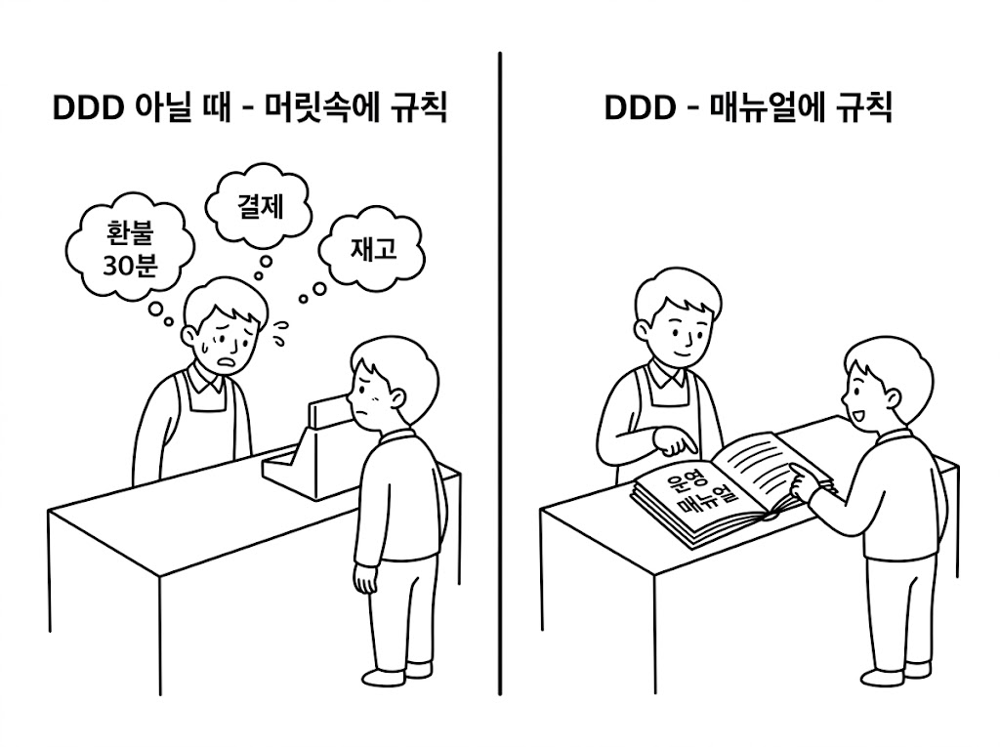
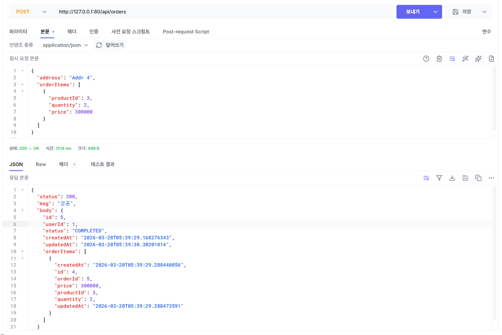

# 챕터 3. 도메인을 중심으로 - DDD + 클린 아키텍처와 Kubernetes

> 이 챕터의 전체 소스코드는 **https://github.com/metacoding-12-msa/ex02** 에서 확인할 수 있습니다.

<div class="svg-figure">
<svg viewBox="0 0 1200 580" xmlns="http://www.w3.org/2000/svg" role="img" aria-label="챕터 3 한눈에 보기: 외부 클라이언트가 Ingress와 Gateway를 거쳐 User 또는 Order 서비스를 호출하고, Order가 Product와 Delivery를 동기 호출하는 흐름. 응답은 역순으로 박스를 통과. 모든 서비스는 Kubernetes 클러스터로 묶여 있음">
  <defs>
    <marker id="c3f1-i" markerWidth="10" markerHeight="10" refX="8" refY="3" orient="auto"><path d="M0,0 L0,6 L8,3 z" fill="#4f46e5"/></marker>
  </defs>
  <text x="600" y="26" text-anchor="middle" font-size="17" font-weight="700" fill="#0f172a">챕터 3 한눈에 보기 — K8s 진입 + 두 단계 흐름</text>
  <rect x="220" y="60" width="960" height="500" rx="14" fill="none" stroke="#4f46e5" stroke-width="1.6" stroke-dasharray="6,4"/>
  <text x="240" y="80" font-size="12" font-weight="700" fill="#3730a3">Kubernetes 클러스터 · metacoding</text>
  <text x="40" y="100" font-size="13" font-weight="700" fill="#475569">1단계 — 로그인</text>
  <rect x="40" y="110" width="140" height="80" rx="8" fill="#fff" stroke="#475569" stroke-width="1.6"/>
  <text x="110" y="143" text-anchor="middle" font-size="16" font-weight="700" fill="#0f172a">Client</text>
  <text x="110" y="166" text-anchor="middle" font-size="12" fill="#6b7280">사용자</text>
  <rect x="260" y="110" width="140" height="80" rx="8" fill="#fff" stroke="#475569" stroke-width="1.6"/>
  <text x="330" y="143" text-anchor="middle" font-size="15" font-weight="700" fill="#0f172a">Ingress</text>
  <text x="330" y="166" text-anchor="middle" font-size="12" fill="#6b7280">외부 진입점</text>
  <rect x="480" y="110" width="140" height="80" rx="8" fill="#fff" stroke="#475569" stroke-width="1.6"/>
  <text x="550" y="143" text-anchor="middle" font-size="15" font-weight="700" fill="#0f172a">Gateway</text>
  <text x="550" y="166" text-anchor="middle" font-size="12" fill="#6b7280">Nginx 라우팅</text>
  <rect x="700" y="110" width="170" height="80" rx="8" fill="#fff" stroke="#475569" stroke-width="1.6"/>
  <text x="785" y="143" text-anchor="middle" font-size="16" font-weight="700" fill="#0f172a">User</text>
  <text x="785" y="166" text-anchor="middle" font-size="12" fill="#6b7280">:8083 회원</text>
  <line x1="180" y1="132" x2="258" y2="132" stroke="#4f46e5" stroke-width="1.6" marker-end="url(#c3f1-i)"/>
  <text x="219" y="125" text-anchor="middle" font-size="13" font-weight="600" fill="#4f46e5">1. 요청</text>
  <line x1="400" y1="132" x2="478" y2="132" stroke="#4f46e5" stroke-width="1.6" marker-end="url(#c3f1-i)"/>
  <text x="439" y="125" text-anchor="middle" font-size="13" font-weight="600" fill="#4f46e5">2. 라우팅</text>
  <line x1="620" y1="132" x2="698" y2="132" stroke="#4f46e5" stroke-width="1.6" marker-end="url(#c3f1-i)"/>
  <text x="659" y="125" text-anchor="middle" font-size="13" font-weight="600" fill="#4f46e5">3. 로그인</text>
  <line x1="698" y1="172" x2="622" y2="172" stroke="#3730a3" stroke-width="1.6" stroke-dasharray="4,3" marker-end="url(#c3f1-i)"/>
  <text x="660" y="185" text-anchor="middle" font-size="13" font-weight="600" fill="#3730a3">4. 응답</text>
  <line x1="478" y1="172" x2="402" y2="172" stroke="#3730a3" stroke-width="1.6" stroke-dasharray="4,3" marker-end="url(#c3f1-i)"/>
  <text x="440" y="185" text-anchor="middle" font-size="13" font-weight="600" fill="#3730a3">5. 응답</text>
  <line x1="258" y1="172" x2="182" y2="172" stroke="#3730a3" stroke-width="1.6" stroke-dasharray="4,3" marker-end="url(#c3f1-i)"/>
  <text x="220" y="185" text-anchor="middle" font-size="13" font-weight="600" fill="#3730a3">6. JWT 응답</text>
  <text x="40" y="270" font-size="13" font-weight="700" fill="#475569">2단계 — 주문 생성</text>
  <rect x="40" y="280" width="140" height="80" rx="8" fill="#fff" stroke="#475569" stroke-width="1.6"/>
  <text x="110" y="313" text-anchor="middle" font-size="16" font-weight="700" fill="#0f172a">Client</text>
  <text x="110" y="336" text-anchor="middle" font-size="12" fill="#6b7280">사용자</text>
  <rect x="260" y="280" width="140" height="80" rx="8" fill="#fff" stroke="#475569" stroke-width="1.6"/>
  <text x="330" y="313" text-anchor="middle" font-size="15" font-weight="700" fill="#0f172a">Ingress</text>
  <text x="330" y="336" text-anchor="middle" font-size="12" fill="#6b7280">외부 진입점</text>
  <rect x="480" y="280" width="140" height="80" rx="8" fill="#fff" stroke="#475569" stroke-width="1.6"/>
  <text x="550" y="313" text-anchor="middle" font-size="15" font-weight="700" fill="#0f172a">Gateway</text>
  <text x="550" y="336" text-anchor="middle" font-size="12" fill="#6b7280">Nginx 라우팅</text>
  <rect x="700" y="280" width="170" height="80" rx="8" fill="#eef2ff" stroke="#4f46e5" stroke-width="1.8"/>
  <text x="785" y="313" text-anchor="middle" font-size="16" font-weight="700" fill="#3730a3">Order</text>
  <text x="785" y="336" text-anchor="middle" font-size="12" fill="#3730a3">:8081 주문</text>
  <rect x="940" y="150" width="170" height="80" rx="8" fill="#fff" stroke="#475569" stroke-width="1.6"/>
  <text x="1025" y="183" text-anchor="middle" font-size="16" font-weight="700" fill="#0f172a">Product</text>
  <text x="1025" y="206" text-anchor="middle" font-size="12" fill="#6b7280">:8082 상품</text>
  <rect x="940" y="410" width="170" height="80" rx="8" fill="#fff" stroke="#475569" stroke-width="1.6"/>
  <text x="1025" y="443" text-anchor="middle" font-size="16" font-weight="700" fill="#0f172a">Delivery</text>
  <text x="1025" y="466" text-anchor="middle" font-size="12" fill="#6b7280">:8084 배달</text>
  <line x1="180" y1="302" x2="258" y2="302" stroke="#4f46e5" stroke-width="1.6" marker-end="url(#c3f1-i)"/>
  <text x="219" y="295" text-anchor="middle" font-size="13" font-weight="600" fill="#4f46e5">7. 요청</text>
  <line x1="400" y1="302" x2="478" y2="302" stroke="#4f46e5" stroke-width="1.6" marker-end="url(#c3f1-i)"/>
  <text x="439" y="295" text-anchor="middle" font-size="13" font-weight="600" fill="#4f46e5">8. 라우팅</text>
  <line x1="620" y1="302" x2="698" y2="302" stroke="#4f46e5" stroke-width="1.6" marker-end="url(#c3f1-i)"/>
  <text x="659" y="295" text-anchor="middle" font-size="13" font-weight="600" fill="#4f46e5">9. 주문 생성</text>
  <line x1="770" y1="280" x2="938" y2="170" stroke="#4f46e5" stroke-width="1.6" marker-end="url(#c3f1-i)"/>
  <text x="844" y="215" text-anchor="middle" font-size="13" font-weight="600" fill="#4f46e5">10. 재고 차감</text>
  <line x1="940" y1="205" x2="826" y2="280" stroke="#3730a3" stroke-width="1.6" stroke-dasharray="4,3" marker-end="url(#c3f1-i)"/>
  <text x="893" y="262" text-anchor="middle" font-size="13" font-weight="600" fill="#3730a3">11. 응답</text>
  <line x1="770" y1="360" x2="938" y2="470" stroke="#4f46e5" stroke-width="1.6" marker-end="url(#c3f1-i)"/>
  <text x="844" y="425" text-anchor="middle" font-size="13" font-weight="600" fill="#4f46e5">12. 배달 생성</text>
  <line x1="940" y1="435" x2="826" y2="360" stroke="#3730a3" stroke-width="1.6" stroke-dasharray="4,3" marker-end="url(#c3f1-i)"/>
  <text x="893" y="380" text-anchor="middle" font-size="13" font-weight="600" fill="#3730a3">13. 응답</text>
  <line x1="698" y1="342" x2="622" y2="342" stroke="#3730a3" stroke-width="1.6" stroke-dasharray="4,3" marker-end="url(#c3f1-i)"/>
  <text x="660" y="332" text-anchor="middle" font-size="13" font-weight="600" fill="#3730a3">14. 응답</text>
  <line x1="478" y1="342" x2="402" y2="342" stroke="#3730a3" stroke-width="1.6" stroke-dasharray="4,3" marker-end="url(#c3f1-i)"/>
  <text x="440" y="332" text-anchor="middle" font-size="13" font-weight="600" fill="#3730a3">15. 응답</text>
  <line x1="258" y1="342" x2="182" y2="342" stroke="#3730a3" stroke-width="1.6" stroke-dasharray="4,3" marker-end="url(#c3f1-i)"/>
  <text x="220" y="332" text-anchor="middle" font-size="13" font-weight="600" fill="#3730a3">16. 주문 완료</text>
</svg>
</div>

*그림 3-1. 챕터 3 한눈에 보기 - K8s 진입과 두 단계 흐름*

:::goal
이번 챕터가 끝나면

- 비즈니스 규칙을 도메인 객체에 캡슐화하는 **DDD(도메인 주도 개발)** 를 적용할 수 있습니다.
- 컨트롤러가 `OrderService` 코드 대신 UseCase 인터페이스에 의존하도록 **클린 아키텍처**로 구조를 정리할 수 있습니다.
- Nginx API Gateway로 4개 서비스 진입점을 하나로 통합할 수 있습니다.
- Kubernetes에 매니페스트로 배포하고 ConfigMap·Secret으로 환경 변수를 주입할 수 있습니다.
:::

<!-- [FLOW CARD: ch3-arc]
사건: 새 비즈니스 규칙 "30분 취소" — 어디 손대야 할지 모르겠다
깨달음: 비즈니스 규칙을 `Order` 안으로, 컨트롤러는 인터페이스에 - DDD + 클린 아키텍처
결과: ex02 — 안은 도메인이 자기 일을 알고, 밖은 한 입구, 위에서는 K8s가 살린다
-->

::::prep
**준비하기**. 실습 시작 전 한 번만 설정

### 1. 소스 코드 클론

```bash [터미널] 레포 클론
git clone https://github.com/metacoding-12-msa/ex02.git
cd ex02
```

### 2. 파일 구조

```text ex02 디렉토리
ex02/
├── order/              # 포트 8081
├── product/            # 포트 8082
├── user/               # 포트 8083
├── delivery/           # 포트 8084
├── gateway/            # Nginx API Gateway
├── db/                 # MySQL Dockerfile
└── k8s/                # Kubernetes 매니페스트
```

```text 주문 서비스 패키지 구조 (3장에서 재구성)
src/main/java/com/metacoding/order/
├── domain/         # 엔티티 + 비즈니스 규칙
├── repository/     # Spring Data JPA
├── usecase/        # UseCase 인터페이스 + 서비스 코드
├── web/            # 컨트롤러 + DTO
├── adapter/        # 외부 서비스 클라이언트 (order 전용)
└── core/           # JWT, 예외처리 (2장과 동일)
src/main/resources/
├── application-dev.properties    # H2 (로컬 개발)
└── application-prod.properties   # MySQL (K8s 운영)
```

:::note
**user/product/delivery도 동일한 구조이며, adapter/ 패키지만 order 전용입니다.**
:::

### 3. 실습 환경

| 도구 | 용도 | 비고 |
|------|------|------|
| **Docker Desktop** | 컨테이너 런타임 | 챕터 2에서 설치한 그대로. 실행 중이어야 함 |
| **Minikube** | 로컬 Kubernetes 클러스터 | https://minikube.sigs.k8s.io/ |

Docker Desktop이 "Engine running" 상태인지 확인하고, Minikube가 설치되어 있지 않다면 위 주소에서 설치합니다.

### 4. 실습 순서

1. 챕터 2 코드를 DDD + 클린 아키텍처로 재구성한 결과 살펴보기
2. Nginx API Gateway 살펴보기
3. K8s 매니페스트(ConfigMap·Secret·Deployment·Service·Ingress) 5종 살펴보기
4. Minikube에서 빌드·배포·실행

:::note
**이번 챕터는 직접 코드를 작성하지 않습니다.** 챕터 2 프로젝트를 DDD + 클린 아키텍처로 재구성한 결과를 살펴보고, Kubernetes 배포를 실습합니다.
:::
::::

팀장이 새 요구를 들고 왔습니다.

**팀장**: "주문 후 **30분 이내만 취소 가능**으로 해주세요."

오픈이가 자리로 돌아와 `OrderService`의 주문 취소 메서드를 열었습니다. 코드를 훑어보니 **검증 로직이 전부 서비스 안에 모여 있습니다**. `Order`는 데이터만 담은 상태고, "취소 가능한가?", "결제는 됐는가?" 같은 판단은 `OrderService`의 `if`문 블록이 합니다.

함께 수정 작업을 하던 동료가 와서 코드를 들여다봤습니다.

**동료**: "근데 이상하지 않아요? `Order` 안에 데이터는 다 있는데, 취소 여부는 `OrderService`가 결정하잖아요. 서비스는 그냥 흐름만 처리하고, 검증은 도메인에서 하는 게 낫지 않을까요?"

그 말을 들은 오픈이는 선배 자리로 가 물었습니다.

**선배**: "맞아요. 비즈니스 로직은 도메인에 두고, 서비스는 흐름만 처리하는 게 좋아요. 그 방식이 **DDD(도메인 주도 개발)** 예요. 이렇게 하면 비즈니스 로직과 흐름 조율이 분리돼서, 새 규칙이 들어와도 도메인만 손대면 됩니다."

:::term-box
**DDD(도메인 주도 개발)란?** 비즈니스 규칙(검증·상태 변경 같은 핵심 로직)을 도메인 객체 안에 두는 설계 방식입니다. 데이터와 규칙을 같은 객체에 모아, 서비스 계층은 흐름 조율에만 집중하게 합니다.
:::

## 3.1 도메인 주도 개발(Domain-Driven Design) - 비즈니스 로직을 도메인으로

가게 운영 규칙이 사장 한 명의 머릿속에만 있다고 해보겠습니다. 환불 가능 시간, 결제 방식, 재고 처리까지 전부 사장이 외우고 있습니다. 그래서 누가 손님을 응대하든 사장이 대답을 해야 합니다.

이 문제는 가게 운영 매뉴얼을 만들면 해결됩니다. 규칙은 매뉴얼에 정리해 두고, 사장은 손님 응대 흐름만 진행하면서 매뉴얼에 적힌 대로 따릅니다. 누가 응대하든 매뉴얼만 보면 같은 판단을 할 수 있습니다. 새 규칙이 들어와도 매뉴얼 한 곳만 업데이트하면 끝입니다.

<!-- image-prompt: Minimal black line drawing on white background, split comparison, 4:3 aspect ratio, 800x600px. Vertical line in middle. Left side titled "DDD 아닐 때 - 사장 머릿속에 규칙": shop owner standing behind counter looking overwhelmed, many small thought bubbles floating above their head with rule fragments inside (환불 30분, 결제 규칙, 재고 규칙), several customers and clerks lined up in a queue waiting to ask the owner. Right side titled "DDD - 매뉴얼이 규칙을 갖는다": same shop counter but with a thick open manual book labeled "운영 매뉴얼" placed on the counter, the owner is calmly handling one customer's checkout flow, while other clerks independently flip through the manual to find answers, no queue. Clean lines, no colors, cartoon textbook style. -->

*그림 3-2. 머릿속 규칙에서 운영 매뉴얼로*

`OrderService`가 비즈니스를 수행하는 '사장님'이라면, `Order` 도메인 객체는 그 안에 담긴 핵심 규칙인 '운영 매뉴얼'입니다. 비즈니스 로직을 서비스에서 분리해 도메인에 응집시키면 기술적 환경이 변해도 비즈니스의 본질은 흔들리지 않으며, 복잡한 요구사항 속에서도 코드의 가독성과 유지보수성을 지킬 수 있습니다.

## 3.2 UseCase 인터페이스(Use Case Interface) - USB 허브처럼 갈아끼우기

`Order`가 규칙을 갖게 됐어도, 컨트롤러가 `OrderService` 코드를 직접 참조하면 그 코드가 바뀔 때마다 컨트롤러도 바꿔야 하고, 테스트 때 가짜 `OrderService`로 갈아끼우기도 어렵습니다.

USB 허브를 떠올려 보세요. USB 규격만 같으면 마우스든 키보드든 외장하드든 같은 허브에 꽂아 쓸 수 있고, 필요에 따라 갈아끼웁니다. 컴퓨터는 어떤 장치가 꽂혔는지 모르고, USB 규격대로 통신만 합니다.

<div class="svg-figure">
<svg viewBox="0 0 800 380" xmlns="http://www.w3.org/2000/svg" role="img" aria-label="UseCase 인터페이스 - USB 허브 비유: 다양한 USB 장치들이 USB 허브를 거쳐 컴퓨터에 연결되는 구조">
  <text x="400" y="30" text-anchor="middle" font-size="17" font-weight="700" fill="#0f172a">UseCase 인터페이스 - USB 허브 비유</text>
  <text x="90" y="75" text-anchor="middle" font-size="13" font-weight="700" fill="#0f172a">마우스</text>
  <path d="M 65 85 Q 65 80 70 80 L 110 80 Q 115 80 115 85 L 115 130 Q 115 135 110 135 L 70 135 Q 65 135 65 130 Z" fill="#fff" stroke="#0f172a" stroke-width="1.5"/>
  <line x1="90" y1="80" x2="90" y2="105" stroke="#0f172a" stroke-width="1"/>
  <circle cx="90" cy="100" r="2.5" fill="#0f172a"/>
  <path d="M 115 105 Q 200 105 240 130 L 285 152" fill="none" stroke="#0f172a" stroke-width="1.4"/>
  <rect x="285" y="148" width="14" height="20" fill="#0f172a"/>
  <text x="90" y="170" text-anchor="middle" font-size="13" font-weight="700" fill="#0f172a">키보드</text>
  <rect x="40" y="180" width="100" height="40" fill="#fff" stroke="#0f172a" stroke-width="1.5"/>
  <line x1="55" y1="180" x2="55" y2="220" stroke="#0f172a" stroke-width="0.7"/>
  <line x1="70" y1="180" x2="70" y2="220" stroke="#0f172a" stroke-width="0.7"/>
  <line x1="85" y1="180" x2="85" y2="220" stroke="#0f172a" stroke-width="0.7"/>
  <line x1="100" y1="180" x2="100" y2="220" stroke="#0f172a" stroke-width="0.7"/>
  <line x1="115" y1="180" x2="115" y2="220" stroke="#0f172a" stroke-width="0.7"/>
  <line x1="125" y1="180" x2="125" y2="220" stroke="#0f172a" stroke-width="0.7"/>
  <line x1="40" y1="200" x2="140" y2="200" stroke="#0f172a" stroke-width="0.7"/>
  <path d="M 140 200 Q 220 200 260 192 L 285 188" fill="none" stroke="#0f172a" stroke-width="1.4"/>
  <rect x="285" y="183" width="14" height="20" fill="#0f172a"/>
  <text x="90" y="260" text-anchor="middle" font-size="13" font-weight="700" fill="#0f172a">외장하드</text>
  <rect x="50" y="270" width="80" height="50" rx="4" fill="#fff" stroke="#0f172a" stroke-width="1.5"/>
  <circle cx="120" cy="278" r="2" fill="#0f172a"/>
  <line x1="55" y1="295" x2="105" y2="295" stroke="#0f172a" stroke-width="0.7"/>
  <path d="M 130 295 Q 220 280 260 245 L 285 222" fill="none" stroke="#0f172a" stroke-width="1.4"/>
  <rect x="285" y="218" width="14" height="20" fill="#0f172a"/>
  <text x="380" y="105" text-anchor="middle" font-size="14" font-weight="700" fill="#3730a3">USB 허브</text>
  <rect x="305" y="120" width="150" height="160" rx="10" fill="#fff" stroke="#4f46e5" stroke-width="2" stroke-dasharray="6,4"/>
  <rect x="298" y="150" width="14" height="9" fill="#0f172a"/>
  <rect x="298" y="185" width="14" height="9" fill="#0f172a"/>
  <rect x="298" y="220" width="14" height="9" fill="#0f172a"/>
  <rect x="448" y="185" width="14" height="9" fill="#0f172a"/>
  <text x="380" y="255" text-anchor="middle" font-size="11" fill="#3730a3">(약속된 규격)</text>
  <path d="M 462 190 Q 510 190 540 195" fill="none" stroke="#0f172a" stroke-width="1.4"/>
  <text x="630" y="105" text-anchor="middle" font-size="14" font-weight="700" fill="#0f172a">Controller (컴퓨터)</text>
  <rect x="540" y="120" width="180" height="130" rx="4" fill="#fff" stroke="#0f172a" stroke-width="1.6"/>
  <rect x="552" y="130" width="156" height="100" fill="#fff" stroke="#0f172a" stroke-width="0.8"/>
  <circle cx="630" cy="240" r="1.5" fill="#0f172a"/>
  <line x1="630" y1="250" x2="630" y2="270" stroke="#0f172a" stroke-width="1.6"/>
  <path d="M 580 280 L 680 280 L 670 295 L 590 295 Z" fill="#fff" stroke="#0f172a" stroke-width="1.4"/>
  <rect x="540" y="190" width="14" height="9" fill="#0f172a"/>
</svg>
</div>

*그림 3-3. UseCase 인터페이스 - USB 허브 비유*

**UseCase 인터페이스**가 컨트롤러와 약속한 'USB 규격'이라면, `OrderService`는 그 규격에 꽂히는 'USB 장치'입니다. 규격만 지키면 장치를 자유롭게 갈아끼울 수 있고, 컴퓨터(컨트롤러)는 어떤 장치가 꽂혔는지 알 필요가 없습니다.

:::term-box
**UseCase 인터페이스란?** 시스템이 수행할 비즈니스 행위(주문 생성·조회·취소 같은)를 메서드로 약속한 인터페이스입니다. 컨트롤러는 이 약속만 보고 호출하므로, 뒤에 어떤 코드가 꽂혀도 동작합니다.
:::

컨트롤러도 **UseCase 인터페이스**(USB 규격)만 보고, 뒤에 어떤 `OrderService` 코드가 꽂혔는지는 모르게 만듭니다. 약속에만 의존하는 이 방식이 **클린 아키텍처(Clean Architecture)** 의 의존성 역전입니다.

<div class="svg-figure">
<svg viewBox="0 0 800 500" xmlns="http://www.w3.org/2000/svg" role="img" aria-label="UseCase 인터페이스 의존 구조: 세 구현체가 UseCase 인터페이스를 향하고 Controller는 그 인터페이스만 안다">
  <defs>
    <marker id="c3f2-g" markerWidth="10" markerHeight="10" refX="8" refY="3" orient="auto"><path d="M0,0 L0,6 L8,3 z" fill="#475569"/></marker>
  </defs>
  <text x="400" y="30" text-anchor="middle" font-size="17" font-weight="700" fill="#0f172a">UseCase 인터페이스 의존 구조</text>
  <rect x="60" y="60" width="200" height="80" rx="6" fill="#eef2ff" stroke="#4f46e5" stroke-width="1.6"/>
  <text x="160" y="95" text-anchor="middle" font-size="14" font-weight="700" fill="#3730a3">OrderServiceV1</text>
  <text x="160" y="118" text-anchor="middle" font-size="12" fill="#3730a3">(H2 개발용)</text>
  <rect x="300" y="60" width="200" height="80" rx="6" fill="#eef2ff" stroke="#4f46e5" stroke-width="1.6"/>
  <text x="400" y="95" text-anchor="middle" font-size="14" font-weight="700" fill="#3730a3">OrderServiceV2</text>
  <text x="400" y="118" text-anchor="middle" font-size="12" fill="#3730a3">(MySQL 운영용)</text>
  <rect x="540" y="60" width="200" height="80" rx="6" fill="#eef2ff" stroke="#4f46e5" stroke-width="1.6"/>
  <text x="640" y="95" text-anchor="middle" font-size="14" font-weight="700" fill="#3730a3">MockOrderService</text>
  <text x="640" y="118" text-anchor="middle" font-size="12" fill="#3730a3">(테스트용)</text>
  <line x1="160" y1="140" x2="320" y2="235" stroke="#475569" stroke-width="1.6" marker-end="url(#c3f2-g)"/>
  <line x1="400" y1="140" x2="400" y2="235" stroke="#475569" stroke-width="1.6" marker-end="url(#c3f2-g)"/>
  <line x1="640" y1="140" x2="480" y2="235" stroke="#475569" stroke-width="1.6" marker-end="url(#c3f2-g)"/>
  <rect x="260" y="240" width="280" height="90" rx="6" fill="#fff" stroke="#4f46e5" stroke-width="1.8" stroke-dasharray="6,4"/>
  <text x="400" y="278" text-anchor="middle" font-size="14" font-weight="700" fill="#3730a3">CreateOrderUseCase</text>
  <text x="400" y="302" text-anchor="middle" font-size="12" fill="#3730a3">(약속: '주문을 생성한다')</text>
  <line x1="400" y1="330" x2="400" y2="395" stroke="#475569" stroke-width="1.6" marker-end="url(#c3f2-g)"/>
  <rect x="180" y="400" width="440" height="80" rx="6" fill="#eef2ff" stroke="#4f46e5" stroke-width="1.6"/>
  <text x="400" y="435" text-anchor="middle" font-size="14" font-weight="700" fill="#3730a3">OrderController</text>
  <text x="400" y="458" text-anchor="middle" font-size="12" fill="#3730a3">(어떤 코드가 꽂혔는지 몰라도 된다)</text>
</svg>
</div>

*그림 3-4. UseCase 인터페이스 의존 구조*

**"무엇을 할 것인가"(UseCase 인터페이스)** 와 **"어떻게 할 것인가"(Service 코드)** 를 분리하는 것이 핵심입니다.

:::note
**이 책에서는 클린 아키텍처의 핵심인 UseCase 인터페이스를 통한 의존성 역전에 집중합니다.** 완전한 아키텍처보다는 실습에 필요한 개념만 적용합니다.
:::

## 3.3 UseCase 인터페이스 + 도메인 캡슐화 도입

UseCase 인터페이스가 왜 필요한지 이해했으니, 이제 실제 코드에 적용해보겠습니다. 패키지 구조부터 손보겠습니다. 챕터 2의 단순 레이어드 구조에서 `domain` 패키지를 안쪽으로 옮깁니다.

### 3.3.1 UseCase 인터페이스 정의

주문·상품·회원·배달 서비스의 각 기능을 인터페이스 형태로 UseCase로 정의합니다. 인터페이스 하나가 하나의 행위(Use Case)를 담습니다.

```java usecase/CreateOrderUseCase.java
public interface CreateOrderUseCase {
    OrderResponse createOrder(int userId, int productId, int quantity, Long price, String address);
}
```

### 3.3.2 엔티티의 비즈니스 로직 — DDD의 핵심

**"주문이 취소 가능한가?"** 같은 비즈니스 규칙은 서비스가 아닌 엔티티에 둡니다. 엔티티 메서드로 캡슐화하면 어디서 호출하든 동일한 규칙이 적용되고, 새 규칙이 들어와도 도메인 메서드만 손대면 됩니다.

```java domain/Order.java. validateCancelable 추가
public class Order {
    // 2장 Order.java 참조 — 필드 및 create(), complete(), cancel() 동일

    // 비즈니스 규칙을 엔티티에 위임 (3장에서 추가)
    public void validateCancelable() {
        if (this.status == OrderStatus.CANCELLED) {
            throw new Exception400("주문이 이미 취소되었습니다.");
        }
    }
}
```

### 3.3.3 OrderService - 인터페이스 구현

OrderService는 세 UseCase 인터페이스를 구현하고, 내부에서 도메인 객체의 비즈니스 메서드를 호출합니다. 이 구조 덕분에 책임이 분리됩니다. **서비스는 흐름 조율에만 집중**하고, **실제 비즈니스 규칙은 도메인이 담당**합니다.

챕터 2와 비교해서 달라진 점은 다음과 같습니다.

1. **UseCase 인터페이스 구현**. 서비스가 직접 메서드를 노출하지 않고, `CreateOrderUseCase` 등 인터페이스를 구현합니다.
2. **비즈니스 규칙을 엔티티에 위임**. 챕터 2에서 서비스의 `if`문으로 처리하던 검증을 도메인 객체의 메서드로 이동합니다.

```java usecase/OrderService.java. UseCase 인터페이스 구현
@Service
@Transactional(readOnly = true)                    // 1. 클래스 레벨 읽기 전용 트랜잭션
public class OrderService implements CreateOrderUseCase, GetOrderUseCase, CancelOrderUseCase {
    // 2. UseCase 인터페이스를 구현

    @Override
    @Transactional                                 // 쓰기 메서드만 오버라이드
    public OrderResponse cancelOrder(int orderId) {
        // ...
        findOrder.cancel();                        // 3. cancel() 내부에서 검증 후 취소
        // ...
    }
}
```

### 3.3.4 OrderController 수정

`OrderService` 코드가 아닌 인터페이스를 주입받도록 컨트롤러를 수정합니다. 앞으로 `OrderService`를 다른 코드로 바꿔도 이 컨트롤러는 전혀 수정하지 않아도 됩니다.

```java web/OrderController.java. UseCase 인터페이스 주입
@RestController
@RequestMapping("/api/orders")
@RequiredArgsConstructor
public class OrderController {
    private final CreateOrderUseCase createOrderUseCase;   // 구현체가 아닌 인터페이스 주입
    private final GetOrderUseCase getOrderUseCase;
    private final CancelOrderUseCase cancelOrderUseCase;

    @PostMapping
    public ResponseEntity<?> createOrder(...) {
        return Resp.ok(createOrderUseCase.createOrder(...));  // 인터페이스 메서드 호출
    }

    // GET /{orderId} — 주문 조회
    // PUT /{orderId} — 주문 취소
}
```

order-service와 동일한 패턴으로 product·user·delivery 서비스도 UseCase 인터페이스를 도입하고, 검증 로직은 각 엔티티 메서드로 모읍니다.

코드 정리는 마쳤지만, 막상 운영에 올리려니 새 문제가 보입니다.

**오픈이**: "이제 운영에 올려야겠죠? 그런데 네 서비스 포트가 흩어져 있어요. `:8081`·`:8082`·`:8083`·`:8084`. 사용자가 다 알아야 하나요?"

**선배**: "내부를 수정했으니, 외부에서 들어오는 단일 진입점도 만들면 좋겠네요."

## 3.4 Docker - Gateway와 MySQL 인프라 이미지

### 3.4.1 Nginx - API Gateway 라우팅

서비스가 늘어날수록 클라이언트가 모든 포트를 알아야 하는 문제가 생깁니다. Nginx를 API Gateway로 두면 클라이언트는 **하나의 진입점(80번 포트)** 으로 요청하고, URL 경로에 따라 적절한 서비스로 라우팅됩니다.

`gateway/` 디렉토리에는 두 파일이 있습니다.

| 파일 | 역할 |
|---|---|
| **Dockerfile** | Nginx 베이스 이미지에 설정 파일을 넣어 게이트웨이 컨테이너를 만듭니다. |
| **nginx.conf** | URL 경로별로 어느 서비스에 요청을 보낼지 정의합니다. |

`nginx.conf`의 핵심은 네 서비스를 이름으로 등록하고, 들어온 URL을 해당 서비스로 보내는 것입니다. Kubernetes가 서비스 이름을 내부 DNS로 자동 해석하므로 IP 주소를 직접 지정하지 않아도 됩니다. 전체 설정 파일은 레포의 `gateway/nginx.conf`를 참고하세요.

### 3.4.2 MySQL - 데이터베이스 인프라

모든 서비스가 동일한 MySQL 인스턴스(`db-service:3306`)의 `metadb` 데이터베이스를 공유합니다. 서비스별로 테이블이 분리되어 있으나, 물리적으로는 단일 DB 인스턴스입니다.

:::note
**실제 MSA에서는 서비스마다 독립된 DB를 둡니다.** 이 책에서는 학습 편의를 위해 하나의 MySQL을 공유합니다. 보상 트랜잭션 흐름을 익히는 데는 차이가 없으니 DB 구성보다 흐름에 집중해 주세요.
:::

DB 컨테이너는 `db/` 디렉토리의 두 파일로 구성됩니다.

| 파일 | 역할 |
|---|---|
| **Dockerfile** | MySQL 공식 이미지를 베이스로 초기화 SQL을 컨테이너에 넣어 띄웁니다. |
| **init.sql** | 네 서비스에 필요한 테이블을 만들고 더미 데이터를 채웁니다. |

## 3.5 Kubernetes - YAML로 선언하는 배포

### 3.5.1 매니페스트 구조 설계

Kubernetes는 YAML 파일로 원하는 상태를 선언합니다. **"이 서비스는 이렇게 실행되어야 한다"** 고 파일에 적어두면, K8s가 그 상태를 유지합니다.

<div class="svg-figure">
<svg viewBox="0 0 880 340" xmlns="http://www.w3.org/2000/svg" role="img" aria-label="Kubernetes 핵심 리소스의 전체 구조 — 사용자 요청은 Service에서 Pod로 직접 흐르고, Pod 오른쪽의 Deployment가 Pod 생성·관리를 담당한다">
  <defs>
    <marker id="k3-p" markerWidth="10" markerHeight="10" refX="8" refY="3" orient="auto"><path d="M0,0 L0,6 L8,3 z" fill="#475569"/></marker>
    <marker id="k3-g" markerWidth="10" markerHeight="10" refX="8" refY="3" orient="auto"><path d="M0,0 L0,6 L8,3 z" fill="#9ca3af"/></marker>
    <marker id="k3-m" markerWidth="10" markerHeight="10" refX="8" refY="3" orient="auto"><path d="M0,0 L0,6 L8,3 z" fill="#4f46e5"/></marker>
  </defs>
  <text x="440" y="22" text-anchor="middle" font-size="13" font-weight="700" fill="#1f2937">Kubernetes 핵심 리소스의 전체 구조</text>
  <rect x="20" y="130" width="80" height="50" rx="6" fill="#fff" stroke="#9ca3af" stroke-width="1.4"/>
  <text x="60" y="160" text-anchor="middle" font-size="12" fill="#374151">클라이언트</text>
  <line x1="100" y1="155" x2="140" y2="155" stroke="#9ca3af" stroke-width="1.4" marker-end="url(#k3-g)"/>
  <rect x="140" y="50" width="720" height="260" rx="10" fill="#fff" stroke="#475569" stroke-width="1.6" stroke-dasharray="6,4"/>
  <text x="160" y="70" font-size="11" font-weight="600" fill="#0f172a">Kubernetes 클러스터</text>
  <rect x="170" y="130" width="100" height="50" rx="6" fill="#fff" stroke="#475569" stroke-width="1.6"/>
  <text x="220" y="155" text-anchor="middle" font-size="12" font-weight="700" fill="#0f172a">Ingress</text>
  <text x="220" y="172" text-anchor="middle" font-size="9" fill="#6b7280">진입점</text>
  <line x1="270" y1="155" x2="310" y2="155" stroke="#475569" stroke-width="1.6" marker-end="url(#k3-p)"/>
  <rect x="310" y="130" width="100" height="50" rx="6" fill="#fff" stroke="#475569" stroke-width="1.6"/>
  <text x="360" y="155" text-anchor="middle" font-size="12" font-weight="700" fill="#0f172a">Service</text>
  <text x="360" y="172" text-anchor="middle" font-size="9" fill="#6b7280">고정 주소</text>
  <line x1="410" y1="145" x2="570" y2="120" stroke="#475569" stroke-width="1.6" marker-end="url(#k3-p)"/>
  <line x1="410" y1="165" x2="570" y2="200" stroke="#475569" stroke-width="1.6" marker-end="url(#k3-p)"/>
  <text x="490" y="120" text-anchor="middle" font-size="9" fill="#475569" font-style="italic">Pod 연결</text>
  <rect x="570" y="100" width="120" height="50" rx="6" fill="#eef2ff" stroke="#4f46e5" stroke-width="1.6"/>
  <text x="630" y="122" text-anchor="middle" font-size="12" font-weight="700" fill="#3730a3">Pod 1</text>
  <text x="630" y="138" text-anchor="middle" font-size="10" fill="#3730a3">컨테이너 실행</text>
  <rect x="570" y="180" width="120" height="50" rx="6" fill="#eef2ff" stroke="#4f46e5" stroke-width="1.6"/>
  <text x="630" y="202" text-anchor="middle" font-size="12" font-weight="700" fill="#3730a3">Pod 2</text>
  <text x="630" y="218" text-anchor="middle" font-size="10" fill="#3730a3">컨테이너 실행</text>
  <rect x="720" y="140" width="100" height="50" rx="6" fill="#eef2ff" stroke="#4f46e5" stroke-width="1.6"/>
  <text x="770" y="162" text-anchor="middle" font-size="12" font-weight="700" fill="#3730a3">Deployment</text>
  <text x="770" y="178" text-anchor="middle" font-size="9" fill="#3730a3">Pod 생성·관리</text>
  <line x1="720" y1="150" x2="690" y2="125" stroke="#4f46e5" stroke-width="1.4" stroke-dasharray="4,3" marker-end="url(#k3-m)"/>
  <line x1="720" y1="180" x2="690" y2="205" stroke="#4f46e5" stroke-width="1.4" stroke-dasharray="4,3" marker-end="url(#k3-m)"/>
  <text x="725" y="135" text-anchor="middle" font-size="9" fill="#4f46e5" font-style="italic">관리</text>
  <rect x="380" y="240" width="110" height="50" rx="6" fill="#fff" stroke="#475569" stroke-width="1.6"/>
  <text x="435" y="259" text-anchor="middle" font-size="11" font-weight="700" fill="#0f172a">ConfigMap</text>
  <text x="435" y="275" text-anchor="middle" font-size="9" fill="#6b7280">일반 설정</text>
  <rect x="500" y="240" width="90" height="50" rx="6" fill="#fff" stroke="#475569" stroke-width="1.6"/>
  <text x="545" y="259" text-anchor="middle" font-size="11" font-weight="700" fill="#0f172a">Secret</text>
  <text x="545" y="275" text-anchor="middle" font-size="9" fill="#6b7280">민감 정보</text>
  <path d="M 435 240 Q 470 220, 580 145" fill="none" stroke="#475569" stroke-width="1.4" stroke-dasharray="4,3" marker-end="url(#k3-p)"/>
  <path d="M 545 240 Q 565 220, 580 195" fill="none" stroke="#475569" stroke-width="1.4" stroke-dasharray="4,3" marker-end="url(#k3-p)"/>
</svg>
</div>

*그림 3-5. Kubernetes 리소스 관계*

각 K8s 리소스의 역할을 정리하면 다음과 같습니다.

| 리소스 | 역할 |
|---|---|
| **ConfigMap** | 일반 환경변수(DB 주소 등)를 외부에서 주입합니다. |
| **Secret** | 민감 정보(DB 계정·비밀번호)를 분리해 관리합니다. |
| **Secret (DB)** | MySQL 컨테이너가 시작될 때 데이터베이스와 계정을 자동으로 만들 수 있도록 환경변수를 줍니다. |
| **Deployment** | Pod를 어떻게 실행할지 정의하고, ConfigMap과 Secret을 한꺼번에 주입합니다. |
| **Service** | Pod에 고정 주소를 부여해 클러스터 안에서 안정적으로 통신할 수 있게 합니다. |
| **Ingress** | 클러스터 외부 요청을 게이트웨이로 연결합니다. |

나머지 서비스(product, user, delivery)도 동일한 패턴입니다. 전체 매니페스트는 레포의 `k8s/` 디렉토리를 참고하세요.

## 3.6 Minikube - 실행 및 결과 확인

### 3.6.1 Minikube 시작

Minikube는 로컬 PC에 가벼운 Kubernetes 클러스터를 만들어주는 도구입니다. Docker Desktop이 실행 중인 상태에서 아래 명령을 입력하면 클러스터가 생성됩니다.

```bash [터미널] Minikube 시작
minikube start
```

<div class="terminal-log">
  <div class="tl-chrome">
    <div class="tl-traffic"><span></span><span></span><span></span></div>
    <div class="tl-title">minikube start</div>
    <div class="tl-spacer"></div>
  </div>
  <div class="tl-body">
    <div><span class="tl-label">😄</span>&nbsp;&nbsp;minikube v1.34.0 on Microsoft Windows 11</div>
    <div><span class="tl-label">✨</span>&nbsp;&nbsp;Automatically selected the docker driver</div>
    <div><span class="tl-label">📦</span>&nbsp;&nbsp;Using image gcr.io/k8s-minikube/kicbase:v0.0.45</div>
    <div><span class="tl-label">🔥</span>&nbsp;&nbsp;Creating docker container (CPUs=2, Memory=4000MB)</div>
    <div><span class="tl-label">🐳</span>&nbsp;&nbsp;Preparing Kubernetes <span class="tl-str">v1.31.0</span> on Docker 27.2.0</div>
    <div class="tl-divider"><span class="tl-val">Done! kubectl is now configured to use minikube cluster</span><span class="tl-cursor"></span></div>
  </div>
</div>

*그림 3-6. Minikube 시작*

처음 실행하면 필요한 이미지를 다운로드하므로 몇 분 정도 걸릴 수 있습니다.

### 3.6.2 이미지 빌드

`minikube image build`는 Minikube 내부에 직접 이미지를 빌드합니다.

```bash [터미널] 이미지 빌드
minikube image build -t metacoding/db:1 ./db
minikube image build -t metacoding/order:1 ./order
minikube image build -t metacoding/product:1 ./product
minikube image build -t metacoding/user:1 ./user
minikube image build -t metacoding/delivery:1 ./delivery
minikube image build -t metacoding/gateway:1 ./gateway
```

<div class="terminal-log">
  <div class="tl-chrome">
    <div class="tl-traffic"><span></span><span></span><span></span></div>
    <div class="tl-title">minikube image build · 6개 서비스</div>
    <div class="tl-spacer"></div>
  </div>
  <div class="tl-body">
    <div><span class="tl-label">→</span> Successfully tagged <span class="tl-str">metacoding/db:1</span></div>
    <div><span class="tl-label">→</span> Successfully tagged <span class="tl-str">metacoding/order:1</span></div>
    <div><span class="tl-label">→</span> Successfully tagged <span class="tl-str">metacoding/product:1</span></div>
    <div><span class="tl-label">→</span> Successfully tagged <span class="tl-str">metacoding/user:1</span></div>
    <div><span class="tl-label">→</span> Successfully tagged <span class="tl-str">metacoding/delivery:1</span></div>
    <div><span class="tl-label">→</span> Successfully tagged <span class="tl-str">metacoding/gateway:1</span></div>
    <div class="tl-divider"><span class="tl-val">6개 이미지 빌드 완료</span><span class="tl-cursor"></span></div>
  </div>
</div>

*그림 3-7. 이미지 빌드 결과*


### 3.6.3 배포 순서

네임스페이스를 먼저 생성하고, DB가 준비된 뒤에 나머지 서비스를 배포합니다.

```bash [터미널] 배포 순서
# 1. 네임스페이스 생성 (최초 1회)
kubectl create namespace metacoding

# 2. DB 관련 리소스 먼저 배포
kubectl apply -f k8s/db

# 3. 각 서비스 배포
kubectl apply -f k8s/order
kubectl apply -f k8s/product
kubectl apply -f k8s/user
kubectl apply -f k8s/delivery
kubectl apply -f k8s/gateway

# 4. Ingress 활성화 (Minikube에서는 애드온 활성화 필요)
minikube addons enable ingress
```

<div class="terminal-log">
  <div class="tl-chrome">
    <div class="tl-traffic"><span></span><span></span><span></span></div>
    <div class="tl-title">kubectl apply · 네임스페이스 + 6개 서비스</div>
    <div class="tl-spacer"></div>
  </div>
  <div class="tl-body">
    <div><span class="tl-label">namespace</span>/metacoding <span class="tl-val">created</span></div>
    <div><span class="tl-label">secret</span>/db-secret <span class="tl-val">created</span></div>
    <div><span class="tl-label">deployment.apps</span>/db-deploy <span class="tl-val">created</span></div>
    <div><span class="tl-label">service</span>/db-service <span class="tl-val">created</span></div>
    <div><span class="tl-label">configmap</span>/order-configmap <span class="tl-val">created</span></div>
    <div><span class="tl-label">secret</span>/order-secret <span class="tl-val">created</span></div>
    <div><span class="tl-label">deployment.apps</span>/order-deploy <span class="tl-val">created</span></div>
    <div><span class="tl-label">service</span>/order-service <span class="tl-val">created</span></div>
    <div class="tl-kv-row tl-dim">… product · user · delivery · gateway 동일 패턴 …</div>
    <div><span class="tl-label">ingress.networking.k8s.io</span>/gateway-ingress <span class="tl-val">created</span></div>
    <div class="tl-divider"><span class="tl-val">전체 리소스 배포 완료</span><span class="tl-cursor"></span></div>
  </div>
</div>

*그림 3-8. 네임스페이스 생성 및 배포*


### 3.6.4 배포 상태 확인

```bash [터미널] Pod 상태 확인
kubectl get pods -n metacoding
```

<div class="terminal-log">
  <div class="tl-chrome">
    <div class="tl-traffic"><span></span><span></span><span></span></div>
    <div class="tl-title">kubectl get pods -n metacoding</div>
    <div class="tl-spacer"></div>
  </div>
  <div class="tl-body">
    <div class="tl-kv-row"><span class="tl-label">NAME</span>&nbsp;&nbsp;&nbsp;&nbsp;&nbsp;&nbsp;&nbsp;&nbsp;&nbsp;&nbsp;&nbsp;&nbsp;&nbsp;&nbsp;&nbsp;&nbsp;&nbsp;&nbsp;&nbsp;<span class="tl-label">READY</span>&nbsp;&nbsp;<span class="tl-label">STATUS</span>&nbsp;&nbsp;&nbsp;<span class="tl-label">AGE</span></div>
    <div class="tl-kv-row">db-deploy-xxx&nbsp;&nbsp;&nbsp;&nbsp;&nbsp;&nbsp;&nbsp;&nbsp;<span class="tl-num">1/1</span>&nbsp;&nbsp;&nbsp;&nbsp;<span class="tl-val">Running</span>&nbsp;&nbsp;<span class="tl-num">42s</span></div>
    <div class="tl-kv-row">gateway-deploy-xxx&nbsp;&nbsp;&nbsp;<span class="tl-num">1/1</span>&nbsp;&nbsp;&nbsp;&nbsp;<span class="tl-val">Running</span>&nbsp;&nbsp;<span class="tl-num">38s</span></div>
    <div class="tl-kv-row">order-deploy-xxx&nbsp;&nbsp;&nbsp;&nbsp;&nbsp;<span class="tl-num">1/1</span>&nbsp;&nbsp;&nbsp;&nbsp;<span class="tl-val">Running</span>&nbsp;&nbsp;<span class="tl-num">36s</span></div>
    <div class="tl-kv-row">product-deploy-xxx&nbsp;&nbsp;&nbsp;<span class="tl-num">1/1</span>&nbsp;&nbsp;&nbsp;&nbsp;<span class="tl-val">Running</span>&nbsp;&nbsp;<span class="tl-num">35s</span></div>
    <div class="tl-kv-row">user-deploy-xxx&nbsp;&nbsp;&nbsp;&nbsp;&nbsp;&nbsp;<span class="tl-num">1/1</span>&nbsp;&nbsp;&nbsp;&nbsp;<span class="tl-val">Running</span>&nbsp;&nbsp;<span class="tl-num">33s</span></div>
    <div class="tl-kv-row">delivery-deploy-xxx&nbsp;&nbsp;<span class="tl-num">1/1</span>&nbsp;&nbsp;&nbsp;&nbsp;<span class="tl-val">Running</span>&nbsp;&nbsp;<span class="tl-num">30s</span></div>
    <div class="tl-divider"><span class="tl-val">모든 Pod Running</span><span class="tl-cursor"></span></div>
  </div>
</div>

*그림 3-9. Pod 상태 확인*

모든 Pod가 `Running` 상태가 되면 배포 완료입니다.

### 3.6.5 서비스 접근

Ingress를 통해 외부에서 접속하려면 `minikube tunnel`을 실행합니다.

```bash [터미널] 외부 접근 터널
minikube tunnel
```

`minikube tunnel`은 터미널을 점유합니다. 새 터미널을 열어서 이후 테스트를 진행하세요. 터널이 실행되면 `http://127.0.0.1:80`로 gateway-service에 접속할 수 있습니다. `POST http://127.0.0.1:80/login`으로 로그인하여 토큰을 받습니다. 이후 과정은 챕터 2와 동일하게 주문을 생성합니다.



*그림 3-10. 주문 결과 확인*

테스트가 끝났으면 이번 챕터에서 실행한 리소스를 정리합니다.

```bash [터미널] 리소스 정리
kubectl delete all --all -n metacoding
```

**오픈이**: "Kubernetes에서도 주문이 잘 되네요! 안은 도메인이 자기 일을 알고, 밖은 한 입구, 위에서는 K8s가 살려주잖아요."

**선배**: "K8s가 Pod 죽으면 살려주죠. 그런데 어떤 Pod이 죽었다가 다시 살아나는 그 사이에는 어떻게 될 것 같아요?"

*살아나는 동안에는...?*

오픈이가 답을 못 했습니다. K8s가 죽은 Pod을 알아서 다시 띄워준다니 괜찮을 것 같기도 하고, 그런데 다시 뜨는 그 사이에 들어온 요청이 어떻게 될지는 아직 떠올려 본 적이 없었습니다.

코드 구조도 좋아졌고, 운영 배포도 됐고, `Order`가 자기 일을 답하게 됐습니다. 다만 선배의 질문이 머릿속에 남았습니다.

:::remember
**이것만은 기억하자**

- **DDD**로 비즈니스 규칙을 도메인 객체에 캡슐화했습니다. `Order.validateCancelable()`·`Order.cancel()`로 도메인이 자기 일을 압니다.
- **클린 아키텍처**(UseCase 인터페이스)로 컨트롤러가 `OrderService` 코드가 아닌 약속에 의존하게 했습니다. 환경별·테스트별로 `OrderService` 코드를 갈아끼울 수 있습니다.
- **Nginx API Gateway**로 네 서비스 진입점을 하나로 모았습니다. URL 경로에 따라 적절한 서비스로 라우팅됩니다.
- **Kubernetes 배포**에서 ConfigMap·Secret으로 환경변수를 주입하고, Deployment가 Pod를 자동으로 복구합니다.

다음 챕터에서는 동기 호출의 한계를 정면으로 마주칩니다. Kafka로 서비스 간 전화를 끊고, 메시지를 사이에 두며, 중앙에 지휘자(orchestrator)를 둡니다. 한 서비스가 잠시 멈춰도 전체 시스템은 계속 동작합니다.
:::
