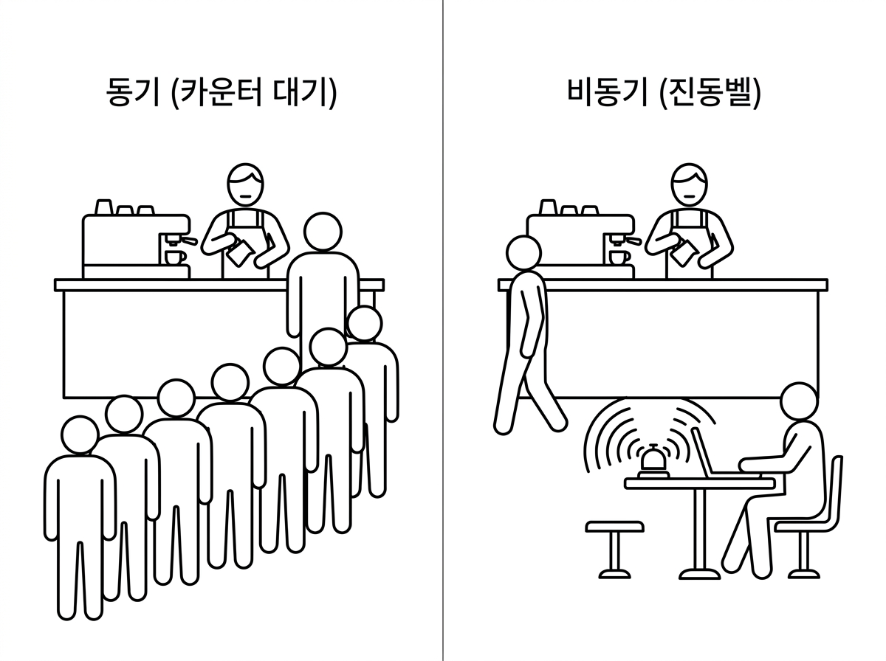
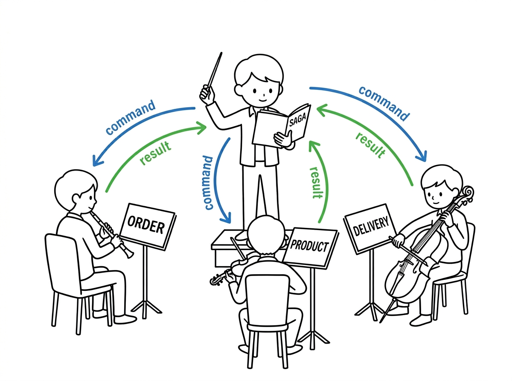
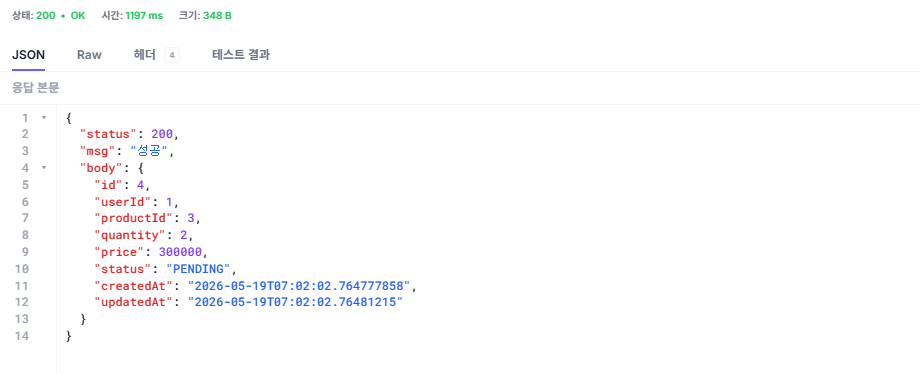
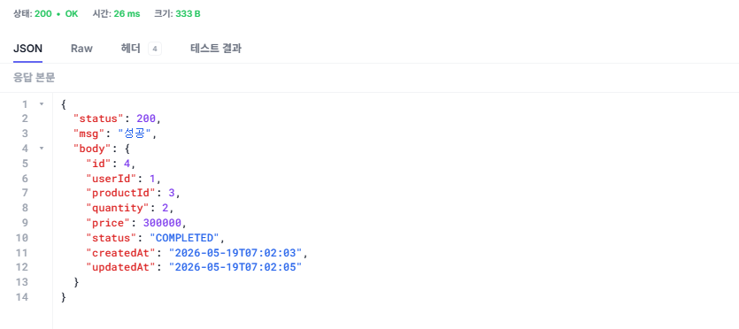
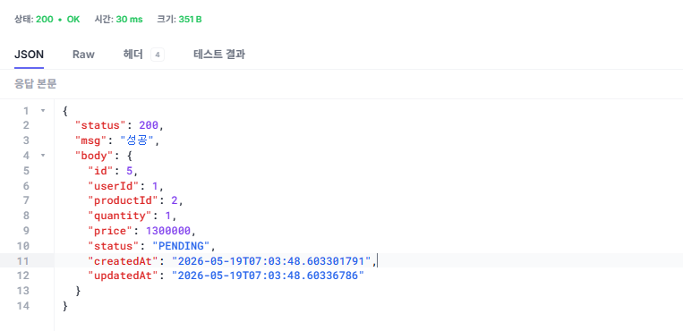
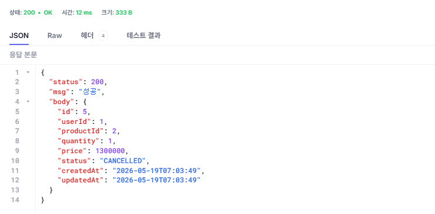

# 챕터 4. 비동기 MSA - Kafka로 서비스를 분리하다

> 이 챕터의 전체 소스코드는 **https://github.com/metacoding-12-msa/ex03** 에서 확인할 수 있습니다.

<div class="svg-figure">
<svg viewBox="0 0 1200 880" xmlns="http://www.w3.org/2000/svg" role="img" aria-label="챕터 4 한눈에 보기: 챕터 3과 동일하게 Client는 클러스터 밖에 있고, 1단계 로그인은 Client가 Ingress·Gateway를 거쳐 User에 로그인하고 JWT를 응답받는다. 2단계 주문은 Client가 Ingress·Gateway를 거쳐 Order에 동기 REST로 주문하고 즉시 PENDING을 응답받는다. 그 뒤 Order·Product·Delivery 세 서비스는 가운데 Orchestrator와 event·command를 주고받고, Orchestrator가 그 모든 메시지를 아래 Kafka 토픽으로 비동기 전달한다. 서비스끼리는 직접 호출하지 않는다.">
  <defs>
    <marker id="c4f0-a" markerWidth="10" markerHeight="10" refX="8" refY="3" orient="auto"><path d="M0,0 L0,6 L8,3 z" fill="#4f46e5"/></marker>
  </defs>
  <text x="600" y="26" text-anchor="middle" font-size="17" font-weight="700" fill="#0f172a">챕터 4 한눈에 보기 — 1단계 로그인은 챕터 3과 동일, 2단계 주문은 Kafka 비동기</text>
  <rect x="200" y="58" width="980" height="760" rx="14" fill="none" stroke="#4f46e5" stroke-width="1.6" stroke-dasharray="6,4"/>
  <text x="220" y="78" font-size="12" font-weight="700" fill="#3730a3">Kubernetes 클러스터 · metacoding</text>
  <text x="36" y="98" font-size="13" font-weight="700" fill="#475569">1단계 — 로그인</text>
  <rect x="20" y="108" width="140" height="80" rx="8" fill="#fff" stroke="#475569" stroke-width="1.6"/>
  <text x="90" y="141" text-anchor="middle" font-size="16" font-weight="700" fill="#0f172a">Client</text>
  <text x="90" y="164" text-anchor="middle" font-size="12" fill="#6b7280">사용자</text>
  <rect x="290" y="108" width="140" height="80" rx="8" fill="#fff" stroke="#475569" stroke-width="1.6"/>
  <text x="360" y="141" text-anchor="middle" font-size="15" font-weight="700" fill="#0f172a">Ingress</text>
  <text x="360" y="164" text-anchor="middle" font-size="12" fill="#6b7280">외부 진입점</text>
  <rect x="510" y="108" width="140" height="80" rx="8" fill="#fff" stroke="#475569" stroke-width="1.6"/>
  <text x="580" y="141" text-anchor="middle" font-size="15" font-weight="700" fill="#0f172a">Gateway</text>
  <text x="580" y="164" text-anchor="middle" font-size="12" fill="#6b7280">Nginx 라우팅</text>
  <rect x="720" y="108" width="170" height="80" rx="8" fill="#fff" stroke="#475569" stroke-width="1.6"/>
  <text x="805" y="141" text-anchor="middle" font-size="16" font-weight="700" fill="#0f172a">User</text>
  <text x="805" y="164" text-anchor="middle" font-size="12" fill="#6b7280">:8083 회원</text>
  <line x1="160" y1="140" x2="288" y2="140" stroke="#4f46e5" stroke-width="1.6" marker-end="url(#c4f0-a)"/>
  <text x="225" y="132" text-anchor="middle" font-size="13" font-weight="600" fill="#4f46e5">1. 요청</text>
  <line x1="430" y1="140" x2="508" y2="140" stroke="#4f46e5" stroke-width="1.6" marker-end="url(#c4f0-a)"/>
  <text x="470" y="132" text-anchor="middle" font-size="13" font-weight="600" fill="#4f46e5">2. 라우팅</text>
  <line x1="650" y1="140" x2="718" y2="140" stroke="#4f46e5" stroke-width="1.6" marker-end="url(#c4f0-a)"/>
  <text x="685" y="132" text-anchor="middle" font-size="13" font-weight="600" fill="#4f46e5">3. 로그인</text>
  <line x1="718" y1="168" x2="652" y2="168" stroke="#3730a3" stroke-width="1.6" stroke-dasharray="4,3" marker-end="url(#c4f0-a)"/>
  <text x="685" y="181" text-anchor="middle" font-size="13" font-weight="600" fill="#3730a3">4. 응답</text>
  <line x1="508" y1="168" x2="432" y2="168" stroke="#3730a3" stroke-width="1.6" stroke-dasharray="4,3" marker-end="url(#c4f0-a)"/>
  <text x="470" y="181" text-anchor="middle" font-size="13" font-weight="600" fill="#3730a3">5. 응답</text>
  <line x1="288" y1="168" x2="162" y2="168" stroke="#3730a3" stroke-width="1.6" stroke-dasharray="4,3" marker-end="url(#c4f0-a)"/>
  <text x="225" y="181" text-anchor="middle" font-size="13" font-weight="600" fill="#3730a3">6. JWT 응답</text>
  <text x="36" y="258" font-size="13" font-weight="700" fill="#475569">2단계 — 주문 생성</text>
  <rect x="20" y="268" width="140" height="80" rx="8" fill="#fff" stroke="#475569" stroke-width="1.6"/>
  <text x="90" y="301" text-anchor="middle" font-size="16" font-weight="700" fill="#0f172a">Client</text>
  <text x="90" y="324" text-anchor="middle" font-size="12" fill="#6b7280">사용자</text>
  <rect x="290" y="268" width="140" height="80" rx="8" fill="#fff" stroke="#475569" stroke-width="1.6"/>
  <text x="360" y="301" text-anchor="middle" font-size="15" font-weight="700" fill="#0f172a">Ingress</text>
  <text x="360" y="324" text-anchor="middle" font-size="12" fill="#6b7280">외부 진입점</text>
  <rect x="510" y="268" width="140" height="80" rx="8" fill="#fff" stroke="#475569" stroke-width="1.6"/>
  <text x="580" y="301" text-anchor="middle" font-size="15" font-weight="700" fill="#0f172a">Gateway</text>
  <text x="580" y="324" text-anchor="middle" font-size="12" fill="#6b7280">Nginx 라우팅</text>
  <line x1="160" y1="300" x2="288" y2="300" stroke="#4f46e5" stroke-width="1.6" marker-end="url(#c4f0-a)"/>
  <text x="225" y="292" text-anchor="middle" font-size="13" font-weight="600" fill="#4f46e5">7. 요청</text>
  <line x1="430" y1="300" x2="508" y2="300" stroke="#4f46e5" stroke-width="1.6" marker-end="url(#c4f0-a)"/>
  <text x="470" y="292" text-anchor="middle" font-size="13" font-weight="600" fill="#4f46e5">8. 라우팅</text>
  <line x1="560" y1="348" x2="390" y2="430" stroke="#4f46e5" stroke-width="1.6" marker-end="url(#c4f0-a)"/>
  <text x="450" y="392" text-anchor="end" font-size="13" font-weight="600" fill="#4f46e5">9. 주문 생성</text>
  <line x1="430" y1="430" x2="600" y2="348" stroke="#3730a3" stroke-width="1.6" stroke-dasharray="4,3" marker-end="url(#c4f0-a)"/>
  <text x="536" y="392" text-anchor="start" font-size="13" font-weight="600" fill="#3730a3">10. 응답</text>
  <line x1="508" y1="326" x2="432" y2="326" stroke="#3730a3" stroke-width="1.6" stroke-dasharray="4,3" marker-end="url(#c4f0-a)"/>
  <text x="470" y="342" text-anchor="middle" font-size="13" font-weight="600" fill="#3730a3">11. 응답</text>
  <line x1="288" y1="326" x2="162" y2="326" stroke="#3730a3" stroke-width="1.6" stroke-dasharray="4,3" marker-end="url(#c4f0-a)"/>
  <text x="225" y="342" text-anchor="middle" font-size="12" font-weight="600" fill="#3730a3">12. PENDING 응답</text>
  <rect x="300" y="430" width="170" height="80" rx="8" fill="#eef2ff" stroke="#4f46e5" stroke-width="1.8"/>
  <text x="385" y="463" text-anchor="middle" font-size="16" font-weight="700" fill="#3730a3">Order</text>
  <text x="385" y="486" text-anchor="middle" font-size="12" fill="#3730a3">:8081 주문</text>
  <rect x="560" y="430" width="170" height="80" rx="8" fill="#fff" stroke="#475569" stroke-width="1.6"/>
  <text x="645" y="463" text-anchor="middle" font-size="16" font-weight="700" fill="#0f172a">Product</text>
  <text x="645" y="486" text-anchor="middle" font-size="12" fill="#6b7280">:8082 상품</text>
  <rect x="820" y="430" width="170" height="80" rx="8" fill="#fff" stroke="#475569" stroke-width="1.6"/>
  <text x="905" y="463" text-anchor="middle" font-size="16" font-weight="700" fill="#0f172a">Delivery</text>
  <text x="905" y="486" text-anchor="middle" font-size="12" fill="#6b7280">:8084 배달</text>
  <rect x="360" y="588" width="580" height="68" rx="8" fill="#fff4ed" stroke="#ff7849" stroke-width="2"/>
  <rect x="360" y="588" width="580" height="20" fill="#ff7849"/>
  <text x="650" y="603" text-anchor="middle" font-size="11" font-weight="700" fill="#fff">Kafka — 모든 메시지가 토픽을 거쳐 비동기로 전달</text>
  <rect x="410" y="618" width="76" height="28" rx="2" fill="#fff" stroke="#ff7849" stroke-width="1"/>
  <path d="M410 618 L448 631 L486 618" fill="none" stroke="#ff7849" stroke-width="1"/>
  <rect x="530" y="618" width="76" height="28" rx="2" fill="#fff" stroke="#ff7849" stroke-width="1"/>
  <path d="M530 618 L568 631 L606 618" fill="none" stroke="#ff7849" stroke-width="1"/>
  <rect x="650" y="618" width="76" height="28" rx="2" fill="#fff" stroke="#ff7849" stroke-width="1"/>
  <path d="M650 618 L688 631 L726 618" fill="none" stroke="#ff7849" stroke-width="1"/>
  <rect x="770" y="618" width="76" height="28" rx="2" fill="#fff" stroke="#ff7849" stroke-width="1"/>
  <path d="M770 618 L808 631 L846 618" fill="none" stroke="#ff7849" stroke-width="1"/>
  <rect x="320" y="716" width="620" height="88" rx="10" fill="#c7d2fe" stroke="#4f46e5" stroke-width="2.4"/>
  <text x="630" y="750" text-anchor="middle" font-size="20" font-weight="700" fill="#312e81">Orchestrator</text>
  <text x="630" y="774" text-anchor="middle" font-size="12" font-weight="600" fill="#312e81">흐름을 결정하는 지휘자</text>
  <text x="630" y="792" text-anchor="middle" font-size="11" fill="#3730a3">event를 받아 다음 command를 발행 (서비스는 명령 못 냄)</text>
  <line x1="370" y1="512" x2="370" y2="586" stroke="#4f46e5" stroke-width="1.6" stroke-dasharray="4,3" marker-end="url(#c4f0-a)"/>
  <text x="356" y="552" text-anchor="end" font-size="12" font-weight="600" fill="#3730a3"><tspan font-size="17" font-weight="700">❶</tspan> 주문 생성 발행</text>
  <line x1="400" y1="586" x2="400" y2="512" stroke="#4f46e5" stroke-width="1.6" marker-end="url(#c4f0-a)"/>
  <text x="414" y="552" text-anchor="start" font-size="12" font-weight="600" fill="#4f46e5"><tspan font-size="17" font-weight="700">❻</tspan> 주문 완료 명령</text>
  <line x1="630" y1="512" x2="630" y2="586" stroke="#4f46e5" stroke-width="1.6" stroke-dasharray="4,3" marker-end="url(#c4f0-a)"/>
  <text x="616" y="552" text-anchor="end" font-size="12" font-weight="600" fill="#3730a3"><tspan font-size="17" font-weight="700">❸</tspan> 재고 차감 결과</text>
  <line x1="660" y1="586" x2="660" y2="512" stroke="#4f46e5" stroke-width="1.6" marker-end="url(#c4f0-a)"/>
  <text x="674" y="552" text-anchor="start" font-size="12" font-weight="600" fill="#4f46e5"><tspan font-size="17" font-weight="700">❷</tspan> 재고 차감 명령</text>
  <line x1="890" y1="512" x2="890" y2="586" stroke="#4f46e5" stroke-width="1.6" stroke-dasharray="4,3" marker-end="url(#c4f0-a)"/>
  <text x="876" y="552" text-anchor="end" font-size="12" font-weight="600" fill="#3730a3"><tspan font-size="17" font-weight="700">❺</tspan> 배달 생성 결과</text>
  <line x1="920" y1="586" x2="920" y2="512" stroke="#4f46e5" stroke-width="1.6" marker-end="url(#c4f0-a)"/>
  <text x="934" y="552" text-anchor="start" font-size="12" font-weight="600" fill="#4f46e5"><tspan font-size="17" font-weight="700">❹</tspan> 배달 생성 명령</text>
  <line x1="615" y1="660" x2="615" y2="714" stroke="#4f46e5" stroke-width="2.4" marker-end="url(#c4f0-a)"/>
  <text x="603" y="690" text-anchor="end" font-size="12" font-weight="700" fill="#4f46e5">발행</text>
  <line x1="645" y1="714" x2="645" y2="662" stroke="#4f46e5" stroke-width="2.4" stroke-dasharray="4,3" marker-end="url(#c4f0-a)"/>
  <text x="657" y="690" text-anchor="start" font-size="12" font-weight="700" fill="#3730a3">구독</text>
  <text x="600" y="844" text-anchor="middle" font-size="13" fill="#6b7280" font-style="italic">1단계 로그인은 챕터 3과 동일(①~⑥) · 2단계 진입(⑦⑧⑨⑩) 뒤 서비스가 Orchestrator와 event·command를 주고받고 Kafka 토픽으로 비동기 전달 (서비스끼리 직접 호출 없음)</text>
</svg>
</div>

*그림 4-1. 챕터 4 한눈에 보기 - 서비스·Orchestrator·Kafka 3층 구조*

:::goal
이번 챕터가 끝나면

- 동기 REST 호출의 한계를 이해하고 비동기 메시지 방식의 장점을 설명할 수 있습니다.
- Kafka의 토픽, 프로듀서, 컨슈머, 컨슈머 그룹 개념을 이해할 수 있습니다.
- Orchestration Saga 패턴을 Kafka로 구현할 수 있습니다.
- order-service의 동기 호출을 Kafka 이벤트 발행으로 교체할 수 있습니다.
- orchestrator가 워크플로우 상태를 추적하고 실패 시 자동 롤백하는 방법을 이해할 수 있습니다.
:::

::::prep
**준비하기**. 실습 시작 전 한 번만 설정

### 1. 소스 코드 클론

```bash [터미널] 레포 클론
git clone https://github.com/metacoding-12-msa/ex03.git
cd ex03
```

### 2. 파일 구조

```text ex03 디렉토리
ex03/
├── order/              # 포트 8081
├── product/            # 포트 8082
├── user/               # 포트 8083
├── delivery/           # 포트 8084
├── orchestrator/       # Kafka 워크플로우 조율 (이번 챕터 신규)
├── gateway/            # Nginx API Gateway
├── db/                 # MySQL
└── k8s/                # Kubernetes 매니페스트 (kafka 포함)
```

서비스마다 패키지 구조가 조금씩 다르므로, 코드를 작성할 파일 경로는 각 실습 코드블록 바로 위에서 안내합니다.

### 3. Kafka

이 챕터는 Kafka를 별도로 설치하지 않습니다. Kubernetes 매니페스트(`k8s/kafka/`)로 Minikube 안에 띄우므로, 챕터 3에서 준비한 Docker Desktop과 Minikube만 있으면 됩니다.

### 4. 실습 순서

1. order-service의 REST 호출을 Kafka 이벤트 발행으로 교체
2. product-service · delivery-service에 Kafka Consumer/Producer 추가
3. 새 서비스 **orchestrator**에서 워크플로우 조율 로직 작성
4. K8s에 Kafka + orchestrator 배포
5. 정상 주문 / 품절 롤백 시나리오 검증

:::note
**이번 챕터는 책에서 가장 복잡한 내용을 다룹니다.** 여러 서비스가 동시에 Kafka 메시지를 주고받으며 상태가 바뀝니다. 전체 토픽맵(4.2.2)과 흐름 표(4.3.1~4.3.2)를 먼저 훑어보고 시작하면 길을 잃지 않습니다.
:::
::::

## 4.1 동기 호출의 한계 - 한 서비스가 멈추면 전체가 멈춘다

배포 다음 날 아침, 모니터에 알림이 울렸습니다. 에러 그래프가 한 칸 솟았다가 곧 가라앉았습니다. 상품 서버가 잠깐 죽었고, 쿠버네티스가 다시 띄웠습니다.

그런데 그 잠깐 사이에 들어온 주문이 전부 실패해 있었습니다. 주문 서버는 재고를 줄이려고 상품 서버를 직접 호출했는데, 상품 서버가 죽어 있어 호출이 실패했습니다. 주문 처리는 그 응답을 기다리던 중이라, 호출이 실패하면서 주문 처리도 함께 실패했습니다.

*서로 직접 부르니까, 하나가 멈추면 기다리던 쪽도 같이 멈추는구나.*

선배가 모니터를 들여다봤습니다.

**선배**: "동기로 직접 호출하니까 그래요. 호출한 쪽은 상대가 응답할 때까지 기다리는데, 상대가 잠깐 죽으면 호출한 쪽도 같이 멈춰요. 이럴 땐 호출을 붙잡고 기다리지 말고 비동기로 메시지를 주고받아야 해요. 그 비동기 통신을 해 주는 게 **Kafka**예요."

**오픈이**: "메시지요? 상대가 없으면 어떻게 되는데요?"

**선배**: "주문하는 쪽은 메시지를 남기고 진동벨을 받고 돌아가요. 재고 담당자는 자기 차례가 되면 쌓인 메시지를 꺼내 처리해요. 담당자가 잠깐 자리를 비워도 메시지는 그 자리에 남아 있어요. 돌아와서 그때 처리하면 되죠."

**선배**: "결국 이게 MSA가 노린 거예요. 서비스를 따로 배포하고, 하나가 죽어도 나머지는 멀쩡해야죠. 그런데 서로 직접 호출하면서 응답을 기다리는 한, 하나가 멈추면 다 같이 멈춰요. 카페로 치면 카운터 앞에서 기다리는 것과 진동벨을 받고 자리에 앉는 것의 차이예요. 그게 바로 동기와 비동기의 차이예요."

### 4.1.1 카운터 대기 vs 진동벨

**카운터 대기 방식 (동기적)**

카운터 앞에 서서 "아메리카노 하나요"라고 주문합니다. 바리스타가 커피를 만드는 동안 카운터 앞에서 기다립니다. 내 커피가 나와야 다음 손님이 주문할 수 있습니다. 바리스타가 원두를 갈다가 커피 머신이 고장 나면 뒤에 줄 선 손님 전부가 멈춥니다.


**진동벨 방식 (비동기적)**

"아메리카노 하나요"라고 주문하면 진동벨을 받고 자리에 앉습니다. 바리스타는 주문을 순서대로 처리하고, 커피가 완성되면 벨이 울립니다. 손님은 기다리는 동안 다른 일을 할 수 있고, 뒤에 줄 선 손님도 바로 주문할 수 있습니다. 커피 머신이 잠깐 멈춰도 주문 목록은 사라지지 않습니다.


<!-- image-prompt: Minimal black line drawing on white background, split comparison, 4:3 aspect ratio, 800x600px. Minimal text — let the drawing tell the story. Separated by a simple vertical line in the middle, no X mark. Left side, title "동기 (카운터 대기)": barista behind counter making coffee, one customer standing at counter waiting, four or five more customers queued behind in a long line looking bored. All frozen/blocked. Right side, title "비동기 (진동벨)": same cafe counter with barista, but the customer has walked away to a table, sitting with a laptop and a small vibration buzzer on the table. A wavy line from the buzzer indicating it will ring. No speech bubbles, no annotation text, no checklists. Clean lines, no colors. -->

*그림 4-2. 동기 vs 비동기 통신*


아침에 겪은 그 잠깐의 멈춤이 바로 카운터 대기의 풍경이었습니다. 커피 머신이 멈추자 카운터 앞에 선 손님까지 함께 멈췄고, 그 사이 들어온 주문이 전부 실패했습니다. 진동벨 방식이라면 손님은 주문만 남기고 자리로 돌아가 있으니, 커피 머신이 잠깐 멈춰도 주문은 그대로 남아 있다가 커피 머신이 복구된 후에 처리됩니다. 동기로 서로를 직접 호출하며 응답을 기다리면 한 서비스의 멈춤이 곧 전체의 멈춤이 되지만, 비동기로 메시지를 주고받으면 그렇지 않습니다.


## 4.2 Kafka - 메시지를 전달하는 우체국

비동기 통신을 실제로 담당하는 것이 **Kafka**입니다.

:::term-box
**Apache Kafka**는 서비스끼리 직접 호출하지 않고, 가운데에서 메시지를 받아 보관했다가 전달해 주는 메시지 시스템입니다. 받는 쪽이 잠시 멈춰도 메시지가 그대로 남아 있어 비동기 통신이 가능합니다.
:::

Kafka는 우체국입니다. 발신자가 우편을 부치면, 우체국은 **일반 편지, 등기, 특송, 택배처럼 종류별로 나눠** 따로 보관합니다. 그리고 집배원은 자기가 처리할 종류의 칸에서만 우편을 꺼내 갑니다. 우체국을 사이에 두고 우편을 주고받기 때문에, 비동기적으로 각자의 시간에 일을 처리할 수 있습니다.

<div class="svg-figure">
<svg viewBox="0 0 1180 470" xmlns="http://www.w3.org/2000/svg" role="img" aria-label="Kafka 우체국: 프로듀서가 우편을 부치면 우체국이 종류별 우편함에 보관하고 집배원(컨슈머)이 자기 우편함에서 가져간다">
  <defs>
    <marker id="ka" markerWidth="9" markerHeight="9" refX="7" refY="3" orient="auto"><path d="M0,0 L0,6 L8,3 z" fill="#4f46e5"/></marker>
    <marker id="kb" markerWidth="9" markerHeight="9" refX="7" refY="3" orient="auto"><path d="M0,0 L0,6 L8,3 z" fill="#3730a3"/></marker>
  </defs>
  <text x="590" y="38" text-anchor="middle" font-size="19" font-weight="700" fill="#0f172a">Kafka 우체국 — 부치고 · 보관되고 · 집배원이 가져간다</text>
  <g transform="translate(58 196)">
    <rect x="46" y="78" width="8" height="40" fill="#4f46e5"/>
    <rect x="14" y="34" width="72" height="48" rx="6" fill="#fff" stroke="#4f46e5" stroke-width="2"/>
    <path d="M14 46 Q14 34 26 34 L74 34 Q86 34 86 46" fill="#eef2ff" stroke="#4f46e5" stroke-width="2"/>
    <rect x="30" y="42" width="40" height="5" rx="2" fill="#4f46e5"/>
    <g transform="translate(34 6)">
      <rect x="0" y="0" width="34" height="22" rx="2" fill="#fff" stroke="#4f46e5" stroke-width="1.6" transform="rotate(-12 17 11)"/>
      <path d="M0 0 L17 12 L34 0" fill="none" stroke="#4f46e5" stroke-width="1.6" transform="rotate(-12 17 11)"/>
    </g>
  </g>
  <text x="108" y="340" text-anchor="middle" font-size="15" font-weight="700" fill="#3730a3">프로듀서</text>
  <text x="108" y="362" text-anchor="middle" font-size="12.5" fill="#64748b">발신자</text>
  <g transform="translate(196 240)">
    <rect x="0" y="0" width="40" height="26" rx="3" fill="#eef2ff" stroke="#4f46e5" stroke-width="1.5"/>
    <path d="M0 0 L20 15 L40 0" fill="none" stroke="#4f46e5" stroke-width="1.5"/>
  </g>
  <path d="M300 156 L590 116 L880 156 Z" fill="#ffedd5" stroke="#ff7849" stroke-width="2.4" stroke-linejoin="round"/>
  <rect x="300" y="156" width="580" height="248" rx="6" fill="#fff4ed" stroke="#ff7849" stroke-width="2.4"/>
  <rect x="300" y="156" width="580" height="34" fill="#ff7849"/>
  <text x="590" y="179" text-anchor="middle" font-size="14" font-weight="700" fill="#fff">우체국 · KAFKA</text>
  <g>
    <rect x="324" y="214" width="166" height="118" rx="6" fill="#fff" stroke="#ff7849" stroke-width="1.6"/>
    <text x="407" y="238" text-anchor="middle" font-size="12" font-weight="700" fill="#9a3412">일반 편지 (토픽)</text>
    <rect x="382" y="262" width="50" height="34" rx="3" fill="#ffedd5" stroke="#ff7849" stroke-width="1.2"/>
    <path d="M382 262 L407 281 L432 262" fill="none" stroke="#ff7849" stroke-width="1.2"/>
    <rect x="507" y="214" width="166" height="118" rx="6" fill="#fff" stroke="#ff7849" stroke-width="1.6"/>
    <text x="590" y="238" text-anchor="middle" font-size="12" font-weight="700" fill="#9a3412">등기 (토픽)</text>
    <rect x="565" y="262" width="50" height="34" rx="3" fill="#ffedd5" stroke="#ff7849" stroke-width="1.2"/>
    <path d="M565 262 L590 281 L615 262" fill="none" stroke="#ff7849" stroke-width="1.2"/>
    <rect x="690" y="214" width="166" height="118" rx="6" fill="#fff" stroke="#ff7849" stroke-width="1.6"/>
    <text x="773" y="238" text-anchor="middle" font-size="12" font-weight="700" fill="#9a3412">특송 (토픽)</text>
    <rect x="748" y="262" width="50" height="34" rx="3" fill="#ffedd5" stroke="#ff7849" stroke-width="1.2"/>
    <path d="M748 262 L773 281 L798 262" fill="none" stroke="#ff7849" stroke-width="1.2"/>
  </g>
  <text x="590" y="356" text-anchor="middle" font-size="12.5" font-weight="700" fill="#9a3412">종류별 우편함 · 토픽</text>
  <g transform="translate(998 206)">
    <path d="M30 24 Q44 12 58 24 Z" fill="#eef2ff" stroke="#4f46e5" stroke-width="2" stroke-linejoin="round"/>
    <line x1="22" y1="24" x2="66" y2="24" stroke="#4f46e5" stroke-width="2.4" stroke-linecap="round"/>
    <circle cx="44" cy="42" r="14" fill="#fff" stroke="#4f46e5" stroke-width="2"/>
    <path d="M16 104 Q16 64 44 64 Q72 64 72 104" fill="#fff" stroke="#4f46e5" stroke-width="2" stroke-linejoin="round"/>
    <line x1="40" y1="66" x2="74" y2="98" stroke="#4f46e5" stroke-width="2"/>
    <rect x="60" y="92" width="40" height="32" rx="4" fill="#eef2ff" stroke="#4f46e5" stroke-width="2"/>
    <path d="M60 100 L100 100" stroke="#4f46e5" stroke-width="1.6"/>
    <rect x="74" y="86" width="12" height="8" rx="2" fill="#4f46e5"/>
  </g>
  <text x="1042" y="362" text-anchor="middle" font-size="15" font-weight="700" fill="#3730a3">컨슈머</text>
  <text x="1042" y="384" text-anchor="middle" font-size="12.5" fill="#64748b">집배원</text>
  <line x1="246" y1="253" x2="296" y2="253" stroke="#4f46e5" stroke-width="2.6" marker-end="url(#ka)"/>
  <text x="220" y="226" text-anchor="middle" font-size="13.5" font-weight="700" fill="#4f46e5">부치기</text>
  <line x1="884" y1="253" x2="990" y2="253" stroke="#3730a3" stroke-width="2.6" stroke-dasharray="5,3" marker-end="url(#kb)"/>
  <text x="937" y="226" text-anchor="middle" font-size="13.5" font-weight="700" fill="#3730a3">가져가기</text>
</svg>
</div>

*그림 4-3. Kafka 우체국 - 부치고, 보관·분류되고, 집배원이 가져간다*

그림 4-3의 Kafka 요소의 역할을 정리하면 다음과 같습니다.

| 구성요소 | 우체국 비유 | 하는 일 |
|---|---|---|
| Kafka | 우체국 | 메시지를 받아 보관하고 전달 |
| 토픽(Topic) | 종류별 우편함 (일반/등기/특송 등) | 메시지를 목적별로 나눠 담음 |
| 프로듀서(Producer) | 발신자 | 토픽에 메시지를 발행 |
| 컨슈머(Consumer) | 집배원 | 토픽을 구독해 메시지를 처리 |

**프로듀서**가 토픽에 메시지를 보내는 일을 **발행**, **컨슈머**가 자기가 다룰 토픽을 정해 두고 거기에 들어온 메시지를 받아 처리하는 일을 **구독**이라고 합니다.

그런데 같은 일을 하는 컨슈머가 여러 대 떠 있을 때는 메시지를 어떻게 나눠 받아야 할까요?

### 4.2.1 컨슈머 그룹

상품 서비스를 2대로 늘려 운영한다고 가정해 보겠습니다. 두 서버가 같은 토픽을 구독하면 "재고 1개 차감" 메시지를 둘 다 받아 처리해, 재고가 2개 줄어듭니다. 이 중복 처리를 막아 주는 것이 **컨슈머 그룹**입니다. 같은 일을 하는 서버를 한 그룹으로 묶으면, 그 메시지는 그룹 안의 한 서버에만 전달됩니다.


<div class="svg-figure">
<svg viewBox="0 0 980 560" xmlns="http://www.w3.org/2000/svg" role="img" aria-label="컨슈머 그룹 비교: 그룹으로 안 묶으면 두 컨슈머가 같은 메시지를 각각 처리해 재고가 두 번 깎이고, 같은 컨슈머 그룹으로 묶으면 한 컨슈머만 처리해 재고가 한 번만 깎인다">
  <defs>
    <marker id="cg" markerWidth="9" markerHeight="9" refX="7" refY="3" orient="auto"><path d="M0,0 L0,6 L8,3 z" fill="#4f46e5"/></marker>
  </defs>
  <text x="490" y="32" text-anchor="middle" font-size="18" font-weight="700" fill="#0f172a">컨슈머 그룹 — 같은 메시지를 두 번 처리하지 않게 묶는다</text>
  <text x="36" y="70" font-size="15" font-weight="700" fill="#0f172a">그룹으로 안 묶으면</text>
  <rect x="36" y="86" width="150" height="96" rx="6" fill="#fff4ed" stroke="#ff7849" stroke-width="2.4"/>
  <rect x="36" y="86" width="150" height="26" fill="#ff7849"/>
  <text x="111" y="104" text-anchor="middle" font-size="11.5" font-weight="700" fill="#fff">편지 (토픽)</text>
  <rect x="58" y="124" width="106" height="44" rx="3" fill="#ffedd5" stroke="#ff7849" stroke-width="1.4"/>
  <path d="M58 124 L111 148 L164 124" fill="none" stroke="#ff7849" stroke-width="1.4"/>
  <text x="111" y="152" text-anchor="middle" font-size="11.5" font-weight="700" fill="#9a3412">재고 1 차감</text>
  <g transform="translate(300 74)">
    <path d="M30 24 Q44 12 58 24 Z" fill="#eef2ff" stroke="#4f46e5" stroke-width="2" stroke-linejoin="round"/>
    <line x1="22" y1="24" x2="66" y2="24" stroke="#4f46e5" stroke-width="2.4" stroke-linecap="round"/>
    <circle cx="44" cy="42" r="14" fill="#fff" stroke="#4f46e5" stroke-width="2"/>
    <path d="M16 104 Q16 64 44 64 Q72 64 72 104" fill="#fff" stroke="#4f46e5" stroke-width="2" stroke-linejoin="round"/>
    <line x1="40" y1="66" x2="74" y2="98" stroke="#4f46e5" stroke-width="2"/>
    <rect x="60" y="92" width="40" height="32" rx="4" fill="#eef2ff" stroke="#4f46e5" stroke-width="2"/>
    <path d="M60 100 L100 100" stroke="#4f46e5" stroke-width="1.6"/>
    <rect x="74" y="86" width="12" height="8" rx="2" fill="#4f46e5"/>
  </g>
  <text x="354" y="216" text-anchor="middle" font-size="13" font-weight="700" fill="#3730a3">컨슈머 A</text>
  <text x="354" y="234" text-anchor="middle" font-size="11.5" fill="#4f46e5">처리</text>
  <g transform="translate(440 74)">
    <path d="M30 24 Q44 12 58 24 Z" fill="#eef2ff" stroke="#4f46e5" stroke-width="2" stroke-linejoin="round"/>
    <line x1="22" y1="24" x2="66" y2="24" stroke="#4f46e5" stroke-width="2.4" stroke-linecap="round"/>
    <circle cx="44" cy="42" r="14" fill="#fff" stroke="#4f46e5" stroke-width="2"/>
    <path d="M16 104 Q16 64 44 64 Q72 64 72 104" fill="#fff" stroke="#4f46e5" stroke-width="2" stroke-linejoin="round"/>
    <line x1="40" y1="66" x2="74" y2="98" stroke="#4f46e5" stroke-width="2"/>
    <rect x="60" y="92" width="40" height="32" rx="4" fill="#eef2ff" stroke="#4f46e5" stroke-width="2"/>
    <path d="M60 100 L100 100" stroke="#4f46e5" stroke-width="1.6"/>
    <rect x="74" y="86" width="12" height="8" rx="2" fill="#4f46e5"/>
  </g>
  <text x="494" y="216" text-anchor="middle" font-size="13" font-weight="700" fill="#3730a3">컨슈머 B</text>
  <text x="494" y="234" text-anchor="middle" font-size="11.5" fill="#4f46e5">처리</text>
  <path d="M186 138 Q250 130 314 140" fill="none" stroke="#4f46e5" stroke-width="2.2" marker-end="url(#cg)"/>
  <path d="M186 160 Q330 196 454 140" fill="none" stroke="#4f46e5" stroke-width="2.2" marker-end="url(#cg)"/>
  <rect x="620" y="98" width="324" height="92" rx="10" fill="#fff" stroke="#e7d9a8" stroke-width="1.6"/>
  <text x="640" y="132" font-size="14" fill="#0f172a">둘 다 같은 메시지를 처리해서</text>
  <text x="640" y="162" font-size="17" font-weight="700" fill="#9a3412">상품 재고 10 → 8 (두 번 깎임)</text>
  <line x1="36" y1="270" x2="944" y2="270" stroke="#e2e8f0" stroke-width="1.5"/>
  <text x="36" y="318" font-size="15" font-weight="700" fill="#0f172a">같은 컨슈머 그룹으로 묶으면</text>
  <rect x="36" y="334" width="150" height="96" rx="6" fill="#fff4ed" stroke="#ff7849" stroke-width="2.4"/>
  <rect x="36" y="334" width="150" height="26" fill="#ff7849"/>
  <text x="111" y="352" text-anchor="middle" font-size="11.5" font-weight="700" fill="#fff">편지 (토픽)</text>
  <rect x="58" y="372" width="106" height="44" rx="3" fill="#ffedd5" stroke="#ff7849" stroke-width="1.4"/>
  <path d="M58 372 L111 396 L164 372" fill="none" stroke="#ff7849" stroke-width="1.4"/>
  <text x="111" y="400" text-anchor="middle" font-size="11.5" font-weight="700" fill="#9a3412">재고 1 차감</text>
  <rect x="262" y="306" width="300" height="216" rx="14" fill="#fff" stroke="#4f46e5" stroke-width="1.8" stroke-dasharray="6 5"/>
  <text x="412" y="330" text-anchor="middle" font-size="13" font-weight="700" fill="#3730a3">하나의 컨슈머 그룹</text>
  <g transform="translate(296 350)">
    <path d="M30 24 Q44 12 58 24 Z" fill="#eef2ff" stroke="#4f46e5" stroke-width="2" stroke-linejoin="round"/>
    <line x1="22" y1="24" x2="66" y2="24" stroke="#4f46e5" stroke-width="2.4" stroke-linecap="round"/>
    <circle cx="44" cy="42" r="14" fill="#fff" stroke="#4f46e5" stroke-width="2"/>
    <path d="M16 104 Q16 64 44 64 Q72 64 72 104" fill="#fff" stroke="#4f46e5" stroke-width="2" stroke-linejoin="round"/>
    <line x1="40" y1="66" x2="74" y2="98" stroke="#4f46e5" stroke-width="2"/>
    <rect x="60" y="92" width="40" height="32" rx="4" fill="#eef2ff" stroke="#4f46e5" stroke-width="2"/>
    <path d="M60 100 L100 100" stroke="#4f46e5" stroke-width="1.6"/>
    <rect x="74" y="86" width="12" height="8" rx="2" fill="#4f46e5"/>
  </g>
  <text x="350" y="492" text-anchor="middle" font-size="13" font-weight="700" fill="#3730a3">컨슈머 A</text>
  <text x="350" y="510" text-anchor="middle" font-size="11.5" fill="#4f46e5">이 메시지 처리</text>
  <g transform="translate(440 350)" opacity="0.5">
    <path d="M30 24 Q44 12 58 24 Z" fill="#f1f5f9" stroke="#94a3b8" stroke-width="2" stroke-linejoin="round"/>
    <line x1="22" y1="24" x2="66" y2="24" stroke="#94a3b8" stroke-width="2.4" stroke-linecap="round"/>
    <circle cx="44" cy="42" r="14" fill="#fff" stroke="#94a3b8" stroke-width="2"/>
    <path d="M16 104 Q16 64 44 64 Q72 64 72 104" fill="#fff" stroke="#94a3b8" stroke-width="2" stroke-linejoin="round"/>
    <line x1="40" y1="66" x2="74" y2="98" stroke="#94a3b8" stroke-width="2"/>
    <rect x="60" y="92" width="40" height="32" rx="4" fill="#f1f5f9" stroke="#94a3b8" stroke-width="2"/>
  </g>
  <text x="494" y="492" text-anchor="middle" font-size="13" font-weight="700" fill="#94a3b8">컨슈머 B</text>
  <text x="494" y="510" text-anchor="middle" font-size="11.5" fill="#94a3b8">이 메시지는 안 받음</text>
  <path d="M186 386 Q240 380 290 388" fill="none" stroke="#4f46e5" stroke-width="2.2" marker-end="url(#cg)"/>
  <rect x="620" y="350" width="324" height="92" rx="10" fill="#fff" stroke="#e7d9a8" stroke-width="1.6"/>
  <text x="640" y="384" font-size="14" fill="#0f172a">그룹 안 한 명만 처리해서</text>
  <text x="640" y="414" font-size="17" font-weight="700" fill="#3730a3">상품 재고 10 → 9 (한 번만)</text>
</svg>
</div>

*그림 4-4. 컨슈머 그룹 - 안 묶으면 재고가 두 번 깎이고, 같은 그룹으로 묶으면 한 번만 깎인다*


### 4.2.2 이번 챕터에서 사용하는 토픽 맵

이 챕터에서는 핵심 흐름만 직접 다루므로, 각 토픽의 발행·구독 코드 전체는 깃헙 레포에서 확인합니다.

총 8개의 토픽을 사용합니다. `command`가 붙은 토픽은 orchestrator가 각 서비스에 내리는 명령입니다. `command`가 없는 토픽은 각 서비스가 처리 결과를 orchestrator에 보고하는 이벤트입니다.

<p><strong>정상 흐름 (6단계)</strong></p>

<table>
  <colgroup>
    <col style="width:8%">
    <col style="width:40%">
    <col style="width:28%">
    <col style="width:24%">
  </colgroup>
  <thead>
    <tr><th style="text-align:center">단계</th><th>토픽</th><th>발행 → 구독</th><th>목적</th></tr>
  </thead>
  <tbody>
    <tr><td style="text-align:center">1</td><td><code>order-created</code></td><td>order → orchestrator</td><td>새 주문 발생</td></tr>
    <tr><td style="text-align:center">2</td><td><code>decrease-product-command</code></td><td>orchestrator → product</td><td>재고 감소 명령</td></tr>
    <tr><td style="text-align:center">3</td><td><code>product-decreased</code></td><td>product → orchestrator</td><td>재고 감소 결과</td></tr>
    <tr><td style="text-align:center">4</td><td><code>create-delivery-command</code></td><td>orchestrator → delivery</td><td>배달 생성 명령</td></tr>
    <tr><td style="text-align:center">5</td><td><code>delivery-created</code></td><td>delivery → orchestrator</td><td>배달 생성 결과</td></tr>
    <tr><td style="text-align:center">6</td><td><code>complete-order-command</code></td><td>orchestrator → order</td><td>주문 완료 명령</td></tr>
  </tbody>
</table>

<p><strong>롤백 흐름 (2개)</strong></p>

<table>
  <colgroup>
    <col style="width:44%">
    <col style="width:30%">
    <col style="width:26%">
  </colgroup>
  <thead>
    <tr><th>토픽</th><th>발행 → 구독</th><th>목적</th></tr>
  </thead>
  <tbody>
    <tr><td><code>cancel-order-command</code></td><td>orchestrator → order</td><td>주문 취소</td></tr>
    <tr><td><code>increase-product-command</code></td><td>orchestrator → product</td><td>재고 복구</td></tr>
  </tbody>
</table>

**오픈이**: "메시지 방식으로 바꾸니까, 전체 흐름을 누가 관리해야 할지 모르겠어요."

**선배**: "전체 흐름을 관리하는 **지휘자**를 만들면 편해요. 전체 악보를 보고 순서를 정하는 것처럼, 각 서비스는 자기 일만 하고 결과만 보고하게 해요."

:::tip
**Kafka 더 알아두기**

- **컨슈머가 읽어도 메시지는 남는다**: 우체국에서 우편을 꺼내 읽어도 그 우편은 함에 그대로 보관됩니다(기본 7일). 그래서 서로 다른 컨슈머가 같은 메시지를 각자 자기 속도로 찾아 읽을 수 있고, 장애가 나도 다시 읽어 처리할 수 있습니다.
- **RabbitMQ 같은 큐와의 차이**: 전통적인 메시지 큐는 컨슈머가 메시지를 읽으면 큐에서 바로 사라집니다. Kafka는 읽어도 남아 있다는 점이 가장 큰 차이입니다.
:::

## 4.3 Orchestration Saga - 지휘자가 흐름을 조율하다

각 서비스가 자기 단계만 처리해 결과를 메시지로 발행하고, 별도의 관리자가 다음 단계와 보상을 책임지는 분산 트랜잭션 패턴을 **Saga 패턴**이라고 합니다.

Saga 패턴의 흐름 관리를 한 서비스가 중앙에서 지휘하는 방식이 **Orchestration Saga**, 그 지휘자 서비스가 **orchestrator**입니다. 흐름을 한 곳에 모으면 상태가 한 곳에 있어 추적과 롤백이 단순해지고, 각 서비스는 자기 일에만 집중할 수 있습니다.

<!-- image-prompt: Clean black line drawing on white background, simplified orchestra illustration, 4:3 aspect ratio, 800x600px. No stage, no curtains, no background. Center: a conductor on a small podium holding a baton and a score labeled "SAGA", drawn in a clean cartoon style (not stick figures — simple but with body proportions, hair, clothing outlines). Three musicians sitting around the conductor with recognizable instruments and music stands labeled "ORDER", "PRODUCT", "DELIVERY". Blue curved arrows from conductor to each musician labeled "command". Green curved arrows from each musician back labeled "result". Simple cartoon style like a textbook illustration — more detailed than stick figures but less detailed than realistic. No shading, no colors except blue and green arrows. -->

*그림 4-5. Orchestration Saga 구조*

이번 챕터의 예제에서는 주문 요청이 들어오면 orchestrator가 재고 차감, 배달 생성, 주문 완료 단계를 순서대로 지휘합니다.

:::note
**Saga 패턴을 구현하는 방식에는 Choreography도 있습니다.** 중앙 지휘자 없이 각 서비스가 이벤트를 발행하고 구독하며 다음 단계를 스스로 이어 갑니다. 단계가 적을 때는 가볍지만, 단계가 늘거나 보상이 복잡해질수록 전체 흐름이 여러 서비스에 흩어져 추적이 어렵습니다. 이 책은 상태를 한 곳에서 추적할 수 있는 Orchestration을 선택합니다.
:::


### 4.3.1 주문 요청 성공 흐름

orchestrator를 사이에 두고 비동기로 동작하면, 주문 요청이 들어왔을 때 주문 서비스는 우선 **PENDING** 상태를 응답합니다. 이후 orchestrator가 아래 단계를 차례로 진행해 모두 성공하면 주문 상태가 **COMPLETED**로 바뀝니다.

<div class="svg-figure">
<svg viewBox="260 30 1320 560" xmlns="http://www.w3.org/2000/svg">
  <defs>
   <marker id="mk" markerWidth="10" markerHeight="10" refX="8" refY="3" orient="auto"><path d="M0,0 L0,6 L8,3 z" fill="#4f46e5"/></marker>
   <marker id="mk2" markerWidth="10" markerHeight="10" refX="8" refY="3" orient="auto"><path d="M0,0 L0,6 L8,3 z" fill="#3730a3"/></marker>
  </defs>
  <text x="680" y="50" text-anchor="middle" font-size="16" font-weight="700" fill="#0f172a">1단계 — 주문 생성 이벤트 발행 → 오케스트레이터 수신</text>
  <rect x="345" y="64" width="170" height="70" rx="8" fill="#eef2ff" stroke="#4f46e5" stroke-width="1.8"/>
 <text x="430" y="94" text-anchor="middle" font-size="16" font-weight="700" fill="#3730a3">Order</text>
 <text x="430" y="116" text-anchor="middle" font-size="12" fill="#3730a3">:8081 주문</text><rect x="575" y="64" width="170" height="70" rx="8" fill="#fff" stroke="#cbd5e1" stroke-width="1.4"/>
 <text x="660" y="94" text-anchor="middle" font-size="16" font-weight="700" fill="#94a3b8">Product</text>
 <text x="660" y="116" text-anchor="middle" font-size="12" fill="#cbd5e1">:8082 상품</text><rect x="805" y="64" width="170" height="70" rx="8" fill="#fff" stroke="#cbd5e1" stroke-width="1.4"/>
 <text x="890" y="94" text-anchor="middle" font-size="16" font-weight="700" fill="#94a3b8">Delivery</text>
 <text x="890" y="116" text-anchor="middle" font-size="12" fill="#cbd5e1">:8084 배달</text><rect x="280" y="250" width="780" height="120" rx="9" fill="#fff4ed" stroke="#ff7849" stroke-width="2"/>
 <rect x="280" y="250" width="780" height="22" fill="#ff7849"/>
 <text x="670" y="265" text-anchor="middle" font-size="11" font-weight="700" fill="#fff">Kafka — 토픽별로 메시지를 보관·전달</text><rect x="300" y="290" width="110" height="42" rx="3" fill="#ffedd5" stroke="#ff7849" stroke-width="1.8"/>
   <path d="M300 290 L355 311 L410 290" fill="none" stroke="#ff7849" stroke-width="1.4"/>
   <text x="355" y="350" text-anchor="middle" font-size="9.5" font-weight="700" fill="#9a3412">주문 생성 이벤트</text><circle cx="392" cy="298" r="10" fill="#ff7849"/><text x="392" y="302" text-anchor="middle" font-size="11" font-weight="700" fill="#fff">1</text><rect x="300" y="480" width="760" height="88" rx="10" fill="#c7d2fe" stroke="#4f46e5" stroke-width="2.4"/>
 <text x="680" y="514" text-anchor="middle" font-size="20" font-weight="700" fill="#312e81">Orchestrator</text>
 <text x="680" y="538" text-anchor="middle" font-size="12" fill="#312e81">흐름을 결정하는 지휘자 — event를 받아 다음 command를 발행</text><line x1="430" y1="134" x2="355" y2="248" stroke="#4f46e5" stroke-width="2.6" marker-end="url(#mk)"/><text x="414.5" y="192" text-anchor="start" font-size="13" font-weight="700" fill="#4f46e5">1. 주문 생성 이벤트 발행</text><line x1="355" y1="370" x2="355" y2="478" stroke="#3730a3" stroke-width="2.6" stroke-dasharray="5,3" marker-end="url(#mk2)"/><text x="377" y="429" text-anchor="start" font-size="13" font-weight="700" fill="#3730a3">2. 오케스트레이터가 수신</text><rect x="1090" y="40" width="460" height="510" rx="10" fill="#fffdf5" stroke="#e7d9a8" stroke-width="1.5"/>
  <line x1="1132" y1="40" x2="1132" y2="550" stroke="#f0e6c8" stroke-width="1.3"/>
  <text x="1146" y="84" font-size="22" font-weight="700" fill="#9a3412">1단계</text><text x="1146" y="124" font-size="20" font-weight="700" fill="#0f172a">1. 주문 생성 이벤트 발행</text><text x="1146" y="158" font-size="18" font-weight="400" fill="#475569">주문을 저장한 뒤</text><text x="1146" y="185" font-size="18" font-weight="400" fill="#475569">PENDING을 응답합니다.</text><text x="1146" y="212" font-size="18" font-weight="400" fill="#475569">그 후 주문 이벤트를</text><text x="1146" y="239" font-size="18" font-weight="400" fill="#475569">카프카에 발행합니다.</text><text x="1146" y="279" font-size="20" font-weight="700" fill="#0f172a">2. 오케스트레이터가 수신</text><text x="1146" y="313" font-size="18" font-weight="400" fill="#475569">오케스트레이터가 그 토픽을</text><text x="1146" y="340" font-size="18" font-weight="400" fill="#475569">구독하고 있다가 메시지를</text><text x="1146" y="367" font-size="18" font-weight="400" fill="#475569">받아 진행 상태를 기록합니다.</text>
 </svg>
</div>

*그림 4-6. 1단계 — 주문 생성 이벤트 발행 → 오케스트레이터 수신*

<div class="svg-figure">
<svg viewBox="260 30 1320 560" xmlns="http://www.w3.org/2000/svg">
  <defs>
   <marker id="mk" markerWidth="10" markerHeight="10" refX="8" refY="3" orient="auto"><path d="M0,0 L0,6 L8,3 z" fill="#4f46e5"/></marker>
   <marker id="mk2" markerWidth="10" markerHeight="10" refX="8" refY="3" orient="auto"><path d="M0,0 L0,6 L8,3 z" fill="#3730a3"/></marker>
  </defs>
  <text x="680" y="50" text-anchor="middle" font-size="16" font-weight="700" fill="#0f172a">2단계 — 재고 차감 명령 발행 → 상품 수신</text>
  <rect x="345" y="64" width="170" height="70" rx="8" fill="#fff" stroke="#cbd5e1" stroke-width="1.4"/>
 <text x="430" y="94" text-anchor="middle" font-size="16" font-weight="700" fill="#94a3b8">Order</text>
 <text x="430" y="116" text-anchor="middle" font-size="12" fill="#cbd5e1">:8081 주문</text><rect x="575" y="64" width="170" height="70" rx="8" fill="#eef2ff" stroke="#4f46e5" stroke-width="1.8"/>
 <text x="660" y="94" text-anchor="middle" font-size="16" font-weight="700" fill="#3730a3">Product</text>
 <text x="660" y="116" text-anchor="middle" font-size="12" fill="#3730a3">:8082 상품</text><rect x="805" y="64" width="170" height="70" rx="8" fill="#fff" stroke="#cbd5e1" stroke-width="1.4"/>
 <text x="890" y="94" text-anchor="middle" font-size="16" font-weight="700" fill="#94a3b8">Delivery</text>
 <text x="890" y="116" text-anchor="middle" font-size="12" fill="#cbd5e1">:8084 배달</text><rect x="280" y="250" width="780" height="120" rx="9" fill="#fff4ed" stroke="#ff7849" stroke-width="2"/>
 <rect x="280" y="250" width="780" height="22" fill="#ff7849"/>
 <text x="670" y="265" text-anchor="middle" font-size="11" font-weight="700" fill="#fff">Kafka — 토픽별로 메시지를 보관·전달</text><rect x="300" y="290" width="110" height="42" rx="3" fill="#fff" stroke="#ff7849" stroke-width="1"/>
   <path d="M300 290 L355 311 L410 290" fill="none" stroke="#ff7849" stroke-width="0.8"/>
   <text x="355" y="350" text-anchor="middle" font-size="9.5" font-weight="400" fill="#cbd5e1">주문 생성 이벤트</text><rect x="425" y="290" width="110" height="42" rx="3" fill="#ffedd5" stroke="#ff7849" stroke-width="1.8"/>
   <path d="M425 290 L480 311 L535 290" fill="none" stroke="#ff7849" stroke-width="1.4"/>
   <text x="480" y="350" text-anchor="middle" font-size="9.5" font-weight="700" fill="#9a3412">재고 차감 명령</text><circle cx="517" cy="298" r="10" fill="#ff7849"/><text x="517" y="302" text-anchor="middle" font-size="11" font-weight="700" fill="#fff">1</text><rect x="300" y="480" width="760" height="88" rx="10" fill="#c7d2fe" stroke="#4f46e5" stroke-width="2.4"/>
 <text x="680" y="514" text-anchor="middle" font-size="20" font-weight="700" fill="#312e81">Orchestrator</text>
 <text x="680" y="538" text-anchor="middle" font-size="12" fill="#312e81">흐름을 결정하는 지휘자 — event를 받아 다음 command를 발행</text><line x1="480" y1="478" x2="480" y2="372" stroke="#4f46e5" stroke-width="2.6" marker-end="url(#mk)"/><text x="502" y="429" text-anchor="start" font-size="13" font-weight="700" fill="#4f46e5">3. 재고 차감 명령 발행</text><line x1="480" y1="248" x2="660" y2="136" stroke="#3730a3" stroke-width="2.6" stroke-dasharray="5,3" marker-end="url(#mk2)"/><text x="592" y="192" text-anchor="start" font-size="13" font-weight="700" fill="#3730a3">4. 상품 서비스가 수신</text><rect x="1090" y="40" width="460" height="510" rx="10" fill="#fffdf5" stroke="#e7d9a8" stroke-width="1.5"/>
  <line x1="1132" y1="40" x2="1132" y2="550" stroke="#f0e6c8" stroke-width="1.3"/>
  <text x="1146" y="84" font-size="22" font-weight="700" fill="#9a3412">2단계</text><text x="1146" y="132" font-size="20" font-weight="700" fill="#0f172a">3. 재고 차감 명령 발행</text><text x="1146" y="174" font-size="18" font-weight="400" fill="#475569">오케스트레이터가 '재고 차감</text><text x="1146" y="207" font-size="18" font-weight="400" fill="#475569">명령'을 카프카에 발행합니다.</text><text x="1146" y="240" font-size="20" font-weight="700" fill="#0f172a">4. 상품 서비스가 수신</text><text x="1146" y="282" font-size="18" font-weight="400" fill="#475569">상품 서비스가 그 토픽을</text><text x="1146" y="315" font-size="18" font-weight="400" fill="#475569">구독하고 있다가 메시지를</text><text x="1146" y="348" font-size="18" font-weight="400" fill="#475569">받아 재고를 차감합니다.</text>
 </svg>
</div>

*그림 4-7. 2단계 — 재고 차감 명령 발행 → 상품 수신*

<div class="svg-figure">
<svg viewBox="260 30 1320 560" xmlns="http://www.w3.org/2000/svg">
  <defs>
   <marker id="mk" markerWidth="10" markerHeight="10" refX="8" refY="3" orient="auto"><path d="M0,0 L0,6 L8,3 z" fill="#4f46e5"/></marker>
   <marker id="mk2" markerWidth="10" markerHeight="10" refX="8" refY="3" orient="auto"><path d="M0,0 L0,6 L8,3 z" fill="#3730a3"/></marker>
  </defs>
  <text x="680" y="50" text-anchor="middle" font-size="16" font-weight="700" fill="#0f172a">3단계 — 재고 차감 이벤트 발행(상품) → 오케스트레이터 수신</text>
  <rect x="345" y="64" width="170" height="70" rx="8" fill="#fff" stroke="#cbd5e1" stroke-width="1.4"/>
 <text x="430" y="94" text-anchor="middle" font-size="16" font-weight="700" fill="#94a3b8">Order</text>
 <text x="430" y="116" text-anchor="middle" font-size="12" fill="#cbd5e1">:8081 주문</text><rect x="575" y="64" width="170" height="70" rx="8" fill="#eef2ff" stroke="#4f46e5" stroke-width="1.8"/>
 <text x="660" y="94" text-anchor="middle" font-size="16" font-weight="700" fill="#3730a3">Product</text>
 <text x="660" y="116" text-anchor="middle" font-size="12" fill="#3730a3">:8082 상품</text><rect x="805" y="64" width="170" height="70" rx="8" fill="#fff" stroke="#cbd5e1" stroke-width="1.4"/>
 <text x="890" y="94" text-anchor="middle" font-size="16" font-weight="700" fill="#94a3b8">Delivery</text>
 <text x="890" y="116" text-anchor="middle" font-size="12" fill="#cbd5e1">:8084 배달</text><rect x="280" y="250" width="780" height="120" rx="9" fill="#fff4ed" stroke="#ff7849" stroke-width="2"/>
 <rect x="280" y="250" width="780" height="22" fill="#ff7849"/>
 <text x="670" y="265" text-anchor="middle" font-size="11" font-weight="700" fill="#fff">Kafka — 토픽별로 메시지를 보관·전달</text><rect x="300" y="290" width="110" height="42" rx="3" fill="#fff" stroke="#ff7849" stroke-width="1"/>
   <path d="M300 290 L355 311 L410 290" fill="none" stroke="#ff7849" stroke-width="0.8"/>
   <text x="355" y="350" text-anchor="middle" font-size="9.5" font-weight="400" fill="#cbd5e1">주문 생성 이벤트</text><rect x="425" y="290" width="110" height="42" rx="3" fill="#fff" stroke="#ff7849" stroke-width="1"/>
   <path d="M425 290 L480 311 L535 290" fill="none" stroke="#ff7849" stroke-width="0.8"/>
   <text x="480" y="350" text-anchor="middle" font-size="9.5" font-weight="400" fill="#cbd5e1">재고 차감 명령</text><rect x="550" y="290" width="110" height="42" rx="3" fill="#ffedd5" stroke="#ff7849" stroke-width="1.8"/>
   <path d="M550 290 L605 311 L660 290" fill="none" stroke="#ff7849" stroke-width="1.4"/>
   <text x="605" y="350" text-anchor="middle" font-size="9.5" font-weight="700" fill="#9a3412">재고 차감 이벤트</text><circle cx="642" cy="298" r="10" fill="#ff7849"/><text x="642" y="302" text-anchor="middle" font-size="11" font-weight="700" fill="#fff">1</text><rect x="300" y="480" width="760" height="88" rx="10" fill="#c7d2fe" stroke="#4f46e5" stroke-width="2.4"/>
 <text x="680" y="514" text-anchor="middle" font-size="20" font-weight="700" fill="#312e81">Orchestrator</text>
 <text x="680" y="538" text-anchor="middle" font-size="12" fill="#312e81">흐름을 결정하는 지휘자 — event를 받아 다음 command를 발행</text><line x1="660" y1="134" x2="605" y2="248" stroke="#4f46e5" stroke-width="2.6" marker-end="url(#mk)"/><text x="654.5" y="192" text-anchor="start" font-size="13" font-weight="700" fill="#4f46e5">5. 재고 차감 이벤트 발행</text><line x1="605" y1="370" x2="605" y2="478" stroke="#3730a3" stroke-width="2.6" stroke-dasharray="5,3" marker-end="url(#mk2)"/><text x="627" y="429" text-anchor="start" font-size="13" font-weight="700" fill="#3730a3">6. 오케스트레이터가 수신</text><rect x="1090" y="40" width="460" height="510" rx="10" fill="#fffdf5" stroke="#e7d9a8" stroke-width="1.5"/>
  <line x1="1132" y1="40" x2="1132" y2="550" stroke="#f0e6c8" stroke-width="1.3"/>
  <text x="1146" y="84" font-size="22" font-weight="700" fill="#9a3412">3단계</text><text x="1146" y="132" font-size="20" font-weight="700" fill="#0f172a">5. 재고 차감 이벤트 발행</text><text x="1146" y="174" font-size="18" font-weight="400" fill="#475569">상품 서비스가 재고를 줄인 뒤</text><text x="1146" y="207" font-size="18" font-weight="400" fill="#475569">성공 여부를 '재고 차감</text><text x="1146" y="240" font-size="18" font-weight="400" fill="#475569">이벤트'로 카프카에 발행합니다.</text><text x="1146" y="273" font-size="20" font-weight="700" fill="#0f172a">6. 오케스트레이터가 수신</text><text x="1146" y="315" font-size="18" font-weight="400" fill="#475569">오케스트레이터가 그 토픽을</text><text x="1146" y="348" font-size="18" font-weight="400" fill="#475569">구독하고 있다가 메시지를</text><text x="1146" y="381" font-size="18" font-weight="400" fill="#475569">받아 성공을 확인합니다.</text>
 </svg>
</div>

*그림 4-8. 3단계 — 재고 차감 이벤트 발행(상품) → 오케스트레이터 수신*

<div class="svg-figure">
<svg viewBox="260 30 1320 560" xmlns="http://www.w3.org/2000/svg">
  <defs>
   <marker id="mk" markerWidth="10" markerHeight="10" refX="8" refY="3" orient="auto"><path d="M0,0 L0,6 L8,3 z" fill="#4f46e5"/></marker>
   <marker id="mk2" markerWidth="10" markerHeight="10" refX="8" refY="3" orient="auto"><path d="M0,0 L0,6 L8,3 z" fill="#3730a3"/></marker>
  </defs>
  <text x="680" y="50" text-anchor="middle" font-size="16" font-weight="700" fill="#0f172a">4단계 — 배달 생성 명령 발행 → 배달 수신</text>
  <rect x="345" y="64" width="170" height="70" rx="8" fill="#fff" stroke="#cbd5e1" stroke-width="1.4"/>
 <text x="430" y="94" text-anchor="middle" font-size="16" font-weight="700" fill="#94a3b8">Order</text>
 <text x="430" y="116" text-anchor="middle" font-size="12" fill="#cbd5e1">:8081 주문</text><rect x="575" y="64" width="170" height="70" rx="8" fill="#fff" stroke="#cbd5e1" stroke-width="1.4"/>
 <text x="660" y="94" text-anchor="middle" font-size="16" font-weight="700" fill="#94a3b8">Product</text>
 <text x="660" y="116" text-anchor="middle" font-size="12" fill="#cbd5e1">:8082 상품</text><rect x="805" y="64" width="170" height="70" rx="8" fill="#eef2ff" stroke="#4f46e5" stroke-width="1.8"/>
 <text x="890" y="94" text-anchor="middle" font-size="16" font-weight="700" fill="#3730a3">Delivery</text>
 <text x="890" y="116" text-anchor="middle" font-size="12" fill="#3730a3">:8084 배달</text><rect x="280" y="250" width="780" height="120" rx="9" fill="#fff4ed" stroke="#ff7849" stroke-width="2"/>
 <rect x="280" y="250" width="780" height="22" fill="#ff7849"/>
 <text x="670" y="265" text-anchor="middle" font-size="11" font-weight="700" fill="#fff">Kafka — 토픽별로 메시지를 보관·전달</text><rect x="300" y="290" width="110" height="42" rx="3" fill="#fff" stroke="#ff7849" stroke-width="1"/>
   <path d="M300 290 L355 311 L410 290" fill="none" stroke="#ff7849" stroke-width="0.8"/>
   <text x="355" y="350" text-anchor="middle" font-size="9.5" font-weight="400" fill="#cbd5e1">주문 생성 이벤트</text><rect x="425" y="290" width="110" height="42" rx="3" fill="#fff" stroke="#ff7849" stroke-width="1"/>
   <path d="M425 290 L480 311 L535 290" fill="none" stroke="#ff7849" stroke-width="0.8"/>
   <text x="480" y="350" text-anchor="middle" font-size="9.5" font-weight="400" fill="#cbd5e1">재고 차감 명령</text><rect x="550" y="290" width="110" height="42" rx="3" fill="#fff" stroke="#ff7849" stroke-width="1"/>
   <path d="M550 290 L605 311 L660 290" fill="none" stroke="#ff7849" stroke-width="0.8"/>
   <text x="605" y="350" text-anchor="middle" font-size="9.5" font-weight="400" fill="#cbd5e1">재고 차감 이벤트</text><rect x="675" y="290" width="110" height="42" rx="3" fill="#ffedd5" stroke="#ff7849" stroke-width="1.8"/>
   <path d="M675 290 L730 311 L785 290" fill="none" stroke="#ff7849" stroke-width="1.4"/>
   <text x="730" y="350" text-anchor="middle" font-size="9.5" font-weight="700" fill="#9a3412">배달 생성 명령</text><circle cx="767" cy="298" r="10" fill="#ff7849"/><text x="767" y="302" text-anchor="middle" font-size="11" font-weight="700" fill="#fff">1</text><rect x="300" y="480" width="760" height="88" rx="10" fill="#c7d2fe" stroke="#4f46e5" stroke-width="2.4"/>
 <text x="680" y="514" text-anchor="middle" font-size="20" font-weight="700" fill="#312e81">Orchestrator</text>
 <text x="680" y="538" text-anchor="middle" font-size="12" fill="#312e81">흐름을 결정하는 지휘자 — event를 받아 다음 command를 발행</text><line x1="730" y1="478" x2="730" y2="372" stroke="#4f46e5" stroke-width="2.6" marker-end="url(#mk)"/><text x="752" y="429" text-anchor="start" font-size="13" font-weight="700" fill="#4f46e5">7. 배달 생성 명령 발행</text><line x1="730" y1="248" x2="890" y2="136" stroke="#3730a3" stroke-width="2.6" stroke-dasharray="5,3" marker-end="url(#mk2)"/><text x="832" y="192" text-anchor="start" font-size="13" font-weight="700" fill="#3730a3">8. 배달 서비스가 수신</text><rect x="1090" y="40" width="460" height="510" rx="10" fill="#fffdf5" stroke="#e7d9a8" stroke-width="1.5"/>
  <line x1="1132" y1="40" x2="1132" y2="550" stroke="#f0e6c8" stroke-width="1.3"/>
  <text x="1146" y="84" font-size="22" font-weight="700" fill="#9a3412">4단계</text><text x="1146" y="132" font-size="20" font-weight="700" fill="#0f172a">7. 배달 생성 명령 발행</text><text x="1146" y="174" font-size="18" font-weight="400" fill="#475569">오케스트레이터가 '배달 생성</text><text x="1146" y="207" font-size="18" font-weight="400" fill="#475569">명령'을 카프카에 발행합니다.</text><text x="1146" y="240" font-size="20" font-weight="700" fill="#0f172a">8. 배달 서비스가 수신</text><text x="1146" y="282" font-size="18" font-weight="400" fill="#475569">배달 서비스가 그 토픽을</text><text x="1146" y="315" font-size="18" font-weight="400" fill="#475569">구독하고 있다가 메시지를</text><text x="1146" y="348" font-size="18" font-weight="400" fill="#475569">받아 배달을 생성합니다.</text>
 </svg>
</div>

*그림 4-9. 4단계 — 배달 생성 명령 발행 → 배달 수신*

<div class="svg-figure">
<svg viewBox="260 30 1320 560" xmlns="http://www.w3.org/2000/svg">
  <defs>
   <marker id="mk" markerWidth="10" markerHeight="10" refX="8" refY="3" orient="auto"><path d="M0,0 L0,6 L8,3 z" fill="#4f46e5"/></marker>
   <marker id="mk2" markerWidth="10" markerHeight="10" refX="8" refY="3" orient="auto"><path d="M0,0 L0,6 L8,3 z" fill="#3730a3"/></marker>
  </defs>
  <text x="680" y="50" text-anchor="middle" font-size="16" font-weight="700" fill="#0f172a">5단계 — 배달 생성 이벤트 발행(배달) → 오케스트레이터 수신</text>
  <rect x="345" y="64" width="170" height="70" rx="8" fill="#fff" stroke="#cbd5e1" stroke-width="1.4"/>
 <text x="430" y="94" text-anchor="middle" font-size="16" font-weight="700" fill="#94a3b8">Order</text>
 <text x="430" y="116" text-anchor="middle" font-size="12" fill="#cbd5e1">:8081 주문</text><rect x="575" y="64" width="170" height="70" rx="8" fill="#fff" stroke="#cbd5e1" stroke-width="1.4"/>
 <text x="660" y="94" text-anchor="middle" font-size="16" font-weight="700" fill="#94a3b8">Product</text>
 <text x="660" y="116" text-anchor="middle" font-size="12" fill="#cbd5e1">:8082 상품</text><rect x="805" y="64" width="170" height="70" rx="8" fill="#eef2ff" stroke="#4f46e5" stroke-width="1.8"/>
 <text x="890" y="94" text-anchor="middle" font-size="16" font-weight="700" fill="#3730a3">Delivery</text>
 <text x="890" y="116" text-anchor="middle" font-size="12" fill="#3730a3">:8084 배달</text><rect x="280" y="250" width="780" height="120" rx="9" fill="#fff4ed" stroke="#ff7849" stroke-width="2"/>
 <rect x="280" y="250" width="780" height="22" fill="#ff7849"/>
 <text x="670" y="265" text-anchor="middle" font-size="11" font-weight="700" fill="#fff">Kafka — 토픽별로 메시지를 보관·전달</text><rect x="300" y="290" width="110" height="42" rx="3" fill="#fff" stroke="#ff7849" stroke-width="1"/>
   <path d="M300 290 L355 311 L410 290" fill="none" stroke="#ff7849" stroke-width="0.8"/>
   <text x="355" y="350" text-anchor="middle" font-size="9.5" font-weight="400" fill="#cbd5e1">주문 생성 이벤트</text><rect x="425" y="290" width="110" height="42" rx="3" fill="#fff" stroke="#ff7849" stroke-width="1"/>
   <path d="M425 290 L480 311 L535 290" fill="none" stroke="#ff7849" stroke-width="0.8"/>
   <text x="480" y="350" text-anchor="middle" font-size="9.5" font-weight="400" fill="#cbd5e1">재고 차감 명령</text><rect x="550" y="290" width="110" height="42" rx="3" fill="#fff" stroke="#ff7849" stroke-width="1"/>
   <path d="M550 290 L605 311 L660 290" fill="none" stroke="#ff7849" stroke-width="0.8"/>
   <text x="605" y="350" text-anchor="middle" font-size="9.5" font-weight="400" fill="#cbd5e1">재고 차감 이벤트</text><rect x="675" y="290" width="110" height="42" rx="3" fill="#fff" stroke="#ff7849" stroke-width="1"/>
   <path d="M675 290 L730 311 L785 290" fill="none" stroke="#ff7849" stroke-width="0.8"/>
   <text x="730" y="350" text-anchor="middle" font-size="9.5" font-weight="400" fill="#cbd5e1">배달 생성 명령</text><rect x="800" y="290" width="110" height="42" rx="3" fill="#ffedd5" stroke="#ff7849" stroke-width="1.8"/>
   <path d="M800 290 L855 311 L910 290" fill="none" stroke="#ff7849" stroke-width="1.4"/>
   <text x="855" y="350" text-anchor="middle" font-size="9.5" font-weight="700" fill="#9a3412">배달 생성 이벤트</text><circle cx="892" cy="298" r="10" fill="#ff7849"/><text x="892" y="302" text-anchor="middle" font-size="11" font-weight="700" fill="#fff">1</text><rect x="300" y="480" width="760" height="88" rx="10" fill="#c7d2fe" stroke="#4f46e5" stroke-width="2.4"/>
 <text x="680" y="514" text-anchor="middle" font-size="20" font-weight="700" fill="#312e81">Orchestrator</text>
 <text x="680" y="538" text-anchor="middle" font-size="12" fill="#312e81">흐름을 결정하는 지휘자 — event를 받아 다음 command를 발행</text><line x1="890" y1="134" x2="855" y2="248" stroke="#4f46e5" stroke-width="2.6" marker-end="url(#mk)"/><text x="894.5" y="192" text-anchor="start" font-size="13" font-weight="700" fill="#4f46e5">9. 배달 생성 이벤트 발행</text><line x1="855" y1="370" x2="855" y2="478" stroke="#3730a3" stroke-width="2.6" stroke-dasharray="5,3" marker-end="url(#mk2)"/><text x="877" y="429" text-anchor="start" font-size="13" font-weight="700" fill="#3730a3">10. 오케스트레이터가 수신</text><rect x="1090" y="40" width="460" height="510" rx="10" fill="#fffdf5" stroke="#e7d9a8" stroke-width="1.5"/>
  <line x1="1132" y1="40" x2="1132" y2="550" stroke="#f0e6c8" stroke-width="1.3"/>
  <text x="1146" y="84" font-size="22" font-weight="700" fill="#9a3412">5단계</text><text x="1146" y="132" font-size="20" font-weight="700" fill="#0f172a">9. 배달 생성 이벤트 발행</text><text x="1146" y="174" font-size="18" font-weight="400" fill="#475569">배달 서비스가 배달을 만든 뒤</text><text x="1146" y="207" font-size="18" font-weight="400" fill="#475569">성공 여부를 '배달 생성</text><text x="1146" y="240" font-size="18" font-weight="400" fill="#475569">이벤트'로 카프카에 발행합니다.</text><text x="1146" y="273" font-size="20" font-weight="700" fill="#0f172a">10. 오케스트레이터가 수신</text><text x="1146" y="315" font-size="18" font-weight="400" fill="#475569">오케스트레이터가 그 토픽을</text><text x="1146" y="348" font-size="18" font-weight="400" fill="#475569">구독하고 있다가 메시지를</text><text x="1146" y="381" font-size="18" font-weight="400" fill="#475569">받아 성공을 확인합니다.</text>
 </svg>
</div>

*그림 4-10. 5단계 — 배달 생성 이벤트 발행(배달) → 오케스트레이터 수신*

<div class="svg-figure">
<svg viewBox="260 30 1320 560" xmlns="http://www.w3.org/2000/svg">
  <defs>
   <marker id="mk" markerWidth="10" markerHeight="10" refX="8" refY="3" orient="auto"><path d="M0,0 L0,6 L8,3 z" fill="#4f46e5"/></marker>
   <marker id="mk2" markerWidth="10" markerHeight="10" refX="8" refY="3" orient="auto"><path d="M0,0 L0,6 L8,3 z" fill="#3730a3"/></marker>
  </defs>
  <text x="680" y="50" text-anchor="middle" font-size="16" font-weight="700" fill="#0f172a">6단계 — 주문 완료 명령 발행 → 주문 수신</text>
  <rect x="345" y="64" width="170" height="70" rx="8" fill="#eef2ff" stroke="#4f46e5" stroke-width="1.8"/>
 <text x="430" y="94" text-anchor="middle" font-size="16" font-weight="700" fill="#3730a3">Order</text>
 <text x="430" y="116" text-anchor="middle" font-size="12" fill="#3730a3">:8081 주문</text><rect x="575" y="64" width="170" height="70" rx="8" fill="#fff" stroke="#cbd5e1" stroke-width="1.4"/>
 <text x="660" y="94" text-anchor="middle" font-size="16" font-weight="700" fill="#94a3b8">Product</text>
 <text x="660" y="116" text-anchor="middle" font-size="12" fill="#cbd5e1">:8082 상품</text><rect x="805" y="64" width="170" height="70" rx="8" fill="#fff" stroke="#cbd5e1" stroke-width="1.4"/>
 <text x="890" y="94" text-anchor="middle" font-size="16" font-weight="700" fill="#94a3b8">Delivery</text>
 <text x="890" y="116" text-anchor="middle" font-size="12" fill="#cbd5e1">:8084 배달</text><rect x="280" y="250" width="780" height="120" rx="9" fill="#fff4ed" stroke="#ff7849" stroke-width="2"/>
 <rect x="280" y="250" width="780" height="22" fill="#ff7849"/>
 <text x="670" y="265" text-anchor="middle" font-size="11" font-weight="700" fill="#fff">Kafka — 토픽별로 메시지를 보관·전달</text><rect x="300" y="290" width="110" height="42" rx="3" fill="#fff" stroke="#ff7849" stroke-width="1"/>
   <path d="M300 290 L355 311 L410 290" fill="none" stroke="#ff7849" stroke-width="0.8"/>
   <text x="355" y="350" text-anchor="middle" font-size="9.5" font-weight="400" fill="#cbd5e1">주문 생성 이벤트</text><rect x="425" y="290" width="110" height="42" rx="3" fill="#fff" stroke="#ff7849" stroke-width="1"/>
   <path d="M425 290 L480 311 L535 290" fill="none" stroke="#ff7849" stroke-width="0.8"/>
   <text x="480" y="350" text-anchor="middle" font-size="9.5" font-weight="400" fill="#cbd5e1">재고 차감 명령</text><rect x="550" y="290" width="110" height="42" rx="3" fill="#fff" stroke="#ff7849" stroke-width="1"/>
   <path d="M550 290 L605 311 L660 290" fill="none" stroke="#ff7849" stroke-width="0.8"/>
   <text x="605" y="350" text-anchor="middle" font-size="9.5" font-weight="400" fill="#cbd5e1">재고 차감 이벤트</text><rect x="675" y="290" width="110" height="42" rx="3" fill="#fff" stroke="#ff7849" stroke-width="1"/>
   <path d="M675 290 L730 311 L785 290" fill="none" stroke="#ff7849" stroke-width="0.8"/>
   <text x="730" y="350" text-anchor="middle" font-size="9.5" font-weight="400" fill="#cbd5e1">배달 생성 명령</text><rect x="800" y="290" width="110" height="42" rx="3" fill="#fff" stroke="#ff7849" stroke-width="1"/>
   <path d="M800 290 L855 311 L910 290" fill="none" stroke="#ff7849" stroke-width="0.8"/>
   <text x="855" y="350" text-anchor="middle" font-size="9.5" font-weight="400" fill="#cbd5e1">배달 생성 이벤트</text><rect x="925" y="290" width="110" height="42" rx="3" fill="#ffedd5" stroke="#ff7849" stroke-width="1.8"/>
   <path d="M925 290 L980 311 L1035 290" fill="none" stroke="#ff7849" stroke-width="1.4"/>
   <text x="980" y="350" text-anchor="middle" font-size="9.5" font-weight="700" fill="#9a3412">주문 완료 명령</text><circle cx="1017" cy="298" r="10" fill="#ff7849"/><text x="1017" y="302" text-anchor="middle" font-size="11" font-weight="700" fill="#fff">1</text><rect x="300" y="480" width="760" height="88" rx="10" fill="#c7d2fe" stroke="#4f46e5" stroke-width="2.4"/>
 <text x="680" y="514" text-anchor="middle" font-size="20" font-weight="700" fill="#312e81">Orchestrator</text>
 <text x="680" y="538" text-anchor="middle" font-size="12" fill="#312e81">흐름을 결정하는 지휘자 — event를 받아 다음 command를 발행</text><line x1="980" y1="478" x2="980" y2="372" stroke="#4f46e5" stroke-width="2.6" marker-end="url(#mk)"/><text x="1002" y="429" text-anchor="start" font-size="13" font-weight="700" fill="#4f46e5">11. 주문 완료 명령 발행</text><line x1="980" y1="248" x2="430" y2="136" stroke="#3730a3" stroke-width="2.6" stroke-dasharray="5,3" marker-end="url(#mk2)"/><text x="727" y="192" text-anchor="start" font-size="13" font-weight="700" fill="#3730a3">12. 주문 서비스가 수신</text><rect x="1090" y="40" width="460" height="510" rx="10" fill="#fffdf5" stroke="#e7d9a8" stroke-width="1.5"/>
  <line x1="1132" y1="40" x2="1132" y2="550" stroke="#f0e6c8" stroke-width="1.3"/>
  <text x="1146" y="84" font-size="22" font-weight="700" fill="#9a3412">6단계</text><text x="1146" y="132" font-size="20" font-weight="700" fill="#0f172a">11. 주문 완료 명령 발행</text><text x="1146" y="174" font-size="18" font-weight="400" fill="#475569">오케스트레이터가 '주문 완료</text><text x="1146" y="207" font-size="18" font-weight="400" fill="#475569">명령'을 카프카에 발행합니다.</text><text x="1146" y="240" font-size="20" font-weight="700" fill="#0f172a">12. 주문 서비스가 수신</text><text x="1146" y="282" font-size="18" font-weight="400" fill="#475569">주문 서비스가 그 토픽을</text><text x="1146" y="315" font-size="18" font-weight="400" fill="#475569">구독하고 있다가 메시지를</text><text x="1146" y="348" font-size="18" font-weight="400" fill="#475569">받아 주문을 COMPLETED로</text><text x="1146" y="381" font-size="18" font-weight="400" fill="#475569">바꿉니다.</text>
 </svg>
</div>

*그림 4-11. 6단계 — 주문 완료 명령 발행 → 주문 수신*

### 4.3.2 주문 요청 실패 흐름 (롤백)

상품 서비스가 재고 차감에 실패하면 재고 차감 실패 이벤트를 발행합니다. 오케스트레이터는 **이미 처리된 단계만** 역순으로 되돌립니다.

<div class="svg-figure">
<svg viewBox="260 30 1320 560" xmlns="http://www.w3.org/2000/svg" role="img" aria-label="롤백 실패 알림: 상품이 재고 차감 실패 결과를 이벤트로 알리고 오케스트레이터가 받는다. Kafka 띠에는 지나온 편지가 비활성으로 남고 재고 차감 이벤트만 활성이다.">
  <defs><marker id="rb1a" markerWidth="10" markerHeight="10" refX="8" refY="3" orient="auto"><path d="M0,0 L0,6 L8,3 z" fill="#3730a3"/></marker>
  <marker id="rb1f" markerWidth="10" markerHeight="10" refX="8" refY="3" orient="auto"><path d="M0,0 L0,6 L8,3 z" fill="#dc2626"/></marker></defs>
  <text x="680" y="50" text-anchor="middle" font-size="16" font-weight="700" fill="#0f172a">롤백 · 실패 알림 — 상품이 재고 차감 실패를 오케스트레이터에 알린다</text>
  <rect x="345" y="64" width="170" height="70" rx="8" fill="#fff" stroke="#cbd5e1" stroke-width="1.4"/>
  <text x="430" y="94" text-anchor="middle" font-size="16" font-weight="700" fill="#94a3b8">Order</text>
  <text x="430" y="116" text-anchor="middle" font-size="12" fill="#cbd5e1">:8081 주문</text>
  <rect x="575" y="64" width="170" height="70" rx="8" fill="#fef2f2" stroke="#dc2626" stroke-width="1.8"/>
  <text x="660" y="92" text-anchor="middle" font-size="16" font-weight="700" fill="#b91c1c">Product</text>
  <text x="660" y="114" text-anchor="middle" font-size="11.5" fill="#b91c1c">재고 차감 실패 (품절)</text>
  <rect x="805" y="64" width="170" height="70" rx="8" fill="#fff" stroke="#cbd5e1" stroke-width="1.4" stroke-dasharray="4,3"/>
  <text x="890" y="94" text-anchor="middle" font-size="16" font-weight="700" fill="#cbd5e1">Delivery</text>
  <text x="890" y="116" text-anchor="middle" font-size="12" fill="#cbd5e1">관여 안 함</text>
  <rect x="280" y="250" width="780" height="120" rx="9" fill="#fff4ed" stroke="#ff7849" stroke-width="2"/>
  <rect x="280" y="250" width="780" height="22" fill="#ff7849"/>
  <text x="670" y="265" text-anchor="middle" font-size="11" font-weight="700" fill="#fff">Kafka — 토픽을 거쳐 결과가 오간다</text>
  <rect x="300" y="290" width="110" height="42" rx="3" fill="#fff" stroke="#ff7849" stroke-width="1"/>
  <path d="M300 290 L355 311 L410 290" fill="none" stroke="#ff7849" stroke-width="0.8"/>
  <text x="355" y="350" text-anchor="middle" font-size="9.5" font-weight="400" fill="#cbd5e1">주문 생성 이벤트</text>
  <rect x="425" y="290" width="110" height="42" rx="3" fill="#fff" stroke="#ff7849" stroke-width="1"/>
  <path d="M425 290 L480 311 L535 290" fill="none" stroke="#ff7849" stroke-width="0.8"/>
  <text x="480" y="350" text-anchor="middle" font-size="9.5" font-weight="400" fill="#cbd5e1">재고 차감 명령</text>
  <rect x="550" y="290" width="110" height="42" rx="3" fill="#fee2e2" stroke="#dc2626" stroke-width="1.8"/>
  <path d="M550 290 L605 311 L660 290" fill="none" stroke="#dc2626" stroke-width="1.4"/>
  <text x="605" y="350" text-anchor="middle" font-size="9.5" font-weight="700" fill="#b91c1c">재고 차감 이벤트 (실패)</text>
  <circle cx="642" cy="298" r="10" fill="#dc2626"/><text x="642" y="302" text-anchor="middle" font-size="11" font-weight="700" fill="#fff">1</text>
  <rect x="300" y="480" width="760" height="88" rx="10" fill="#c7d2fe" stroke="#4f46e5" stroke-width="2.4"/>
  <text x="680" y="514" text-anchor="middle" font-size="20" font-weight="700" fill="#312e81">Orchestrator</text>
  <text x="680" y="538" text-anchor="middle" font-size="12" fill="#312e81">재고 차감 실패 결과를 받는다</text>
  <line x1="660" y1="134" x2="605" y2="248" stroke="#dc2626" stroke-width="2.6" marker-end="url(#rb1f)"/>
  <text x="652" y="196" text-anchor="start" font-size="13" font-weight="700" fill="#b91c1c">1. 상품이 재고 차감 실패를 알림</text>
  <line x1="605" y1="370" x2="605" y2="478" stroke="#3730a3" stroke-width="2.6" stroke-dasharray="5,3" marker-end="url(#rb1a)"/>
  <text x="627" y="429" text-anchor="start" font-size="13" font-weight="700" fill="#3730a3">2. 오케스트레이터가 수신</text>
  <rect x="1090" y="40" width="460" height="430" rx="10" fill="#fffdf5" stroke="#e7d9a8" stroke-width="1.5"/>
  <line x1="1132" y1="40" x2="1132" y2="470" stroke="#f0e6c8" stroke-width="1.3"/>
  <text x="1146" y="84" font-size="22" font-weight="700" fill="#9a3412">롤백 · 실패 알림</text>
  <text x="1146" y="128" font-size="18" font-weight="700" fill="#b91c1c">1. 상품이 재고 차감 실패를 알림</text>
  <text x="1146" y="158" font-size="17" font-weight="400" fill="#475569">재고 차감에 실패한 상품 서비스가</text>
  <text x="1146" y="181" font-size="17" font-weight="400" fill="#475569">그 결과를 이벤트로 발행합니다.</text>
  <text x="1146" y="225" font-size="18" font-weight="700" fill="#0f172a">2. 오케스트레이터가 수신</text>
  <text x="1146" y="255" font-size="17" font-weight="400" fill="#475569">실패 결과를 받고 롤백을</text>
  <text x="1146" y="278" font-size="17" font-weight="400" fill="#475569">시작합니다.</text>
  <line x1="1118" y1="312" x2="1530" y2="312" stroke="#f0e6c8" stroke-width="1.3"/>
  <text x="1146" y="346" font-size="17" font-weight="700" fill="#475569">→ 다음: 주문 취소 (그림 4-13)</text>
</svg>
</div>

*그림 4-12. 롤백 · 실패 알림 — 재고 차감에 실패한 상품이 그 결과를 오케스트레이터에 알립니다*

되돌릴 재고가 없으니 남은 일은 주문을 무르는 것뿐입니다. 오케스트레이터는 주문 취소 명령을 발행하고, 주문 상태가 CANCELLED로 변경됩니다.

<div class="svg-figure">
<svg viewBox="260 30 1320 560" xmlns="http://www.w3.org/2000/svg" role="img" aria-label="롤백 주문 취소: 오케스트레이터가 주문 취소 명령을 발행하고 주문 서비스가 CANCELLED 처리. 앞 편지들은 비활성으로 남고 주문 취소 명령만 활성이다.">
  <defs><marker id="rb2a" markerWidth="10" markerHeight="10" refX="8" refY="3" orient="auto"><path d="M0,0 L0,6 L8,3 z" fill="#4f46e5"/></marker>
  <marker id="rb2b" markerWidth="10" markerHeight="10" refX="8" refY="3" orient="auto"><path d="M0,0 L0,6 L8,3 z" fill="#3730a3"/></marker></defs>
  <text x="680" y="50" text-anchor="middle" font-size="16" font-weight="700" fill="#0f172a">롤백 · 주문 취소 — 되돌릴 재고가 없으니 주문만 무른다</text>
  <rect x="345" y="64" width="170" height="70" rx="8" fill="#eef2ff" stroke="#4f46e5" stroke-width="1.8"/>
  <text x="430" y="92" text-anchor="middle" font-size="16" font-weight="700" fill="#3730a3">Order</text>
  <text x="430" y="114" text-anchor="middle" font-size="11.5" fill="#3730a3">주문 CANCELLED</text>
  <rect x="575" y="64" width="170" height="70" rx="8" fill="#fff" stroke="#cbd5e1" stroke-width="1.4"/>
  <text x="660" y="94" text-anchor="middle" font-size="16" font-weight="700" fill="#94a3b8">Product</text>
  <text x="660" y="116" text-anchor="middle" font-size="12" fill="#cbd5e1">:8082 상품</text>
  <rect x="805" y="64" width="170" height="70" rx="8" fill="#fff" stroke="#cbd5e1" stroke-width="1.4"/>
  <text x="890" y="94" text-anchor="middle" font-size="16" font-weight="700" fill="#94a3b8">Delivery</text>
  <text x="890" y="116" text-anchor="middle" font-size="12" fill="#cbd5e1">:8084 배달</text>
  <rect x="280" y="250" width="780" height="120" rx="9" fill="#fff4ed" stroke="#ff7849" stroke-width="2"/>
  <rect x="280" y="250" width="780" height="22" fill="#ff7849"/>
  <text x="670" y="265" text-anchor="middle" font-size="11" font-weight="700" fill="#fff">Kafka — 주문 취소 명령이 발행된다</text>
  <rect x="300" y="290" width="110" height="42" rx="3" fill="#fff" stroke="#ff7849" stroke-width="1"/>
  <path d="M300 290 L355 311 L410 290" fill="none" stroke="#ff7849" stroke-width="0.8"/>
  <text x="355" y="350" text-anchor="middle" font-size="9.5" font-weight="400" fill="#cbd5e1">주문 생성 이벤트</text>
  <rect x="425" y="290" width="110" height="42" rx="3" fill="#fff" stroke="#ff7849" stroke-width="1"/>
  <path d="M425 290 L480 311 L535 290" fill="none" stroke="#ff7849" stroke-width="0.8"/>
  <text x="480" y="350" text-anchor="middle" font-size="9.5" font-weight="400" fill="#cbd5e1">재고 차감 명령</text>
  <rect x="550" y="290" width="110" height="42" rx="3" fill="#fff" stroke="#ff7849" stroke-width="1"/>
  <path d="M550 290 L605 311 L660 290" fill="none" stroke="#ff7849" stroke-width="0.8"/>
  <text x="605" y="350" text-anchor="middle" font-size="9.5" font-weight="400" fill="#cbd5e1">재고 차감 이벤트 (실패)</text>
  <rect x="675" y="290" width="110" height="42" rx="3" fill="#ffedd5" stroke="#ff7849" stroke-width="1.8"/>
  <path d="M675 290 L730 311 L785 290" fill="none" stroke="#ff7849" stroke-width="1.4"/>
  <text x="730" y="350" text-anchor="middle" font-size="9.5" font-weight="700" fill="#9a3412">주문 취소 명령</text>
  <circle cx="767" cy="298" r="10" fill="#ff7849"/><text x="767" y="302" text-anchor="middle" font-size="11" font-weight="700" fill="#fff">1</text>
  <rect x="300" y="480" width="760" height="88" rx="10" fill="#c7d2fe" stroke="#4f46e5" stroke-width="2.4"/>
  <text x="680" y="514" text-anchor="middle" font-size="20" font-weight="700" fill="#312e81">Orchestrator</text>
  <text x="680" y="538" text-anchor="middle" font-size="12" fill="#312e81">재고 복구 없이 곧장 주문 취소 명령 발행</text>
  <line x1="730" y1="478" x2="730" y2="372" stroke="#4f46e5" stroke-width="2.6" marker-end="url(#rb2a)"/>
  <text x="752" y="429" text-anchor="start" font-size="13" font-weight="700" fill="#4f46e5">1. 주문 취소 명령 발행</text>
  <line x1="730" y1="248" x2="430" y2="136" stroke="#3730a3" stroke-width="2.6" stroke-dasharray="5,3" marker-end="url(#rb2b)"/>
  <text x="560" y="196" text-anchor="middle" font-size="13" font-weight="700" fill="#3730a3">2. 주문 서비스가 수신해 CANCELLED 처리</text>
  <rect x="1090" y="40" width="460" height="510" rx="10" fill="#fffdf5" stroke="#e7d9a8" stroke-width="1.5"/>
  <line x1="1132" y1="40" x2="1132" y2="550" stroke="#f0e6c8" stroke-width="1.3"/>
  <text x="1146" y="84" font-size="22" font-weight="700" fill="#9a3412">롤백 · 주문 취소</text>
  <text x="1146" y="124" font-size="20" font-weight="700" fill="#0f172a">1. 주문 취소 명령 발행</text>
  <text x="1146" y="158" font-size="18" font-weight="400" fill="#475569">오케스트레이터가 주문을 무르라는</text>
  <text x="1146" y="185" font-size="18" font-weight="400" fill="#475569">명령을 카프카에 발행합니다.</text>
  <text x="1146" y="252" font-size="20" font-weight="700" fill="#0f172a">2. 주문 서비스가 CANCELLED</text>
  <text x="1146" y="286" font-size="18" font-weight="400" fill="#475569">주문 서비스가 메시지를 받아</text>
  <text x="1146" y="313" font-size="18" font-weight="400" fill="#475569">주문 상태를 CANCELLED로 바꿉니다.</text>
</svg>
</div>

*그림 4-13. 롤백 · 주문 취소 — 되돌릴 재고가 없으니, 주문 취소 한 단계로 롤백이 끝납니다*

**선배**: "흐름은 잡혔으니, 이제 직접 만들어 봐요."

## 4.4 Kafka로 주고받기 - 발행과 구독

4.4부터는 이 흐름을 코드로 옮깁니다. Kafka 코드는 메시지를 토픽에 넣는 발행과, 토픽을 듣고 있다가 받는 구독으로 이뤄집니다.

### 4.4.1 발행 - 토픽에 메시지를 넣는다

앞에서 본 발신자가 우편을 부치듯, 프로듀서도 메시지를 토픽에 부칠 도구가 필요합니다. Spring에서 그 도구로 제공하는 것이 **`KafkaTemplate`** 입니다. `"order-created"`처럼 이름을 토픽 자리에 넘기면 그 토픽으로 메시지가 들어갑니다. 주문 서비스가 주문을 저장한 뒤 '주문 생성 이벤트'를 발행하는 코드는 다음과 같습니다.

`adapter/producer/OrderEventProducer.java`를 열고 아래 메서드를 작성합니다.

```java [실습 1] adapter/producer/OrderEventProducer.java. 주문 생성 이벤트 발행
@Component
@RequiredArgsConstructor
public class OrderEventProducer {
    private final KafkaTemplate<String, Object> kafkaTemplate;

    public void publishOrderCreated(OrderCreatedEvent event) {
        // "order-created" 토픽에 이벤트를 넣는다
        kafkaTemplate.send("order-created", event);
    }
}
```

`kafkaTemplate.send`에 토픽 이름과 보낼 객체를 넘기면 해당 토픽으로 메시지가 들어갑니다.

주문 서비스는 주문을 저장하고 '주문 생성 이벤트'를 발행하면 됩니다. 그다음 재고 차감·배달 생성·실패 복구는 orchestrator가 맡습니다.

### 4.4.2 orchestrator - 흐름을 조율하는 코드

이벤트를 받아 다음 명령을 정하는 일은 orchestrator만 합니다. 1단계(주문 생성 이벤트 수신)를 코드로 보면 다음과 같습니다.

:::note
`@KafkaListener`의 `topics`는 구독할 토픽 이름입니다. 토픽은 메시지가 종류별로 쌓이는 우편함이고, `"order-created"`처럼 그 우편함 이름을 적습니다. **`groupId`는 앞에서 본 컨슈머 그룹의 이름입니다.** 같은 `groupId`를 적은 컨슈머끼리 한 그룹이 됩니다.
:::

`handler/OrderOrchestrator.java`를 열고 아래 메서드를 작성합니다.

```java [실습 2] handler/OrderOrchestrator.java. 주문 생성 이벤트를 받아 재고 차감 명령 발행
@KafkaListener(topics = "order-created", groupId = "orchestrator")
public void orderCreated(OrderCreatedEvent event) {
    // 1. 주문 진행 상태를 메모리에 기록
    states.put(event.orderId(), new WorkflowState(
            event.orderId(), event.address(),
            event.productId(), event.quantity(), event.price()));

    // 2. 다음 단계: 재고 차감 명령 발행
    kafkaTemplate.send("decrease-product-command",
            new DecreaseProductCommand(event.orderId(),
                    event.productId(), event.quantity(), event.price()));
}
```

이 메서드는 주문 생성 이벤트를 받아 진행 상태를 기록하고, 다음 명령을 발행합니다. 그림 4-6·4-7의 흐름이 이 한 메서드에 그대로 담겨 있습니다.

`WorkflowState`는 주문 한 건의 진행 정보를 메모리에 들고 있는 객체입니다. 결과 이벤트가 돌아올 때 orchestrator는 이 기록을 보고 다음 명령을 정합니다.

### 4.4.3 구독 - 토픽의 메시지를 받는다

앞에서 orchestrator가 발행한 '재고 차감 명령'을 이번에는 상품 서비스가 받습니다. 받는 쪽은 메서드에 `@KafkaListener`를 붙이고 토픽 이름과 그룹 이름을 적습니다. 그 토픽에 메시지가 들어오면 이 메서드가 자동으로 실행됩니다. 상품 서비스는 이 명령을 받아 재고를 줄이고, 그 결과를 '재고 차감 이벤트'로 발행합니다.

`adapter/consumer/ProductCommandConsumer.java`를 열고 아래 메서드를 작성합니다.

```java [실습 3] adapter/consumer/ProductCommandConsumer.java. 재고 차감 명령 구독
@KafkaListener(topics = "decrease-product-command", groupId = "product-service")
public void decreaseProductCommand(DecreaseProductCommand command) {
    boolean success = false;
    // 1. 재고 차감 (성공하면 success = true)
    try {
        productService.decreaseQuantity(command.productId(), command.quantity(), command.price());
        success = true;
    } catch (Exception e) {
        // 재고 부족 등 실패는 success = false로 그대로 보고
    }

    // 2. 처리 결과를 '재고 차감 이벤트'로 발행
    productEventProducer.publishProductDecreased(
            new ProductDecreasedEvent(command.orderId(), command.productId(), command.quantity(), success));
}
```

상품 서비스는 명령을 받아 재고를 줄이고, 성공·실패를 `success` 값에 담아 결과 이벤트로 돌려줍니다.

각 서비스 코드는 모두 같은 발행·구독 패턴이고, 토픽 이름만 다릅니다. 그래서 코드를 일일이 보지 않아도, 어떤 서비스가 무슨 토픽을 구독해 무엇을 하고 무엇을 발행하는지만 알면 전체가 보입니다.

| 서비스 | 구독(받음) | 처리 | 발행(보냄) |
|---|---|---|---|
| **order** | 주문 요청 | 주문 저장(PENDING) | 주문 생성 이벤트 |
| **order** | 주문 완료·취소 명령 | 주문 상태 변경 | — |
| **product** | 재고 차감·복구 명령 | 재고 증감 | 재고 차감 이벤트 |
| **delivery** | 배달 생성 명령 | 배달 생성 | 배달 생성 이벤트 |
| **orchestrator** | 주문 생성·재고 차감·배달 생성 이벤트 | 다음 단계 결정 | 재고 차감·배달 생성·주문 완료 명령 (실패 시 복구·취소 명령) |

각 서비스의 전체 코드는 GitHub에서 확인하세요.

이제 Kubernetes에 Kafka와 orchestrator를 추가하고 전체 시스템을 배포합니다.

## 4.5 Kubernetes - Kafka와 orchestrator 배포

챕터 3에서 6개 서비스를 Kubernetes에 올렸습니다. Kafka를 도입하면서 더해지는 건 둘입니다. Kafka 서버 한 대와 orchestrator 한 개. 그리고 기존 order·product·delivery는 Kafka가 어디 있는지 알아야 하므로 ConfigMap에 주소 한 줄을 더합니다. 챕터 3 배포에서 바뀌는 부분은 이 세 가지가 전부입니다.

| K8s 리소스 | 역할 |
|---|---|
| `kafka-deploy.yml` | KRaft 모드로 Kafka 서버 한 대를 띄웁니다. |
| `kafka-service.yml` | Kafka 서버를 `kafka-service:9092`로 노출합니다. |
| `orchestrator-deploy.yml` | 워크플로우를 조율하는 orchestrator Pod를 띄웁니다. REST가 없어 Service는 두지 않습니다. |
| `orchestrator-configmap.yml` | orchestrator에 환경변수를 주입합니다. |

**KRaft 모드**는 Kafka가 클러스터 관리 정보를 스스로 처리하는 실행 방식입니다. 덕분에 별도 컴포넌트 없이 Kafka 컨테이너 하나로 동작합니다.

각 서비스는 Kafka 서버에 `kafka-service:9092` 주소로 접근합니다. 클라이언트 쪽은 각 서비스의 ConfigMap에 `SPRING_KAFKA_BOOTSTRAP_SERVERS`로 접속 주소를 적고, Kafka 서버 쪽은 `kafka-deploy.yml`에 `KAFKA_ADVERTISED_LISTENERS`로 자기 주소를 알립니다. 둘 다 `kafka-service:9092`로 맞춥니다.

<div class="svg-figure">
<svg viewBox="0 0 1000 460" xmlns="http://www.w3.org/2000/svg" role="img" aria-label="KAFKA_ADVERTISED_LISTENERS: 4개의 클라이언트 서비스가 kafka-service:9092 주소로 Kafka 서버에 접근">
  <defs>
    <marker id="c4f11-i" markerWidth="10" markerHeight="10" refX="8" refY="3" orient="auto"><path d="M0,0 L0,6 L8,3 z" fill="#4f46e5"/></marker>
  </defs>
  <text x="500" y="32" text-anchor="middle" font-size="17" font-weight="700" fill="#0f172a">KAFKA_ADVERTISED_LISTENERS — 클라이언트가 접근하는 주소</text>
  <rect x="60" y="70" width="200" height="70" rx="10" fill="#fff" stroke="#475569" stroke-width="1.6"/>
  <text x="160" y="98" text-anchor="middle" font-size="11" font-weight="700" fill="#475569">CLIENT</text>
  <text x="160" y="122" text-anchor="middle" font-size="14" font-weight="700" fill="#0f172a">order-service</text>
  <rect x="280" y="70" width="200" height="70" rx="10" fill="#fff" stroke="#475569" stroke-width="1.6"/>
  <text x="380" y="98" text-anchor="middle" font-size="11" font-weight="700" fill="#475569">CLIENT</text>
  <text x="380" y="122" text-anchor="middle" font-size="14" font-weight="700" fill="#0f172a">product-service</text>
  <rect x="500" y="70" width="200" height="70" rx="10" fill="#fff" stroke="#475569" stroke-width="1.6"/>
  <text x="600" y="98" text-anchor="middle" font-size="11" font-weight="700" fill="#475569">CLIENT</text>
  <text x="600" y="122" text-anchor="middle" font-size="14" font-weight="700" fill="#0f172a">delivery-service</text>
  <rect x="720" y="70" width="200" height="70" rx="10" fill="#fff" stroke="#475569" stroke-width="1.6"/>
  <text x="820" y="98" text-anchor="middle" font-size="11" font-weight="700" fill="#475569">CLIENT</text>
  <text x="820" y="122" text-anchor="middle" font-size="14" font-weight="700" fill="#0f172a">orchestrator</text>
  <line x1="160" y1="140" x2="450" y2="225" stroke="#4f46e5" stroke-width="1.6" marker-end="url(#c4f11-i)"/>
  <line x1="380" y1="140" x2="480" y2="225" stroke="#4f46e5" stroke-width="1.6" marker-end="url(#c4f11-i)"/>
  <line x1="600" y1="140" x2="520" y2="225" stroke="#4f46e5" stroke-width="1.6" marker-end="url(#c4f11-i)"/>
  <line x1="820" y1="140" x2="550" y2="225" stroke="#4f46e5" stroke-width="1.6" marker-end="url(#c4f11-i)"/>
  <text x="500" y="195" text-anchor="middle" font-size="11" font-weight="600" fill="#4f46e5" font-family="JetBrains Mono, monospace">SPRING_KAFKA_BOOTSTRAP_SERVERS</text>
  <rect x="220" y="240" width="560" height="150" rx="14" fill="#eef2ff" stroke="#4f46e5" stroke-width="2" stroke-dasharray="6 4"/>
  <text x="500" y="270" text-anchor="middle" font-size="12" font-weight="700" fill="#3730a3" font-family="JetBrains Mono, monospace">KAFKA_ADVERTISED_LISTENERS</text>
  <rect x="340" y="290" width="320" height="80" rx="10" fill="#fff" stroke="#4f46e5" stroke-width="1.6"/>
  <text x="500" y="318" text-anchor="middle" font-size="11" font-weight="700" fill="#3730a3">BROKER</text>
  <text x="500" y="345" text-anchor="middle" font-size="13" font-weight="700" fill="#0f172a" font-family="JetBrains Mono, monospace">kafka-service:9092</text>
  <text x="500" y="425" text-anchor="middle" font-size="12" fill="#475569">클라이언트의 SPRING_KAFKA_BOOTSTRAP_SERVERS 값은 Kafka 서버의 ADVERTISED_LISTENERS 값과 일치해야 합니다.</text>
</svg>
</div>

*그림 4-14. 클라이언트는 kafka-service:9092로 Kafka에 접근합니다*

`kafka-deploy.yml`의 핵심 환경변수는 다음과 같습니다. 전체 YAML은 GitHub에서 확인하세요.

| 환경변수 | 역할 |
|---|---|
| `CLUSTER_ID` | Kafka 서버들을 하나의 클러스터로 묶는 식별자입니다. |
| `KAFKA_PROCESS_ROLES` | 한 컨테이너가 브로커와 컨트롤러 역할을 겸하도록 지정합니다. |
| `KAFKA_ADVERTISED_LISTENERS` | 클라이언트가 접근할 주소를 알립니다. ConfigMap의 `SPRING_KAFKA_BOOTSTRAP_SERVERS`와 같아야 합니다. |
| `KAFKA_CONTROLLER_QUORUM_VOTERS` | 컨트롤러 역할을 맡는 Kafka 서버 목록을 지정합니다. |

## 4.6 실행 및 결과 확인

### 4.6.1 이미지 빌드

Minikube 내부에 이미지를 빌드합니다. 챕터 3 대비 orchestrator 서비스가 새로 추가됩니다.

```bash [터미널] 이미지 빌드
minikube image build -t metacoding/db:2 ./db
minikube image build -t metacoding/gateway:2 ./gateway
minikube image build -t metacoding/order:2 ./order
minikube image build -t metacoding/product:2 ./product
minikube image build -t metacoding/user:2 ./user
minikube image build -t metacoding/delivery:2 ./delivery
minikube image build -t metacoding/orchestrator:2 ./orchestrator
```

### 4.6.2 배포 순서

Kafka가 준비되기 전에 서비스가 시작되면 연결 오류가 발생합니다. Kafka를 먼저 배포하고 ready 상태를 확인한 다음 나머지를 배포합니다.

```bash [터미널] 배포 순서 (Kafka 우선)
# 1. 네임스페이스 생성
kubectl create namespace metacoding

# 2. Kafka 먼저 배포
kubectl apply -f k8s/kafka

# 3. Kafka가 준비될 때까지 대기
kubectl wait --for=condition=ready pod -l app=kafka -n metacoding --timeout=120s

# 4. 나머지 서비스 배포
kubectl apply -f k8s/db
kubectl apply -f k8s/order
kubectl apply -f k8s/product
kubectl apply -f k8s/user
kubectl apply -f k8s/delivery
kubectl apply -f k8s/gateway
kubectl apply -f k8s/orchestrator

# 5. Ingress 활성화 (최초 1회)
minikube addons enable ingress
```
<!-- terminal-prompt: Terminal output showing sequential kubectl apply commands deploying Kafka and remaining services. Shows namespace creation, kafka deployment, kafka ready wait, then remaining service deployments with "created" or "configured" status messages. -->
<div class="terminal-log">
  <div class="tl-chrome">
    <div class="tl-traffic"><span></span><span></span><span></span></div>
    <div class="tl-title">kubectl apply · Kafka + 서비스 배포</div>
    <div class="tl-spacer"></div>
  </div>
  <div class="tl-body">
    <div><span class="tl-label">namespace</span>/metacoding <span class="tl-val">created</span></div>
    <div class="tl-section"><span class="tl-label">[1] Kafka 우선 배포</span></div>
    <div><span class="tl-label">deployment.apps</span>/kafka-deploy <span class="tl-val">created</span></div>
    <div><span class="tl-label">service</span>/kafka-service <span class="tl-val">created</span></div>
    <div><span class="tl-label">pod/kafka-xxx</span> condition met <span class="tl-num">(28s)</span></div>
    <div class="tl-section"><span class="tl-label">[2] 나머지 서비스 배포</span></div>
    <div class="tl-kv-row tl-dim">db · order · product · user · delivery · gateway · orchestrator …</div>
    <div class="tl-divider"><span class="tl-val">8개 Deployment + 7개 Service 배포 완료</span><span class="tl-cursor"></span></div>
  </div>
</div>

*그림 4-15. Kafka 및 서비스 배포 실행*


모든 Pod가 Running 상태인지 확인합니다.

```bash [터미널] Pod 상태 확인
kubectl get pods -n metacoding
```
<!-- terminal-prompt: Terminal output of "kubectl get pods -n metacoding" command. All pods (db, gateway, order, product, user, delivery, kafka, orchestrator) showing Running status with 1/1 Ready. -->
<div class="terminal-log">
  <div class="tl-chrome">
    <div class="tl-traffic"><span></span><span></span><span></span></div>
    <div class="tl-title">kubectl get pods -n metacoding</div>
    <div class="tl-spacer"></div>
  </div>
  <div class="tl-body">
    <div class="tl-kv-row"><span class="tl-label">NAME</span>&nbsp;&nbsp;&nbsp;&nbsp;&nbsp;&nbsp;&nbsp;&nbsp;&nbsp;&nbsp;&nbsp;&nbsp;&nbsp;&nbsp;&nbsp;&nbsp;&nbsp;&nbsp;&nbsp;&nbsp;&nbsp;&nbsp;&nbsp;&nbsp;&nbsp;&nbsp;&nbsp;&nbsp;&nbsp;&nbsp;&nbsp;&nbsp;&nbsp;<span class="tl-label">READY</span>&nbsp;&nbsp;<span class="tl-label">STATUS</span>&nbsp;&nbsp;&nbsp;<span class="tl-label">AGE</span></div>
    <div class="tl-kv-row">kafka-deploy-7d4c8b9f5-2xk9p&nbsp;&nbsp;&nbsp;&nbsp;&nbsp;&nbsp;&nbsp;&nbsp;&nbsp;<span class="tl-num">1/1</span>&nbsp;&nbsp;&nbsp;&nbsp;<span class="tl-val">Running</span>&nbsp;&nbsp;<span class="tl-num">2m</span></div>
    <div class="tl-kv-row">db-deploy-6f9b7c4d8-m4t2q&nbsp;&nbsp;&nbsp;&nbsp;&nbsp;&nbsp;&nbsp;&nbsp;&nbsp;&nbsp;&nbsp;&nbsp;<span class="tl-num">1/1</span>&nbsp;&nbsp;&nbsp;&nbsp;<span class="tl-val">Running</span>&nbsp;&nbsp;<span class="tl-num">90s</span></div>
    <div class="tl-kv-row">gateway-deploy-5c8d6f7b9-h7w3r&nbsp;&nbsp;&nbsp;&nbsp;&nbsp;&nbsp;&nbsp;<span class="tl-num">1/1</span>&nbsp;&nbsp;&nbsp;&nbsp;<span class="tl-val">Running</span>&nbsp;&nbsp;<span class="tl-num">88s</span></div>
    <div class="tl-kv-row">order-deploy-8b7f6c9d4-q2k8m&nbsp;&nbsp;&nbsp;&nbsp;&nbsp;&nbsp;&nbsp;&nbsp;&nbsp;<span class="tl-num">1/1</span>&nbsp;&nbsp;&nbsp;&nbsp;<span class="tl-val">Running</span>&nbsp;&nbsp;<span class="tl-num">85s</span></div>
    <div class="tl-kv-row">product-deploy-7c9d8b6f5-x4r2t&nbsp;&nbsp;&nbsp;&nbsp;&nbsp;&nbsp;&nbsp;<span class="tl-num">1/1</span>&nbsp;&nbsp;&nbsp;&nbsp;<span class="tl-val">Running</span>&nbsp;&nbsp;<span class="tl-num">83s</span></div>
    <div class="tl-kv-row">user-deploy-6d8c7b9f4-p3m9k&nbsp;&nbsp;&nbsp;&nbsp;&nbsp;&nbsp;&nbsp;&nbsp;&nbsp;&nbsp;<span class="tl-num">1/1</span>&nbsp;&nbsp;&nbsp;&nbsp;<span class="tl-val">Running</span>&nbsp;&nbsp;<span class="tl-num">80s</span></div>
    <div class="tl-kv-row">delivery-deploy-9f7c8b6d5-t6w2x&nbsp;&nbsp;&nbsp;&nbsp;&nbsp;&nbsp;<span class="tl-num">1/1</span>&nbsp;&nbsp;&nbsp;&nbsp;<span class="tl-val">Running</span>&nbsp;&nbsp;<span class="tl-num">78s</span></div>
    <div class="tl-kv-row">orchestrator-deploy-8c6f9b7d4-k9m4q&nbsp;&nbsp;<span class="tl-num">1/1</span>&nbsp;&nbsp;&nbsp;&nbsp;<span class="tl-val">Running</span>&nbsp;&nbsp;<span class="tl-num">75s</span></div>
    <div class="tl-divider"><span class="tl-val">8개 Pod Running (Kafka + orchestrator 추가)</span><span class="tl-cursor"></span></div>
  </div>
</div>

*그림 4-16. Pod 상태 확인 (kubectl get pods)*


### 4.6.3 서비스 접근

Ingress를 통해 외부에서 접속하려면 `minikube tunnel`을 실행합니다.

```bash [터미널] 외부 접근 터널
minikube tunnel
```

터널이 실행되면 `http://127.0.0.1:80`로 gateway-service에 접속할 수 있습니다.


### 4.6.4 비동기 흐름 테스트

AirPods (productId=3)를 주문합니다.

```json
POST http://127.0.0.1:80/api/orders

{
  "productId": 3,
  "quantity": 2,
  "price": 300000,
  "address": "Addr 4"
}
```
<!-- terminal-prompt: HTTP client (IntelliJ or Postman) showing POST /api/orders response. JSON body with order status "PENDING". -->

*그림 4-17. 주문 생성 응답 (PENDING 상태)*


챕터 3과 다르게 즉시 `PENDING` 상태로 반환됩니다. Kafka 이벤트가 처리되면 상태가 `COMPLETED`로 변경됩니다. 잠시 후 주문 상태를 다시 조회합니다.

```json
GET http://127.0.0.1:80/api/orders/4
```
<!-- terminal-prompt: HTTP client showing GET /api/orders/4 response. JSON body with order status changed to "COMPLETED". -->

*그림 4-18. 주문 완료 확인 (COMPLETED 상태)*

**오픈이**: "PENDING이었다가 COMPLETED로 바뀌었어요! 그런데 롤백도 자동으로 되나요?"

**선배**: "품절 상품으로 주문해 봐요. orchestrator 로그를 보면 보일 거예요."

### 4.6.5 롤백 확인 - 품절 상품 주문

동기 방식에서는 품절 상품이 첫 단계에서 막혀 되돌릴 것이 없었습니다. 반면 비동기 방식에서는 주문이 PENDING으로 먼저 저장됩니다. 그래서 재고 감소가 실패하면 orchestrator가 그 주문을 취소하는 롤백을 시작합니다. iPhone 15(productId=2, 재고 0)로 확인합니다.

```json
POST http://127.0.0.1:80/api/orders

{
  "productId": 2,
  "quantity": 1,
  "price": 1300000,
  "address": "Addr 5"
}
```
<!-- terminal-prompt: HTTP client showing POST /api/orders response for out-of-stock product (productId=2). JSON body with order status "PENDING". -->

*그림 4-19. 품절 상품 주문 요청*

잠시 후 상태를 확인하면 `CANCELLED`가 됩니다.

```JSON
GET http://127.0.0.1:80/api/orders/5
```
<!-- [CAPTURE NEEDED: GET /api/orders/5 응답 — 주문 상태가 CANCELLED] -->

*그림 4-20. 주문 취소 확인 (CANCELLED 상태)*

테스트가 끝났으면 이번 챕터에서 실행한 리소스를 정리합니다.

```bash [터미널] 리소스 정리
kubectl delete namespace metacoding
```

상품·배달을 직접 호출하고 실패까지 떠안던 주문 서비스는 이제 주문을 저장하고 이벤트 하나만 발행합니다. 정상 주문은 곧바로 PENDING으로 응답한 뒤 비동기로 COMPLETED가 되고, 품절 주문은 orchestrator가 알아서 CANCELLED로 되돌립니다. 직접 호출이 사라지면서 서비스 사이의 강한 결합이 풀렸고, try/catch 보상 블록도 함께 없어졌습니다.

며칠 뒤, 같은 동료가 책상 앞에 다시 섰습니다. 표정에서 불만이 묻어났습니다.

**동료**: "어제 직접 주문해 봤는데, 좀 이상한 게 있었어요."

:::remember
**이것만은 기억하자**

- 동기 REST 호출을 **Kafka 비동기 이벤트**로 교체하여 서비스 간 결합을 끊었습니다.
- **orchestrator** 서비스가 Kafka 토픽을 통해 전체 워크플로우를 조율합니다.
- `ConcurrentHashMap`으로 주문별 진행 상태를 추적하고, 실패 시 이미 처리된 단계만 자동 롤백합니다.
- order-service는 주문 생성 즉시 `PENDING` 상태로 반환하고, 처리 완료 후 `COMPLETED`로 갱신됩니다.

다음 챕터에서는 이를 해결합니다. 배달 기사가 완료 API를 호출하여 실제 배달 완료를 처리하고, WebSocket으로 클라이언트에게 주문 완료를 실시간 Push로 알립니다.
:::
