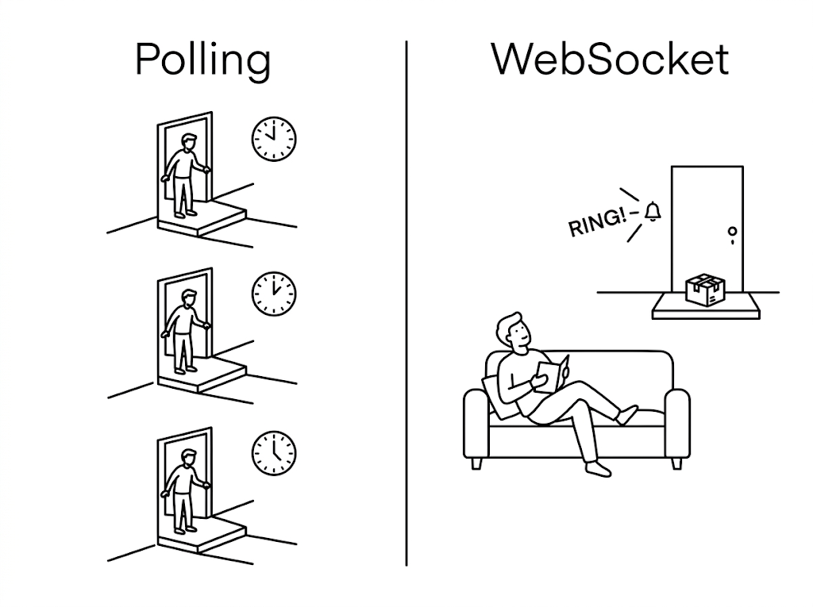
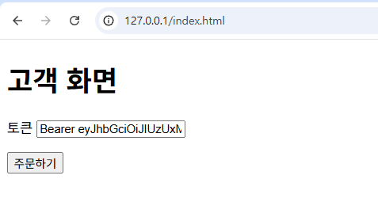
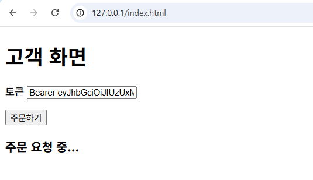
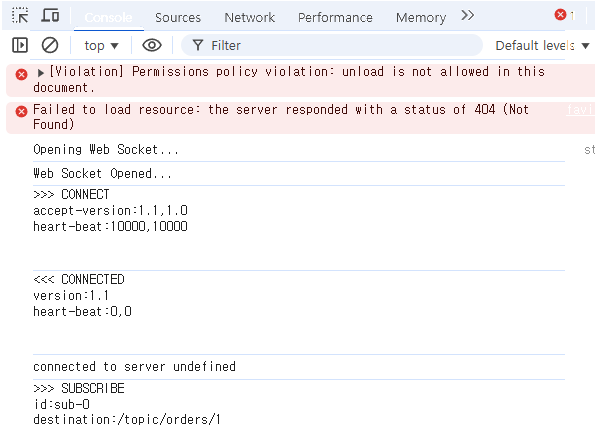
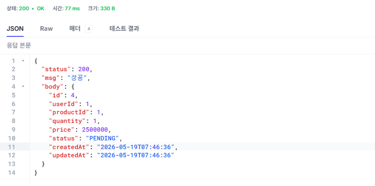
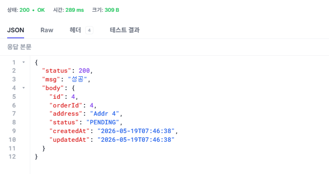
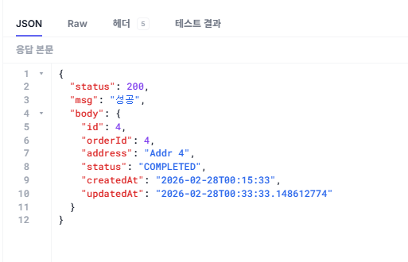
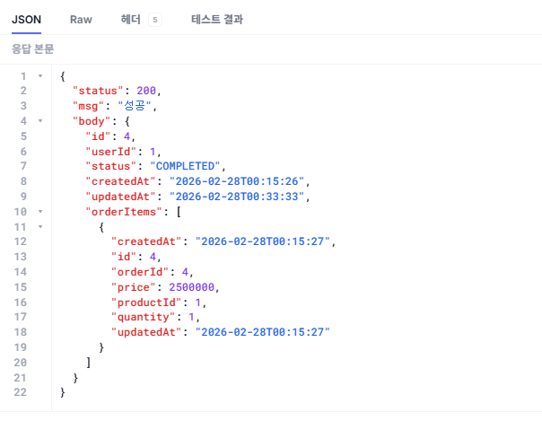
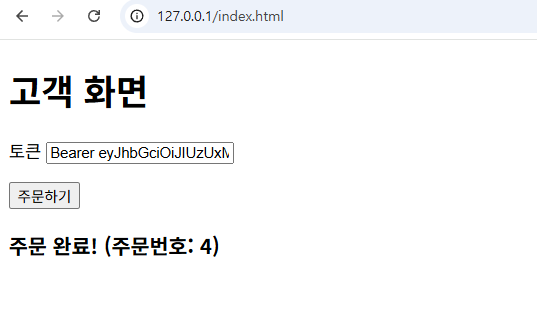

# 챕터 5. 실시간 알림 - 주문 완료를 즉시 전달하다

베타 테스터로 등록한 동료가 자리로 왔습니다. 표정이 떨떠름했습니다.

**동료**: "어제 물건을 주문했는데, 화면이 계속 **처리 중**이더라고요. 끝났는지 알 수가 없어서 한참 뒤에 주문 내역을 다시 열어 보고서야 **주문 완료**된 걸 알았어요."

오픈이는 코드 흐름을 따라가 봤습니다. 주문이 생성되면 그대로 처리 중(PENDING) 상태로 응답 후, 사용자에게 완료(COMPLETED) 응답은 하지 않았습니다. 게다가 주문은 배달이 끝나는 순간과 상관없이 만들어지자마자 완료 처리가 되었습니다.

이 문제를 들고 선배에게 갔습니다.

**오픈이**: "주문이 들어가자마자 시스템에서는 바로 **완료**로 처리해 버려요. 사용자 화면에는 여전히 **처리 중**으로 떠 있는데, 서버에서 작업이 진짜 끝나는 시점을 클라이언트에 제대로 전달해주지 못하고 있어요. 어디부터 손대야 하죠?"

**선배**: "처리가 끝난 그 순간에 바로 알려주면 돼요. 그러려면 서버에서 **처리가 완료된 시점**을 감지해서 사용자에게 실시간으로 알려줄 방법이 필요하겠죠."

<div class="svg-figure">
<svg viewBox="0 0 1200 880" xmlns="http://www.w3.org/2000/svg" role="img" aria-label="챕터 5 한눈에 보기: 챕터 4와 동일하게 1단계 로그인, 2단계 주문은 Client가 Ingress·Gateway를 거쳐 Order에 주문하고 즉시 PENDING을 응답받는다. Order·Product·Delivery는 가운데 Orchestrator와 event·command를 주고받고 Orchestrator가 Kafka 토픽으로 비동기 전달한다. 챕터 4와의 차이는, 비동기 처리가 끝나 주문이 완료되면 Order가 WebSocket으로 Client에게 완료를 즉시 Push(13)한다는 점이다.">
  <defs>
    <marker id="c5f0-a" markerWidth="10" markerHeight="10" refX="8" refY="3" orient="auto"><path d="M0,0 L0,6 L8,3 z" fill="#4f46e5"/></marker>
    <marker id="c5f0-r" markerWidth="10" markerHeight="10" refX="8" refY="3" orient="auto"><path d="M0,0 L0,6 L8,3 z" fill="#0d9488"/></marker>
  </defs>
  <text x="600" y="26" text-anchor="middle" font-size="17" font-weight="700" fill="#0f172a">챕터 5 한눈에 보기 — 주문 완료를 WebSocket으로 즉시 알린다</text>
  <rect x="200" y="58" width="980" height="760" rx="14" fill="none" stroke="#4f46e5" stroke-width="1.6" stroke-dasharray="6,4"/>
  <text x="220" y="78" font-size="12" font-weight="700" fill="#3730a3">Kubernetes 클러스터 · metacoding</text>
  <text x="36" y="98" font-size="13" font-weight="700" fill="#475569">1단계 — 로그인</text>
  <rect x="20" y="108" width="140" height="80" rx="8" fill="#fff" stroke="#475569" stroke-width="1.6"/>
  <text x="90" y="141" text-anchor="middle" font-size="16" font-weight="700" fill="#0f172a">Client</text>
  <text x="90" y="164" text-anchor="middle" font-size="12" fill="#6b7280">사용자</text>
  <rect x="290" y="108" width="140" height="80" rx="8" fill="#fff" stroke="#475569" stroke-width="1.6"/>
  <text x="360" y="141" text-anchor="middle" font-size="15" font-weight="700" fill="#0f172a">Ingress</text>
  <text x="360" y="164" text-anchor="middle" font-size="12" fill="#6b7280">외부 진입점</text>
  <rect x="510" y="108" width="140" height="80" rx="8" fill="#fff" stroke="#475569" stroke-width="1.6"/>
  <text x="580" y="141" text-anchor="middle" font-size="15" font-weight="700" fill="#0f172a">Gateway</text>
  <text x="580" y="164" text-anchor="middle" font-size="12" fill="#6b7280">Nginx 라우팅</text>
  <rect x="720" y="108" width="170" height="80" rx="8" fill="#fff" stroke="#475569" stroke-width="1.6"/>
  <text x="805" y="141" text-anchor="middle" font-size="16" font-weight="700" fill="#0f172a">User</text>
  <text x="805" y="164" text-anchor="middle" font-size="12" fill="#6b7280">:8083 회원</text>
  <line x1="160" y1="140" x2="288" y2="140" stroke="#4f46e5" stroke-width="1.6" marker-end="url(#c5f0-a)"/>
  <text x="225" y="132" text-anchor="middle" font-size="13" font-weight="600" fill="#4f46e5">1. 요청</text>
  <line x1="430" y1="140" x2="508" y2="140" stroke="#4f46e5" stroke-width="1.6" marker-end="url(#c5f0-a)"/>
  <text x="470" y="132" text-anchor="middle" font-size="13" font-weight="600" fill="#4f46e5">2. 라우팅</text>
  <line x1="650" y1="140" x2="718" y2="140" stroke="#4f46e5" stroke-width="1.6" marker-end="url(#c5f0-a)"/>
  <text x="685" y="132" text-anchor="middle" font-size="13" font-weight="600" fill="#4f46e5">3. 로그인</text>
  <line x1="718" y1="168" x2="652" y2="168" stroke="#3730a3" stroke-width="1.6" stroke-dasharray="4,3" marker-end="url(#c5f0-a)"/>
  <text x="685" y="181" text-anchor="middle" font-size="13" font-weight="600" fill="#3730a3">4. 응답</text>
  <line x1="508" y1="168" x2="432" y2="168" stroke="#3730a3" stroke-width="1.6" stroke-dasharray="4,3" marker-end="url(#c5f0-a)"/>
  <text x="470" y="181" text-anchor="middle" font-size="13" font-weight="600" fill="#3730a3">5. 응답</text>
  <line x1="288" y1="168" x2="162" y2="168" stroke="#3730a3" stroke-width="1.6" stroke-dasharray="4,3" marker-end="url(#c5f0-a)"/>
  <text x="225" y="181" text-anchor="middle" font-size="13" font-weight="600" fill="#3730a3">6. JWT 응답</text>
  <text x="36" y="258" font-size="13" font-weight="700" fill="#475569">2단계 — 주문 생성</text>
  <rect x="20" y="268" width="140" height="80" rx="8" fill="#fff" stroke="#475569" stroke-width="1.6"/>
  <text x="90" y="301" text-anchor="middle" font-size="16" font-weight="700" fill="#0f172a">Client</text>
  <text x="90" y="324" text-anchor="middle" font-size="12" fill="#6b7280">사용자</text>
  <rect x="290" y="268" width="140" height="80" rx="8" fill="#fff" stroke="#475569" stroke-width="1.6"/>
  <text x="360" y="301" text-anchor="middle" font-size="15" font-weight="700" fill="#0f172a">Ingress</text>
  <text x="360" y="324" text-anchor="middle" font-size="12" fill="#6b7280">외부 진입점</text>
  <rect x="510" y="268" width="140" height="80" rx="8" fill="#fff" stroke="#475569" stroke-width="1.6"/>
  <text x="580" y="301" text-anchor="middle" font-size="15" font-weight="700" fill="#0f172a">Gateway</text>
  <text x="580" y="324" text-anchor="middle" font-size="12" fill="#6b7280">Nginx 라우팅</text>
  <line x1="160" y1="300" x2="288" y2="300" stroke="#4f46e5" stroke-width="1.6" marker-end="url(#c5f0-a)"/>
  <text x="225" y="292" text-anchor="middle" font-size="13" font-weight="600" fill="#4f46e5">7. 요청</text>
  <line x1="430" y1="300" x2="508" y2="300" stroke="#4f46e5" stroke-width="1.6" marker-end="url(#c5f0-a)"/>
  <text x="470" y="292" text-anchor="middle" font-size="13" font-weight="600" fill="#4f46e5">8. 라우팅</text>
  <line x1="560" y1="348" x2="390" y2="430" stroke="#4f46e5" stroke-width="1.6" marker-end="url(#c5f0-a)"/>
  <text x="450" y="392" text-anchor="end" font-size="13" font-weight="600" fill="#4f46e5">9. 주문 생성</text>
  <line x1="430" y1="430" x2="600" y2="348" stroke="#3730a3" stroke-width="1.6" stroke-dasharray="4,3" marker-end="url(#c5f0-a)"/>
  <text x="536" y="392" text-anchor="start" font-size="13" font-weight="600" fill="#3730a3">10. 응답</text>
  <line x1="508" y1="326" x2="432" y2="326" stroke="#3730a3" stroke-width="1.6" stroke-dasharray="4,3" marker-end="url(#c5f0-a)"/>
  <text x="470" y="342" text-anchor="middle" font-size="13" font-weight="600" fill="#3730a3">11. 응답</text>
  <line x1="288" y1="326" x2="162" y2="326" stroke="#3730a3" stroke-width="1.6" stroke-dasharray="4,3" marker-end="url(#c5f0-a)"/>
  <text x="225" y="342" text-anchor="middle" font-size="12" font-weight="600" fill="#3730a3">12. PENDING 응답</text>
  <path d="M300 462 Q 90 462 90 352" fill="none" stroke="#4f46e5" stroke-width="1.6" stroke-dasharray="5,4" marker-end="url(#c5f0-a)"/>
  <text x="132" y="420" text-anchor="start" font-size="12" font-weight="600" fill="#4f46e5">13. WebSocket 완료 알림</text>
  <rect x="300" y="430" width="170" height="80" rx="8" fill="#eef2ff" stroke="#4f46e5" stroke-width="1.8"/>
  <text x="385" y="463" text-anchor="middle" font-size="16" font-weight="700" fill="#3730a3">Order</text>
  <text x="385" y="486" text-anchor="middle" font-size="12" fill="#3730a3">:8081 주문</text>
  <rect x="560" y="430" width="170" height="80" rx="8" fill="#fff" stroke="#475569" stroke-width="1.6"/>
  <text x="645" y="463" text-anchor="middle" font-size="16" font-weight="700" fill="#0f172a">Product</text>
  <text x="645" y="486" text-anchor="middle" font-size="12" fill="#6b7280">:8082 상품</text>
  <rect x="820" y="430" width="170" height="80" rx="8" fill="#fff" stroke="#475569" stroke-width="1.6"/>
  <text x="905" y="463" text-anchor="middle" font-size="16" font-weight="700" fill="#0f172a">Delivery</text>
  <text x="905" y="486" text-anchor="middle" font-size="12" fill="#6b7280">:8084 배달</text>
  <rect x="1005" y="430" width="160" height="80" rx="8" fill="#f0fdfa" stroke="#0d9488" stroke-width="1.8"/>
  <text x="1085" y="463" text-anchor="middle" font-size="15" font-weight="700" fill="#0f766e">배달 기사</text>
  <text x="1085" y="486" text-anchor="middle" font-size="12" fill="#0d9488">외부 호출자</text>
  <text x="1085" y="420" text-anchor="middle" font-size="12" font-weight="700" fill="#0f766e">PUT /complete</text>
  <line x1="1003" y1="470" x2="992" y2="470" stroke="#0d9488" stroke-width="2.4" marker-end="url(#c5f0-r)"/>
  <rect x="360" y="588" width="580" height="68" rx="8" fill="#fff4ed" stroke="#ff7849" stroke-width="2"/>
  <rect x="360" y="588" width="580" height="20" fill="#ff7849"/>
  <text x="650" y="603" text-anchor="middle" font-size="11" font-weight="700" fill="#fff">Kafka — 모든 메시지가 토픽을 거쳐 비동기로 전달</text>
  <rect x="410" y="618" width="76" height="28" rx="2" fill="#fff" stroke="#ff7849" stroke-width="1"/>
  <path d="M410 618 L448 631 L486 618" fill="none" stroke="#ff7849" stroke-width="1"/>
  <rect x="530" y="618" width="76" height="28" rx="2" fill="#fff" stroke="#ff7849" stroke-width="1"/>
  <path d="M530 618 L568 631 L606 618" fill="none" stroke="#ff7849" stroke-width="1"/>
  <rect x="650" y="618" width="76" height="28" rx="2" fill="#fff" stroke="#ff7849" stroke-width="1"/>
  <path d="M650 618 L688 631 L726 618" fill="none" stroke="#ff7849" stroke-width="1"/>
  <rect x="770" y="618" width="76" height="28" rx="2" fill="#fff" stroke="#ff7849" stroke-width="1"/>
  <path d="M770 618 L808 631 L846 618" fill="none" stroke="#ff7849" stroke-width="1"/>
  <rect x="320" y="716" width="620" height="88" rx="10" fill="#c7d2fe" stroke="#4f46e5" stroke-width="2.4"/>
  <text x="630" y="750" text-anchor="middle" font-size="20" font-weight="700" fill="#312e81">Orchestrator</text>
  <text x="630" y="774" text-anchor="middle" font-size="12" font-weight="600" fill="#312e81">흐름을 결정하는 지휘자</text>
  <text x="630" y="792" text-anchor="middle" font-size="11" fill="#3730a3">event를 받아 다음 command를 발행 (서비스는 명령 못 냄)</text>
  <line x1="370" y1="512" x2="370" y2="586" stroke="#4f46e5" stroke-width="1.6" stroke-dasharray="4,3" marker-end="url(#c5f0-a)"/>
  <text x="356" y="552" text-anchor="end" font-size="12" font-weight="600" fill="#3730a3"><tspan font-size="17" font-weight="700">❶</tspan> 주문 생성 발행</text>
  <line x1="400" y1="586" x2="400" y2="512" stroke="#4f46e5" stroke-width="1.6" marker-end="url(#c5f0-a)"/>
  <text x="414" y="552" text-anchor="start" font-size="12" font-weight="600" fill="#4f46e5"><tspan font-size="17" font-weight="700">❻</tspan> 주문 완료 명령</text>
  <line x1="630" y1="512" x2="630" y2="586" stroke="#4f46e5" stroke-width="1.6" stroke-dasharray="4,3" marker-end="url(#c5f0-a)"/>
  <text x="616" y="552" text-anchor="end" font-size="12" font-weight="600" fill="#3730a3"><tspan font-size="17" font-weight="700">❸</tspan> 재고 차감 결과</text>
  <line x1="660" y1="586" x2="660" y2="512" stroke="#4f46e5" stroke-width="1.6" marker-end="url(#c5f0-a)"/>
  <text x="674" y="552" text-anchor="start" font-size="12" font-weight="600" fill="#4f46e5"><tspan font-size="17" font-weight="700">❷</tspan> 재고 차감 명령</text>
  <line x1="890" y1="512" x2="890" y2="586" stroke="#4f46e5" stroke-width="1.6" stroke-dasharray="4,3" marker-end="url(#c5f0-a)"/>
  <text x="876" y="552" text-anchor="end" font-size="12" font-weight="600" fill="#3730a3"><tspan font-size="17" font-weight="700">❺</tspan> 배달 생성 결과</text>
  <line x1="920" y1="586" x2="920" y2="512" stroke="#4f46e5" stroke-width="1.6" marker-end="url(#c5f0-a)"/>
  <text x="934" y="552" text-anchor="start" font-size="12" font-weight="600" fill="#4f46e5"><tspan font-size="17" font-weight="700">❹</tspan> 배달 생성 명령</text>
  <line x1="615" y1="660" x2="615" y2="714" stroke="#4f46e5" stroke-width="2.4" marker-end="url(#c5f0-a)"/>
  <text x="603" y="690" text-anchor="end" font-size="12" font-weight="700" fill="#4f46e5">발행</text>
  <line x1="645" y1="714" x2="645" y2="662" stroke="#4f46e5" stroke-width="2.4" stroke-dasharray="4,3" marker-end="url(#c5f0-a)"/>
  <text x="657" y="690" text-anchor="start" font-size="12" font-weight="700" fill="#3730a3">구독</text>
  <text x="600" y="844" text-anchor="middle" font-size="13" fill="#6b7280" font-style="italic">챕터 4와 동일한 흐름 · 차이는 비동기 처리(❶~❻)가 끝나 주문이 완료되면 Order가 WebSocket으로 Client에 완료를 즉시 Push(13). 폴링이 사라진다</text>
</svg>
</div>

*그림 5-1. 챕터 5 한눈에 보기 - 주문 완료를 웹소켓으로 즉시 알린다*


:::goal
이번 챕터가 끝나면

- 폴링과 푸시의 차이, 실시간 통신(웹소켓)이 필요한 이유를 이해할 수 있습니다.
- 비동기 완료 시점을 포착해 사용자에게 실시간으로 전달하는 흐름을 이해할 수 있습니다.
:::

::::prep
**준비하기**. 실습 시작 전 한 번만 설정

### 1. 소스 코드 클론

```bash [터미널] 레포 클론
git clone https://github.com/metacoding-12-msa/ex04.git
cd ex04
```

### 2. 파일 구조

```text ex04 디렉토리
ex04/
├── order/              # 포트 8081 (웹소켓 Push 추가)
├── product/            # 포트 8082
├── user/               # 포트 8083
├── delivery/           # 포트 8084 (배달 완료 API 추가)
├── orchestrator/       # Kafka 워크플로우 조율
├── frontend/           # Nginx + SockJS 클라이언트 (이번 챕터 신규)
├── gateway/            # Nginx API Gateway
├── db/                 # MySQL
└── k8s/                # Kubernetes YAML 파일 (kafka·frontend 포함)
```

서비스마다 패키지 구조가 조금씩 다르므로, 코드를 작성할 파일 경로는 각 실습 코드블록 바로 위에서 안내합니다.

### 3. 실습 환경

챕터 4까지 사용한 Docker Desktop, Minikube가 그대로 필요합니다. 별도 추가 도구는 없습니다. 프론트엔드도 Nginx 컨테이너로 Minikube 안에서 함께 띄우므로 따로 서버를 띄울 필요는 없습니다.

### 4. 실습 순서

1. 배달 서비스에 배달 완료 API + `delivery-completed` 이벤트 추가
2. orchestrator에 `delivery-completed` 처리 + `delivery-created` 성공 시 대기로 변경
3. 주문 서비스에 STOMP 웹소켓 설정 + 주문 완료 시 Push
4. SockJS 기반 index.html 프론트엔드와 Nginx 프록시 구성
5. Kubernetes에 frontend 추가 배포 → 통합 시나리오 검증
::::

## 5.1 웹소켓 - 폴링의 한계를 넘다

### 5.1.1 폴링 vs 푸시

서버에 생긴 변화를 알아내는 방법은 크게 두 가지입니다.

택배가 왔는지 확인하려고 5분마다 현관문을 열어보는 방식이 있습니다. 도착 여부는 직접 문을 열어봐야만 알 수 있습니다. 이처럼 클라이언트가 서버에 "처리가 완료되었나요?"라고 일정 간격으로 반복해서 묻는 방식을 **폴링(Polling)** 이라고 합니다.

반면, 택배가 도착했을 때 초인종이 울리는 방식도 있습니다. 안에 있는 사람은 문을 계속 열어볼 필요 없이, 벨이 울리는 순간 도착 사실을 알게 됩니다. 이처럼 클라이언트가 요청하지 않아도 서버에 변화가 생겼을 때 먼저 신호를 보내는 방식을 **푸시(Push)** 라고 합니다.

<!-- image-prompt: Minimal black line drawing on white background, two side-by-side halves, no divider line, no X mark, 4:3 aspect ratio, 800x600px. Minimal text — let the drawing tell the story. Left half, title "Polling": the same scene repeated three times stacked vertically with NO frame, box, or border around each repetition (no rectangles, no panel outlines), each repetition showing the same tired, weary-looking person (drooping shoulders, exhausted face) opening their front door to an empty doorstep, with a large round analog wall clock whose hands point to a clearly DIFFERENT time in each — top about 9 o'clock, middle about 12 o'clock, bottom about 3 o'clock — the visibly different clock hands making the repeated checking over time obvious. Right half, title "Push": the same person sitting relaxed on a sofa reading while a small bell symbol by the front door rings on its own with short curved motion lines. No speech bubbles, no sound-effect text (no "RING!"), no annotation text, no checklists. Characters drawn in a clean simple cartoon textbook style consistent with the rest of the book — not stick figures, simple but with clear body proportions, hair, and clothing outlines, more detailed than stick figures but less detailed than realistic. Clean lines, no colors. -->

*그림 5-2. 폴링 vs 푸시*

폴링은 정해진 간격마다 서버에 요청을 보냅니다. 하지만 서버의 상태가 바뀌지 않았다면 의미 없는 요청과 응답을 반복하게 됩니다. 또한, 서버에 변화가 생기더라도 다음 요청 주기가 돌아올 때까지는 이를 감지할 수 없어, 설정한 간격만큼 데이터 전달이 지연되는 한계가 있습니다.

반면 푸시는 서버에 이벤트가 발생한 순간에만 신호를 보내기 때문에, 클라이언트는 지속적으로 상태를 확인하지 않고도 변경 사항을 즉시 수신할 수 있습니다.

### 5.1.2 웹소켓 - 실시간 양방향 통신

푸시를 구현하는 대표적인 기술이 바로 **웹소켓(WebSocket)** 입니다.

전통적인 HTTP 요청-응답 방식은 '편지'와 같습니다. 편지를 한 통 보내고 답장이 오면 한 번의 통신이 끝나며, 다음 상태가 궁금하면 다시 편지를 보내야 합니다. **클라이언트가 먼저 요청을 하지 않으면 서버는 아무것도 응답할 수 없는 구조**입니다.

반면 웹소켓은 '전화 통화'에 가깝습니다. 한 번 연결되면 끊지 않고 채널을 유지하므로, **상대가 묻지 않아도 어느 쪽이든 먼저 말을 할 수 있습니다**. 그래서 서버에 변화가 생기는 순간 알림을 클라이언트에게 보내는 것이 가능해집니다.

<div class="svg-figure">
<svg viewBox="0 0 900 250" xmlns="http://www.w3.org/2000/svg" role="img" aria-label="편지와 전화 비유로 본 HTTP와 WebSocket. 양쪽 다 사용자와 서버 박스는 같다. 왼쪽은 편지를 한 번 주고받으면 연결이 끊겨 다시 보내야 한다. 오른쪽은 전화 연결이 유지되어 서버가 먼저 주문 완료를 알린다.">
  <defs>
    <marker id="s52-a" markerWidth="9" markerHeight="9" refX="7" refY="3" orient="auto"><path d="M0,0 L0,6 L8,3 z" fill="#4f46e5"/></marker>
  </defs>
  <text x="225" y="34" text-anchor="middle" font-size="17" font-weight="700" fill="#0f172a">편지 — HTTP 요청·응답</text>
  <text x="675" y="34" text-anchor="middle" font-size="17" font-weight="700" fill="#3730a3">전화 — WebSocket</text>
  <line x1="450" y1="54" x2="450" y2="238" stroke="#e2e8f0" stroke-width="1.4"/>
  <rect x="70" y="120" width="110" height="56" rx="6" fill="#fff" stroke="#475569" stroke-width="1.6"/>
  <text x="125" y="153" text-anchor="middle" font-size="14" font-weight="700" fill="#0f172a">사용자</text>
  <rect x="300" y="120" width="110" height="56" rx="6" fill="#fff" stroke="#475569" stroke-width="1.6"/>
  <text x="355" y="153" text-anchor="middle" font-size="14" font-weight="700" fill="#0f172a">서버</text>
  <rect x="223" y="92" width="34" height="22" rx="2" fill="#fff" stroke="#4f46e5" stroke-width="1.4"/>
  <path d="M223 92 L240 106 L257 92" fill="none" stroke="#4f46e5" stroke-width="1.2"/>
  <line x1="182" y1="138" x2="298" y2="138" stroke="#4f46e5" stroke-width="1.8" marker-end="url(#s52-a)"/>
  <text x="240" y="130" text-anchor="middle" font-size="12" font-weight="600" fill="#4f46e5">요청</text>
  <line x1="298" y1="160" x2="184" y2="160" stroke="#94a3b8" stroke-width="1.8" stroke-dasharray="5,3" marker-end="url(#s52-a)"/>
  <text x="240" y="174" text-anchor="middle" font-size="12" font-weight="600" fill="#64748b">답장</text>
  <line x1="240" y1="188" x2="240" y2="210" stroke="#94a3b8" stroke-width="1.4" stroke-dasharray="3,3"/>
  <line x1="232" y1="196" x2="248" y2="204" stroke="#94a3b8" stroke-width="1.4"/>
  <line x1="232" y1="204" x2="248" y2="196" stroke="#94a3b8" stroke-width="1.4"/>
  <text x="240" y="228" text-anchor="middle" font-size="11" font-weight="600" fill="#64748b">연결 끊김</text>
  <rect x="520" y="120" width="110" height="56" rx="6" fill="#fff" stroke="#3730a3" stroke-width="1.6"/>
  <text x="575" y="153" text-anchor="middle" font-size="14" font-weight="700" fill="#0f172a">사용자</text>
  <rect x="750" y="120" width="110" height="56" rx="6" fill="#fff" stroke="#3730a3" stroke-width="1.6"/>
  <text x="805" y="153" text-anchor="middle" font-size="14" font-weight="700" fill="#0f172a">서버</text>
  <line x1="630" y1="132" x2="750" y2="132" stroke="#3730a3" stroke-width="3.4"/>
  <circle cx="690" cy="132" r="16" fill="#fff" stroke="#3730a3" stroke-width="1.6"/>
  <g transform="translate(678,120) scale(1.0)"><path d="M6.62 10.79c1.44 2.83 3.76 5.14 6.59 6.59l2.2-2.2c.27-.27.67-.36 1.02-.24 1.12.37 2.33.57 3.57.57.55 0 1 .45 1 1V20c0 .55-.45 1-1 1-9.39 0-17-7.61-17-17 0-.55.45-1 1-1h3.5c.55 0 1 .45 1 1 0 1.25.2 2.45.57 3.57.11.35.03.74-.25 1.02l-2.2 2.2z" fill="#3730a3"/></g>
  <text x="690" y="112" text-anchor="middle" font-size="12" font-weight="700" fill="#3730a3">연결 유지</text>
  <line x1="750" y1="160" x2="632" y2="160" stroke="#4f46e5" stroke-width="2" marker-end="url(#s52-a)"/>
  <text x="691" y="180" text-anchor="middle" font-size="12" font-weight="600" fill="#4f46e5">"주문 완료" (서버가 먼저)</text>
</svg>
</div>

*그림 5-3. 편지와 전화로 본 HTTP 요청·응답과 웹소켓*

:::term-box
**웹소켓(WebSocket)이란?** 클라이언트와 서버가 한 번 연결을 맺으면 이를 끊지 않고 유지하는 통신 방식입니다. 연결이 유효한 동안에는 서버가 클라이언트의 요청을 기다리지 않고도 데이터를 보낼 수 있어, 상태 변화를 실시간으로 전달할 수 있습니다.
:::

지금은 주문이 생성됨과 동시에 완료 처리가 됩니다. 실시간 알림이 올바르게 작동하려면 실제 배달이 끝난 뒤에 주문이 완료되어야 하므로, 먼저 배달 완료 기능부터 구현해 보겠습니다.

## 5.2 배달 완료 - 생성과 완료를 분리한다

이제부터 배달 생성이 발생하면 배달이 **PENDING**으로 남고, 배달 기사가 배달 완료 처리를 해야 **COMPLETED**가 됩니다. 배달이 만들어진 뒤 완료되기까지를 순서대로 보겠습니다.

<div class="svg-figure">
<svg viewBox="260 30 1320 560" xmlns="http://www.w3.org/2000/svg">
  <defs>
   <marker id="c53a-s" markerWidth="10" markerHeight="10" refX="8" refY="3" orient="auto"><path d="M0,0 L0,6 L8,3 z" fill="#4f46e5"/></marker>
   <marker id="c53a-d" markerWidth="10" markerHeight="10" refX="8" refY="3" orient="auto"><path d="M0,0 L0,6 L8,3 z" fill="#3730a3"/></marker>
  </defs>
  <text x="680" y="50" text-anchor="middle" font-size="16" font-weight="700" fill="#0f172a">1단계 — 배달 생성 이벤트 발행 → orchestrator 수신 후 대기</text>
  <rect x="345" y="64" width="170" height="70" rx="8" fill="#fff" stroke="#cbd5e1" stroke-width="1.4"/>
  <text x="430" y="94" text-anchor="middle" font-size="16" font-weight="700" fill="#94a3b8">Order</text>
  <text x="430" y="116" text-anchor="middle" font-size="12" fill="#cbd5e1">:8081 주문</text>
  <rect x="575" y="64" width="170" height="70" rx="8" fill="#eef2ff" stroke="#4f46e5" stroke-width="1.8"/>
  <text x="660" y="94" text-anchor="middle" font-size="16" font-weight="700" fill="#3730a3">Delivery</text>
  <text x="660" y="116" text-anchor="middle" font-size="12" fill="#3730a3">:8084 배달</text>
  <rect x="280" y="250" width="780" height="120" rx="9" fill="#fff4ed" stroke="#ff7849" stroke-width="2"/>
  <rect x="280" y="250" width="780" height="22" fill="#ff7849"/>
  <text x="670" y="265" text-anchor="middle" font-size="11" font-weight="700" fill="#fff">Kafka — 토픽별로 메시지를 보관·전달</text>
  <rect x="360" y="290" width="110" height="42" rx="3" fill="#ffedd5" stroke="#ff7849" stroke-width="1.8"/>
  <path d="M360 290 L415 311 L470 290" fill="none" stroke="#ff7849" stroke-width="1.4"/>
  <text x="415" y="350" text-anchor="middle" font-size="9.5" font-weight="700" fill="#9a3412">배달 생성 이벤트</text>
  <circle cx="452" cy="298" r="10" fill="#ff7849"/><text x="452" y="302" text-anchor="middle" font-size="11" font-weight="700" fill="#fff">1</text>
  <rect x="510" y="290" width="110" height="42" rx="3" fill="#fff" stroke="#ff7849" stroke-width="1"/>
  <path d="M510 290 L565 311 L620 290" fill="none" stroke="#ff7849" stroke-width="0.8"/>
  <text x="565" y="350" text-anchor="middle" font-size="9.5" font-weight="400" fill="#cbd5e1">배달 완료 이벤트</text>
  <rect x="660" y="290" width="110" height="42" rx="3" fill="#fff" stroke="#ff7849" stroke-width="1"/>
  <path d="M660 290 L715 311 L770 290" fill="none" stroke="#ff7849" stroke-width="0.8"/>
  <text x="715" y="350" text-anchor="middle" font-size="9.5" font-weight="400" fill="#cbd5e1">주문 완료 명령</text>
  <rect x="300" y="480" width="760" height="88" rx="10" fill="#c7d2fe" stroke="#4f46e5" stroke-width="2.4"/>
  <text x="680" y="510" text-anchor="middle" font-size="20" font-weight="700" fill="#312e81">Orchestrator</text>
  <text x="680" y="534" text-anchor="middle" font-size="12" fill="#312e81">흐름을 결정하는 지휘자 — event를 받아 다음 command를 발행</text>
  <text x="680" y="556" text-anchor="middle" font-size="12" font-weight="700" fill="#b91c1c">배달 완료를 기다리며 여기서 멈춤 (변경점)</text>
  <line x1="660" y1="134" x2="425" y2="248" stroke="#4f46e5" stroke-width="2.6" marker-end="url(#c53a-s)"/>
  <text x="470" y="186" text-anchor="start" font-size="13" font-weight="700" fill="#4f46e5">1. 배달 생성 이벤트 발행</text>
  <line x1="415" y1="370" x2="415" y2="478" stroke="#3730a3" stroke-width="2.6" stroke-dasharray="5,3" marker-end="url(#c53a-d)"/>
  <text x="437" y="429" text-anchor="start" font-size="13" font-weight="700" fill="#3730a3">2. 수신 후 대기</text>
  <rect x="1090" y="40" width="460" height="510" rx="10" fill="#fffdf5" stroke="#e7d9a8" stroke-width="1.5"/>
  <line x1="1132" y1="40" x2="1132" y2="550" stroke="#f0e6c8" stroke-width="1.3"/>
  <text x="1146" y="84" font-size="22" font-weight="700" fill="#9a3412">1단계</text>
  <text x="1146" y="128" font-size="21" font-weight="700" fill="#0f172a">1. 배달 생성 이벤트 발행</text>
  <text x="1146" y="160" font-size="19" fill="#475569">배달 서비스가 배달을 PENDING으로</text>
  <text x="1146" y="185" font-size="19" fill="#475569">만든 뒤 <tspan font-weight="700">배달 생성 이벤트</tspan>를 발행합니다.</text>
  <text x="1146" y="245" font-size="21" font-weight="700" fill="#0f172a">2. 수신 후 대기</text>
  <text x="1146" y="277" font-size="19" fill="#475569">orchestrator가 <tspan font-weight="700">배달 생성 이벤트</tspan>를</text>
  <text x="1146" y="302" font-size="19" fill="#475569">받지만, <tspan font-weight="700">주문 완료 명령</tspan>을 보내지</text>
  <text x="1146" y="327" font-size="19" fill="#475569">않고 배달 완료를 기다립니다.</text>
</svg>
</div>

*그림 5-4. 1단계 - 배달 생성 이벤트 발행 → orchestrator 수신 후 대기*


<div class="svg-figure">
<svg viewBox="260 30 1320 560" xmlns="http://www.w3.org/2000/svg">
  <defs>
   <marker id="c53b-s" markerWidth="10" markerHeight="10" refX="8" refY="3" orient="auto"><path d="M0,0 L0,6 L8,3 z" fill="#4f46e5"/></marker>
   <marker id="c53b-d" markerWidth="10" markerHeight="10" refX="8" refY="3" orient="auto"><path d="M0,0 L0,6 L8,3 z" fill="#3730a3"/></marker>
   <marker id="c53b-r" markerWidth="10" markerHeight="10" refX="8" refY="3" orient="auto"><path d="M0,0 L0,6 L8,3 z" fill="#0d9488"/></marker>
  </defs>
  <text x="680" y="50" text-anchor="middle" font-size="16" font-weight="700" fill="#0f172a">2단계 — 배달 완료 API → 배달 완료 이벤트 발행 → orchestrator 수신</text>
  <rect x="345" y="64" width="170" height="70" rx="8" fill="#fff" stroke="#cbd5e1" stroke-width="1.4"/>
  <text x="430" y="94" text-anchor="middle" font-size="16" font-weight="700" fill="#94a3b8">Order</text>
  <text x="430" y="116" text-anchor="middle" font-size="12" fill="#cbd5e1">:8081 주문</text>
  <rect x="575" y="64" width="170" height="70" rx="8" fill="#eef2ff" stroke="#4f46e5" stroke-width="1.8"/>
  <text x="660" y="94" text-anchor="middle" font-size="16" font-weight="700" fill="#3730a3">Delivery</text>
  <text x="660" y="116" text-anchor="middle" font-size="12" fill="#3730a3">:8084 배달</text>
  <rect x="805" y="64" width="170" height="70" rx="8" fill="#f0fdfa" stroke="#0d9488" stroke-width="1.8"/>
  <text x="890" y="94" text-anchor="middle" font-size="16" font-weight="700" fill="#0f766e">배달 기사</text>
  <text x="890" y="116" text-anchor="middle" font-size="12" fill="#0d9488">외부 호출자</text>
  <line x1="803" y1="99" x2="747" y2="99" stroke="#0d9488" stroke-width="2.4" marker-end="url(#c53b-r)"/>
  <text x="775" y="90" text-anchor="middle" font-size="11" font-weight="700" fill="#0f766e">PUT /complete</text>
  <rect x="280" y="250" width="780" height="120" rx="9" fill="#fff4ed" stroke="#ff7849" stroke-width="2"/>
  <rect x="280" y="250" width="780" height="22" fill="#ff7849"/>
  <text x="670" y="265" text-anchor="middle" font-size="11" font-weight="700" fill="#fff">Kafka — 토픽별로 메시지를 보관·전달</text>
  <rect x="360" y="290" width="110" height="42" rx="3" fill="#fff" stroke="#ff7849" stroke-width="1"/>
  <path d="M360 290 L415 311 L470 290" fill="none" stroke="#ff7849" stroke-width="0.8"/>
  <text x="415" y="350" text-anchor="middle" font-size="9.5" font-weight="400" fill="#cbd5e1">배달 생성 이벤트</text>
  <rect x="510" y="290" width="110" height="42" rx="3" fill="#ffedd5" stroke="#ff7849" stroke-width="1.8"/>
  <path d="M510 290 L565 311 L620 290" fill="none" stroke="#ff7849" stroke-width="1.4"/>
  <text x="565" y="350" text-anchor="middle" font-size="9.5" font-weight="700" fill="#9a3412">배달 완료 이벤트</text>
  <circle cx="602" cy="298" r="10" fill="#ff7849"/><text x="602" y="302" text-anchor="middle" font-size="11" font-weight="700" fill="#fff">1</text>
  <rect x="660" y="290" width="110" height="42" rx="3" fill="#fff" stroke="#ff7849" stroke-width="1"/>
  <path d="M660 290 L715 311 L770 290" fill="none" stroke="#ff7849" stroke-width="0.8"/>
  <text x="715" y="350" text-anchor="middle" font-size="9.5" font-weight="400" fill="#cbd5e1">주문 완료 명령</text>
  <rect x="300" y="480" width="760" height="88" rx="10" fill="#c7d2fe" stroke="#4f46e5" stroke-width="2.4"/>
  <text x="680" y="514" text-anchor="middle" font-size="20" font-weight="700" fill="#312e81">Orchestrator</text>
  <text x="680" y="538" text-anchor="middle" font-size="12" fill="#312e81">흐름을 결정하는 지휘자 — event를 받아 다음 command를 발행</text>
  <line x1="660" y1="134" x2="565" y2="248" stroke="#4f46e5" stroke-width="2.6" marker-end="url(#c53b-s)"/>
  <text x="605" y="186" text-anchor="start" font-size="13" font-weight="700" fill="#4f46e5">3. 배달 완료 이벤트 발행</text>
  <line x1="565" y1="370" x2="565" y2="478" stroke="#3730a3" stroke-width="2.6" stroke-dasharray="5,3" marker-end="url(#c53b-d)"/>
  <text x="587" y="429" text-anchor="start" font-size="13" font-weight="700" fill="#3730a3">4. orchestrator가 수신</text>
  <rect x="1090" y="40" width="460" height="510" rx="10" fill="#fffdf5" stroke="#e7d9a8" stroke-width="1.5"/>
  <line x1="1132" y1="40" x2="1132" y2="550" stroke="#f0e6c8" stroke-width="1.3"/>
  <text x="1146" y="84" font-size="22" font-weight="700" fill="#9a3412">2단계</text>
  <text x="1146" y="120" font-size="19" font-weight="700" fill="#0f766e">배달 완료 API</text>
  <text x="1146" y="146" font-size="19" fill="#475569">배달 기사가 배달 완료를 처리하면</text>
  <text x="1146" y="171" font-size="19" fill="#475569">배달이 COMPLETED가 됩니다.</text>
  <text x="1146" y="228" font-size="21" font-weight="700" fill="#0f172a">3. 배달 완료 이벤트 발행</text>
  <text x="1146" y="260" font-size="19" fill="#475569">배달 서비스가</text>
  <text x="1146" y="285" font-size="19" fill="#475569"><tspan font-weight="700">배달 완료 이벤트</tspan>를 발행합니다.</text>
  <text x="1146" y="342" font-size="21" font-weight="700" fill="#0f172a">4. orchestrator가 수신</text>
  <text x="1146" y="374" font-size="19" fill="#475569">orchestrator가 <tspan font-weight="700">배달 완료 이벤트</tspan>를</text>
  <text x="1146" y="399" font-size="19" fill="#475569">구독하고 있다가 받습니다.</text>
</svg>
</div>

*그림 5-5. 2단계 - 배달 완료 API → 배달 완료 이벤트 발행 → orchestrator 수신*


<div class="svg-figure">
<svg viewBox="260 30 1320 560" xmlns="http://www.w3.org/2000/svg">
  <defs>
   <marker id="c53c-s" markerWidth="10" markerHeight="10" refX="8" refY="3" orient="auto"><path d="M0,0 L0,6 L8,3 z" fill="#4f46e5"/></marker>
   <marker id="c53c-d" markerWidth="10" markerHeight="10" refX="8" refY="3" orient="auto"><path d="M0,0 L0,6 L8,3 z" fill="#3730a3"/></marker>
   <marker id="c53c-w" markerWidth="10" markerHeight="10" refX="8" refY="3" orient="auto"><path d="M0,0 L0,6 L8,3 z" fill="#7c3aed"/></marker>
  </defs>
  <text x="680" y="50" text-anchor="middle" font-size="16" font-weight="700" fill="#0f172a">3단계 — 주문 완료 명령 발행 → 주문 수신 → WebSocket으로 사용자 알림</text>
  <rect x="345" y="64" width="170" height="70" rx="8" fill="#eef2ff" stroke="#4f46e5" stroke-width="1.8"/>
  <text x="430" y="94" text-anchor="middle" font-size="16" font-weight="700" fill="#3730a3">Order</text>
  <text x="430" y="116" text-anchor="middle" font-size="12" fill="#3730a3">:8081 주문</text>
  <rect x="740" y="64" width="170" height="70" rx="8" fill="#f5f3ff" stroke="#7c3aed" stroke-width="1.8"/>
  <text x="825" y="94" text-anchor="middle" font-size="16" font-weight="700" fill="#6d28d9">Client</text>
  <text x="825" y="116" text-anchor="middle" font-size="12" fill="#7c3aed">사용자 화면</text>
  <line x1="517" y1="92" x2="738" y2="92" stroke="#7c3aed" stroke-width="2.4" stroke-dasharray="4,3" marker-end="url(#c53c-w)"/>
  <text x="628" y="120" text-anchor="middle" font-size="11" font-weight="700" fill="#6d28d9">WebSocket Push</text>
  <rect x="280" y="250" width="780" height="120" rx="9" fill="#fff4ed" stroke="#ff7849" stroke-width="2"/>
  <rect x="280" y="250" width="780" height="22" fill="#ff7849"/>
  <text x="670" y="265" text-anchor="middle" font-size="11" font-weight="700" fill="#fff">Kafka — 토픽별로 메시지를 보관·전달</text>
  <rect x="360" y="290" width="110" height="42" rx="3" fill="#fff" stroke="#ff7849" stroke-width="1"/>
  <path d="M360 290 L415 311 L470 290" fill="none" stroke="#ff7849" stroke-width="0.8"/>
  <text x="415" y="350" text-anchor="middle" font-size="9.5" font-weight="400" fill="#cbd5e1">배달 생성 이벤트</text>
  <rect x="510" y="290" width="110" height="42" rx="3" fill="#fff" stroke="#ff7849" stroke-width="1"/>
  <path d="M510 290 L565 311 L620 290" fill="none" stroke="#ff7849" stroke-width="0.8"/>
  <text x="565" y="350" text-anchor="middle" font-size="9.5" font-weight="400" fill="#cbd5e1">배달 완료 이벤트</text>
  <rect x="660" y="290" width="110" height="42" rx="3" fill="#ffedd5" stroke="#ff7849" stroke-width="1.8"/>
  <path d="M660 290 L715 311 L770 290" fill="none" stroke="#ff7849" stroke-width="1.4"/>
  <text x="715" y="350" text-anchor="middle" font-size="9.5" font-weight="700" fill="#9a3412">주문 완료 명령</text>
  <circle cx="752" cy="298" r="10" fill="#ff7849"/><text x="752" y="302" text-anchor="middle" font-size="11" font-weight="700" fill="#fff">1</text>
  <rect x="300" y="480" width="760" height="88" rx="10" fill="#c7d2fe" stroke="#4f46e5" stroke-width="2.4"/>
  <text x="680" y="514" text-anchor="middle" font-size="20" font-weight="700" fill="#312e81">Orchestrator</text>
  <text x="680" y="538" text-anchor="middle" font-size="12" fill="#312e81">흐름을 결정하는 지휘자 — event를 받아 다음 command를 발행</text>
  <line x1="715" y1="478" x2="715" y2="372" stroke="#4f46e5" stroke-width="2.6" marker-end="url(#c53c-s)"/>
  <text x="737" y="429" text-anchor="start" font-size="13" font-weight="700" fill="#4f46e5">5. 주문 완료 명령 발행</text>
  <line x1="715" y1="248" x2="445" y2="136" stroke="#3730a3" stroke-width="2.6" stroke-dasharray="5,3" marker-end="url(#c53c-d)"/>
  <text x="470" y="186" text-anchor="start" font-size="13" font-weight="700" fill="#3730a3">6. 주문 서비스가 수신</text>
  <rect x="1090" y="40" width="460" height="510" rx="10" fill="#fffdf5" stroke="#e7d9a8" stroke-width="1.5"/>
  <line x1="1132" y1="40" x2="1132" y2="550" stroke="#f0e6c8" stroke-width="1.3"/>
  <text x="1146" y="84" font-size="22" font-weight="700" fill="#9a3412">3단계</text>
  <text x="1146" y="128" font-size="21" font-weight="700" fill="#0f172a">5. 주문 완료 명령 발행</text>
  <text x="1146" y="160" font-size="19" fill="#475569">orchestrator가</text>
  <text x="1146" y="185" font-size="19" fill="#475569"><tspan font-weight="700">주문 완료 명령</tspan>을 발행합니다.</text>
  <text x="1146" y="245" font-size="21" font-weight="700" fill="#0f172a">6. 주문 서비스가 수신</text>
  <text x="1146" y="277" font-size="19" fill="#475569">주문 서비스가 <tspan font-weight="700">주문 완료 명령</tspan>을 받아</text>
  <text x="1146" y="302" font-size="19" fill="#475569">주문을 COMPLETED로 바꿉니다.</text>
  <text x="1146" y="350" font-size="19" font-weight="700" fill="#6d28d9">WebSocket Push</text>
  <text x="1146" y="382" font-size="19" fill="#475569">사용자 화면에 즉시 알립니다.</text>
</svg>
</div>

*그림 5-6. 3단계 - 주문 완료 명령 발행 → 주문 수신 → 웹소켓 알림*


이 세 단계가 차례로 이어지면, 배달이 실제로 완료되는 순간 사용자에게 완료 알림이 전달됩니다.

## 5.3 웹소켓 연결 흐름

앞 절의 마지막 단계에서 주문 서비스는 완료된 주문을 웹소켓으로 사용자에게 알립니다. 그 알림이 브라우저 화면까지 닿는 길은 연결을 맺고(연결), 받을 채널을 등록하고(구독), 그 채널로 메시지를 보내는(발송) 세 단계로 이뤄집니다. 코드로 옮기기 전에, 세 단계가 어떻게 이어지는지 먼저 따라가 보겠습니다.

첫 단계는 연결입니다. 앞에서 웹소켓을 전화 통화에 빗댔습니다. 통화가 이어지려면 한쪽이 걸고 상대가 받아야 하듯, 브라우저가 서버가 정한 주소로 연결을 청하면 서버가 이를 받아들여 양방향 연결이 열립니다. 브라우저와 주문 서비스 사이에 놓인 frontend와 gateway는 이 요청을 그대로 통과시켜, 한 번 열린 연결이 끝까지 유지되도록 합니다.

<div class="svg-figure">
<svg viewBox="0 0 900 178" xmlns="http://www.w3.org/2000/svg" role="img" aria-label="1단계 연결 핸드셰이크. 브라우저가 frontend와 gateway를 거쳐 주문 서비스로 웹소켓 업그레이드를 요청하면 응답으로 양방향 연결이 열린다.">
  <defs>
    <marker id="rq1" markerWidth="9" markerHeight="9" refX="7" refY="3" orient="auto"><path d="M0,0 L0,6 L8,3 z" fill="#4f46e5"/></marker>
    <marker id="rs1" markerWidth="9" markerHeight="9" refX="7" refY="3" orient="auto"><path d="M0,0 L0,6 L8,3 z" fill="#0d9488"/></marker>
  </defs>
  <text x="450" y="32" text-anchor="middle" font-size="18" font-weight="700" fill="#0f172a">1단계 - 연결 핸드셰이크 (웹소켓 세션 생성)</text>
  <rect x="80" y="78" width="100" height="52" rx="8" fill="#f5f3ff" stroke="#7c3aed" stroke-width="1.8"/>
  <text x="130" y="110" text-anchor="middle" font-size="15" font-weight="700" fill="#6d28d9">브라우저</text>
  <rect x="280" y="78" width="100" height="52" rx="8" fill="#fff" stroke="#475569" stroke-width="1.5"/>
  <text x="330" y="110" text-anchor="middle" font-size="14" font-weight="700" fill="#0f172a">frontend</text>
  <rect x="430" y="78" width="100" height="52" rx="8" fill="#fff" stroke="#475569" stroke-width="1.5"/>
  <text x="480" y="110" text-anchor="middle" font-size="14" font-weight="700" fill="#0f172a">gateway</text>
  <rect x="630" y="78" width="120" height="52" rx="8" fill="#eef2ff" stroke="#4f46e5" stroke-width="1.8"/>
  <text x="690" y="110" text-anchor="middle" font-size="15" font-weight="700" fill="#3730a3">주문 서비스</text>
  <text x="450" y="66" text-anchor="middle" font-size="13" font-weight="700" fill="#4f46e5">① /api/ws/orders 연결 요청 (HTTP → WebSocket 업그레이드)</text>
  <line x1="180" y1="94" x2="272" y2="94" stroke="#4f46e5" stroke-width="2" marker-end="url(#rq1)"/>
  <line x1="380" y1="94" x2="422" y2="94" stroke="#4f46e5" stroke-width="2" marker-end="url(#rq1)"/>
  <line x1="530" y1="94" x2="622" y2="94" stroke="#4f46e5" stroke-width="2" marker-end="url(#rq1)"/>
  <line x1="622" y1="114" x2="538" y2="114" stroke="#0d9488" stroke-width="2" stroke-dasharray="5,3" marker-end="url(#rs1)"/>
  <line x1="422" y1="114" x2="388" y2="114" stroke="#0d9488" stroke-width="2" stroke-dasharray="5,3" marker-end="url(#rs1)"/>
  <line x1="272" y1="114" x2="188" y2="114" stroke="#0d9488" stroke-width="2" stroke-dasharray="5,3" marker-end="url(#rs1)"/>
  <text x="450" y="158" text-anchor="middle" font-size="13" font-weight="700" fill="#0f766e">② 101 Switching Protocols (양방향 연결 수립)</text>
</svg>
</div>

*그림 5-7. 1단계 - 브라우저가 청하고 서버가 받아들여 양방향 연결이 열립니다*

연결이 열렸어도 서버는 알림을 어디로 보내야 할지 아직 모릅니다. 그래서 브라우저가 자기가 받을 채널을 서버에 알립니다. 그러면 주문 서비스 안의 브로커가 "이 연결은 이 채널을 받는다"를 구독 명부에 한 줄 적어 둡니다. 명부의 이 한 줄이 곧 채널을 구독한다는 말의 실체입니다.

<div class="svg-figure">
<svg viewBox="0 0 900 178" xmlns="http://www.w3.org/2000/svg" role="img" aria-label="2단계 구독 등록. 브라우저가 채널을 SUBSCRIBE로 알리고, 이 프레임은 1단계 연결을 타고 frontend와 gateway를 그대로 통과해 주문 서비스에 닿는다. 주문 서비스 안의 내장 STOMP 브로커가 구독 명부에 세션 A는 topic/orders/3이라고 한 줄 적어 둔다.">
  <defs>
    <marker id="rq2" markerWidth="9" markerHeight="9" refX="7" refY="3" orient="auto"><path d="M0,0 L0,6 L8,3 z" fill="#4f46e5"/></marker>
  </defs>
  <text x="450" y="28" text-anchor="middle" font-size="18" font-weight="700" fill="#0f172a">2단계 - 구독 등록 (받을 채널을 명부에 적기)</text>

  <rect x="70" y="84" width="118" height="56" rx="8" fill="#f5f3ff" stroke="#7c3aed" stroke-width="1.8"/>
  <text x="129" y="118" text-anchor="middle" font-size="14.5" font-weight="700" fill="#6d28d9">브라우저</text>

  <text x="223" y="100" text-anchor="middle" font-size="11.5" font-weight="700" fill="#4f46e5">구독</text>
  <line x1="188" y1="112" x2="258" y2="112" stroke="#4f46e5" stroke-width="2" marker-end="url(#rq2)"/>
  <rect x="262" y="88" width="64" height="48" rx="6" fill="#f1f5f9" stroke="#cbd5e1" stroke-width="1.2"/>
  <text x="294" y="107" text-anchor="middle" font-size="10" fill="#94a3b8">frontend</text>
  <text x="294" y="123" text-anchor="middle" font-size="10" fill="#94a3b8">gateway</text>
  <text x="294" y="154" text-anchor="middle" font-size="9" fill="#94a3b8">1단계 연결 그대로 통과</text>
  <line x1="326" y1="112" x2="404" y2="112" stroke="#4f46e5" stroke-width="2" marker-end="url(#rq2)"/>

  <rect x="408" y="74" width="372" height="92" rx="12" fill="#eef2ff" stroke="#4f46e5" stroke-width="2"/>
  <text x="428" y="96" font-size="13" font-weight="700" fill="#3730a3">주문 서비스</text>
  <text x="428" y="116" font-size="10.5" fill="#64748b">구독 명부 (내장 STOMP 브로커)<tspan fill="#4f46e5" font-weight="700">&#160;&#160;· 방금 추가</tspan></text>
  <rect x="428" y="124" width="332" height="32" rx="9" fill="#fff" stroke="#4f46e5" stroke-width="1.4"/>
  <text x="446" y="145" font-size="12.5" fill="#3730a3">세션 A&#160;&#160;→&#160;&#160;<tspan class="mono" fill="#ff7849" font-weight="700">/topic</tspan><tspan class="mono" fill="#0f172a">/orders/</tspan><tspan class="mono" fill="#7c3aed" font-weight="700">3</tspan></text>
</svg>
</div>

*그림 5-8. 2단계 - 브라우저가 구독하면 브로커가 구독 명부에 한 줄 적어 둡니다*

이제 주문이 완료되면, 주문 서비스는 구독 명부에서 보낼 주소와 같은 채널을 찾습니다. 같은 채널을 구독해 둔 연결을 따라 알림이 브라우저까지 전달되고, 화면에 주문 완료가 표시됩니다. 보내는 채널과 구독한 채널이 글자까지 같아야 알림이 닿습니다.

<div class="svg-figure">
<svg viewBox="0 0 900 184" xmlns="http://www.w3.org/2000/svg" role="img" aria-label="3단계 발송과 전달. 주문 서비스 안의 completeOrder가 발송 주소 topic/orders/3으로 같은 서비스 안의 구독 명부를 찾는다. 명부의 세션 A가 topic/orders/3을 구독하고 있으므로 주문 완료 알림으로 orderId 4를 보내고, 이 메시지는 1단계 연결을 타고 gateway와 frontend를 그대로 통과해 브라우저에 닿는다.">
  <defs>
    <marker id="rq3" markerWidth="9" markerHeight="9" refX="7" refY="3" orient="auto"><path d="M0,0 L0,6 L8,3 z" fill="#4f46e5"/></marker>
    <marker id="rs3" markerWidth="9" markerHeight="9" refX="7" refY="3" orient="auto"><path d="M0,0 L0,6 L8,3 z" fill="#0d9488"/></marker>
  </defs>
  <text x="450" y="28" text-anchor="middle" font-size="18" font-weight="700" fill="#0f172a">3단계 - 발송과 전달 (명부에서 같은 채널 찾기)</text>

  <rect x="40" y="72" width="450" height="100" rx="12" fill="#eef2ff" stroke="#4f46e5" stroke-width="2"/>
  <text x="60" y="94" font-size="13" font-weight="700" fill="#3730a3">주문 서비스</text>

  <rect x="60" y="104" width="144" height="54" rx="8" fill="#fff" stroke="#cbd5e1" stroke-width="1.4"/>
  <text x="132" y="128" text-anchor="middle" font-size="12.5" class="mono" fill="#0f172a">completeOrder()</text>
  <text x="132" y="146" text-anchor="middle" font-size="10" fill="#64748b">주문 완료 처리</text>

  <text x="230" y="120" text-anchor="middle" font-size="10.5" font-weight="700" fill="#4f46e5">발송</text>
  <line x1="204" y1="131" x2="252" y2="131" stroke="#4f46e5" stroke-width="2" marker-end="url(#rq3)"/>

  <text x="256" y="94" font-size="10.5" fill="#64748b">구독 명부 (내장 STOMP 브로커)</text>
  <rect x="256" y="104" width="216" height="46" rx="9" fill="#fff" stroke="#4f46e5" stroke-width="1.4"/>
  <text x="272" y="132" font-size="12.5" fill="#3730a3">세션 A&#160;&#160;→&#160;&#160;<tspan class="mono" fill="#ff7849" font-weight="700">/topic</tspan><tspan class="mono" fill="#0f172a">/orders/</tspan><tspan class="mono" fill="#7c3aed" font-weight="700">3</tspan></text>

  <text x="658" y="114" text-anchor="middle" font-size="11.5" font-weight="700" fill="#0f766e">주문 완료 알림</text>
  <line x1="490" y1="127" x2="536" y2="127" stroke="#0d9488" stroke-width="3" marker-end="url(#rs3)"/>
  <rect x="540" y="103" width="64" height="48" rx="6" fill="#f1f5f9" stroke="#cbd5e1" stroke-width="1.2"/>
  <text x="572" y="122" text-anchor="middle" font-size="10" fill="#94a3b8">gateway</text>
  <text x="572" y="138" text-anchor="middle" font-size="10" fill="#94a3b8">frontend</text>
  <text x="572" y="169" text-anchor="middle" font-size="9" fill="#94a3b8">1단계 연결 그대로 통과</text>
  <line x1="604" y1="127" x2="712" y2="127" stroke="#0d9488" stroke-width="3" marker-end="url(#rs3)"/>
  <text x="658" y="146" text-anchor="middle" font-size="10.5" class="mono" fill="#475569">{ orderId: 4 }</text>

  <rect x="716" y="99" width="158" height="56" rx="8" fill="#f5f3ff" stroke="#7c3aed" stroke-width="1.8"/>
  <text x="795" y="123" text-anchor="middle" font-size="14.5" font-weight="700" fill="#6d28d9">브라우저</text>
  <text x="795" y="142" text-anchor="middle" font-size="10" fill="#64748b">화면에 '주문 완료!' 표시</text>
</svg>
</div>

*그림 5-9. 3단계 - 발송 주소와 같은 채널을 명부에서 찾아 구독한 브라우저에 보냅니다*

연결을 맺고, 채널을 구독하고, 그 채널로 보내는 세 단계가 웹소켓 알림의 흐름입니다. 배달이 끝나는 순간을 주문 완료로 잇고, 그 완료를 이 세 단계로 사용자에게 보내는 것이 이번 챕터에서 만들 전체 흐름입니다. 이제 코드로 옮길 차례입니다. 그 출발점인 배달 서비스에서, 배달의 생성과 완료를 나누는 일부터 시작합니다.

## 5.4 배달 서비스 - 배달 완료 API

배달 서비스는 배달의 생성과 완료를 분리하고, 배달 기사가 호출할 배달 완료 API를 추가합니다.

### 5.4.1 createDelivery 수정 - 배달 생성·완료 분리

배달 생성 시 배달 완료 호출을 지우면 배달은 PENDING으로 남습니다. 배달 완료는 배달 기사가 직접 호출할 때까지 미뤄집니다.

`usecase/DeliveryService.java`의 `createDelivery`를 아래처럼 고칩니다.

```java [실습 1] usecase/DeliveryService.java. 생성 시 완료 호출 제거
@Transactional
public DeliveryResponse createDelivery(int orderId, String address) {
    Delivery createdDelivery = deliveryRepository.save(Delivery.create(orderId, address));
    Delivery.validateAddress(address);
    // 삭제: createdDelivery.complete();  ← 생성 시 완료 호출 제거
    return DeliveryResponse.from(createdDelivery);
}
```

### 5.4.2 completeDelivery 추가 - 배달 완료 API

이번에는 배달 기사가 호출할 배달 완료 메서드를 추가합니다.

```java [실습 2] usecase/DeliveryService.java. completeDelivery 추가
@Override
@Transactional
public DeliveryResponse completeDelivery(int deliveryId) {
    Delivery findDelivery = deliveryRepository.findById(deliveryId)
            .orElseThrow(() -> new Exception404("배달 정보를 조회할 수 없습니다."));
    findDelivery.complete();
    deliveryEventProducer.publishDeliveryCompleted(
            new DeliveryCompletedEvent(findDelivery.getOrderId()));
    return DeliveryResponse.from(findDelivery);
}
```

배달 기사가 배달 완료를 호출하면 배달이 완료되고, 배달 완료 이벤트가 발행됩니다. 이제 이 이벤트를 orchestrator가 받도록 수정합니다.

## 5.5 orchestrator - 배달 완료 이벤트 처리 추가

챕터 4에서는 배달 생성이 성공하면 orchestrator가 곧바로 주문 완료 명령을 발행했습니다. 이번에는 배달이 완료될 때 주문 완료 명령을 발행하도록 바꿉니다.

`handler/OrderOrchestrator.java`에 `deliveryCompleted` 리스너를 추가합니다.

```java [실습 3] handler/OrderOrchestrator.java. deliveryCompleted - 주문 완료 명령 발행
@KafkaListener(topics = "delivery-completed", groupId = "orchestrator")
public void deliveryCompleted(DeliveryCompletedEvent event) {
    // 배달기사가 완료 API를 호출한 시점 → 주문 완료 명령 발행
    kafkaTemplate.send(
            "complete-order-command",
            String.valueOf(event.orderId()),
            new CompleteOrderCommand(event.orderId())
    );
}
```

## 5.6 주문 서비스 - STOMP로 실시간 Push 구현

마지막으로 주문 서비스가 주문 완료 명령을 받으면, 클라이언트에게 알리기 위해 웹소켓을 추가합니다.

### 5.6.1 웹소켓 설정

WebSocketConfig는 두 가지 주소를 등록합니다. 하나는 **클라이언트가 웹소켓으로 연결할 주소(`/api/ws/orders`)** 이고, 다른 하나는 **서버가 주문 완료 알림을 보낼 채널의 접두사(`/topic`)** 입니다. 클라이언트가 연결 주소로 접속하면 서버와 웹소켓으로 연결됩니다.

`core/config/WebSocketConfig.java`를 열고 아래 클래스를 작성합니다.

```java [실습 4] core/config/WebSocketConfig.java. STOMP 웹소켓 설정
@Configuration
@EnableWebSocketMessageBroker // 이 애너테이션을 붙이면 STOMP 메시징 기능이 켜집니다
public class WebSocketConfig implements WebSocketMessageBrokerConfigurer {

    @Override
    public void configureMessageBroker(MessageBrokerRegistry config) {
        // /topic으로 시작하는 주소로 메시지가 오면,
        // 서버가 같은 주소를 구독한 클라이언트에게 전달합니다
        config.enableSimpleBroker("/topic");
    }

    @Override
    public void registerStompEndpoints(StompEndpointRegistry registry) {
        // 클라이언트가 웹소켓 연결을 시작할 주소입니다. 어떤 출처에서든 연결을 허용합니다
        registry.addEndpoint("/api/ws/orders").setAllowedOriginPatterns("*").withSockJS();
    }
}
```

:::note
**웹소켓 위에 STOMP 프로토콜을 사용합니다.** 웹소켓은 서버와 클라이언트를 계속 연결해 주지만, 연결만으로는 메시지를 누구에게 보낼지 가려내지 못합니다. STOMP(Simple Text Oriented Messaging Protocol)를 얹으면 메시지를 채널로 나눠, **채널을 구독한 사람에게만 보내는 발행-구독 구조**를 쓸 수 있습니다. 이 예제에서 서버는 `/topic/orders/{userId}` 채널로 보내고, 같은 채널을 구독한 사용자만 자기 주문 완료 알림을 받습니다.
:::

### 5.6.2 SimpMessagingTemplate - 주문 완료 시 Push 발송

이제 주문이 완료되는 순간, 앞에서 본 `/topic/orders/{userId}` 채널로 알림을 보낼 차례입니다. 주문을 완료 처리하는 `completeOrder` 메서드에서, `SimpMessagingTemplate`이라는 도구로 이 채널에 메시지를 보냅니다.

`usecase/OrderService.java`의 `completeOrder` 메서드를 아래처럼 수정합니다.

```java [실습 5] usecase/OrderService.java. completeOrder + WebSocket Push
@Transactional
public void completeOrder(int orderId) {
    Order findOrder = orderRepository.findById(orderId)
            .orElseThrow(() -> new Exception404("주문을 찾을 수 없습니다."));
    findOrder.complete();
    // 추가: 이 채널을 구독한 클라이언트에게 메시지를 보냄
    messagingTemplate.convertAndSend(
            "/topic/orders/" + findOrder.getUserId(),
            Map.of("orderId", orderId));
}
```

### 5.6.3 주문 서비스 보조 설정

핵심 코드 외에 주문 서비스에 필요한 설정은 표로 정리합니다. 전체 코드는 깃헙 레포에서 확인합니다.

| 파일 | 역할 |
|------|------|
| **order-service/build.gradle** | 웹소켓·STOMP 의존성 추가 |
| **JwtAuthenticationFilter.java** | 웹소켓 연결 경로를 로그인 검사에서 제외 |

## 5.7 프론트엔드 연결

서버는 주문이 완료되면 채널로 알림을 보냅니다. 이제 **같은 채널을 구독해 알림을 받는 클라이언트**를 만들 차례입니다. 먼저 프록시가 웹소켓 연결을 끊지 않게 하고, 브라우저가 STOMP로 자기 채널을 구독하게 합니다.

### 5.7.1 업그레이드 헤더 전달

보통 HTTP 요청은 한 번 주고받으면 연결이 끝납니다. 웹소켓은 연결을 끊지 않고 계속 열어 둡니다. 그래서 처음 연결할 때 "일반 HTTP가 아니라 웹소켓으로 바꾸자"는 신호를 주고받습니다. 이 신호를 **업그레이드 헤더**라고 합니다.

문제는 브라우저와 서버 사이에 frontend와 gateway가 있다는 점입니다. 이 둘이 업그레이드 헤더를 넘기지 않으면 일반 요청처럼 처리돼 **연결이 끊깁니다**. 그래서 frontend와 gateway 두 곳의 nginx에 업그레이드 헤더를 전달하도록 설정합니다.

`frontend/nginx.conf`의 `/api/ws/` 위치에 아래처럼 업그레이드 헤더를 더합니다.

```nginx [frontend/nginx.conf] 웹소켓 업그레이드 헤더
location /api/ws/ {
    proxy_pass http://gateway;
    proxy_http_version 1.1;
    proxy_set_header Upgrade $http_upgrade;
    proxy_set_header Connection "upgrade";
}
```

`gateway/nginx.conf`의 `/api/ws/` 블록에도 같은 코드를 넣습니다. 그래야 브라우저에서 gateway까지 업그레이드 헤더가 끊기지 않고 전달됩니다.

### 5.7.2 클라이언트 - STOMP 구독

`frontend/index.html`은 서버 알림을 받아 화면에 주문 완료를 표시하는 STOMP 클라이언트입니다. 주문하기 버튼을 누르면, 먼저 웹소켓을 연결하고 자기 주문 완료 알림이 올 `/topic/orders/{userId}` 채널을 구독합니다. 알림 받을 준비를 마친 다음 주문 API를 호출합니다.

```javascript [frontend/index.html] STOMP 연결과 구독
// 1. /api/ws/orders로 웹소켓 연결
stomp = Stomp.over(new SockJS('/api/ws/orders?token=' + TOKEN));
stomp.connect({}, function () {
    // 2. 내 주문 알림 채널 구독
    stomp.subscribe('/topic/orders/' + userId, function (msg) {
        // 3. 서버가 보낸 메시지를 화면에 표시
        const data = JSON.parse(msg.body);
        status.textContent = '주문 완료! (주문번호: ' + data.orderId + ')';
    });
});
```

주문이 완료되면 서버는 `/topic/orders/{userId}` 채널로 완료 알림을 보내고, 미리 구독해 둔 클라이언트가 받아 화면에 주문 완료를 표시합니다. 단, 보낸 채널과 구독한 채널이 **글자까지 같아야** 알림이 도착합니다. 전체 index.html은 깃헙 레포에서 확인합니다.

<div class="svg-figure">
<svg viewBox="0 0 760 372" xmlns="http://www.w3.org/2000/svg" role="img" aria-label="서버와 클라이언트가 같은 연결 주소와 같은 채널 주소를 써야 한다. 연결은 addEndpoint와 SockJS가 /api/ws/orders로 일치해야 하고, 발행 convertAndSend와 구독 subscribe가 /topic/orders/userId로 일치해야 하며 /topic은 enableSimpleBroker 접두사다.">
  <defs><marker id="ln" markerWidth="9" markerHeight="9" refX="4" refY="3" orient="auto"><circle cx="3" cy="3" r="3" fill="#4f46e5"/></marker></defs>
  <rect x="24" y="12" width="330" height="28" rx="7" fill="#eef2ff"/>
  <text x="189" y="31" text-anchor="middle" font-size="13" font-weight="700" fill="#3730a3">서버 (주문 서비스)</text>
  <rect x="406" y="12" width="330" height="28" rx="7" fill="#eef2ff"/>
  <text x="571" y="31" text-anchor="middle" font-size="13" font-weight="700" fill="#3730a3">클라이언트 (브라우저 index.html)</text>
  <text x="24" y="64" font-size="13" font-weight="700" fill="#0f172a">① 연결 — 서버가 등록한 주소로, 클라이언트가 똑같이 연결합니다</text>
  <rect x="24" y="74" width="330" height="58" rx="8" fill="#fff" stroke="#cbd5e1" stroke-width="1.4"/>
  <text x="38" y="96" font-size="11" fill="#64748b">WebSocketConfig — 웹소켓 연결 주소 지정</text>
  <text x="38" y="119" font-size="13" font-family="var(--font-mono)" fill="#0f172a">addEndpoint(&quot;<tspan fill="#4f46e5" font-weight="700">/api/ws/orders</tspan>&quot;)</text>
  <rect x="406" y="74" width="330" height="58" rx="8" fill="#fff" stroke="#cbd5e1" stroke-width="1.4"/>
  <text x="420" y="96" font-size="11" fill="#64748b">index.html — 연결 시도</text>
  <text x="420" y="119" font-size="13" font-family="var(--font-mono)" fill="#0f172a">new SockJS(&quot;<tspan fill="#4f46e5" font-weight="700">/api/ws/orders</tspan>&quot;)</text>
  <line x1="354" y1="103" x2="406" y2="103" stroke="#4f46e5" stroke-width="2" marker-start="url(#ln)" marker-end="url(#ln)"/>
  <rect x="358" y="89" width="44" height="28" rx="14" fill="#4f46e5"/>
  <text x="380" y="109" text-anchor="middle" font-size="17" font-weight="800" fill="#fff">=</text>
  <rect x="24" y="146" width="712" height="32" rx="7" fill="#fff4ed" stroke="#ff7849" stroke-width="1.3"/>
  <text x="380" y="167" text-anchor="middle" font-size="11.5" fill="#9a3412">아래 발행·구독 주소는 모두 <tspan font-weight="800">&quot;/topic&quot;</tspan> 으로 시작해야 합니다</text>
  <text x="24" y="210" font-size="13" font-weight="700" fill="#0f172a">② 발행·구독 — 서버가 보낸 채널 주소를, 클라이언트가 똑같이 구독합니다</text>
  <rect x="24" y="220" width="330" height="60" rx="8" fill="#fff" stroke="#cbd5e1" stroke-width="1.4"/>
  <text x="38" y="242" font-size="11" fill="#64748b">OrderService — 주문 완료 시 발행</text>
  <text x="38" y="265" font-size="13" font-family="var(--font-mono)" fill="#0f172a">convertAndSend(&quot;<tspan fill="#ff7849" font-weight="700">/topic</tspan>/orders/<tspan fill="#7c3aed" font-weight="700">3</tspan>&quot;)</text>
  <rect x="406" y="220" width="330" height="60" rx="8" fill="#fff" stroke="#cbd5e1" stroke-width="1.4"/>
  <text x="420" y="242" font-size="11" fill="#64748b">index.html — 연결 후 구독</text>
  <text x="420" y="265" font-size="13" font-family="var(--font-mono)" fill="#0f172a">subscribe(&quot;<tspan fill="#ff7849" font-weight="700">/topic</tspan>/orders/<tspan fill="#7c3aed" font-weight="700">3</tspan>&quot;)</text>
  <line x1="354" y1="250" x2="406" y2="250" stroke="#4f46e5" stroke-width="2" marker-start="url(#ln)" marker-end="url(#ln)"/>
  <rect x="358" y="236" width="44" height="28" rx="14" fill="#4f46e5"/>
  <text x="380" y="256" text-anchor="middle" font-size="17" font-weight="800" fill="#fff">=</text>
  <path d="M170 280 V 304 H 590 V 280" fill="none" stroke="#7c3aed" stroke-width="1.6" stroke-dasharray="5,4"/>
  <rect x="300" y="291" width="160" height="26" rx="13" fill="#f5f3ff" stroke="#7c3aed" stroke-width="1.2"/>
  <text x="380" y="308" text-anchor="middle" font-size="11.5" font-weight="700" fill="#7c3aed">userId 가 같은 사람만 받습니다</text>
  <text x="380" y="352" text-anchor="middle" font-size="12" fill="#475569">한 글자라도 다르면 연결도, 알림 전달도 되지 않습니다.</text>
</svg>
</div>

*그림 5-10. 웹소켓 주소 일치 - 같은 색은 글자까지 똑같아야 동작합니다*

## 5.8 전체 시스템 통합 테스트

모든 구현이 완료됐습니다. 이제 전체 시스템을 실행하고 처음부터 끝까지 한 번에 흐름을 확인합니다.

### 5.8.1 Kubernetes 리소스 정의

앞 챕터까지의 구성에서 frontend 서비스가 새로 추가됩니다. `k8s/frontend/` 폴더에 Deployment, Service, Ingress가 정의되어 있습니다.

| 파일 | 역할 |
|------|------|
| **frontend-deploy.yml** | Nginx 기반 프론트엔드 Pod |
| **frontend-service.yml** | 클러스터 내부 접근용 Service |
| **frontend-ingress.yml** | 외부 요청을 frontend-service로 라우팅 |

이번 챕터부터는 Ingress가 gateway-service가 아닌 **frontend-service**를 가리킵니다. 프론트엔드의 Nginx가 정적 파일을 직접 제공하고, `/api/` 요청만 gateway-service로 전달합니다.

### 5.8.2 이미지 빌드

Minikube 내부에 이미지를 빌드합니다.

```bash [터미널] 이미지 빌드
minikube image build -t metacoding/db:3 ./db
minikube image build -t metacoding/gateway:3 ./gateway
minikube image build -t metacoding/order:3 ./order
minikube image build -t metacoding/product:3 ./product
minikube image build -t metacoding/user:3 ./user
minikube image build -t metacoding/delivery:3 ./delivery
minikube image build -t metacoding/orchestrator:3 ./orchestrator
minikube image build -t metacoding/frontend:3 ./frontend
```

### 5.8.3 배포

Kafka를 먼저 배포하고 ready 상태를 확인한 다음 나머지를 배포합니다.

```bash [터미널] 배포 순서 (Kafka 우선)
# 1. 네임스페이스 생성
kubectl create namespace metacoding

# 2. Kafka 먼저 배포
kubectl apply -f k8s/kafka

# 3. Kafka가 준비될 때까지 대기
kubectl wait --for=condition=ready pod -l app=kafka -n metacoding --timeout=120s

# 4. 나머지 서비스 배포
kubectl apply -f k8s/db
kubectl apply -f k8s/gateway
kubectl apply -f k8s/order
kubectl apply -f k8s/product
kubectl apply -f k8s/user
kubectl apply -f k8s/delivery
kubectl apply -f k8s/orchestrator
kubectl apply -f k8s/frontend

# 5. Ingress 활성화 (최초 1회)
minikube addons enable ingress
```

모든 Pod가 Running 상태가 될 때까지 대기합니다.

```bash [터미널] Pod 상태 확인
kubectl get pods -n metacoding
```

<!-- terminal-prompt: Terminal output of "kubectl get pods -n metacoding" command. All pods (db, gateway, order, product, user, delivery, orchestrator, kafka, frontend) showing Running status with 1/1 Ready. -->
<div class="terminal-log">
  <div class="tl-chrome">
    <div class="tl-traffic"><span></span><span></span><span></span></div>
    <div class="tl-title">kubectl get pods -n metacoding</div>
    <div class="tl-spacer"></div>
  </div>
  <div class="tl-body">
    <div class="tl-kv-row"><span class="tl-label">NAME</span>&nbsp;&nbsp;&nbsp;&nbsp;&nbsp;&nbsp;&nbsp;&nbsp;&nbsp;&nbsp;&nbsp;&nbsp;&nbsp;&nbsp;&nbsp;&nbsp;&nbsp;&nbsp;&nbsp;&nbsp;&nbsp;&nbsp;&nbsp;&nbsp;&nbsp;&nbsp;&nbsp;&nbsp;&nbsp;&nbsp;&nbsp;&nbsp;&nbsp;<span class="tl-label">READY</span>&nbsp;&nbsp;<span class="tl-label">STATUS</span>&nbsp;&nbsp;&nbsp;<span class="tl-label">AGE</span></div>
    <div class="tl-kv-row">kafka-deploy-7d4c8b9f5-2xk9p&nbsp;&nbsp;&nbsp;&nbsp;&nbsp;&nbsp;&nbsp;&nbsp;&nbsp;<span class="tl-num">1/1</span>&nbsp;&nbsp;&nbsp;&nbsp;<span class="tl-val">Running</span>&nbsp;&nbsp;<span class="tl-num">2m</span></div>
    <div class="tl-kv-row">db-deploy-6f9b7c4d8-m4t2q&nbsp;&nbsp;&nbsp;&nbsp;&nbsp;&nbsp;&nbsp;&nbsp;&nbsp;&nbsp;&nbsp;&nbsp;<span class="tl-num">1/1</span>&nbsp;&nbsp;&nbsp;&nbsp;<span class="tl-val">Running</span>&nbsp;&nbsp;<span class="tl-num">90s</span></div>
    <div class="tl-kv-row">gateway-deploy-5c8d6f7b9-h7w3r&nbsp;&nbsp;&nbsp;&nbsp;&nbsp;&nbsp;&nbsp;<span class="tl-num">1/1</span>&nbsp;&nbsp;&nbsp;&nbsp;<span class="tl-val">Running</span>&nbsp;&nbsp;<span class="tl-num">88s</span></div>
    <div class="tl-kv-row">order-deploy-8b7f6c9d4-q2k8m&nbsp;&nbsp;&nbsp;&nbsp;&nbsp;&nbsp;&nbsp;&nbsp;&nbsp;<span class="tl-num">1/1</span>&nbsp;&nbsp;&nbsp;&nbsp;<span class="tl-val">Running</span>&nbsp;&nbsp;<span class="tl-num">85s</span></div>
    <div class="tl-kv-row">product-deploy-7c9d8b6f5-x4r2t&nbsp;&nbsp;&nbsp;&nbsp;&nbsp;&nbsp;&nbsp;<span class="tl-num">1/1</span>&nbsp;&nbsp;&nbsp;&nbsp;<span class="tl-val">Running</span>&nbsp;&nbsp;<span class="tl-num">83s</span></div>
    <div class="tl-kv-row">user-deploy-6d8c7b9f4-p3m9k&nbsp;&nbsp;&nbsp;&nbsp;&nbsp;&nbsp;&nbsp;&nbsp;&nbsp;&nbsp;<span class="tl-num">1/1</span>&nbsp;&nbsp;&nbsp;&nbsp;<span class="tl-val">Running</span>&nbsp;&nbsp;<span class="tl-num">80s</span></div>
    <div class="tl-kv-row">delivery-deploy-9f7c8b6d5-t6w2x&nbsp;&nbsp;&nbsp;&nbsp;&nbsp;&nbsp;<span class="tl-num">1/1</span>&nbsp;&nbsp;&nbsp;&nbsp;<span class="tl-val">Running</span>&nbsp;&nbsp;<span class="tl-num">78s</span></div>
    <div class="tl-kv-row">orchestrator-deploy-8c6f9b7d4-k9m4q&nbsp;&nbsp;<span class="tl-num">1/1</span>&nbsp;&nbsp;&nbsp;&nbsp;<span class="tl-val">Running</span>&nbsp;&nbsp;<span class="tl-num">75s</span></div>
    <div class="tl-kv-row">frontend-deploy-7b9c6d8f5-w3k2m&nbsp;&nbsp;&nbsp;&nbsp;&nbsp;&nbsp;<span class="tl-num">1/1</span>&nbsp;&nbsp;&nbsp;&nbsp;<span class="tl-val">Running</span>&nbsp;&nbsp;<span class="tl-num">72s</span></div>
    <div class="tl-divider"><span class="tl-val">9개 Pod Running (frontend 추가)</span><span class="tl-cursor"></span></div>
  </div>
</div>

*그림 5-11. Pod 상태 확인*


### 5.8.4 서비스 접근

Ingress를 통해 외부에서 접속하려면 `minikube tunnel`을 실행합니다.

```bash [터미널] 외부 접근 터널
minikube tunnel
```

터널이 실행되면 `http://127.0.0.1:80`로 프론트엔드에 접속할 수 있습니다.


### 5.8.5 통합 테스트 시나리오

**Step 1: 웹소켓 연결 및 주문 생성 (클라이언트 역할)**

브라우저를 통해 index.html에 접속합니다.
```json
브라우저 http://127.0.0.1:80/index.html
```
<!-- terminal-prompt: Browser showing index.html initial page. WebSocket test client with JWT token input field and "주문하기" (Place Order) button. -->

*그림 5-12. 브라우저에서 index.html 접속 화면*


웹소켓 연결을 위해 토큰을 입력합니다. 로그인 API(`POST /login`)로 발급받은 JWT 토큰을 입력합니다. `Bearer ` 접두사는 붙어 있어도 그대로 인식됩니다.


토큰을 입력하고 주문하기 버튼을 클릭합니다. index.html이 내부적으로 웹소켓에 연결하고 `/topic/orders/{userId}` 채널을 구독한 뒤 다음과 같은 주문 요청을 보냅니다.

```json
POST /api/orders

{
  "productId": 1,
  "quantity": 1,
  "price": 2500000,
  "address": "Addr 4"
}
```

이 요청은 주문하기 버튼을 누르면 index.html이 자동으로 보냅니다. 따로 직접 호출하지 않습니다.

<!-- terminal-prompt: Browser showing the page after entering JWT token and clicking "주문하기" button. Order accepted and showing PENDING status. -->

*그림 5-13. 토큰 입력 후 주문하기 버튼 클릭*


브라우저 `F12` - `Console`에서 웹소켓이 연결됨을 확인할 수 있습니다.

<!-- terminal-prompt: Browser DevTools (F12) Console tab showing WebSocket connection success logs. STOMP connected and /topic/orders/{userId} subscription confirmed. -->

*그림 5-14. 브라우저 Console에서 웹소켓 연결 확인*


Hoppscotch로 생성된 주문을 확인하면 `PENDING` 상태로 머물러 있습니다.
```json
GET http://127.0.0.1:80/api/orders/4
```

<!-- terminal-prompt: Hoppscotch showing GET /api/orders/4 response. JSON body with order status "PENDING". -->

*그림 5-15. 주문 조회 결과 - PENDING 상태*


**Step 2: 배달 완료 (배달 기사 역할)**

먼저 생성된 배달을 확인해보겠습니다.

```json
GET http://127.0.0.1:80/api/deliveries/4
```

<!-- terminal-prompt: Hoppscotch showing GET /api/deliveries/4 response. JSON body with delivery status "PENDING". -->

*그림 5-16. 배달 조회 결과 - PENDING 상태*

배달 ID가 4인 배달이 `PENDING` 상태로 생성되었습니다.

배달 기사가 물건을 전달한 뒤 배달 완료 처리를 합니다.

```json
PUT http://127.0.0.1:80/api/deliveries/4/complete
```
<!-- terminal-prompt: Hoppscotch showing PUT /api/deliveries/4/complete response. JSON body with delivery status changed to "COMPLETED". -->

*그림 5-17. 배달 완료 API 호출 결과 - COMPLETED 상태*

*배달 완료 버튼을 눌렀다. 이제 주문도 바뀌었을까?*


**Step 3: 주문 완료 및 웹소켓 응답 확인**

배달 완료 처리 후, 주문 완료 명령으로 주문이 `COMPLETED` 상태가 됩니다.
```json
GET http://127.0.0.1:80/api/orders/4
```


<!-- terminal-prompt: Hoppscotch showing GET /api/orders/4 response after delivery completion. JSON body with order status changed to "COMPLETED". -->

*그림 5-18. 주문 조회 결과 - COMPLETED 상태*


주문이 완료되면 웹소켓이 클라이언트에게 주문 완료 메시지를 전송합니다.
웹소켓 응답을 수신하면 클라이언트 화면이 주문 완료 상태로 변경됩니다.

<!-- terminal-prompt: Browser index.html page showing real-time WebSocket notification received. Screen displays "주문 완료! (주문번호: 4)" message pushed via WebSocket. -->

*그림 5-19. 웹소켓 알림 수신 - 클라이언트 화면에 주문 완료 표시*


완성된 시스템을 동료에게 보여줬습니다. 같은 화면, 같은 주문, 같은 배달이었지만 이번에는 다음 날 책이 도착할 때까지 동료가 주문 내역을 다시 열어 보지 않았습니다.

**동료**: "전엔 '완료'라고 떠도 못 믿어서 주문 내역을 자꾸 다시 열어 봤는데, 이번엔 뜨자마자 진짜 끝난 거였어요."

*진짜 끝났을 때만 알린다. 그 한 줄 차이였다.*

:::remember
**이것만은 기억하자**

- **폴링**은 클라이언트가 변화를 계속 확인해야 하지만, **웹소켓**은 서버가 변화 순간 먼저 알립니다.
- 배달 생성과 배달 완료를 분리해, 주문 완료를 **실제 배달이 끝난 시점**에 맞춥니다.
- 주문이 완료되면 주문 서비스가 **웹소켓**으로 사용자에게 실시간으로 알립니다.
:::

오픈이는 문득 그날 새벽을 떠올렸습니다. 휴대폰 두 대가 동시에 울리고, 대시보드가 빨갛게 차 있고, 주문 API 옆에서 로그인 API가 같이 죽어 있던 새벽 세 시.

*주문이랑 로그인이 무슨 상관이야?*

그때는 답을 몰랐습니다. 지금은 압니다. 회원도, 상품도, 주문도, 배달도 각자의 서비스로 분리됐고, 하나가 흔들려도 나머지는 멈추지 않습니다. Kafka에 쌓인 메시지는 사라지지 않고, orchestrator가 실패한 주문을 되돌리며, 완료된 주문은 사용자 화면에 바로 표시됩니다.

선배가 지나가다 모니터를 봤습니다.

**선배**: "이제 새벽에 안 깨워도 되겠네요."

오픈이는 대답 대신 웃었습니다. 모놀리식 한 덩어리에서 시작해, 코드를 한 줄씩 바꿔 여기까지 왔습니다.
