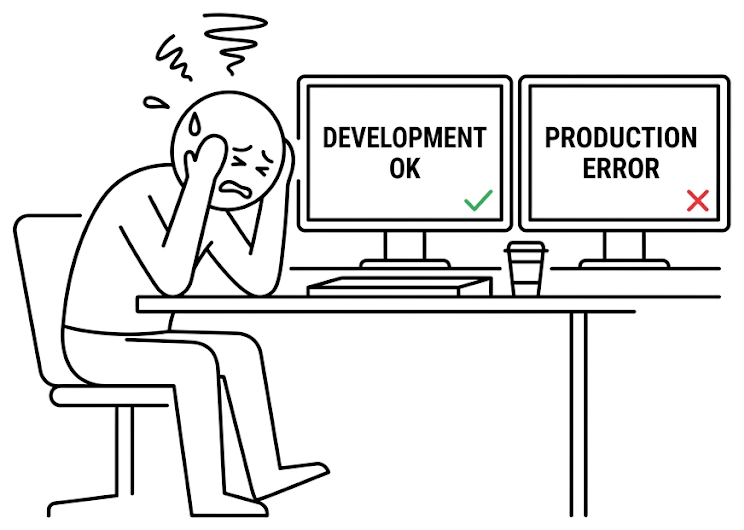

# Ch.1 왜 컨테이너인가

## 1.1 오픈이의 배포 지옥

입사 3개월 차 수요일 오후.

오픈이는 사내 개발 서버 한 대에 세 개의 프로젝트를 올려야 했습니다. 결제 정산 모듈, 사내 위키, 신규 챗봇. 셋 다 Java로 짠 Spring 애플리케이션이었는데 쓰는 버전이 제각각이었습니다. 결제는 Java 17, 위키는 Java 11, 챗봇은 Java 21이었습니다.

로컬에서 프로젝트를 빌드한 뒤 서버에 올려 순서대로 띄우는, 흔한 배포 방식이었습니다. 결제는 잘 떴습니다. 그다음 위키를 띄우는 순간 결제가 갑자기 죽었습니다. PATH에 걸린 Java 버전이 바뀌면서 결제 서비스가 엉뚱한 자바를 물고 있었습니다.

*내 PC에선 셋 다 멀쩡히 돌았는데.*

개발 PC에서 세 프로젝트를 번갈아 실행할 때는 문제가 없었습니다. 개발 도구가 프로젝트마다 다른 자바를 알아서 잡아줬습니다. 서버는 그런 걸 해주지 않았습니다.

팀장이 지나가다 모니터를 들여다봤습니다.

**팀장**: "서버 하나 더 살래?"

견적을 냈다가 가지고 돌아왔습니다. 세 프로젝트에 각각 서버 한 대씩 쓰는 건 과했습니다. 개발 환경용인데 장비 세 대는 낭비였습니다.

오픈이는 노트북 화면을 끝까지 내리며 스택트레이스를 세 번째 읽고 있었습니다. 키보드 위에 얹은 손끝이 차가웠고, 사무실은 에어컨 돌아가는 소리만 남아 있었습니다.

*그림 1-1 개발 PC에서는 되던 코드가 서버에서는 죽는 흔한 상황*

서버가 다른 PC였다는 건 오픈이도 알고 있었습니다. 그런데 "뭐가 다르길래" 에 대한 감이 없었습니다. 원인을 짚어 보자면 라이브러리 버전이 살짝 다르거나, 시스템 패키지가 다르거나, 환경 변수가 다르거나. 그 작은 차이가 쌓여서 지금의 에러를 만들고 있었습니다.

퇴근 시간이 가까워졌을 때 옆자리 선배가 의자를 끌고 왔습니다. 선배는 종이에 네모 세 개를 그려놓고 그 밑에 "서버 한 대"라고 적었습니다.

**선배**: "너 물류 역사 들어봤어?"

오픈이는 물류라는 단어에 잠깐 멈췄습니다. 배포 얘기를 하다가 왜 갑자기 물류가 나오는지 몰랐습니다.

**선배**: "이 문제, 해운 업계에서 벌써 한 번 풀었거든."

## 1.2 컨테이너라는 아이디어

### 1.2.1 항구의 진짜 병목

선배는 노트북을 돌려 오래된 흑백 사진을 띄워 놓고 있었습니다. 배에서 내리는 화물을 수십 명이 어깨에 메고 부두로 옮기는 장면이었습니다.

*그림 1-2 컨테이너가 없던 시절의 해상 물류*

**선배**: "이 시절엔 배가 항구에 며칠씩 서 있었어."

수백 명의 노동자가 화물을 하나씩 내리고 분류하고 다시 트럭에 옮겨 실었습니다. 짐의 크기와 모양이 전부 달라서 싣는 순서부터 기계로 할 수가 없었습니다. 배를 모는 비용보다 짐을 싣고 내리는 인건비가 더 비쌌습니다. 트럭 운전사들도 화물을 기다리느라 항구에서 며칠씩 대기했습니다.

이 비효율을 가장 가까이서 봤던 사람이 있었습니다. 1950년대 미국 뉴욕의 트럭 운전사, 말콤 맥린이었습니다. 맥린은 매일 항구에서 자기 트럭에 실을 화물이 내려지기를 기다렸습니다. 하루의 절반이 그 대기로 녹아 없어졌습니다. 운전사답게 물음이 단순했습니다.

> **"왜 짐을 통째로 옮기지 않는 걸까?"**

화물을 낱개로 다루는 대신 표준 규격의 상자 하나에 담아서 통째로 옮기자는 아이디어였습니다. 상자의 규격만 정해두면 배든 기차든 트럭이든 그 상자 모양에 맞춰 설계하면 됐습니다.

### 1.2.2 크레인이 처음 움직인 날

*그림 1-3 표준 컨테이너와 크레인으로 바뀐 현대 항구*

표준 상자 규격이 정해지자 항구가 바뀌었습니다. 크레인 하나가 상자를 통째로 들어 올려 배에 올리고, 도착지에서도 같은 방식으로 내렸습니다. 안에 뭐가 들었는지 항구는 신경 쓰지 않았습니다. 규격이 같으니까요.

맥린도 처음부터 순탄하지는 않았습니다. 기존 선박이 상자를 싣는 걸 전제로 만들어진 게 아니라서 공간이 남아돌거나 모자랐습니다. 맥린은 상자에 맞춘 전용 선박을 직접 만들었습니다. 이 표준 규격 상자는 이후 **컨테이너**(Container, 담는 그릇)라는 이름으로 불리게 됩니다.

표준 컨테이너가 자리 잡자 며칠 걸리던 하역이 몇 시간으로 줄었습니다. 세계 물류 시스템이 통째로 바뀌었습니다.

### 1.2.3 IT로 건너온 컨테이너

선배가 브라우저 탭을 하나 더 열었습니다. 이번엔 개발자 한 명이 모니터 두 개 앞에서 머리를 감싸 쥐는 그림이었습니다.

**선배**: "이 그림 어디서 많이 봤지?"

오픈이는 쓴웃음을 지었습니다. 오늘 본인 모습이었습니다.

*그림 1-4 소프트웨어도 똑같이 표준 컨테이너에 담아 어디서든 같은 환경으로 실행*

IT에서도 같은 문제였습니다. 애플리케이션이 실행되는 데 필요한 라이브러리, 설정 파일, 의존성이 환경마다 달라서 한 곳에서 되던 게 다른 곳에서 안 됐습니다. 화물이 제각각 모양이라서 배에 못 싣던 시대의 문제와 같았습니다.

해결책도 똑같았습니다. 애플리케이션과 **그 애플리케이션이 필요로 하는 모든 것**을 하나의 박스에 담아버리면 됐습니다. 라이브러리, 설정 파일, 운영체제 파일까지 한꺼번에 넣어서요. 안에 뭐가 들었든 상자의 규격이 같으니, 배에 싣든 트럭에 싣든 상관이 없었습니다. IT에서 이 박스의 이름도 **컨테이너**였습니다.

> **참고: 컨테이너(Container)**
> 애플리케이션과 그 애플리케이션이 필요로 하는 모든 것(라이브러리, 설정 파일, 운영체제 파일들)을 하나의 박스에 담아, 어디서 실행해도 같은 결과를 내는 실행 단위.

오픈이의 세 프로젝트도 각자의 컨테이너에 담으면 됐습니다. 결제는 Java 17 컨테이너에, 위키는 Java 11 컨테이너에, 챗봇은 Java 21 컨테이너에. 한 서버 위에서 세 컨테이너가 각자의 환경을 갖고 나란히 실행된다는 뜻이었습니다. 한 컨테이너가 Java를 업그레이드해도 다른 컨테이너의 Java 버전은 그대로 남습니다. 박스 하나가 다른 박스 안의 물건을 뒤집지 않는 것과 같은 이치였습니다. PATH가 엉킬 일이 없습니다.

*그럼 이걸 누가 만들어주는데.*

## 1.3 Docker와 Kubernetes — 공장과 프랜차이즈

맥린의 아이디어 하나만으로는 화물이 움직이지 않았습니다. 표준 규격에 맞는 컨테이너를 찍어낼 **공장**이 필요했습니다.

그 공장을 IT에서 맡은 게 **Docker**입니다. 공장에는 설계도 하나가 있고, 그 설계도로 같은 모양의 컨테이너를 계속 찍어냅니다. Docker에서도 똑같습니다. Docker의 **이미지**가 그 설계도이고, 설계도에서 찍혀 나온 것이 **컨테이너**입니다. 결제용 이미지 하나로 결제 컨테이너를 세 개 찍으면 똑같은 환경의 서비스가 세 개 뜨는 식입니다.

문제는 맥린의 시대에서도 그랬듯, 컨테이너가 하나둘이 아니었다는 겁니다. 수백 수천 개로 늘어나자 "어느 배에 뭘 실을지, 누가 내릴지, 고장 나면 누가 대체할지"를 사람이 다 못 챙겼습니다. 맥린은 자동화된 항구 시스템을 만들었습니다.

IT에서 그 역할을 맡은 게 **Kubernetes**입니다. 작동 방식을 떠올릴 때는 물류보다 프랜차이즈 본사가 더 선명합니다. **본사가 Kubernetes, 매장이 컨테이너**입니다. 본사는 가맹점 운영을 직접 하지 않습니다. "수도권에 매장 50개를 항상 유지" 같은 지침만 내려보냅니다. 한 매장이 문을 닫으면 근처에 새 매장이 열립니다. 장마철에 배달 주문이 늘면 배달 인력이 늘어납니다. 본사는 **원하는 상태**만 선언하고, 가맹점 관리 시스템이 그 상태를 맞춥니다.

Kubernetes도 똑같이 움직입니다. "결제 서비스 3개 항상 떠 있게 해줘"라고 선언하면, 하나가 죽으면 알아서 살리고, 트래픽이 늘면 숫자를 늘립니다. 오픈이가 새벽에 알람 받고 수동으로 띄우던 일을 Kubernetes가 대신합니다.

| 구분 | Docker | Kubernetes |
|------|--------|------------|
| 역할 | 컨테이너 만들고 실행 | 컨테이너 운영 자동화 |
| 비유 | 표준 컨테이너를 찍는 공장 | 가맹점 수백 개를 관리하는 프랜차이즈 본사 |
| 핵심 기능 | 이미지 빌드, 컨테이너 실행 | 자동 복구, 스케일링, 무중단 배포 |

여기서 책 전체에 쓸 **프랜차이즈 매핑**을 심어 둡니다. 이 책에서 Kubernetes가 나올 때마다 계속 돌아올 비유입니다. 지금 외우지 않아도 됩니다. 나중에 낯선 용어가 나왔을 때 "아, 그때 그 매장이구나"로 해석되면 충분합니다.

| 프랜차이즈 | Kubernetes | 처음 등장 |
|----------|-----------|---------|
| 본사 | Kubernetes(클러스터) | Ch.4 |
| 본사 지침서 | Deployment | Ch.4 |
| 매장 | Pod | Ch.4 |
| 매장 대표 전화번호 | Service | Ch.5 |
| 본사 안내 데스크 | Ingress | Ch.5 |
| 매장 공용 메뉴판 | ConfigMap(일반 설정) | Ch.6 |
| 매장 공용 금고 | Secret(민감 정보) | Ch.6 |

프랜차이즈 안에서 매장끼리도 전화번호를 나눠 쓰고, 본사에서 내려주는 메뉴판을 공유하고, 금고에 열쇠 있는 직원만 접근합니다. 이 다섯 장면이 Kubernetes의 핵심 리소스 다섯 개와 그대로 겹쳐집니다. Ch.4에서 본사와 매장을 세우고, Ch.5에서 전화번호와 안내 데스크를 달고, Ch.6에서 메뉴판과 금고를 건네줍니다.

## 1.4 이 책의 학습 흐름

*그림 1-5 책 한 권 분량의 학습 지도*

이 책은 컨테이너 하나를 띄우는 것에서 시작해서, Kubernetes 위에서 여러 컨테이너를 연결하고 운영하는 것까지 가는 여정입니다. 각 챕터는 앞 챕터의 한계에서 출발합니다. 해결한 뒤 새로운 한계가 나타나고, 그 한계가 다음 챕터의 문제가 됩니다.

**챕터 2 — Docker 이해하기.** Docker가 어떻게 격리된 환경을 만드는지 원리부터 봅니다. 컨테이너 하나를 띄우고, 내부를 리눅스 명령어로 살펴보고, 직접 이미지를 만들어 Docker Hub에 올립니다. 오픈이는 일단 결제 서비스 하나를 컨테이너로 띄우는 것부터 시작합니다.

**챕터 3 — Docker 다루기.** 컨테이너 하나는 띄웠는데, 실제 서비스는 하나로 끝나지 않습니다. 웹 서버, 백엔드 API, 데이터베이스가 각각 필요합니다. Dockerfile로 이미지를 자동으로 찍어내는 방법과 Docker Compose로 여러 컨테이너를 한 번에 관리하는 방법을 배웁니다.

**챕터 4 — Kubernetes 시작하기.** 여러 컨테이너를 띄울 수는 있는데, 새벽에 하나가 죽으면 누가 살려줄까요? 트래픽이 열 배로 늘면 누가 서버 수를 늘릴까요? Kubernetes가 이 역할을 맡습니다. Pod, Deployment라는 단위로 자동 복구와 무중단 배포를 직접 만나봅니다.

**챕터 5 — Kubernetes 네트워킹.** 컨테이너가 죽고 새로 태어나면 IP가 바뀝니다. 그런데 다른 서비스가 이 친구를 어떻게 찾지요? Service라는 고정 주소와 Ingress라는 입구 라우팅이 등장합니다. 챕터 2에서 배운 Docker의 네트워크 개념이 Kubernetes에서 어떻게 확장되는지 같은 비유로 엮어봅니다.

**챕터 6 — Kubernetes 운영하기.** 네트워크까지 됐으면 진짜 서비스 운영입니다. 설정과 비밀번호는 어디에 둘지, 데이터베이스 데이터가 재시작해도 남으려면 어떻게 해야 할지를 ConfigMap/Secret/Volume으로 해결합니다. 마지막에 챕터 3에서 만든 서비스를 Kubernetes 위에 얹어 배포합니다.

이 책이 추구하는 건 명령어 암기가 아닙니다. `docker run`의 옵션 목록을 전부 외울 필요는 없습니다. 이 책은 **지도**에 가깝습니다. 어떤 문제가 있고, 그 문제를 어떤 도구가 풀어주고, 그 도구끼리는 어떻게 맞물리는지에 대한 지도입니다. 옵션은 필요할 때 공식 문서를 찾으면 됩니다. 지도가 머릿속에 있어야 어떤 문서를 펼칠지가 판단됩니다.

## 이것만은 기억하자

- **컨테이너는 표준 상자다.** 맥린이 화물을 표준 컨테이너에 담아 세계 어디든 같은 방식으로 옮긴 것처럼, Docker의 컨테이너도 애플리케이션과 그 애플리케이션이 필요로 하는 모든 것(라이브러리, 설정, 운영체제 파일)을 한 상자에 담아 어디서든 같은 결과를 냅니다.
- **Docker는 공장, 이미지는 설계도, 컨테이너는 찍혀 나온 결과물이다.** 이미지 하나로 같은 모양의 컨테이너를 여러 개 찍어낼 수 있습니다.
- **Kubernetes는 프랜차이즈 본사다.** 수많은 컨테이너(매장)를 자동으로 관리합니다. "원하는 상태"만 선언하면 시스템이 그 상태를 유지합니다.
- **프랜차이즈 매핑을 기억하면 Ch.4~6이 쉽다.**

| 프랜차이즈 | Kubernetes |
|----------|-----------|
| 본사 | Kubernetes 클러스터 |
| 지침서 | Deployment |
| 매장 | Pod |
| 대표 전화번호 | Service |
| 안내 데스크 | Ingress |
| 공용 메뉴판 | ConfigMap |
| 공용 금고 | Secret |

- **이 책은 지도다.** 각 챕터는 앞 장의 한계를 해결하며 한 걸음씩 나아갑니다. 명령어는 잊어도 됩니다. 어떤 문제가 어디서 풀리는지의 지도가 남으면 이 책은 제 역할을 한 겁니다.

오픈이의 세 프로젝트가 한 서버에서 나란히 돌게 만드는 건 챕터 2의 과제입니다. 다음 챕터에서는 Docker가 어떻게 **격리된 환경**을 만드는지 원리부터 봅니다. 격리된 환경이란, 각 컨테이너가 자신만의 파일시스템, 네트워크, 프로세스 목록을 따로 가진다는 뜻입니다. 결제 컨테이너가 Java 17을 써도 위키 컨테이너의 Java 11이 흔들리지 않는 이유가 여기에 있습니다. Docker가 커널에 어떤 요청을 해서 이 격리를 만드는지, 바로 다음 챕터에서 살펴봅니다.
