# Ch.2 Docker 이해하기

> 한 줄 요약: Docker는 이미지로 환경을 찍고 컨테이너로 실행한다
> 핵심 개념: 가상화, 컨테이너, 이미지, Docker CLI, 마운트

## 2.1 하나의 서버, 여러 개의 공간

오픈이는 챕터 1에서 세 프로젝트를 한 서버에 올리다 PATH가 꼬였습니다. 선배가 "컨테이너"라는 단어를 던져줬는데, 그게 왜 이 문제를 푸는지는 아직 감이 없었습니다. 퇴근 전에 선배가 커피를 들고 다시 찾아왔습니다.

**선배**: "주방 네 개 필요하다고 주방을 네 개 짓지는 않잖아."

오픈이는 커피잔을 들다가 멈췄습니다. 갑자기 주방 얘기였습니다.

### 2.1.1 주방 네 개 짓는 대신

주방 하나에 요리사가 네 명입니다. 냉장고와 가스레인지는 하나씩만 있습니다. 네 명이 동시에 요리를 하려면 주방을 어떻게 꾸며야 할까요.


*한 주방에 네 명의 요리사가 있는 상황입니다.*

첫째, 요리사마다 냉장고와 가스레인지를 각자 사주는 길입니다. 네 사람이 완전히 독립된 환경에서 요리합니다. 단점은 비용입니다. 장비가 네 배로 듭니다.


*주방 설비를 통째로 복제하는 첫 번째 길입니다.*

둘째, 냉장고와 가스레인지 같은 공용 설비는 함께 쓰고, 칼과 조리대처럼 개인이 쓸 도구만 각자 챙기는 길입니다. 장비 수는 그대로인데 공간은 네 명이 쓸 수 있습니다.


*공용 설비는 공유하고 개별 공간만 쪼개는 두 번째 길입니다.*

IT에서도 정확히 이 두 길이 있습니다. 첫 번째가 **가상 머신(Virtual Machine, VM)**, 두 번째가 **컨테이너**입니다.

오픈이가 쓰는 Spring도 단어 자체는 "컨테이너"를 썼습니다. Bean을 담는 IoC 컨테이너. 다만 그건 JVM 안에서 객체를 담는 층의 이야기고, Docker의 컨테이너는 한 층 아래 OS 수준에서 프로세스 자체를 격리합니다. 단어는 같아도 층이 다릅니다.

> **참고: 가상 머신(VM)**
> 하드웨어를 통째로 가상으로 만들고 그 위에 OS 전체를 올리는 방식. 격리는 완벽하지만 OS가 매번 통째로 뜨므로 무겁고 느리다.
>
> **참고: 컨테이너**
> 호스트 OS의 커널을 여러 컨테이너가 공유하고, 파일시스템과 네트워크와 프로세스 공간만 컨테이너별로 분리하는 방식. 가볍고 빠르게 뜬다.

오픈이는 Java 17 컨테이너 하나, Java 11 컨테이너 하나, Java 21 컨테이너 하나. 한 서버에 세 컨테이너를 올리면 됩니다. 셋이 같은 리눅스 커널을 공유하지만, 서로의 파일과 프로세스는 보이지 않습니다. PATH가 꼬일 일이 없습니다.

이 방식을 **가상화(Virtualization)** 라고 부릅니다.

> **참고: 가상화(Virtualization)**
> 하나의 물리 서버를 논리적으로 여러 대처럼 나누어 쓰는 기술. 서버 자원을 효율적으로 쓰면서 서로 다른 환경을 안전하게 격리하는 게 목적이다.

### 2.1.2 격리의 진짜 의미

컨테이너가 "격리된다"는 말이 뜬구름처럼 들리면 이렇게 읽으면 됩니다. 하나의 리눅스 커널 위에서 컨테이너마다 아래 세 가지를 따로 갖는다는 뜻입니다.

| 격리 항목 | 의미 |
|---------|------|
| 파일시스템 | 컨테이너마다 `/bin`, `/lib`, `/home`이 따로 존재 |
| 네트워크 | 컨테이너마다 독립된 IP와 포트 공간 |
| 프로세스 공간 | 컨테이너 안에서 PID 1부터 새로 시작 |


*컨테이너 가상화의 전체 구조입니다.*

그래서 컨테이너 A에 설치한 라이브러리가 컨테이너 B에 영향을 주지 않습니다. 컨테이너 A의 80번 포트와 컨테이너 B의 80번 포트가 서로 다른 포트로 존재할 수 있습니다. 모두 커널이 뒤에서 공간을 쪼개주기 때문에 가능한 일입니다.

### 2.1.3 docker run이 실제로 하는 일

오픈이가 나중에 `docker run nginx`를 칠 때 안에서 무슨 일이 벌어지는지 미리 짚어 두면 편합니다.

`docker run` 명령이 터미널에 찍히면 **Docker 엔진**이 요청을 받습니다. Docker 엔진이 직접 컨테이너를 만들지는 않습니다. 호스트 OS의 **커널**에게 "격리된 프로세스를 하나 만들어 달라"고 요청합니다. 커널은 건물 관리인과 같습니다. 입주자(프로세스)가 들어오면 방을 배정하고 입주자끼리 충돌하지 않게 조율합니다. Docker 엔진이 "방 하나 내주세요"라고 말하면 커널이 실제로 격리된 공간을 만듭니다.

> **참고: 커널(Kernel)**
> 운영체제(OS)의 핵심 구성 요소. 프로세스 생성과 실행 순서 조정, 메모리 보호를 담당한다.

커널이 요청을 받으면 앞에서 말한 세 가지(파일시스템/네트워크/프로세스) 격리 공간을 만들고, 그 안에서 새 프로세스를 띄웁니다. 이 **격리된 환경에서 실행되는 프로세스**가 **컨테이너**입니다.


*docker run 명령이 커널의 격리 기능을 타고 컨테이너가 되는 흐름입니다.*

### 2.1.4 이미지: 컨테이너의 설계도

컨테이너가 격리된 프로세스라면, 뭘 기반으로 그 프로세스가 만들어질까요. 컨테이너를 찍어낼 **설계도**가 필요합니다. 그 설계도가 **이미지**입니다.

이미지 안에는 OS의 **기본 라이브러리(커널 제외)**, **애플리케이션**, **설정 파일**이 레이어로 겹쳐 쌓여 있습니다. 커널은 호스트와 공유하므로 이미지에 들어가지 않습니다. 이게 이미지가 가벼운 이유입니다.

이미지는 붕어빵 틀에 가깝습니다. 틀(이미지) 하나로 붕어빵(컨테이너)을 여러 개 찍어낼 수 있고, 틀 자체는 변하지 않습니다.


*하나의 이미지로 여러 컨테이너를 찍어냅니다.*

이미지는 **Docker Hub**라는 저장소에서 내려받을 수 있고, 직접 만들어 올릴 수도 있습니다.


*Docker의 전체 흐름입니다.*

정리하면 한 문단입니다. Docker Hub에서 이미지를 내려받아 컨테이너를 실행하고, 컨테이너 안에서 작업한 뒤 수정한 내용을 새 이미지로 저장하고, 다시 Hub에 올리면 다른 사람이 가져다 씁니다. 이미지 받고, 컨테이너 만들고, 수정하고, 이미지로 저장하는 순환입니다.

이제 실제로 Docker를 깔아볼 차례입니다.

## 2.2 Docker 설치

Docker 공식 사이트에서 OS에 맞는 **Docker Desktop**을 내려받아 설치합니다.

1. [Docker 공식 사이트](https://www.docker.com/products/docker-desktop/)에서 설치 파일을 다운로드
2. 설치 마법사 안내에 따라 설치
3. Docker Desktop 실행

Windows는 한 단계가 더 있습니다. Docker Desktop을 깔기 전에 **WSL2(Windows Subsystem for Linux 2)**가 먼저 필요합니다. Docker는 리눅스 커널의 격리 기능을 쓰는데 Windows에는 리눅스 커널이 없습니다. 그래서 Windows 위에 리눅스 커널을 얹어주는 WSL2를 먼저 깔고 그 안에서 Docker를 돌립니다.

> **참고: 플랫폼별 내부 구조**
> - **Linux**: 호스트 OS의 커널을 그대로 사용.
> - **Windows**: WSL2가 제공하는 리눅스 커널 위에서 Docker가 동작.
> - **macOS**: 경량 리눅스 VM(LinuxKit 기반)을 내부에 띄우고 그 안에서 Docker가 동작.
>
> Windows와 macOS에서 "Docker가 컨테이너를 만든다"고 할 때, 실제로는 이 내부 리눅스 환경이 컨테이너를 만드는 것이다. 나중에 네트워크 얘기에서 이 차이가 다시 등장한다.

설치가 끝나면 터미널에서 버전을 확인합니다.

```bash
# 파일명 없음 — 쉘 명령
docker version   # Docker 버전 확인
```

Client와 Server 정보가 둘 다 뜨면 설치가 끝난 겁니다.

## 2.3 Docker CLI 첫 발걸음

오픈이는 설치가 끝나자마자 `docker` 명령어를 하나씩 쳐봤습니다. 이미지를 받는 것부터 시작했습니다.

### 2.3.1 docker pull: 이미지 다운로드

`docker pull`은 Docker Hub에서 이미지를 내려받는 명령입니다.

```bash
docker pull nginx   # nginx 이미지 다운로드
```


*nginx 이미지 다운로드 결과입니다.*

이미지가 로컬 저장소에 들어왔습니다. 아직 실행된 건 아닙니다.

### 2.3.2 docker run: 컨테이너 실행

내려받은 이미지로 컨테이너를 띄웠습니다.

```bash
docker run nginx   # nginx 컨테이너 실행
```


*nginx 컨테이너 실행입니다.*

컨테이너가 뜨자마자 터미널이 멈췄습니다. 입력이 안 됐습니다. nginx가 **포그라운드(Foreground)** 상태로 터미널을 잡고 있었기 때문입니다. 전화 통화가 연결된 동안 다른 전화를 받을 수 없는 것과 같습니다.

> **참고: 포그라운드(Foreground)**
> 프로세스가 터미널을 독점하는 상태. 프로세스가 끝나거나 강제 종료될 때까지 그 터미널로 다른 명령을 내릴 수 없다.

`CTRL + C`를 눌러 빠져나왔습니다.

### 2.3.3 docker run -d: 백그라운드 실행

컨테이너를 띄운 채 터미널도 쓰려면 `-d` 옵션이 필요합니다.

```bash
docker run -d nginx   # -d: detached, 백그라운드 실행
```

컨테이너 ID가 찍히고 커서가 돌아옵니다. ID는 실행할 때마다 다릅니다.


*백그라운드 실행 결과입니다.*

> **참고: 백그라운드(Background)**
> 프로세스가 터미널을 점유하지 않고 뒤에서 독립적으로 도는 상태.

### 2.3.4 docker ps: 컨테이너 목록

백그라운드에 돌고 있는 컨테이너를 확인할 때 `docker ps`를 씁니다.

```bash
docker ps   # 실행 중인 컨테이너 목록
```


*컨테이너 목록 조회입니다.*

### 2.3.5 자주 쓰는 명령어

| 명령어 | 설명 | 예시 |
|--------|------|------|
| `docker pull <이미지명>` | Docker Hub에서 이미지 다운로드 | `docker pull nginx` |
| `docker images` | 로컬에 저장된 이미지 목록 | `docker images` |
| `docker logs <컨테이너ID>` | 컨테이너 로그 출력 | `docker logs 057c` |
| `docker ps -a` | 종료된 컨테이너 포함 전체 목록 | `docker ps -a` |
| `docker stop <컨테이너ID>` | 실행 중인 컨테이너 종료 | `docker stop 057c` |
| `docker rm <컨테이너ID>` | 종료된 컨테이너 삭제 | `docker rm 057c` |
| `docker rmi <이미지ID>` | 이미지 삭제 (`-f`로 강제) | `docker rmi -f fb01` |

명령어는 외울 필요는 없습니다. "조회는 `ps`, 로그는 `logs`, 내리기는 `stop`, 지우기는 `rm`" 정도 감만 잡고 필요할 때 찾아서 쓰면 됩니다.

## 2.4 컨테이너의 통신

컨테이너는 격리된 프로세스입니다. 격리되어 있는데 외부와 어떻게 통신할까요. 이 절은 앞으로 등장할 Kubernetes 네트워크의 **원형**입니다. 여기서 감 잡은 개념이 챕터 5에서 이름만 바뀌어서 다시 나옵니다.

### 2.4.1 네트워크 격리 — 푸드코트

푸드코트를 떠올립니다. A, B, C 식당이 벽으로 완전히 분리되어 있습니다. 서로의 내부를 볼 수 없습니다. 대신 각 식당마다 홀을 향해 열린 **픽업 창구**가 하나씩 있어서, 주문과 음식이 그 창구를 통해 오갑니다. 주방은 독립인데 창구 덕분에 외부와 연결됩니다.


*푸드코트의 식당, 픽업 창구, 홀이 컨테이너 네트워크의 비유입니다.*

Docker의 네트워크도 이 구조입니다. 컨테이너가 뜰 때 가장 먼저 **독립된 네트워크 공간(Network Namespace)** 이 생깁니다. 이 공간 안에서는 IP도 포트도 바깥과 겹칠 걱정이 없습니다.

그다음 **veth pair(가상 이더넷 쌍)** 가 생성됩니다. "쌍"이라는 말이 중요합니다. 가상 케이블의 한쪽 끝은 컨테이너 안에 `eth0`이라는 이름으로 꽂히고, 다른 한쪽 끝은 호스트에 `veth...`라는 이름으로 나타나서 **docker0**이라는 가상 스위치에 꽂힙니다. 이 케이블로 격리된 컨테이너가 외부와 데이터를 주고받습니다.


*컨테이너 네트워크 격리 구조입니다.*

| 구성 요소 | 역할 | 비유 |
|----------|------|------|
| **Network Namespace** | 컨테이너별 독립 네트워크 공간 | 식당 주방 |
| **veth pair** | 한쪽은 컨테이너 eth0, 다른 쪽은 docker0에 꽂히는 가상 케이블 | 픽업 창구 |
| **docker0** | 모든 컨테이너의 연결이 모이는 가상 스위치(브릿지) | 푸드코트 홀 |

여기서 플랫폼 차이를 한 번 짚고 넘어가야 합니다. Linux에서는 docker0가 호스트 PC에 직접 존재합니다. 그래서 컨테이너의 내부 IP로 호스트에서 바로 접근할 수 있습니다.

반면 Windows와 macOS는 구조가 한 층 더 있습니다. Windows는 **WSL2의 리눅스 커널**, macOS는 **경량 Linux VM** 안에서 Docker가 돕니다. docker0도 이 내부 리눅스 안에 있습니다. 호스트(Windows/macOS)에서 컨테이너 내부 IP로 직접 접근하려고 하면 실패합니다. 내부 리눅스가 한 겹 더 있기 때문입니다. 그래서 Windows/macOS에서는 뒤에 나올 **포트포워딩**이 사실상 필수입니다.

### 2.4.2 호스트 ↔ 컨테이너: 포트포워딩

외부 손님이 푸드코트에 들어왔습니다. 보안상 손님은 주방 안으로 들어갈 수 없으니 입구의 **키오스크**에서 주문합니다. 손님이 짜장면을 누르면 A식당으로, 돈까스를 누르면 B식당으로 주문이 전달됩니다.


*입구 키오스크가 손님의 주문을 각 식당으로 넘겨주는 비유입니다.*

Docker에서 이 키오스크 역할을 하는 게 **포트포워딩(Port Forwarding)** 입니다. 외부에서 호스트 PC의 특정 포트로 요청이 들어오면, Docker가 미리 정해둔 규칙에 따라 해당 컨테이너의 포트로 요청을 넘겨줍니다.

내부적으로는 요청의 **도착지 IP와 포트를 바꿔치기**합니다. 이 기술의 이름이 **DNAT(Destination Network Address Translation, 목적지 주소 변환)** 입니다. 포트포워딩이 "규칙"이라면 DNAT은 "그 규칙을 실제로 집행하는 손"입니다.


*iptables DNAT으로 호스트 포트가 컨테이너 포트로 연결되는 구조입니다.*

> **참고: iptables**
> 리눅스 커널에 내장된 패킷 필터링/주소변환 도구. "이 포트로 들어온 패킷은 저 IP의 저 포트로 바꿔서 보내라" 같은 규칙을 커널 안에 세워둔다. Docker의 포트포워딩은 iptables의 DNAT 규칙을 자동으로 심는 방식으로 구현된다. 이 이름은 챕터 5에서 Kubernetes의 `kube-proxy`가 똑같은 iptables를 쓰는 장면에서 다시 나온다.

이 단계까지 끝나면 외부에서 컨테이너에 접근할 수 있습니다. 호스트의 8080 포트로 들어온 요청이 컨테이너의 80 포트로 꽂히는 식입니다.

### 2.4.3 컨테이너 ↔ 컨테이너: 이름으로 찾기 (DNS 미리보기)

푸드코트에 도착한 손님이 "B식당"을 찾고 있습니다. 이름은 아는데 몇 구역인지를 모릅니다. 홀에 걸린 **안내 지도**에 "B식당 = 2구역"이 적혀 있습니다. 지도만 보면 됩니다.


*안내 지도가 이름을 위치로 바꿔주는 비유입니다.*

Docker 내부에도 이 안내 지도가 있습니다. **Docker DNS**입니다. 새 컨테이너가 뜨면 이름과 IP가 자동으로 DNS에 등록됩니다. 다른 컨테이너가 `http://redis`처럼 이름으로 요청을 보내면, Docker DNS가 이름을 IP로 번역해서 연결해 줍니다. 매번 바뀌는 IP 주소를 외울 필요가 없습니다.

> **참고: DNS(Domain Name System)**
> 이름(`google.com`)을 IP 주소로 바꿔주는 시스템. 브라우저가 `google.com`을 치면 DNS가 IP로 바꿔 연결해 주는 것과 같은 원리.


*Docker DNS가 이름을 IP로 변환합니다.*

여기서 함정이 하나 있습니다. 이 이름 기반 통신은 **Docker가 기본으로 제공하는 bridge 네트워크에서는 작동하지 않습니다**. 사용자가 직접 만든 **사용자 정의 네트워크** 안에서만 자동 DNS가 켜집니다.

| 네트워크 종류 | 이름 기반 통신 | 쓰는 법 |
|--------------|--------------|--------|
| 기본 bridge (docker0) | 작동하지 않음 | IP 직접 지정 또는 `--link` 같은 우회책 |
| 사용자 정의 bridge | 자동으로 작동 | `docker network create`로 먼저 네트워크 생성 |

지금 `docker run` 하면 기본 bridge로 떨어집니다. 그래서 이 장에서는 컨테이너 이름으로 통신하는 실습을 하지 않습니다. 다음 챕터에서 `docker network create`로 사용자 정의 네트워크를 만든 뒤부터 이름 기반 통신이 되는 모습을 실제로 보게 됩니다.

### 2.4.4 지금까지의 지도

이 절에서 쌓인 그림을 짧게 정리합니다.

| 통신 방향 | 기술 | 핵심 도구 |
|----------|------|---------|
| 컨테이너 ↔ 컨테이너 (같은 호스트) | veth pair + docker0 브릿지 | Network Namespace |
| 외부 ↔ 컨테이너 | 포트포워딩 | iptables DNAT |
| 컨테이너 ↔ 컨테이너 (이름으로) | Docker DNS | 사용자 정의 네트워크 필요 (CH03에서) |

이 표는 나중에 챕터 5에서 **Kubernetes 버전**으로 다시 옵니다. docker0 → Pod 네트워크, iptables DNAT → `kube-proxy`, Docker DNS → `CoreDNS`로 확장됩니다. 이름만 달라질 뿐 원리는 그대로입니다.

## 2.5 컨테이너 안의 리눅스

컨테이너 안은 리눅스입니다. 기본 리눅스 명령어 몇 개를 알아야 내부를 들여다볼 수 있습니다. 오픈이는 Spring을 만질 때도 서버는 늘 리눅스였으니 낯설지는 않았습니다.

### 2.5.1 Ubuntu 컨테이너로 실습 환경 준비

```bash
# -it: 입력 가능한 터미널, -p 80:80: 포트포워딩
docker run -it -p 80:80 ubuntu
```


*Ubuntu 컨테이너 실행 결과입니다.*

`-p 호스트포트:컨테이너포트` 형식은 2.4에서 본 키오스크와 같습니다. 호스트의 80번으로 들어온 요청을 컨테이너의 80번으로 넘깁니다. 콜론 왼쪽이 바깥, 오른쪽이 안입니다.

### 2.5.2 탐색 명령어: pwd, cd, ls, clear

현재 위치 확인과 디렉터리 이동을 위한 기본 명령어입니다.

| 명령어 | 설명 | 예시 |
|--------|------|------|
| `pwd` | 현재 위치 경로 출력 | `/root` |
| `cd <경로>` | 해당 폴더로 이동 | `cd home` |
| `cd ..` | 상위 폴더로 이동 | |
| `ls` | 현재 폴더의 파일/폴더 목록 | |
| `ls -l` | 상세 정보와 함께 목록 | |
| `ls -a` | 숨김 파일 포함 전체 | |
| `ls -la` | 숨김 포함 상세 | |
| `clear` | 터미널 화면 비우기 | |

> **참고: 절대 경로와 상대 경로**
> 최상위(`/`)부터 전체 경로를 적는 것이 **절대 경로**. 현재 위치 기준으로 적는 것이 **상대 경로**. 예를 들어 `/home/ubuntu`에서 `/bin`으로 갈 때 상대 경로 `cd bin`으로는 못 가고, 절대 경로 `cd /bin`으로 가야 한다.

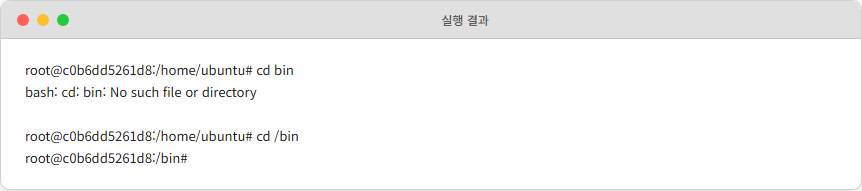

*절대 경로로 이동한 결과입니다.*

### 2.5.3 파일/폴더 관리: mkdir, touch, rm, cp, mv

| 명령어 | 설명 | 예시 |
|--------|------|------|
| `mkdir <폴더명>` | 폴더 생성 | `mkdir hello` |
| `touch <파일명>` | 빈 파일 생성 | `touch a.txt` |
| `rm <파일명>` | 파일 삭제 | `rm a.txt` |
| `rm -r <폴더명>` | 폴더 삭제 (하위 포함) | `rm -r hello` |
| `cp <원본> <사본>` | 파일 복사 | `cp a.txt b.txt` |
| `mv <원본> <대상>` | 파일 이동 또는 이름 변경 | `mv a.txt /tmp` |

`mv`는 같은 경로에서 파일명만 바꿀 때도 씁니다. 예: `mv b.txt c.txt`.

### 2.5.4 패키지 관리: apt

컨테이너에는 최소한의 프로그램만 들어 있습니다. 필요한 도구는 **apt**로 설치합니다.

| 명령어 | 설명 |
|--------|------|
| `apt update` | 설치 가능한 패키지 목록 갱신 |
| `apt list \| grep <키워드>` | 패키지 검색 |
| `apt install -y <패키지명>` | 패키지 설치 (`-y`: 자동 승인) |

```bash
apt update           # 패키지 목록 갱신
apt install -y nginx # nginx 설치
nginx                # nginx 실행
```


*nginx 설치와 실행 결과입니다.*

포트 상태를 확인하려면 `net-tools`가 필요합니다.

```bash
apt install -y net-tools
netstat -nlpt
```


*포트 상태 확인 결과입니다.*

80번 포트가 열려 있습니다. 브라우저에서 `localhost:80`에 접속하면 nginx 환영 페이지가 나옵니다.


*nginx 페이지 응답입니다.*

### 2.5.5 텍스트 편집: vim

서버의 설정 파일을 다룰 때 자주 쓰는 편집기입니다.

```bash
apt install -y vim
```

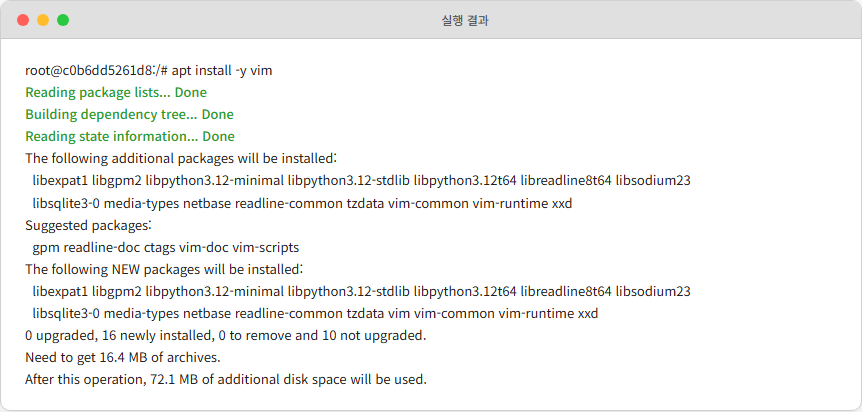

*vim 설치 과정입니다. 지역은 Asia, 시간대는 Seoul을 선택하면 된다.*

vim 사용의 핵심 흐름입니다.

| 단계 | 동작 | 키 |
|------|------|----|
| 1 | 파일 열기/생성 | `vim <파일명>` |
| 2 | 입력 모드 전환 | `i` |
| 3 | 내용 편집 | 자유롭게 입력 |
| 4 | 일반 모드로 복귀 | `ESC` |
| 5 | 저장 후 종료 | `:wq` + Enter |

```bash
vim test1.txt   # test1.txt 파일 생성
```

`i`로 입력 모드, 내용 작성, `ESC` → `:wq`로 저장 후 종료.


*vim 편집 화면입니다.*

```bash
cat test1.txt   # 파일 내용 출력
```


*파일 내용 출력 결과입니다.*

`:q`는 단순 종료, `:q!`는 저장 없이 강제 종료입니다.

### 2.5.6 프로세스 관리: ps, kill

| 명령어 | 설명 | 예시 |
|--------|------|------|
| `ps -ef` | 실행 중인 전체 프로세스 | |
| `ps -ef \| grep <키워드>` | 특정 프로세스 검색 | `ps -ef \| grep nginx` |
| `kill <PID>` | 안전 종료 (SIGTERM) | `kill 357` |
| `kill -9 <PID>` | 강제 종료 (SIGKILL) | `kill -9 357` |

### 2.5.7 파일 검색과 로그 확인: find, tail

| 명령어 | 설명 | 예시 |
|--------|------|------|
| `find <경로> -name <파일명>` | 이름으로 위치 검색 | `find / -name index.html` |
| `find <경로> -name <패턴>` | 패턴 검색 (`*` 사용) | `find / -name index*` |
| `tail <파일>` | 마지막 10줄 출력 | `tail access.log` |
| `tail -n <숫자> <파일>` | 마지막 N줄 | `tail -n 50 access.log` |

```bash
find / -name index.html   # index.html 위치 검색
```


*파일 검색 결과입니다.*

컨테이너에서 빠져나올 때는 `exit`.

## 2.6 컨테이너 생명주기

오픈이는 컨테이너를 띄우다 보니 이상한 점을 만났습니다. 똑같이 나왔다고 생각했는데 어떤 컨테이너는 살아 있고, 어떤 컨테이너는 죽어 있었습니다. "빠져나온다"의 의미가 경우마다 달랐습니다.

### 2.6.1 exit vs detach

```bash
docker run -it --name dead ubuntu   # dead 컨테이너 실행
exit                                 # 컨테이너 종료
docker ps                            # 실행 중 확인 → 없음
```

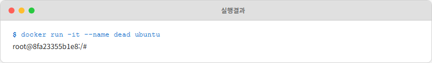


*exit로 빠져나오면 컨테이너가 종료됩니다.*

이번에는 빠져나오는 방식만 다르게 했습니다.

```bash
docker run -it --name alive ubuntu   # alive 컨테이너 실행
# CTRL + P → CTRL + Q 입력
docker ps                            # alive 컨테이너가 살아 있음
```

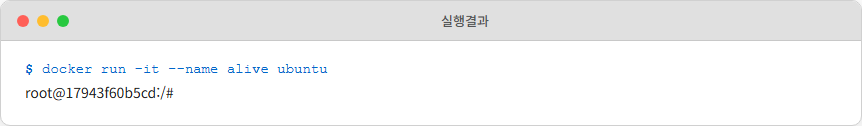


*CTRL+P → CTRL+Q로는 컨테이너가 유지됩니다.*

정리하면 **exit**는 프로세스를 끄는 것이고, **CTRL + P, Q**는 연결만 끊는 것입니다.

### 2.6.2 -dit: 백그라운드 + 인터랙티브

`-dit` 옵션은 세 옵션을 조합한 것입니다.

| 옵션 | 역할 |
|------|------|
| `-d` | 백그라운드 실행 (detached) |
| `-i` | 입력 가능한 상태 유지 (interactive) |
| `-t` | 터미널 환경 제공 (TTY) |
| `-dit` | 위 세 개 조합 |

nginx는 `-d`만으로도 백그라운드에서 잘 돌았습니다. ubuntu도 같을까.

```bash
docker run -d nginx   # nginx 백그라운드 실행
docker ps             # 실행 중 확인
```

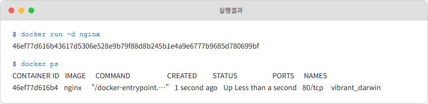

*nginx는 -d만으로도 살아 있습니다.*

```bash
docker run -d ubuntu   # ubuntu 백그라운드 실행
docker ps              # 실행 중 확인
```


*ubuntu는 -d만으로는 띄우자마자 꺼집니다.*

방금 실행했는데 목록에 없습니다.

> **Docker 컨테이너는 메인 프로세스가 살아 있는 동안만 유지된다.** nginx는 요청을 기다리는 웹 서버라서 백그라운드에서 계속 도는 게 정상이다. 반면 ubuntu의 메인 프로세스는 `bash`다. bash는 사용자 입력을 기다리는 프로그램이라서, 터미널이 연결되어 있지 않으면 "할 일이 없다"고 판단해서 즉시 종료된다.

`-dit`을 쓰면 ubuntu도 살아 있습니다. 터미널이 연결된 상태로 백그라운드에 가기 때문입니다.

```bash
docker run -dit ubuntu   # ubuntu 백그라운드 + 인터랙티브
docker ps
```

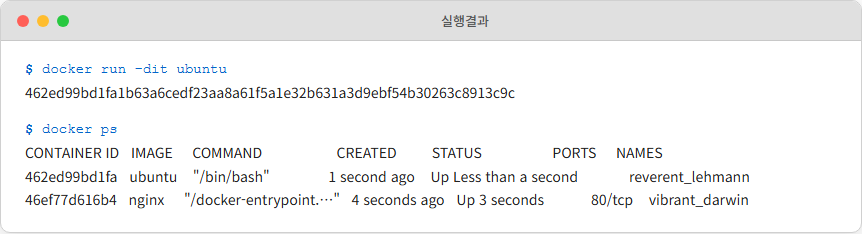

*ubuntu도 -dit이면 유지됩니다.*

### 2.6.3 CMD: 시작 명령 바꾸기

> **참고: CMD(COMMAND)**
> 컨테이너가 시작될 때 실행되는 **기본 프로세스**를 정의하는 명령. `docker run <이미지> <CMD>` 형태로 직접 CMD를 주면 이미지에 설정된 기본값을 덮어쓴다.

`sleep 1000`은 1000초 동안 대기하는 명령입니다.

```bash
docker run -d ubuntu sleep 1000   # sleep을 메인 프로세스로
docker ps                         # 실행 중 확인
```


*CMD로 sleep을 박으면 컨테이너가 유지됩니다.*

아까 `-d`만으로는 꺼졌던 ubuntu가 이번에는 살아 있습니다. **bash 대신 sleep이 메인 프로세스가 되었기 때문**입니다. 이렇게 뒤에 명령어를 붙이면 기본 CMD를 덮어쓸 수 있습니다.

### 2.6.4 attach: 메인 프로세스에 직접 붙기

백그라운드 컨테이너로 다시 들어갈 때 **attach**와 **exec** 두 가지가 있습니다.

> **참고: attach 명령**
> 실행 중인 메인 프로세스(PID 1)에 직접 연결하는 명령. `docker attach <컨테이너ID>`.


*attach는 메인 프로세스에 직접 연결됩니다.*

```bash
docker run -dit ubuntu  # ubuntu 백그라운드 실행
docker ps               # 컨테이너 ID 확인
docker attach d2b1      # attach로 접근
```


*attach 접근 결과입니다.*

attach는 **메인 프로세스(PID 1)** 에 직접 연결됩니다. 여러 터미널에서 attach하면 모두 같은 화면을 공유합니다. 단점이 하나 있습니다. 이 상태에서 잘못 빠져나오면 메인 프로세스가 종료되면서 컨테이너 전체가 꺼집니다. `CTRL + P` → `CTRL + Q`로 조심해서 빠져나와야 합니다.

### 2.6.5 exec: 새 프로세스로 접근

attach의 위험을 피하려면 **exec**를 씁니다. 새 프로세스를 따로 만들어서 들어가므로 메인 프로세스에 영향이 없습니다.

> **참고: exec 명령**
> 실행 중인 컨테이너에 **새 프로세스**를 만들어 접근하는 방식. `docker exec <옵션> <컨테이너ID> <명령>`.


*exec는 메인 프로세스 옆에 새 프로세스를 띄웁니다.*

```bash
docker exec -it d2b1 bash   # 새 bash 세션으로 접근
```


*exec로 접근한 결과입니다.*

호스트에서 터미널을 하나 더 열어 컨테이너 내부 프로세스를 확인해 봤습니다.

```bash
docker exec d2b1 ps aux   # 컨테이너 내부 프로세스 목록
```


*PID 1은 메인 프로세스, PID 12가 exec가 만든 새 프로세스입니다.*

PID 1이 메인이고 PID 12가 exec로 새로 생긴 프로세스입니다. exec로 만든 프로세스에서 선언한 환경 변수는 그 세션에만 존재합니다. 메인 프로세스(PID 1) 세션의 변수가 exec 세션에 보이지 않는 것도 같은 이유입니다. 둘은 환경을 공유하지만 **다른 터미널 세션**입니다.

## 2.7 이미지 만들기

컨테이너 안에서 패키지를 이것저것 깔았는데, 이 상태를 저장하면 다음번에도 같은 환경으로 시작할 수 있습니다. 컨테이너를 이미지로 **굽는** 과정입니다.

### 2.7.1 Tomcat 내려받기

```bash
docker run -d -p 8080:8080 tomcat   # Tomcat 백그라운드 실행
```

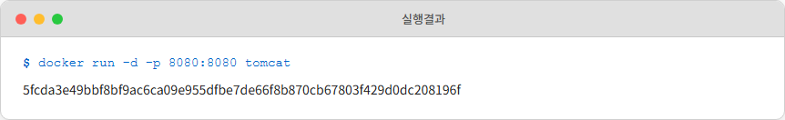

*Tomcat 컨테이너 실행 결과입니다.*

`docker ps`로 확인한 컨테이너 ID가 `5fcd`였습니다. 브라우저에서 `localhost:8080`으로 접속했더니 **404**가 떴습니다.


*Tomcat 404 에러 화면입니다.*

별도 컨트롤러가 없으면 `/`로 들어온 요청은 서버 안의 `index.html`로 응답합니다. Tomcat 이미지에는 `webapps/ROOT/index.html`이 없어서 404가 난 것입니다.

### 2.7.2 컨테이너 내부 수정: index.html 만들기

Tomcat의 index.html 파일은 `webapps/ROOT` 폴더에 있어야 합니다. exec로 컨테이너 내부에 들어가서 그 경로를 만들었습니다.

```bash
docker exec -it 5fcd bash           # Tomcat 내부로 진입
cd /usr/local/tomcat/webapps        # webapps 경로 이동
```

> webapps 경로를 모를 때는 `find / -name webapps` 같은 명령으로 검색할 수 있다.

webapps 폴더는 비어 있었습니다.

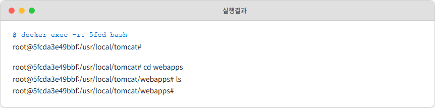

*webapps 폴더가 비어 있는 상태입니다.*

ROOT 폴더를 만들고 그 안에 index.html을 작성했습니다.

```bash
mkdir ROOT          # ROOT 폴더 생성
cd ROOT             # ROOT 폴더로 이동

apt update          # 패키지 목록 갱신
apt install -y vim  # vim 설치
vim index.html      # index.html 생성
```

vim에서 `i`로 입력 모드, HTML 내용 작성, `ESC` → `:wq`로 저장.

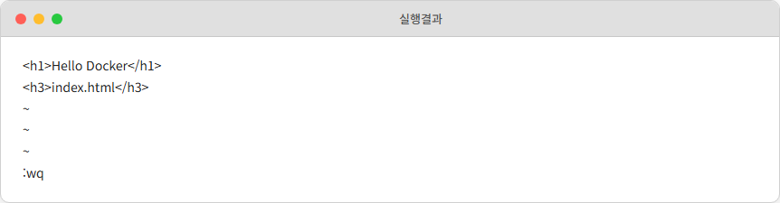

*index.html 작성 화면입니다.*

브라우저에서 `localhost:8080`에 다시 접속했더니 방금 만든 페이지가 응답했습니다.


*index.html 응답 확인입니다.*

### 2.7.3 docker commit: 이미지로 굽기

이 상태를 이미지로 저장하면 다음번에도 webapps/ROOT/index.html이 들어 있는 Tomcat을 바로 쓸 수 있습니다. 먼저 exec 셸에서 `exit`로 빠져나옵니다(exec 셸이라 컨테이너는 유지됩니다).

> **docker commit <컨테이너ID> <dockerhub아이디/이미지명:태그>** 형태로 명령을 작성한다. Docker Hub에서 계정과 레포지토리를 찾는 용도이므로 본인 Docker Hub 아이디를 넣어야 한다.

```bash
docker commit 5fcd <본인-dockerhub-id>/tomcat   # 현재 상태를 새 이미지로
```


*이미지 커밋 완료 화면입니다.*

### 2.7.4 docker push: Docker Hub에 올리기

만든 이미지를 다른 사람도 쓸 수 있게 Docker Hub에 올립니다. 계정이 없다면 [hub.docker.com](https://hub.docker.com/)에서 가입이 먼저입니다.

```bash
docker login   # Docker Hub 로그인
```

Username과 Password를 입력한 뒤 Enter.

```bash
docker push <본인-dockerhub-id>/tomcat   # Docker Hub에 업로드
```


*이미지 푸시 완료 화면입니다.*

Docker Hub의 Repositories 탭에서 올린 이미지가 보입니다.


*Docker Hub 저장소 확인입니다.*

### 2.7.5 이 방식의 한계

`docker commit`은 "컨테이너 안에서 이것저것 한 뒤 저장한다"는 수작업 방식입니다. 만들 때마다 컨테이너를 띄우고 exec로 들어가서 명령을 치고 commit해야 합니다.

이미지를 여러 번 찍어야 할 때 이 방식은 지칩니다. 다음 챕터에서 등장하는 **Dockerfile**이 이 작업을 **설계도 파일 하나**로 자동화합니다. "Ubuntu 기반으로 시작, apt update 실행, vim 설치, index.html 복사, 끝" 식으로 적어두면 docker build 한 줄이 이미지를 찍어냅니다. 일단 지금은 "수동으로도 만들 수 있다"는 사실만 알아두면 됩니다.

## 2.8 마운트: 데이터 보존

컨테이너는 휘발성입니다. 컨테이너 안에 저장한 데이터는 컨테이너가 지워지면 같이 사라집니다. 개발용이라면 괜찮지만, DB의 실제 데이터나 중요한 로그를 안에 저장하면 큰일입니다. 이 데이터를 **컨테이너 바깥에** 빼놓는 방법이 **마운트**입니다.

> **참고: 마운트(Mount)**
> 컨테이너 내부의 특정 경로를 외부 저장소에 연결하는 기능. 컨테이너가 삭제되어도 외부에 남아 있는 데이터는 그대로다.

Docker는 두 가지 마운트를 지원합니다. 호스트 PC의 폴더에 직접 연결하는 **바인드 마운트(Bind Mount)** 와 Docker가 관리하는 별도 저장소를 쓰는 **볼륨 마운트(Volume Mount)** 입니다.

### 2.8.1 바인드 마운트: 호스트 폴더와 직접 연결

> **참고: 바인드 마운트**
> 호스트 PC의 실제 폴더를 컨테이너 내부 경로와 직접 연결하는 방식. 양쪽에서 같은 파일을 보게 된다.


*호스트 PC의 폴더와 컨테이너 내부 폴더가 직접 연결된 그림입니다.*

먼저 호스트에 마운트할 폴더를 만듭니다. `--mount` 옵션은 연결할 폴더가 미리 존재해야 에러가 나지 않습니다.

```bash
# Windows (Git Bash / WSL)
mkdir -p /c/app/bind

# macOS / Linux
mkdir -p ~/app/bind
```

그다음 컨테이너를 띄울 때 `--mount` 옵션으로 연결합니다.

```bash
# Windows (Git Bash / WSL)
docker run -it --mount type=bind,src=/c/app/bind,dst=/app/bind ubuntu

# macOS / Linux
docker run -it --mount type=bind,src=$HOME/app/bind,dst=/app/bind ubuntu
```

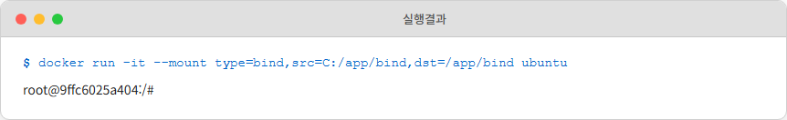

*바인드 마운트 실행 결과입니다.*

호스트의 `bind` 폴더와 컨테이너 내부의 `/app/bind` 폴더가 연결됐습니다. 컨테이너 안에서 `/app` 폴더를 보면 bind가 있습니다.

```bash
ls /app
```

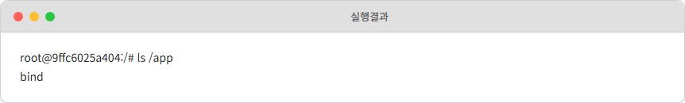

*컨테이너 안에서 /app의 내용을 확인합니다.*

컨테이너 안에서 `/app/bind`에 파일을 만들어 봤습니다.

```bash
touch /app/bind/a.txt
```

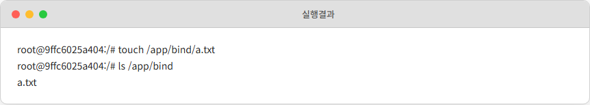

*컨테이너 안에서 파일을 만들었습니다.*

호스트 PC의 `/c/app/bind` 폴더에서도 `a.txt`가 보입니다.


*호스트 PC에서 같은 파일이 보이는 것을 확인합니다.*

양쪽이 연결된 같은 폴더이기 때문입니다. 실습이 끝나면 `exit`로 컨테이너에서 나옵니다.

### 2.8.2 볼륨 마운트: Docker가 관리하는 저장소

> **참고: 볼륨 마운트**
> Docker 엔진이 관리하는 별도 저장 공간(Volume)을 컨테이너와 연결하는 방식. 사용자는 볼륨 이름만 지정하고, 실제 저장 위치는 Docker가 알아서 관리한다.


*Docker 엔진이 관리하는 내부 저장 공간에 데이터가 저장됩니다.*

현재 볼륨 목록을 먼저 봤습니다.

```bash
docker volume ls
```

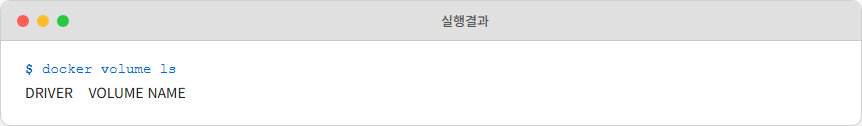

*볼륨 목록이 비어 있는 상태입니다.*

`docker run -it --mount type=volume,src=<볼륨명>,dst=<컨테이너경로> <이미지>` 형태로 볼륨을 연결한 컨테이너를 띄웁니다.

```bash
docker run -it --mount type=volume,src=metacoding-volume,dst=/app/volume ubuntu
```


*볼륨 마운트로 ubuntu 컨테이너를 실행합니다.*

`/app/volume` 폴더가 자동으로 생겼습니다.

> 바인드 마운트와의 차이 하나. 볼륨 마운트는 **컨테이너 내부 폴더에 이미 들어 있던 파일을 새 볼륨에 복사**해서 보존합니다. 반면 바인드 마운트는 **호스트 폴더의 내용으로 컨테이너 내부를 덮어버려서** 원래 들어 있던 파일이 가려집니다.

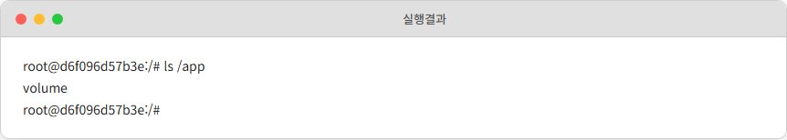

*볼륨 폴더가 생성된 결과입니다.*

볼륨에 파일을 하나 만듭니다.

```bash
touch /app/volume/b.txt
```

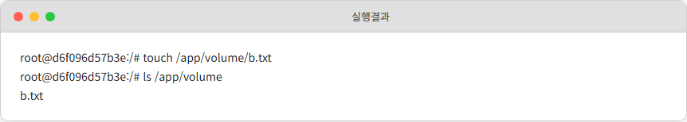

*볼륨에 파일을 생성한 모습입니다.*

`exit`로 컨테이너를 종료한 뒤 볼륨 상태를 다시 봤습니다.

```bash
exit
docker volume ls
```


*컨테이너가 사라져도 볼륨은 유지됩니다.*

컨테이너는 없어졌는데 볼륨은 남아 있습니다. 새 컨테이너에 같은 볼륨을 붙이면 이전 데이터를 그대로 씁니다.

```bash
docker run -it --mount type=volume,src=metacoding-volume,dst=/app/volume ubuntu
ls /app/volume
```


*새 컨테이너에서 이전 볼륨의 데이터를 그대로 봅니다.*

b.txt가 그대로 있습니다. 볼륨이 컨테이너와 독립적으로 유지되기 때문입니다. 이 성질이 DB 컨테이너의 실제 데이터를 보존할 때 결정적으로 쓰입니다.

### 2.8.3 둘의 선택 기준

| 구분 | 바인드 마운트 | 볼륨 마운트 |
|------|------------|-----------|
| 저장 위치 | 호스트 PC의 지정 폴더 | Docker 엔진 내부 저장 공간 |
| 관리 주체 | 사용자 직접 | Docker 엔진 |
| 경로 지정 | 절대 경로 필수 | 볼륨 이름만 |
| 주 사용처 | 개발 중 소스 코드 공유, 설정 파일 연결 | DB 데이터 보존, 컨테이너 간 데이터 공유 |
| 성능/보안 | 호스트 환경에 의존 | Docker가 최적화해서 관리 |
| 기존 파일 처리 | 호스트 폴더 내용으로 컨테이너 내부 덮어씀 | 컨테이너 내부 파일을 볼륨으로 복사해서 보존 |

개발 중 코드를 호스트와 컨테이너 양쪽에서 바로 편집하고 싶다면 **바인드 마운트**, DB처럼 데이터를 안전하게 보존하고 싶다면 **볼륨 마운트**입니다.

## 이것만은 기억하자

- **컨테이너는 격리된 프로세스다.** 파일시스템/네트워크/프로세스 공간만 따로 쪼개고, OS 커널은 호스트와 공유한다. VM보다 가볍고 빨리 뜬다.
- **이미지는 컨테이너의 설계도다.** 붕어빵 틀처럼 이미지 하나로 컨테이너를 여러 개 찍어낸다. `docker commit`으로 수동 저장도 되고, 다음 챕터의 Dockerfile로 자동화된다.
- **호스트 ↔ 컨테이너 통신은 포트포워딩, 컨테이너 ↔ 컨테이너 통신은 DNS다.** 포트포워딩은 iptables DNAT으로 구현되고, 컨테이너 간 이름 기반 통신은 사용자 정의 네트워크 위에서만 된다.
- **데이터 보존은 마운트로.** 바인드 마운트는 호스트 폴더 직접 연결, 볼륨 마운트는 Docker가 관리하는 저장소. DB 데이터는 보통 볼륨 마운트.

컨테이너 하나를 띄우고, 내부에 들어가 수정하고, 이미지로 굽고, Docker Hub에 공유하고, 데이터를 밖으로 뺄 수 있게 됐습니다.

그런데 오픈이의 진짜 과제는 컨테이너 하나가 아니었습니다. 결제 서비스만 해도 웹 서버, 백엔드 API, 데이터베이스가 따로 필요합니다. 세 컨테이너를 매번 따로 띄우고 연결하는 건 하루면 지칩니다. 사용자가 늘면 결제 API만 여러 개로 복제해야 하는 일도 생깁니다. 컨테이너 하나를 수동으로 다루는 이 방식은 여기서 한계를 만납니다.

다음 챕터에서는 이미지 작업을 **Dockerfile로 자동화**하고, 여러 컨테이너를 **Docker Compose로 한 번에** 묶어 띄워봅니다. 그리고 2.4에서 예고했던 **사용자 정의 네트워크**도 실제로 만들어서, 컨테이너끼리 이름으로 통신하는 모습을 직접 봅니다.
