# Ch.2 Docker 이해하기

> 한 줄 요약: Docker가 무엇이고 어떻게 돌아가는지, 개념과 기본 사용법을 손에 익힌다
> 핵심 개념: 컨테이너, 이미지, Docker CLI, 네트워크, 마운트

오픈이는 퇴근하고 집으로 돌아와 커피 한 잔을 옆에 두고 노트북을 열었습니다. 오늘 저녁은 Docker에 씁니다. 목표는 하나입니다.

**Docker가 무엇이고 어떻게 돌아가는지, 개념과 기본 사용법을 손에 익힌다.**

선배가 던져준 단어 하나에 오늘 저녁을 걸었습니다. 그 단어가 Docker였고, 어제까지 오픈이는 이 이름조차 몰랐습니다. 오늘 저녁 안에 다 될 것 같지도 않았지만, 그래도 여기까지 가봐야 이 도구가 정말 현업에서 쓸 만한지 알 수 있었습니다. 설치 버튼에 손이 갔다가 멈췄습니다.

*'명령어를 치기 전에 원리부터 보자.'*

Docker가 환경을 어떻게 다루는지부터 이해해야 뒤에 나올 명령어들이 기계적으로 외워지지 않을 것 같았습니다.

## 2.1 컨테이너는 무엇인가

### 2.1.1 주방 네 개 대신 주방 하나

우선 컨테이너가 어떤 원리로 돌아가는지 알아보기로 했습니다. 오픈이는 주방에서 요리사 여러 명이 일하는 장면을 떠올려봤습니다.

한 주방에 요리사 네 명이 있습니다. 네 명이 동시에 요리를 하려면 주방을 어떻게 꾸며야 할까요.


*한 주방에 네 명의 요리사가 있는 상황*

첫 번째 방식은 요리사마다 냉장고, 가스레인지, 조리대를 각자 한 세트씩 사주는 것입니다. 이렇게 하면 네 사람이 완전히 독립된 환경에서 요리하지만, 같은 설비를 네 번 갖춰야 하니 비용이 많이 듭니다.


*주방 설비를 통째로 복제하는 첫 번째 방식*

두 번째 방식은 냉장고와 가스레인지 같은 공용 설비는 함께 쓰고, 칼·도마·조리대처럼 개인이 쓸 도구만 각자 챙기는 것입니다. 장비 수는 그대로인데 공간은 네 명이 동시에 쓸 수 있습니다.

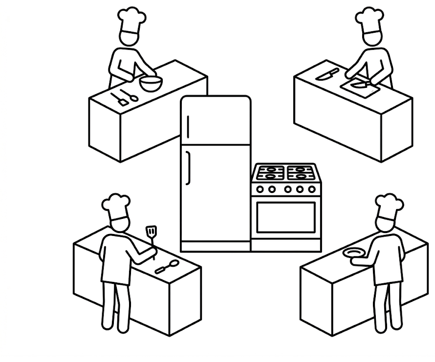

*공용 설비는 공유하고 개별 공간만 쪼개는 두 번째 방식*

IT에 바로 대응되는 두 가상화 방식이 있습니다. 첫 번째가 **하이퍼바이저 가상화**로 결과물이 **가상 머신(VM)**, 두 번째가 **컨테이너 가상화**로 결과물이 **컨테이너**입니다. 둘을 묶어서 **가상화**라고 부릅니다. 오픈이가 오늘 목표로 잡은 것이 두 번째, 바로 이 **컨테이너**입니다. 공용 설비는 공유하면서 각자 자기 조리대만 따로 가지는 구조라, **같은 OS 위에서 여러 앱이 서로 충돌하지 않고 각자 돌 수 있게** 해 줍니다.

> **참고: 하이퍼바이저 가상화**
> 하이퍼바이저(가상화 소프트웨어)가 하드웨어 위에 OS를 통째로 따로 올려 독립된 컴퓨터처럼 쓰게 해 주는 방식입니다. 이 방식으로 만들어진 결과물을 **가상 머신(VM)** 이라 부릅니다. 격리가 완전한 대신 OS가 매번 통째로 뜨므로 무겁고 기동이 느립니다.
>
> **참고: 컨테이너 가상화**
> 호스트 OS의 커널(운영체제의 핵심)을 여러 컨테이너가 공유하고, 파일시스템·네트워크·프로세스 공간만 컨테이너별로 분리하는 방식입니다. 이 방식으로 만들어진 결과물을 **컨테이너**라 부릅니다.
>
> **참고: 가상화(Virtualization)**
> 하나의 물리 서버를 논리적으로 여러 대처럼 나누어 쓰는 기술입니다. 자원을 효율적으로 쓰면서 서로 다른 환경을 안전하게 격리하는 것이 목적입니다.

*'주방 하나, 조리대 여러 개. 앱도 한 칸씩 쓰면 되는 거네.'*

### 2.1.2 IT로 옮긴 구조

비유만 머리에 두면 나중에 실제 용어와 헷갈립니다. 오픈이는 이 주방 그림을 IT 구조로 옮겨 그려봤습니다.

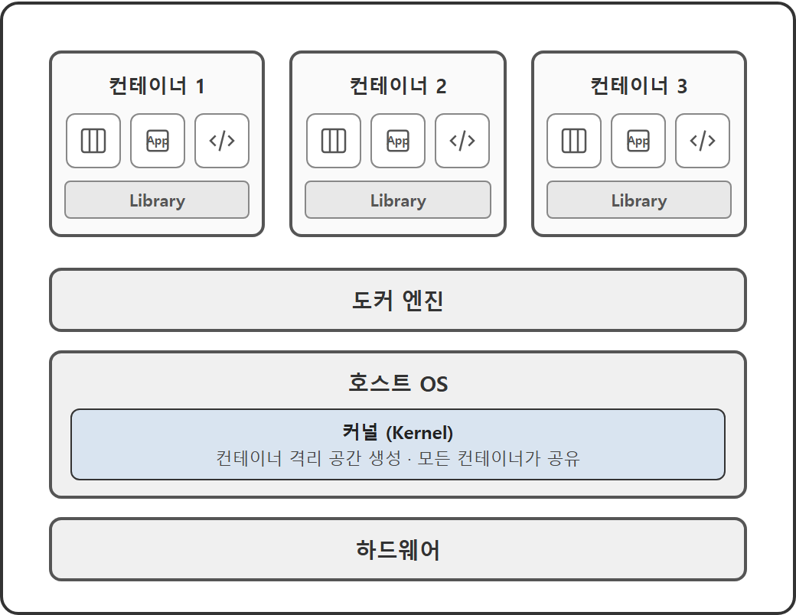

*컨테이너 가상화의 전체 구조*

맨 아래에 **하드웨어**, 그 위에 **호스트 OS**, 그 위에 **Docker 엔진**이 올라갑니다. 엔진 위에 컨테이너가 나란히 떠 있습니다. 각 컨테이너 안에는 애플리케이션(App)과 라이브러리(Library)가 같이 들어갑니다. 주방 비유의 공용 설비가 호스트 OS, 각자의 조리대가 컨테이너입니다.

구조의 핵심은 **호스트 OS의 커널 하나를 모든 컨테이너가 공유**한다는 점입니다. VM처럼 OS를 통째로 따로 올리지 않으니 가볍고 빠르게 뜹니다. Docker 엔진은 그 커널에 "새 격리 공간을 만들어 달라"고 요청하는 중개자이고, 실제로 파일시스템·네트워크·프로세스 공간을 쪼개 주는 일은 커널이 합니다. 그래서 다른 컨테이너가 다른 앱과 다른 라이브러리를 가져도 충돌하지 않고, 한쪽이 런타임을 업그레이드해도 옆 컨테이너는 영향을 받지 않습니다.

> **참고: 컨테이너의 격리**
> 컨테이너마다 **파일시스템**(`/bin`, `/lib` 같은 폴더), **네트워크**(IP와 포트), **프로세스 공간**(PID 번호)이 따로 존재합니다. 한 컨테이너가 라이브러리를 업그레이드해도 다른 컨테이너는 영향이 없고, 두 컨테이너가 같은 포트 번호를 써도 충돌하지 않습니다. 이 세 가지 격리는 리눅스 커널이 뒤에서 처리합니다.

### 2.1.3 docker run이 하는 일

컨테이너의 정체는 잡혔지만, **어떻게 만들어지는지**까지는 아직 그림이 안 그려져 있었습니다. `docker run`을 손으로 치기 전에 그 한 줄 뒤에서 무슨 일이 돌아가는지 눈에 들어와 있어야 명령어가 외우기로 떨어지지 않을 것 같았습니다.

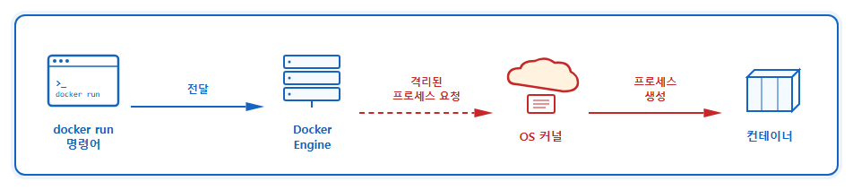

*docker run 명령이 커널의 격리 기능을 타고 컨테이너가 되는 흐름*

1. 사용자가 `docker run <컨테이너명>` 명령어를 친다.
2. **Docker 엔진**이 이 명령을 받고, 로컬에 있는 이미지를 읽는다(없으면 Docker Hub에서 내려받는다).
3. Docker 엔진이 **커널**에게 "이 이미지 사양으로 격리된 프로세스 하나 만들어 줘"라고 요청한다.
4. 커널이 격리 공간(파일시스템/네트워크/프로세스)을 만들고, 그 안에서 새 프로세스를 띄운다.
5. 이 격리된 프로세스가 곧 **컨테이너**다.

컨테이너를 실제로 만드는 건 Docker 엔진이 아니라 커널입니다. 커널이 건물 관리인이라면, Docker 엔진은 프런트 직원에 가깝습니다. 입주자(프로세스)가 들어오면 프런트가 관리인에게 방 배정을 요청합니다. 실제로 방을 비우고 열쇠를 건네는 일은 관리인이 합니다.

> **참고: 커널(Kernel)**
> 운영체제(OS)의 핵심입니다. 프로세스 생성, 메모리 관리, 격리 공간 생성을 담당합니다. Docker의 모든 컨테이너는 호스트 PC의 **같은 리눅스 커널**을 공유합니다. 그 하나의 커널이 각 컨테이너에 격리 공간을 할당합니다.

오픈이는 노트에 "엔진=프런트, 커널=관리인"이라고 한 줄 적었습니다. 적고 나니 컨테이너의 정체와 만들어지는 과정이 머릿속에서 정리됐습니다.

*'그럼 이 안에서 뭘 실행할지는 어디서 정해지지.'*

## 2.2 이미지: 컨테이너의 설계도

컨테이너가 격리된 프로세스라는 건 알았지만, 그 프로세스가 무엇을 실행할지를 결정하는 원본이 따로 있어야 합니다. 그 원본이 **이미지**입니다.

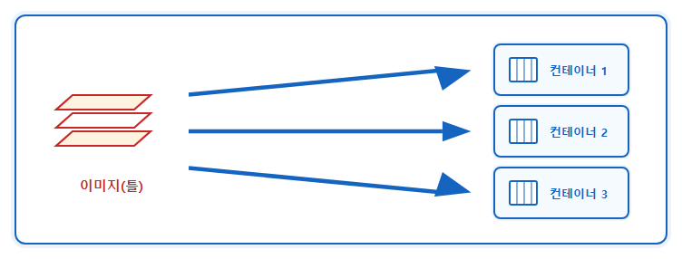

*하나의 이미지로 여러 컨테이너를 찍어내는 구조*

이미지는 붕어빵 틀에 가깝습니다. 틀(이미지) 하나로 붕어빵(컨테이너)을 여러 개 찍어낼 수 있고, 틀 자체는 변하지 않습니다. 같은 이미지에서 나온 컨테이너는 어디서 띄우든 똑같은 환경을 가집니다. 이 덕에 "내 PC와 서버 환경이 같다"가 가능합니다. 로컬에서 만든 **이미지**를 서버에서 그대로 꺼내 실행하면, 서버의 런타임 버전이 뭐든 컨테이너는 자기 이미지 안의 런타임으로 돕니다.

이미지는 **Docker Hub**라는 공용 저장소에서 내려받을 수도 있고, 직접 만들어 올릴 수도 있습니다.

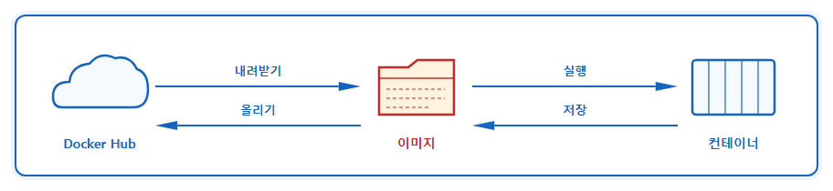

*Docker의 전체 흐름*

이 순환의 핵심은 **이미지가 양 끝을 이어준다**는 점입니다. 한쪽에서 만든 이미지를 Hub에 올려두면, 반대쪽에서 그대로 받아 같은 컨테이너를 띄울 수 있습니다. 내 PC에서 세팅한 환경을 서버에서 재현하는 일도, 팀원끼리 환경을 공유하는 일도 `push`/`pull` 두 동작으로 끝납니다. **이미지 받고 → 컨테이너 만들고 → 수정하고 → 다시 이미지로 저장**. Docker의 일상은 대부분 이 네 동작의 반복입니다.

> **참고: 이미지 레이어**
> 이미지 안에는 OS 기본 라이브러리, 런타임, 애플리케이션, 설정 파일이 **레이어**로 겹쳐 쌓여 있습니다. 아래 레이어는 재사용되고 캐싱되기 때문에, 앱만 바뀌면 맨 위 레이어만 새로 받으면 됩니다. 이미지 전체를 매번 통째로 내려받지 않아도 되는 이유입니다. 커널은 호스트와 공유하므로 이미지에 들어가지 않습니다. 이게 이미지가 가벼운 이유입니다.

개념은 여기까지. 이제 도구를 깝니다.

## 2.3 Docker 설치

Docker Desktop 설치는 공식 사이트(https://www.docker.com/products/docker-desktop/)에서 OS에 맞는 설치 파일을 받아 기본 옵션대로 설치하면 끝입니다. 오픈이는 설치가 끝난 뒤 터미널에 버전을 찍어봤습니다.

```bash
docker version   # Docker 버전 확인
```

Client와 Server 정보가 둘 다 뜨면 설치가 완료된 겁니다. 오픈이 화면에도 두 블록이 나란히 찍혔습니다. 도구 준비는 끝났습니다.

> **참고: Windows와 macOS의 내부 리눅스**
> Docker는 리눅스 커널의 기능을 쓰기 때문에, 리눅스 커널이 없는 Windows와 macOS에서는 Docker Desktop이 내부에 리눅스 환경을 한 겹 더 띄웁니다. Windows는 **WSL2**(Windows Subsystem for Linux 2)를, macOS는 경량 Linux VM을 씁니다. 사용자 입장에서는 신경 쓸 일이 없지만, 뒤에 나올 네트워크 얘기에서 이 차이가 중요해집니다.

## 2.4 Docker CLI 첫 실습

### 2.4.1 docker pull: 이미지 가져오기

가장 먼저 오픈이는 Docker Hub에서 이미지를 내려 받았습니다.

```bash
docker pull nginx   # nginx 이미지 다운로드
```

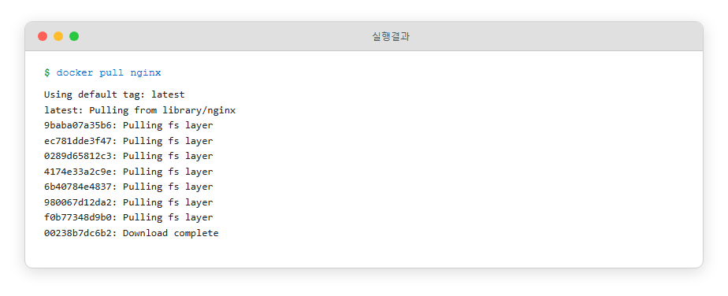

*nginx 이미지 다운로드 결과*

진행 바가 줄줄이 올라가더니 프롬프트가 돌아왔습니다. 이미지가 로컬 저장소에 받아진 것이고, 아직 실행된 건 아닙니다. 설계도만 들어온 상태입니다.

### 2.4.2 docker run: 컨테이너 띄우기

받아둔 이미지로 컨테이너를 띄워 봤습니다.

```bash
docker run nginx   # nginx 컨테이너 실행
```

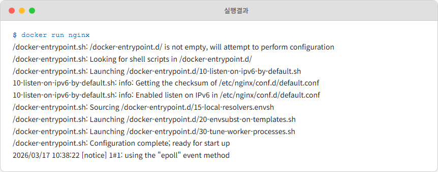

*nginx 컨테이너 실행*

엔터를 누르자마자 터미널이 뚝 멈췄습니다. 커서가 깜빡이지도 않고, 아무 입력도 받지 않았습니다.

*'뭐가 잘못된 건가.'*

nginx가 **포그라운드** 상태로 터미널을 점유하고 있었습니다. 전화 통화가 연결된 동안 다른 전화를 받지 못하는 것과 같은 상황입니다. `CTRL + C`로 빠져나왔습니다.

> **참고: 포그라운드(Foreground)**
> 프로세스가 터미널을 독점하는 상태입니다. 프로세스가 끝나거나 강제 종료될 때까지 그 터미널로 다른 명령을 내릴 수 없습니다.

### 2.4.3 docker run -d: 백그라운드로 띄우기

컨테이너는 띄우고 터미널도 같이 쓰려면 `-d` 옵션이 필요합니다.

```bash
docker run -d nginx   # -d: detached, 백그라운드 실행
```

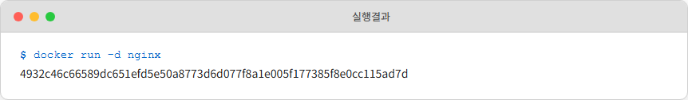

*백그라운드 실행 결과*

이번엔 긴 컨테이너 ID가 한 줄 찍히더니 바로 커서가 돌아왔습니다. 방금 멈췄던 터미널과 대비되면서 `-d`의 역할이 분명해졌습니다.

*'글자 하나로 포그라운드가 백그라운드가 되네.'*

### 2.4.4 docker ps: 실행 중인 컨테이너 확인

오픈이는 백그라운드에서 돌고 있는 컨테이너가 실제로 살아 있는지 확인했습니다.

```bash
docker ps   # 실행 중인 컨테이너 목록
```

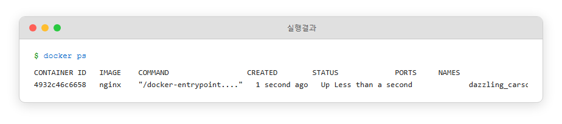

*컨테이너 목록 조회*

목록에 방금 띄운 nginx가 한 줄 찍혔습니다.

### 2.4.5 자주 쓰는 명령어

| 명령어                     | 설명                           |
| -------------------------- | ------------------------------ |
| `docker pull <이미지명>`   | Docker Hub에서 이미지 다운로드 |
| `docker images`            | 로컬에 저장된 이미지 목록      |
| `docker logs <컨테이너ID>` | 컨테이너 로그 출력             |
| `docker ps -a`             | 종료된 컨테이너 포함 전체 목록 |
| `docker stop <컨테이너ID>` | 실행 중인 컨테이너 종료        |
| `docker rm <컨테이너ID>`   | 종료된 컨테이너 삭제           |
| `docker rmi <이미지ID>`    | 이미지 삭제                    |

조회는 `ps`, 로그는 `logs`, 내리기는 `stop`, 지우기는 `rm`. 이 정도로 묶어두면 필요할 때 찾아 쓸 수 있습니다.

여기까지 Docker Hub에서 이미지를 받고 실행을 했습니다. 그다음으로 오픈이의 관심은 컨테이너가 외부와 어떻게 통신하는지로 옮겨갔습니다.

## 2.5 컨테이너의 통신

컨테이너 안에서 앱이 돌아도 외부에서 접속할 수 없으면 쓸모가 없습니다. 격리된 프로세스라는 개념은 익혔지만, 이 격리된 것이 바깥과 어떻게 연결되는지를 모르면 컨테이너 내부를 접근할 수 없습니다. 여기서 컨테이너가 어떻게 통신하는지 큰 그림을 잡아보겠습니다.

### 2.5.1 네트워크 한눈에 보기

오픈이는 방금 띄운 nginx 컨테이너가 실제로 어떻게 연결되어 있는지 궁금해졌습니다. 격리된 공간이라고 했는데 서로 어떻게 오가고, 외부에서는 어떻게 들어가는지.

자료를 훑어보니 컨테이너 네트워크는 세 가지로 정리되어 있었습니다. **컨테이너끼리 연결하는 방법**, **외부 요청이 컨테이너로 들어오는 길**, **이름으로 컨테이너를 찾는 방법**.

오픈이는 이해를 쉽게 하기 위해 **푸드코트**로 그려 봤습니다. 식당 하나가 컨테이너 하나입니다. 식당끼리는 같은 홀을 통해 연결되고, 외부 손님은 입구 키오스크에 주문을 넣어 해당 식당으로 넘기고, 이름만 아는 식당은 홀의 안내 지도를 보고 찾아갑니다.

| 통신 방향             | 푸드코트에서                   | Docker에서     |
| --------------------- | ------------------------------ | -------------- |
| 식당(컨테이너) ↔ 식당 | 같은 홀을 거쳐 서로 연결       | docker0 + veth |
| 외부 손님 → 식당      | 입구 키오스크가 주문을 넘김    | 포트포워딩     |
| 이름으로 식당 찾기    | 홀의 안내 지도가 이름 → 위치로 | Docker DNS     |

이 세 경로를 차례로 풀어보겠습니다.

### 2.5.2 컨테이너끼리 — 푸드코트 주방과 창구

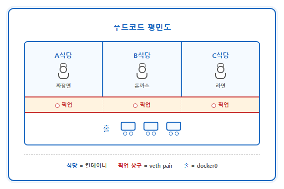

*푸드코트의 식당, 픽업 창구, 홀이 컨테이너 네트워크의 비유*

A, B, C 식당이 벽으로 완전히 분리되어 있습니다. 서로의 내부는 볼 수 없습니다. 대신 각 식당마다 홀 쪽으로 **픽업 창구**가 하나씩 있어서, 음식이 그 창구를 통해 홀로 나갑니다. 주방은 독립이지만 창구와 홀 덕분에 옆 식당과도 오갈 수 있습니다.

Docker의 네트워크도 이 구조입니다. 컨테이너가 뜰 때 가장 먼저 **독립된 네트워크 공간(주방)** 이 생깁니다. 그다음 그 공간과 호스트를 잇는 **가상 케이블(창구)** 이 생성됩니다. 케이블의 반대쪽 끝은 호스트의 **가상 스위치(홀)** 에 꽂힙니다. 같은 홀에 꽂힌 컨테이너들은 이 홀을 거쳐 서로의 IP로 직접 데이터를 주고받을 수 있습니다.

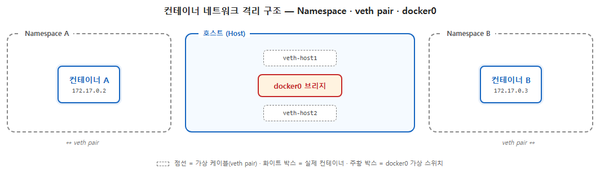

*컨테이너 네트워크 격리 구조*

| 구성 요소             | 역할                                 | 푸드코트 비유 |
| --------------------- | ------------------------------------ | ------------- |
| **Network Namespace** | 컨테이너별 독립 네트워크 공간        | 식당 주방     |
| **veth pair**         | 컨테이너와 호스트를 잇는 가상 케이블 | 픽업 창구     |
| **docker0**           | 모든 컨테이너 연결이 모이는 브리지   | 푸드코트 홀   |

> **참고: Network Namespace / veth pair / docker0**
>
> - **Network Namespace**: 리눅스 커널이 제공하는 '독립된 네트워크 공간'입니다. 컨테이너가 뜰 때 하나 생성되며, 그 안은 자기만의 IP와 포트 공간을 가집니다.
> - **veth pair**: 'virtual ethernet(가상 이더넷)'의 약자입니다. 한쪽 끝은 컨테이너 안(`eth0`)에, 반대쪽 끝은 호스트(`veth...`)에 꽂히는 가상 케이블입니다.
> - **docker0**: Docker가 호스트에 자동으로 만드는 가상 스위치(브릿지)입니다. 모든 컨테이너의 veth가 여기로 모입니다.

*'각자 주방을 따로 쓰면서 창구를 통해 홀 하나로 모이는 거네. 격리와 연결이 한 구조 안에 같이 들어 있구나.'*

식당-창구-홀은 각각 Namespace, veth, docker0에 대응됩니다. 이렇게 식당에서 홀까지 음식이 나오는 길은 정리됐습니다. 오픈이가 다음으로 알아본 건 손님이 이 홀 안의 식당에 어떻게 주문을 넣느냐였습니다.

### 2.5.3 외부에서 들어오기 — 입구 키오스크

방금 본 docker0는 호스트 안에 있는 **가상 스위치**입니다. 집에서 공유기가 여러 기기를 묶어주는 것과 비슷한 역할을 합니다. 이 스위치를 통해 컨테이너끼리 통신이 가능합니다.

그런데 외부 사용자가 이 스위치 너머의 특정 컨테이너에 바로 닿는 건 쉽지 않습니다. 이유가 두 가지입니다.

- docker0는 **리눅스 환경에서** 동작하는 장치입니다. 그래서 리눅스 환경에서는 호스트에서 컨테이너 IP로 접근이 됩니다. **하지만 Windows와 macOS에서는** docker0가 2.3 챕터에서 본 내부 리눅스 VM 안에 있어서, 호스트에서 컨테이너 IP로 바로 접근이 되지 않습니다. 오픈이처럼 Windows나 macOS에서 실습 중이라면 이 경로 자체가 막혀 있습니다.
- 설령 리눅스 환경이라 해도, 외부 사용자는 컨테이너의 내부 IP를 알 수 없습니다. 컨테이너가 뜰 때마다 IP가 바뀌기도 하고, 바깥으로 공개된 주소도 아니기 때문입니다.

따라서 외부에서 컨테이너로 들어오는 **별도의 통로**가 필요합니다.

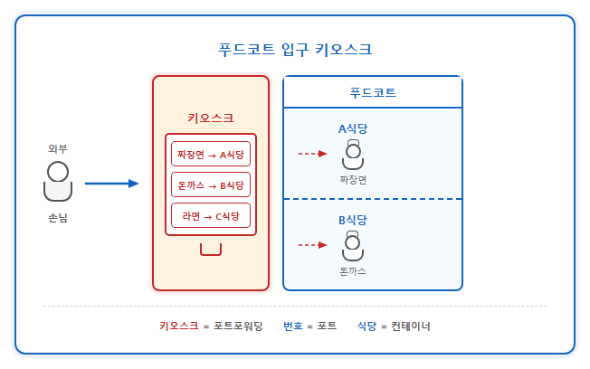

*입구 키오스크가 손님의 주문을 각 식당으로 넘겨주는 비유*

푸드코트에 비유하면, 외부 손님은 주방에 직접 들어가지 못합니다. 대신 입구의 **키오스크**에 주문을 넣으면, 키오스크가 해당 식당으로 그 주문을 넘겨줍니다. 짜장면은 A식당으로, 돈까스는 B식당으로 갑니다.

Docker에서 이 키오스크 역할이 **포트포워딩**입니다. 호스트 PC의 특정 포트를 바깥으로 공개해 두고, 그 포트로 들어온 요청을 미리 지정해둔 컨테이너의 포트로 넘기는 방식입니다. `docker run -p <호스트 포트>:<컨테이너 포트>` 형태로 지정합니다.


*호스트 포트가 컨테이너 포트로 연결되는 구조*

이 한 줄을 치면 Docker는 리눅스 커널의 네트워크 규칙 도구인 **iptables**에 규칙을 한 줄 심어둡니다. iptables 규칙이란 "이런 요청이 오면 → 이렇게 처리하라"는 조건문입니다. 처리 방식은 차단·허용·다른 주소로 전달 등 여러 종류가 있는데, 포트포워딩은 그중 "컨테이너의 저 포트로 전달하라" 종류의 규칙입니다. 방금 본 키오스크의 버튼 하나하나와 같은 역할입니다. 예를 들어 `-p 8080:80`을 주면 "호스트의 8080 포트로 들어온 요청 → 컨테이너의 80 포트로 전달" 규칙 한 줄이 추가됩니다.

브라우저에서 호스트 포트로 요청을 보내면 iptables가 이 규칙대로 도착지를 바꿔치기합니다. 사용자 입장에서는 이 변환이 보이지 않고, "localhost에 접속했더니 컨테이너 안의 페이지가 나왔네" 정도로만 경험됩니다. 앱은 컨테이너 안의 기본 포트에서 도는데, 그 포트를 `-p`로 바깥에 열어주면 브라우저에서 접속할 수 있습니다.

> **참고: 포트포워딩 / iptables / DNAT**
>
> - **포트포워딩**: "외부 포트 → 컨테이너 포트"로 요청을 넘기는 규칙입니다. `docker run -p 8080:80` 식으로 지정합니다.
> - **iptables**: 리눅스 커널에 네트워크 규칙을 심는 도구입니다. 각 규칙은 "어떤 요청 → 어디로" 형태의 조건문이고, Docker는 포트포워딩을 이 규칙으로 구현합니다.
> - **DNAT(Destination NAT)**: 요청의 도착지 주소를 바꿔치기하는 동작을 가리키는 용어입니다. iptables 규칙이 실제로 이 일을 수행합니다.

### 2.5.4 이름으로 찾기 — 홀의 안내 지도

컨테이너끼리 통신하려면 결국 상대 IP를 알아야 합니다. 그런데 컨테이너가 둘, 셋 늘어나면 IP를 일일이 외우고 적어두는 게 영 번거롭습니다.

*'인터넷은 naver.com 같은 도메인 주소만 알면 알아서 연결되잖아. 컨테이너도 이름으로 찾을 수는 없나.'*

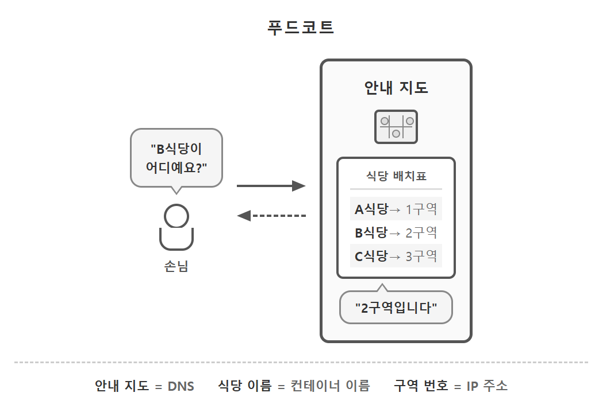

*안내 지도가 이름을 위치로 바꿔주는 비유*

손님 한 명이 "B식당"을 찾고 있습니다. 가게명은 알고 있는데 위치는 어디쯤에 있는지는 알 수 없습니다. 그럴 때 홀에 걸린 **안내 지도**에 "B식당 = 2구역"이라고 표시가 되어있다면, 손님은 지도를 보고 가게의 위치를 쉽게 찾을 수 있습니다.

Docker 내부에도 이 안내 지도가 있습니다. 이름이 **Docker DNS**입니다. 새 컨테이너가 뜨면 이름과 IP가 자동으로 DNS에 등록되고, 다른 컨테이너가 그 이름으로 요청을 보내면 Docker DNS가 이름을 IP로 변환해 줍니다. 매번 바뀌는 IP 주소를 외울 필요가 없습니다.

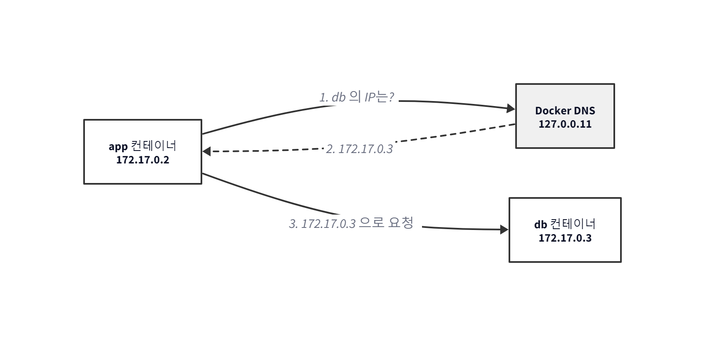

*Docker DNS가 이름을 IP로 변환*

다만 여기에 주의할 점이 하나 있습니다. 지금까지 본 docker0가 바로 Docker의 **기본 네트워크**인데, 이 이름 기반 통신은 기본 네트워크에서는 작동하지 않습니다. 사용자가 직접 만든 **사용자 정의 네트워크(User-defined Network)** 안에서만 자동 DNS가 켜집니다. 이 차이는 다음 챕터에서 직접 만들어보며 확인합니다.

> **참고: DNS / 사용자 정의 네트워크**
>
> - **DNS(Domain Name System)**: 이름(`google.com`)을 IP로 바꿔주는 시스템입니다. 브라우저 도메인 해석과 같은 원리입니다.
> - **사용자 정의 네트워크**: 사용자가 직접 만드는 네트워크입니다. 기본 네트워크(docker0)와 달리 Docker 내장 DNS가 자동으로 켜져서 컨테이너 이름으로 서로를 부를 수 있습니다.

오픈이는 컨테이너의 통신까지 보고 나니 이제 컨테이너 안이 궁금해졌습니다. 컨테이너는 리눅스 커널이 만든다고 했으니 내부는 리눅스 환경입니다. 도커에 대해 더 알아보기 전에 리눅스를 한 번 정리하고 가기로 했습니다.

## 2.6 컨테이너 안의 리눅스

리눅스를 연습하려면 리눅스 배포판이 필요합니다. **Ubuntu**는 가장 널리 쓰이는 배포판 중 하나라 자료가 풍부하고, Docker Hub에 공식 이미지가 올라와 있어서 바로 받아 띄울 수 있습니다. 오픈이는 Ubuntu 컨테이너를 포트까지 열어둔 채로 띄우고 안에 들어가 봤습니다.

```bash
# -it: 표준입력 유지(-i) + TTY 연결(-t), -p 80:80: 포트포워딩
docker run -it -p 80:80 ubuntu
```

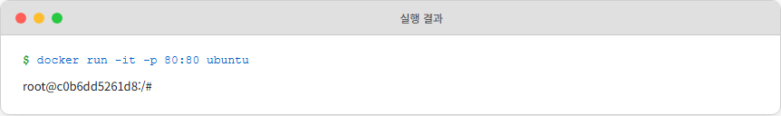

*Ubuntu 컨테이너 안으로 들어간 상태*

프롬프트가 `root@...#` 모양으로 바뀌었습니다. 방금까지 호스트의 터미널이었는데 이제는 컨테이너 안의 쉘입니다. 호스트와는 분리된 공간에 들어와 있다는 감각이 옵니다.

### 2.6.1 자주 쓰는 리눅스 명령어

안으로 들어왔지만 당장 뭘 할 수 있는지가 막막했습니다. 명령어를 모르면 실습에 들어가도 매번 검색해야 흐름이 끊깁니다. 오픈이는 본격적으로 뭔가 깔아보기 전에, 앞으로 자주 쓸 리눅스 명령어부터 한 표로 정리해뒀습니다.

| 용도          | 명령                                  | 설명                       |
| ------------- | ------------------------------------- | -------------------------- |
| 위치 확인     | `pwd`                                 | 현재 위치                  |
| 이동          | `cd <경로>`                           | 폴더 이동                  |
| 목록          | `ls`, `ls -la`                        | 파일/폴더 목록 (숨김 포함) |
| 폴더 생성     | `mkdir <이름>`                        | 폴더 만들기                |
| 파일 생성     | `touch <이름>`                        | 빈 파일                    |
| 복사          | `cp <원본> <사본>`                    | 파일 복사                  |
| 이동/이름변경 | `mv <원본> <대상>`                    | 이동 또는 rename           |
| 삭제          | `rm <파일>`, `rm -r <폴더>`           | 삭제                       |
| 패키지 설치   | `apt update && apt install -y <이름>` | 패키지 설치                |
| 프로세스      | `ps -ef`, `kill <PID>`                | 실행 중 프로세스 / 종료    |
| 검색          | `find <경로> -name <이름>`            | 파일 검색                  |
| 로그          | `tail -n <수> <파일>`                 | 마지막 N줄                 |

경로를 쓸 때는 **절대 경로**와 **상대 경로**를 구분해야 합니다.

> **참고: 절대 경로 / 상대 경로**
>
> 둘의 차이는 **어디서부터 시작해서 읽느냐**에 있습니다.
>
> - **절대 경로** : **루트 경로(/)** 부터 시작해서 목적지까지의 전체 주소를 명시합니다. 현재 위치가 어디든 같은 곳을 가리킵니다. 리눅스에서는 결과적으로 `/`로 시작하는 형태가 됩니다. 예: `/bin`, `/home/ubuntu/docs`.
> - **상대 경로** : **현재 디렉터리**를 기준으로 목적지까지의 경로를 나타냅니다. 현재 위치에 따라 같은 표기가 다른 곳을 가리킬 수 있습니다. 예: `bin`(현재 디렉터리 아래 bin), `../etc`(상위 디렉터리의 etc).

### 2.6.2 실습: 컨테이너 안에 nginx 깔아보기

명령어 감은 잡혔으니 이제 직접 뭔가 올려볼 차례였습니다. 오픈이는 앞서 `docker pull`로 받아 띄웠던 nginx를, 이번엔 맨바닥 Ubuntu에서 직접 설치해보기로 했습니다. 이미지로 받을 땐 한 줄로 끝났던 과정을 손으로 밟아보면, 앞서 배운 이미지가 무엇을 담고 있었는지 역으로 보입니다.

컨테이너 안은 최소 구성이라 필요한 도구는 직접 깔아야 했습니다. 오픈이는 패키지 목록을 갱신한 뒤 nginx를 설치하고 실행했습니다.

```bash
apt update           # 최신 패키지 목록으로 업데이트
apt install -y nginx # nginx 설치
nginx                # nginx 실행
```

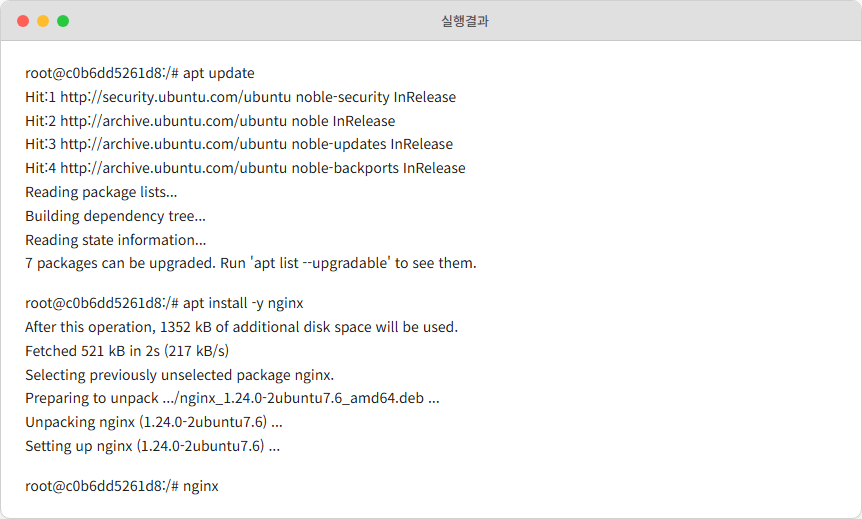

*nginx 설치와 실행 결과*

설치 로그가 한참 흐른 뒤 nginx가 떴습니다. 포트가 실제로 열려 있는지 확인하려고 오픈이는 `net-tools`를 추가로 깔고 `netstat`으로 상태를 봤습니다.

```bash
apt install -y net-tools
netstat -nlpt
```

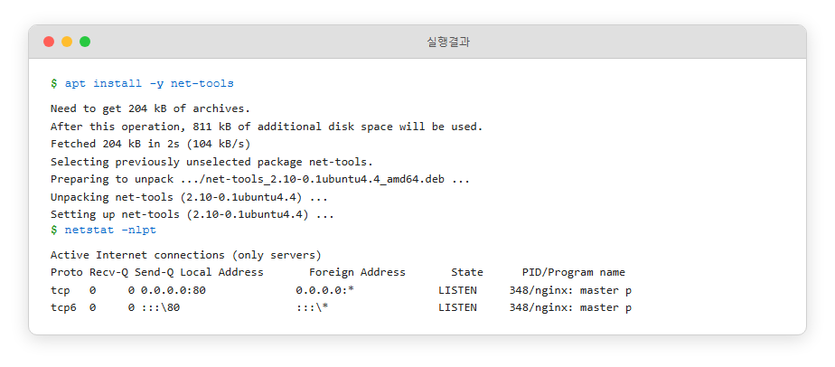

*포트 상태 확인*

80 포트가 열려 있는 것을 확인했습니다. 이제 브라우저 차례. 주소창에 `localhost:80`을 쳤습니다.

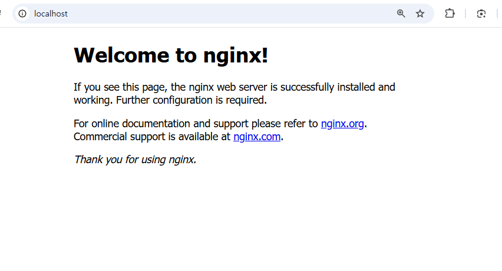

*nginx 환영 페이지 응답*

익숙한 nginx 환영 페이지가 떴습니다. 컨테이너를 띄울 때 `-p 80:80`으로 포트를 열어둔 덕에, 컨테이너 안의 nginx와 브라우저가 연결된 것입니다.

### 2.6.3 vim으로 파일 편집

서버는 깔았지만, 운영하다 보면 설정 파일을 고칠 일이 꼭 생깁니다. 그런데 컨테이너 안엔 GUI 편집기가 없어서 터미널에서 바로 쓰는 편집기가 필요했습니다. 오픈이는 리눅스에서 오래 쓰여온 **vim**을 설치했습니다.

```bash
apt install -y vim
```

> 설치 도중 Geographic area와 Time zone을 선택하는 화면이 나옵니다. 이때 **Asia**, **Seoul**을 각각 선택합니다.

vim의 사용 흐름은 단순합니다.

| 단계 | 동작           | 키             |
| ---- | -------------- | -------------- |
| 1    | 파일 열기/생성 | `vim <파일명>` |
| 2    | 입력 모드      | `i`            |
| 3    | 일반 모드로    | `ESC`          |
| 4    | 저장 후 종료   | `:wq`          |

오픈이는 감을 잡으려고 간단한 파일을 하나 만들어봤습니다.

```bash
vim test1.txt   # test1.txt 파일 생성
```

`i`를 눌러 입력 모드로 전환하고 내용을 작성한 뒤 `ESC` → `:wq`로 저장했습니다.

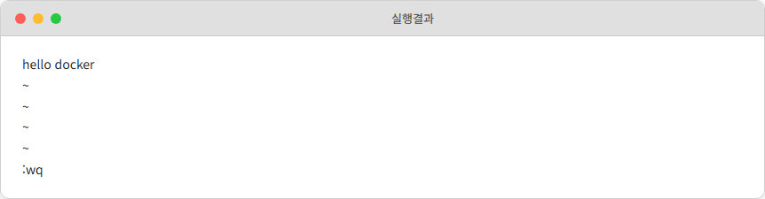

*vim 편집 화면*

저장이 잘 됐는지 `cat`으로 내용을 확인했습니다.

```bash
cat test1.txt   # 파일 내용 출력
```

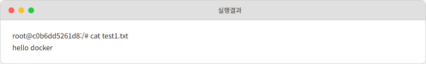

*파일 내용 출력*

방금 쓴 문장이 그대로 찍혀 나왔습니다. 그러고 보니 아까 깔았던 nginx의 기본 페이지는 어디에 놓여 있을까 궁금해졌습니다. 오픈이는 `find`로 `index.html` 파일의 위치를 찾아봤습니다.

```bash
find / -name index.html   # index.html 파일 위치 검색
```

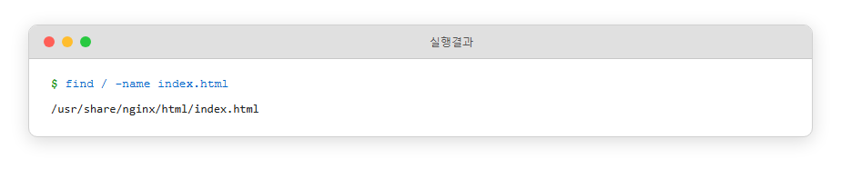

*파일 검색 결과*

컨테이너에서 빠져나올 때는 `exit`입니다. 그런데 `exit`를 치고 `docker ps`를 쳐보니, 방금까지 돌던 컨테이너가 목록에서 사라져 있었습니다.

*'어? 안에서 나왔을 뿐인데 왜 꺼지지.'*

내부 구조는 익혔는데 **언제 살아 있고 언제 죽는지**는 아직 감이 없다는 뜻이었습니다. 컨테이너가 뜻밖에 꺼지면 곤란하니, 오픈이는 이 규칙부터 정리해보기로 했습니다.

## 2.7 컨테이너 생명주기

### 2.7.1 exit vs detach

오픈이는 같은 상황을 한 번 더 만들어 차분히 비교했습니다. 이름을 붙여 띄운 뒤 `exit`로 나와봤습니다.

```bash
docker run -it --name dead ubuntu   # 실행 후 exit로 나옴
exit
docker ps                            # 목록에 없음 (종료됨)
```

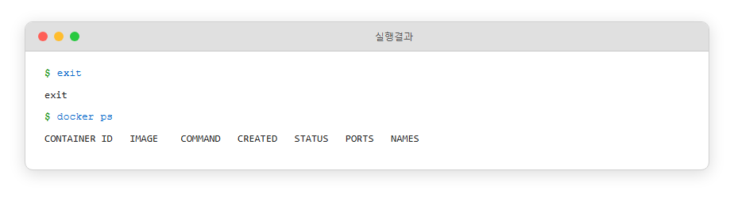

*exit로 빠져나오면 컨테이너가 종료*

예상대로 dead는 목록에 없었습니다.

오픈이는 `exit` 말고 다른 방식도 있는지 찾아봤습니다. `CTRL+P → CTRL+Q`를 쓰면 컨테이너는 그대로 두고 쉘만 빠져나올 수 있었습니다. 같은 방식으로 한 번 더 띄우고 이 조합으로 빠져나왔습니다.

```bash
docker run -it --name alive ubuntu   # CTRL+P → CTRL+Q로 나옴
docker ps                            # 살아 있음
```

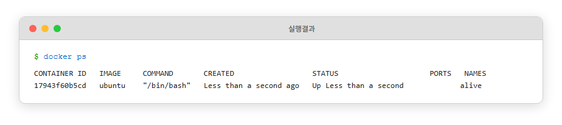

*CTRL+P → CTRL+Q로는 컨테이너가 유지*

이번에는 alive가 살아 있었습니다. 같은 `docker run`인데 나오는 방식에 따라 결과가 갈렸습니다.

| 방식              | 하는 일                                   | 결과                 |
| ----------------- | ----------------------------------------- | -------------------- |
| `exit`            | 컨테이너의 메인 프로세스(bash)를 **종료** | 컨테이너가 종료      |
| `CTRL+P → CTRL+Q` | 터미널과 컨테이너의 **연결만 끊음**       | 컨테이너는 살아 있음 |

오픈이는 두 방식이 건드리는 지점이 다르다는 걸 알았습니다. `exit`는 컨테이너 안의 메인 프로세스를 끝내는 명령이고, `CTRL+P → CTRL+Q`는 바깥의 터미널 연결만 떼는 키입니다. 컨테이너는 터미널을 떼어도 안에서 계속 돌고 있는 겁니다.

### 2.7.2 백그라운드로 살아남는 조건

2.4.3 챕터에서 nginx를 `-d`로 띄웠을 때도 컨테이너는 돌아가는데 터미널이 떨어져 있었습니다. 오픈이는 ubuntu에도 당연히 같은 결과가 나올 거라 보고 같은 옵션을 줘봤습니다.

```bash
docker run -d ubuntu
docker ps
```

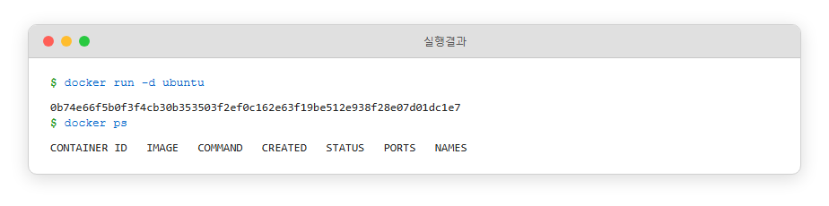

*ubuntu는 -d만으로는 바로 종료*

*'어 왜 실행 목록에 없지?'*

목록에 ubuntu가 없었습니다. 이는 컨테이너가 실행되자마자 꺼진 겁니다. 컨테이너 안의 메인 프로세스가 바로 죽었다는 얘기였습니다. 그런데 2.4.3 챕터에서 실행한 nginx는 같은 `-d`로 잘 돌았습니다.

 오픈이는 두 이미지가 어디서 갈렸는지 앞서 겪은 내용을 되짚어봤습니다. 2.4.2 챕터에서 `docker run nginx`를 그냥 띄웠을 때 터미널이 뚝 멈추고 아무 입력도 받지 않았습니다. nginx는 요청을 기다리며 돌아가는 **데몬**이라 포그라운드에서도 할 일이 있는 겁니다. 2.4.3 챕터에서 `-d`만으로 nginx가 잘 돌았던 이유도 여기 있습니다.
 
 반면 2.6 챕터에서 `-it`로 띄운 ubuntu는 `root@...#` 프롬프트를 내밀었습니다. 메인이 **bash**라 입력을 기다리고 있는 겁니다.

데몬은 터미널이 없어도 계속 요청을 기다리며 돌지만, bash는 터미널이 떨어지면 받을 입력이 사라져 저절로 종료됩니다.

> **참고: 데몬(Daemon)**
> 백그라운드에서 요청을 기다리며 계속 도는 프로그램입니다. 요청이 올 때까지 대기하는 것 자체가 일이라, 터미널이 없어도 할 일이 있습니다. nginx, 데이터베이스 서버, SSH 서버처럼 '서버' 역할을 하는 프로그램이 여기에 속합니다.
>
> **참고: bash(셸)**
> 사용자가 친 명령어를 받아 운영체제에 전달하는 프로그램입니다. 셸(Shell)은 OS와 사용자를 잇는 껍데기라는 뜻이고, bash는 리눅스에서 가장 널리 쓰이는 셸입니다. 입력받을 터미널이 없으면 할 일이 없어 저절로 종료됩니다.

| 이미지 | 메인 프로세스                   | `-d`만으로 유지?        |
| ------ | ------------------------------- | ----------------------- |
| nginx  | nginx 데몬 (항상 요청을 기다림) | 유지됨                  |
| ubuntu | `bash` (사용자 입력을 기다림)   | 터미널 없으면 즉시 종료 |

ubuntu를 백그라운드로 살리려면 `-dit`(`-d` 백그라운드, `-i` 표준입력 유지, `-t` TTY 연결)을 쓰거나 메인 프로세스를 다른 걸로 바꿔야 합니다.

### 2.7.3 CMD로 메인 프로세스 바꾸기

오픈이는 메인 프로세스를 바꾸는 쪽을 먼저 해봤습니다. bash 대신 `sleep 1000`을 메인으로 지정했습니다.

```bash
docker run -d ubuntu sleep 1000   # bash 대신 sleep을 메인으로
docker ps                         # 1000초 동안 살아 있음
```

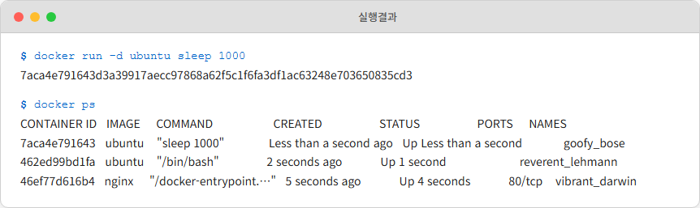

*CMD를 sleep으로 바꾸면 유지*

이번엔 ubuntu가 목록에 남아 있었습니다. sleep은 터미널이 없어도 1000초 동안 할 일이 있는 프로세스이기 때문입니다. 이렇게 기본 실행 명령을 덮어쓰는 것이 **CMD**입니다.

이미지를 만들 때 CMD 옵션을 지정하면, 컨테이너가 실행될 때 적용됩니다.

> **참고: CMD**
> 컨테이너가 시작될 때 실행되는 **기본 프로세스**를 정의하는 설정입니다. `docker run <이미지> <CMD>` 형태로 직접 주면 이미지 기본값을 덮어씁니다.

### 2.7.4 attach vs exec

오픈이는 백그라운드로 띄운 컨테이너에 다시 들어가는 방법이 궁금해졌습니다. 알아보니 **메인 프로세스에 직접 연결하는 `attach`**, **새 프로세스를 하나 더 띄우는 `exec`** 두 가지 방법을 확인했습니다. 결과는 비슷해 보이지만 내부에서 일어나는 일이 다르다고 해서, 두 가지를 직접 비교해봤습니다.

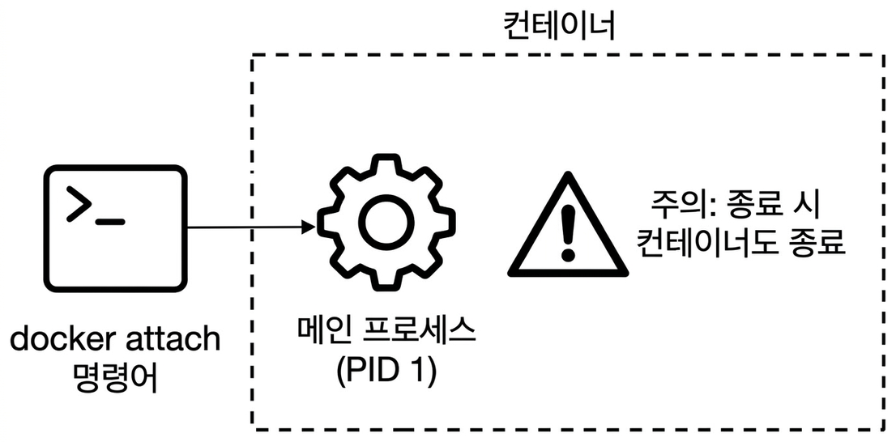

*attach는 이미 떠 있는 PID 1 프로세스에 터미널을 직접 꽂는 방식*

그림처럼 `attach`는 컨테이너 안에서 이미 돌고 있는 메인 프로세스(PID 1)의 입출력을 내 터미널로 끌어옵니다. 같은 프로세스를 공유하기 때문에 여기서 잘못 빠져나와 프로세스를 종료하면 컨테이너 전체가 같이 꺼집니다.

오픈이는 먼저 `attach`를 써봤습니다. ubuntu를 백그라운드로 띄우고, 그 컨테이너에 `docker attach`로 접속했습니다.

```bash
docker run -dit ubuntu  # ubuntu 백그라운드 실행
docker ps               # 실행중인 컨테이너 확인
docker attach d2b1      # attach로 접근
```

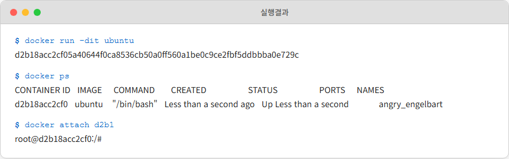

*attach로 접근*

ubuntu의 입력 터미널이 나타났습니다. `attach`는 메인 프로세스(PID 1)에 직접 연결되므로, 여러 터미널에서 붙어도 모두 같은 화면을 공유합니다. 다만 이 상태에서 잘못 빠져나와 메인 프로세스를 종료하면 컨테이너 전체가 꺼집니다. 오픈이는 `CTRL+P → CTRL+Q`로 안전하게 빠져나왔습니다.

이번에는 같은 컨테이너에 `exec`로 다시 들어가봤습니다.

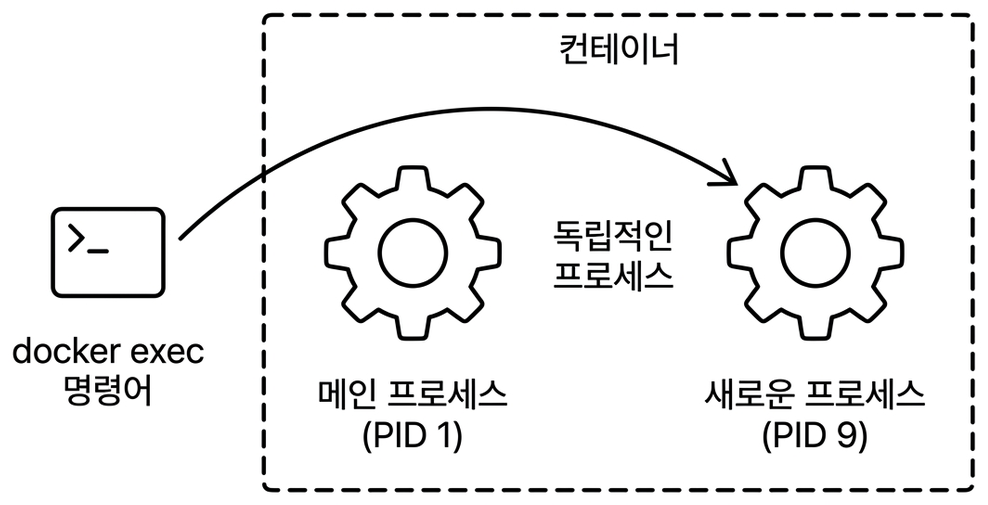

*exec는 컨테이너 안에 새 bash 프로세스를 띄우고 내 터미널에 연결하는 방식*

그림처럼 `exec`는 메인 프로세스에 직접 꽂히는 대신, 컨테이너 안에 **별도의 bash 프로세스를 새로 하나 띄우고** 거기에 내 터미널을 연결합니다. 메인 프로세스와 분리되어 있어 이쪽에서 `exit`로 나와도 메인은 건드리지 않습니다.

```bash
docker exec -it d2b1 bash   # 실행 중인 컨테이너에 새 bash 접속
```

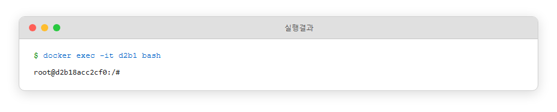

*exec로 접근*

`exec`가 정말 새 프로세스를 만드는지 눈으로 확인하고 싶어서, 오픈이는 호스트에서 터미널을 하나 더 열고 컨테이너 내부의 프로세스 목록을 찍어봤습니다.

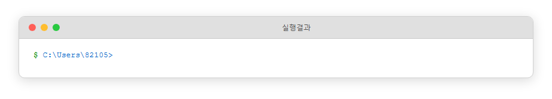

*호스트에서 새 터미널 창 실행*

```bash
docker exec d2b1 ps aux   # 컨테이너 내부 프로세스 목록 확인
```

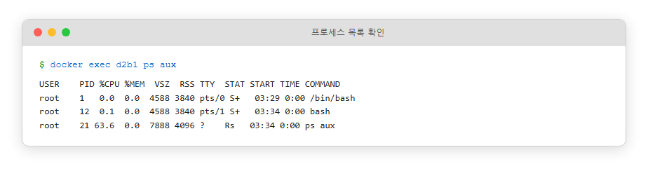

*프로세스 목록 확인*

**PID 1**이 컨테이너의 메인 프로세스이고, **PID 12**가 방금 `exec`로 만들어진 프로세스입니다. 두 프로세스는 같은 컨테이너 안에서 환경을 공유하지만 터미널 세션은 서로 독립입니다. 그래서 `exec`에서 선언한 임시 변수가 메인 프로세스 세션에서는 보이지 않고, 반대도 마찬가지입니다. 

| 방식                        | 동작                                  | 위험성                                          |
| --------------------------- | ------------------------------------- | ----------------------------------------------- |
| `docker attach <ID>`        | **메인 프로세스(PID 1)** 에 직접 연결 | 잘못 빠져나오면 메인이 종료되고 컨테이너도 꺼짐 |
| `docker exec -it <ID> bash` | **새 프로세스**를 만들어 접근         | 안전. 빠져나와도 메인에 영향 없음               |

*'attach는 메인, exec는 새 방. 앞으로는 exec만.'*

여기까지 오니 컨테이너가 언제 살아 있고 언제 꺼지는지는 손에 잡혔습니다. 그런데 한 가지가 오픈이를 붙잡았습니다. 앞서 Ubuntu 컨테이너에 패키지를 설치하고 파일을 추가했는데, 컨테이너를 내리는 순간 지금까지 한 작업이 사라집니다.

*내가 수정한 이 상태를 기록해두려면 어떻게 해야 하지?*

필요한 건 **지금 컨테이너 상태를 그대로 기록해 두는 방법**입니다.

## 2.8 commit으로 이미지 만들기

그 일을 하는 명령이 `docker commit`입니다. 컨테이너의 현재 상태를 그대로 이미지로 저장합니다.

지금까지 오픈이는 남이 올려둔 이미지(ubuntu, nginx, tomcat)를 Docker Hub에서 받아 쓰기만 했습니다. 이번엔 반대로, 직접 수정한 컨테이너를 이미지로 만들어 Docker Hub에 올립니다. 다른 컴퓨터에서도 이 이미지 받으면 같은 상태로 쓸 수 있습니다.

### 2.8.1 Tomcat으로 commit 감 잡기

오픈이는 나만의 이미지를 만들기 위해 Tomcat 이미지를 받아 컨테이너를 실행했습니다.

```bash
docker run -d -p 8080:8080 tomcat
```

실행 후 브라우저에서 **localhost:8080** 으로 접속했더니 **404**가 떴습니다.

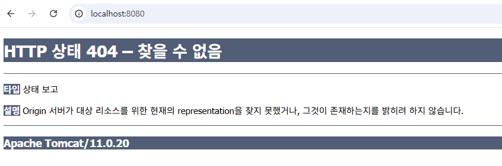

*Tomcat 404 에러 화면*

*'연결은 된 거 같은데 왜 404 에러가 뜨지?'*

Docker Hub에서 내려받은 Tomcat 이미지에는 `webapps/ROOT/index.html` 파일이 없기 때문입니다.

오픈이는 이 경로에 index.html을 작성해보기로 했습니다.

```bash
docker exec -it <컨테이너ID> bash      # 실행 중인 컨테이너 안으로 들어가기
cd /usr/local/tomcat/webapps           # Tomcat의 웹앱 기본 경로로 이동
mkdir ROOT && cd ROOT                  # ROOT 폴더 생성 후 그 안으로 이동
apt update && apt install -y vim       # 패키지 목록 갱신 후 vim 편집기 설치
vim index.html                         # index.html 파일을 만들고 간단한 HTML 작성 후 저장
```

vim 패키지로 index.html 저장을 마치고 **localhost:8080** 로 다시 접속했더니 방금 만든 페이지가 404 자리에 떠 있었습니다.


*index.html 응답 확인*

아래 명령어로 현재 상태를 기록합니다.

```bash
docker commit <컨테이너ID> <본인-dockerhub-id>/tomcat   # 현재 컨테이너 상태를 새 이미지로 저장
```

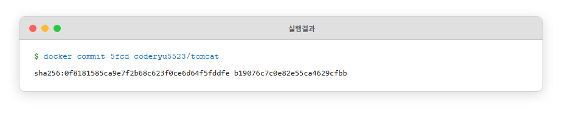

*이미지 커밋 완료 화면*

저장된 이미지가 목록에 잘 들어갔는지 확인했습니다.

```bash
docker images   # 로컬에 저장된 이미지 목록 확인
```

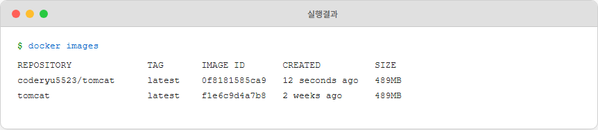

*로컬 이미지 목록에 새 이미지 추가 확인*

index.html이 포함된 `coderyu5523/tomcat` 이미지를 목록에서 확인할 수 있습니다.

### 2.8.2 Docker Hub에 올려 어디서든 꺼내 쓰기

오픈이가 저장한 이미지는 로컬에만 있었습니다. 이 이미지를 Docker Hub에 올려두면 다른 PC나 서버에서 `docker pull`로 받아 쓸 수 있습니다. 

```bash
docker login                                   # Docker Hub 로그인
docker push <본인-dockerhub-id>/tomcat         # 로컬 이미지를 Hub로 업로드
```

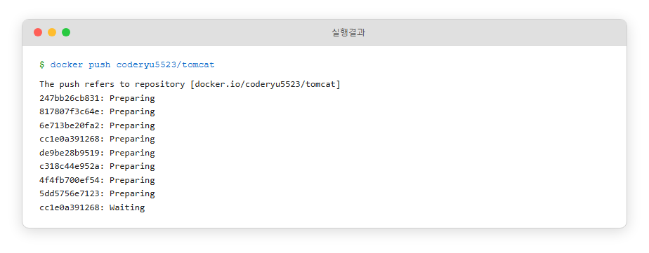

*docker push 실행 결과*

업로드가 완료된 뒤 Docker Hub의 Repositories 탭을 열어보니 방금 올린 이미지가 그대로 있었습니다.

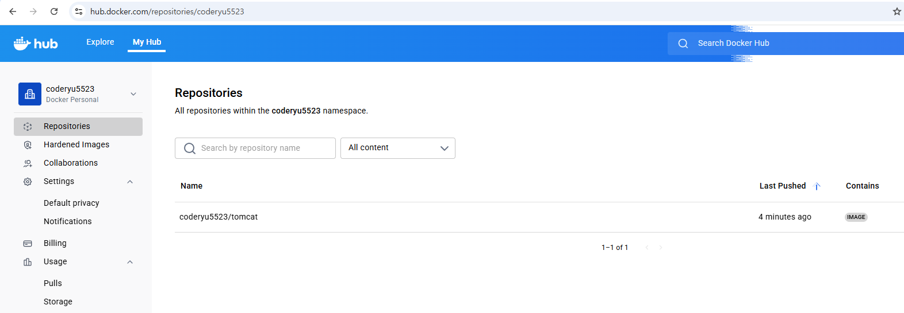

*Docker Hub 저장소 확인*

여기까지의 흐름은 간단합니다. 베이스 이미지에서 컨테이너를 띄워 필요한 설정을 추가하고, 그 상태를 `commit`으로 이미지에 저장해 Hub에 `push`했습니다. 세팅한 상태를 통째로 복제해서 어디서든 꺼내 쓸 수 있다는 이미지의 성질이 이 흐름에 그대로 들어 있습니다.

다만 오늘 실습은 index.html 한 줄 수준입니다. 런타임·라이브러리·경로까지 이미지에 제대로 담는 방법은 뒤에서 다시 다룹니다.

## 2.9 데이터 보존: 마운트

Docker Hub에 이미지를 올리고 한숨 돌리려던 오픈이 머릿속에 한 가지가 걸렸습니다. 이미지에 담긴 건 컨테이너의 초기 상태까지입니다. 컨테이너가 뜬 뒤에 쌓이는 데이터는 이미지 안에 없고, 컨테이너와 함께 사라집니다. DB처럼 실데이터를 계속 쌓는 컨테이너가 내려가는 순간 그 데이터가 통째로 날아갑니다.

*'컨테이너를 내려도 데이터는 남아 있어야 하는데.'*

해결은 데이터를 컨테이너 바깥에 두는 것이었습니다. 그 방법이 **마운트**입니다.

> **참고: 마운트(Mount)**
> 컨테이너 내부의 폴더를 외부 저장소에 **연결**하는 기능입니다. USB를 PC에 꽂으면 PC의 특정 폴더에서 USB 내용이 보이는 것과 같은 원리입니다. 양쪽이 같은 곳을 가리키므로 한쪽의 변경이 반대쪽에도 보이고, 컨테이너를 삭제해도 외부 데이터는 남습니다.

Docker는 두 가지 마운트를 지원합니다.

### 2.9.1 바인드 마운트: 호스트 폴더와 직접 연결

오픈이가 먼저 해본 방식은 호스트 PC의 특정 폴더와 컨테이너 안의 특정 경로를 **같은 곳을 가리키도록 묶어 두는** 것이었습니다. 파일이 양쪽에 복사되는 게 아니라, 한쪽에서 쓴 내용이 같은 실체를 바라보는 반대쪽에도 그대로 보입니다.

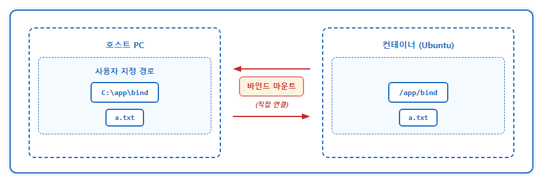

*호스트 폴더와 컨테이너 경로가 같은 데이터를 바라보도록 묶인 상태*

오픈이는 호스트에 폴더를 하나 만들고, 컨테이너 안의 경로와 직접 연결했습니다.

```bash
# macOS / Linux
mkdir -p ~/app/bind
docker run -it --mount type=bind,src=$HOME/app/bind,dst=/app/bind ubuntu
```

Windows(Git Bash/WSL)에서는 `/c/app/bind` 같은 경로를 `src`로 써주면 됩니다.

컨테이너 안에서 `/app/bind/a.txt`를 `touch`로 만들고, 호스트의 `~/app/bind`를 봤습니다.

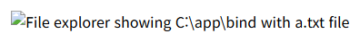

*호스트 PC에서 같은 파일이 보이는 것을 확인*

같은 파일이 양쪽에 있었습니다. 호스트에서 소스 코드를 고치면 컨테이너에 바로 반영되는 구조라, 개발할 때 쓰기 딱 맞는 방식입니다.

### 2.9.2 볼륨 마운트: Docker가 관리하는 저장소

바인드 마운트를 써본 오픈이에게 한 가지가 걸렸습니다. 호스트의 어느 폴더를 쓸지, 경로를 어떻게 정리해둘지 사용자가 직접 관리해야 한다는 점입니다. 이 일을 Docker에 맡길 수는 없을까.

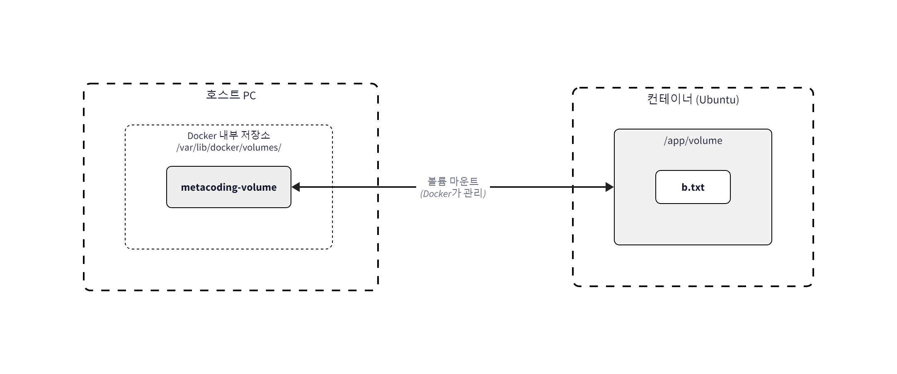

*Docker 엔진이 관리하는 내부 저장 공간에 데이터가 저장되는 구조*

두 번째 방식이 그 역할을 합니다. Docker 엔진이 자기 안에 별도 저장 공간을 두고, 사용자는 볼륨에 이름만 붙여 컨테이너와 연결합니다. 실제 저장 위치는 Docker가 맡아서 관리합니다.

오픈이는 `metacoding-volume`이라는 이름으로 볼륨을 하나 만들면서 ubuntu 컨테이너를 띄웠습니다. 존재하지 않는 볼륨 이름을 주면 Docker가 자동으로 만들어 줍니다.

```bash
docker run -it --mount type=volume,src=metacoding-volume,dst=/app/volume ubuntu   # 볼륨 마운트로 ubuntu 실행
```

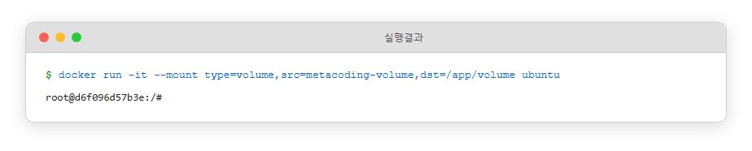

*볼륨 마운트로 ubuntu 실행*

컨테이너 안에 들어가자 `/app/volume` 폴더가 자동으로 생성돼 있었습니다.

> **참고: 볼륨 마운트 vs 바인드 마운트의 초기 처리**
> 볼륨 마운트는 컨테이너 내부 폴더에 이미 파일이 있다면 그 파일을 새 볼륨으로 복사해 보존해 줍니다. 반면 바인드 마운트는 호스트 폴더 내용으로 내부를 완전히 덮어버리므로 기존 파일이 사라질 수 있습니다.

오픈이는 이 폴더에 빈 파일을 하나 만들고, 컨테이너를 빠져나와 볼륨이 그대로 남아 있는지 확인했습니다.

```bash
touch /app/volume/b.txt   # 볼륨 안에 빈 파일 생성
exit                      # 컨테이너 종료
docker volume ls          # 볼륨 목록 재확인
```

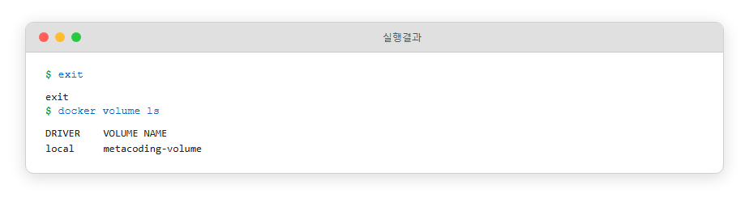

*컨테이너가 사라져도 볼륨은 유지*

컨테이너는 사라졌지만 볼륨은 목록에 그대로 남아 있었습니다. 이어서 같은 볼륨을 연결해 새 컨테이너를 다시 띄웠습니다.

```bash
docker run -it --mount type=volume,src=metacoding-volume,dst=/app/volume ubuntu   # 같은 볼륨으로 새 컨테이너 실행
ls /app/volume
```

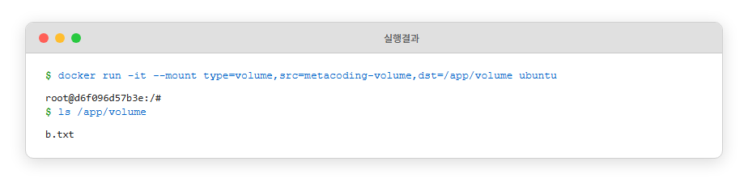

*볼륨 데이터 재사용*

방금 전에 만들었던 `b.txt`가 새 컨테이너 안에서도 그대로 보였습니다. 볼륨이 컨테이너와 독립적으로 유지되기 때문입니다. 

### 2.9.3 둘의 선택 기준

| 구분      | 바인드 마운트          | 볼륨 마운트      |
| --------- | ---------------------- | ---------------- |
| 저장 위치 | 호스트 PC 지정 폴더    | Docker 엔진 내부 |
| 관리 주체 | 사용자 직접            | Docker 엔진      |
| 주 사용처 | 개발 중 소스 코드 연결 | DB 데이터 보존   |

개발 중 소스 코드 연동에는 **바인드**, DB 데이터 같은 영구 보존 대상은 **볼륨**입니다.

## 이것만은 기억하자

- **컨테이너는 격리된 프로세스입니다.** 파일시스템·네트워크·프로세스 공간만 따로 쪼개고, 커널은 호스트와 공유합니다. VM보다 가볍고 빨리 뜹니다.
- **이미지는 설계도, 컨테이너는 찍혀 나온 결과입니다.** 붕어빵 틀 하나로 여러 붕어빵을 찍듯, 이미지 하나로 여러 컨테이너를 찍어냅니다.
- **네트워크의 큰 그림은 푸드코트입니다.** 식당(Namespace) + 창구(veth) + 홀(docker0)이 컨테이너 간 통신, 입구 키오스크가 포트포워딩, 홀의 안내 지도가 Docker DNS.
- **메인 프로세스가 살아 있어야 컨테이너가 살아 있습니다.** 이미지의 CMD에 앱 실행 명령을 지정해두는 이유가 여기에 있습니다.
- **데이터 보존은 마운트로 합니다.** 개발 중 파일은 바인드, 영구 데이터는 볼륨.

오픈이가 Docker라는 이름을 처음 들은 건 불과 몇 시간 전이었습니다. 지금은 컨테이너로 앱을 돌리고 이미지로 같은 환경을 어디서든 다시 띄운다는 큰 그림이 손에 잡혔습니다.

오픈이는 노트를 훑어보고 노트북 뚜껑을 닫았습니다. 책상 위엔 식은 커피 잔이 남아 있었습니다. 오늘 저녁은 이 정도면 충분했습니다.

하지만 앞으로 해결해야 할 과제도 남아 있습니다. 매번 컨테이너에 접속해 수동으로 설정을 변경하고 commit 명령어로 이미지를 기록하는 방식은 비효율적입니다. 나아가 여러 개의 컨테이너를 동시에 실행하고 관리해야 하는 상황도 곧 마주하게 될 것입니다.
