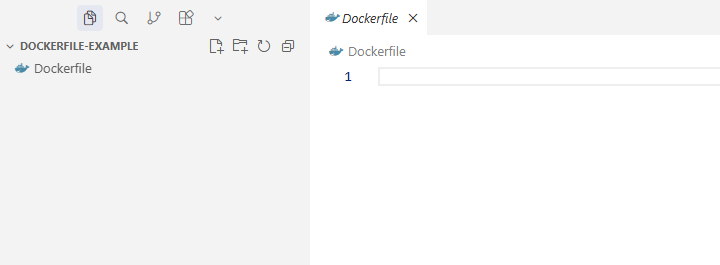
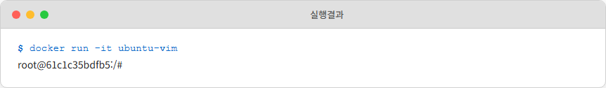
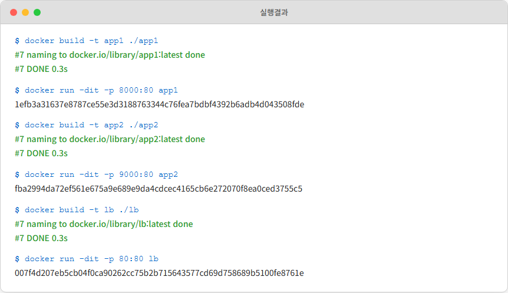
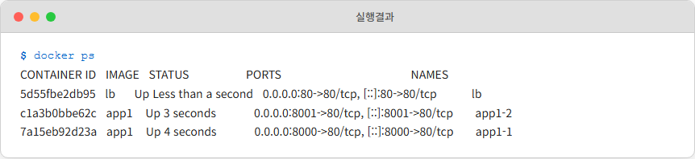
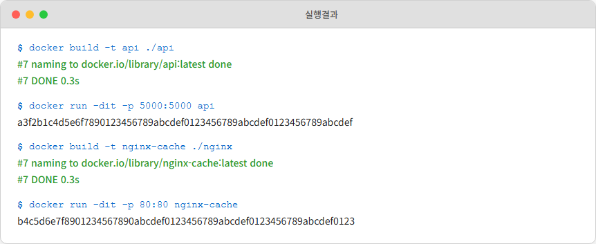
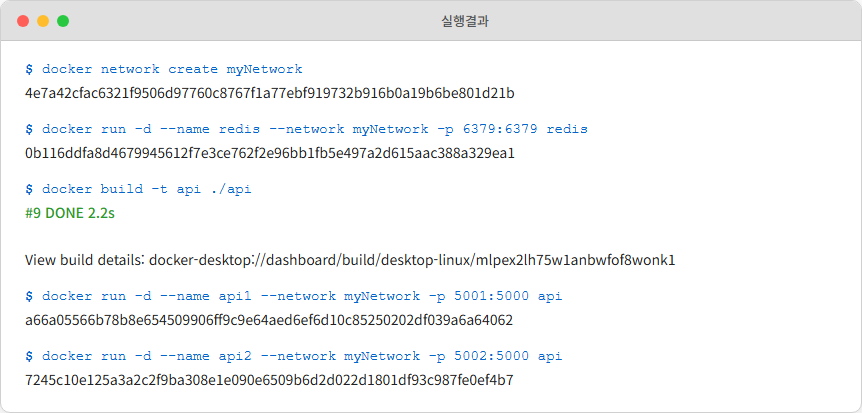
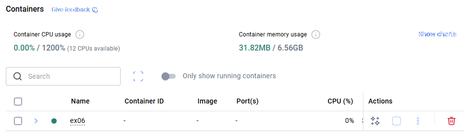
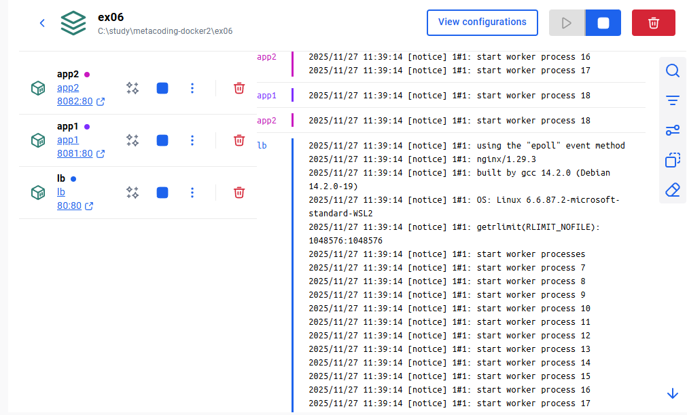

# Ch.3 Docker 다루기

챕터 2에서 오픈이는 컨테이너 하나를 띄우고, 안으로 들어가 보고, 이미지를 구워 Docker Hub에 올리는 데까지 왔습니다. 그것으로 충분할 줄 알았는데, 회사의 진짜 서비스는 컨테이너 하나로 끝나지 않았습니다. 결제 서비스만 해도 프론트, 백엔드 API, 세션 저장소, 데이터베이스가 각자 돌아야 했습니다. 오픈이는 컨테이너 하나에서 여러 개로 넘어가는 길에 서 있었습니다.

## 3.1 프로비저닝 : 환경을 자동으로 구성하다

오픈이는 챕터 2에서 Tomcat 컨테이너에 들어가 `apt update`를 치고 vim을 깔고 index.html을 만든 뒤 `docker commit`으로 이미지를 구웠습니다. 한 번은 재미있었습니다. 두 번째에는 조금 지쳤습니다. 세 번째에는 타이핑 손가락이 아팠습니다.

*이걸 앞으로 몇 번을 더 해야 하지.*

어떤 날은 apt install 도중에 실수로 패키지명을 틀려서 처음부터 다시 시작했습니다. 어떤 날은 컨테이너를 실수로 지워버려서 그동안 공들인 설치가 날아갔습니다. 컨테이너 안에서 맨손으로 하나씩 치는 방식은 한 번 쓰고 버리는 용도지, 같은 환경을 반복해서 만들어내는 용도는 아니었습니다.

팀장이 모니터를 힐끗 보고 한 마디 건넸습니다.

**팀장**: "요리 배울 때 레시피 안 보고 하면 매번 맛이 다르잖아."

오픈이는 키보드에서 손을 뗐습니다. 레시피 카드. 재료 목록과 순서가 적힌 종이 한 장. 누가 만들어도 같은 맛이 나오는 이유였습니다. 매번 장을 보고 재료를 다듬는 대신, 누가 봐도 똑같은 순서대로 따라만 하면 같은 결과가 나오는 카드. 그런 방법이 컨테이너에도 있을까요.

매번 수동으로 환경을 만드는 번거로움을 해결하기 위해 등장한 개념이 있습니다. 필요한 패키지와 설정을 미리 정의해두고, 컨테이너 환경을 자동으로 구축하는 것을 **프로비저닝(Provisioning)** 이라고 합니다.


*그림 3-1 수동 세팅과 프로비저닝*

> **참고: 프로비저닝(Provisioning)**
> 도커에서 프로비저닝은 컨테이너가 처음 생성될 때 필요한 환경을 자동으로 세팅하는 과정을 의미합니다. 컨테이너가 실행되면 쓸 수 있는 설정, 패키지, 파일 등을 미리 준비하는 작업입니다.

레시피 카드에 적힌 순서대로 요리가 뚝딱 만들어지듯, 프로비저닝을 이용하면 개발 환경을 만드는 수고를 줄일 수 있습니다. 도커에서는 **Dockerfile** 이라는 레시피 카드를 통해 이 자동화 과정을 구현합니다.

### 3.1.1 Dockerfile : 프로비저닝 설계도

> **참고: Dockerfile**
> 컨테이너가 실행될 때 필요한 환경을 자동으로 구성해주는 이미지를 생성하기 위한 스크립트로, 컨테이너를 만들기 위한 설계도입니다.

Dockerfile은 환경을 정의한 **설계도**입니다. 도커는 이 파일을 읽어 **이미지**를 만들고, 이 이미지로 **컨테이너**를 실행합니다.

Dockerfile에서 컨테이너가 실행되기까지 세 단계를 거칩니다.


*그림 3-2 Dockerfile에서 이미지 생성 및 컨테이너 실행 과정*

**1단계 — Dockerfile 작성.** 텍스트 파일에 환경 구성을 적습니다. 베이스 이미지, 설치할 패키지, 복사할 파일, 실행할 명령을 순서대로 기록합니다.

**2단계 — docker build.** Docker 엔진이 Dockerfile을 위에서 아래로 읽으며 각 줄을 실행합니다. 결과물이 **이미지(Image)** 로 저장됩니다. 이미지는 읽기 전용이며 한 번 만들어지면 변하지 않습니다.

**3단계 — docker run.** 이미지를 기반으로 **컨테이너(Container)** 를 생성하고 실행합니다. 하나의 이미지에서 컨테이너를 몇 개든 만들 수 있습니다. 컨테이너를 삭제해도 이미지는 그대로 남아 있으므로 다시 실행하면 동일한 환경이 만들어집니다.

아래는 Dockerfile에서 사용하는 주요 설정입니다.

Dockerfile 주요 설정 구조

```dockerfile
FROM  <베이스 이미지명>

WORKDIR <기준 작업 경로 설정>

COPY <파일을 컨테이너 내부로 복사>

RUN <이미지 빌드 시 실행할 리눅스 명령 (패키지 설치 등)>

ENV <환경 변수 설정>

CMD <컨테이너 시작 시 메인 프로세스에 실행되는 명령어>

ENTRYPOINT <메인 프로세스를 지정하는 명령어>
```

### 3.1.2 Dockerfile : 스크립트 작성

오픈이는 첫 레시피로 vim이 깔린 Ubuntu 이미지를 골랐습니다.

CURSOR IDE에서 `Dockerfile`을 생성합니다. 별도 확장자 없이 파일명만 Dockerfile로 두면 됩니다.



*그림 3-3 Dockerfile 생성 완료*

오픈이가 작성한 `Dockerfile`입니다.

```dockerfile
FROM ubuntu:24.04                      # 베이스 이미지
RUN apt update && apt install -y vim   # vim 패키지 설치
CMD ["/bin/bash"]                      # 컨테이너가 시작될 때 자동으로 실행할 명령
```

Ubuntu 24.04를 기반으로 vim을 설치하고, 컨테이너가 뜰 때 bash를 띄우는 구성입니다.

Dockerfile이 위치한 폴더에서 이미지를 빌드합니다. 오픈이가 친 명령입니다.

```bash
docker build -t ubuntu-vim .       # . 은 현재 경로를 기준으로 Dockerfile을 읽어옴
```


*그림 3-4 docker build 실행 결과*

생성된 이미지를 기반으로 컨테이너를 실행합니다.

```bash
docker run -it ubuntu-vim   # ubuntu-vim 이미지로 컨테이너 실행
```



*그림 3-5 컨테이너 실행 및 접속*

컨테이너 내부 터미널에서 `vim` 명령어를 실행하면 vim 편집 에디터 창이 뜹니다.

```bash
vim a.txt   # a.txt 파일 생성
```


*그림 3-6 vim 에디터 실행 확인*

터미널에 설치 명령어를 적지 않았는데 vim이 바로 됐습니다. Dockerfile에 써둔 설정이 빌드 단계에서 실행됐기 때문입니다. Dockerfile 하나면 컨테이너의 환경을 몇 번이든 똑같이 재현할 수 있습니다.

### 3.1.3 WORKDIR, COPY : 작업 경로와 파일 복사

> **참고: WORKDIR와 COPY**
> **WORKDIR**는 명령어가 실행될 기본 폴더를 지정합니다. 이후에 나오는 모든 작업은 이 폴더를 기준으로 진행됩니다.
> **COPY**는 호스트PC에 있는 파일이나 폴더를 컨테이너 내부로 복사합니다.

Dockerfile이 있는 폴더 안에 **index.html** 파일을 생성합니다. 내용은 비어 있어도 됩니다.


*그림 3-7 폴더 및 파일 구조*

Dockerfile에 **WORKDIR**와 **COPY** 설정을 추가합니다. WORKDIR로 작업 디렉토리를 `/app`으로 지정하고 COPY로 로컬의 파일을 컨테이너로 복사하는 방식입니다.

```dockerfile
FROM ubuntu:24.04                      # 베이스 이미지
WORKDIR /app                           # 작업 경로를 /app으로 설정
COPY ./index.html ./index.html         # 호스트의 index.html을 컨테이너 /app/index.html로 복사
RUN apt update && apt install -y vim   # vim 패키지 설치
CMD ["/bin/bash"]                      # 컨테이너가 시작될 때 자동으로 실행할 명령
```

COPY의 첫 번째 경로(`./index.html`)는 **호스트의 Dockerfile 위치 기준**, 두 번째 경로(`./index.html`)는 **컨테이너 내부의 WORKDIR 기준**입니다. 상대 경로지만 기준이 서로 다른 점이 포인트입니다. WORKDIR 덕에 컨테이너 접속 시 기본 경로가 `/app`이고, COPY가 그 안에 index.html을 꽂아 넣습니다.

이미지를 빌드합니다.

```bash
docker build -t ubuntu-html .    # . 은 현재 경로를 기준으로 Dockerfile을 읽어옴
```

컨테이너를 실행하면 터미널이 `/app`으로 떨어지고 `index.html`이 보입니다.

```bash
docker run -it ubuntu-html   # ubuntu-html 이미지로 컨테이너 실행
ls
```


*그림 3-8 실행 결과 확인*

확인이 끝나면 **exit** 명령어로 컨테이너에서 빠져나옵니다.

### 3.1.4 CMD, ENTRYPOINT : 기본 명령과 고정 명령

CMD와 ENTRYPOINT는 컨테이너가 시작될 때 무엇을 실행할지 결정하지만, 성격은 조금 다릅니다.

식당에 비유하면 CMD는 **기본 메뉴**와 같습니다. 주방에서 미리 정해둔 메뉴가 있지만 손님이 원하면 다른 메뉴로 바꿀 수 있습니다. 반면 ENTRYPOINT는 **수저와 물** 같은 기본 세팅입니다. 어떤 메뉴를 주문하든 반드시 준비되어야 하는 필수 요소입니다.

> **참고: CMD**
> 컨테이너가 시작될 때 실행할 **기본 명령** 을 지정합니다. docker run 명령 뒤에 별도의 명령어를 입력하면 CMD에 설정된 내용은 무시되고 입력한 명령이 우선 실행됩니다.
>
> **참고: ENTRYPOINT**
> 컨테이너가 시작될 때 **반드시 실행되어야** 하는 메인 프로세스를 지정합니다. 외부에서 어떤 옵션을 주더라도 이 프로세스는 바뀌지 않고 실행됩니다.

Dockerfile에 **ENTRYPOINT**를 추가해 echo 명령으로 메시지를 출력하는 구성을 만듭니다.

```dockerfile
FROM ubuntu:24.04                      # 베이스 이미지
WORKDIR /app                           # 작업 경로를 /app으로 설정
COPY ./index.html ./index.html         # 로컬의 index.html을 컨테이너의 /app으로 복사
RUN apt update && apt install -y vim   # vim 패키지 설치
CMD ["/bin/bash"]                      # ENTRYPOINT 뒤에 붙어서 실행됨
ENTRYPOINT ["echo", "컨테이너 실행"]     # 컨테이너 시작 시 실행되는 명령
```

ENTRYPOINT와 CMD를 같이 쓰면 둘은 하나로 합쳐져 실행됩니다.

이미지를 빌드해 실행해 봤습니다.

```bash
docker build -t ubuntu-entry .         # 이미지 생성
docker run -it ubuntu-entry            # 컨테이너 실행
```


*그림 3-9 ENTRYPOINT 실행 결과*

결과를 보면 **컨테이너 실행 /bin/bash**라는 문자열이 출력되고 프로세스가 즉시 종료됩니다. 왜 그럴까요.

ENTRYPOINT가 있으면 CMD는 독립적으로 실행되지 않고, ENTRYPOINT 뒤에 붙어서 함께 실행됩니다. 즉 **echo "컨테이너 실행"** + **/bin/bash** 가 합쳐져 **echo "컨테이너 실행" /bin/bash** 가 된 셈입니다.

**echo** 는 뒤에 오는 내용을 그대로 출력하고 끝나는 명령이라, "컨테이너 실행 /bin/bash"라는 글자만 화면에 찍고 종료됩니다. 메인 프로세스가 끝났으니 컨테이너도 즉시 꺼집니다.

오픈이는 이 조합이 실무에서 어떻게 쓰이는지가 더 궁금했습니다. echo 한 줄로는 감이 잘 안 왔습니다. 평소에 손에 익은 Spring Boot 서버로 바꿔 생각해 보면 그림이 선명해졌습니다.

```dockerfile
# 실무 예 — Spring Boot 앱을 띄울 때
ENTRYPOINT ["java", "-jar"]    # 이 프로세스는 무슨 일이 있어도 고정
CMD ["app.jar"]                # 기본 JAR 이름, 필요하면 바꿀 수 있음
```

컨테이너가 시작되면 `java -jar app.jar`가 실행됩니다. 운영 중에 다른 JAR로 올리고 싶다면 이렇게 치면 됩니다.

```bash
docker run <이미지> other.jar
```

이 경우 ENTRYPOINT(`java -jar`)는 그대로 남고 CMD(`app.jar`)만 `other.jar`로 대체돼 `java -jar other.jar`가 실행됩니다. "자바 실행"이라는 뼈대는 움직이지 않고 어떤 JAR를 띄울지만 바꾸는 구조입니다. ENTRYPOINT는 골격, CMD는 인자라고 보면 감이 맞습니다.

## 3.2 NGINX : 웹 서버와 리버스 프록시

오픈이가 결제 API 한 대를 띄운 지 일주일이 지났을 때 팀장이 자리로 왔습니다.

**팀장**: "다음 주 타임세일이야. 결제 API 한 대로 버틸 수 있을까."

오픈이는 계산을 돌려봤습니다. 평상시 초당 50건이 오는 결제 요청이 타임세일엔 500건까지 올라갑니다. 한 대가 받아낼 수 없는 숫자였습니다. 결제 컨테이너 몇 개를 더 띄우는 건 `docker run` 몇 번이면 될 일이었습니다. 문제는 그 뒤였습니다.

사용자는 `pay.example.com` 주소 하나만 알고 있었습니다. 결제 컨테이너를 세 개 띄우면 IP가 세 개가 생깁니다. 사용자에게 "오늘은 1번 서버로 오세요, 내일은 2번으로 오세요"라고 말할 수는 없었습니다.

*어딘가에 창구가 하나 있고, 그 창구가 알아서 뒤의 서버로 나눠줘야 하는데.*

챕터 2에서 가볍게 띄워본 NGINX가 바로 그 창구 역할을 한다는 이야기가 어렴풋이 떠올랐습니다.

용어부터 정리하고 가겠습니다. NGINX가 맡는 역할의 이름이 익숙한 단어일 수도 있고 낯선 단어일 수도 있습니다.

> **참고: 프록시(Proxy)와 리버스 프록시(Reverse Proxy)**
> **프록시**는 클라이언트의 요청을 대신 전달하는 중간자입니다. 예컨대 회사 네트워크에서 외부 사이트로 나갈 때 중간에서 요청을 모아 대신 보내주는 서버가 프록시입니다. 방향은 "내부 → 외부".
> **리버스 프록시**는 반대편 서버 쪽에 서서 외부에서 들어오는 요청을 받아 내부의 실제 서버로 전달합니다. 방향은 "외부 → 내부". 사용자는 리버스 프록시의 주소만 알면 되고, 뒤에 실제 서버가 몇 대 있는지는 몰라도 됩니다.
> NGINX는 이 중 **리버스 프록시** 역할을 맡습니다.

> **참고: NGINX**
> 웹 서버이자 요청을 중계하는 리버스 프록시 서버입니다. 이미지나 HTML 같은 파일을 빠르게 처리하고, 사용자의 요청을 백엔드 서버로 연결해 주는 역할을 합니다. 로드밸런싱, 보안(HTTPS) 처리, 캐싱 기능을 모두 갖추고 있어 대규모 서비스를 운영할 때 필수적으로 사용됩니다.

NGINX는 백엔드 서버 앞을 지키는 대리인 역할을 합니다. 사용자의 요청을 서버가 직접 받지 않고 NGINX가 중간에서 대신 받아 전달합니다. 이 과정에서 실제 서버의 주소를 숨겨 보안을 높이고, 들어오는 요청을 여러 서버로 나누어 보내는 로드밸런싱을 수행합니다.


*그림 3-10 NGINX의 주요 기능*

또 요청이 올 때마다 매번 새로운 프로세스를 만드는 대신, 적은 수의 프로세스로 수많은 요청을 번갈아 처리합니다. 한 명의 직원이 여러 테이블을 동시에 응대하는 것과 비슷해서, 많은 사용자가 동시에 접속해도 메모리 낭비가 적고 속도가 빠릅니다.

### 3.2.1 NGINX의 기본 문법 : upstream, location, proxy_pass

오픈이가 `nginx.conf`를 처음 열었을 때 낯선 단어들이 줄줄이 나왔습니다. `upstream`, `location`, `proxy_pass`. 단어를 한참 노려봤지만 그림이 안 그려졌습니다. 선배가 커피를 리필하러 가다가 모니터를 보고 멈췄습니다.

**선배**: "배달 앱 주문 생각해봐. 주문은 한 곳에서 받고, 요리는 지정된 가게에서, 전달은 라이더가 해."

오픈이는 그 세 단계가 `nginx.conf`의 세 지시어와 겹치는 순간을 포착했습니다.

- **upstream** — 요청을 실제로 처리할 서버 그룹에 이름을 붙이는 곳. "A식당"이라는 간판을 정하는 단계입니다.
- **location** — 어떤 URL 경로로 들어온 요청을 잡을지 정하는 곳. "짜장면 주문이 들어오면"이라는 조건입니다.
- **proxy_pass** — 그 요청을 어느 upstream으로 보낼지 지정하는 곳. "A식당으로 배달"이라는 전달 지시입니다.

세 지시어를 가장 단순한 구성으로 써보면 이렇습니다. 백엔드 서버 한 대 앞에 NGINX만 세운 구조입니다.

가장 단순한 nginx.conf입니다.

```nginx
upstream backend {                           # backend라는 이름으로 목적지 서버 그룹 등록
    server host.docker.internal:8080;        # 이 그룹에 속한 실제 서버 주소
}

server {
    listen 80;                               # 80번 포트로 들어오는 요청을 받음
    server_name localhost;

    location / {                             # 모든 경로(/) 요청에 대해
        proxy_pass http://backend;           # backend upstream으로 전달
    }
}
```

비유와 코드를 1:1로 엮어 읽으면 순서가 보입니다. 요청 하나가 들어왔을 때 NGINX가 실제로 밟는 단계입니다.

1. **listen 80** — 80번 포트로 요청이 들어오기를 기다립니다. "간판 달고 문 열고 대기".
2. **location /** — 들어온 요청의 URL 경로를 확인해 조건에 맞는 블록을 찾습니다. "어떤 주문인지 분류".
3. **proxy_pass http://backend** — 매칭된 요청을 `backend`라는 이름으로 넘깁니다. "A식당으로 배달 지시".
4. **upstream backend { server ... }** — `backend`라는 이름이 실제로 어느 주소인지 그 자리에서 해석됩니다. "A식당 주소록 조회".

이 네 단계가 NGINX 설정의 뼈대입니다. 이후에 등장하는 로드밸런싱, 경로별 라우팅, 캐싱은 전부 이 뼈대 위에 옵션이 붙는 형태입니다.

### 3.2.2 세 예제 한눈에 보기

오픈이가 당장 쥔 문제는 "한 URL을 여러 서버로 뿌려라"였지만, 실제 NGINX 설정에서 마주치는 패턴은 그것만이 아니었습니다. 경로별로 다른 서비스로 보내야 할 때도 있고, 자주 요청되는 파일은 앞에서 끊어주고 싶을 때도 있었습니다. 이 세 가지 상황을 각각 하나의 예제로 묶어두면 어떤 `nginx.conf`를 만나도 해석이 편해집니다.

EX01, EX02, EX03 세 예제가 차례로 등장합니다. 모양은 비슷해 보이지만 달라지는 자리가 정확히 정해져 있습니다. 먼저 "무엇이 달라지는지"를 한 표로 잡고 들어가면 뒤에서 코드를 봤을 때 어디에 눈을 둘지 바로 보입니다.

| 예제 | 주제 | 달라지는 자리 | 한 줄 차이 |
|------|------|--------------|-----------|
| EX01 | 경로 기반 라우팅 | `upstream` 2개 + `location` 2개 | URL 경로(`/app1`, `/app2`)로 서로 다른 서비스로 분배 |
| EX02 | 라운드 로빈 로드밸런싱 | **한 `upstream` 안에 `server` 2줄** | 같은 서비스를 여러 대로 복제, NGINX가 번갈아 전달 |
| EX03 | 캐싱 | `proxy_cache_path` + `location`에 `proxy_cache` | 자주 조회되는 파일을 NGINX 앞단에 보관 |

세 예제 모두 3.2.1의 뼈대(`upstream` / `location` / `proxy_pass`)는 그대로 두고, 그 위에 작은 변형만 얹습니다. EX01은 **두 세트로 복제**, EX02는 **upstream 한 개 안에 server를 2줄로 추가**, EX03은 **캐시 옵션 추가**. 이게 세 예제의 구조 차이 전부입니다.

첫 예제인 EX01은 파일 구성부터 실행까지 전 과정을 따라갑니다. 뒤이어 오는 EX02와 EX03은 "EX01에서 이 자리가 이렇게 바뀌었다" 정도로 차이 나는 지점만 짚습니다. 같은 패턴을 세 번 반복해서 쓰는 대신, **처음 한 번은 전체 흐름**, 나머지 두 번은 **변경점만** 봅니다.

### 3.2.3 EX01 경로 기반 라우팅 : URL로 요청을 나누다

오픈이가 다음으로 부딪힌 상황은 백엔드가 여러 개일 때였습니다. 회원 정보를 처리하는 서버와 상품 정보를 처리하는 서버가 따로 있었습니다. 사용자가 `/users`를 치면 앞 서버로, `/products`를 치면 뒷 서버로 가야 했습니다. 3.2.1의 뼈대를 살짝 늘리면 됐습니다. upstream 하나를 더 만들고 location을 하나 더 여는 겁니다.

> **참고: 경로 기반 라우팅**
> 클라이언트가 요청한 URL 경로를 기준으로 해당 서버나 서비스로 트래픽을 전달하는 방식입니다.

아래 그림처럼 클라이언트가 `/users`, `/products` 경로로 API 요청을 보내면 NGINX는 그 경로에 매핑된 서버로 요청을 전달합니다.


*그림 3-11 경로 기반 라우팅 구조*

#### 실습해보기

> 실습 코드는 https://github.com/metacoding-10-linux-docker/docker/tree/master/ex01 에서 확인할 수 있습니다.

app1, app2, lb 폴더에 있는 Dockerfile은 개별 이미지를 생성하며, 각각 독립적인 컨테이너로 실행됩니다.

**[EX01 패키지 구조]**

```
ex01/
├── app1/                # 첫 번째 웹 서버
│   ├── Dockerfile
│   └── index.html
├── app2/                # 두 번째 웹 서버
│   ├── Dockerfile
│   └── index.html
└── lb/                  # 로드밸런서 (NGINX)
    ├── Dockerfile
    └── nginx.conf       # 라우팅 설정
```

#### app 이미지

app1과 app2는 nginx 이미지를 기반으로 각각의 index.html을 복사하여 서버를 구성합니다.

| 파일 | 설명 |
|------|------|
| `app1/Dockerfile`, `app2/Dockerfile` | nginx 이미지 기반, index.html 복사 후 포그라운드 실행 |
| `app1/index.html`, `app2/index.html` | 각 서버를 구분하는 HTML (Server1, Server2) |

#### lb 이미지

lb 폴더의 Dockerfile은 로컬에 있는 nginx.conf를 컨테이너 내부로 복사하여 이미지를 생성합니다.

**ex01/lb/Dockerfile**
```dockerfile
FROM nginx                                          # NGINX 이미지 사용
COPY nginx.conf /etc/nginx/conf.d/default.conf      # 로컬의 nginx.conf를 컨테이너의 NGINX 설정 경로로 복사
ENTRYPOINT ["nginx", "-g", "daemon off;"]            # NGINX를 포그라운드로 실행
```

nginx.conf 파일은 다음과 같습니다. 3.2.1에서 본 뼈대가 upstream 두 개, location 두 개로 확장된 모양입니다.

**ex01/lb/nginx.conf**
```nginx
upstream app1 {                           # 요청을 전달할 목적지를 app1이라는 이름으로 등록
    server host.docker.internal:8000;     # 이 그룹에 속한 서버 (여러 개 등록하면 자동 분산)
}

upstream app2 {                           # "app2" 서버 그룹
    server host.docker.internal:9000;
}

server {
    listen 80;
    server_name localhost;

    location /app1 {                  # /app1 경로 요청을 잡아서
        proxy_pass http://app1/;      # proxy_pass에 등록된 서버로 전달. 서버 주소나 업스트림 이름을 넣음
    }

    location /app2 {
        proxy_pass http://app2/;
    }
}
```

핵심은 세 가지 지시어의 연결입니다.

| 설정 | 역할 | 예시에서 하는 일 |
|------|------|-----------------|
| `location` | URL 경로에 따라 요청을 분기 | `/app1` 경로로 들어온 요청을 `proxy_pass`로 넘김 |
| `proxy_pass` | 요청을 다른 서버로 전달 | `http://app1/` — upstream app1으로 요청을 보냄 |
| `upstream` | 실제 서버 주소에 이름을 붙임 | `app1`이라는 이름에 `host.docker.internal:8000`을 등록 |

`/app1`로 요청이 들어오면 → `location`이 받아서 → `proxy_pass`를 통해 → `upstream`에 등록된 `host.docker.internal:8000`으로 전달됩니다.

오픈이가 이 설정으로 세 컨테이너를 순차적으로 띄웠습니다.

```bash
#서버 1 실행
docker build -t app1 ./app1       # app1 이미지 빌드
docker run -dit -p 8000:80 app1   # NGINX가 host.docker.internal:8000으로 접근하므로 호스트 8000번 포트를 열어줌

#서버 2 실행
docker build -t app2 ./app2       # app2 이미지 빌드
docker run -dit -p 9000:80 app2   # NGINX가 host.docker.internal:9000으로 접근하므로 호스트 9000번 포트를 열어줌

#lb 실행
docker build -t lb ./lb
docker run -dit -p 80:80 lb
```

Docker Desktop에서 생성된 세 컨테이너가 보입니다.



*그림 3-12 Docker Desktop에서 컨테이너 확인*

브라우저에서 `localhost:80/app1`로 요청을 보내면 `app1` 서버가 응답합니다. URL 주소는 NGINX 설정의 `location`에 설정한 경로입니다.


*그림 3-13 app1 경로 응답 결과*

`localhost:80/app2`로 요청을 보내면 `app2` 서버가 응답합니다.


*그림 3-14 app2 경로 응답 결과*

URL 경로만 바꿨을 뿐인데 서로 다른 서버가 응답했습니다.

#### host.docker.internal

오픈이는 nginx.conf를 다시 읽다가 `host.docker.internal:8000`이 눈에 걸렸습니다. app1 컨테이너로 바로 보내면 될 텐데, 왜 호스트 PC를 한 번 경유할까요.

순서대로 따라가면 이렇게 됩니다.

- lb 컨테이너 안에서 `app1`이라는 이름으로 상대를 부르려고 해도 이름이 해석되지 않습니다.
- 이유는 세 컨테이너가 `docker run`으로 각각 따로 실행됐기 때문입니다. 챕터 2에서 본 것처럼 개별 실행된 컨테이너는 **기본 bridge 네트워크**에 들어가고, 이 네트워크에서는 컨테이너 이름으로 서로를 찾는 이름 기반 통신이 되지 않습니다.
- 그래서 "호스트 PC를 한 번 거쳐서 가는 우회 경로"를 씁니다. 컨테이너 밖(호스트)의 포트는 이미 `-p 8000:80`으로 app1과 연결돼 있으니, 호스트 포트에 접속하면 결국 app1까지 도달합니다.


*그림 3-15 lb 컨테이너 → 호스트 PC → app1 컨테이너*

> **참고: host.docker.internal**
> 컨테이너 내부에서 "호스트 PC"를 가리키는 특수 주소입니다. 컨테이너 안에서 localhost라고 하면 호스트 PC가 아니라 컨테이너 자기 자신을 가리킵니다. 따라서 호스트 PC의 포트에 접속하려면 이 주소를 써야 합니다.
>
> **Linux 사용자 주의**: `host.docker.internal`은 Docker Desktop(Windows/macOS) 환경에서 기본으로 지원되는 주소입니다. Linux에서는 기본으로 해석되지 않으며, `--add-host=host.docker.internal:host-gateway` 옵션을 줘야 씁니다. 다만 이 우회 자체가 학습용입니다. 실무에서는 3.3에서 소개하는 **사용자 정의 네트워크**로 컨테이너를 묶어 서비스 이름으로 바로 통신하는 방식을 권장합니다.

정리하면 lb 컨테이너가 `host.docker.internal:8000`으로 요청을 보내면 호스트 PC의 8000번 포트에 도착하고, 이 포트는 포트포워딩(`-p 8000:80`)을 통해 app1 컨테이너와 연결되어 있으므로, 최종적으로 app1이 응답을 돌려줍니다. 지금 이 우회가 번거롭다는 감각이 남았다면 3.3에서 사용자 정의 네트워크로 이걸 치워낼 겁니다.

### 3.2.4 EX02 라운드 로빈 : 같은 서비스를 여러 대로

3.2.3에서는 URL 경로별로 요청을 나눴습니다. 오픈이의 타임세일 문제는 조금 달랐습니다. 하나의 URL로 들어오는 요청을 **똑같은 백엔드 여러 대**로 흩어뿌려야 했습니다. 서버는 같은 이미지로 찍어내고, NGINX가 요청을 번갈아 뿌려주는 구성입니다.

이렇게 묶인 서버들에 요청을 배분하는 가장 대표적인 방식이 **라운드 로빈(Round Robin)** 입니다. 놀이공원 매표소에 창구가 세 개 있을 때, 손님을 1번 → 2번 → 3번 창구 순으로 번갈아 안내하는 것과 같습니다. 특정 창구에만 줄이 길어지지 않게 막아주는 구조입니다.


*그림 3-16 라운드 로빈 로드밸런싱 구조*

> 실습 코드는 https://github.com/metacoding-10-linux-docker/docker/tree/master/ex02 에서 확인할 수 있습니다.

#### EX01과 달라지는 부분

폴더 구조와 Dockerfile은 EX01과 거의 같습니다. 달라지는 자리는 두 군데입니다. **app2 폴더가 사라지고**, **`lb/nginx.conf`의 upstream 블록 안에 `server` 줄이 두 개**가 됩니다. 이게 전부입니다.

EX01의 nginx.conf는 "upstream app1 한 개, upstream app2 한 개"였습니다. EX02는 "upstream app1 하나에 server 두 줄"로 바뀝니다. 같은 이름 아래 서버를 두 개 이상 등록하면 NGINX는 별도 설정 없이 **기본으로 라운드 로빈** 방식으로 번갈아 전달합니다.

**ex02/lb/nginx.conf** (달라진 블록만)
```nginx
upstream app1 {                               # app1 서버 그룹 정의
    server host.docker.internal:8000;         # 호스트의 8000번 포트로 연결
    server host.docker.internal:8001;         # 같은 그룹에 두 번째 서버 추가 → 라운드 로빈
}

server {
    listen 80;
    server_name localhost;

    location /app1 {                          # /app1 요청을 upstream으로 전달
        proxy_pass http://app1/;              # 라운드 로빈으로 두 서버에 분배
    }
}
```

`server` 한 줄을 추가했을 뿐인데 NGINX의 동작이 바뀝니다. `/app1`로 들어온 요청이 8000과 8001 포트로 번갈아 전달됩니다.

#### 실행 차이

실행 명령도 EX01과 거의 같고, **한 이미지로 컨테이너를 두 번 띄우는 부분**만 다릅니다.

```bash
# app1 이미지 하나로 컨테이너 2개 실행 (포트만 다르게)
docker build -t app1 ./app1
docker run -dit -p 8000:80 app1   # 서버 1
docker run -dit -p 8001:80 app1   # 서버 2  ← 같은 이미지, 다른 포트

# lb 실행 (동일)
docker build -t lb ./lb
docker run -dit -p 80:80 lb
```



*그림 3-17 라운드 로빈 컨테이너 실행 확인*

브라우저로 `localhost:80/app1`을 반복 요청하면 두 서버가 번갈아 응답합니다.


*그림 3-18 8000 포트 서버 요청*


*그림 3-19 8001 포트 서버 요청*

새로고침할 때마다 두 서버가 교차로 응답하는 게 라운드 로빈의 모습입니다. 이렇게 **"같은 서비스를 복제하고 앞에 NGINX를 세운다"** 가 실무 확장의 가장 흔한 패턴입니다.

### 3.2.5 EX03 캐싱 : 자주 쓰는 파일을 앞에 꺼내두기

타임세일 대비는 그럭저럭 됐는데, 이번엔 다른 불만이 터졌습니다. 상품 상세 페이지의 이미지가 느리다는 동료의 컴플레인이었습니다. 이미지 한 장에 백엔드가 매번 요청을 받고, DB에서 메타정보를 조회하고, 파일을 응답했습니다. 그런데 같은 이미지가 초당 수백 번 요청됐습니다. 매번 같은 일을 반복하는 셈이었습니다.

*자주 쓰는 건 앞에 꺼내두면 되는 거 아닌가.*

자주 입는 옷을 박스에 보관하지 않고 옷걸이에 걸어놓는 것처럼 NGINX의 정적 서버는 HTML, CSS, 이미지 같은 정적 파일을 보관했다가 클라이언트에게 직접 제공합니다.

> **참고: 정적 서버와 캐싱**
> 정적 서버는 한 번 제공한 정적 파일을 일정 기간 저장해 둡니다. 이후 동일한 요청이 오면 서버에 다시 조회하지 않고 저장된 파일을 즉시 반환합니다. 이 저장 과정을 **캐싱(Caching)** 이라고 부릅니다.

캐싱 결과를 확인할 때 두 상태가 번갈아 나오므로 용어를 먼저 정리해 둡니다. **MISS**는 캐시에 저장된 파일이 없어 백엔드까지 요청이 갔다 온 상태, **HIT**은 캐시에 이미 있는 파일을 백엔드 접근 없이 바로 돌려준 상태입니다.


*그림 3-20 첫 번째 요청 (MISS) — 캐시가 비어있어 백엔드 서버에 요청 후 응답을 캐시에 저장*


*그림 3-21 두 번째 요청 (HIT) — 캐시에 저장된 응답을 바로 반환, 백엔드 서버 접근 없음*

> 실습 코드는 https://github.com/metacoding-10-linux-docker/docker/tree/master/ex03 에서 확인할 수 있습니다.

#### EX01과 달라지는 부분

EX03은 구성 자체가 조금 달라집니다. 뒤쪽 서버가 HTML만 반환하던 `app1` 대신, 이미지 파일까지 응답하는 **Flask 기반 API 서버**로 바뀝니다. 실제로 초점을 맞출 자리는 nginx.conf입니다.

```
ex03/
├── api/                 # 백엔드 서버 (Flask)
│   ├── app.py           # API 코드 (/ 와 /image.png 두 개)
│   ├── Dockerfile
│   └── image.png        # 캐싱 테스트용 이미지
└── nginx/               # NGINX (캐싱 + 프록시)
    ├── Dockerfile
    └── nginx.conf       # 캐싱 설정
```

api의 Dockerfile은 Python 이미지에 Flask를 올리는 단순한 구성이고, app.py에는 `/`와 `/image.png` 두 경로가 있습니다. 전체 코드는 GitHub 레포에서 확인할 수 있습니다.

nginx.conf에서 새로 등장하는 지시어는 두 개입니다. 파일 최상단의 `proxy_cache_path`와 `location` 안의 `proxy_cache`.

**ex03/nginx/nginx.conf** (핵심만)
```nginx
# 새 추가: 캐시 저장 경로와 메모리 공간 이름을 선언
proxy_cache_path /var/cache/nginx keys_zone=my_cache:10m;

server {
    listen 80;

    location / {
        proxy_pass http://host.docker.internal:5000;
        proxy_cache off;                              # 이 경로는 캐시 끔
    }

    location = /image.png {                           # /image.png 요청만
        proxy_pass http://host.docker.internal:5000;
        proxy_cache my_cache;                         # 위에서 선언한 캐시 사용
        proxy_cache_valid 200 1m;                     # 200 응답을 1분 동안 보관
        add_header X-Cache-Status $upstream_cache_status always;  # 응답 헤더에 HIT/MISS 표시
    }
}
```

포인트는 두 가지입니다. `proxy_cache_path`로 **어디에 얼마만큼 보관할지**를 선언해두고, `location`마다 `proxy_cache`로 **이 경로에서 그 캐시를 쓸지 말지**를 결정합니다. EX01/EX02의 뼈대(`upstream` / `location` / `proxy_pass`)는 그대로 살아 있고, 그 위에 캐시 두 줄이 얹힌 모양입니다.

#### 실행 차이

```bash
# api 서버 실행 (Flask — 5000번 포트)
docker build -t api ./api
docker run -dit -p 5000:5000 api

# nginx 실행
docker build -t nginx-cache ./nginx
docker run -dit -p 80:80 nginx-cache
```



*그림 3-22 캐싱 실습 — HTML 응답*

`localhost:80/image.png`로 요청하면 이미지가 응답됩니다.


*그림 3-23 캐싱 실습 — 이미지 응답*

오픈이는 브라우저의 **F12 > Network > Headers** 탭을 열고, 브라우저 자체 캐시가 결과를 흐리지 않도록 Disable cache를 체크했습니다.

Response Headers의 `X-Cache-Status` 값이 처음엔 `MISS`입니다. 캐시에 요청 데이터가 없어 원본 서버까지 다녀온 상태입니다.


*그림 3-24 X-Cache-Status: MISS 확인*

새로고침을 한 번 더 하면 `HIT`으로 바뀝니다. 캐시에 저장된 파일을 서버 요청 없이 그대로 응답한 상태입니다.


*그림 3-25 X-Cache-Status: HIT 확인*

세 예제를 다 보고 나면 `nginx.conf`의 생김새가 크게 달라 보이지 않습니다. 뼈대는 같고, 그 위에 **"upstream 두 세트 / server 두 줄 / 캐시 옵션"** 중 어떤 옷을 입혔는지만 다릅니다.

## 3.3 Redis : 세션 저장소

오픈이는 타임세일을 무사히 넘긴 월요일 아침에 고객센터 티켓을 받았습니다. "결제 중에 갑자기 로그아웃되고 장바구니가 비워집니다." 한 건이었으면 넘겼을 텐데, 그 주에만 열두 건이었습니다.

재현해 봤습니다. 로그인을 하고 장바구니에 상품을 담고 결제 페이지로 넘어가면 정상이었습니다. 그런데 결제 API를 호출하는 순간 로그인이 풀려 있었습니다. 화면을 새로고침하면 어떤 때는 로그인이 유지되고 어떤 때는 풀렸습니다. 패턴을 잡기 어려운 간헐적 오류였습니다.

*뭐지. 내가 한 요청이 서로 다른 서버로 갔나.*

Spring Boot를 써본 적이 있다면 **HttpSession**이라는 이름이 떠오를 겁니다. `session.setAttribute("user", user)`로 값을 넣고 `session.getAttribute("user")`로 꺼내 쓰던 그 객체입니다. 그 세션은 톰캣이 서버 메모리 안에 들고 있는 Map 같은 거였습니다. 서버가 한 대일 때는 이 방식으로 전혀 문제가 없었습니다. 같은 톰캣이 받은 요청이니 같은 Map에서 읽으면 그만이었습니다.

그런데 방금 자기가 손수 만든 구조를 다시 들여다봤습니다. 결제 API 컨테이너 두 대에 NGINX가 라운드 로빈으로 요청을 뿌려주는 구성. 로그인 요청은 1번 서버 톰캣 메모리에 세션을 남기고, 그 다음 결제 요청은 2번 서버로 넘어갔습니다. 2번 서버 톰캣의 메모리에는 세션이 없습니다. HttpSession을 아무리 올바르게 썼어도 서버가 여러 대로 갈라지는 순간, 각 서버의 메모리는 서로의 세션을 모르는 별개의 공간이 됩니다. 로드밸런싱을 붙였더니 그게 세션을 끊어놓은 셈이었습니다.

선배가 뒤에서 한 마디 했습니다.

**선배**: "개인 사물함에 넣지 말고, 사무실 공용 금고에 넣어."

### 3.3.1 세션 : 왜 외부 저장소가 필요한가

**세션(Session)** 은 사용자가 로그인했을 때 서버가 생성하는 임시 기록입니다. "이 사용자는 인증되었습니다"라는 정보를 서버 메모리에 저장해두고, 이후 요청이 올 때마다 이 기록을 확인하며 로그인 상태를 유지합니다. Spring의 HttpSession이 정확히 이 역할을 맡습니다.

문제는 서버가 여러 대일 때 발생합니다. 클라이언트가 로그인을 요청하면 NGINX는 이 요청을 '서버 1'로 전달합니다. 이때 로그인 정보는 오직 '서버 1' 톰캣의 메모리에만 기록됩니다. 다음 요청이 NGINX에 의해 '서버 2'로 전달되면 '서버 2'는 해당 사용자의 세션 정보를 모르기 때문에 다시 로그인을 요구합니다.


*그림 3-26 세션 불일치 — 서버 1에 저장된 세션이 서버 2에는 없어 요청이 실패*

이러한 세션 불일치 문제는 Redis로 해결합니다.

Redis는 여러 서버가 함께 사용하는 **공용 사물함**과 같습니다. 서버 1이 사물함에 데이터를 넣어두면 서버 2도 같은 사물함을 열어 그 데이터를 꺼낼 수 있습니다. 어떤 서버가 요청을 처리하든 동일한 데이터에 접근할 수 있는 구조입니다.

> **참고: 레디스(Redis)**
> 메모리 기반의 데이터베이스로, 관계형 데이터베이스가 아닌 키-값(Key-Value) 구조로 데이터를 저장합니다. 디스크가 아닌 메모리에 저장하기 때문에 속도가 매우 빨라 데이터 캐싱, 세션 저장 등 고성능 처리가 필요한 곳에 주로 사용됩니다.

서버 1이 세션 정보를 자신의 톰캣 메모리가 아닌 외부 저장소인 Redis에 기록하는 방식입니다. 이후 요청이 서버 2로 전달되더라도 서버 2가 Redis를 확인해 동일한 세션 정보를 읽어옵니다. 어떤 서버로 요청이 가든 로그인이 유지됩니다.


*그림 3-27 Redis로 해결 — 세션을 공유 저장소에 보관하여 어떤 서버에서든 조회 가능*

서버 자체에 세션을 저장하는 방식은 서버 대수가 늘어날수록 관리가 매우 까다로워집니다. Redis를 사용하면 세션을 한 곳에서 통합 관리할 수 있습니다. 서버를 무수히 늘리는 확장 단계에서도 세션 공유 문제를 깔끔하게 풀어줍니다.

### 3.3.2 사용자 정의 네트워크 : 컨테이너를 이름으로 부르기

Redis를 실제로 띄우기 전에 한 가지 사전 정리가 필요합니다. Redis 컨테이너와 API 컨테이너가 **서로를 어떻게 부를 것인가**에 관한 이야기입니다.

챕터 2.4에서 이미 예고가 있었습니다. "기본 bridge 네트워크에서는 컨테이너 이름으로 서로를 찾을 수 없다. 다음 챕터에서 `docker network create`로 사용자 정의 네트워크를 만든 뒤부터 이름 기반 통신이 된다." 그 "다음 챕터"가 바로 여기입니다. 3.2에서도 `host.docker.internal`로 호스트 PC를 한 번 경유해야 했던 이유가 동일한 제약 때문이었습니다.

선배가 화이트보드에 사각형 하나를 그리고 그 안에 두 원을 그렸습니다.

**선배**: "같은 네트워크에 들어간 컨테이너끼리는 이름표만 보고 서로 부를 수 있어. 호스트를 거칠 필요가 없어."

사용자 정의 네트워크는 **내가 직접 이름을 지어 만든 사적 네트워크**입니다. Docker에게 "이런 이름의 네트워크를 하나 만들어줘"라고 지시하면 가상 네트워크 하나가 생성되고, 컨테이너를 띄울 때 `--network` 옵션으로 그 네트워크에 집어넣을 수 있습니다. 같은 네트워크에 들어간 컨테이너들끼리는 Docker 내장 DNS가 이름을 IP로 자동 변환해 주므로, 컨테이너 이름을 마치 도메인처럼 써서 바로 통신할 수 있습니다.

> **참고: 사용자 정의 네트워크(User-defined Network)**
> Docker에서 `docker network create`로 사용자가 직접 만드는 bridge 네트워크입니다. 기본 bridge와 달리 **Docker 내장 DNS**가 작동해 같은 네트워크에 속한 컨테이너끼리 **컨테이너 이름을 도메인처럼** 사용해 통신할 수 있습니다. 실무에서는 거의 모든 경우에 사용자 정의 네트워크를 사용합니다.

기본 명령은 세 가지로 충분합니다.

| 명령 | 하는 일 |
|------|--------|
| `docker network create <이름>` | 새 사용자 정의 네트워크 생성 |
| `docker run ... --network <이름>` | 컨테이너를 해당 네트워크에 참여시킨 상태로 실행 |
| `docker network ls` | 현재 Docker에 등록된 네트워크 목록 조회 |

한 번 만들어 보면 감이 잡힙니다. 네트워크 이름을 `myNetwork`라 정하고, 그 안에 redis 컨테이너 한 대를 띄워봅니다.

```bash
# 1. 사용자 정의 네트워크 생성
docker network create myNetwork          # myNetwork라는 이름의 네트워크가 만들어짐

# 2. 네트워크 목록 확인
docker network ls                        # bridge, host, none 외에 myNetwork가 추가로 보임

# 3. Redis 컨테이너를 myNetwork 안에 띄우기
docker run -d --name redis --network myNetwork redis   # 컨테이너 이름도 "redis"로 지정
```

이 상태에서 같은 네트워크에 들어간 다른 컨테이너가 `redis`라는 이름으로 접속을 시도하면, Docker 내장 DNS가 그 이름을 Redis 컨테이너의 내부 IP로 풀어줍니다. 호스트 PC를 경유할 필요가 없습니다.


*그림 3-28 사용자 정의 네트워크 — 같은 네트워크 안의 컨테이너는 이름으로 서로 호출*

3.2에서 `host.docker.internal`을 써야 했던 이유와 여기가 대비됩니다. 이름이 통하는 공간과 통하지 않는 공간의 차이입니다.

| 배치 방식 | 컨테이너끼리 이름 호출 | 호스트 경유 필요 |
|----------|-------------------|----------------|
| 기본 bridge (그냥 `docker run`) | 불가 | 필요 (`host.docker.internal`) |
| 사용자 정의 네트워크 (`--network`) | 가능 | 불필요 |

이 감각을 먼저 잡아두면 다음 절의 Redis 실습 코드에서 `host='redis'` 같은 줄이 보일 때 거부감 없이 읽힙니다. IP가 아니라 컨테이너 이름을 그대로 쓴 건 둘이 같은 사용자 정의 네트워크 안에 들어가 있기 때문이라는 한 줄로 설명이 끝납니다.

### 3.3.3 Redis : 실습

아래 Github 주소를 참고합니다.

> 실습 코드는 https://github.com/metacoding-10-linux-docker/docker/tree/master/ex04 에서 확인할 수 있습니다.

Dockerfile은 파이썬 이미지 기반으로 Redis 패키지를 함께 설치하고 로컬에 있는 app.py를 컨테이너 내부에서 실행합니다.

**ex04/api/Dockerfile**
```dockerfile
FROM python:3.10-alpine                          # Python 3.10 경량 이미지 사용
WORKDIR /app                                     # 작업 경로를 /app으로 설정
COPY app.py .                                    # app.py를 컨테이너의 /app으로 복사
RUN pip install flask && pip install redis       # Flask + Redis 패키지 설치
CMD ["python", "app.py"]                         # Flask 서버 실행
```

`app.py`는 Redis에 데이터를 저장하고 조회하는 간단한 Flask API 서버입니다. 핵심은 세 부분입니다. `redis.Redis(host='redis', ...)`로 Redis 컨테이너에 연결하고, `/save`로 값을 집어넣고, `/read`로 값을 꺼냅니다.

**ex04/api/app.py**
```python
from flask import Flask
import redis

app = Flask(__name__)
# host='redis'는 3.3.2에서 만든 사용자 정의 네트워크 안의 컨테이너 이름
r = redis.Redis(host='redis', port=6379, decode_responses=True)

@app.route('/save')
def save():
    r.set('name', 'metacoding')              # name 키에 'metacoding' 값 저장
    return "saved: name = metacoding"

@app.route('/read')
def read():
    name = r.get('name')                     # name 키의 값 조회
    return f"name = {name}"

if __name__ == '__main__':
    app.run(host='0.0.0.0', port=5000)
```

Flask로 돼 있지만 Spring Boot에서 등가 코드를 떠올리면 이해가 빠릅니다. Spring 쪽에서는 `spring-session-data-redis` 의존성을 넣고 `@EnableRedisHttpSession`을 붙이면, 코드에서 여전히 `session.setAttribute("name", "metacoding")`처럼 HttpSession을 쓰는데도 실제 저장소는 Redis로 자동 전환됩니다. 이 Flask 예제의 `r.set` / `r.get`이 Spring Session 내부에서 Redis에 대해 하고 있는 일과 같습니다. "어느 서버에 붙든 같은 세션이 보인다"가 이 예제의 핵심입니다.

`host='redis'` 한 줄이 3.3.2에서 다진 기반 위에서 작동합니다. IP를 직접 쓴 게 아니라 "redis"라는 **컨테이너 이름**으로 상대를 찾습니다. 이게 되려면 같은 사용자 정의 네트워크 안에 둘 다 들어 있어야 합니다.

| 파일 | URL | 기능 |
|------|-----|------|
| `app.py` | `/save` | Redis에 값을 저장 |
| `app.py` | `/read` | Redis에서 값을 조회 |

이제 3.3.2에서 익힌 패턴을 그대로 따라갑니다. 네트워크를 만들고, 세 컨테이너를 모두 같은 네트워크에 집어넣는 흐름입니다.

```bash
# 네트워크 만들기 (3.3.2와 동일한 myNetwork를 그대로 써도 되고, 새로 만들어도 됨)
docker network create myNetwork                                     # 사용자 정의 네트워크 myNetwork 생성

# redis 앱 빌드 및 실행
docker run -d --name redis --network myNetwork -p 6379:6379 redis   # Redis 컨테이너 실행, myNetwork 네트워크로 연결

# api 실행
docker build -t api ./api                                           # API 이미지 빌드
docker run -d --name api1 --network myNetwork -p 5001:5000 api      # API 서버 1 실행 (5001번 포트), myNetwork 네트워크로 연결
docker run -d --name api2 --network myNetwork -p 5002:5000 api      # API 서버 2 실행 (5002번 포트), myNetwork 네트워크로 연결
```

세 컨테이너가 모두 `myNetwork`에 들어가 있기 때문에, api1과 api2는 `host='redis'` 한 줄만으로 Redis 컨테이너를 부를 수 있습니다.

3개의 컨테이너가 생성됐습니다.



*그림 3-29 Redis 실습 컨테이너 확인*

브라우저에서 `api1` 서버의 `localhost:5001/save`로 요청을 보내면 이름이 저장됐다는 응답이 옵니다.


*그림 3-30 api1에서 데이터 저장*

`api2` 서버인 `localhost:5002/read`로 요청을 보내면 `api1` 서버에서 저장했던 값이 그대로 조회됩니다. api1에서 저장한 데이터를 api2에서 읽은 셈입니다.


*그림 3-31 api2에서 데이터 조회*

API 1에서 저장한 데이터를 API 2에서도 동일하게 조회했습니다. Redis 덕분에 서버가 늘어나도 세션이 끊기지 않고 유지됩니다. 오픈이가 오전에 받았던 티켓의 원인이 바로 이 구조였습니다.

## 3.4 MySQL : DB 서버 구축

오픈이는 Redis로 세션 문제를 막고 한숨을 돌렸습니다. 며칠 뒤 금요일 오후에 본부장의 회의 자료 요청이 왔습니다. "지난달 가입한 회원 명단 뽑아와." 그 순간 오픈이는 멈칫했습니다.

*지금까지 쓴 데이터가 어디 있지.*

Redis에 넣은 세션 값은 메모리 위에 있었습니다. 재시작하면 사라지는 데이터였습니다. 회원 명단처럼 영구히 남아야 하는 데이터가 들어갈 자리는 따로 필요했습니다. Java 개발자로 일하면서 당연하게 쓰던 그 자리. **관계형 데이터베이스**.

Redis는 메모리 기반이라 데이터가 영구히 보관되지 않습니다. 회원 정보, 게시글, 주문 내역처럼 반드시 보관해야 하는 데이터는 DB 서버가 필요합니다.

### 3.4.1 MySQL : 컨테이너로 DB 서버 생성

> 실습 코드는 https://github.com/metacoding-10-linux-docker/docker/tree/master/ex05 에서 확인할 수 있습니다.

**[EX05 패키지 구조]**

```
ex05/
└── db/                  # MySQL 데이터베이스
    ├── Dockerfile
    └── init.sql         # 초기 테이블 및 데이터 생성 SQL
```

| 파일 | 역할 |
|------|------|
| `Dockerfile` | MySQL 이미지 기반으로 환경변수와 초기화 SQL을 설정 |
| `init.sql` | 컨테이너 최초 실행 시 테이블 생성 및 초기 데이터 삽입 |

> 전체 코드는 GitHub 레포에서 확인할 수 있습니다.

Dockerfile은 MySQL 이미지를 기반으로 환경변수와 초기화 SQL을 설정합니다.

**ex05/db/Dockerfile**
```dockerfile
FROM mysql                                    # MySQL 이미지

COPY init.sql /docker-entrypoint-initdb.d     # 로컬의 init.sql을 MySQL 초기화 폴더로 복사
                                              # MySQL 공식 이미지는 컨테이너 첫 실행 시
                                              # 이 경로의 .sql 파일을 자동으로 실행
                                              # 따라서 테이블/초기 데이터가 자동 생성됨

ENV MYSQL_USER=metacoding                     # 생성할 일반 사용자 이름 (애플리케이션 접속용)
ENV MYSQL_PASSWORD=metacoding1234             # 그 사용자의 비밀번호
ENV MYSQL_ROOT_PASSWORD=root1234              # root(관리자) 비밀번호 — 없으면 컨테이너가 기동 안 함
ENV MYSQL_DATABASE=metadb                     # 컨테이너 기동 시 자동으로 만들어줄 DB 이름

CMD ["--character-set-server=utf8mb4", "--collation-server=utf8mb4_unicode_ci"]
# 한글/이모지까지 안전하게 저장하기 위한 문자셋.
# utf8mb4는 MySQL에서 "진짜 UTF-8" (구 utf8은 3바이트 한계가 있어 일부 문자가 깨짐)
```

두 가지가 핵심입니다. 첫째, `/docker-entrypoint-initdb.d`는 MySQL 공식 이미지가 컨테이너 **첫 기동** 시 자동으로 훑어 실행해 주는 특수 경로입니다. 여기에 `init.sql`을 떨어뜨려 놓으면 테이블과 초기 데이터가 알아서 들어갑니다. 둘째, 환경변수 네 개는 "접속 계정"(`MYSQL_USER`/`MYSQL_PASSWORD`), "관리자 계정"(`MYSQL_ROOT_PASSWORD`), "기본 DB 이름"(`MYSQL_DATABASE`)을 세팅합니다. 이 세트는 Spring Boot의 `application.yml`에서 DataSource 설정할 때 마주치던 값과 같은 정보입니다.

MySQL의 기본 포트인 3306으로 포트 포워딩합니다.

```bash
# 이미지 빌드 및 실행
docker build -t db ./db            # DB 이미지 빌드
docker run -dit -p 3306:3306 db    # MySQL 컨테이너 실행 (3306번 포트)
```

컨테이너 로그를 확인하면 MySQL이 정상적으로 실행된 것이 보입니다.


*그림 3-32 MySQL 컨테이너 실행 로그*

### 3.4.2 MySQL : 데이터 확인

3.4.1에서 DB 서버를 백그라운드로 실행했습니다. 내부 터미널로 접속해 확인하는 단계입니다.

`docker exec -it <컨테이너ID> bash` 명령어로 터미널에 접속합니다.

```bash
docker ps                    # 실행 중인 컨테이너 확인
docker exec -it 1fc2 bash   # MySQL 컨테이너 내부 접속
```


*그림 3-33 MySQL 컨테이너 접속*

터미널에서 다음 명령어로 MySQL에 접속합니다. 사용자명과 비밀번호는 Dockerfile에 설정한 환경 변수입니다.

`mysql -u <사용자명> -p` 형식으로 접속하며, 사용자 자리에는 Dockerfile에 설정한 값이 들어갑니다.

```bash
mysql -u metacoding -p   # MySQL 접속
```

비밀번호는 보안상 화면에 표시되지 않지만 제대로 입력되고 있으니 그대로 진행합니다.


*그림 3-34 MySQL 접속 성공*

오픈이는 다음 SQL문으로 DB 정보를 확인했습니다.

```sql
show databases;
use metadb;
show tables;
select * from user_tb;
```


*그림 3-35 데이터베이스 목록 확인*


*그림 3-36 user_tb 데이터 조회*

`init.sql`에 작성한 데이터가 그대로 조회됐습니다. 컨테이너가 처음 뜰 때 `/docker-entrypoint-initdb.d`에 둔 스크립트가 자동 실행된 결과입니다.

## 3.5 Docker Compose : 여러 컨테이너를 한 번에

### 3.5.1 Docker Compose : 왜 필요한가

오픈이의 개발 일기에 같은 문장이 자꾸 늘어났습니다. "오늘 아침에 docker run을 여덟 번 쳤다." 아침에 노트북을 열면 의식처럼 시작되는 타이핑이 있었습니다. 네트워크 만들고, db 컨테이너 띄우고, redis 컨테이너 띄우고, api 컨테이너 두 개 띄우고, nginx 컨테이너 띄우고.

중간에 한 번 오타가 나면 전부 내리고 다시 시작해야 했습니다. 퇴근 전에 다 내리는 것도 한참이었습니다. 컨테이너 개수가 늘어날수록 관리해야 할 명령어도 같이 불어났습니다.


*그림 3-37 기존 방식 — Dockerfile 개별 빌드 및 실행*

*이걸 한 장짜리 악보로 묶어낼 수 없나.*

정확히 그런 도구가 있었습니다. **Docker Compose**는 바로 이 번거로움을 해결해 주는 도구입니다.

Docker Compose는 **오케스트라의 악보**와 같습니다. 각 악기(컨테이너)의 역할은 모두 다르지만, 하나의 악보가 있으면 모든 연주자가 동시에 연주를 시작할 수 있습니다.

> **참고: 도커 컴포즈(Docker Compose)**
> 여러 개의 컨테이너를 하나의 환경으로 묶어 설정하고, 명령어 한 줄로 한꺼번에 관리할 수 있게 도와주는 도구입니다.

Docker Compose 스크립트에 이미지 관리 작업을 정의하면 `docker compose up` 명령 한 번으로 여러 이미지를 동시에 실행하고 필요한 환경을 자동으로 구성할 수 있습니다.


*그림 3-38 Docker Compose 방식 — 한 번에 생성 및 연결*

Compose가 해결하는 것은 세 가지입니다.

**순서.** 어떤 컨테이너를 먼저 띄울지 `depends_on`으로 지정할 수 있습니다. 다만 여기엔 함정이 있습니다. `depends_on`은 컨테이너가 **시작된 시점**은 보장하지만, 그 컨테이너 안의 애플리케이션이 **실제로 요청을 받을 준비가 된 시점**까지는 보장하지 않습니다. 예를 들어 MySQL 컨테이너의 프로세스가 떴다고 해서 3306 포트로 JDBC 접속이 바로 되는 게 아닙니다. 초기화에 수 초가 걸립니다. 이 한계는 3.6에서 Spring+MySQL 조합으로 다시 부딪칠 거라 지금은 머리에 표시만 해 두면 됩니다.

**네트워크.** 같은 Compose 파일에 정의된 컨테이너는 자동으로 하나의 네트워크에 묶입니다. `docker network create`를 직접 실행할 필요가 없습니다. 컨테이너끼리 서비스 이름으로 통신할 수 있습니다.

**일괄 관리.** `docker compose up` 한 줄이면 모든 컨테이너가 시작됩니다. `docker compose down` 한 줄이면 모든 컨테이너와 네트워크가 정리됩니다.

아래는 docker-compose.yml의 기본 구조입니다.

> **참고: image와 build 옵션**
> **image 옵션**은 Dockerhub에서 가져올 이미지 이름을 지정합니다. **build 옵션**과 함께 사용하면 Dockerfile로 빌드한 이미지에 그 이름을 지정할 수 있습니다.

docker-compose.yml 기본 구조입니다.

```yaml
# 실행할 컨테이너
services:
  <서비스명>:
    container_name: <컨테이너명> # 컨테이너 이름 지정
    image: <이미지명>           # 이미지 이름 지정
    build: <경로>               # Dockerfile 경로 (이미지를 직접 빌드)
    ports:
      - "호스트포트:컨테이너포트" # 포트 매핑
    depends_on:
      - <다른서비스명>           # 이 서비스보다 먼저 시작해야 하는 서비스
    environment:
      - KEY=VALUE               # 환경 변수 설정
    volumes:
      - <호스트경로:컨테이너경로> # 데이터 저장소 연결
    networks:
      - <네트워크명>             # 연결할 네트워크

# 저장소 지정
volumes:
  <볼륨명>:

# 컨테이너간 통신을 위한 네트워크 선언
networks:
  <네트워크명>:
```

옵션이 많아 보여도 실제로 챕터 3에서 쓰는 것은 일부입니다. 필수/선택을 나눠 보면 이렇습니다.

| 옵션 | 필수 여부 | 언제 쓰나 |
|------|----------|----------|
| `services.<이름>` | 필수 | 컨테이너 하나당 하나씩 선언 |
| `image` 또는 `build` | 둘 중 하나 필수 | Hub에서 받을지, Dockerfile로 직접 빌드할지 |
| `ports` | 선택 | 외부(호스트)에서 접속이 필요할 때만 |
| `environment` | 선택 | DB 접속 정보, 설정값 주입할 때 |
| `depends_on` | 선택 | 시작 순서를 강제할 때 (단, 준비 완료는 보장 X) |
| `networks` | 선택 | 여러 Compose 파일과 공용 네트워크를 쓸 때. 같은 파일이면 생략해도 자동 연결 |
| `volumes` | 선택 | DB처럼 데이터가 영구히 남아야 할 때 |

### 3.5.2 Docker Compose : 실습

아래 Github 주소를 참고합니다.

> 실습 코드는 https://github.com/metacoding-10-linux-docker/docker/tree/master/ex06 에서 확인할 수 있습니다.

Dockerfile과 index.html은 EX01과 동일하며, docker-compose.yml이 추가되고 nginx.conf가 서비스 이름 통신 방식으로 바뀌었습니다.

**[EX06 패키지 구조]**

```
ex06/
├── app1/                # 첫 번째 웹 서버
│   ├── Dockerfile
│   └── index.html
├── app2/                # 두 번째 웹 서버
│   ├── Dockerfile
│   └── index.html
├── lb/                  # 로드밸런서 (NGINX)
│   ├── Dockerfile
│   └── nginx.conf       # 라우팅 설정
└── docker-compose.yml   # 전체 컨테이너 통합 실행
```

> EX06의 각 Dockerfile은 EX01과 동일한 구조입니다.

3.2에서는 컨테이너를 개별 실행했기 때문에 `host.docker.internal`로 호스트를 경유해야 했고, 3.3에서는 사용자 정의 네트워크를 직접 만들어서 컨테이너 이름으로 통신했습니다.

Docker Compose는 `networks`에 선언된 서비스들을 하나의 네트워크로 자동으로 묶어줍니다. nginx.conf의 upstream 주소가 `app1:80`, `app2:80`처럼 서비스 이름으로 통신 가능한 이유입니다.

docker-compose.yml 파일은 다음과 같습니다. 하나의 **services** 옵션 안에 `app1`, `app2`, `lb` 세 서비스의 컨테이너 실행 설정이 적혀 있습니다. `ex06-network`로 세 서비스를 하나의 네트워크에 묶어 서비스 이름으로 통신합니다.

**ex06/docker-compose.yml**
```yaml
services:
  app1:                    # 서버 1
    build:
      context: ./app1      # Dockerfile 경로
    ports:
      - 8000:80            # localhost:8000으로 접근
    networks:
      - ex06-network       # 공용 네트워크 연결
  app2:                    # 서버 2
    build:
      context: ./app2      # Dockerfile 경로
    ports:
      - 9000:80            # localhost:9000으로 접근
    networks:
      - ex06-network       # 공용 네트워크 연결
  lb:                      # 로드밸런서
    build:
      context: ./lb        # Dockerfile 경로
    ports:
      - 80:80              # localhost:80으로 접근
    networks:
      - ex06-network       # 공용 네트워크 연결

networks:
  ex06-network:            # 3개 서비스를 하나로 묶는 가상 네트워크
```

아래 명령어는 빌드와 실행을 한 번에 처리합니다.

```bash
docker compose up   # 모든 컨테이너 한 번에 실행
```


*그림 3-39 docker compose up 실행*

Docker Desktop에서 컨테이너를 확인하면 `ex06` 그룹 내부에 `app1`, `app2`, `lb` 컨테이너가 묶여 있습니다.



*그림 3-40 Docker Desktop에서 Compose 컨테이너 확인*



*그림 3-41 Docker Desktop에서 Compose 로그 확인*

EX01과 동일하게 브라우저에 `localhost:80/app1`, `localhost:80/app2`를 입력하면 각 서버에 접근할 수 있습니다.

실습이 끝나면 다음 명령어로 컨테이너를 종료합니다.

```bash
docker compose down   # 모든 컨테이너 중지 및 삭제
```

### 3.5.3 docker compose : 주요 명령어

docker compose에서 자주 사용하는 하위 명령어입니다.

| 명령어 | 설명 |
|--------|------|
| `docker compose up` | 모든 서비스를 빌드하고 실행 |
| `docker compose up -d` | 백그라운드에서 실행 |
| `docker compose down` | 모든 서비스를 중지하고 삭제 |
| `docker compose ps` | 실행 중인 서비스 목록 확인 |
| `docker compose logs` | 서비스 로그 확인 |
| `docker compose build` | 서비스 이미지만 빌드 |

## 3.6 종합 실습 : 웹 사이트 만들기

오픈이는 여기까지 배운 걸 조립할 차례를 맞았습니다. 팀장이 "사내용 회원 조회 페이지를 올려줘"라는 한 줄짜리 요청을 던진 날이었습니다.

```
프론트엔드 — 회원 목록을 보여주는 HTML
백엔드   — /api/users로 회원 데이터를 내려주는 Spring Boot
DB       — MySQL
```

세 컨테이너를 한 악보 위에 올리고 `docker compose up` 한 줄로 띄우는 구조. 오픈이는 머릿속 밑그림을 그려놓고 키보드에 손을 올렸습니다.

> 실습 코드는 https://github.com/metacoding-10-linux-docker/docker/tree/master/ex07 에서 확인할 수 있습니다.

**[EX07 패키지 구조]**

```
ex07/
├── backend/             # 백엔드 서버 (Spring Boot)
│   ├── Dockerfile
│   └── entrypoint.sh   # Git clone + 빌드 + 실행 스크립트
├── db/                  # MySQL 데이터베이스
│   ├── Dockerfile
│   └── init.sql         # 초기 테이블 및 데이터 생성 SQL
├── frontend/            # 프론트엔드 (NGINX)
│   ├── Dockerfile
│   ├── index.html       # 화면 페이지
│   └── nginx.conf       # 정적 파일 제공 + API 프록시 설정
└── docker-compose.yml   # 전체 컨테이너 통합 실행
```

### 3.6.1 아키텍처 개요

이번에 만들 웹 사이트는 3개의 서비스로 구성됩니다.

- **Frontend (NGINX)**: 브라우저에 HTML 페이지를 제공하고, `/api/` 요청을 백엔드로 프록시합니다.
- **Backend (Spring Boot)**: `/api/users` API를 제공하여 DB에서 사용자 목록을 조회합니다.
- **DB (MySQL)**: 사용자 데이터를 영구 저장합니다.

프론트 서버, 백엔드 서버, DB 서버는 서로 다른 포트를 가지며, 전체 요청 흐름은 다음과 같습니다.


*그림 3-42 여러 컨테이너가 연동되는 웹 애플리케이션 아키텍처*

### 3.6.2 MySQL : DB 서버 만들기

DB 서버는 3.4와 동일한 구조입니다.

**ex07/db/Dockerfile**
```dockerfile
FROM mysql                                    # MySQL 이미지사용
COPY init.sql /docker-entrypoint-initdb.d     # 로컬의 init.sql을 MySQL 초기화 폴더로 복사
ENV MYSQL_USER=metacoding                     # 생성할 사용자 이름
ENV MYSQL_PASSWORD=metacoding1234             # 사용자 비밀번호
ENV MYSQL_ROOT_PASSWORD=root1234              # root 비밀번호
ENV MYSQL_DATABASE=metadb                     # 생성할 데이터베이스 이름
CMD ["--character-set-server=utf8mb4", "--collation-server=utf8mb4_unicode_ci"]  # 한글 인코딩 설정
```

### 3.6.3 Spring Boot : 백엔드 서버

backend 폴더에는 **entrypoint.sh** 파일이 있습니다.

**entrypoint.sh**는 컨테이너가 시작될 때 자동으로 실행되는 스크립트입니다. 소스 코드 빌드나 서버 가동처럼 컨테이너가 켜지자마자 수행해야 할 작업을 순서대로 적어둡니다.

Dockerfile과 차이점은 다음과 같습니다.

> **참고: Dockerfile vs entrypoint.sh**
> **Dockerfile**은 이미지를 **생성(Build)** 하는 단계에서 사용하며, 환경을 구축하기 위해 딱 한 번 실행됩니다.
> **entrypoint.sh**는 컨테이너가 **실행(Run)** 되는 시점에 작동하며, 컨테이너를 켤 때마다 매번 실행됩니다.

**entrypoint.sh**는 다음과 같습니다. 컨테이너가 시작되면 GitHub에서 Spring Boot 소스를 내려받은 뒤 Gradle로 빌드하고 JAR 파일을 실행합니다.

**ex07/backend/entrypoint.sh**
```bash
#!/bin/bash
git clone https://github.com/metacoding-10-linux-docker/backend-server  # 백엔드 서버 Github에서 내려받기
cd backend-server                                  # 내려받은 폴더로 이동
chmod +x gradlew                                   # gradlew 실행 권한 부여 (Gradle Wrapper — 로컬 Gradle 없이도 빌드 가능)
./gradlew build                                    # 스프링 프로젝트 빌드 → build/libs/*.jar 생성
java -jar -Dspring.profiles.active=prod build/libs/*.jar  # 빌드된 JAR 실행 (prod 프로파일)
                                                          # Spring Boot 내장 톰캣이 기본 8080 포트로 기동
```

이 스크립트의 구조는 설명할 만한 포인트가 둘 있습니다.

첫째, **왜 컨테이너 시작 시점에 git clone과 빌드를 하는가?** 학습 편의를 위해서입니다. 독자가 Spring Boot 프로젝트를 로컬에 따로 클론하고 빌드해 둘 필요 없이, Dockerfile과 compose 파일만 실행해도 서버가 뜨도록 만들기 위한 구성입니다. 대신 기동 속도를 희생합니다.

둘째, **실무에서는 이렇게 쓰지 않는다.** 실무에서는 **이미지 빌드 시점에 JAR를 굽고 이미지에 포함**시키는 방식이 일반적입니다. CI 파이프라인에서 `./gradlew build`를 먼저 돌리고, 그 결과 JAR를 Dockerfile의 `COPY`로 이미지 안에 집어넣어 두는 구성이 흔합니다. 이미지 빌드는 한 번만 일어나고, 이후 컨테이너 기동은 `java -jar`로 바로 실행만 하므로 빠르고 재현 가능합니다.

> **참고: entrypoint.sh 방식의 한계**
> 이 실습의 entrypoint.sh는 컨테이너가 뜰 때마다 git clone과 Gradle 빌드를 다시 돌립니다. 기동 시간이 길고, 외부 네트워크 상태에 의존하며, 같은 브랜치의 소스 변경이 기동마다 다른 결과를 만들 수도 있습니다. 학습 단계에서는 이 방식이 편하지만, 운영에서는 지양합니다.

스프링 서버 안에는 다음 API가 있습니다.

| 클래스 | URL | 기능 |
|--------|-----|------|
| `UserController` | `/api/users` | 요청하면 회원 정보 응답 |

Dockerfile은 Java 환경을 준비하고, 컨테이너가 시작되면 `entrypoint.sh`를 실행합니다.

**ex07/backend/Dockerfile**
```dockerfile
FROM eclipse-temurin:21-jdk              # JDK 21 베이스 이미지
WORKDIR /var/current/app                 # 작업 디렉토리 설정
COPY entrypoint.sh /entrypoint.sh        # 로컬의 entrypoint.sh를 컨테이너 루트 경로로 복사
RUN apt-get update && apt-get install -y git  # Git 설치 (entrypoint.sh에서 clone하기 위함)
ENTRYPOINT ["/entrypoint.sh"]            # 컨테이너 시작 시 실행
```

Spring Boot는 기본 8080 포트로 뜹니다. 뒤의 docker-compose.yml에서 이 포트를 외부에 노출하고 NGINX가 그쪽으로 프록시를 걸게 됩니다. 챕터 5에서 Kubernetes로 넘어가면 이 "컨테이너 포트 8080"이 Service의 `targetPort` 값으로 다시 등장합니다.

### 3.6.4 NGINX : 프론트 서버 만들기

Dockerfile은 nginx 이미지에 nginx.conf와 index.html을 복사합니다.

| 파일 | 설명 |
|------|------|
| `frontend/Dockerfile` | nginx 이미지 기반, nginx.conf와 index.html 복사 |
| `frontend/index.html` | fetch로 `/api/users` 요청 후 사용자 정보를 화면에 표시 |

**ex07/frontend/Dockerfile**
```dockerfile
FROM nginx                                          # NGINX 이미지 사용
COPY nginx.conf /etc/nginx/nginx.conf               # NGINX 설정 파일 복사
COPY index.html /usr/share/nginx/html/              # HTML 파일을 NGINX 기본 경로로 복사
CMD ["nginx", "-g", "daemon off;"]                  # NGINX를 포그라운드로 실행
```

nginx.conf는 다음과 같습니다. 슬래시(`/`) 요청은 index.html을 응답하고 `/api/` 요청은 백엔드 서비스로 프록시합니다. `server backend:8080`에서 `backend`는 Docker Compose에서 정의한 서비스 이름입니다.

**ex07/frontend/nginx.conf**
```nginx
events {}                           # 연결 처리 관련 설정 (빈 블록이어도 선언은 필수)

http {                              # HTTP 관련 설정을 담는 최상위 블록
    # 백엔드 서버 주소 (Docker Compose 서비스명)
    upstream backend {
        server backend:8080;
    }

    server {
        listen 80;
        server_name _;

        # 정적 파일 제공
        location / {
            root   /usr/share/nginx/html;
            index  index.html;
        }

        # API 요청은 백엔드로 프록시
        location /api/ {
            proxy_pass http://backend;
        }
    }
}
```

`events`와 `http`가 새로 등장했습니다. 앞 예제들의 nginx.conf는 `/etc/nginx/conf.d/default.conf` 경로에 덮었기 때문에 이 블록들이 생략돼 있었습니다. 이번에는 `/etc/nginx/nginx.conf` 자체를 덮어쓰기 때문에 NGINX 최상위 설정 파일의 기본 구조를 직접 써줘야 합니다. `events`는 연결 처리 관련 설정을 담는 자리(실무에선 워커 연결 수 등을 넣음), `http`는 그 아래에 서버/프록시/업스트림 같은 HTTP 관련 블록을 모아두는 자리입니다. 지금은 최소 구성으로만 둡니다.

### 3.6.5 Docker Compose : 통합 구성

docker-compose.yml은 다음과 같습니다. `backend`, `db`, `frontend` 3개의 컨테이너를 생성합니다. `environment`로 Spring Boot의 DB 접속 정보를 주입하고 `ex07-network`로 세 서비스를 하나의 네트워크에 묶어 서비스 이름으로 통신합니다.

오픈이는 한 번 쓰고 실행했다가 백엔드가 DB보다 먼저 뜨면서 JDBC 연결 실패로 죽는 경험을 했습니다.

*아, 순서.*

3.5.1에서 살짝 언급한 `depends_on`을 여기서 처음으로 실제 사용 지점에서 만납니다. 프론트는 백엔드가 준비된 뒤에, 백엔드는 DB가 준비된 뒤에 띄우도록 순서를 박아둡니다. 다만 3.5.1에서 본 한계가 여기서도 그대로 작동합니다. **컨테이너 기동 순서는 맞춰주지만, DB가 연결을 받을 준비가 끝난 시점은 별개**입니다. 이 틈은 실무라면 healthcheck 또는 애플리케이션 쪽 재시도로 메우는데, 학습용 실습에서는 `depends_on`만으로 대부분 문제가 없습니다.

**ex07/docker-compose.yml**
```yaml
services:
  backend:                    # 백엔드 서비스 (Spring Boot)
    build:
      context: ./backend      # Dockerfile 경로
    ports:
      - "8080:8080"           # 호스트 8080 → 컨테이너 8080
    depends_on:
      - db                    # db가 먼저 시작된 뒤에 backend가 시작
    environment:              # DB 연결을 위한 환경변수
      SPRING_DATASOURCE_URL: jdbc:mysql://db:3306/metadb?useSSL=false&serverTimezone=UTC&useLegacyDatetimeCode=false&allowPublicKeyRetrieval=true
      SPRING_DATASOURCE_DRIVER_CLASS_NAME: com.mysql.cj.jdbc.Driver
      SPRING_DATASOURCE_USERNAME: metacoding
      SPRING_DATASOURCE_PASSWORD: metacoding1234
    networks:
      - ex07-network          # 공용 네트워크 연결

  db:                         # 데이터베이스 서비스 (MySQL)
    build:
      context: ./db           # Dockerfile 경로
    ports:
      - 3306:3306             # 호스트 3306 → 컨테이너 3306
    networks:
      - ex07-network          # 공용 네트워크 연결

  frontend:                   # 프론트엔드 서비스 (Nginx)
    build:
      context: ./frontend     # Dockerfile 경로
    ports:
      - "80:80"               # 호스트 80 → 컨테이너 80
    depends_on:
      - backend               # backend가 먼저 시작된 뒤에 frontend가 시작
    networks:
      - ex07-network          # 공용 네트워크 연결

networks:
  ex07-network:               # 3개 서비스를 하나로 묶는 가상 네트워크
```

`SPRING_DATASOURCE_URL`의 쿼리스트링 부분을 한 번 쪼개서 보면 이 값이 왜 이렇게 긴지 납득이 됩니다.

- `jdbc:mysql://db:3306/metadb` — JDBC로 MySQL의 `db` 서비스 3306 포트에 붙어 `metadb` 데이터베이스를 쓴다는 뜻입니다. 여기서 `db`는 IP가 아니라 **Compose 서비스 이름**입니다. 같은 네트워크에 있는 서비스끼리 이름으로 DNS가 해석되는 구조 덕분에 이렇게 쓸 수 있습니다.
- `useSSL=false` — 학습 환경이라 TLS 핸드셰이크를 생략.
- `serverTimezone=UTC` — Spring Boot와 MySQL 간 시간대 불일치로 생기는 경고/오류 회피.
- `useLegacyDatetimeCode=false` — 구버전 날짜 변환 로직을 끔.
- `allowPublicKeyRetrieval=true` — MySQL 8의 기본 인증 플러그인에서 암호 검증에 필요한 서버 공개키를 받아올 수 있게 허용.

운영에서는 `useSSL=true`와 인증서 세팅을 얹지만, 학습 실습에서는 위 조합이 가장 말썽 없는 기본값입니다.

### 3.6.6 통합 실행

오픈이는 EX07 폴더에서 `docker compose up` 한 줄을 쳤습니다.

```bash
docker compose up   # 여러 컨테이너가 연동되는 웹 애플리케이션 실행
```

> 백엔드 컨테이너는 Gradle 빌드를 실행하므로 처음 실행 시 수 분이 걸릴 수 있습니다. 터미널 로그가 멈춘 것처럼 보여도 정상입니다. 빌드 진행 상황은 `docker compose logs -f backend` 명령으로 확인할 수 있습니다.


*그림 3-43 docker compose up 실행 결과*

브라우저에서 `localhost:80`에 접속하면 사용자 목록이 조회됩니다. init.sql에서 입력한 ssar, cos 데이터가 화면에 표시됩니다.

> 데이터가 보이지 않으면 백엔드 서버 빌드가 아직 진행 중일 수 있습니다. 잠시 기다린 뒤 새로고침하면 정상 동작합니다.


*그림 3-44 사용자 목록 조회 성공*

오픈이는 모니터 앞에서 잠시 의자에 기대앉았습니다. 한 줄짜리 명령 뒤에 일어난 일을 머릿속에서 한 번 되짚어 봤습니다.

1. 브라우저가 `localhost:80/index.html`을 요청합니다.
2. 호스트 80번 포트에 연결된 frontend 컨테이너의 NGINX가 이 요청을 받습니다. `location /`에 매칭되어 `/usr/share/nginx/html`에 있던 `index.html`을 그대로 응답합니다.
3. 브라우저에 index.html이 뜨면 그 안의 JS가 `fetch('/api/users')`를 호출합니다.
4. 이 요청은 다시 같은 NGINX로 갑니다. 이번엔 `location /api/`에 매칭되어 `proxy_pass http://backend`로 넘어가고, upstream의 `backend:8080`(= Compose 서비스 이름 + Spring 기본 포트)으로 전달됩니다.
5. backend 컨테이너의 Spring Boot가 `/api/users`를 처리합니다. `SPRING_DATASOURCE_URL`의 `db:3306`을 통해 MySQL 컨테이너에 붙어 `user_tb`에서 행을 조회합니다.
6. 조회 결과 JSON이 Spring → NGINX → 브라우저 순으로 되돌아가고, 화면에 ssar, cos가 그려집니다.

`docker compose up` 한 줄이 이 여섯 단계 전체를 올렸습니다. 아침에 여덟 줄을 두드리던 일이 한 줄로 끝나는 순간이었습니다.

## 3.7 여기까지 Docker로 얻은 것, 그리고 남은 것

오픈이는 의자에 기대앉은 채 한참 모니터를 봤습니다. 한 줄의 명령으로 세 컨테이너가 살아나는 장면은 분명 통쾌했습니다. 그러나 쾌감이 잦아들수록 뒤통수에서 작은 질문 하나가 쿡쿡 올라왔습니다.

*그래서, 이걸로 운영까지 가능한가?*

지금까지 Docker가 풀어준 문제를 정직하게 펼쳐 놓으면 이런 모양입니다.

**Docker와 Docker Compose가 해 준 일**

- 이미지 하나로 **같은 환경**을 몇 번이든 재현 (Dockerfile)
- 여러 컨테이너를 **한 줄로** 띄우고 내림 (`docker compose up` / `down`)
- 같은 Compose 파일 안 서비스는 **이름으로 통신** (서비스명 기반 DNS)
- `depends_on`으로 **기동 순서** 명시

팀 안에서 "내 컴퓨터에선 되는데요"가 사라지고, 새 팀원에게 환경을 세팅해 줄 때의 반나절짜리 고생이 사라졌습니다. 이건 분명 큰 전진이었습니다.

그런데 Compose까지 와도 아직 **풀리지 않은** 문제들이 있었습니다.

**Docker Compose가 풀지 못하는 문제**

- **컨테이너가 죽으면 누가 다시 띄우는가.** `docker compose up -d`로 올려뒀어도, OOM이나 애플리케이션 크래시로 컨테이너가 꺼지면 자동 복구는 없다. 사람이 알림을 받고 명령을 다시 쳐야 한다.
- **트래픽이 갑자기 몰리면 어떻게 복제하는가.** 타임세일이 시작되면 결제 컨테이너를 세 배로 늘려야 한다. compose 파일을 열어 숫자를 바꾸고 다시 올리는 작업은 사람 손이다. 끝나면 다시 줄여야 하는데 그것도 사람 손이다.
- **무중단 배포는 어떻게 하는가.** 새 버전을 올리면서 기존 버전을 한 방에 끊지 않으려면, 새 컨테이너를 미리 띄우고 NGINX 설정을 바꿔치기하고 기존 것을 내리는 춤을 춰야 한다. 스크립트로 짜 둘 수는 있지만, 실수할 여지가 많다.
- **여러 서버(머신)에 나눠 띄우려면.** 한 서버 용량을 넘기면 서버 두 대, 세 대로 분산해야 한다. Docker Compose는 기본적으로 한 머신 위에서 동작한다. 여러 대로 확장하려면 별도의 도구가 필요하다.
- **설정·비밀값을 이미지 안에 넣어도 되는가.** DB 비밀번호를 Compose 파일에 직접 써두는 건 학습용이라 버티는 것이고, 운영에서 여러 환경을 관리하려면 설정과 이미지를 분리할 장치가 필요하다.

*이게 전부 한 도구로 풀린다고?*

**선배**: "컨테이너 관리까지 포함해서 이 문제들을 자동으로 푸는 게 Kubernetes야."

컨테이너가 죽으면 알아서 다시 띄운다. 트래픽이 늘면 숫자만 바꿔 복제한다. 배포도 점진적으로 진행하고, 여러 서버에 나눠 띄운다. 설정과 비밀값은 이미지와 분리해서 관리한다. 이런 자동화 전부를 책임지는 시스템이 다음 챕터의 주제입니다.

## 이것만은 기억하자

- **Dockerfile**에 환경을 한 번 정의하면 어디서든 동일한 컨테이너를 만들 수 있습니다. `ENTRYPOINT`는 골격, `CMD`는 인자로 나눠 쓰면 이미지 하나로 유연한 실행이 됩니다.
- **NGINX**는 URL 경로에 따라 요청을 분기하고, 여러 서버에 트래픽을 분산하며, 정적 파일을 캐싱합니다. 핵심은 `upstream`·`location`·`proxy_pass` 세 지시어의 연결입니다. NGINX의 역할 이름이 **리버스 프록시**였습니다. 세 예제(EX01/EX02/EX03)의 차이는 뼈대가 아니라 그 위에 얹힌 옵션(upstream 두 세트 / server 두 줄 / 캐시 옵션)입니다.
- **Redis**는 여러 서버가 공유하는 외부 세션 저장소로, 로드밸런싱으로 인한 세션 불일치를 해결합니다. Spring에서는 Spring Session이 HttpSession 뒤편에서 같은 일을 해 줍니다.
- **사용자 정의 네트워크**는 `docker network create`로 만들고 컨테이너를 `--network`로 묶으면, 같은 네트워크 안에서 **컨테이너 이름**으로 서로를 부를 수 있게 해줍니다. 호스트를 경유하는 우회가 사라집니다.
- **MySQL**은 컨테이너로도 올릴 수 있고, 환경변수로 계정/DB를 잡고 `/docker-entrypoint-initdb.d`에 둔 SQL로 첫 기동 시 테이블을 자동 생성합니다.
- **Docker Compose**는 여러 컨테이너를 하나의 파일에 정의하고 `docker compose up` 한 줄로 실행합니다. `depends_on`은 **시작 순서**만 보장하지, 서비스의 **준비 완료**까지는 보장하지 않는다는 점을 기억해야 합니다.
- Compose까지 와도 **자동 복구·스케일링·무중단 배포·다중 서버**는 남아 있고, 이 자리를 **Kubernetes**가 가져갑니다.

웹사이트까지 한 번의 명령으로 올렸습니다. 오픈이는 그날 저녁 기분이 좋았습니다.

문제는 그 다음 주였습니다. 새벽 세 시, 휴대폰 알람이 울렸습니다. 백엔드 컨테이너가 원인 모르게 죽어 있었습니다. 오픈이는 어두운 방에서 노트북을 열고 `docker compose up -d`를 다시 쳤습니다. 다음 날 밤에도 같은 일이 반복됐습니다.

*이걸 내가 매번 일어나서 해야 돼?*

Compose까지 왔는데도 컨테이너가 죽으면 여전히 새벽에 오픈이가 일어나서 살려야 했습니다. 누군가가 대신 살펴보고 다시 띄워주는 시스템은 없을까요. 다음 챕터에서 등장하는 Kubernetes가 바로 그 역할을 합니다.
