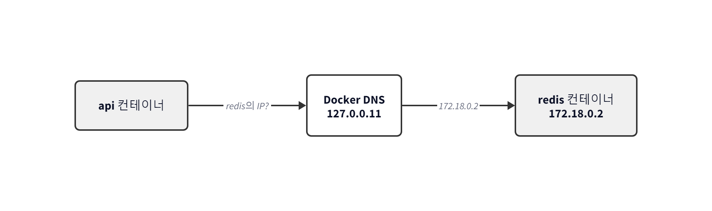
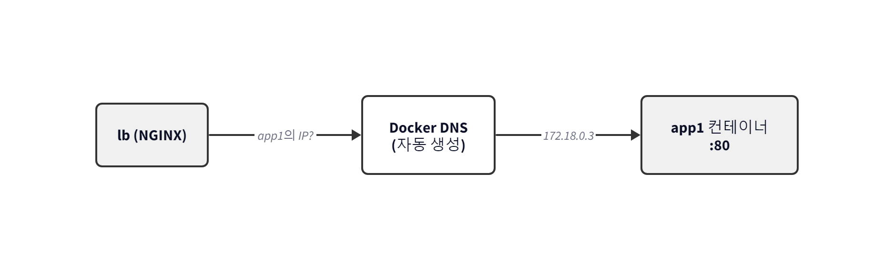

# Ch.3 Docker 다루기

챕터 2를 마친 오픈이는 다음 날 저녁 다시 노트북 앞에 앉았습니다. 어제는 "내 앱을 Docker로 담아 실행해 보는" 감까지만 잡았습니다. 그런데 `docker commit`은 한 번은 재미있어도 두 번째부터 손이 지쳤고, 서비스는 내 앱 하나만 있는 것도 아니었습니다. 프론트엔드, 백엔드, 데이터베이스가 각자 돌아야 하고 서로 연결되어야 했습니다.

오늘의 목표를 이렇게 잡았습니다.

**내 앱 이미지를 Dockerfile로 자동 빌드하고, 웹 서버·세션 저장소·DB를 차례로 컨테이너로 세워본 뒤, 마지막에는 웹 서버·백엔드·DB를 묶은 풀스택 구성을 명령 한 줄로 띄우는 상태로 완성한다.**

수동 방식의 부담을 줄이고(Dockerfile), 한 앱이 아니라 **한 서비스** 전체를 다루는 자리까지 가는 여정이었습니다. 여기까지 가면 어제 서버에서 실패한 상황 자체가 다시 생기지 않는 구조가 손에 잡힐 것 같았습니다.

## 3.1 Dockerfile — 환경을 자동으로 만들기

### 3.1.1 매번 수동으로 깔기는 지친다

어제 오픈이는 Tomcat 컨테이너에 들어가 `apt update`를 치고, vim을 깔고, index.html을 만들고, `docker commit`으로 이미지를 만들었습니다. 한 번 해봤을 때는 감을 잡는 데 도움이 됐지만, 같은 작업을 반복한다고 생각하니 손이 먼저 느려졌습니다.

내 앱 이미지를 매번 이렇게 수동으로 만드는 건 현실적이지 않았습니다. 실수로 패키지명을 잘못 치면 처음부터 다시였고, 설정을 조금만 바꿔도 전 과정을 다시 반복해야 했습니다. 오늘 첫 과제는 이 수동 작업을 **레시피 한 장**으로 자동화하는 것이었습니다.


*그림 3-1 수동 세팅과 Dockerfile 자동화 비교*

요리 레시피 카드를 떠올리면 감이 옵니다. 재료와 순서만 적어두면 누가 만들어도 같은 맛이 나옵니다. Docker에서 이 역할을 하는 파일이 **Dockerfile**이었습니다.

> **참고: Dockerfile**
> 컨테이너가 실행될 때 필요한 환경을 자동으로 구성해 주는 이미지를 만들기 위한 스크립트입니다. 베이스 이미지, 설치할 패키지, 복사할 파일, 실행할 명령을 순서대로 적어둡니다.

### 3.1.2 Dockerfile에서 컨테이너까지의 세 단계

Dockerfile에서 컨테이너가 실제로 뜨기까지는 세 단계를 거칩니다.


*그림 3-2 Dockerfile → 이미지 → 컨테이너의 세 단계*

1. **Dockerfile 작성**: 환경 구성을 텍스트 파일에 적습니다.
2. **docker build**: Docker 엔진이 Dockerfile을 위에서 아래로 읽으며 각 줄을 실행합니다. 결과물이 **이미지**로 저장됩니다.
3. **docker run**: 이미지를 기반으로 **컨테이너**를 실행합니다.

컨테이너를 지워도 이미지는 그대로 남으니, 언제든 같은 환경을 다시 띄울 수 있었습니다. 어제 오픈이가 수동 commit으로 만든 그 이미지의 대체물을 이번엔 Dockerfile로 자동 생성하는 셈이었습니다.

### 3.1.3 Dockerfile 기본 문법

자주 쓰는 지시어는 이 정도가 기본이었습니다.

| 지시어 | 역할 |
|--------|------|
| `FROM` | 베이스 이미지 |
| `WORKDIR` | 작업 디렉토리 지정 |
| `COPY` | 호스트 파일을 컨테이너로 복사 |
| `RUN` | 이미지 빌드 시 실행할 리눅스 명령 (패키지 설치 등) |
| `ENV` | 환경 변수 |
| `CMD` | 컨테이너 시작 시 실행되는 기본 명령 |
| `ENTRYPOINT` | 컨테이너 시작 시 반드시 실행되는 메인 프로세스 |

첫 실습으로 Ubuntu 기반에 vim이 깔린 이미지를 Dockerfile로 만들어 봤습니다.

```dockerfile
# Dockerfile
FROM ubuntu:24.04                      # 베이스 이미지
RUN apt update && apt install -y vim   # vim 패키지 설치
CMD ["/bin/bash"]                      # 컨테이너 시작 시 bash 실행
```

같은 폴더에서 빌드 명령을 쳤습니다.

```bash
docker build -t ubuntu-vim .   # . 은 현재 폴더의 Dockerfile을 읽겠다는 뜻
```


*그림 3-3 docker build 실행 결과*

빌드 로그가 한 줄씩 올라가더니 이미지가 완성됐습니다. 컨테이너를 띄우면 별도 설치 명령 없이 vim이 바로 쓸 수 있는 상태였습니다.


*그림 3-4 vim이 이미 설치된 상태로 컨테이너 실행*

어제 수동으로 하던 "컨테이너 들어가 → apt update → apt install → exit → commit"의 다섯 단계가 **파일 한 장 + 한 줄 명령**으로 줄어든 셈이었습니다.

### 3.1.4 CMD와 ENTRYPOINT

CMD와 ENTRYPOINT는 컨테이너가 시작될 때 무엇을 실행할지 정하는 설정인데, 성격이 조금 다릅니다. 식당에 비유하면 **CMD는 기본 메뉴**, **ENTRYPOINT는 수저와 물**입니다. 기본 메뉴는 손님이 다른 걸 시키면 바뀌지만, 수저와 물은 어떤 주문에도 반드시 준비됩니다.

```dockerfile
ENTRYPOINT ["java", "-jar"]    # 이 프로세스는 고정
CMD ["app.jar"]                # 기본 JAR, 필요하면 교체 가능
```

컨테이너를 그냥 띄우면 `java -jar app.jar`가 실행되고, `docker run` 뒤에 다른 JAR 파일명을 주면 CMD만 그 값으로 교체됩니다. ENTRYPOINT(`java -jar`)는 그대로 남고 CMD만 바뀌므로 결과적으로 `java -jar <교체된 파일명>`이 실행되는 셈입니다. 같은 이미지에 들어 있는 여러 JAR 중 하나를 골라 띄우고 싶을 때 이 조합이 쓰입니다.

오픈이의 앱 관점에서는 이 조합이 바로 쓸 모양이었습니다. ENTRYPOINT에 "내 런타임 실행" 고정, CMD에 "실행할 파일명"을 두면 같은 이미지를 다른 파일로 재활용할 수 있었습니다.

> **참고: CMD와 ENTRYPOINT**
> - **CMD**: 컨테이너가 시작될 때 실행할 **기본 명령**입니다. `docker run` 뒤에 다른 명령을 주면 덮어씁니다.
> - **ENTRYPOINT**: 컨테이너가 시작될 때 **반드시 실행되어야 하는 메인 프로세스**입니다. 외부 옵션과 상관없이 고정됩니다.
> - 둘을 같이 쓰면 `ENTRYPOINT` + `CMD` 순으로 합쳐져 실행됩니다. ENTRYPOINT는 골격, CMD는 인자로 쓰는 방식입니다.

여기까지 오면 **내 앱 이미지를 Dockerfile로 재현 가능하게 만드는** 조각은 갖춰졌습니다. 다음은 그 앱이 사용자 요청을 어떻게 받을지였습니다.

## 3.2 NGINX — 요청을 앞에서 받아 나눠주기

### 3.2.1 왜 서버 앞에 NGINX를 둘까

오픈이의 앱이 하나만 떠 있으면 사용자가 그 앱 주소로 바로 접속하면 됩니다. 하지만 사용자가 늘어 같은 앱을 두세 대로 복제해서 띄운다면 이야기가 달라집니다. 사용자는 `my-service.com` 주소 하나만 알고 있는데, 복제된 세 대의 IP를 사용자에게 따로 알려줄 수는 없었습니다. **앞쪽에 창구가 하나 있고, 그 창구가 뒤의 서버들로 요청을 나눠주는 구조**가 필요했습니다.

그 창구 역할을 하는 것이 **NGINX**였습니다.


*그림 3-5 NGINX가 앞에서 요청을 받아 뒤의 서버들로 전달*

NGINX는 웹 서버이자 요청을 중계하는 **리버스 프록시**입니다. 사용자의 요청을 NGINX가 중간에서 받아 뒤쪽 서버로 넘겨주고, 응답도 NGINX가 받아 사용자에게 돌려줍니다. 실제 서버 주소를 바깥에 노출하지 않아 보안에도 좋고, 요청을 여러 서버로 나눠주는 **로드밸런싱**도 자연스럽게 얹을 수 있었습니다. 오늘 구성할 풀스택 환경에서 오픈이의 앱 앞에 반드시 서 있어야 할 요소였습니다.

> **참고: 프록시 / 리버스 프록시 / 로드밸런싱**
> - **프록시**: 클라이언트 대신 요청을 전달하는 중간자입니다. 방향은 "내부 → 외부"입니다.
> - **리버스 프록시**: 반대편 서버 쪽에서 외부 요청을 받아 내부 서버로 전달합니다. 방향은 "외부 → 내부"이며, NGINX가 맡는 역할이 이쪽입니다.
> - **로드밸런싱**: 여러 서버에 요청을 골고루 나눠주는 방식입니다. 뒤에서 설명합니다.

### 3.2.2 NGINX 기본 문법 세 가지

NGINX 설정 파일(`nginx.conf`)에서 자주 마주치는 핵심 지시어는 세 개였습니다. 배달 앱 주문 흐름에 대응해 보면 감이 잡힙니다.

- **upstream** — 요청을 실제로 처리할 서버 그룹에 이름을 붙이는 곳. "A식당"이라는 간판을 다는 단계.
- **location** — 어떤 URL 경로로 들어온 요청을 잡을지 정하는 곳. "짜장면 주문이 들어오면"이라는 조건.
- **proxy_pass** — 그 요청을 어느 upstream으로 보낼지 지정하는 곳. "A식당으로 배달"이라는 전달 지시.

세 지시어가 어떻게 맞물리는지 개념만 먼저 보이면 이렇습니다.

```nginx
# 개념 소개용 발췌
upstream backend {                           # backend라는 이름으로 서버 그룹 등록
    server host.docker.internal:8080;        # 그룹에 속한 실제 서버 주소
}

server {
    listen 80;                               # 80번 포트로 들어오는 요청 대기
    server_name localhost;

    location / {                             # 모든 경로(/) 요청에 대해
        proxy_pass http://backend;           # backend로 넘김
    }
}
```

이 뼈대 위에 옵션을 얹는 형태로 다양한 패턴이 나옵니다. 이번 절에서는 세 가지를 차례로 봅니다. **경로 기반 라우팅, 로드밸런싱, 캐싱**입니다.

### 3.2.3 실습 ① 경로 기반 라우팅

URL 경로별로 서로 다른 서버로 요청을 보내는 경우입니다. `/app1`은 1번 서버, `/app2`는 2번 서버 식입니다. 오픈이 입장에서 보면, 회원 API와 상품 API가 별도 컨테이너로 나뉘어 있을 때 앞단에서 이렇게 갈라주는 그림이었습니다.


*그림 3-6 경로 기반 라우팅 구조*

> 실습 코드: https://github.com/metacoding-10-linux-docker/docker/tree/master/ex01

폴더 구조는 이렇습니다. 세 컨테이너(app1, app2, lb)가 각자의 Dockerfile로 이미지가 되고, 개별 컨테이너로 실행됩니다.

```
ex01/
├── app1/         # 첫 번째 웹 서버 (nginx + index.html)
├── app2/         # 두 번째 웹 서버 (nginx + index.html)
└── lb/           # 로드밸런서 (NGINX + nginx.conf)
```

lb의 `nginx.conf`가 이번 실습의 핵심입니다.

**ex01/lb/nginx.conf**
```nginx
upstream app1 {
    server host.docker.internal:8000;     # 호스트의 8000번 포트 = app1 컨테이너
}

upstream app2 {
    server host.docker.internal:9000;     # 호스트의 9000번 포트 = app2 컨테이너
}

server {
    listen 80;
    server_name localhost;

    location /app1 {                      # /app1 요청은
        proxy_pass http://app1/;          # app1 upstream으로
    }

    location /app2 {                      # /app2 요청은
        proxy_pass http://app2/;          # app2 upstream으로
    }
}
```

세 컨테이너를 띄웁니다.

```bash
docker build -t app1 ./app1 && docker run -dit -p 8000:80 app1
docker build -t app2 ./app2 && docker run -dit -p 9000:80 app2
docker build -t lb ./lb && docker run -dit -p 80:80 lb
```

> Linux에서 실행한다면 `lb`를 띄울 때 `--add-host=host.docker.internal:host-gateway` 옵션을 덧붙여야 컨테이너 안에서 `host.docker.internal`이 해석됩니다. Windows/macOS용 Docker Desktop에서는 기본 해석됩니다.

브라우저에서 `localhost:80/app1`에 접속하면 app1 서버가, `localhost:80/app2`에 접속하면 app2 서버가 응답했습니다.


*그림 3-7 /app1 경로로 접속한 결과*


*그림 3-8 /app2 경로로 접속한 결과*

URL 경로만 달라졌는데 서로 다른 서버가 응답했습니다. `location`이 요청을 잡고, `proxy_pass`가 해당 `upstream`으로 넘긴 결과였습니다.

#### host.docker.internal이 왜 필요했나

`nginx.conf`에서 오픈이 눈에 걸리는 지점이 하나 있었습니다. `host.docker.internal:8000`이라는 주소. lb 컨테이너가 app1 컨테이너를 곧장 부르지 않고 **호스트 PC를 한 번 경유하는** 구조였습니다.


*그림 3-9 lb 컨테이너 → 호스트 PC → app1 컨테이너로 가는 우회 경로*

이유는 챕터 2.5.4에서 예고했던 그 지점이었습니다. 세 컨테이너를 `docker run`으로 **각각 따로** 실행했기 때문에 기본 bridge 네트워크에 들어갔고, 거기서는 컨테이너 이름으로 서로를 부를 수 없었습니다. 그래서 "lb → 호스트 포트 → app1" 식으로 호스트를 한 번 거치는 우회 경로를 썼습니다.

> **참고: host.docker.internal**
> 컨테이너 내부에서 "호스트 PC"를 가리키는 특수 주소입니다. 컨테이너 안에서 `localhost`는 컨테이너 자기 자신을 가리키기 때문에, 호스트 PC에 접근하려면 이 이름을 써야 합니다. Linux에서는 기본 해석되지 않아 `--add-host=host.docker.internal:host-gateway` 옵션이 필요합니다.

이 우회가 번거롭다는 감각이 남았다면, **3.3**에서 사용자 정의 네트워크로 이걸 깔끔하게 치우게 됩니다.

### 3.2.4 실습 ② 로드밸런싱

이번엔 같은 서비스를 **여러 대로 복제**해서 NGINX가 요청을 번갈아 뿌려주는 구조였습니다. 놀이공원 매표소 창구 두 곳이 손님을 1번 → 2번 순으로 번갈아 받는 것과 같은 방식입니다. 이름이 **라운드 로빈**이었습니다. 오픈이의 앱도 사용자가 늘어나면 복제해야 하니 이 구조는 꼭 익혀둘 포인트였습니다.


*그림 3-10 라운드 로빈 로드밸런싱 구조*

> 실습 코드: https://github.com/metacoding-10-linux-docker/docker/tree/master/ex02

EX01과 달라지는 부분은 세 곳입니다. **app2 폴더가 사라지고**, `nginx.conf`의 `upstream app1` 블록에 `server` 줄이 두 개로 늘어나고, `upstream app2` 블록과 `location /app2` 블록이 통째로 제거됩니다.

**ex02/lb/nginx.conf** (달라진 블록)
```nginx
upstream app1 {
    server host.docker.internal:8000;     # 첫 번째 서버
    server host.docker.internal:8001;     # 같은 그룹에 두 번째 서버 추가
}

server {
    listen 80;
    location /app1 {
        proxy_pass http://app1/;          # 자동으로 두 서버에 번갈아 분배 (라운드 로빈)
    }
}
```

같은 이미지로 컨테이너를 두 번 띄웁니다. 포트만 다르게 합니다.

```bash
docker build -t app1 ./app1
docker run -dit -p 8000:80 app1   # 서버 1
docker run -dit -p 8001:80 app1   # 서버 2 (같은 이미지, 다른 포트)

docker build -t lb ./lb
docker run -dit -p 80:80 lb
```

브라우저로 `localhost:80/app1`을 새로고침하면 응답 HTML 자체는 동일합니다. 두 컨테이너가 같은 이미지에서 올라와 같은 `index.html`을 주기 때문입니다. 대신 각 컨테이너의 access 로그(`docker logs <컨테이너>`)를 확인하면 새로고침마다 8000번 컨테이너와 8001번 컨테이너에 요청이 번갈아 들어간 것을 확인할 수 있습니다.


*그림 3-11 8000 포트 컨테이너 로그에 찍힌 요청*


*그림 3-12 8001 포트 컨테이너 로그에 찍힌 요청*

`server` 한 줄 추가했을 뿐인데 NGINX가 트래픽을 두 대에 나눠 보냈습니다. 별도 설정 없이 기본값이 라운드 로빈이었습니다.

### 3.2.5 실습 ③ 캐싱

같은 파일이 초당 수백 번 요청되는 상황이라면, 이미지 한 장을 백엔드가 매번 응답하는 건 낭비였습니다. 자주 쓰는 옷을 박스 깊숙이 넣지 않고 옷걸이에 걸어두는 것처럼, 자주 요청되는 파일은 **NGINX 앞단에 잠시 보관**해 두면 됩니다. 이 저장 과정을 **캐싱**이라고 부릅니다.

캐싱 결과를 확인할 때 두 가지 상태가 번갈아 나옵니다. **MISS**는 캐시에 저장된 파일이 없어 백엔드까지 요청이 갔다 온 상태, **HIT**은 캐시에 이미 있는 파일을 백엔드 접근 없이 바로 돌려준 상태입니다.


*그림 3-13 첫 번째 요청 (MISS) — 캐시가 비어있어 백엔드까지 요청 후 응답을 캐시에 저장*


*그림 3-14 두 번째 요청 (HIT) — 캐시에 저장된 응답을 바로 반환, 백엔드 접근 없음*

> 실습 코드: https://github.com/metacoding-10-linux-docker/docker/tree/master/ex03

이번 실습은 뒤쪽 서버가 HTML만 주던 EX01과 달리, 이미지 파일까지 응답하는 **Flask 기반 API 서버**로 구성됩니다. 초점은 `nginx.conf`의 캐시 설정이었습니다.

```
ex03/
├── api/                 # 백엔드 (Flask)
│   ├── app.py
│   ├── Dockerfile
│   └── image.png
└── nginx/               # NGINX (캐싱 + 프록시)
    ├── Dockerfile
    └── nginx.conf
```

앞의 두 예제와 달라지는 지시어는 두 개였습니다. 파일 최상단의 `proxy_cache_path`와 `location` 안의 `proxy_cache`.

**ex03/nginx/nginx.conf**
```nginx
# 캐시 저장 경로와 메모리 공간 이름을 선언 (http{} 블록 내부에 위치)
proxy_cache_path /var/cache/nginx keys_zone=my_cache:10m;

server {
    listen 80;

    location / {
        proxy_pass http://host.docker.internal:5000;
        proxy_cache off;                              # 이 경로는 캐시 끔
    }

    location = /image.png {                           # /image.png 요청만
        proxy_pass http://host.docker.internal:5000;
        proxy_cache my_cache;                         # 위에서 선언한 캐시 사용
        proxy_cache_valid 200 1m;                     # 200 응답을 1분 동안 보관
        add_header X-Cache-Status $upstream_cache_status always;  # 응답 헤더에 HIT/MISS 표시
        proxy_ignore_headers Cache-Control Expires;   # 백엔드가 보낸 캐시 제어 헤더 무시
    }
}
```

포인트는 두 가지였습니다. `proxy_cache_path`로 **어디에 얼마만큼 보관할지**를 선언해 두고, `location`마다 `proxy_cache`로 **이 경로에서 그 캐시를 쓸지 말지**를 결정합니다. EX01/EX02의 뼈대(`upstream` / `location` / `proxy_pass`)는 그대로 살아 있고, 그 위에 캐시 관련 줄이 얹힌 모양이었습니다.

```bash
# api 서버 실행 (Flask — 5000번 포트)
docker build -t api ./api
docker run -dit -p 5000:5000 api

# nginx 실행
docker build -t nginx-cache ./nginx
docker run -dit -p 80:80 nginx-cache
```

`localhost:80/image.png`로 요청하면 이미지가 응답됩니다.


*그림 3-15 캐싱 실습 — 이미지 응답*

브라우저의 **F12 > Network > Headers** 탭을 열고, 브라우저 자체 캐시가 결과를 흐리지 않도록 Disable cache를 체크했습니다. Response Headers의 `X-Cache-Status` 값이 처음엔 `MISS`였습니다. 캐시에 데이터가 없어 원본 서버까지 다녀온 상태입니다.


*그림 3-16 X-Cache-Status: MISS 확인*

새로고침을 한 번 더 하면 `HIT`으로 바뀌었습니다. 캐시에 저장된 파일을 서버 요청 없이 그대로 응답한 상태입니다.


*그림 3-17 X-Cache-Status: HIT 확인*

세 예제를 다 보고 나면 `nginx.conf`의 생김새가 크게 달라 보이지 않았습니다. 뼈대는 같고, 그 위에 **"upstream 두 세트 / server 두 줄 / 캐시 옵션"** 중 어떤 옷을 입혔는지만 달랐습니다. 오픈이의 구성에 들어갈 NGINX는 이 중에서 필요한 옵션만 골라 쓰면 됐습니다.

## 3.3 Redis — 서버가 여러 대일 때 세션은 어디에

### 3.3.1 서버 여러 대면 생기는 세션 문제

NGINX로 백엔드 복제가 가능해졌는데, 복제 자체가 새 문제를 만드는 경우가 있었습니다. 사용자가 로그인하고 장바구니에 상품을 담은 뒤 결제 페이지로 넘어갔을 때 로그인이 풀리는 증상입니다. 오픈이의 앱이 내부에 로그인 기능을 갖고 있다면 이 문제를 피해 갈 수 없었습니다.

원인을 짚어보면 이렇습니다. 많은 백엔드 프레임워크는 로그인 상태를 **서버 메모리**에 보관합니다. 이 정보를 **세션**이라고 부릅니다. 서버가 한 대일 때는 같은 서버가 받은 요청이니 같은 메모리에서 읽으면 됐습니다. 그런데 서버가 두 대로 갈라지는 순간, 각 서버의 메모리는 서로의 세션을 모르는 **별개의 공간**이 됩니다. 로그인 요청은 1번 서버 메모리에 세션을 남기고, 다음 결제 요청은 2번 서버로 넘어가면 2번 서버 메모리엔 세션이 없습니다.


*그림 3-18 세션 불일치 — 1번 서버에 저장된 세션이 2번 서버엔 없어 로그인 풀림*

> **참고: 세션(Session)**
> 사용자가 로그인했을 때 서버가 생성하는 임시 기록입니다. "이 사용자는 인증되었습니다"라는 정보를 서버가 보관하고, 이후 요청이 올 때마다 이 기록을 확인해 로그인 상태를 유지합니다.

### 3.3.2 Redis는 서버들이 공유하는 사물함

해결책은 단순했습니다. **세션을 서버 메모리 대신, 서버들 바깥의 공용 저장소에 둔다**.

**선배**: "각자 서랍에 넣지 말고 공용 사물함에 넣으라고 하면 되잖아."

회사에서 각자 개인 서랍에 물건을 넣으면 내 서랍은 나만 쓰지만, 공용 사물함에 넣으면 같은 사물함 번호를 아는 사람은 누구나 꺼낼 수 있는 것과 같습니다. 이 공용 저장소 역할을 하는 것이 **Redis**였습니다.


*그림 3-19 Redis로 해결 — 세션을 공용 저장소에 보관하여 어느 서버에서든 조회 가능*

1번 서버가 Redis에 세션을 저장하면 2번 서버도 같은 Redis를 열어 그 세션을 꺼낼 수 있었습니다. 어느 서버가 요청을 처리하든 동일한 데이터에 접근할 수 있는 구조입니다. 오픈이의 앱에서 이 조합이 들어가면 복제 서버 어디로 요청이 가도 로그인 유지가 됐습니다.

> **참고: Redis**
> 메모리 기반의 키-값 데이터베이스입니다. 디스크가 아닌 메모리에 저장하기 때문에 속도가 매우 빨라, 캐싱·세션 저장소처럼 빠른 읽기/쓰기가 필요한 곳에 주로 쓰입니다.

### 3.3.3 사용자 정의 네트워크 — 이름으로 부르기

Redis 컨테이너와 API 컨테이너가 서로를 **어떻게 부를 것인가**. 챕터 2에서 예고했던 "사용자 정의 네트워크"가 실제로 등장할 자리였습니다.

3.2에서 오픈이는 컨테이너를 `docker run`으로 각각 실행했더니 기본 bridge에 들어갔고, 이름으로 부르는 게 불가능해서 `host.docker.internal`로 호스트를 경유해야 했습니다. 사용자 정의 네트워크는 이 우회를 제거해 줍니다. 같은 네트워크에 들어간 컨테이너들은 Docker 내장 DNS가 이름을 IP로 바꿔주므로 **컨테이너 이름을 그대로 도메인처럼 쓸 수 있었습니다**.



*그림 3-20 사용자 정의 네트워크 — 같은 네트워크 안의 컨테이너끼리 이름으로 호출*

기본 명령은 세 가지면 충분했습니다.

| 명령 | 역할 |
|------|------|
| `docker network create <이름>` | 새 네트워크 생성 |
| `docker run ... --network <이름>` | 컨테이너를 해당 네트워크에 참여 |
| `docker network ls` | 네트워크 목록 조회 |

| 배치 방식 | 컨테이너끼리 이름 호출 | 호스트 경유 필요 |
|----------|-------------------|---------------|
| 기본 bridge (그냥 `docker run`) | 불가 | 필요 (`host.docker.internal`) |
| 사용자 정의 네트워크 (`--network`) | 가능 | 불필요 |

> **참고: 사용자 정의 네트워크**
> `docker network create`로 사용자가 직접 만드는 bridge 네트워크입니다. 기본 bridge와 달리 **Docker 내장 DNS**가 자동 활성화되어 컨테이너 이름을 도메인처럼 쓸 수 있습니다. 실무에서는 거의 모든 경우에 사용자 정의 네트워크를 씁니다.

### 3.3.4 실습: Redis로 세션 공유

> 실습 코드: https://github.com/metacoding-10-linux-docker/docker/tree/master/ex04

폴더 구조는 api 하나입니다(Redis는 공식 이미지를 그대로 씁니다).

```
ex04/
└── api/
    ├── Dockerfile
    └── app.py         # Redis에 값을 저장/조회하는 간단한 API
```

`app.py`는 `/save`로 값을 넣고 `/read`로 꺼내는 단순한 서버입니다. 핵심은 딱 한 줄, Redis 주소를 **`host='redis'`** 로 지정한 부분이었습니다. IP가 아니라 컨테이너 이름을 그대로 썼습니다.

**ex04/api/app.py** (핵심)
```python
import redis
# 'redis'는 사용자 정의 네트워크 안의 컨테이너 이름
r = redis.Redis(host='redis', port=6379, db=0)
```

이제 네트워크를 만들고 세 컨테이너를 모두 같은 네트워크에 띄웁니다.

```bash
# 1. 사용자 정의 네트워크 생성
docker network create myNetwork

# 2. Redis 컨테이너 실행 (-p는 호스트에서 확인용으로 노출, 같은 네트워크 내 통신에는 불필요)
docker run -d --name redis --network myNetwork -p 6379:6379 redis

# 3. API 서버 두 대 실행 (같은 이미지, 다른 포트)
docker build -t api ./api
docker run -d --name api1 --network myNetwork -p 5001:5000 api
docker run -d --name api2 --network myNetwork -p 5002:5000 api
```

api1 서버의 `localhost:5001/save`로 값을 저장하고, api2 서버의 `localhost:5002/read`로 그 값을 조회하면 **api1이 저장한 값이 api2에서 그대로 조회**됐습니다.


*그림 3-21 api1에서 데이터 저장*


*그림 3-22 api2에서 같은 데이터 조회*

세 컨테이너가 같은 `myNetwork` 안에 있기 때문에 api1·api2가 `host='redis'`만 써도 Redis 컨테이너에 닿을 수 있었습니다. 서버가 두 대로 복제돼도 세션이 끊기지 않는 구조가 만들어진 겁니다.

## 3.4 MySQL — 영구 데이터는 DB 서버에

Redis는 메모리 기반이라 재시작하면 데이터가 사라집니다. 회원 정보, 게시글, 주문 내역처럼 **영구히 보관되어야 하는 데이터**는 관계형 데이터베이스가 필요했습니다. 오픈이의 앱에도 당연히 DB가 붙어야 했고, MySQL도 컨테이너로 띄울 수 있었습니다.

> 실습 코드: https://github.com/metacoding-10-linux-docker/docker/tree/master/ex05

**ex05/db/Dockerfile**
```dockerfile
FROM mysql                                    # MySQL 공식 이미지
COPY init.sql /docker-entrypoint-initdb.d     # 첫 기동 시 자동 실행될 SQL
ENV MYSQL_USER=metacoding                     # 사용자 이름
ENV MYSQL_PASSWORD=metacoding1234             # 사용자 비밀번호
ENV MYSQL_ROOT_PASSWORD=root1234              # root 비밀번호
ENV MYSQL_DATABASE=metadb                     # 기본 생성할 DB 이름
CMD ["--character-set-server=utf8mb4", "--collation-server=utf8mb4_unicode_ci"]
```

두 가지가 핵심이었습니다.

1. **`/docker-entrypoint-initdb.d`** 는 MySQL 공식 이미지가 **첫 기동 시** 자동으로 실행해 주는 특수 경로입니다. 여기에 `init.sql`을 떨어뜨리면 테이블과 초기 데이터가 알아서 만들어집니다.
2. **환경 변수 네 개**로 계정과 기본 DB 이름을 세팅합니다. 실제 접속 시 이 값들이 그대로 쓰입니다.

실습 편의를 위해 `FROM mysql`로 태그를 생략했지만, 실무에서는 재현성을 위해 `FROM mysql:8.0`처럼 버전을 고정하는 것이 안전합니다.

빌드하고 실행합니다.

```bash
docker build -t db ./db
docker run -dit -p 3306:3306 db
```


*그림 3-23 MySQL 컨테이너 실행 로그*

컨테이너 안으로 들어가 데이터를 확인할 차례입니다. `docker ps`로 실행 중인 컨테이너 ID를 확인한 뒤, `docker exec -it <컨테이너ID> bash`로 내부 셸에 진입했습니다.

```bash
docker ps                    # 실행 중인 컨테이너 확인
docker exec -it 1fc2 bash   # MySQL 컨테이너 내부 접속
```


*그림 3-24 MySQL 컨테이너 내부 진입*

컨테이너 안에서 MySQL 클라이언트를 띄웠습니다. 접속 형식은 `mysql -u <사용자명> -p`이고, 사용자명과 비밀번호는 앞서 Dockerfile에 환경 변수로 심어 둔 값을 그대로 씁니다.

```bash
mysql -u metacoding -p       # MySQL 접속
```

비밀번호를 입력할 때는 보안상 화면에 표시되지 않지만, 그대로 치면 접속됩니다.


*그림 3-25 MySQL 접속 성공*

접속한 뒤에는 `show databases`로 DB 목록을, `use metadb`로 DB를 고르고, `show tables`로 테이블 목록을, `select * from user_tb`로 데이터를 차례로 확인했습니다.

```sql
show databases;
use metadb;
show tables;
select * from user_tb;
```


*그림 3-26 데이터베이스 목록 확인*


*그림 3-27 user_tb 데이터 조회 결과*

`init.sql`에서 만든 테이블과 데이터가 그대로 남아 있었습니다.

내 앱이 붙을 DB까지 컨테이너로 준비할 수 있다는 확신이 생겼습니다. 이제 이 조각들을 **한 덩어리**로 묶어 띄우는 일만 남았습니다.

## 3.5 Docker Compose — 여러 컨테이너를 한 번에

### 3.5.1 docker run을 매번 치는 게 지친다

여기까지 오픈이가 머릿속에 그려둔 구성은 여러 덩어리였습니다. 네트워크 만들고, Redis 띄우고, API 두 대 띄우고, MySQL 띄우고, NGINX 띄우기. 실습 중에 이 조각들을 하나씩 쳐보는 것까지는 됐는데, 매일 이 긴 명령 묶음을 손으로 치는 건 오늘의 목표와 정반대였습니다.


*그림 3-28 기존 방식 — 개별 빌드 및 실행 반복*

해결책은 **여러 컨테이너를 하나의 파일에 적어두고 명령어 하나로 실행**하는 것이었습니다. 그 도구가 **Docker Compose**입니다. 오케스트라의 악보처럼, 각 악기(컨테이너)의 역할을 한 악보에 적어두면 지휘 한 번으로 모든 연주자가 동시에 시작합니다. 오늘 대목표인 "한 줄 명령으로 전체 구성 띄우기"가 이 도구로 가능해졌습니다.


*그림 3-29 Docker Compose 방식 — 한 번에 생성 및 연결*

Compose가 풀어주는 것은 세 가지였습니다.

- **순서**: `depends_on`으로 어떤 컨테이너를 먼저 띄울지 지정.
- **네트워크**: 같은 Compose 파일에 정의된 컨테이너는 자동으로 하나의 네트워크에 묶임. `docker network create`를 따로 할 필요 없음.
- **일괄 관리**: `docker compose up` 한 줄로 시작, `docker compose down` 한 줄로 정리.

> **참고: Docker Compose**
> 여러 컨테이너를 하나의 YAML 파일에 묶어 명령 하나로 실행·관리하는 도구입니다. 컨테이너 간 네트워크와 의존 관계를 자동으로 구성해 줍니다.

### 3.5.2 docker-compose.yml 기본 구조

```yaml
services:
  <서비스명>:
    container_name: <컨테이너명>       # 컨테이너 이름
    image: <이미지명>                # Hub에서 가져올 이미지
    build: <경로>                    # Dockerfile로 직접 빌드 (image 대신 선택)
    ports:
      - "호스트포트:컨테이너포트"
    depends_on:
      - <먼저 떠야 할 서비스>
    environment:
      - KEY=VALUE
    volumes:
      - <호스트경로:컨테이너경로>
    networks:
      - <네트워크명>

volumes:
  <볼륨명>:

networks:
  <네트워크명>:
```

옵션이 많아 보이지만 실습에서 쓰는 건 이 중 일부였습니다.

| 옵션 | 필수 여부 | 언제 쓰나 |
|------|---------|----------|
| `services.<이름>` | 필수 | 컨테이너 하나당 하나 |
| `image` 또는 `build` | 둘 중 하나 | Hub에서 받을지, Dockerfile로 빌드할지 |
| `ports` | 선택 | 외부 접근이 필요할 때 |
| `environment` | 선택 | 설정값 주입 |
| `depends_on` | 선택 | 시작 순서 지정 (단, **준비 완료**까지는 보장 X) |
| `networks` | 선택 | 같은 파일 안이면 자동이라 대부분 생략 |

### 3.5.3 실습: Compose로 EX01 다시 만들기

EX01의 세 컨테이너(app1/app2/lb)를 Compose로 바꿔봤습니다. Dockerfile과 index.html은 그대로, docker-compose.yml만 새로 씁니다.

> 실습 코드: https://github.com/metacoding-10-linux-docker/docker/tree/master/ex06

**ex06/docker-compose.yml**
```yaml
services:
  app1:
    build:
      context: ./app1
    ports:
      - 8000:80
    networks:
      - ex06-network
  app2:
    build:
      context: ./app2
    ports:
      - 9000:80
    networks:
      - ex06-network
  lb:
    build:
      context: ./lb
    ports:
      - 80:80
    networks:
      - ex06-network

networks:
  ex06-network:
```

그리고 `ex06/lb/nginx.conf`에서 upstream 주소가 EX01과 결정적으로 달라졌습니다. 이전엔 `host.docker.internal:8000`이었는데, 이제는 **`app1:80`**, **`app2:80`** 처럼 서비스 이름으로 바로 부를 수 있었습니다. Compose가 자동으로 사용자 정의 네트워크를 만들어 세 서비스를 묶어주기 때문입니다.



*그림 3-30 Compose가 자동 생성한 네트워크에서 서비스 이름으로 통신*

실행 명령도 하나로 줄어듭니다.

```bash
docker compose up        # 모든 컨테이너 한 번에 실행
docker compose down      # 모든 컨테이너 중지 및 삭제
```


*그림 3-31 docker compose up 실행 결과*

결과는 EX01과 동일한데, 손에서 타이핑할 `docker build` + `docker run` 여섯 명령이 `docker compose up` 한 줄로 줄어들었습니다. 손끝에서 명령 하나로 서비스 전체가 뜨는 감각이 처음으로 잡힌 순간이었습니다.

### 3.5.4 자주 쓰는 Compose 명령어

| 명령어 | 설명 |
|--------|------|
| `docker compose up` | 모든 서비스 빌드 + 실행 |
| `docker compose up -d` | 백그라운드 실행 |
| `docker compose down` | 모든 서비스 중지 + 삭제 |
| `docker compose ps` | 실행 중인 서비스 목록 |
| `docker compose logs` | 서비스 로그 |
| `docker compose build` | 이미지만 빌드 |

## 3.6 종합 실습 — 풀스택 웹사이트 (오늘의 과제로 돌아오기)

챕터 도입에서 오픈이가 잡은 대목표가 이 절에서 완성됩니다. **프론트엔드(NGINX) + 백엔드(Spring Boot) + DB(MySQL)** 세 서비스를 Compose 한 파일에 담고, `docker compose up` 한 줄로 전체를 띄우는 구성입니다.

> 실습 코드: https://github.com/metacoding-10-linux-docker/docker/tree/master/ex07

### 3.6.1 전체 아키텍처


*그림 3-32 세 컨테이너로 구성되는 웹 애플리케이션 아키텍처*

각 서비스의 역할은 이렇습니다.

- **Frontend (NGINX)**: 브라우저에 HTML을 응답. `/api/` 요청은 백엔드로 프록시.
- **Backend (Spring Boot)**: `/api/users` API를 처리. DB에서 사용자 목록을 조회.
- **DB (MySQL)**: 사용자 데이터 영구 저장.

폴더 구조는 이렇습니다.

```
ex07/
├── backend/             # Spring Boot 백엔드
│   ├── Dockerfile
│   └── entrypoint.sh
├── db/                  # MySQL (ex05와 동일)
│   ├── Dockerfile
│   └── init.sql
├── frontend/            # NGINX + HTML
│   ├── Dockerfile
│   ├── index.html
│   └── nginx.conf
└── docker-compose.yml
```

### 3.6.2 Backend: 시작 시 소스 내려받아 빌드

학습 편의를 위해, 백엔드 이미지는 컨테이너가 뜨는 순간 Github에서 Spring Boot 소스를 clone 받고 빌드하도록 구성했습니다. 독자가 소스를 로컬에 받아두지 않아도 실습이 돌아가게 만든 구성입니다.

**ex07/backend/entrypoint.sh**
```bash
#!/bin/bash
git clone https://github.com/metacoding-10-linux-docker/backend-server
cd backend-server
chmod +x gradlew
./gradlew build
java -jar -Dspring.profiles.active=prod build/libs/*.jar
```

> **참고: 이 구조는 학습용**
> 독자가 로컬에 소스를 내려받지 않고도 실습이 돌아가도록, 컨테이너가 뜰 때마다 git clone과 빌드를 수행하게 만든 구성입니다.

### 3.6.3 Frontend: NGINX가 `/`는 정적, `/api/`는 백엔드로

**ex07/frontend/nginx.conf**
```nginx
events {}

http {
    upstream backend {
        server backend:8080;               # Compose 서비스 이름
    }

    server {
        listen 80;
        server_name _;

        location / {                       # / 요청은 정적 파일
            root   /usr/share/nginx/html;
            index  index.html;
        }

        location /api/ {                   # /api 요청은 백엔드로 프록시
            proxy_pass http://backend;
        }
    }
}
```

`server backend:8080`이 이번 구성의 연결 고리였습니다. Compose에서 `backend`라는 이름의 서비스가 있기 때문에, 같은 네트워크 안의 frontend 컨테이너는 `backend`라는 이름으로 바로 그 서비스에 닿을 수 있었습니다.

### 3.6.4 docker-compose.yml

**ex07/docker-compose.yml**
```yaml
services:
  backend:
    build:
      context: ./backend
    ports:
      - "8080:8080"
    environment:
      SPRING_DATASOURCE_URL: jdbc:mysql://db:3306/metadb?useSSL=false&serverTimezone=UTC&useLegacyDatetimeCode=false&allowPublicKeyRetrieval=true
      SPRING_DATASOURCE_DRIVER_CLASS_NAME: com.mysql.cj.jdbc.Driver
      SPRING_DATASOURCE_USERNAME: root
      SPRING_DATASOURCE_PASSWORD: root1234
    networks:
      - ex07-network

  db:
    build:
      context: ./db
    ports:
      - 3306:3306
    networks:
      - ex07-network

  frontend:
    build:
      context: ./frontend
    ports:
      - "80:80"
    networks:
      - ex07-network

networks:
  ex07-network:
```

세 서비스가 같은 `ex07-network`에 묶여 있어, frontend의 NGINX는 `backend`라는 이름으로, backend는 `db`라는 이름으로 서로를 부릅니다. backend의 `SPRING_DATASOURCE_URL`에 들어간 `jdbc:mysql://db:3306/...`이 그 호출 지점입니다.

### 3.6.5 한 줄로 전체 띄우기

```bash
docker compose up
```


*그림 3-33 docker compose up 한 줄로 세 컨테이너가 동시에 뜨는 모습*

백엔드 컨테이너는 git clone과 Gradle 빌드를 먼저 돌리기 때문에 처음에는 몇 분 걸립니다. 준비가 끝나면 브라우저에서 `localhost:80`에 접속했을 때 사용자 목록이 조회됐습니다.


*그림 3-34 사용자 목록 조회 성공*

한 줄 명령 뒤에서 일어난 일을 되짚어 봤습니다.

1. 브라우저가 `localhost:80`으로 `index.html`을 요청.
2. frontend 컨테이너의 NGINX가 `location /`에 매칭해 정적 HTML 응답.
3. 페이지가 뜬 뒤 JS가 `/api/users`를 호출 → 같은 NGINX가 받아 `location /api/`에 매칭 → `proxy_pass http://backend`로 백엔드 컨테이너에 전달.
4. Backend가 `db:3306`으로 MySQL 컨테이너에 붙어 `user_tb`를 조회.
5. JSON 응답이 Spring → NGINX → 브라우저로 돌아가 화면에 표시.

대목표였던 "내 앱을 포함한 풀스택 구성을 한 줄 명령에 띄우기"가 여기서 실습으로 확인됐습니다. 어제 서버에서 환경 불일치로 막혔던 그 상황이 이 구조 안에서는 반복되지 않습니다. 이미지에 필요한 모든 것이 들어 있고, Compose가 세 서비스를 하나의 네트워크로 묶어 서비스 이름만으로 서로를 부를 수 있게 해주기 때문입니다.

## 3.7 Compose까지 와도 남은 것

오늘의 목표는 달성됐지만, 운영 관점으로 옮기면 아직 풀리지 않은 문제가 보였습니다.

- **컨테이너가 죽으면 누가 다시 띄우는가**: 예기치 못한 크래시가 나도 자동 복구는 없음.
- **트래픽이 몰리면 어떻게 개수를 조정하는가**: compose 파일을 고쳐 다시 올려야 함.
- **무중단 배포는 어떻게 하는가**: 새 버전 올리고 기존 것 내리는 과정에 공백이 생김.
- **여러 서버에 나눠 띄우려면**: Compose는 기본적으로 한 머신 위에서 도는 도구.
- **설정·비밀값을 이미지와 분리하려면**: 현재는 compose 파일에 적어두는 수준.

이 과제들을 한 묶음으로 풀어주는 자동화 시스템이 다음 챕터의 주제인 **Kubernetes**입니다.

## 이것만은 기억하자

- **Dockerfile**은 환경 구성의 레시피입니다. 한 번 써두면 같은 환경을 몇 번이든 재현합니다.
- **NGINX**는 서버 앞단에 두는 리버스 프록시입니다. 경로 라우팅·로드밸런싱·캐싱이 핵심 역할이고, 세 예제 모두 같은 뼈대 위에 옵션만 달리한 형태입니다.
- **Redis**는 서버들이 공유하는 세션 저장소입니다. 로드밸런싱으로 서버가 여러 대가 돼도 세션이 끊기지 않게 해줍니다.
- **사용자 정의 네트워크**는 컨테이너끼리 **이름으로 통신**하게 해줍니다. `host.docker.internal` 우회가 사라집니다.
- **Docker Compose**는 여러 컨테이너를 한 파일에 묶어 명령 하나로 관리합니다. 서비스 간 네트워크도 자동입니다.
- **Compose까지 와도 자동 복구·스케일링·무중단 배포·다중 서버는 남는다.** 다음 챕터에서 Kubernetes가 이 자리를 가져갑니다.
