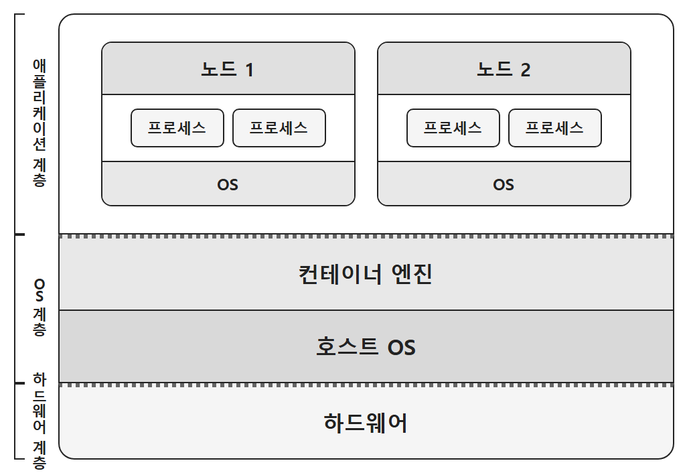
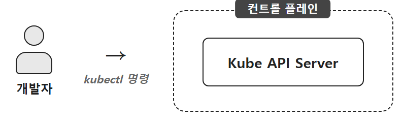
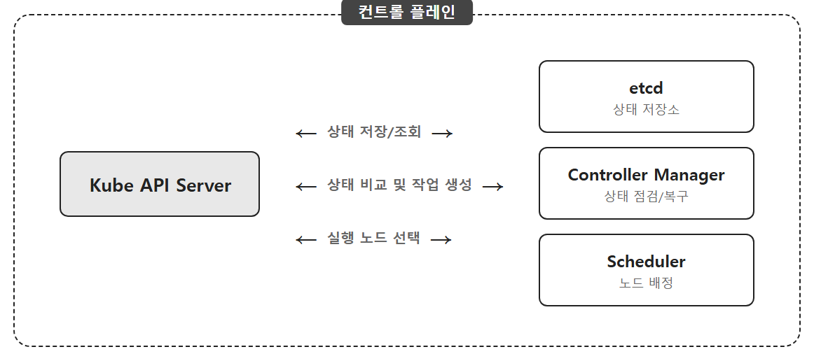
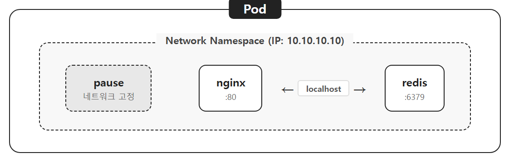

# Ch.4 Kubernetes 시작하기

## 4.1 새벽 세 시의 알람

챕터 3에서 오픈이는 Docker Compose로 Frontend, Backend, DB, Redis를 한 번에 띄우는 데 성공했습니다. 로컬에서는 `docker compose up -d` 한 줄로 네 서비스가 가지런히 일어났습니다. 그 상태로 개발 서버에 올렸고, 운영이 시작됐습니다.

문제는 그 다음부터였습니다.

### 4.1.1 새벽 세 시의 알람

수요일 새벽 세 시 십 분.

오픈이의 휴대폰이 어둠 속에서 울렸습니다. 모니터링 봇이 결제 서비스 컨테이너가 죽었다고 알려왔습니다. 눈을 반쯤 뜬 채 머리맡의 노트북을 끌어당겨 열었습니다. 화면 밝기가 눈을 찔렀습니다. `docker ps`를 쳤습니다. 해당 컨테이너가 목록에 없었습니다.

`docker compose up -d`로 다시 띄웠습니다. 30초가 지나자 응답이 돌아왔습니다. 베개에 뺨을 대자마자 잠이 달아난 걸 깨달았습니다.

목요일 새벽 세 시 이십 분. 같은 알람. 이번엔 배송 조회 서비스였습니다. 똑같이 노트북을 열고, 똑같이 명령을 치고, 똑같이 기다렸습니다.

*이걸 내가 계속 해야 돼?*

금요일 저녁, 타임세일이 시작됐습니다. 평소의 열 배가 넘는 트래픽이 쏟아졌습니다. 결제 서비스 한 대로는 버티지 못했고 응답 시간이 점점 늘어졌습니다. 오픈이는 docker-compose.yml을 열어 결제 서비스를 세 개로 늘렸습니다. 터미널 세 개를 열고 각각 로그를 띄웠습니다. 화면 세 개가 초록 글자를 뿜어내는 동안, 마우스를 쥔 채 타임세일이 끝나기만 기다렸습니다. 끝나면 다시 한 대로 줄여야 했습니다. 그건 그때 가서 또 손으로 해야 할 일이었습니다.

월요일 오후, 결제 서비스에 긴급 패치가 필요했습니다. 무중단이어야 했습니다. 오픈이는 Spring Boot로 빌드한 새 JAR로 버전 2 컨테이너를 새 포트에 띄우고, nginx.conf를 열어 upstream을 수정하고, 버전 1을 내렸습니다. 두 서비스가 동시에 뜨는 30초 동안 손가락이 트랙패드 위에서 떨렸습니다. 성공했지만 다음엔 운이 좋지 않을 것 같았습니다.

팀장이 옆자리에서 지켜보다가 물었습니다.

**팀장**: "이걸 매번 손으로 해야 돼?"

오픈이는 대답을 못 했습니다.

그 주 금요일, 선배가 다가와 쿠버네티스 얘기를 꺼냈습니다.

**선배**: "백엔드 세 개 항상 떠 있게 해달라고 하면, 알아서 해주는 게 있어."

*쿠버네티스라는 게, 매번 명령을 내려야 하는 건 아니라고?*

지시를 하나하나 내리지 않는데 뭐가 알아서 움직인다는 건지 감이 없었습니다.

선배가 예시를 들었습니다. 챕터 1에서 슬쩍 심어뒀던 **프랜차이즈 본사** 이야기였습니다.

본사가 가맹점 운영을 매장별로 일일이 지시하지는 않습니다. "수도권은 매장 50개 유지" 같은 **지침**만 내려보냅니다. 어느 상권에 새로 열지, 어디를 정리할지는 본사 담당자가 알아서 맞춥니다. 한 매장이 문을 닫으면 근처에 새 매장을 엽니다. 장마철엔 배달 인력을 늘리라고 숫자만 바꿔주면 지역에서 실무가 진행됩니다.

본사는 **원하는 상태**만 선언하고, 나머지는 시스템이 맞춘다. 이게 핵심이었습니다.


*그림 4-1 본사가 "가맹점 네 개 유지"를 선언하면 시스템이 매장 개수를 자동으로 맞추는 구조*

오픈이는 월요일 밤의 30초를 떠올렸습니다. 그 30초가 없는 세계가 가능하다는 얘기였습니다. 수요일 새벽 세 시의 알람도, 타임세일 저녁의 터미널 세 개도. 전부 "숫자만 바꿔주면 시스템이 맞추는" 일이었습니다.

**선배**: "백엔드 하나가 죽으면, 알아서 새로 띄운다. 트래픽이 늘면 숫자만 바꾸면 된다. 새 버전도 천천히 갈아 끼운다. 그걸 다 해주는 시스템이야."

오픈이는 노트북 옆에 놓아둔 커피잔을 집다가 잠시 멈췄습니다. 같은 얘기를 몇 번 듣고 나서야, 이게 도커 컴포즈의 "한 번 실행하는" 방식과는 성격이 완전히 다른 도구라는 게 잡혔습니다. 도커 컴포즈는 "이 순간 이렇게 올려라"라는 명령이었고, 이건 "계속 이 상태를 유지하라"는 **약속**이었습니다.

이 약속을 실제로 지켜주는 시스템, 즉 선언된 상태를 자동으로 맞춰주는 실행 주체의 이름이 **쿠버네티스(Kubernetes, K8s)**입니다.

> **참고: 선언적(Declarative) 관리와 Desired State**
> 쿠버네티스는 "해야 할 단계"가 아니라 "원하는 결과 상태"만 선언한다. SQL의 `SELECT`처럼 무엇을 원하는지만 말하면 시스템이 경로를 찾는다. 반대 개념은 명령형(Imperative)으로, 단계를 하나씩 지시하는 방식. Docker Compose가 명령형에 가깝다면 쿠버네티스는 선언형이다.

쿠버네티스는 구글에서 만든 컨테이너 관리 플랫폼으로, 운영의 핵심을 자동화합니다. Docker가 한 대의 컴퓨터 안에서 컨테이너를 만들고 실행하는 도구라면, 쿠버네티스는 여러 대의 컴퓨터를 묶어 수백 개의 컨테이너를 자동으로 관리하고 배치하는 더 큰 운영 시스템입니다.

다만 이 말이 "쿠버네티스를 쓰려면 서버가 여러 대 필요하다"는 뜻은 아닙니다. 실제 운영 환경에서는 수많은 컴퓨터를 하나로 묶지만, 이 책에서 쓰는 **Minikube는 한 대의 가상 컴퓨터 안에서 그 구조를 축소 재현**합니다. 노트북 한 대로 본사와 가맹점의 역할을 모두 돌려볼 수 있다는 뜻입니다. 구조를 이해한 뒤에는 서버 대수만 늘리면 됩니다.

오픈이가 새벽마다 하던 일을 대신 해주는 시스템이었습니다.

### 4.1.2 쿠버네티스의 핵심 리소스

쿠버네티스 안에서는 작업 단위 하나하나를 **리소스(Resource)**라고 부릅니다. 외부에서 요청이 들어오면 이 리소스들을 거쳐 컨테이너에 도달합니다. 전체 흐름을 먼저 보겠습니다.


*그림 4-2 쿠버네티스 핵심 리소스의 구조*

각 리소스의 역할은 아래 표와 같습니다. 상세 내용은 앞으로 실습에서 하나씩 만나봅니다.

| 리소스 | 역할 | 프랜차이즈 비유 |
|--------|------|--------------|
| **Ingress** | 외부 요청을 클러스터 내부로 라우팅하는 진입점 | 프랜차이즈 공식 주문 앱 |
| **Service** | Pod의 IP가 바뀌어도 고정된 진입점을 제공 | 가맹점 대표 전화번호 |
| **Deployment** | Pod의 생성, 개수 유지, 업데이트를 자동 관리 | 본사 운영 지침서 |
| **Pod** | 컨테이너를 실행하는 가장 작은 단위 | 가맹점 주방 |
| **ConfigMap** | 데이터베이스 주소 등 일반 설정값 저장 | 영업 안내/일반 메뉴판 |
| **Secret** | 비밀번호, API 키 등 민감한 설정값 저장 | 금고 속 레시피 |

챕터 1에서 심어둔 프랜차이즈 비유의 뼈대가 이 표 안에 다 들어있습니다. 이번 챕터에서는 **Pod**와 **Deployment**만 먼저 다루고, 나머지는 챕터 5와 6에서 순서대로 풀어갑니다.

### 4.1.3 쿠버네티스의 동작 원리

그럼 이 리소스들이 실제로 어떤 구조 위에서 돌아가는 걸까요. 한 꺼풀 벗겨 보겠습니다.

#### 노드: 독립된 가상 컴퓨터

먼저 **노드(Node)**라는 단위를 알아야 합니다.

쉽게 말해 노드는 거대한 물리 서버 한 대의 자원을 나누어 쓰는 **독립된 가상 컴퓨터**입니다.

챕터 2에서 배운 컨테이너 가상화와 겹쳐 보면 헷갈리기 쉬운데, 이 시점에서 둘을 명확히 구분하는 게 중요합니다. 컨테이너는 호스트 컴퓨터의 운영체제(OS)를 다른 컨테이너들과 함께 공유해서 쓰는 **격리된 프로세스**입니다. 반면 노드는 이 컨테이너들을 품고 실제로 일하게 만드는 **하나의 컴퓨터**입니다.



*그림 4-3 노드의 구조*

결정적 차이는 **운영체제의 독립성**에 있습니다. 컨테이너는 호스트에 이미 깔려 있는 OS를 빌려 씁니다. 노드는 호스트 환경 위에 자신만의 독립된 운영체제를 따로 설치해서 돌립니다.

이렇게 독립적인 노드들이 수십, 수백 개씩 모여 하나의 거대한 팀을 이룬 것이 **쿠버네티스**입니다.

#### 클러스터의 구조: 본사와 가맹점

쿠버네티스는 크게 **컨트롤 플레인(Control Plane)**과 **워커 노드(Worker Node)**로 구성됩니다. 둘이 합쳐져 유기적으로 움직이는 전체 시스템을 **클러스터(Cluster)**라고 부릅니다. 프랜차이즈 비유로 맞춰보면 이렇게 됩니다.

- **클러스터**: 프랜차이즈 기업. 본사와 전국 가맹점이 하나의 체계로 묶여 움직이는 전체.
- **컨트롤 플레인**: 본사 관리팀. 브랜드 정책을 정하고 매장 수를 점검하고 지침을 내려보내는 컨트롤 타워.
- **워커 노드**: 각 지역 가맹점. 본사의 지침을 받아 실제로 음식을 만들고 손님을 맞이하는 현장.


*그림 4-4 쿠버네티스 클러스터의 구조*

#### 명령어가 들어가면 벌어지는 일

구성 요소를 알았으니 이 친구들이 어떻게 움직이는지 따라가 보겠습니다. 프랜차이즈 본사에 새 매장 오픈을 요청하는 과정과 같습니다.

**Step 1. 접수.** 개발자가 쿠버네티스에 명령을 내리면, 요청은 가장 먼저 **Kube API Server**라는 입구로 들어옵니다. 본사 대표 전화로 "새 가맹점 하나 열고 싶어요"라고 공식 요청을 접수하는 창구입니다.



*그림 4-5 개발자의 명령이 Kube API Server로 전달되는 흐름*

접수된 요청은 이제 본사 내부로 넘어갑니다.

**Step 2. 판단.** 들어온 명령은 **etcd**라는 본사 데이터베이스에 먼저 기록됩니다. 기록이 남으면 본사 관리팀 안에서 담당자별로 일이 나눠집니다.

- **스케줄러(Scheduler)**가 새 매장이 들어서기에 가장 적당한 **상가 위치(노드)**를 찾아 배정합니다. 어느 지점 상권이 여유로운지, 새 매장을 들이기에 환경이 맞는지 확인하여 최적의 장소를 정합니다.
- **컨트롤러 매니저(Controller Manager)**가 새 매장이 **본사 규정**대로 준비되고 있는지 감시합니다. 인테리어와 메뉴, 인원 배치가 지침대로 채워지는지 상시 점검합니다.



*그림 4-6 컨트롤 플레인 내부 구성 요소가 서로 주고받는 흐름*

본사가 판단을 내리면 이제 지시가 현장으로 내려갑니다.

**Step 3. 실행.** 본사에서 확정된 입지 선정 결과와 운영 지침이 해당 가맹점의 **슈퍼바이저(kubelet)**에게 전달됩니다. 서류상의 계획이 실제 현장에서 실물로 구현되는 단계입니다. kubelet은 본사의 지시를 현장에서 수행하는 실무 책임자로, 매장이 주문서대로 운영되는지 끝까지 책임지고 본사에 보고합니다.

매장이 열리면 **kube-proxy**가 외부에서 들어오는 주문을 올바른 주방(Pod)으로 연결합니다. 요청이 어떤 노드로 들어오든 올바른 Pod에 도달할 수 있는 건 이 친구 덕분입니다.


*그림 4-7 워커 노드에서 kubelet과 kube-proxy가 맡는 역할*

> **참고: kube-proxy와 iptables**
> kube-proxy는 모든 워커 노드에서 동작하며 **각 노드의 리눅스 커널**에 iptables 규칙을 심어둔다. 외부에서 Service 주소로 들어온 패킷이 그 노드를 지나갈 때 이 규칙이 발동해 목적지를 **실제 Pod IP로 바꿔** Pod로 전달한다. 챕터 2에서 본 Docker의 포트포워딩이 iptables였다. 같은 도구가 규모만 커져서 다시 등장한 셈이다.

#### 구성 요소 정리

지금까지 등장한 구성 요소를 정리하면 이렇습니다. 프랜차이즈 비유가 나란히 붙어 있으니 이름은 잊어도 역할은 남습니다.

**컨트롤 플레인 (본사 관리팀)**

| 구성 요소 | 역할 | 비유 |
|-----------|------|--------------|
| **Kube API Server** | 모든 요청이 가장 먼저 도달하는 클러스터의 입구 | 본사 대표 전화 |
| **etcd** | 클러스터 상태 정보를 저장하는 데이터베이스 | 본사 데이터베이스 |
| **Controller Manager** | 원하는 상태와 실제 상태를 비교하며 관리 | 매장이 규정대로 운영되는지 상시 점검 |
| **Scheduler** | 명령이 실행될 노드를 자동 선택 | 새 매장의 최적 입지 선정 |

**워커 노드 (가맹점)**

| 구성 요소 | 역할 | 비유 |
|---------|------|--------------|
| **kubelet** | 컨테이너를 실제로 생성/관리하고 상태 보고 | 현장에서 지침을 수행하는 슈퍼바이저 |
| **kube-proxy** | 네트워크 규칙 관리, 요청을 올바른 Pod로 전달 | 주문을 어느 주방으로 보낼지 안내하는 배달 담당 |

오픈이는 표를 두 번 읽었습니다. 이름은 낯설었지만 역할은 프랜차이즈 본사 조직도와 거의 겹쳤습니다. 대표 전화(API Server)에 요청이 들어오고, 기록(etcd)에 남고, 입지 선정(Scheduler)과 감시(Controller Manager)가 동시에 돌아가고, 현장(kubelet)이 실물로 만든다. 개발 용어로 이름만 바뀌었을 뿐, 역할 구조는 프랜차이즈 본사 조직도와 그대로 겹친다는 게 깨달음의 핵심이었습니다. 그걸 알고 나니 API Server니 etcd니 하는 낯선 이름이 더는 무섭지 않았습니다.

## 4.2 Minikube: 로컬에 세우는 작은 본사

### 4.2.1 로컬에 쿠버네티스를 어떻게 띄우지

구조를 훑고 나자 다음 질문이 생겼습니다. 본사와 가맹점 여러 개를 묶은 시스템이라면, 노트북 한 대에서 그걸 어떻게 실습할 수 있지. 서버 여러 대를 빌릴 수도 없었습니다. 회사 계정으로 클라우드를 긁어 쓰려면 결재를 거쳐야 했고, 그 전에 본인이 먼저 굴려봐야 했습니다.

검색창에 "로컬 쿠버네티스"를 쳤습니다. 여러 도구가 나왔는데 이름이 익숙한 게 없었습니다. 선배에게 물었더니 짧게 답이 돌아왔습니다.

**선배**: "미니큐브 써."

오픈이는 검색창을 열었습니다. **미니큐브(Minikube)**는 Mini + Kubernetes의 합성으로, 로컬 PC 한 대에서 쿠버네티스 환경을 구성할 수 있는 개발용 프로그램이었습니다. 내부에서 컨테이너나 가벼운 가상 머신을 띄워 클러스터 흉내를 냅니다. 백엔드 애플리케이션을 로컬에서 띄워 놓고 개발하던 것과 비슷한 감각이었습니다. 로컬에서 쿠버네티스 환경을 그대로 굴리는 도구입니다.

미니큐브와 실제 쿠버네티스의 기본 구조는 같은데, 개발용이라 한 가지 차이가 있었습니다. 노드가 하나입니다.

그 하나 안에 컨트롤 플레인과 워커 노드 기능이 함께 들어있습니다. 프랜차이즈 비유로 치면, 본사와 가맹점이 한 건물 안에 같이 있는 1인 사업장이었습니다.


*그림 4-8 미니큐브는 단일 노드 안에 본사 기능과 가맹점 기능이 함께 들어*

단일 노드라 구조는 단순하고 리소스도 적게 듭니다. 대신 클라우드 로드밸런서 자동 생성, 멀티 노드 확장 같은 운영 환경 전용 기능은 지원하지 않습니다. 그래도 미니큐브에서 잘 도는 설정은 실제 쿠버네티스 환경에도 거의 그대로 옮길 수 있었습니다.

### 4.2.2 미니큐브 기본 명령어

> 4.2부터 작성하는 **YAML(yml)** 파일은 https://github.com/metacoding-10-linux-docker/docker/tree/master/yaml 에서 확인할 수 있습니다.

#### 미니큐브 설치

오픈이는 먼저 OS에 맞는 패키지 관리자로 미니큐브를 깔았습니다.

```bash
# Windows (터미널을 관리자 권한으로 실행)
choco install minikube

# Mac (터미널에서 실행)
brew install minikube
```

Windows는 **Chocolatey**, Mac은 **Homebrew** 패키지 관리자가 설치되어 있어야 합니다. 미설치 시 [Chocolatey 설치 가이드](https://chocolatey.org/install) 또는 [Homebrew 설치 가이드](https://brew.sh/)를 참고합니다.

#### 미니큐브 실행

설치가 끝나자 오픈이는 `minikube start`를 쳐봤습니다. 터미널에 고래 아이콘과 초록 체크가 한 줄씩 찍히면서 클러스터가 올라왔습니다. 노트북 팬이 잠깐 돌았다가 조용해졌고, 마지막 줄에 "Done!"이 떴습니다.

```bash
minikube start         # 미니큐브 클러스터 시작
```


*그림 4-9 minikube start를 실행한 결과*

노트북 한 대에 작은 본사가 생긴 셈이었습니다.

#### 미니큐브 명령어 요약

| 명령어 | 설명 |
|--------|------|
| `minikube start` | 미니큐브 실행 |
| `minikube stop` | 미니큐브 종료 |
| `minikube ip` | 미니큐브 IP 확인 |
| `minikube version` | 미니큐브 버전 확인 |
| `minikube dashboard` | 대시보드 실행 |
| `minikube service <서비스명> --url` | 서비스 접근 URL 생성 |
| `minikube addons enable ingress` | Ingress Controller 활성화 |
| `minikube tunnel` | 클러스터 외부에서 내부로 접근 터널 생성 |

### 4.2.3 kubectl로 첫 Pod 띄우기

미니큐브가 떴으니 이제 **kubectl**을 익힐 차례입니다. 쿠버네티스를 다루는 기본 도구로, 클러스터 안의 리소스를 관리하는 명령어입니다. 먼저 핵심 리소스인 Pod부터 실습해 봤습니다.

#### Pod

Docker에서는 컨테이너가 실행의 가장 작은 단위였습니다. 컨테이너 하나에 프로세스 하나를 올려 띄웠죠. 쿠버네티스는 조금 다릅니다. 컨테이너를 직접 다루지 않고 **Pod**라는 단위에 담아서 관리합니다. Pod는 쿠버네티스에서 컨테이너를 실행하는 **가장 작은 단위**로, 한 개 이상의 컨테이너로 구성됩니다. Docker의 컨테이너보다 한 겹 위에 있는 껍질이라고 생각하면 됩니다.

앞에서 말한 프랜차이즈 비유에서 Pod는 **가맹점의 주방 하나**에 해당합니다. 주방과 그 안의 직원들이 한 덩어리로 움직이는 최소 단위입니다. 본사가 매장을 열고 닫을 때 직원을 한 명씩 따로 옮기지 않습니다. 주방 통째로 움직입니다.


*그림 4-10 Pod는 컨테이너를 감싸는 최소 실행 단위*

#### 명령어 한 줄로 Pod 생성하기

가장 빠른 방법부터 들어갑니다. `kubectl run` 명령어 한 줄이면 Pod가 만들어집니다.

오픈이는 nginx 이미지로 Pod 하나를 띄워 봤습니다.

```bash
kubectl run hello-pod1 --image=nginx  # Dockerhub의 nginx 이미지로 Pod 생성
```


*그림 4-11 kubectl run hello-pod1을 실행한 결과*

명령어 한 줄로 Pod가 만들어졌습니다. 이 한 줄이 실제로 무슨 일을 했는지 YAML 파일로 풀어 볼 수 있습니다. 같은 결과를 파일로 저장해서 재사용할 수 있게 만든 것이 YAML입니다.

#### Pod를 YAML 파일로 생성하는 방법

위에서 `kubectl run`으로 만든 Pod를 YAML 파일로 쓰면 이렇게 됩니다. Github 프로젝트의 `yaml/hello-pod2.yml`을 참고합니다.

**yaml/hello-pod2.yml**
```yaml
apiVersion: v1                # API 버전
kind: Pod                     # 리소스 종류
metadata:
  name: hello-pod2            # 리소스명
spec:                         # 상세 설정
  containers:                 # 컨테이너 설정
    - name: hello-container   # 컨테이너 이름
      image: nginx:1.20       # 사용할 이미지
```

앞서 `kubectl run`으로 한 것과 결과가 같습니다. Pod 이름과 이미지 같은 설정을 파일에 적어둔 것뿐입니다. YAML로 써두면 파일로 남아서 반복해서 쓸 수 있습니다.

오픈이는 터미널을 **yaml 폴더**로 옮긴 뒤 YAML로 Pod를 만들었습니다.

```bash
kubectl apply -f hello-pod2.yml       # YAML 파일로 Pod 생성
```


*그림 4-12 kubectl apply로 Pod를 생성*

#### Pod 조회

오픈이는 방금 만든 Pod가 잘 떠있는지 확인했습니다.

```bash
kubectl get pod                       # Pod 목록 조회
```


*그림 4-13 Pod 목록을 조회한 결과*

두 줄이 화면에 떴습니다. hello-pod1과 hello-pod2. STATUS 칸에 `Running`이 찍혀 있었습니다. 주방 두 개가 가맹점 안에서 가동되고 있다는 신호였습니다.

`kubectl describe pod <Pod이름>` 명령어로 Pod의 상세 정보도 확인할 수 있습니다.

```bash
kubectl describe pod hello-pod2       # Pod 상세 정보 조회
```


*그림 4-14 Pod 상세 조회 결과*

#### Pod의 네트워크

오픈이는 Pod가 컨테이너를 담는 주방이라는 건 알겠는데, 컨테이너가 여러 개 들어있을 때는 어떻게 서로 이야기하는지 궁금해졌습니다. Docker에서는 각 컨테이너에 독립된 IP가 있었고, 통신하려면 서로의 IP를 알거나 사용자 정의 네트워크에 같이 있어야 했습니다.

쿠버네티스의 Pod는 다릅니다. 하나의 Pod 안에 있는 컨테이너들은 **같은 IP 주소를 공유**합니다. 어떻게 이게 가능할까요.

Pod가 생성되면 kubelet은 새로운 **Network Namespace**를 만드는 것으로 시작합니다. Network Namespace는 IP, 포트 같은 네트워크 자원을 독립적으로 갖는 격리된 공간입니다. 다만 Namespace는 만들어두기만 하면 비어 있는 방과 같아서, 누군가 그 안에 살아 있어야 안정적으로 유지됩니다. 그래서 kubelet은 그 Namespace를 점유할 **pause라는 특수 컨테이너를 먼저 띄웁니다**. pause는 아무 프로세스도 실행하지 않고 단순히 네트워크 공간을 점유하는 역할만 합니다.

그 덕분에 이후에 올라오는 앱 컨테이너(nginx, redis 등)는 새로운 네트워크 공간을 만들 필요 없이, pause가 먼저 점유해둔 공간에 그대로 들어갑니다.

같은 공간 안에 있으니 같은 IP를 쓰고, **localhost**로 서로 직접 통신할 수 있습니다.



*그림 4-15 Pod 안의 컨테이너들은 하나의 Network Namespace를 공유*

만약 nginx가 네트워크를 직접 소유한 상태에서 크래시로 죽으면 네트워크 공간 자체가 사라지는데, pause는 아무 일도 하지 않으니 죽을 일이 거의 없고 네트워크가 안정적으로 유지됩니다.

Docker에서 컨테이너가 네트워크의 단위였다면, 쿠버네티스에서는 **Pod가 네트워크의 단위**입니다.

#### kubectl 명령어 요약

| 명령어 | 설명 |
|--------|------|
| `kubectl apply -f <파일>` | YAML 파일로 리소스 생성/업데이트 |
| `kubectl get <리소스>` | 리소스 목록 조회 |
| `kubectl describe <리소스> <이름>` | 리소스 상세 정보 확인 |
| `kubectl delete <리소스> <이름>` | 리소스 삭제 |
| `kubectl exec -it <Pod명> -- bash` | Pod 내부 접속 |
| `kubectl logs <Pod명>` | Pod 로그 확인 |
| `kubectl set image` | 리소스 이미지 변경 |

## 4.3 Deployment로 넘어가야 하는 이유

### 4.3.1 Pod 하나로는 부족하다

Pod를 만드는 데 성공하자 오픈이는 방금 만든 Pod가 죽으면 어떻게 되는지가 궁금해졌습니다. 새벽 세 시의 알람이 아직 기억에 생생했습니다. 주방 하나가 문을 닫으면, 쿠버네티스가 알아서 새 주방을 열어줄까요.

실험해 보기로 했습니다. 오픈이는 의자를 당겨 앉고 엔터 키 위에 손가락을 올렸습니다.

```bash
kubectl delete pod hello-pod1         # Pod 삭제
kubectl get pod                       # Pod 목록 조회
```

hello-pod1은 그냥 사라졌습니다. 목록에서 지워졌고, 아무도 다시 살려주지 않았습니다. 화면을 잠시 들여다봤습니다. 새로 만든 주방이 바로 문을 닫았는데 본사는 아무 반응이 없었습니다.

*어. 자동 복구 안 해주네?*

10초를 기다렸습니다. 20초를 기다렸습니다. 목록은 여전히 비어 있었습니다. 프랜차이즈 비유로 바꾸면, 가맹점 하나가 문을 닫았는데 본사가 "뭐 그럴 수도 있지" 하고 넘기는 상황이었습니다. 본사에 **"이 자리는 항상 매장이 있어야 한다"**는 지침이 없었기 때문입니다. 쿠버네티스도 마찬가지였습니다. Pod를 직접 만들면 그건 **일회성 주방**일 뿐이라서, 죽어도 아무도 책임지지 않았습니다.

필요한 건 "매장이 항상 n개 있어야 한다"고 선언해둔 본사 지침서였습니다. 본사에 지침서가 있으면 매장이 하나 닫혀도 그 자리에 새 매장이 자동으로 들어섭니다. 쿠버네티스에서 그 지침서 역할을 하는 리소스가 **Deployment**입니다. "Pod 몇 개를 유지하고, 문제 생기면 갈아 끼워라"라고 써두는 본사 매뉴얼입니다.

### 4.3.2 Deployment

**Deployment**는 Pod를 자동으로 생성, 업데이트, 복구하는 관리 리소스입니다. Pod의 개수, 버전, 장애 여부를 지정된 상태에 맞게 자동으로 관리해줍니다. 앞서 만들어둔 "원하는 상태를 선언하면 시스템이 맞춘다"는 철학이 가장 먼저 만나는 리소스이기도 합니다.

오픈이는 nginx 이미지로 Deployment를 만들어 봤습니다. 파일명은 deploy-ex01.yml. Github 프로젝트의 `yaml/deploy-ex01.yml`을 참고합니다.

YAML을 보기 전에 한 가지 용어를 미리 짚어둡니다. 아래 파일에 `selector`와 `labels`가 등장합니다. **selector는 특정 라벨을 가진 Pod를 골라내는 조건**이고, labels는 Pod 쪽에 붙이는 이름표입니다. 아래 예제에서는 `app: nginx` 라벨을 가진 Pod만 Deployment의 관리 대상이 됩니다. YAML의 `selector.matchLabels`와 `template.metadata.labels`가 같은 값으로 짝지어져 있는 걸 먼저 확인하고 읽으면 편합니다.

**yaml/deploy-ex01.yml**
```yaml
apiVersion: apps/v1            # API 버전
kind: Deployment               # 리소스 종류
metadata:
  name: nginx-deploy           # 리소스 이름
spec:                          # pod에 대한 상태 지정
  replicas: 1                  # 생성할 pod 수 지정(명시하지 않으면 기본이 1)
  selector:                    # 관리할 Pod 선택 조건
    matchLabels:
      app: nginx               # 라벨이 app : nginx인 pod를 관리
  template:                    # Pod 템플릿
    metadata:
      labels:
        app: nginx             # pod에 붙일 라벨
    spec:                      # 컨테이너 상세 설정
      containers:
        - name: nginx-container  # 컨테이너 이름
          image: nginx:1.20    # 사용할 이미지
```

Deployment의 selector와 Pod의 labels가 일치하면 그 Pod를 관리 대상으로 삼습니다. 본사가 "우리 브랜드 간판 단 매장만 관리"라고 지정하는 것과 같습니다. 다른 브랜드 간판이 붙은 매장은 같은 상가 건물 안에 있어도 건드리지 않습니다.


*그림 4-16 Selector가 app: web인 Pod만 골라 관리하고, app: db인 Pod는 건드리지 않*

이 label-selector 구조는 Deployment만 쓰는 게 아닙니다. 다음 장에서 만날 **Service**도 같은 라벨로 Pod를 찾아 네트워크를 연결합니다. 라벨은 쿠버네티스에서 리소스를 연결하는 유일한 방법입니다.

오픈이는 Deployment를 띄우고 Pod가 생기는지 확인했습니다.

```bash
kubectl apply -f deploy-ex01.yml      # Deployment 생성
kubectl get pod                       # Pod 목록 조회
```


*그림 4-17 Deployment와 Pod가 함께 생성된 모습*

이제 진짜 실험입니다. 모든 Pod를 삭제해 보기로 했습니다.

Deployment가 관리하지 않는 Pod까지 같이 지워집니다. hello-pod1과 hello-pod2는 Deployment 바깥에 있는 친구들이니 돌아오지 않을 테고, Deployment가 만든 Pod만 되살아나야 정상입니다.

```bash
kubectl delete pod --all              # 전체 Pod 삭제
kubectl get pod                       # Pod 목록 조회
```


*그림 4-18 Pod 제거 후 자동 재생성된 결과*

hello-pod1, hello-pod2는 그대로 사라졌습니다. 그런데 Deployment로 만든 Pod는 잠깐 사라졌다가 새 이름으로 다시 올라와 있었습니다. 오픈이는 화면을 두 번 새로 고쳤습니다. 숫자가 그대로였습니다.

*이거네. 이게 그거네.*

Deployment에 "Pod 1개 유지해라"라고 선언해놨기 때문에, 죽으면 시스템이 알아서 새로 만듭니다. `kubectl run`으로 직접 만든 Pod는 그대로 사라졌지만, Deployment가 관리하는 Pod는 자동으로 되살아났습니다.

새벽 세 시의 알람이 떠올랐습니다. 그 알람이 울리는 대신 Deployment가 이미 다음 주방을 열어주고 있는 그림이었습니다. 노트북을 열고, `docker ps`를 치고, `docker compose up -d`를 쳐서 다시 띄우던 일련의 동작이 한 줄의 선언으로 줄어들고 있었습니다.

> **참고: Deployment**
> Pod를 직접 만들기보다 Deployment로 만드는 게 일반적이다. Pod 생성뿐 아니라 개수 유지와 장애 복구까지 자동으로 처리되기 때문이다.

다음 실습을 위해 오픈이는 방금 만든 Deployment를 제거했습니다.

```bash
kubectl delete deployment nginx-deploy # Deployment 삭제
```

### 4.3.3 ReplicaSet

Pod를 1개가 아니라 여러 개 유지하고 싶다면 어떻게 할까요. 타임세일 저녁의 트래픽이 떠오릅니다. 그때 결제 서비스를 세 개로 늘렸던 그 작업을 쿠버네티스가 대신 해준다면.

이 역할을 맡는 친구가 **ReplicaSet**입니다.

에어컨 자동 온도 조절과 비슷합니다. 24도로 맞춰 놓으면 방이 더워지면 냉방을 돌리고 서늘해지면 멈춥니다. ReplicaSet도 Pod 개수를 설정해두면 지정된 숫자에 맞춰 자동으로 맞춰줍니다. "Pod 3개 유지"라고 선언해두면 하나가 죽었을 때 바로 새 Pod 하나를 만들어 세 개를 채우고, 어쩌다 네 개가 되면 하나를 지워서 다시 세 개로 돌립니다. 현재 상태와 원하는 상태를 계속 비교하며 맞춰가는 흐름입니다.


*그림 4-19 Pod 3이 종료되면 ReplicaSet이 설정 개수를 맞추기 위해 Pod 4를 자동으로 생성*

ReplicaSet은 Deployment 안에 설정합니다. 오픈이는 Pod를 4개 유지하는 Deployment를 작성했습니다. Github 프로젝트의 `yaml/deploy-ex02.yml`을 참고합니다.

**yaml/deploy-ex02.yml**
```yaml
apiVersion: apps/v1      # API 버전
kind: Deployment         # 리소스 종류
metadata:
  name: nginx-replica    # 리소스 이름
spec:                    # 상세 설정
  replicas: 4            # pod 수 지정

  strategy:              # Pod 교체 방식 설정
    type: RollingUpdate  # 롤링 업데이트 전략
    rollingUpdate:
      maxSurge: 4        # 업데이트 중 최대 4개까지 추가 생성
      maxUnavailable: 0  # 기존 Pod를 먼저 종료하지 않음 (무중단 배포)

  selector:              # 라벨이 app: nginx 인 pod를 관리
    matchLabels:         # 라벨이 일치하는 Pod 선택
      app: nginx         # app이 nginx인 Pod 선택
  template:              # Pod 템플릿
    metadata:
      labels:            # 라벨 지정
        app: nginx       # pod에 붙일 라벨
    spec:                # 컨테이너 상세 설정
      containers:        # 컨테이너 설정
        - name: nginx-container  # 컨테이너 이름
          image: nginx:1.20      # 사용할 이미지
```

오픈이는 Deployment를 띄워 Pod가 네 개로 뜨는지 확인했습니다.

```bash
kubectl apply -f deploy-ex02.yml      # Deployment 생성
kubectl get pod                       # Pod 목록 조회
```


*그림 4-20 replicas 설정으로 Pod 4개가 생성된 결과*

`replicas`에 설정한 수에 맞춰 Pod가 정확히 4개 생성됐습니다. 숫자만 바꿔주면 시스템이 맞춘다. 선배가 했던 말이 이제 손에 잡혔습니다. 타임세일이 끝난 다음 한 대로 줄일 때도, 이 숫자 하나만 고치면 된다는 얘기였습니다. 터미널 세 개를 열 일이 없었습니다.

### 4.3.4 롤링 업데이트(RollingUpdate)

이제 새 버전을 배포해야 하는 상황입니다. 월요일 오후의 30초가 남은 문제였습니다. 기존 서버를 전부 내리고 새 서버를 올리면 그 사이에 서비스가 멈춥니다. deploy-ex02.yml의 `strategy`에 `RollingUpdate`가 설정된 이유가 여기 있습니다.

**롤링 업데이트(RollingUpdate)**는 기존 Pod를 한꺼번에 내리지 않고, 새 Pod를 먼저 띄운 뒤 기존 Pod를 순차적으로 교체하는 무중단 배포 방식입니다.

**maxSurge**는 업데이트 중 정원(`replicas`)을 초과해서 추가로 띄울 수 있는 Pod 수, **maxUnavailable**은 동시에 내릴 수 있는 Pod 수를 뜻합니다.

시간 흐름으로 보면 이해가 빠릅니다. 예를 들어 `replicas: 4, maxSurge: 1, maxUnavailable: 0`인 설정에서 업데이트가 시작되면 흐름은 이렇게 흘러갑니다.

1. 기존 Pod 4개는 그대로 살려둔 채로, 새 버전 Pod 1개를 추가로 띄웁니다. 순간적으로 총 5개입니다.
2. 새 Pod 1개가 `Running` 상태로 완전히 준비되면, 그때 기존 Pod 1개를 내립니다. 다시 총 4개가 됩니다.
3. 같은 과정을 반복합니다. 새 1개 추가 → 준비 완료 → 기존 1개 제거. 네 번 반복하면 네 개가 전부 새 버전으로 교체됩니다.

`maxUnavailable: 0`이라서 기존 Pod가 먼저 내려가는 일이 없습니다. 항상 최소 4개가 서비스 중이므로 요청이 거절되는 순간이 생기지 않습니다. 무중단 배포가 되는 구조입니다.

오픈이는 nginx 이미지를 1.21 버전으로 바꿔봤습니다. 월요일 오후의 30초가 머릿속을 스쳐갔습니다. 이번엔 nginx.conf도, 포트 번호도 손대지 않았습니다.

```bash
kubectl set image deployment/nginx-replica nginx-container=nginx:1.21  # nginx 이미지를 1.21로 업데이트
```


*그림 4-21 이미지 버전 업데이트를 실행한 결과*

오픈이는 업데이트 진행 상황을 실시간으로 지켜봤습니다.

```bash
kubectl get pod -w                    # Pod 상태 실시간 감시
```


*그림 4-22 롤링 업데이트가 진행되는 모습*

새 Pod가 `ContainerCreating` → `Running` 상태로 먼저 올라오고, 그 뒤에 기존 Pod가 `Terminating` 상태로 내려갔습니다. `maxUnavailable: 0`이라서 기존 Pod가 먼저 죽지 않고, 새 Pod가 준비될 때까지 기다렸다가 넘어갔습니다.

월요일 밤 손가락이 떨렸던 그 30초가 이 줄 두 개 안에서 조용히 해결되고 있었습니다.

Deployment의 상세 정보를 확인하면 이미지 버전이 1.21로 바뀌어 있습니다.

```bash
kubectl describe deployment nginx-replica  # Deployment 상세 정보 조회
```

### 4.3.5 Rollback

새 버전을 배포했는데 버그가 터졌습니다. 이전 버전으로 되돌려야 합니다. 실무에서 늘 생기는 일입니다.

오픈이는 배포 이력을 확인한 뒤 바로 롤백을 걸었습니다.

```bash
kubectl rollout history deployment/nginx-replica  # 배포 이력 조회
kubectl rollout undo deployment/nginx-replica      # 이전 버전으로 롤백
```


*그림 4-23 Rollback을 실행한 결과*

`kubectl describe` 명령어로 롤백된 이미지 버전을 확인할 수 있습니다.

### 4.3.6 바뀌는 번호

Deployment가 Pod를 자동으로 살려줍니다. 숫자만 바꿔주면 개수가 맞춰지고, 새 버전도 무중단으로 넘어갑니다. 오픈이가 새벽마다 하던 일 대부분이 이 안에 들어왔습니다.

그런데 오픈이는 방금 되살아난 Pod를 가만히 들여다보다가 이상한 점을 발견했습니다. 되살아난 Pod의 **이름이 달라져 있었습니다**. 이름이 다르면 IP도 다를 것 같았습니다. 직접 확인해 봤습니다.

`-o wide` 옵션을 붙이면 Pod별 IP가 같이 표시됩니다.

```bash
kubectl get pod -o wide               # Pod별 IP 함께 조회
```

오픈이의 화면에는 이런 줄이 떴습니다. (IP 값은 환경마다 다릅니다)

```
NAME                            READY   STATUS    IP            NODE
nginx-replica-6d4cf56db6-abc12  1/1     Running   10.244.0.5    minikube
nginx-replica-6d4cf56db6-def34  1/1     Running   10.244.0.6    minikube
nginx-replica-6d4cf56db6-ghi56  1/1     Running   10.244.0.7    minikube
nginx-replica-6d4cf56db6-jkl78  1/1     Running   10.244.0.8    minikube
```

첫 번째 Pod의 IP는 `10.244.0.5`였습니다. 오픈이는 이 번호를 메모장에 적어뒀습니다. 그리고 이 Pod를 지웠습니다.

```bash
kubectl delete pod nginx-replica-6d4cf56db6-abc12  # 첫 번째 Pod 삭제
kubectl get pod -o wide                            # 다시 조회
```

Deployment가 곧바로 새 Pod를 하나 만들어 총 네 개를 맞췄습니다. 그런데 새로 올라온 Pod의 이름은 `nginx-replica-6d4cf56db6-mno90`처럼 완전히 다른 해시값을 달고 있었습니다. IP 칸을 봤습니다.

```
nginx-replica-6d4cf56db6-mno90  1/1     Running   10.244.0.9    minikube
```

`10.244.0.5`가 아니라 `10.244.0.9`였습니다. 주방 자리는 네 개 그대로 유지됐는데 **주방 전화번호가 바뀐** 겁니다. 이게 왜 문제인지 한 박자 늦게 떠올랐습니다.

*그래서 어쩌라고?*

오픈이는 메모장에 적어뒀던 `10.244.0.5`로 요청을 보내봤습니다. Pod 내부에서 다른 Pod에 붙으려면 `kubectl exec`로 들어가 `curl`을 쳐야 합니다.

```bash
# 먼저 살아 있는 다른 Pod 하나에 들어간다
kubectl exec -it nginx-replica-6d4cf56db6-def34 -- sh
# 그 안에서 옛 IP로 요청을 보내본다
curl 10.244.0.5
```

응답이 돌아오지 않았습니다. 오픈이는 몇 초를 더 기다리다가 `Ctrl+C`로 빠져나왔습니다. 그 번호는 더 이상 존재하지 않는 주방 번호였습니다.

팀장이 마침 뒤를 지나가다 화면을 봤습니다.

**팀장**: "그럼 내일 배포할 때마다 IP 바뀌면 프론트 코드도 매번 고쳐?"

오픈이는 순간 얼어붙었습니다. 팀장의 질문이 정확히 어디를 찌르는지 뒤늦게 잡혔습니다. Frontend Pod가 Backend Pod를 부르려면 IP가 필요한데, 그 IP가 배포할 때마다 달라진다면 Frontend 코드를 매번 수정해야 한다는 얘기였습니다. 설정 파일의 백엔드 주소를 배포마다 새로 써줘야 한다는 뜻이었습니다. 그건 새벽 세 시의 알람과 다를 게 없었습니다.

*이 숫자를 Frontend 코드에 박아 둘 수는 없잖아.*

다음 실습을 위해 오픈이는 Deployment를 정리했습니다.

```bash
kubectl delete deployment nginx-replica # Deployment 삭제
```

다음 챕터에서 이 문제를 풀어주는 **Service**가 등장합니다. 가맹점의 주방이 바뀌어도 손님이 늘 거는 **대표 전화번호**, 그게 Service의 역할입니다.

## 이것만은 기억하자

- **컨테이너가 많아지면 관제탑이 필요합니다.** 몇 개는 손으로 관리되지만 수십~수백 개가 되면 자동 배포, 자동 복구, 자동 확장을 해주는 쿠버네티스가 필요합니다. 새벽 세 시의 알람이 그 시작이었습니다.
- **원하는 상태만 선언하면 시스템이 맞춥니다.** 본사가 "매장 50개 유지"라고 선언하듯이, Deployment에 "Pod 4개 유지"라고 써두면 하나가 죽어도 쿠버네티스가 알아서 새로 올립니다. 선언(Desired State) 한 줄이 매뉴얼 전체를 대신합니다.
- **Pod를 직접 만들지 마세요.** 직접 만든 Pod는 일회성입니다. 죽으면 아무도 살려주지 않습니다. Deployment로 감싸야 본사의 관리 아래 들어갑니다.
- **label은 쿠버네티스의 연결 고리입니다.** Deployment가 selector로 Pod를 관리하듯, 다음 장에서 만날 Service도 label로 Pod를 찾아 네트워크를 연결합니다. 본사가 "우리 브랜드 간판만 관리한다"고 말하는 구조와 같습니다.
- **Docker의 네트워크가 쿠버네티스에서 확장됩니다.** 챕터 2의 iptables는 kube-proxy로, Docker DNS는 CoreDNS로 이어집니다. 같은 뿌리가 더 큰 무대에서 다시 등장합니다.

Pod와 Deployment로 컨테이너를 띄우고 자동 복구까지 해결했습니다. 그런데 오픈이가 방금 눈으로 확인한 대로, 되살아난 Pod의 IP는 매번 바뀝니다. 팀장이 던진 그 질문, "배포할 때마다 IP 바뀌면 프론트 코드도 매번 고쳐?"는 아직 답을 못 했습니다. 다음 챕터에서 Service와 Ingress로 이 문제를 풀어갑니다.
