# Ch.4 Kubernetes 시작하기

챕터 3을 마친 오픈이는 며칠 뒤 다시 노트북을 열었습니다. Compose로 풀스택 구성을 한 줄 명령에 띄울 수 있게 된 것까지는 좋았는데, 운영 관점으로 돌려보면 풀리지 않은 자리가 남아 있었습니다.

- 컨테이너가 예기치 못하게 죽으면 누가 다시 띄우는가
- 트래픽이 몰리면 어떻게 개수를 늘리는가
- 새 버전으로 바꿀 때 서비스를 끊지 않으려면
- 여러 서버에 나눠 띄우려면
- 설정·비밀번호를 이미지와 분리하려면

오늘 목표는 이렇게 잡았습니다.

**Compose로 짠 구성을 Kubernetes에 올려, 자동 복구와 무중단 배포가 가능한 상태까지 가는 감을 잡는다.**

한 번의 저녁으로 전부 끝나는 주제는 아니었지만, 오늘은 "선언만 하면 시스템이 그 상태를 맞춘다"는 K8s의 핵심 감각과 Pod·Deployment까지 내 손으로 띄워보는 지점이 목적지였습니다. Service나 Ingress, 설정 관리는 이후 챕터에서 이어질 예정이었습니다.

## 4.1 왜 Kubernetes가 필요한가

### 4.1.1 Compose는 "지금 이대로", Kubernetes는 "이 상태를 유지해라"

두 도구의 성격 차이를 먼저 한 줄로 잡아뒀습니다.

- **Docker Compose**: *"이 순간 이 세 컨테이너를 같이 띄워라."* — 한 번의 실행 지시.
- **Kubernetes**: *"이 서비스 3개가 항상 떠 있게 유지해라."* — 지속되는 **약속**.

Compose가 **명령형**이라면 K8s는 **선언형**입니다. 원하는 최종 상태만 써두면, 시스템이 **현재 상태를 계속 비교해 가며** 그 상태를 맞춥니다. 컨테이너가 하나 죽으면 누가 알려주지 않아도 새로 띄우고, 숫자를 바꾸면 그 숫자에 맞춰 복제합니다. 어제까지 오픈이가 `docker run`과 `docker compose up`으로 "지금 이 순간" 상태를 만들던 방식과는 결이 달랐습니다.

> **참고: 선언적 관리 / Desired State**
> 선언형(Declarative)은 "해야 할 단계"가 아니라 "원하는 결과 상태"만 지정하는 방식입니다. SQL의 `SELECT`처럼 "무엇을 원하는지"만 말하면 시스템이 경로를 찾습니다. 반대 개념은 명령형(Imperative)으로, 단계를 하나씩 지시하는 방식입니다. Compose가 명령형에 가깝다면 Kubernetes는 선언형입니다.

### 4.1.2 본사와 가맹점 — 원하는 상태만 선언한다

**선배**: "프랜차이즈 본사 생각하면 편해."

이 방식이 실제로 돌아가는 모양은 **프랜차이즈 본사**에 가깝습니다. 본사는 가맹점을 하나하나 운영하지 않습니다. "수도권에 매장 50개 유지" 같은 **지침**만 내려보냅니다. 한 매장이 문을 닫으면 근처에 새 매장이 열리고, 장마철에 주문이 늘면 배달 인력이 늘어납니다. 본사는 **원하는 상태**만 선언하고, 현장은 그 상태를 맞춥니다.

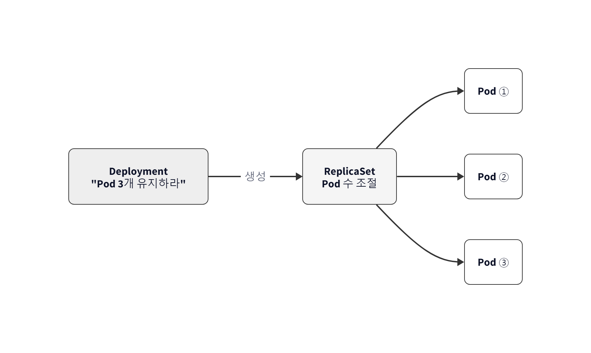

*그림 4-1 본사가 "가맹점 4개 유지"를 선언하면 시스템이 매장 개수를 자동으로 맞추는 구조*

Kubernetes도 같은 모양이었습니다. "백엔드 Pod 3개 항상 유지"라고 선언해 두면 하나가 죽어도 자동으로 새로 뜨고, 트래픽이 늘어 숫자를 5로 바꾸면 그 숫자에 맞춰 복제합니다. Compose에서는 이 일을 오픈이가 직접 해야 했는데, K8s에서는 선언 한 줄로 넘어갔습니다.

### 4.1.3 K8s 핵심 리소스 한눈에

K8s 안에서는 모든 작업 단위를 **리소스(Resource)** 라고 부릅니다. 외부 요청이 들어오면 이 리소스들을 차례로 거쳐 컨테이너에 도달합니다. 전체 흐름부터 봤습니다.

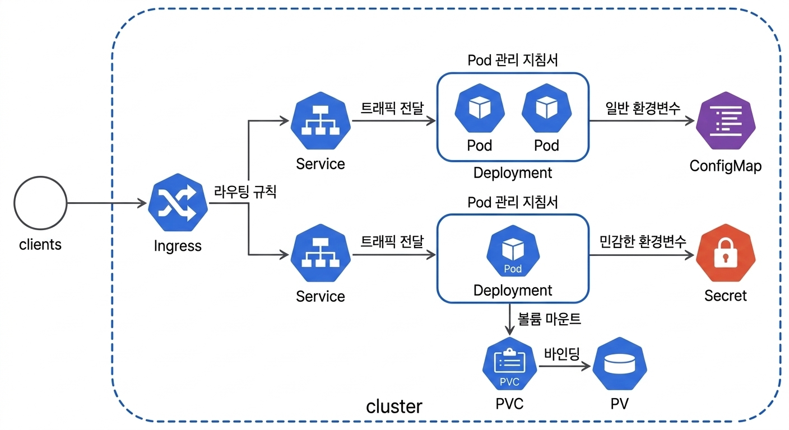

*그림 4-2 Kubernetes 핵심 리소스의 전체 구조*

각 리소스의 역할을 프랜차이즈 비유와 묶어 보면 이렇습니다.

| 리소스 | 역할 | 프랜차이즈 비유 |
|--------|------|---------------|
| **Ingress** | 외부 요청을 클러스터 안으로 라우팅하는 진입점 | 프랜차이즈 본사 안내 데스크 |
| **Service** | Pod의 IP가 바뀌어도 고정된 주소 제공 | 가맹점 대표 전화번호 |
| **Deployment** | Pod의 생성·개수 유지·업데이트 자동 관리 | 본사 운영 지침서 |
| **Pod** | 컨테이너를 실행하는 가장 작은 단위 | 가맹점 주방 |
| **ConfigMap** | 일반 설정값 저장 | 공용 메뉴판 |
| **Secret** | 비밀번호·API 키 등 민감 정보 저장 | 공용 금고 |

이번 챕터에서는 **Pod**와 **Deployment**만 먼저 다루고, 나머지는 챕터 5와 6에서 순서대로 풀어갑니다. 오늘의 목표 상 자동 복구와 스케일링·무중단 배포를 체험하려면 이 둘이 충분했습니다.

### 4.1.4 K8s 동작 원리 — 본사와 가맹점의 조직도

K8s는 크게 두 부분으로 나뉩니다. **컨트롤 플레인(Control Plane)** 과 **워커 노드(Worker Node)**. 둘이 합쳐져 움직이는 전체를 **클러스터(Cluster)** 라고 부릅니다.

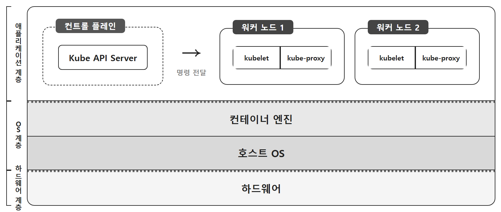

*그림 4-3 Kubernetes 클러스터의 구조*

- **클러스터**: 프랜차이즈 기업 전체. 본사와 전국 가맹점이 묶인 하나의 체계.
- **컨트롤 플레인**: 본사 관리팀. 정책을 정하고 매장 상태를 점검하고 지침을 내립니다.
- **워커 노드**: 각 가맹점. 본사의 지침대로 실제 서비스를 실행하는 현장.

> **참고: 노드(Node)**
> 컨테이너를 품고 실제로 실행하는 **컴퓨터 한 대**입니다. 물리 서버 그 자체일 수도 있고, 하이퍼바이저 가상화로 만든 VM일 수도 있습니다. 클라우드에서는 대부분 VM, 온프레미스에서는 물리 서버가 노드가 됩니다. 실제 운영에서는 수십~수백 대의 노드가 모여 하나의 클러스터를 이룹니다.

개발자가 명령을 내리면 본사 관리팀에서 접수·판단·지시가 순서대로 일어납니다.

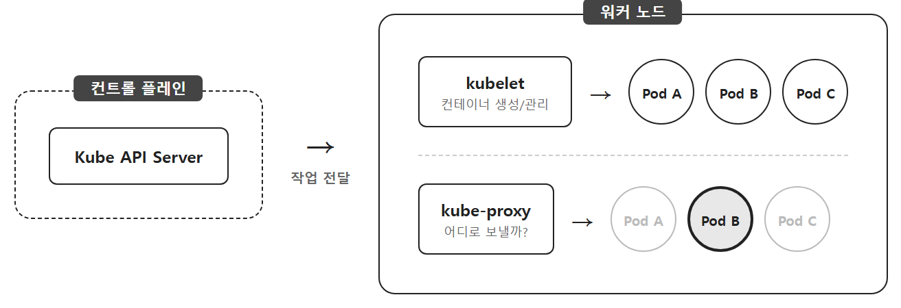

*그림 4-4 명령이 접수되어 현장으로 내려가는 흐름*

1. **접수**: 개발자의 명령이 **Kube API Server**라는 본사 대표 창구로 들어옵니다.
2. **판단**: 본사 안에서 담당자별로 일이 나뉩니다. 어느 매장에 들어설지 자리를 정하는 담당, 지침대로 운영되는지 감시하는 담당 등.
3. **실행**: 본사에서 확정된 지시가 해당 가맹점의 실무 책임자에게 전달되어 실제 운영에 반영됩니다.

각 컴포넌트의 이름까지 다 외울 필요는 없었습니다. 오픈이가 오늘 챙겨야 할 것은 "본사는 선언을 받고, 가맹점은 그 선언대로 움직인다"는 모양 하나였습니다. 내부 조직도가 궁금하다면 아래 박스만 훑어두면 됐습니다.

> **참고: 컨트롤 플레인과 워커 노드의 내부 구성**
>
> **컨트롤 플레인 (본사 관리팀)**
> - **Kube API Server**: 모든 요청이 가장 먼저 도달하는 입구 (본사 대표 창구)
> - **etcd**: 클러스터 상태를 저장하는 데이터베이스 (본사 장부)
> - **Scheduler**: 새 Pod가 뜰 노드를 자동 선정 (매장 입지 담당)
> - **Controller Manager**: 원하는 상태와 실제 상태를 비교하며 맞춤 (운영 감시 담당)
>
> **워커 노드 (가맹점)**
> - **kubelet**: 컨테이너 런타임(containerd/CRI-O 등)에 지시해 Pod를 띄우고, 상태를 본사에 보고 (현장 슈퍼바이저)
> - **kube-proxy**: Service로 들어온 요청을 해당 Pod로 라우팅하는 네트워크 규칙 관리 (배달 담당)
>
> kube-proxy 이름은 챕터 5 네트워킹에서 다시 등장합니다. 챕터 2 Docker 네트워크에서 본 `iptables`가 여기서 다시 나옵니다.

구조까지 훑었으니 이제 이 본사를 어디에 세워 실습할지가 문제였습니다. 실제 클러스터는 서버 여러 대가 필요한데, 오픈이에게는 노트북 한 대뿐이었습니다.

## 4.2 Minikube — 로컬에 세우는 작은 본사

### 4.2.1 노트북 한 대로 클러스터 흉내 내기

본사와 가맹점을 묶은 시스템이라면 서버 여러 대가 필요해 보였지만, 오늘 학습용으로는 노트북 한 대로도 충분한 도구가 있었습니다. **Minikube**입니다. 로컬 PC 한 대에서 K8s 환경을 구성할 수 있는 개발용 도구였습니다.

실제 K8s와 구조는 같은데, 개발용이라 한 가지 차이가 있었습니다. **노드가 하나**입니다. Minikube는 노트북 안에 **VM 하나**(또는 Docker 드라이버를 쓰면 **컨테이너 하나**)를 띄우고, 그 안에 컨트롤 플레인과 워커 노드 기능을 함께 집어넣습니다. 프랜차이즈 비유로 치면, 본사와 가맹점이 한 건물 안에 있는 1인 사업장이었습니다.

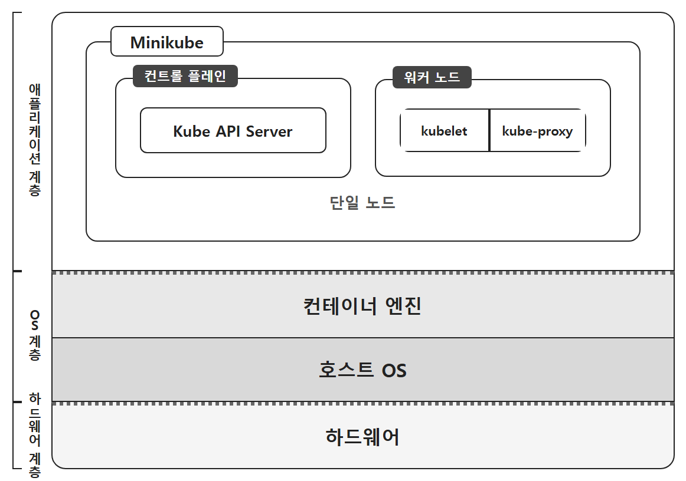

*그림 4-5 Minikube는 단일 노드 안에 본사와 가맹점 기능이 함께 들어간 구조*

단일 노드라 구조가 단순하고 리소스도 적게 듭니다. 대신 클라우드 전용 기능(로드밸런서 자동 생성, 멀티 노드 확장 등)은 지원하지 않습니다. 그래도 기본 리소스(Pod/Deployment/Service ClusterIP) 수준은 Minikube에서 잘 도는 설정을 실제 K8s 환경으로 거의 그대로 옮겨갈 수 있습니다. 오늘 오픈이의 학습 목적에는 이 정도면 충분했습니다.

> **참고: Minikube**
> Mini + Kubernetes의 합성어로, 로컬 PC에 K8s 환경을 구성하는 개발용 도구입니다. 내부적으로 컨테이너나 가벼운 가상 머신을 띄워 클러스터를 흉내 냅니다. 실습·학습 단계에서 거의 표준으로 쓰입니다.

### 4.2.2 설치와 시작

OS에 맞는 패키지 관리자로 Minikube를 설치합니다.

```bash
# Windows (관리자 권한 터미널)
choco install minikube

# Mac
brew install minikube
```

Windows는 **Chocolatey**, Mac은 **Homebrew** 패키지 관리자가 미리 설치돼 있어야 했습니다. Linux는 [Minikube 공식 문서](https://minikube.sigs.k8s.io/docs/start/)의 바이너리 설치 안내를 참고합니다.

```bash
minikube start         # 클러스터 시작
```

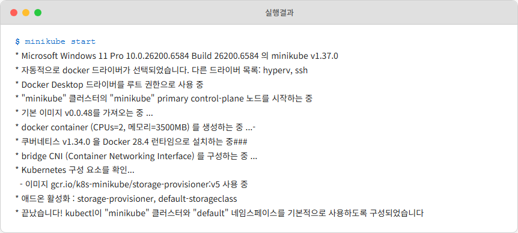

*그림 4-6 minikube start 실행 결과*

팬이 잠깐 돌았다가 조용해지면 노트북 안에 작은 본사 하나가 올라와 있는 셈이었습니다. 이제 명령을 던질 준비가 됐습니다.

### 4.2.3 자주 쓰는 Minikube 명령어

| 명령어 | 설명 |
|--------|------|
| `minikube start` | 클러스터 시작 |
| `minikube stop` | 클러스터 종료 |
| `minikube ip` | Minikube IP 확인 |
| `minikube dashboard` | 대시보드 실행 |
| `minikube service <서비스명> --url` | 서비스 접근 URL 생성 |
| `minikube addons enable ingress` | Ingress Controller 활성화 |
| `minikube tunnel` | 외부에서 내부로 접근하는 터널 생성 |

## 4.3 첫 Pod 띄우기

> 실습 YAML: https://github.com/metacoding-10-linux-docker/docker/tree/master/yaml

### 4.3.1 kubectl과 Pod

Minikube가 떴으니 이제 **kubectl**을 쓸 차례였습니다. K8s 안의 리소스를 다루는 명령줄 도구입니다. 오늘 풀려는 과제로 가는 첫 조각이 **Pod**였습니다.

Docker에서는 컨테이너가 실행의 가장 작은 단위였습니다. K8s는 조금 달랐습니다. 컨테이너를 직접 다루지 않고 **Pod**라는 껍질에 담아서 관리합니다. Pod는 **한 개 이상의 컨테이너**로 구성된 실행 단위로, Docker의 컨테이너보다 한 겹 위에 있는 단위입니다.

프랜차이즈 비유에서 Pod는 **가맹점의 주방 하나**에 해당했습니다. 주방과 그 안의 직원들이 한 덩어리로 움직이는 최소 단위입니다.

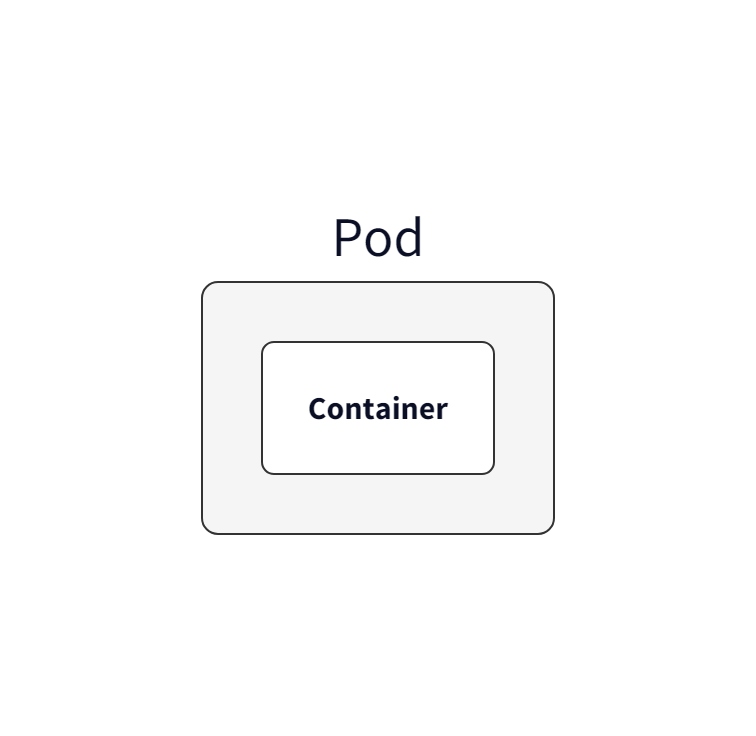

*그림 4-7 Pod는 컨테이너를 감싸는 최소 실행 단위*

> **참고: Pod의 네트워크 (두 레벨)**
>
> **1. Pod 안쪽** — 한 Pod 안의 컨테이너들은 **같은 IP를 공유**합니다. `localhost`로 서로 직접 통신합니다.
>
> **2. Pod 사이** — 클러스터에 떠 있는 **모든 Pod는 하나의 공용 네트워크**를 공유합니다. 각 Pod에 고유한 IP가 할당되고, Pod끼리는 이 네트워크를 통해 서로를 부릅니다. 챕터 2의 **docker0**(푸드코트 홀)가 노트북 한 대 안의 홀이었다면, Pod 네트워크는 클러스터 전체에 펼쳐진 더 큰 홀이라고 생각하면 됩니다. 이 네트워크의 정식 이름과 동작은 챕터 5에서 다시 등장합니다.
>
> Docker에서는 컨테이너가 네트워크 단위였다면, Kubernetes에서는 **Pod가 네트워크 단위**입니다.

### 4.3.2 명령어로 Pod 하나 만들기

가장 빠른 방법은 `kubectl run` 명령이었습니다.

```bash
kubectl run hello-pod1 --image=nginx   # nginx 이미지로 Pod 생성
```

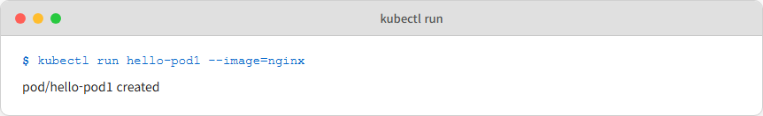

*그림 4-8 kubectl run으로 Pod 생성*

### 4.3.3 YAML로 Pod 만들기

같은 결과를 **YAML 파일**로도 쓸 수 있었습니다. 파일로 남겨두면 같은 Pod를 반복해서 만들 수 있고, 팀에 공유하기도 쉬웠습니다. K8s는 대부분 YAML로 리소스를 정의합니다. 오픈이가 앞으로 다룰 리소스들도 전부 이 방식이었습니다.

**yaml/hello-pod2.yml**
```yaml
apiVersion: v1
kind: Pod                 # 리소스 종류
metadata:
  name: hello-pod2        # 리소스명
spec:
  containers:
    - name: hello-container
      image: nginx:1.20        # 이미지
```

```bash
kubectl apply -f hello-pod2.yml   # YAML로 Pod 생성
```

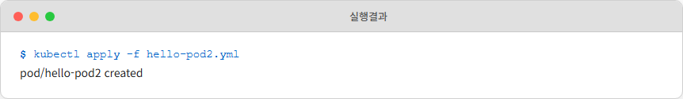

*그림 4-9 kubectl apply로 Pod 생성*

### 4.3.4 Pod 조회

```bash
kubectl get pod   # Pod 목록 조회
```

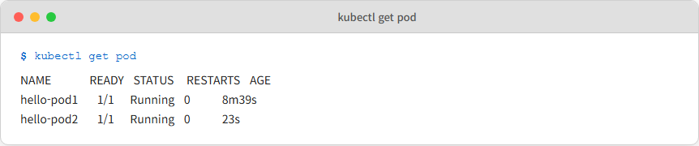

*그림 4-10 Pod 목록 조회 결과*

STATUS 칸에 `Running`이 찍혀 있으면 주방 두 개가 가동 중이라는 뜻이었습니다.

### 4.3.5 자주 쓰는 kubectl 명령어

| 명령어 | 설명 |
|--------|------|
| `kubectl apply -f <파일>` | YAML로 리소스 생성/업데이트 |
| `kubectl get <리소스>` | 리소스 목록 조회 |
| `kubectl describe <리소스> <이름>` | 리소스 상세 정보 |
| `kubectl delete <리소스> <이름>` | 리소스 삭제 |
| `kubectl exec -it <Pod명> -- bash` | Pod 내부 접속 |
| `kubectl logs <Pod명>` | Pod 로그 확인 |

Pod는 떴는데, 오늘의 목적 중 "자동 복구"와는 아직 거리가 있었습니다. 이 Pod가 죽으면 어떻게 될지가 다음 질문이었습니다.

## 4.4 Deployment — 자동 복구와 스케일링

### 4.4.1 Pod 하나를 직접 만들면 생기는 문제

방금 만든 Pod가 죽으면 어떻게 되는지부터 확인했습니다. 직접 지워봤습니다.

```bash
kubectl delete pod hello-pod1
kubectl get pod
```

`hello-pod1`은 그냥 사라졌습니다. 목록에서 지워졌고, 아무도 다시 살려주지 않았습니다. 프랜차이즈 비유로 보면 가맹점 하나가 문을 닫았는데 본사가 "그럴 수도 있지" 하고 넘기는 상황이었습니다. 본사에 **"이 자리는 항상 매장이 있어야 한다"** 는 지침이 없기 때문이었습니다. K8s도 같았습니다. Pod를 직접 만들면 그건 **일회성 주방**이라, 죽어도 아무도 책임지지 않았습니다.

필요한 건 "매장이 항상 n개 있어야 한다"고 선언해 둔 지침서였습니다. 그 지침서 역할을 하는 리소스가 **Deployment**. 오늘 대목표의 중심축이 여기에 있었습니다.

### 4.4.2 Deployment — 본사의 지침서

Deployment는 Pod의 생성·개수 유지·업데이트를 자동으로 관리하는 리소스입니다. "Pod 몇 개 유지, 문제 생기면 갈아 끼워라"를 써두는 본사 매뉴얼입니다.

**yaml/deploy-ex01.yml**
```yaml
apiVersion: apps/v1
kind: Deployment
metadata:
  name: nginx-deploy
spec:                    # pod에 대한 하는 상태 지정
  replicas: 1            # 생성할 pod 수 지정
  selector:
    matchLabels:
      app: nginx         # 라벨이 app : nginx인 pod를 관리
  template:
    metadata:
      labels:
        app: nginx       # pod에 붙일 라벨
    spec:
      containers:
        - name: nginx-container
          image: nginx:1.20
```

핵심 개념이 하나 있었습니다. **selector와 labels의 매칭**입니다. Deployment의 `selector`에 `app: nginx`라고 적어두면, 그 라벨을 가진 Pod만 이 Deployment의 관리 대상이 됩니다. 본사가 "우리 브랜드 간판 단 매장만 관리한다"고 지정하는 방식과 같았습니다.

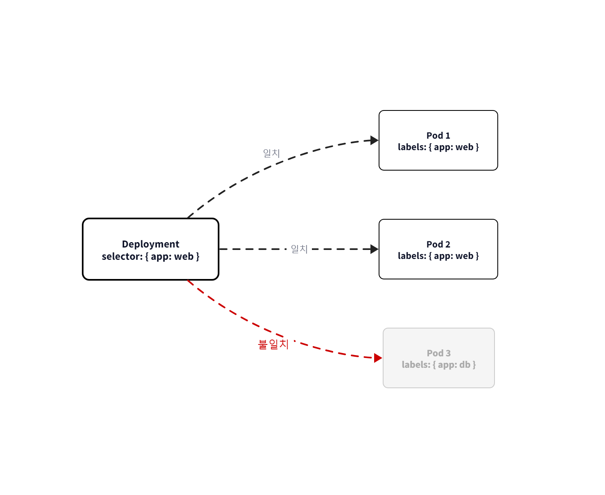

*그림 4-11 selector가 지정한 라벨(app: nginx)을 가진 Pod만 골라 관리, 다른 라벨은 건드리지 않음*

```bash
kubectl apply -f deploy-ex01.yml   # Deployment 생성
kubectl get pod                    # Pod 목록
```

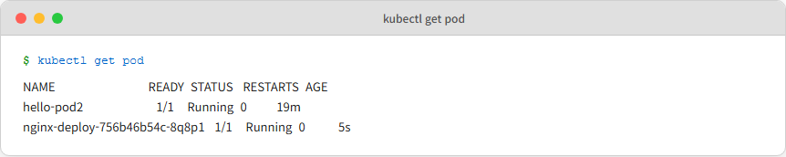

*그림 4-12 Deployment가 만든 Pod가 뜬 모습*

이번에는 자동 복구를 확인할 차례였습니다. Pod를 전부 지웠습니다.

```bash
kubectl delete pod --all
kubectl get pod
```

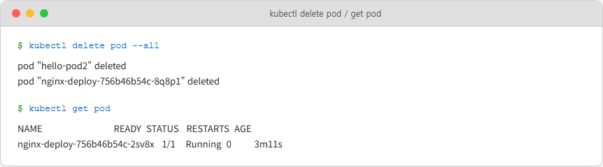

*그림 4-13 Pod를 다 지워도 Deployment가 자동으로 새 Pod를 띄운다*

`hello-pod2`는 그대로 사라졌지만, Deployment가 만든 Pod는 잠깐 사라졌다가 **새 이름으로 다시 올라와** 있었습니다. Deployment에 "Pod 1개 유지"라고 선언해 뒀기 때문에, 죽으면 시스템이 알아서 새로 만든 겁니다. 이번 챕터의 목적 중 절반이 여기서 확인됐습니다. Compose에서 오픈이가 수동으로 살리던 일을 이 한 줄 선언이 대신하는 셈이었습니다.

> **참고: Deployment**
> Pod를 직접 만들기보다 Deployment로 만드는 것이 일반적입니다. Pod 생성뿐 아니라 개수 유지와 장애 복구까지 자동으로 처리되기 때문입니다. selector가 관리 대상을 선택하고, template이 찍어낼 Pod의 틀을 정의합니다.

다음 실습을 위해 Deployment를 정리했습니다.

```bash
kubectl delete deployment nginx-deploy
```

### 4.4.3 ReplicaSet — 개수를 맞춰주는 손

Pod를 1개가 아니라 여러 개 유지하고 싶다면 `replicas`를 올리면 됩니다. 이 역할을 담당하는 친구가 **ReplicaSet**. Deployment가 자동으로 생성해서 관리하는 리소스였습니다. 오늘 풀려는 과제 중 또 한 축인 **스케일링**이 이 지점에서 손에 잡힙니다.

에어컨 자동 온도 조절과 비슷했습니다. 24도로 맞춰 두면 방이 더워지면 냉방을 켜고 서늘해지면 끕니다. ReplicaSet도 **현재 Pod 개수**와 **원하는 Pod 개수**를 계속 비교해, 부족하면 만들고 많으면 지웁니다.

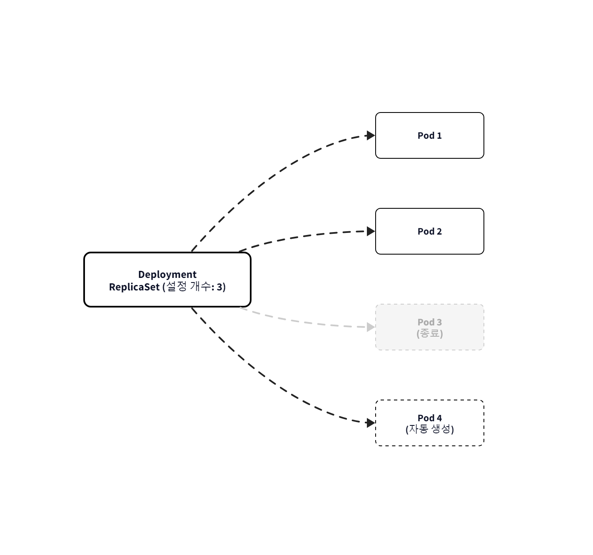

*그림 4-14 Pod 하나가 종료되면 ReplicaSet이 설정 개수를 맞추기 위해 새 Pod를 자동 생성*

Pod 4개를 유지하는 Deployment를 써봤습니다.

**yaml/deploy-ex02.yml**
```yaml
apiVersion: apps/v1
kind: Deployment
metadata:
  name: nginx-replica
spec:
  replicas: 4            # pod 수 지정

  strategy:
    type: RollingUpdate  #  롤링 업데이트 전략
    rollingUpdate:
      maxSurge: 4        # 업데이트 중 최대 4개까지 추가 생성
      maxUnavailable: 0  # 기존 Pod를 먼저 종료하지 않음 (무중단 배포)

  selector:              # 라벨이 app: nginx 인 pod를 관리
    matchLabels:
      app: nginx
  template:
    metadata:
      labels:
        app: nginx       # pod에 붙일 라벨
    spec:
      containers:
        - name: nginx-container
          image: nginx:1.20
```

```bash
kubectl apply -f deploy-ex02.yml
kubectl get pod
```

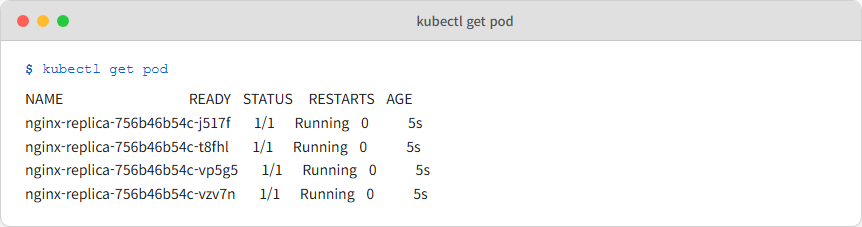

*그림 4-15 replicas 설정대로 Pod 4개가 생성*

`replicas` 숫자 하나만 바꾸면 시스템이 개수를 맞췄습니다. 트래픽이 늘면 숫자를 올리고, 한가해지면 내리면 됐습니다. 어제 Compose에서 수동으로 올려야 했던 작업이 이 한 줄로 축약된 겁니다.

> **참고: ReplicaSet**
> Deployment가 내부적으로 생성·관리하는 리소스로, 실제 Pod 개수 유지의 실행 주체입니다. 사용자는 보통 ReplicaSet을 직접 만들지 않고 Deployment를 통해 관리합니다.

### 4.4.4 롤링 업데이트 — 끊김 없이 새 버전으로

남은 마지막 축이 **무중단 배포**였습니다. 기존 Pod를 한꺼번에 내리고 새 Pod를 올리면 그 사이에 서비스가 멈춥니다. **롤링 업데이트**는 새 Pod를 먼저 띄운 뒤 기존 Pod를 순차적으로 교체하는 방식입니다.

위 YAML의 `strategy` 블록이 그 설정입니다.

- **maxSurge**: 업데이트 중 정원(`replicas`)을 초과해 추가로 띄울 수 있는 Pod 수
- **maxUnavailable**: 업데이트 중 Ready 상태가 아니어도 허용되는 Pod 수

이 예제의 설정(`replicas: 4, maxSurge: 4, maxUnavailable: 0`)이면 기존 Pod 4개는 그대로 두고 새 버전 Pod가 추가로 올라옵니다. 새 Pod가 `Ready` 상태가 된 뒤에야 기존 Pod가 내려갑니다. `maxUnavailable: 0`이라 항상 최소 4개가 서비스 중입니다. 요청이 끊기지 않았습니다.

이미지 버전을 올려 봤습니다.

```bash
kubectl set image deployment/nginx-replica nginx-container=nginx:1.21
```

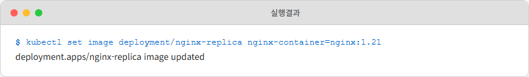

*그림 4-16 이미지 버전 업데이트 실행*

업데이트 진행을 실시간으로 보면 새 Pod가 먼저 올라오고, 그 뒤에 기존 Pod가 내려가는 순서가 눈에 들어왔습니다.

```bash
kubectl get pod -w   # Pod 상태 실시간 감시
```

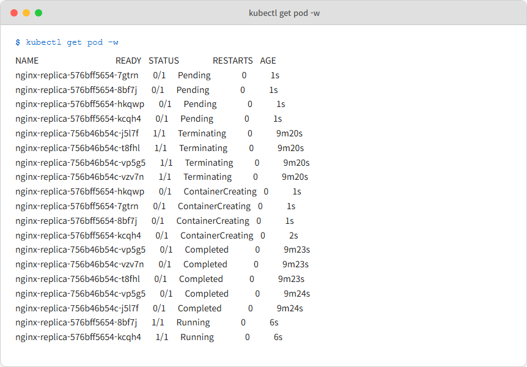

*그림 4-17 롤링 업데이트 진행 화면*

> **참고: RollingUpdate 전략**
> K8s Deployment의 기본 배포 전략입니다. `maxSurge`와 `maxUnavailable` 두 값으로 "몇 개를 더 띄울 수 있는지", "몇 개까지 사용 불가능해도 되는지"를 조정합니다. `maxUnavailable: 0`으로 두면 완전 무중단 배포가 됩니다.

오늘 대목표였던 자동 복구·스케일링·무중단 배포가 여기까지로 Pod와 Deployment 선언만으로 손에 들어온 상태였습니다.

### 4.4.5 Rollback — 되돌리기

배포 뒤에 문제가 발견되면 이전 버전으로 되돌리면 됐습니다.

```bash
kubectl rollout history deployment/nginx-replica   # 배포 이력 조회
kubectl rollout undo deployment/nginx-replica      # 이전 버전으로 롤백
```

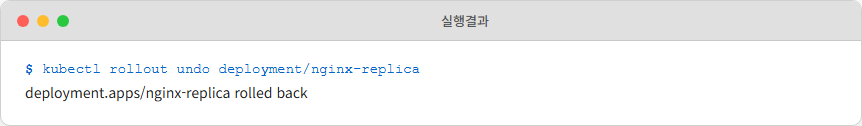

*그림 4-18 Rollback 실행 결과*

배포했다가 빠르게 되돌리는 일이 명령 두 줄로 끝났습니다.

### 4.4.6 Pod IP는 매번 바뀐다

오늘 걸어둔 숙제 대부분이 해결된 것 같았지만, 되살아난 Pod를 들여다보니 새 문제가 하나 걸렸습니다. **이름과 IP가 매번 달라져** 있었습니다.

```bash
kubectl get pod -o wide   # Pod별 IP 함께 조회
```

Pod별로 다른 IP가 찍혔습니다. 첫 번째 Pod를 지우고 다시 조회해 보니, 자리를 채우는 새 Pod의 IP가 이전 번호와 달라져 있었습니다. Pod 개수는 그대로 유지되지만, **주방 전화번호가 계속 바뀌는** 상황이었습니다.


*그림 4-19 Pod가 재생성될 때마다 IP가 변경되는 모습*

프론트엔드 Pod가 백엔드 Pod를 부르려면 어떤 주소로 부를까. IP라면, 백엔드 Pod가 한 번 죽고 다시 태어날 때마다 프론트의 설정을 고쳐야 한다는 이야기가 됩니다. 이 상태로는 실제 서비스에 쓸 수 없었습니다.

자동 복구·스케일링·무중단 배포는 손에 들어왔지만, **브라우저에서 내 앱에 안정적으로 접속 가능한 상태**는 아직 먼 얘기였습니다. 가맹점 주방이 바뀌어도 손님이 늘 거는 **대표 전화번호**가 필요했습니다. 그게 다음 챕터의 주제인 **Service**의 역할이었습니다.

실습을 마치며 Deployment를 정리했습니다.

```bash
kubectl delete deployment nginx-replica
```

## 이것만은 기억하자

- **Compose는 "지금 이대로", Kubernetes는 "이 상태를 유지해라".** 선언형 관리가 K8s의 핵심입니다. 원하는 상태를 써두면 시스템이 계속 맞춥니다.
- **K8s는 프랜차이즈 본사 구조입니다.** 컨트롤 플레인이 본사, 워커 노드가 가맹점. 본사가 지침을 내리면 가맹점이 실행합니다.
- **Pod는 실행의 최소 단위.** K8s에서 컨테이너는 Pod라는 껍질에 담겨 움직입니다.
- **Pod를 직접 만들지 마세요.** 죽으면 아무도 살려주지 않습니다. Deployment로 감싸야 본사의 관리 아래 들어갑니다.
- **label은 K8s의 연결 고리입니다.** Deployment가 selector로 Pod를 관리하듯, 다음 장에서 만날 Service도 label로 Pod를 찾아 연결합니다.
- **롤링 업데이트로 무중단 배포.** 새 Pod를 먼저 띄우고 기존 Pod를 순차 교체하는 방식이 기본 전략입니다.

오늘 대목표였던 자동 복구·스케일링·무중단 배포까지는 손에 잡혔습니다. 하지만 되살아난 Pod의 IP는 매번 바뀝니다. 다음 챕터에서 **Service**와 **Ingress**로 "브라우저에서 안정적으로 접속 가능한 상태"를 만드는 일이 이어집니다.
