# Ch.5 Kubernetes 네트워킹

다음 날 아침, 사무실 자리에 앉은 오픈이는 어제 띄웠다 정리한 Pod 네 개를 떠올렸습니다. 같은 서버가 네 대나 돌아가고, 하나가 죽어도 세 대가 버텨주며, 롤링 업데이트로 새 버전까지 끊김 없이 올라가던 모습이 아직 머릿속에 선명했습니다. 모니터에 나란히 찍혀 있던 네 줄의 'Running' 상태가 식어 가는 커피잔 너머에서 꽤 든든해 보였던 기억이었습니다.

*'그런데... 이제 이걸 어떻게 사용해야 하지?'*

네 대의 Pod를 만들어 놓았지만 실제 요청을 어느 주소로 보내야 할지가 애매했습니다. Pod마다 IP가 다를 텐데, 동일한 Nginx 백엔드임에도 어느 쪽으로 요청을 보내야 할지 감이 오지 않았습니다.

게다가 어제 마지막에 확인했던 'Pod는 새로 실행될 때마다 IP가 매번 바뀐다'는 특징이 마음에 걸렸습니다. 오늘 이 네 개의 IP 중 하나를 골라 두어도, 그 주소가 내일도 같은 Pod를 가리킨다는 보장이 없었습니다.

**팀장**: "IP 외워 두고 쓰려는 거 아니지?"

뒤쪽 자리에서 툭 던진 한마디가 방금 전의 의심을 그대로 짚어 주었습니다. 네 대의 Pod 앞에서 요청을 대신 받아 주고, 뒤에서 Pod가 죽고 태어나든 바깥쪽 주소는 바꾸지 않는 고정된 진입점이 필요했습니다.

## 5.1 Service — Pod의 직통 전화번호

챕터 2에서 한 호스트 안의 푸드코트로 그렸던 컨테이너 네트워크가, 이번 챕터에서는 클러스터 규모로 다시 그려집니다. 첫 단추는 매번 흔들리는 Pod IP를 대신해 주는 고정 주소였습니다.

### 5.1.1 흔들리지 않는 주소, Service

이런 역할을 해 줄 리소스가 분명 어딘가에 있을 것 같았습니다. 어제 쿠버네티스 리소스를 표로 훑을 때 스쳐 갔던 한 줄이 떠올랐습니다. Service였습니다. 서버 주소가 바뀌어도 변하지 않는 고정 주소를 제공한다고 적혀 있던 리소스였습니다. 그땐 그냥 넘겼지만, 지금 보니 오픈이가 찾던 바로 그 기능이었습니다.

문서를 다시 확인해 보니 Pod는 일시적인 자원이라 IP가 언제든 바뀔 수 있으며, Service는 그 앞에 변하지 않는 네트워크 진입점을 두어 라벨(Label)로 묶인 여러 Pod에 들어온 요청을 분산시킨다는 내용이었습니다.

가맹점 안에서 직원이 교대 근무를 해도 고객은 직통 전화번호 하나로 주문을 할 수 있는 것과 같습니다. Service는 쿠버네티스 안에서 바로 그 전화번호 역할을 수행합니다.

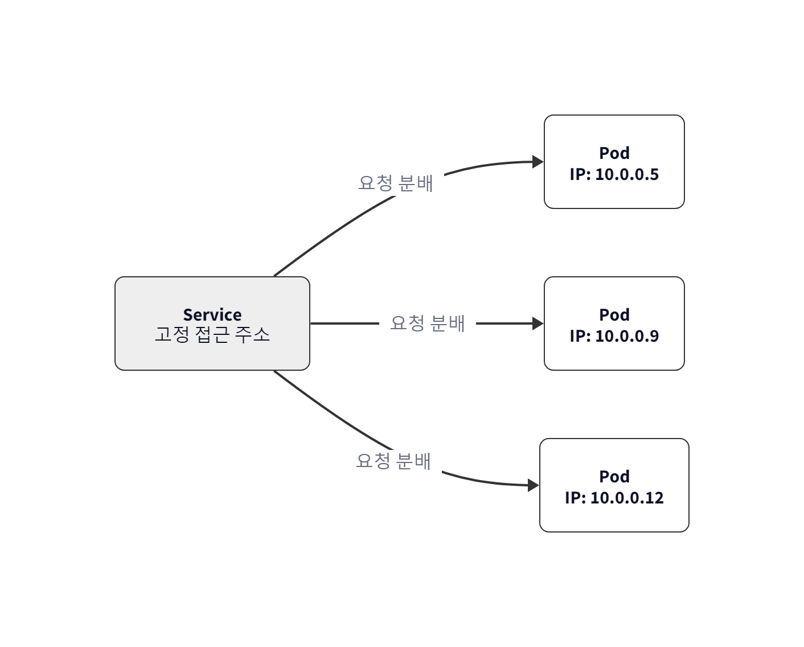

*Service는 고정 주소를 제공. Pod IP가 바뀌어도 Service 주소는 그대로*

> **참고: Service**
>
> Pod 앞단의 고정 접근점입니다. Pod가 삭제되고 다시 생성되어 IP가 바뀌어도 Service 주소는 바뀌지 않습니다. 뒤에 여러 Pod가 연결되어 있으면 요청을 골고루 나누어 주는 로드밸런싱 기능을 수행합니다.

### 5.1.2 Service 생성

Service를 실습하려면 대상이 되는 Pod들이 먼저 준비되어야 합니다. 오픈이는 어제 연습하며 작성했던 deploy-ex02.yml을 다시 실행하여 Pod 네 개를 복구했습니다.

```bash
kubectl apply -f deploy-ex02.yml   #  Pod 4개 생성
```

이제 그 앞에 세울 Service YAML로 넘어갑니다.

**yaml/service-ex01.yml**
```yaml
apiVersion: v1
kind: Service
metadata:
  name: nginx-service
spec:
  type: NodePort        # 노드 IP+포트로 외부 접근 가능한 타입
  selector:
    app: nginx          # 이 라벨을 가진 Pod를 뒤에 붙임
  ports:
  - port: 80            # Service 내부 포트 (클러스터 안에서 부를 때)
    targetPort: 80      # Pod(컨테이너)가 듣고 있는 포트
    nodePort: 30080     # 노드 IP로 외부에서 접근할 때 열리는 포트 (30000~32767)
```

Service가 Pod를 찾는 방법은 Deployment와 동일하게 라벨(Label) 매칭 방식을 사용합니다. IP 주소가 아니라 라벨로 연결하기 때문에, Pod가 새로 생성되어 IP가 바뀌더라도 라벨만 일치하면 Service는 요청을 정확히 전달할 수 있습니다.

### 5.1.3 Service 타입 — 접근 범위의 결정

오픈이는 YAML을 작성하며 포트 설정 부분에서 잠시 멈췄습니다. 

*'type: NodePort 이건 뭐지 ? 그리고 포트를 80번을 썼는데, targetPort도 있고 nodePort도 있네. 각각 어떤 역할을 하는거지'*

찾아보니 Service에는 '누구에게 공개할 것인가'에 따라 세 가지 타입을 선택할 수 있었습니다.

가족끼리 집 안에서만 대화할 때는 **ClusterIP** , 초대받은 고객에게 현관 비밀번호를 알려줄 때는 **NodePort** , 그리고 누구나 자유롭게 드나들도록 정문을 활짝 열어줄 때는 **LoadBalancer** 를 선택하면 됩니다.

#### ClusterIP

서비스 타입의 기본값으로 설정되는 타입입니다. 외부에서는 접근이 불가능하고 클러스터 내부의 Pod끼리만 서로를 부를 때 사용합니다.

*'백엔드 서버만 DB에 접속하면 되지, 굳이 외부 고객에게 DB 주소를 알려줄 필요는 없잖아? 그런 용도로 사용하는 타입이네.'*

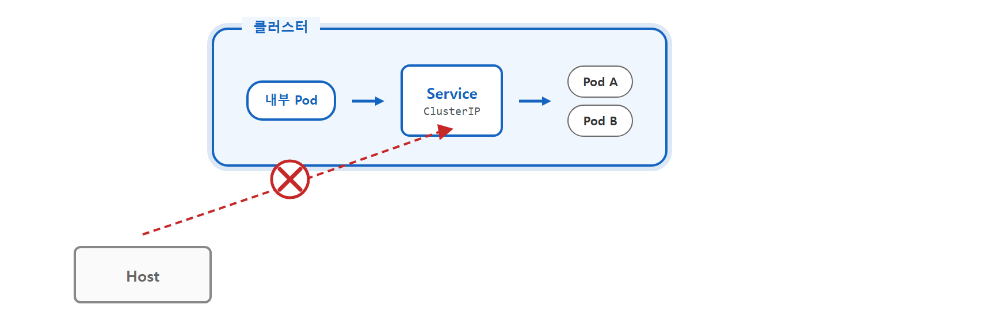

*ClusterIP — 외부 요청은 닿지 못하고 내부 Pod끼리만 통신*

#### NodePort 

오픈이가 실습에서 썼던 방식으로, 노드(서버)의 실제 IP에 특정 포트를 열어 외부 접근을 허용합니다.

*'YAML에 30080처럼 nodePort를 넣으면 이 포트로 외부에서 들어올 수 있는 거구나. 그런데 서비스마다 이런 노드포트를 하나씩 열어 주면 금방 관리가 번거로워지겠는데...'*

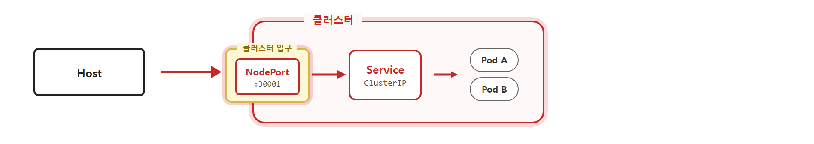

*NodePort — 노드의 특정 포트로 외부 접근 허용*

#### LoadBalancer 

실제 운영 환경에서 주로 쓰는 방식입니다. 클라우드 서비스(AWS, GCP 등)를 쓰고 있다면, K8s가 알아서 외부용 공인 IP를 발급받아 서비스에 딱 붙여줍니다.

사용자는 복잡한 노드 IP나 5자리의 포트 번호를 외울 필요가 없습니다. 그저 발급된 대표 IP 하나로 접속하면, LoadBalancer가 여러 노드에 트래픽을 골고루 나눠줍니다.

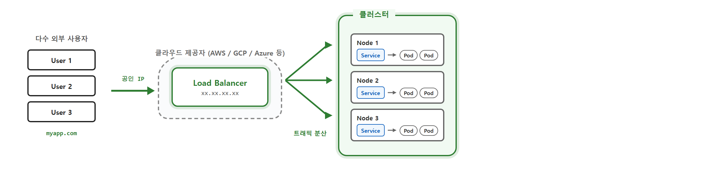

*LoadBalancer — 클라우드가 공인 IP를 발급하고 여러 노드에 분산*

오픈이는 서비스 타입과 포트를 다음과 같이 정리했습니다.

| 타입 | 접근 범위 | 사용 사례 |
|------|----------|----------|
| **ClusterIP** | 클러스터 내부만 | 백엔드·DB 등 외부 노출 불필요한 서비스 |
| **NodePort** | 노드IP:포트로 외부 접근 가능 | 테스트, 개발 환경 |
| **LoadBalancer** | 공인 IP로 외부 접근 가능 | 클라우드 운영 환경 |

| 포트 종류 | 누구의 포트인가 | 역할 | 생략 시 |
|----------|----------------|------|--------|
| **nodePort** | **노드(서버) 입장**의 포트 | 외부에서 노드 IP로 접근할 때 열리는 30000~32767 포트 | 30000~32767 중 자동 할당 |
| **port** | **Service 입장**의 포트 | 클러스터 내부에서 Service를 부를 때 쓰는 포트 | 생략 불가 (필수) |
| **targetPort** | **Pod(컨테이너) 입장**의 포트 | 실제 컨테이너 안 애플리케이션이 듣고 있는 포트 | `port` 값과 동일하게 설정 |


### 5.1.4 외부에서 Service 접속해 보기

오픈이는 작성한 YAML을 적용했습니다.

```bash
kubectl apply -f service-ex01.yml
```

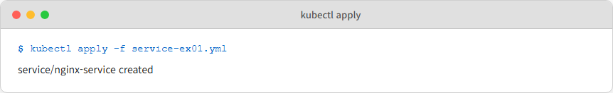

*Service 생성*

*'아, 그러니까 이 Service가 NGINX처럼 고정된 입구 역할을 해준다는 거지?'*

하지만 여기서 오픈이는 부딪힙니다. 

*'분명 노드포트를 30080로 열었는데 localhost:30080으로 치니 먹통이네. minikube가 내 노트북이랑 한 꺼풀 떨어져 있어서 그런 건가...'*

 Minikube라는 가상 세계와 우리 PC가 별도의 네트워크로 분리되어 있기 때문입니다. 이를 해결하기 위해 Minikube는 임시 통로를 뚫어주는 전용 명령어를 제공합니다.

| 방법 | 명령어 |   설명   |
|--------|------|------|
| URL 생성 | `minikube service <서비스이름> --url` | NodePort 혹은 LoadBalancer 타입의 Service에 접근할 수 있는 URL을 생성|
| 터널 개방 | `minikube tunnel` | LoadBalancer 타입의 Service에 외부 IP를 부여 |
| 포트 포워딩 | `kubectl port-forward service/<서비스이름> 8080:80` | 호스트의 8080 포트를 Service의 80 포트로 포워딩 |


> 참고: Minikube는 왜 localhost로 안 닿는가
>
> Minikube는 내 컴퓨터 내부에서 독립적으로 실행되는 가상 환경(VM 또는 컨테이너)입니다. 즉, Minikube라는 가상 세계와 우리 PC라는 현실 세계가 별도의 네트워크로 분리되어 있습니다. 그래서 도커에서 포트포워딩으로 호스트 PC와 컨테이너를 연결했던 것처럼, Minikube와 통신할 수 있는 다른 방법이 있어야 합니다.

오픈이는 이 중 **minikube service --url** 을 사용했습니다. NodePort로 열어둔 서비스이니, 접근할 수 있는 주소만 하나 받아오면 브라우저에서 바로 확인할 수 있습니다.

```bash
minikube service nginx-service --url   # Service 접근 URL 생성
```

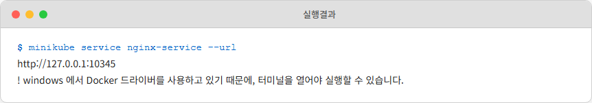

*minikube service URL 생성*

명령을 치자 터미널에 URL 한 줄이 나타나더니 커서가 그대로 멈춰 섰습니다.

*'어? 왜 프롬프트가 안 나오지? 고장 났나?'*

잠깐 당황했지만, 이 명령은 터미널을 계속 붙잡고 있어야 통로가 유지되는 방식이라는 걸 깨달았습니다. 생성된 URL을 복사해 브라우저에 입력하자, 드디어 기다리던 NGINX 화면이 나타났습니다.


*브라우저에서 nginx 접속 확인*

확인이 끝났으니 이제 CTRL + C를 눌러 열려 있던 통로를 닫았습니다. 이제 테스트해 볼 것은 **Pod가 죽어도 Service가 고정 진입점 역할을 제대로 해주는가** 입니다.

오픈이는 Service가 새 Pod로 연결을 잘 넘겨주는지 확인하기 위해, 현재 실행 중인 모든 Pod를 삭제했습니다.

```bash
kubectl delete pod --all
minikube service nginx-service --url
```

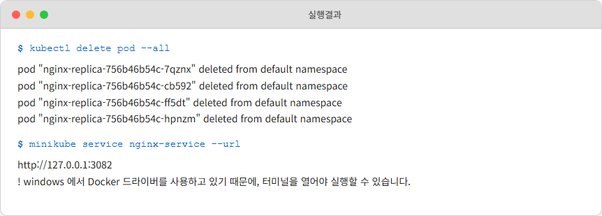

*Pod 삭제 후 Service 접속*

잠시 후 다시 생성된 주소로 브라우저에 접속했습니다. 결과는 예상대로였습니다. Pod가 새로 바뀌었음에도 Nginx 페이지가 표시되었습니다. Service가 고정된 진입점 역할을 충실히 수행하고 있음을 확인했습니다.

*'와, 진짜네. Pod가 새로 만들어지면 IP가 바뀌었을 텐데. Service가 뒤에서 주소를 알아서 연결해주는구나.'*

## 5.2 Ingress — 프랜차이즈 공식 앱

### 5.2.1 왜 Service만으로는 부족한가

Service 덕분에 Pod를 안정적으로 찾아가는 길은 확보했습니다. 오픈이는 뿌듯한 마음으로 동료들에게 자랑했지만, 곧바로 예상치 못한 피드백이 돌아왔습니다.

**동료**: "오픈아, 근데 접속할 때마다 이 포트 번호를 외워서 입력해야 돼? 주소만 딱 주면 안 돼?"

**팀장**: "Service만으로는 URL 경로까지는 못 나눠 주지. 도메인으로 들어온 요청을 경로별로 갈라 주는 친구는 따로 있어."

오픈이는 다시 고민에 빠졌습니다. 도메인 주소를 통해 사용자에게 서비스를 제공하고 싶었지만, Service는 경로별로 트래픽을 분류하는 기능이 없었기 때문입니다.

*'팀장님이 "경로별로 갈라 주는 친구"라고 했지. 쿠버네티스 도메인 라우팅... 한번 찾아보자.'*

검색 끝에 찾아낸 정답이 바로 **Ingress** 입니다.

### 5.2.2 Ingress — 프랜차이즈 공식 앱

직통 번호가 있으면 가맹점으로 주문을 할 수 있습니다. 하지만 프랜차이즈가 커지면서 강남점, 홍대점, 판교점처럼 지점이 늘어나면 이야기가 달라집니다. 고객이 주문할 지점의 전화번호를 하나하나 찾아서 전화하기는 어렵습니다.

이때 본사가 **공식 앱**을 하나 만들면 어떨까요. 고객은 앱을 열어 근처 지점을 검색하거나, 원하는 메뉴를 주문하면 앱이 알아서 적절한 지점으로 연결해 줍니다. 전화번호를 외울 필요없이 공식 앱을 통하면 됩니다.

Ingress가 바로 이 공식 앱 역할을 합니다. 고객이 `http://도메인/order`로 접속하면 주문 Service로, `http://도메인/stores`로 접속하면 매장 Service로 나눠 보냅니다. 

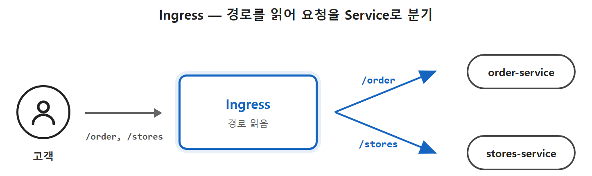

*Ingress가 도메인과 경로를 읽어 요청을 적절한 Service로 연결하는 구조*

> **참고: Ingress**
>
> 클러스터 외부의 HTTP/HTTPS 요청을 도메인과 URL 경로 기준으로 내부 Service에 연결하는 라우팅 규칙입니다. Service가 개별 Pod 그룹의 고정 주소를 제공한다면, Ingress는 여러 Service를 하나의 진입점으로 묶어 줍니다.

*'아, 이게 팀장님이 말한 "경로별로 갈라 주는 친구"구나. 가맹점 번호를 일일이 알려주는 대신, 공식 앱 하나로 다 연결하는 거네.'*

비유만으로는 실감이 오지 않았습니다. 오픈이는 바로 Minikube에 인그레스를 실행 해보기로 했습니다. 

### 5.2.3 공식 앱 실행하기

공식 문서의 인그레스 페이지를 펼쳐 읽어 내려가려던 중, 문서 첫 줄이 오픈이의 눈에 걸렸습니다.

> "인그레스 컨트롤러가 있어야 인그레스를 충족할 수 있다. 인그레스 리소스만 생성한다면 효과가 없다."

*'이게 무슨 말이지? 인그레스를 만들려는 건데, 인그레스 컨트롤러라는 게 또 따로 있어야 한다고?'*

Ingress는 사실은 YAML 파일에 라우팅 규칙을 작성하는 **Ingress 리소스** 와 외부 요청을 받아서 처리하는 **Ingress 컨트롤러** 두 가지 구성 요소로 이루어져 있습니다. 

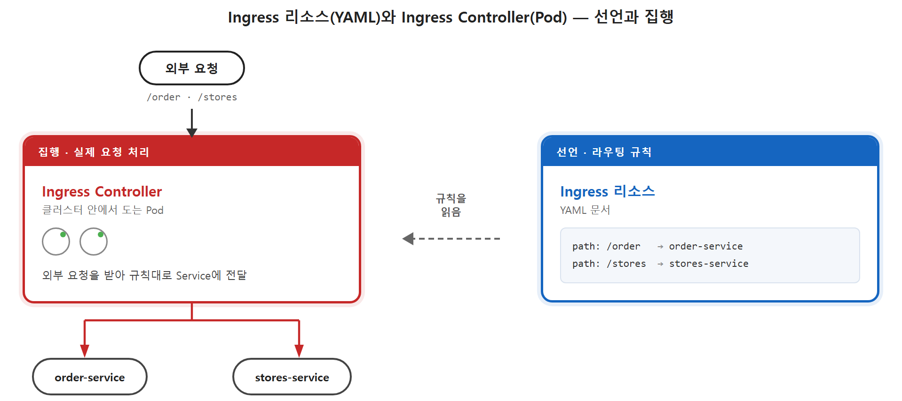

*Ingress 리소스(YAML, 선언)와 Ingress Controller(Pod, 집행) — 선언과 집행의 분리*

| 구성 요소 | 역할 | 비유 | 쿠버네티스 철학 |
|-----------|------|------|----------------|
| **Ingress 리소스** | 어떤 도메인과 URL 경로의 요청을 어떤 Service로 보낼지 정의한 규칙 (YAML) | 공식 앱의 라우팅 규칙 | **선언** |
| **Ingress Controller** | 실제로 외부 요청을 받아 처리하는 소프트웨어 | 규칙을 실행하는 공식 앱 | **집행** |

*'아, 규칙만 적어 둔다고 알아서 굴러가는 게 아니구나. 그 규칙을 읽고 실제로 실행해 주는 역할이 따로 필요한 거네.'*

이제 오픈이가 실습으로 풀어 갈 순서가 머릿속에 그려졌습니다. 아직 없는 **공식 앱(Ingress Controller)** 부터 실행하고, 그 앱이 연결해 줄 백엔드 두 개를 띄운 다음, 라우팅 규칙을 YAML로 적어 길을 안내하고, 마지막으로 브라우저로 두 경로가 각자 다른 가맹점에 닿는지 확인하는 흐름이었습니다.

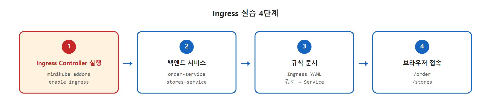

*Ingress 실습 4단계*

오픈이는 Minikube에서 Ingress 컨트롤러를 활성화했습니다.

```bash
minikube addons enable ingress          # Ingress Controller 애드온 활성화
```

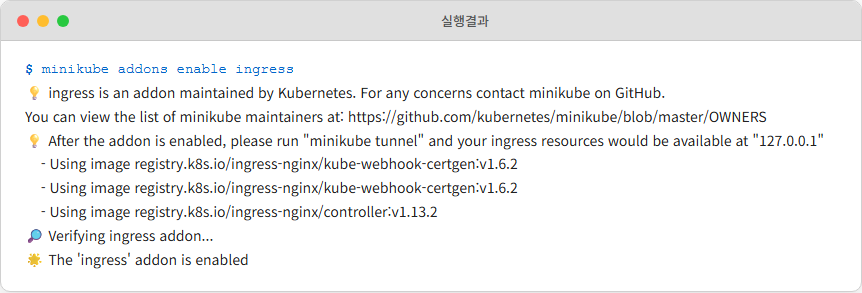

*minikube에서 ingress 애드온 활성화*

활성화가 끝나자 `ingress-nginx` 네임스페이스에 컨트롤러 Pod가 올라왔습니다. (네임스페이스는 클러스터 안의 가상 폴더 같은 개념입니다. 6장에서 본격 다룹니다.)

```bash
kubectl get pods -n ingress-nginx       # 컨트롤러 Pod 확인
```

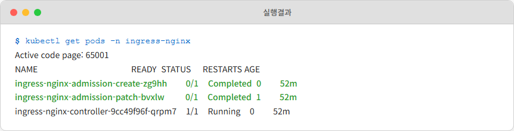

*Ingress Controller Pod가 Running 상태*

> **참고: 운영 환경에서의 Ingress Controller 실행**
>
> 미니큐브 addon은 학습용 명령어입니다. 실제 운영에서는 `ingress-nginx` 같은 컨트롤러를 직접 하거나, 클라우드 환경에서는 클라우드가 제공하는 컨트롤러를 그대로 쓰면 됩니다. 어느 쪽이든 클러스터 안에 컨트롤러 Pod가 떠서 외부 요청을 갈라 주는 모습은 똑같습니다.

#### 두 서비스 준비

공식 앱이 경로별로 어떻게 갈라 주는지를 눈으로 보려면 백엔드가 최소 둘은 필요했습니다. 5.2.2에서 비유로 들었던 `/order` 와 `/stores` 를 그대로 가져와, 주문과 매장을 담당할 두 Service를 만들었습니다. 두 Pod 모두 같은 `hashicorp/http-echo` 이미지를 공유하고, `-text` 인자로 넘긴 응답 문구만 다릅니다.

`ex09/yaml/` 안에는 주문과 매장 각각 **Pod를 띄우는 Deployment** 와 그 Pod를 묶는 **ClusterIP Service** 가 한 쌍씩, 총 네 파일이 들어 있습니다.

| 파일 | 종류 | 역할 |
|------|------|------|
| `order-deploy.yml` | Deployment | 주문 응답 Pod — `-text=주문 접수 완료 — 치킨버거 1개` |
| `order-service.yml` | Service (ClusterIP) | `order` Pod를 묶는 내부 전용 창구 (port 5678) |
| `stores-deploy.yml` | Deployment | 매장 응답 Pod — `-text=매장 안내 — 강남점 · 홍대점 · 판교점` |
| `stores-service.yml` | Service (ClusterIP) | `stores` Pod를 묶는 내부 전용 창구 (port 5678) |

네 파일을 한 번에 올려 두 서비스를 클러스터 안에 띄웠습니다.

```bash
kubectl apply -f ex09/yaml/
```

두 서비스는 **ClusterIP** 타입이라 클러스터 바깥에서는 직접 부를 수 없는 내부 전용 창구입니다. 바깥 요청을 이 둘로 갈라 보낼 공식 앱, 즉 Ingress 규칙이 필요했습니다.

#### 규칙 문서 작성

이제 남은 건 앞서 실행해 둔 컨트롤러에게 "어떤 도메인 어떤 경로를 어디로 보내라" 고 적어 둘 규칙 문서입니다.

**ex09/yaml/ingress-ex01.yml**
```yaml
apiVersion: networking.k8s.io/v1
kind: Ingress
metadata:
  name: shop-ingress
spec:
  ingressClassName: nginx           # 어느 Controller가 이 규칙을 집행할지 지정
  rules:
    - http:
        paths:
          - path: /order            # 주문 경로 → order-service
            pathType: Prefix
            backend:
              service:
                name: order-service
                port:
                  number: 5678
          - path: /stores           # 매장 경로 → stores-service
            pathType: Prefix
            backend:
              service:
                name: stores-service
                port:
                  number: 5678
```

오픈이가 적어 내려간 이 YAML이 아까 문서가 말하던 **규칙 문서** 쪽이었습니다. **rules** 아래 두 개의 **path** 가 있고, 각 경로가 서로 다른 Service를 가리킵니다. 규칙을 문서로 선언해 두면, 앞서 실행한 컨트롤러 Pod가 그 규칙을 읽고 실제 요청을 갈라 줍니다.

```bash
kubectl apply -f ex09/yaml/ingress-ex01.yml       # 규칙 등록
kubectl get ingress                               # 등록된 Ingress 확인
```

<!-- MOCK: 실제 환경에서 재캡처 후 교체 필요 -->
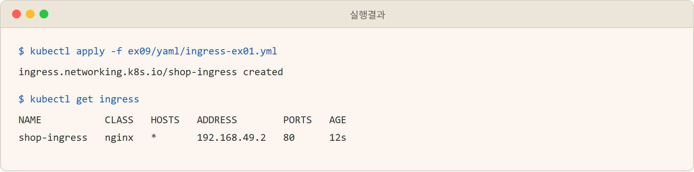

*Ingress 리소스 등록 확인 — shop-ingress*

#### 브라우저로 접속

Docker 드라이버로 Minikube를 띄운 환경에서는 클러스터가 컨테이너 안에 있어 호스트에서 직접 닿지 않습니다. 이 통로를 뚫어 주는 `minikube tunnel` 을 별도 터미널에서 띄워 두면, 호스트의 `localhost` 로 들어온 요청이 Ingress Controller까지 이어집니다.

```bash
minikube tunnel                         # 별도 터미널에서 실행
```

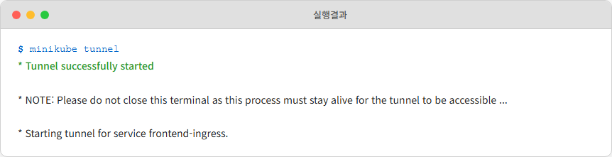

*minikube tunnel 실행으로 외부 접근 경로 확보*

준비가 끝났으니 브라우저를 열어 두 경로를 차례로 들어가 봤습니다. 먼저 `http://localhost/order` 를 주소창에 입력하자 주문 페이지 응답이 돌아왔습니다.

<!-- MOCK: 실제 환경에서 재캡처 후 교체 필요 -->
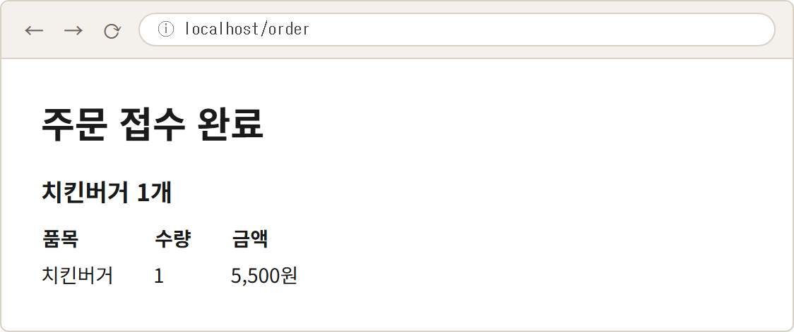

*`/order` 접속 결과 — "주문 접수 완료 — 치킨버거 1개"*

이어서 `http://localhost/stores` 로 이동하자 이번에는 매장 안내 응답이 떴습니다.

<!-- MOCK: 실제 환경에서 재캡처 후 교체 필요 -->


*`/stores` 접속 결과 — "매장 안내 — 강남점 · 홍대점 · 판교점"*

같은 호스트에 붙였는데 뒤의 경로 한 글자에 따라 응답이 완전히 달라졌습니다. 공식 앱이 고객의 용건을 보고 알맞은 가맹점으로 연결해 줬습니다.

규칙(YAML)에 적어 둔 경로만 연결되고, 그 외의 요청은 컨트롤러가 그대로 돌려보냅니다. 공식 앱 메뉴판에 없는 버튼을 눌렀을 때 화면이 먹통이 됩니다.

## 5.3 브라우저에서 Pod까지 — 전체 경로 조립

인그레스가 작동하는 걸 확인하고 한숨을 돌렸습니다. 그런데 자리에 앉아 잠시 생각해 보니 마음이 가볍지만은 않았습니다.

며칠 동안 Service도 만들어 봤고, NodePort로 바깥에서 들어와도 봤고, 인그레스로 경로도 갈라 봤습니다. 부분 부분은 손에 익었습니다. 그런데 브라우저에 친 한 줄이 Pod까지 닿는 흐름을 처음부터 끝까지 따라가려고 하면 매번 어디선가 막혔습니다.

막혔던 곳은 두 군데였습니다. 하나는, Service를 처음 만들어 두고 Pod를 전부 지웠는데도 같은 주소로 들어가니 새 Pod가 응답을 돌려주던 일. 다른 하나는, 인그레스 YAML에 `order-service` 라는 **이름**만 적었을 뿐인데 그 이름이 진짜 Pod까지 닿던 일. 결과는 봤지만 그 사이에서 누가 무슨 일을 하고 있는지는 본 적이 없었습니다.

오픈이는 Service와 Ingress 뒤에서 무슨 일이 일어나는지 살펴보기로 했습니다.

### 5.3.1 두 의문 풀어 보기

오픈이는 두 의문을 하나씩 짚어 가며 Service 뒤에서 어떤 프로그램이 무슨 일을 하고 있는지 들여다봤습니다.

#### 첫 번째 — Pod가 바뀌어도 같은 주소로 닿는 이유

먼저 첫 번째 의문부터 살펴봤습니다. Pod를 다 지웠는데도 같은 Service 주소로 새 Pod에 닿던 일이었습니다. Service 주소는 그대로인데 그 뒤의 Pod IP는 분명 바뀌었습니다. "지금 살아 있는 Pod는 이것들"이라고 항상 최신으로 유지해 주는 프로그램이 따로 있어야 합니다.

그 프로그램이 **엔드포인트 컨트롤러(Endpoint Controller)** 입니다. Service의 selector(라벨)에 매칭되는 Pod들을 지켜보다가, Pod가 새로 뜨거나 사라지면 곧바로 해당 Service의 **Pod IP 목록**을 갱신합니다.

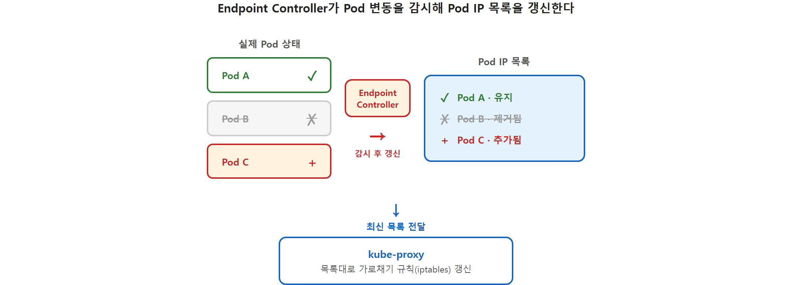

*Endpoint Controller가 Pod 변동을 감시해 Pod IP 목록을 갱신한다*

목록만 갱신된다고 요청이 새 Pod로 흘러가지는 않습니다. 가상 주소(ClusterIP)로 들어온 요청을 실제 Pod IP로 보내는 규칙도 같이 갱신되어야 합니다.

이 일을 맡은 프로그램이 **kube-proxy** 입니다. 클러스터의 모든 노드(서버) 입구에는 들어오고 나가는 짐들을 검사하는 게이트가 있고, kube-proxy는 그 게이트 앞에 *"이 ClusterIP가 적힌 짐은 저 Pod IP로 다시 붙여서 보내라"* 같은 안내문을 붙여 두는 사람입니다. 안내문 묶음이 바로 리눅스 커널이 들고 있는 규칙 목록, **iptables** 입니다. 살아있는 Pod 목록이 바뀌면 안내문에 적힌 Pod IP도 따라서 갱신됩니다.

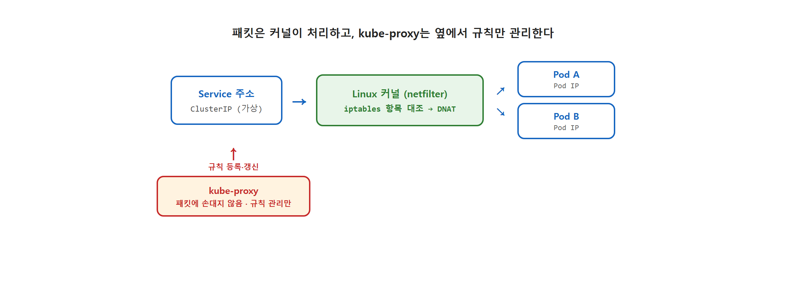

*패킷은 커널이 직접 처리하고, kube-proxy는 옆에서 iptables 항목만 등록·갱신한다*

> **참고: kube-proxy와 iptables**
>
> kube-proxy는 모든 워커 노드에서 동작하며, 리눅스 커널의 네트워크 규칙(iptables)을 관리합니다. 외부에서 들어오는 NodePort 요청이나 내부의 ClusterIP 요청을 가로채서 실제 Pod IP로 연결해 주는 역할을 맡습니다.

첫 번째 의문은 여기서 풀립니다. Pod를 전부 지웠는데도 같은 Service 주소로 새 Pod에 연결된 이유는, Endpoint Controller가 새 Pod를 즉시 Pod IP 목록에 반영했고, kube-proxy가 그 목록을 보고 iptables 항목의 Pod IP를 새 Pod로 교체했기 때문입니다.

#### 두 번째 — 이름만 적었는데 진짜 Pod까지 닿는 이유

이제 두 번째 의문으로 넘어갑니다. 인그레스 YAML에 `order-service` 라는 이름만 적었는데 진짜 Pod까지 닿던 일이었습니다.

인그레스 컨트롤러가 받은 건 `order-service` 라는 이름이지 IP가 아닙니다. 그런데 kube-proxy가 등록해 둔 iptables 규칙은 ClusterIP로 향한 요청만 가로챕니다. 이름과 ClusterIP 사이를 이어 주는 프로그램이 따로 있어야 합니다.

그 프로그램이 **DNS** 입니다. 클러스터 안에는 전용 DNS 서버가 떠 있습니다. Service가 만들어지면 그 이름이 DNS에 자동으로 등록되고, 그 이름으로 부르면 DNS가 ClusterIP를 알려 줍니다.

DNS에 박히는 이름은 사실 `order-service` 한 단어가 아니라 `order-service.default.svc.cluster.local` 처럼 네임스페이스와 클러스터 도메인이 붙은 긴 형식입니다. 같은 네임스페이스 안에서는 `order-service` 한 단어만 적어도 풀어 줍니다. 또한 Pod가 만들어질 때 클러스터 DNS를 가리키는 설정이 안에 자동으로 박혀 있어서, 어떤 Pod든 코드에 이름만 적어도 자연스럽게 클러스터 DNS로 질의가 흘러갑니다.

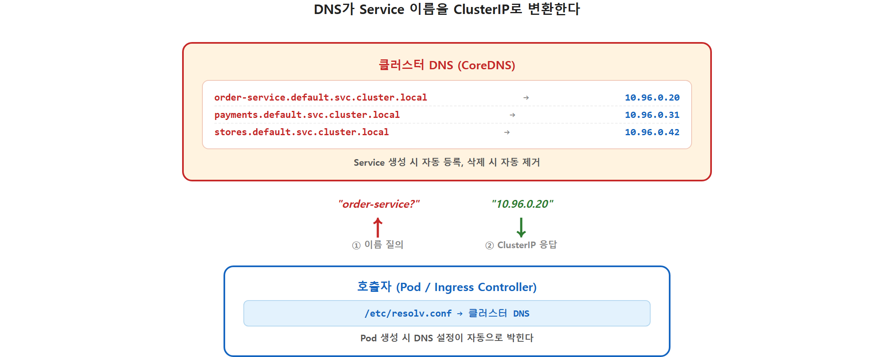

*DNS가 Service 이름을 ClusterIP로 변환한다*

> **참고: 클러스터 DNS**
>
> 쿠버네티스는 클러스터 안에 DNS 서버를 함께 띄워 둡니다. Pod가 다른 Service를 이름으로 부르면 이 DNS가 자동으로 ClusterIP를 알려 줍니다. 별도 설정 없이 기본으로 동작합니다. Docker에서 본 Docker DNS(127.0.0.11)와 같은 역할이고, K8s에서는 이 DNS를 **CoreDNS**라 부릅니다.

두 번째 의문도 여기서 풀립니다. 컨트롤러가 `order-service` 라는 이름으로 백엔드를 부를 때, 먼저 DNS가 이름을 ClusterIP로 바꾸고, 그다음 kube-proxy가 ClusterIP를 살아있는 Pod IP로 바꿉니다. 이름이 Pod까지 닿기까지 두 단계 변환이 일어납니다.

*'Service 뒤에서 셋이 함께 움직이고 있었구나. Endpoint Controller가 Pod IP 목록을 챙기고, kube-proxy가 길을 깔고, DNS가 이름을 풀고.'*

### 5.3.2 요청의 여정

의문이 풀리고 나니 처음 막혔던 한 줄을 이제 그어 볼 만했습니다. 외부에서 들어온 한 요청이 백엔드 Pod까지 닿는 전체 흐름을 한 단계씩 따라가 봤습니다.

**1단계 — 외부 입구 통과**

브라우저에서 `http://localhost/order` 같은 주소로 요청을 보내면, 노드에 뚫린 NodePort(또는 클라우드의 LoadBalancer)를 통해 클러스터 안으로 들어옵니다. 5.2.3에서 띄워 둔 `minikube tunnel` 이 바로 이 입구를 호스트와 이어 주는 통로였습니다. 아직 HTTP 본문은 들여다보지 않은 상태입니다.

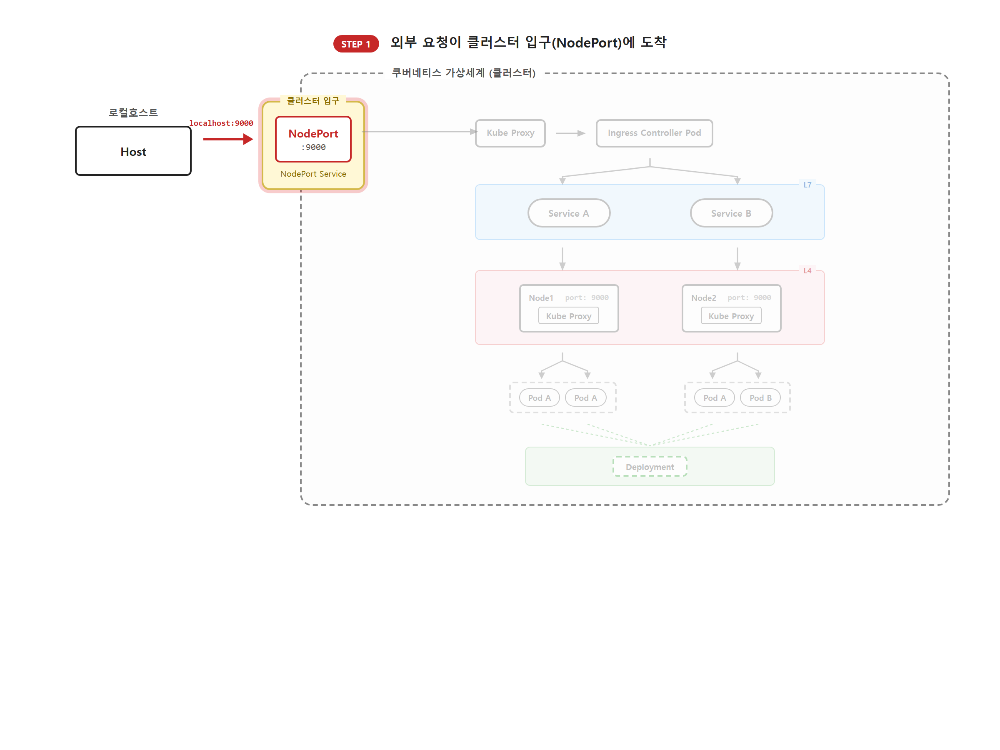

*외부 요청이 NodePort(또는 LoadBalancer)로 진입. 실습에선 `minikube tunnel` 이 이 입구 역할*

**2단계 — Ingress Controller까지 배달**

들어온 요청은 kube-proxy가 미리 등록해 둔 iptables 항목을 타고 인그레스 컨트롤러 Pod로 배달됩니다. 패킷의 도착지 IP·Port만 보고 옮길 뿐, HTTP 본문은 아직 들여다보지 않습니다.

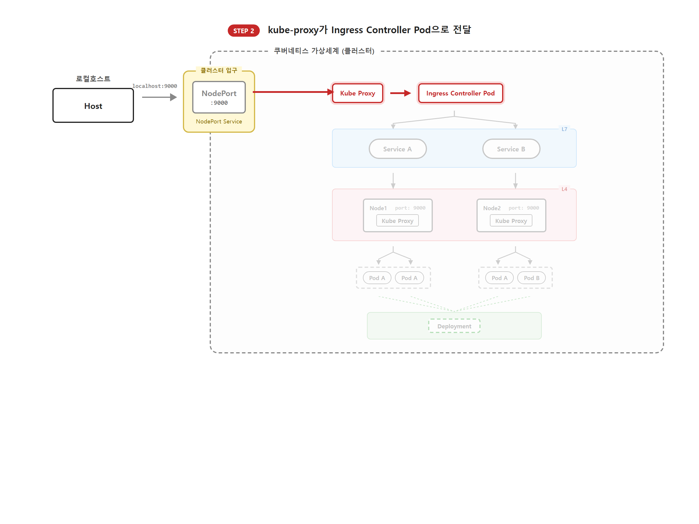

*iptables 규칙을 따라 Ingress Controller Pod로 전달*

**3단계 — HTTP를 읽고 백엔드 결정 (이름을 ClusterIP로)**

Ingress Controller는 도착한 요청의 HTTP 본문을 읽습니다. URL 경로와 도메인 헤더를 등록된 Ingress 규칙과 대조해 "이 요청은 `order-service` 로 보낸다"고 정합니다. 이름이 정해진 직후, 이름만으로는 패킷을 보낼 수 없으니 클러스터 DNS가 곧바로 `order-service` 를 ClusterIP로 풀어 줍니다.

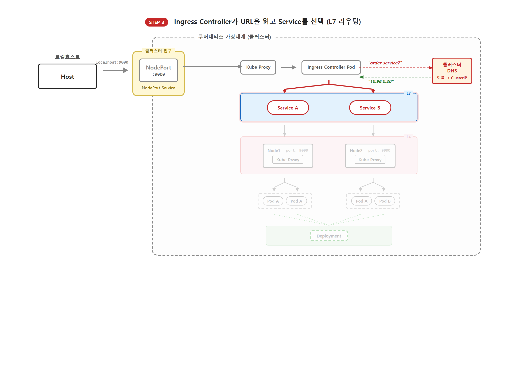

*Ingress Controller가 URL을 읽고 Service를 선택, 그 직후 DNS가 이름을 ClusterIP로 변환*

**4단계 — ClusterIP를 Pod IP로**

ClusterIP로 향한 요청은 다시 같은 노드의 kube-proxy(2차)가 가로채, Pod IP 목록에서 살아있는 Pod 중 하나의 IP로 바꿔 보냅니다.

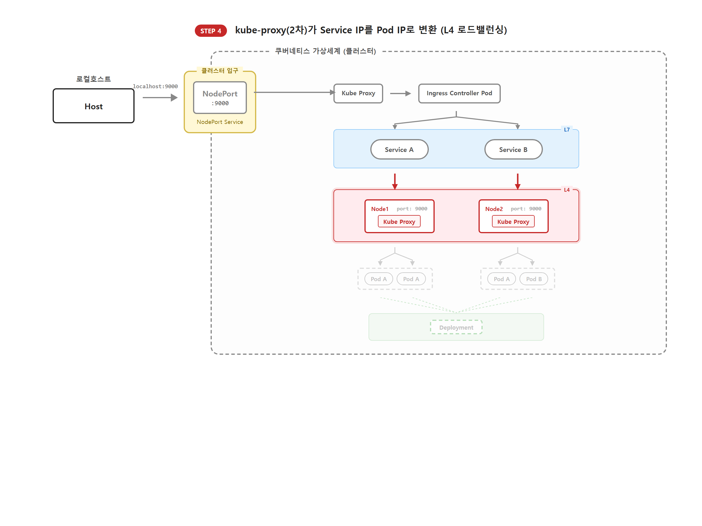

*kube-proxy(2차)가 ClusterIP를 Pod IP로 변환 (L4 로드밸런싱)*

**5단계 — Pod 도달**

요청이 백엔드 Pod에 닿습니다. 애플리케이션이 비즈니스 로직을 실행해 응답을 돌려보냅니다. 이 과정 내내 Endpoint Controller는 뒤에서 Pod IP 목록을 최신으로 유지합니다.

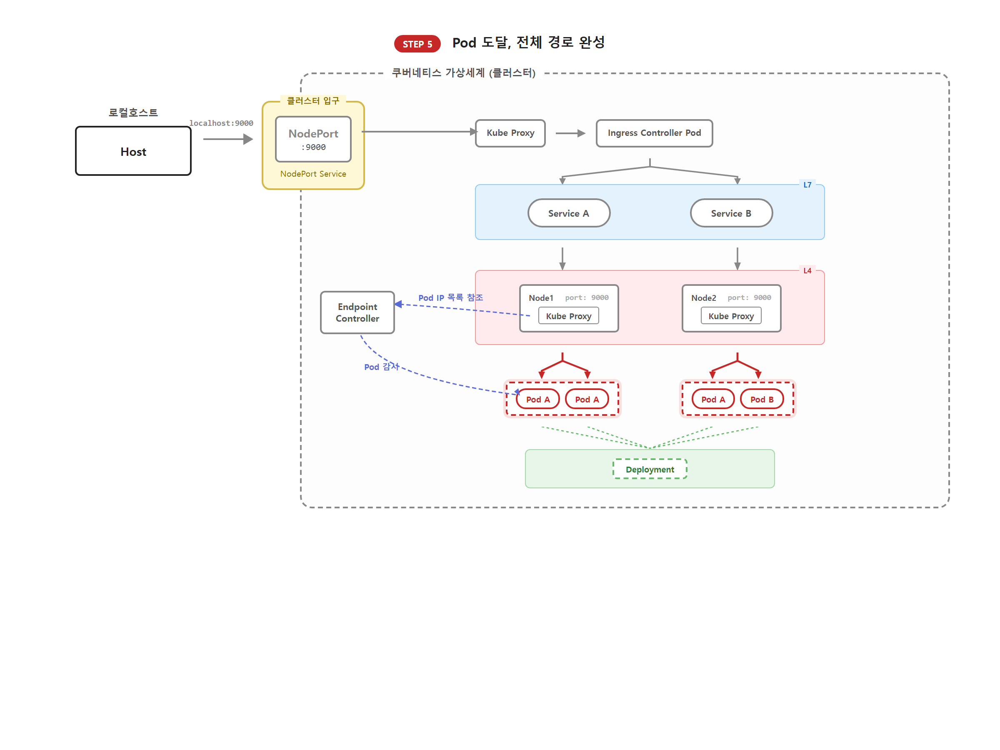

*Pod 도달. Endpoint Controller는 다섯 단계 내내 백그라운드에서 Pod IP 목록을 최신으로 유지*

다섯 단계를 한 표로 정리하면 다음과 같습니다.

| 단계 | 일하는 곳 | 진입점/프로그램 | 하는 일 | 의사결정 기준 |
|---|---|---|---|---|
| 1 | 외부 입구 | Service (NodePort/LoadBalancer) | 외부 요청을 클러스터 안으로 받는다 | 노드 IP, 포트 |
| 2 | 클러스터 안 | kube-proxy (1차) | Ingress Controller Pod로 요청을 보낸다 | Service ClusterIP, Pod IP 목록 |
| 3 | Ingress Controller + DNS | Ingress Controller, DNS | URL을 읽어 백엔드 Service를 정하고, 그 이름을 ClusterIP로 변환 | URL 경로, Host 헤더 → 이름 → ClusterIP |
| 4 | 백엔드 노드 | kube-proxy (2차) | ClusterIP를 살아있는 Pod IP로 바꾼다 | Service ClusterIP, Pod IP 목록 |
| 5 | 백엔드 Pod | 애플리케이션 | 비즈니스 로직 실행 | 요청 데이터 |

같은 다섯 단계지만 보는 정보의 깊이가 다릅니다. **톨게이트**는 차량 번호와 차종(IP·Port)만 확인하고 통과시킵니다. **안내데스크**는 차에 탄 사람의 용건(URL·Host)까지 듣고 적절한 길을 안내합니다. NodePort와 kube-proxy가 톨게이트 역할이라면, Ingress Controller가 안내데스크 역할입니다.

> **참고: L4와 L7**
>
> 네트워크에서는 IP·Port 같은 봉투 겉면 정보를 다루는 계층을 **L4(전송 계층)** , URL 경로·헤더 같은 봉투 안쪽 정보를 다루는 계층을 **L7(애플리케이션 계층)** 이라고 부릅니다. NodePort와 kube-proxy는 L4 정보로 일하고, 5.3.1에서 본 DNS·Endpoint Controller도 L4 영역에 머무릅니다. 다섯 단계 중 HTTP 본문(L7)까지 들여다보는 프로그램은 Ingress Controller 하나뿐입니다.

따로 보면 복잡해 보이던 프로그램들이 한 줄로 늘어놓이니 그제야 머릿속에서 하나의 흐름으로 묶였습니다.

*'Service는 통로를 만들고 Ingress는 방향을 잡는다. 그 뒤에서 DNS, Endpoint Controller, kube-proxy가 받아 준다. 각자 맡은 일이 단순하니 관리하기도 편하겠다.'*

### 5.3.3 Docker에서 Kubernetes로

오픈이는 그 길로 노트를 펼쳐, 챕터 2부터 여기까지 거쳐 온 부품들을 한 표로 나란히 적어 봤습니다. 낯선 이름이 새로 나타난 게 아니라, Docker에서 보던 부품이 이름만 바꿔 더 큰 무대에 올라와 있는 그림이었습니다.

| Docker | Kubernetes | 배운 챕터 |
|--------|-----------|----------|
| docker0 (bridge) | Pod 네트워크 (CNI) | CH02 |
| iptables DNAT (`-p` 포트포워딩) | kube-proxy iptables | CH02 → CH05 |
| Docker DNS (127.0.0.11) | CoreDNS | CH02 → CH05 |
| docker network create | Service (ClusterIP) | CH03 → CH05 |
| NGINX 경로 라우팅 | Ingress Controller | CH03 → CH05 |
| Docker Compose 자동 네트워크 | Service + Service DNS | CH03 → CH05 |

선배가 챕터 3 마지막에 던졌던 한마디 — "이 흐름 기억해 둬, K8s에서 똑같은 게 더 큰 스케일로 나와" — 가 이 표 한 장에 그대로 들어와 있었습니다.


## 이것만은 기억하자

- **Service는 Pod의 직통 전화번호.** : Pod는 소모품이라 IP가 수시로 바뀌지만, 서비스는 변하지 않는 주소를 제공합니다. 또한, 하나의 서비스에 여러 개의 Pod를 연결해 요청을 골고루 나누는 로드밸런싱 기능도 수행합니다.
- **Service 뒤에서는 세 프로그램이 함께 일한다** : 클러스터 DNS는 Service 이름을 ClusterIP로 변환하고, Endpoint Controller는 Service에 연결된 살아있는 Pod IP 목록을 최신으로 유지하며, kube-proxy는 그 목록대로 각 노드 커널에 ClusterIP → Pod IP 규칙을 만듭니다. 이름이 Pod까지 닿기까지 두 단계 변환이 일어납니다.
- **Ingress는 프랜차이즈 공식 앱.** : 숫자(IP/Port)만 보는 서비스와 달리, 인그레스는 도메인과 URL 경로를 읽고 적절한 서비스로 연결하는 라우팅을 담당합니다. 메뉴 구성표 역할의 **리소스(YAML)**와 앱을 실제로 구동하는 **컨트롤러(S/W)**가 한 팀으로 움직이며, Minikube에서는 `minikube addons enable ingress`로 컨트롤러를 먼저 실행해 두어야 동작합니다.

네트워크 경로는 이제 완벽히 갖춰졌습니다. 하지만 프로젝트를 쿠버네티스에 실제로 올리려면 아직 해결해야 할 숙제가 남았습니다. DB 비밀번호를 이미지에 직접 포함할 수는 없으며, 컨테이너가 재시작될 때 소중한 데이터가 사라져서도 안 되기 때문입니다.

다음 챕터에서는 설정값(ConfigMap), 보안 비밀(Secret), 그리고 **데이터의 영속성(Volume)**을 추가하여 챕터 3에서 만든 풀스택 구성을 쿠버네티스 위에 완벽하게 구현해 보겠습니다.
