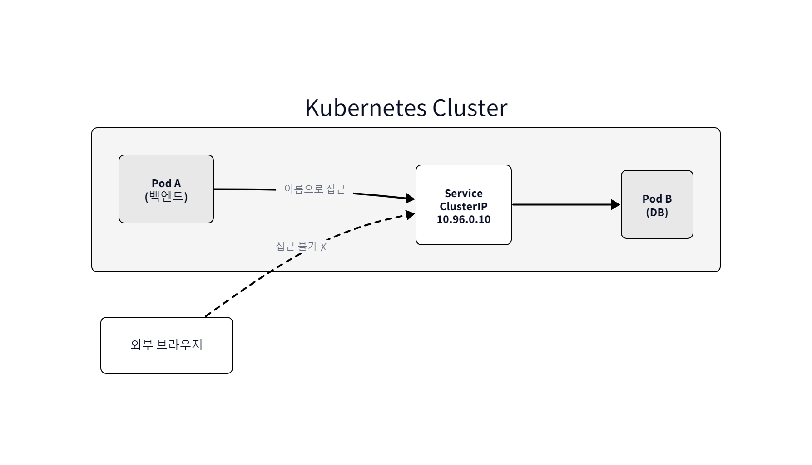
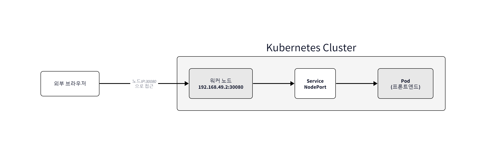
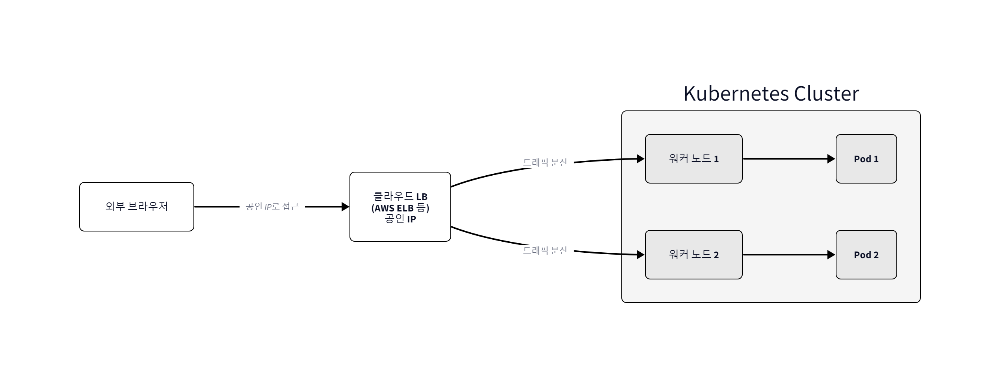
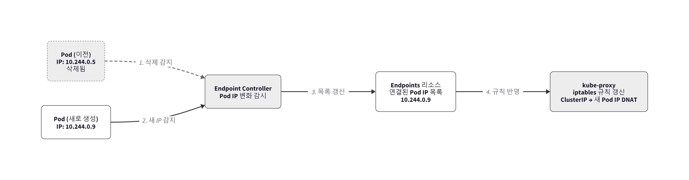
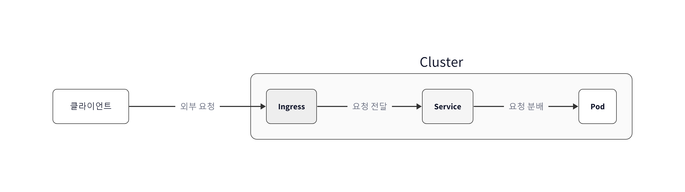

# Ch.5 Kubernetes 네트워킹

## 5.1 Pod의 대표 전화번호, Service

월요일 아침 열 시. 사무실 창으로 들어온 햇빛이 모니터 가장자리에 얇게 걸려 있었습니다.

오픈이는 지난 주에 Deployment로 Pod 세 개를 띄웠습니다. 하나가 죽으면 자동으로 살아나고, 개수도 알아서 유지됐습니다. 뿌듯했던 금요일이 지나고 주말을 거쳐 출근한 월요일. 커피잔을 책상에 놓다가 손이 멈췄습니다.

*그럼 저 Pod를 누가 찾아가지.*

CH04 말미에 선배가 던진 한 줄이 떠올랐습니다. "Pod가 살아나도 IP가 바뀐다." 그때는 그런가 보다 하고 넘겼는데, 주말 내내 머릿속에 걸려 있었습니다. Pod가 죽고 다시 태어나면 주소가 바뀝니다. 그 주소로 전화를 걸고 있던 프론트엔드는 어떻게 될까요. 백엔드가 DB Pod를 부르고 있었는데 DB의 IP가 바뀌면 연결은 어떻게 이어질까요.

### 5.1.1 바뀌는 번호를 다시 본다

CH04 마지막 실습에서 오픈이는 이미 "바뀌는 번호"를 한 번 확인했습니다. Pod를 지우면 새 Pod가 올라오고, 그때마다 IP 숫자 끝자리가 다른 값으로 바뀌었습니다. 그때는 숫자가 바뀐다는 사실만 확인하고 넘어갔지만, 주말에 곱씹어 보니 그 한 자리 차이가 가볍지 않았습니다. 프론트엔드가 어제 외운 주소로 전화를 걸었다가는 오늘 아무도 받지 않는 허공에 번호를 누르는 꼴이었습니다.

오픈이는 노트북을 열었습니다. 같은 실습을 한 번 더 해봤습니다. 손으로 눌러 확인해야 몸에 남는 법이었습니다. 터미널의 커서가 깜빡이는 소리만 또렷했습니다.

`Pod`의 IP는 재시작 시 변경됩니다. IP를 확인한 후 `Pod`를 삭제하고 다시 조회하면 IP가 달라진 것을 볼 수 있습니다.

```bash
kubectl get pod -o wide           # IP 확인 (예: 10.244.0.7)
kubectl delete pod --all          # Pod 삭제
kubectl get pod -o wide           # IP 변경됨 (예: 10.244.0.8)
```


*그림 5-1 Pod 재시작 시 IP 변경 확인*

같은 nginx인데 주소가 7에서 8로 바뀌어 있었습니다. 숫자 한 자리 차이인데, 그 한 자리가 전화번호 전체를 쓸모없게 만들었습니다.

*이걸 믿고 전화번호부에 적어두면 하루도 못 버티겠는데.*

팀장이 지나가다 모니터를 들여다봤습니다.

**팀장**: "콜센터 대표 번호 같은 거 만들면 되지 않아?"

오픈이는 짧게 고개를 끄덕였습니다. 상담사 개인 번호는 바뀌어도 대표 번호로 걸면 당번 상담사가 받습니다. 그리고 상담사가 여럿일 때는 고객 전화를 한 명이 다 받는 게 아니라, 대표 번호가 당번을 돌려가며 한 명씩 연결해 줍니다. 고객은 상담사 교대 시간도, 누가 쉬는 날인지도 몰라도 됩니다. Pod 앞에도 그런 대표 번호가 하나 있으면, 게다가 여러 Pod에 요청을 하나씩 돌려가며 분배까지 해주면 문제가 풀릴 것 같았습니다.

그 대표 번호 역할을 하는 리소스의 이름이 **Service** 였습니다. 프랜차이즈로 치면 각 매장(Pod)이 아니라 **매장 대표 전화번호**. 손님은 늘 같은 번호로 걸고, 그 번호가 오늘 문을 연 매장 중 한 곳으로 전화를 연결해 줍니다.


*그림 5-2 Service는 고정 주소를 제공합니다. Pod IP가 바뀌어도 Service 주소는 그대로*

> **참고: Service**
> Pod에 접근할 때 고정 IP를 제공해 안정적으로 접근할 수 있게 하는 리소스. Pod가 죽고 다시 태어나 IP가 바뀌어도 Service 주소는 바뀌지 않는다. 뒤에 여러 Pod가 붙어 있으면 요청을 하나씩 돌려가며 분배한다(로드밸런싱).

Spring Boot 애플리케이션의 기본 포트가 8080이라면, 이 8080이 곧 Service가 찾아가 연결해 줄 Pod 안쪽의 포트입니다. 바깥에서 봤을 때의 창구 번호와 안쪽 주방의 조리대 번호가 다르듯, Service와 Pod도 각자의 포트 번호를 가집니다. 이 얘기는 바로 다음 절에서 다시 풀어봅니다.

### 5.1.2 Service 생성

오픈이는 YAML 파일을 한 장 더 만들기로 했습니다. Deployment를 쓸 때 봤던 selector가 Service에서도 똑같이 등장했습니다. 라벨만 맞으면 알아서 연결되는 구조였습니다.

Github 프로젝트의 `yaml/service-ex01.yml`을 참고합니다.

**yaml/service-ex01.yml**
```yaml
apiVersion: v1           # API 버전
kind: Service            # 리소스 종류
metadata:
  name: nginx-service    # 서비스 이름
spec:                    # 상세 설정
  type: NodePort         # 클러스터가 외부에서 접근할 수 있도록 노드를 열어줌
  selector:              # 연결할 Pod 선택 조건
    app: nginx           # app이 nginx인 Pod에 연결
  ports:                 # 포트 설정
  - port: 80             # 서비스가 클러스터 내부에서 열어둔 포트
```

Service의 포트 설정이 처음엔 헷갈렸습니다. 외부 요청이 Pod에 도달하기까지 세 개의 포트를 거쳤습니다. 외부 → `nodePort` → `port` → `targetPort` → Pod 순서였습니다. 이름 세 개가 다 비슷해 보여서 머리가 꼬였는데, 각자 **누구 입장에서 붙인 번호인지**를 구분하니 정리가 됐습니다.

| 포트 종류 | 누구의 포트인가 | 역할 | 생략 시 |
|----------|----------------|------|--------|
| `nodePort` | **노드(서버) 입장**의 포트 | 외부에서 노드 IP로 접근할 때 열리는 30000~32767 범위 포트 | 범위 내 자동 할당 |
| `port` | **Service 입장**의 포트 | 클러스터 내부에서 Service를 부를 때 쓰는 포트 | 필수 |
| `targetPort` | **Pod(컨테이너) 입장**의 포트 | 실제로 컨테이너 안의 애플리케이션이 귀를 대고 있는 포트 | `port` 값과 동일하게 설정 |

Spring Boot가 내부에서 8080으로 떠 있다면 `targetPort: 8080`이 그 값이고, 클러스터 내부에서 이 서비스를 `port: 80`으로 부르면 Service가 8080으로 번역해서 Pod에 넘겨줍니다. 바깥 사람은 `nodePort`로 들어오고, 클러스터 안 이웃은 `port`로 부르고, 결국 도착해서 말을 거는 대상이 `targetPort`입니다. 세 이름이 같은 포트를 다르게 부를 뿐입니다.

`Service`를 생성합니다.

```bash
kubectl apply -f service-ex01.yml     # Service 생성
```


*그림 5-3 Service 생성*

### 5.1.3 라벨이 이어주는 줄

오픈이는 selector라는 단어가 CH04에서도 나왔던 게 기억났습니다. Deployment가 자기 Pod를 찾을 때 썼던 그 selector였습니다. Service도 정확히 같은 방식을 썼습니다.

Service가 Pod를 찾는 유일한 방법은 **label**. selector에 `app: nginx`라고 적으면, 그 라벨을 가진 Pod만 이 Service에 연결됩니다.

```
Service (Selector: app=web)
        ↓ 매칭
Pod A (Label: app=web)  ← 연결됨
Pod B (Label: app=api)  ← 연결 안 됨
```


*그림 5-4 Service는 selector와 일치하는 label을 가진 Pod만 연결*

IP가 아니라 이름표로 맞춥니다. Pod가 새로 태어나서 IP가 바뀌어도, 이름표만 같으면 Service는 그대로 그 Pod에게 요청을 넘깁니다.

### 5.1.4 Service 타입 — ClusterIP, NodePort, LoadBalancer

오픈이는 방금 작성한 YAML을 다시 봤습니다. `type: NodePort`라고 적혀 있었습니다. 타입이 세 종류 있었는데, 각자 "어디서 접근할 수 있는지" 범위가 달랐습니다.

아무것도 안 적으면 기본은 **ClusterIP**. 회사 내선 번호와 같습니다. 같은 클러스터 안에서만 걸립니다. 외부에서는 닿지 않습니다.



*그림 5-5 ClusterIP --- 클러스터 내부에서만 접근 가능*

오픈이가 YAML에 적은 **NodePort** 는 노드의 실제 IP에 포트(30000~32767) 하나를 뚫어서 외부 접근을 열어줍니다. 개발/테스트용으로 편합니다.



*그림 5-6 NodePort --- 노드의 실제 IP + 실제 포트로 외부 접근 가능*

그런데 실제 운영에서 노드 IP를 외부에 직접 공개하진 않습니다. 노드가 여러 대면 어느 IP를 알려줘야 할지도 애매합니다. 클라우드 환경에서 쓰는 **LoadBalancer** 는 공인 IP를 자동으로 발급받고, 여러 노드에 트래픽을 알아서 나눠줍니다.



*그림 5-7 LoadBalancer --- 클라우드 LB가 공인 IP로 여러 노드에 트래픽을 분산*

| 타입 | 접근 범위 | 사용 사례 |
|------|----------|----------|
| **ClusterIP** | 클러스터 내부만 | 백엔드, DB 등 외부 노출 불필요한 서비스 |
| **NodePort** | 노드IP:포트로 외부 접근 가능 | 테스트, 개발 환경 |
| **LoadBalancer** | 공인 IP로 외부 접근 가능 | 클라우드 운영 환경 |

### 5.1.5 보이지 않는 손, kube-proxy

오픈이는 `kubectl get service`로 방금 만든 Service의 ClusterIP를 확인했습니다. `10.96.0.150` 같은 숫자가 찍혔습니다. 커서를 그 숫자 위에 두고 한참 봤습니다. 문득 이상한 생각이 들었습니다.

*이 IP는 대체 어느 장비에 붙어 있는 걸까.*

노드 IP도 아니고, Pod IP도 아니었습니다. `kubectl describe node`로 노드의 네트워크 정보를 뒤져봐도 10.96 대역은 어디에도 보이지 않았습니다. 어느 네트워크 카드에도 할당되지 않은, 존재하지 않는 주소처럼 보였습니다. 진짜 그랬습니다. ClusterIP는 **어느 장비에도 할당되지 않은 가상 주소** 였습니다.

*그럼 이 주소로 오는 요청은 어떻게 처리되는 거지.*

어디에도 할당돼 있지 않다면, 그 주소로 패킷을 보내도 "저요" 하고 받아줄 장비가 없습니다. 보통이면 패킷은 허공에 떠돌다 버려질 텐데, 쿠버네티스에서는 그렇지 않았습니다. 패킷이 노드를 지나갈 때 **커널의 특별한 규칙이 이를 잡아챕니다**. 목적지 주소가 ClusterIP면, 그 자리에서 주소를 실제 Pod IP로 바꿔치기해 버립니다. 그 다음부터 패킷은 진짜 장비를 향해 날아갑니다.

오픈이는 CH02 네트워크 절이 떠올랐습니다. 그때 Docker가 포트포워딩을 어떻게 구현했는지 봤습니다. 호스트의 8080 포트로 들어온 패킷의 목적지 주소를 컨테이너의 80 포트로 바꿔치기. 그 바꿔치기 기술의 이름이 **iptables DNAT** 이었습니다. 패킷 필터링과 주소변환을 담당하는 리눅스 커널의 도구. 이번에도 같은 이름이 다시 등장했습니다.

> **참고: kube-proxy와 iptables**
> kube-proxy는 모든 워커 노드에서 도는 네트워크 구성 요소. 노드의 리눅스 커널에 iptables 규칙을 심는 역할을 한다. "목적지가 ClusterIP 10.96.0.150:80인 패킷이 오면, 목적지를 실제 Pod IP 10.244.0.5:80으로 바꿔라." CH02.4.2에서 본 Docker의 DNAT과 정확히 같은 메커니즘이다.

ClusterIP 자체는 진짜 장비가 아닙니다. 그래서 이 주소로 온 패킷은 물리적으로 받아주는 쪽이 없습니다. 대신 노드의 커널이 패킷을 보내기 직전 iptables 규칙을 확인합니다. "아, 이 주소는 Pod IP로 바꿔서 보내라고 적혀 있네." 그 순간 목적지가 실제 Pod IP로 교체되고, 패킷은 그 Pod에게 꽂힙니다.


*그림 5-8 kube-proxy는 NodePort 처리와 ClusterIP 처리를 모두 담당*

kube-proxy는 두 곳에서 이 일을 합니다.

- **NodePort 처리**: 외부에서 노드의 30080 같은 포트로 들어온 요청을 실제 Pod IP로 변환
- **ClusterIP 처리**: 클러스터 내부에서 가상 IP로 온 요청을 실제 Pod IP로 변환

여기서 자연스럽게 따라오는 질문이 있었습니다. Pod IP가 바뀌면 그 iptables 규칙은 누가 다시 적지.

그 역할을 하는 친구 이름이 **Endpoint Controller** 였습니다. 다만 이 이름을 꺼내기 전에 "Endpoint"가 뭔지 먼저 봐두는 편이 좋았습니다. 말이 비슷해서 헷갈렸기 때문입니다.

> **참고: Endpoint / Endpoint Controller**
> **Endpoint**: "이 Service 뒤에 실제로 어떤 Pod IP들이 연결돼 있는지"를 담은 쿠버네티스 리소스. 한 줄짜리 주소록이라고 생각하면 된다.
> **Endpoint Controller**: Pod IP 변화를 감시하면서 그 주소록(Endpoint 리소스)을 갱신하는 주체. 컨트롤 플레인에서 돈다.

용어가 정리되니 그림이 분명해졌습니다. 컨트롤 플레인 쪽의 Endpoint Controller가 Pod IP가 바뀌는 걸 감시합니다. Pod가 죽고 새 Pod가 뜨면, Service에 연결된 실제 Pod IP 목록(Endpoints)을 즉시 갱신합니다. kube-proxy는 이 Endpoints가 바뀐 걸 보고 각 노드의 iptables 규칙을 업데이트합니다.



*그림 5-9 Endpoint Controller가 Pod IP 변화를 감시하고, kube-proxy가 규칙을 갱신*

이렇게 세 요소가 서로 이어지는 흐름을 정리하면 역할이 세 단계였습니다. Service가 고정 주소(가상 IP)를 선언하고, Endpoint Controller가 Pod IP 변화를 감시해서 주소록을 갱신하고, kube-proxy가 그 주소록을 각 노드의 iptables 규칙으로 집행합니다.

### 5.1.6 외부에서 Service에 접속해 보기

`Service`는 만들었는데, 접속이 되질 않았습니다. 오픈이는 브라우저에 `10.96.0.150` 을 치고 엔터를 눌러봤습니다. 응답이 돌아오지 않았습니다. 탭이 계속 로딩만 돌았습니다. `노드IP:30080` 도 똑같이 조용했습니다.

*분명히 Service가 만들어졌는데 왜 못 닿지.*

로컬 PC와 미니큐브가 서로 다른 네트워크에 있어서였습니다. 미니큐브는 내부적으로 VM이나 컨테이너로 한 겹 싸여 있어서, 외부에서 ClusterIP나 노드 IP로 바로 찌르는 게 막혀 있었습니다. 미니큐브에는 이 상황을 위한 임시 터널을 뚫어주는 명령어가 따로 있었습니다.

> **참고: minikube service**
> 미니큐브가 클러스터 내부 Service로 통하는 임시 접근 경로를 로컬 PC에 만들어주는 명령어. 개발 환경에서만 쓴다.

로컬 PC에서 `Service`에 접속할 수 있는 URL을 생성합니다.

```bash
minikube service nginx-service --url  # Service 접근 URL 생성
```


*그림 5-10 minikube service URL 생성*

생성된 URL로 접속하면 미니큐브 내부 `Service`를 거쳐 `Pod` 서버로 요청이 전달됩니다.


*그림 5-11 브라우저에서 nginx 접속 확인*

여기가 진짜 확인 지점이었습니다. 터미널을 빠져나온 뒤 Pod를 전부 지워보고, 다시 URL을 발급받아서 접속했습니다.

`Pod`를 삭제하고, `minikube service` 명령어로 다시 접근합니다.

```bash
kubectl delete pod --all              # 전체 Pod 삭제
minikube service nginx-service --url  # Service 접근 URL 생성
```


*그림 5-12 Pod 삭제 후 Service 접속*

새 URL로 접속했는데 nginx 페이지가 그대로 떴습니다. 뒤에서 Pod는 새로 태어나 IP가 바뀌었을 텐데, 화면에는 아무 흔적이 없었습니다.

*안에서 다 바뀌었는데, 바깥에서는 아무 일도 없었던 것처럼 보이네.*

Endpoint Controller가 감시하고, kube-proxy가 규칙을 다시 쓰고, Service가 그 대표 번호를 끝까지 유지했기 때문이었습니다.

실습이 끝난 후 `Deployment`와 `Service`를 삭제합니다.

```bash
kubectl delete deployment nginx-replica   # Deployment 삭제
kubectl delete service nginx-service     # Service 삭제
```

## 5.2 건물 안내 데스크, Ingress

Service 덕분에 Pod를 안정적으로 찾아갈 수는 있게 됐습니다. 그런데 오픈이가 막상 운영 환경을 화이트보드에 그려보다가 답답한 벽을 만났습니다. 보드 마커가 몇 번 끊어질 때마다 다시 흔들어 써야 했습니다. 그러다 한 가지 의문이 떠올랐습니다.

*서비스가 열 개가 되면, 포트도 열 개가 되나.*

지금까지 써본 접근 수단부터 돌이켜봤습니다. `minikube service`는 터미널 하나로 끝나는 임시 경로였습니다. NodePort도 `노드IP:30080` 같은 식이라 사용자가 포트 번호를 외우고 입력해야 했습니다. 실제 서비스는 `http://my-shop.com/api`, `http://my-shop.com/admin` 같은 도메인 기반 URL로 접속합니다. 서비스마다 포트 번호를 따로 외우고 다니는 게 아니라, 경로만 다른 같은 도메인입니다. Service 혼자서는 이걸 풀지 못했습니다.

선배가 옆에서 듣다가 한 마디 했습니다.

**선배**: "이거 CH03에서 본 그림이랑 비슷한데."

오픈이는 CH03이 생각났습니다. NGINX가 URL 경로를 보고 요청을 나눠 보내던 그 장면. 쿠버네티스 안에서 그 역할을 맡는 게 **Ingress** 였습니다.

### 5.2.1 L4와 L7 — 고속도로 분기점과 안내 데스크

Ingress를 이해하려면 네트워크 계층 얘기를 한 번 거쳐야 했습니다. 오픈이는 L4, L7 같은 용어를 들어본 적은 있었지만 경계가 흐릿했습니다. 선배가 비유를 들었습니다.

**선배**: "고속도로 분기점은 방향만 봐. 안내 데스크는 이름표를 읽지."

차가 고속도로 분기점에 도착합니다. 분기점은 단순합니다. "수도권 방향입니까, 호남선 방향입니까." 방향과 차선만 확인합니다. 차 안에 누가 탔는지, 무슨 짐이 실렸는지는 보지 않습니다. 빠르지만 판단이 단순합니다.

건물 1층 안내 데스크는 다릅니다. "어느 부서 찾으세요?" 방문자의 목적지를 듣고, 약속이 있는지 확인한 뒤, 적절한 층과 방 번호를 알려줍니다. 이름과 목적을 읽어야 안내할 수 있습니다. 느리지만 판단이 정확합니다.


*그림 5-13 L4는 빠른 분배, L7은 정확한 라우팅을 담당*

쿠버네티스 네트워크도 이 둘로 나뉘었습니다. **kube-proxy** 가 고속도로 분기점. IP와 포트만 보고 Pod에 넘깁니다. **Ingress Controller** 가 건물 안내 데스크. URL 경로와 Host 헤더를 읽고 해당 Service로 안내합니다.

> **참고: L4와 L7**
> 네트워크 OSI 7계층에서 가져온 숫자. **L4(4계층, 전송 계층)** 는 TCP/IP 포트 번호까지만 본다. **L7(7계층, 애플리케이션 계층)** 은 HTTP의 URL 경로, Host 헤더, 쿠키처럼 사람이 읽는 수준의 내용을 본다. kube-proxy가 L4, Ingress Controller가 L7에서 동작한다는 뜻이다.

| 구분 | L4 (kube-proxy) | L7 (Ingress Controller) |
|------|-----------------|------------------------|
| 확인하는 것 | IP, Port | URL 경로, Host 헤더 |
| 비유 | 고속도로 분기점 | 건물 안내 데스크 |
| JSON 파싱 | 안 함 | 안 함 |

표에서 둘 다 "JSON 파싱은 안 함"이라고 적혀 있었습니다. 그러면 요청 본문의 JSON은 누가 읽어줄까. 답은 단순했습니다. 네트워크 계층은 어디까지나 전달만 합니다. JSON을 해석하고 비즈니스 로직을 태우는 건 최종 목적지인 **Pod 안의 애플리케이션** 자체였습니다. Spring이든 Node.js든, 진짜 일은 Pod 안에서 합니다.

> **참고: 계층별 역할 분담**
>
> | 계층 | 컴포넌트 | 확인하는 것 | 안 하는 것 |
> |------|---------|-----------|-----------|
> | L4 | kube-proxy | IP, Port | URL, Host, JSON |
> | L7 | Ingress Controller | URL 경로, Host 헤더 | JSON 파싱 |
> | App | Pod (Spring 등) | JSON, 인증, 비즈니스 로직 | 라우팅, 포트 변환 |

### 5.2.2 Ingress 리소스와 Ingress Controller

Ingress 쪽은 용어가 두 개 있어서 처음엔 헷갈렸습니다. **Ingress 리소스** 와 **Ingress Controller**. 같은 말 같은데 달랐습니다.

> **참고: Ingress 리소스**
> 클러스터 외부의 HTTP/HTTPS 요청을 내부 어느 Service로 보낼지 **라우팅 규칙을 YAML로 선언**하는 쿠버네티스 오브젝트. 규칙만 담고 있을 뿐, 스스로 요청을 받지는 않는다.

> **참고: Ingress Controller**
> 위의 Ingress 리소스(규칙)를 읽어 **실제로 외부 요청을 받아 처리하는 소프트웨어**. Nginx Ingress Controller가 대표적이다. 이 소프트웨어가 Pod로 떠 있다고 생각하면 된다.



*그림 5-14 외부 요청은 Ingress를 통해 Service로 전달*

선배의 비유를 그대로 옮기면 정확했습니다.

| 구성 요소 | 역할 | 비유 |
|-----------|------|------|
| **Ingress 리소스** | 어떤 요청을 어떤 Service로 보낼지 정의한 규칙 (YAML) | 안내 데스크에 놓인 부서 안내판 |
| **Ingress Controller** | 실제로 외부 요청을 받아 처리하는 소프트웨어 | 안내 데스크에 앉아있는 직원 |

리소스(YAML)는 "규칙을 적어둔 안내판"이고, Controller는 "그 안내판을 읽고 실제로 손님을 안내하는 직원"이었습니다. 둘 다 있어야 Ingress가 동작합니다. 규칙만 있고 직원이 없으면 안내판은 벽에 붙은 종이일 뿐이고, 직원만 있고 규칙이 없으면 어디로 안내할지 모릅니다.

`Ingress Controller`는 Nginx 기반이 가장 많이 쓰입니다. 쿠버네티스 커뮤니티에서 관리하는 `ingress-nginx` 와 NGINX 회사가 만든 `nginx-ingress` 두 가지가 존재하는데, 미니큐브 애드온으로 켜지는 쪽은 전자입니다. `minikube addons enable ingress` 한 줄로 활성화되고, 뒤에 Ingress 리소스 YAML을 배포하면 이 Controller가 규칙을 읽어 실제 라우팅을 수행합니다. Ingress 리소스의 YAML 작성과 실습은 CH06 종합 실습에서 Service 여러 개와 묶어서 다룹니다.

## 5.3 브라우저에서 Pod까지

### 5.3.1 요청의 여정

오픈이는 퇴근 전 사무실 불빛이 절반쯤 꺼진 복도를 등지고 책상에 앉았습니다. 노트를 펴서 지난 3주를 정리해 봤습니다. CH02에서 Docker 컨테이너 하나의 네트워크를 봤습니다. CH03에서 Compose로 여러 컨테이너를 엮었습니다. CH04에서 Pod와 Deployment로 자동 복구까지 갔습니다. CH05에서는 Service, kube-proxy, Ingress를 각각 배웠습니다. 부품은 다 나왔습니다. 이제 이걸 **하나의 흐름** 으로 이어 보고 싶었습니다.

그 흐름이 어떻게 이어지는가 하면 — 사용자가 브라우저에 `https://my-shop.com/api/orders`를 치는 순간부터 Pod에 도달하기까지, 요청은 여러 손을 차례로 거칩니다.


*그림 5-15 외부 요청이 Pod에 도달하기까지의 전체 흐름*

| 단계 | 컴포넌트 | 하는 일 | 확인하는 것 |
|------|---------|--------|-----------|
| 1 | **브라우저** | 요청 전송 | - |
| 2 | **Ingress Controller** | URL 경로 확인 → 적절한 Service로 라우팅 | URL, Host |
| 3 | **Service** | Label-Selector로 매칭된 Pod 그룹에 요청 전달 | Label |
| 4 | **kube-proxy** | iptables 규칙으로 실제 Pod IP로 변환 | IP, Port |
| 5 | **Pod** | 애플리케이션이 요청을 처리 | JSON, 비즈니스 로직 |

오픈이는 표를 한참 들여다봤습니다. 각 줄이 "확인하는 것"이 딱 하나씩이었습니다. Ingress는 URL만, Service는 Label만, kube-proxy는 IP/Port만, Pod만 마지막에 JSON을 봅니다.

*겹치는 일이 없네.*

네트워크 계층이 전달만 하고, 진짜 비즈니스 로직은 Pod 안에서 본다는 원칙. 그 원칙이 이 표 다섯 줄로 그대로 드러났습니다.

### 5.3.2 Docker에서 Kubernetes로 — 같은 원리, 다른 이름

오픈이는 여기서 한 가지 장면이 다시 떠올랐습니다. CH02.4.4에서 봤던 작은 표. "컨테이너 통신 지도". 그때 읽었던 문장이 "이 표는 나중에 챕터 5에서 Kubernetes 버전으로 다시 옵니다" 였습니다.

그 "나중"이 지금이었습니다. 표를 다시 그려 보니, 놀랄 만큼 같은 그림이었습니다. **같은 원리, 다른 규모**. Docker는 호스트 한 대에서, 쿠버네티스는 클러스터 전체에서, 동일한 역할을 맡는 친구들이 이름만 바꿔 서 있었습니다.

| Docker | CH 섹션 | Kubernetes | CH 섹션 |
|--------|---------|-----------|---------|
| docker0 (bridge) | 2.4.1 | Pod 네트워크 | 4.2.3 |
| iptables DNAT | 2.4.2 | kube-proxy iptables | 5.1.5 |
| Docker DNS | 2.4.3 | CoreDNS + Service | 6.1 |
| 사용자 정의 네트워크 | 3.3 | Service (ClusterIP) | 5.1 |
| docker-compose 컨테이너명 DNS | 3.5 | Service.Namespace.svc.cluster.local | 6.1 |
| NGINX 경로 라우팅 | 3.2, 3.6 | Ingress Controller | 5.2 |

CH02에서 `iptables DNAT` 으로 호스트 포트를 컨테이너 포트로 넘겼던 그 손. 그 손이 클러스터 전체 규모로 커진 게 `kube-proxy` 였습니다. 같은 iptables, 같은 DNAT. 주체만 Docker 엔진에서 kube-proxy로 바뀌었습니다.

CH03에서 `docker-compose.yml` 안에 백엔드와 DB를 올려놨을 때, `http://redis` 같은 이름으로 다른 컨테이너에 붙을 수 있었던 그 마법. Compose가 자동으로 만들어준 사용자 정의 네트워크와 Docker DNS 덕분이었습니다. 쿠버네티스에서는 Service에 붙은 이름과 **CoreDNS** 가 그 일을 합니다. `redis-service` 라는 이름이 곧 주소입니다.

여기서 미묘하지만 중요한 차이가 하나 있었습니다. Docker DNS와 CoreDNS가 "번역해 주는 결과"가 달랐습니다.

- **Docker DNS**: 컨테이너명 → **실제 컨테이너 IP**. 한 단계로 끝.
- **CoreDNS**: Service명 → **가상 IP(ClusterIP)**. 그 가상 IP로 향하는 패킷을 다시 kube-proxy의 iptables가 실제 Pod IP로 DNAT.

쿠버네티스는 **두 단계**였습니다. 이름은 가상 주소로 바뀌고, 그 가상 주소는 다시 실제 주소로 바뀝니다. 왜 굳이 두 단계로 나누는가 하면, 중간에 낀 그 가상 주소 덕분에 Pod IP가 아무리 바뀌어도 클라이언트 쪽 이름과 주소는 흔들리지 않기 때문이었습니다. 한 단계 더 있는 대신, 뒤에서 아무리 난리가 나도 앞은 평온했습니다.

오픈이는 그때 NGINX 설정에서 `location /api` 라고 적었던 기억이 났습니다. URL 경로에 따라 백엔드로 넘기고, 정적 파일은 다른 폴더에서 꺼내오고. Ingress Controller가 Pod 앞단에서 하는 일이 같았습니다. 설정 언어만 `nginx.conf` 에서 `Ingress` 리소스 YAML로 바뀌었습니다.

CH03에서 겪은 "진화 패턴"도 그대로 반복됩니다.

| Docker의 문제 | Docker의 해결 | K8s에서 같은 역할 |
|-------------|-------------|----------------|
| 기본 bridge에서 이름 통신 불가 | 사용자 정의 네트워크 + DNS | Service + CoreDNS |
| 포트포워딩 수동 설정 | docker-compose.yml에 정의 | Service YAML에 정의 |
| NGINX로 URL 기반 라우팅 | nginx.conf 작성 | Ingress 리소스 YAML |

*이름만 바꿔 적었네.*

오픈이는 노트에 이렇게 메모했습니다. "Docker 네트워크는 혼자 사는 집. 쿠버네티스 네트워크는 같은 원리로 지은 대단지." 핵심 벽돌은 같습니다. 개수만 늘었을 뿐입니다. CH02에서 `iptables` 라는 단어를 처음 봤을 때 낯설었는데, 이제는 그 낯선 단어가 두 챕터를 꿰뚫는 고리가 되어 있었습니다.

팀장이 멀리서 한 마디 보탰습니다.

**팀장**: "이제 새벽 알람 안 와도 되겠네."

오픈이는 웃었습니다. 자동 복구도, 서비스 디스커버리도, 외부 라우팅도 전부 선언 한 번으로 굴러가는 그림이 보였습니다.

## 이것만은 기억하자

- **Service는 Pod의 대표 전화번호입니다.** Pod는 생겼다 사라지며 IP가 바뀌지만, Service는 고정된 접근점을 제공하고 여러 Pod 사이에 요청을 돌려가며 나눠줍니다. 세 가지 포트(`nodePort`/`port`/`targetPort`)는 각각 노드, Service, Pod 입장에서 붙인 번호일 뿐입니다.

- **kube-proxy는 CH02의 iptables가 클러스터로 확장된 것입니다.** ClusterIP는 어디에도 할당되지 않은 가상 주소라 물리적으로 패킷을 받지 않습니다. 커널이 패킷을 붙잡아 iptables DNAT으로 "ClusterIP → 실제 Pod IP" 변환을 심어두고, Endpoint Controller가 Pod IP 변화를 감시해 주소록(Endpoint)을 최신으로 유지합니다.

- **Ingress는 건물 안내 데스크입니다.** L4 고속도로 분기점(kube-proxy)은 IP/Port만 보고, L7 안내 데스크(Ingress Controller)는 URL과 Host를 읽습니다. L4, L7은 OSI 7계층의 전송 계층과 애플리케이션 계층을 가리키는 숫자입니다. 규칙을 적는 **Ingress 리소스** 와 그 규칙을 집행하는 **Ingress Controller** 는 서로 다릅니다.

- **Docker의 네트워크가 이름만 바꿔 Kubernetes에서 반복됩니다.** iptables DNAT → kube-proxy, 컨테이너명 DNS → CoreDNS + Service 이름, NGINX 경로 라우팅 → Ingress Controller. 같은 원리, 다른 규모입니다. 단, CoreDNS는 "이름 → 가상 IP → 실제 Pod IP"의 두 단계로 풀린다는 점이 Docker DNS의 한 단계와 다릅니다.

네트워크까지 연결되었으니, 이제 실제 서비스를 운영하는 데 필요한 것들이 남습니다. DB 비밀번호는 어디에 두고, 컨테이너가 재시작돼도 데이터가 남으려면 어떻게 해야 할지. 다음 장에서는 설정을 외부에서 주입하고, 데이터를 영구 보존하며, CH03에서 만든 웹사이트를 쿠버네티스 위에 얹어봅니다.
