# Ch.6 Kubernetes 운영하기

> 한 줄 요약: 설정을 바깥에 두고 데이터를 영구히 보관하며 실제 서비스 한 덩어리를 클러스터에 올린다
> 핵심 개념: ConfigMap, Secret, PV/PVC, Namespace, 종합 배포, 디버깅

## 6.1 설정을 코드 밖으로

오픈이는 금요일 오후, 운영팀에서 온 메시지를 받고 모니터를 들여다봤습니다. DB 비밀번호를 교체해야 한다는 요청이었습니다. 개발 환경은 그대로 쓰고 운영 환경만 새 비밀번호를 적용하면 됐습니다.

오픈이는 백엔드 프로젝트의 `application.yml`을 열었습니다. DB 주소와 비밀번호가 환경별로 프로필이 나뉘어 있긴 했지만, 결국 같은 이미지 안에 같이 들어가는 값이었습니다. 비밀번호 한 줄을 바꾸자 `gradlew build`를 다시 돌려야 했고, 이미지를 다시 찍어 Docker Hub에 올려야 했고, Deployment의 이미지 태그를 바꿔 새로 배포해야 했습니다.

*비밀번호 한 자리 바꾸는데 이미지까지 다시 찍어야 한다고.*

빌드가 돌아가는 동안 오픈이는 의자 등받이에 몸을 기댔습니다. 앞쪽 모니터에서는 Gradle 로그가 줄지어 내려가고 있었고, 선풍기 돌아가는 소리만 사무실에 남아 있었습니다. 개발용 비밀번호까지 Git 로그에 그대로 남을 거라는 생각이 들자 마음이 불편해졌습니다.

팀장이 뒤에서 화면을 슬쩍 보더니 한 마디 했습니다.

**팀장**: "설정은 코드 밖에 있어야지."

코드 밖이 어딘지 처음엔 감이 안 왔습니다. 설정 파일을 따로 두더라도 그 파일이 이미지 안에 들어가는 건 마찬가지였습니다. 선배가 끼어들었습니다.

**선배**: "쿠버네티스에 ConfigMap이랑 Secret이 있어. 설정은 설정표에, 비밀번호는 따로 더 조심해서 다루는 상자에 넣어두는 방식이야."

설정표와 상자. 이미지 밖에 따로 보관하고, Pod가 뜰 때 끌어와서 환경 변수로 꽂아준다는 뜻이었습니다. 이미지는 코드만 담고, 값은 밖에서 주입한다.


*ConfigMap과 Secret은 이미지와 별개로 Pod에 설정과 민감 정보를 주입합니다.*

### 6.1.1 ConfigMap : 설정표

ConfigMap은 일반 설정 값을 바깥에서 관리하는 리소스입니다. DB 주소, 접속 URL, 로그 레벨처럼 환경마다 바뀔 수 있는 값을 여기에 적어둡니다. 값이 바뀌면 이 파일만 고치면 됩니다. 이미지는 건드리지 않습니다.

> **참고: ConfigMap**
> 일반 설정 값을 코드 밖에서 관리하는 리소스. 키-값 형태로 값을 담아두고, Pod는 이를 환경 변수나 파일로 주입받아 사용한다.

오픈이는 선배가 알려준 대로 `configmap-conn.yml`을 하나 만들었습니다.

**yaml/configmap-conn.yml**
```yaml
apiVersion: v1                       # API 버전
kind: ConfigMap                      # 리소스 종류
metadata:
  name: configmap-conn               # ConfigMap 이름 지정
data:                                # 설정값 넣는 영역
  conn_info: "localhost:80"          # 접속 정보
  conn_url: "config.test"            # 접속 URL
```

`data` 아래에 키-값 쌍을 적어두기만 하면 됩니다. YAML 자체는 크게 특별한 구조가 아니었습니다.

이 ConfigMap을 Pod가 쓰려면 Deployment 쪽에서 끌어와야 합니다. `envFrom.configMapRef`를 쓰면 ConfigMap의 모든 키를 한꺼번에 환경 변수로 주입합니다.

**yaml/deploy-ex03.yml**
```yaml
apiVersion: apps/v1                        # API 버전
kind: Deployment                           # 리소스 종류
metadata:
  name: nginx-config-secret                # 리소스 이름
spec:                                      # 상세 설정
  replicas: 1                              # pod 수 지정
  selector:                                # 관리할 Pod 선택 조건
    matchLabels:                           # 라벨이 일치하는 Pod 선택
      app: nginx                           # 라벨이 app : nginx인 pod를 관리
  template:                                # Pod 템플릿
    metadata:
      labels:                              # 라벨 지정
        app: nginx                          # pod에 붙일 라벨
    spec:                                  # 컨테이너 상세 설정
      containers:                          # 컨테이너 설정
        - name: nginx-container            # 컨테이너 이름
          image: nginx:1.20                # 사용할 이미지
          envFrom:                         # 환경 변수 일괄 주입
            - configMapRef:                # ConfigMap 참조
                name: configmap-conn         # ConfigMap 연결
```

`envFrom` 아래 `configMapRef`로 `configmap-conn`을 지목했습니다. 이 한 줄로 ConfigMap의 `conn_info`와 `conn_url`이 Pod 안에서 환경 변수로 올라오게 됩니다.

```bash
kubectl apply -f configmap-conn.yml   # ConfigMap 생성
kubectl apply -f deploy-ex03.yml     # Deployment 생성
```

오픈이는 두 리소스를 차례로 적용한 뒤 Pod 안에 환경 변수가 실제로 들어갔는지 확인해 봤습니다.

```bash
kubectl get pod                       # Pod 목록 조회
kubectl exec -it <Pod명> -- env       # Pod 환경 변수 조회
```


*Pod 안의 환경 변수 목록에서 ConfigMap의 값이 보입니다.*

출력을 쭉 내리자 `conn_info=localhost:80`과 `conn_url=config.test`가 보였습니다. ConfigMap에 적어둔 그대로 환경 변수로 꽂혀 있었습니다. 이미지를 건드리지 않고 설정 값만 밖에서 주입했다는 사실이 눈으로 확인됐습니다.

### 6.1.2 Secret : 더 조심히 다루는 상자

DB 비밀번호도 같은 방식으로 ConfigMap에 적어두면 될까. 오픈이는 잠깐 그렇게 하려다 멈췄습니다. 팀장이 일부러 "ConfigMap 말고 Secret"이라는 단어를 따로 썼던 게 떠올랐습니다.

비밀번호와 토큰 같은 민감한 값은 설정표 위에 그대로 적어두면 안 됩니다. 쿠버네티스에는 이런 값을 담기 위한 별도 리소스 **Secret** 이 있습니다. ConfigMap이 바깥에 펼쳐둔 설정표라면, Secret은 **더 조심해서 다루는 상자** 에 가깝습니다. 담는 값의 성격이 다르기 때문에 리소스 종류부터 나눈 것입니다.

> **참고: Secret**
> 비밀번호, 토큰, 인증 키처럼 민감한 정보를 담기 위한 리소스. ConfigMap과 구조는 비슷하지만 값을 Base64로 인코딩해 저장하고, 접근 권한과 저장 방식을 별도로 관리할 수 있다.

Secret에는 짚고 가야 할 부분이 하나 있습니다. Secret 값은 **Base64로 인코딩**되어 저장되는데, Base64는 **암호화가 아니라 단순 인코딩**입니다. 누군가 `kubectl get secret -o yaml`로 값을 뽑으면 디코딩해서 원문을 볼 수 있다는 뜻입니다. 그래서 Secret이라는 이름만 보고 "여기에 넣으면 알아서 안전해지겠지" 하고 넘겨짚으면 안 됩니다.

실제 운영 환경에서 Secret의 보안을 제대로 챙기려면 아래 세 가지 중 하나 이상이 필요합니다.

> **참고: Secret 값의 실제 보호 수단**
> 1. **RBAC(Role-Based Access Control)**: 누가 Secret 리소스를 조회할 수 있는지 권한을 제한. 쿠버네티스 기본 기능으로 제공되며 이 책의 실습 환경에서도 설정 가능.
> 2. **etcd 암호화(encryption at rest)**: 쿠버네티스가 리소스를 저장하는 etcd 데이터베이스 수준에서 암호화. 클러스터 설치/운영자 영역.
> 3. **외부 시크릿 관리 도구 연동**: HashiCorp Vault 같은 전용 저장소에 실제 값을 두고, 쿠버네티스에서는 참조만 하는 방식.

이 책에서는 첫 번째인 RBAC 정도만 개념으로 짚고 넘어갑니다. 두 번째, 세 번째는 운영 경험이 쌓인 뒤에 필요해지면 그때 찾아보기로 키워드만 기억해 두면 됩니다.

이제 실제로 Secret을 만들어 봅니다.

**yaml/secret-password.yml**
```yaml
apiVersion: v1              # API 버전
kind: Secret                # 리소스 종류
metadata:
  name: secret-password     # Secret 이름
stringData:                 # 평문을 자동으로 Base64 변환
  password: metacoding1234  # 비밀번호 설정
```

`stringData`에 평문을 적으면 쿠버네티스가 자동으로 Base64로 인코딩해서 저장합니다. `data` 항목에 직접 Base64 값을 넣어도 되지만, YAML을 손으로 쓸 때는 `stringData`가 편합니다.

```bash
kubectl apply -f secret-password.yml  # Secret 생성
```

```bash
kubectl get secret secret-password -o yaml  # Secret 내용을 YAML 형태로 출력
```


*Secret 내부를 보면 비밀번호가 Base64로 인코딩된 상태입니다.*

YAML 결과를 보면 `password` 값이 `bWV0YWNvZGluZzEyMzQ=` 같은 Base64 문자열로 바뀌어 있었습니다. 원문을 복원하는 건 한 줄이면 됩니다. 그래서 이 단계에서 느껴야 하는 건 "값이 감춰져 있다"가 아니라 **"민감한 값은 ConfigMap과 구분해서 별도 리소스로 관리한다는 신호"** 입니다.

### 6.1.3 Secret을 Pod에 주입

만든 Secret을 Pod에 주입합니다. 방식은 ConfigMap과 똑같이 `envFrom`을 쓰되, `configMapRef` 옆에 `secretRef`를 한 줄 더 붙입니다.

**yaml/deploy-ex03.yml**
```yaml
          # ... 생략

          envFrom:
            - configMapRef:
                name: configmap-conn         # ConfigMap 연결
            - secretRef:
                name: secret-password        # Secret 연결 (추가)
```

```bash
kubectl apply -f deploy-ex03.yml     # 변경된 Deployment 적용
```

Pod가 새로 뜰 때 `secret-password`의 값이 환경 변수로 함께 주입됩니다. 환경 변수 안에서 값은 이미 **평문**입니다. Base64는 쿠버네티스가 저장할 때만 쓰는 내부 형식이고, Pod에서 읽을 때는 자동으로 풀어서 넣어주기 때문입니다.

```bash
kubectl get pod                       # Pod 목록 조회
kubectl exec -it <Pod명> -- env       # Pod 환경 변수 조회
```


*환경 변수 목록에 Secret의 값이 평문으로 들어와 있습니다.*

환경 변수 목록에 `password=metacoding1234`가 평문으로 찍혔습니다. 이미지 안에는 비밀번호가 없고, 실행 시점에 Secret에서 끌어와서 꽂힌 값입니다. 비밀번호 교체가 필요해지면 Secret만 수정하면 됩니다.

### 6.1.4 환경 변수 수정 : 수정이 안 되는 함정

다음 날 오후, 운영팀에서 DB 주소가 바뀌었다는 연락이 왔습니다. 오픈이는 가볍게 `configmap-conn.yml`을 열어 `conn_info`의 포트만 90으로 바꿨습니다.

**yaml/configmap-conn.yml**
```yaml
# ... 생략

  conn_info: "localhost:90"          # 환경변수 수정
```

```bash
kubectl apply -f configmap-conn.yml   # 변경된 ConfigMap 적용
```

ConfigMap은 바로 업데이트됐다고 메시지가 떴습니다. 오픈이는 Pod 환경 변수를 확인했습니다.

```bash
kubectl exec -it <Pod명> -- env
```

출력에 `conn_info=localhost:80`이 그대로 있었습니다. 조금 전 90으로 바꿨는데 반영이 안 되어 있었습니다.

*어라. 분명히 apply됐다고 했는데.*

오픈이는 한참을 보다가 다시 apply를 해봤지만 결과는 같았습니다. ConfigMap 자체는 분명히 새 값이었습니다. `kubectl get configmap configmap-conn -o yaml`로 다시 확인해도 90으로 바뀌어 있었습니다. 문제는 Pod 안쪽이었습니다.

옆자리 선배가 모니터를 보더니 한 마디를 던졌습니다.

**선배**: "환경 변수는 프로세스가 시작될 때만 꽂히는 거야."

오픈이는 그제야 감이 왔습니다. 환경 변수는 Pod 안의 컨테이너 프로세스가 **처음 뜰 때 한 번** 주입됩니다. ConfigMap을 나중에 바꿔도, 이미 떠 있는 프로세스의 환경 변수는 바뀌지 않습니다. 리눅스 기본 동작이 그대로 올라온 것이었습니다. 2장에서 만졌던 `-e` 옵션도 마찬가지였습니다.


*ConfigMap을 수정한 뒤에는 Pod를 재시작해야 값이 환경 변수로 반영됩니다.*

새 값을 반영하려면 Pod를 **재시작**해야 합니다. 그냥 `kubectl delete pod`로 지워도 Deployment가 알아서 새 Pod를 만들기는 하지만, 여러 개 떠 있는 Pod를 한꺼번에 안전하게 갈아끼우려면 **`kubectl rollout restart`** 쪽이 편합니다. Deployment 단위로 하나씩 교체해 줍니다.

```bash
kubectl apply -f configmap-conn.yml   # 변경된 ConfigMap 적용
kubectl rollout restart deployment nginx-config-secret  # 재시작
```

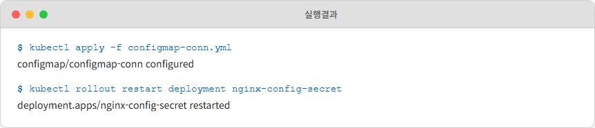

*ConfigMap을 반영하기 위해 Deployment를 재시작하는 모습입니다.*

롤아웃 메시지가 찍히고 잠시 뒤 Pod가 새 것으로 교체됐습니다. 오픈이는 다시 환경 변수를 확인했습니다.

```bash
kubectl exec -it <Pod명> -- env       # Pod 환경 변수 조회
```

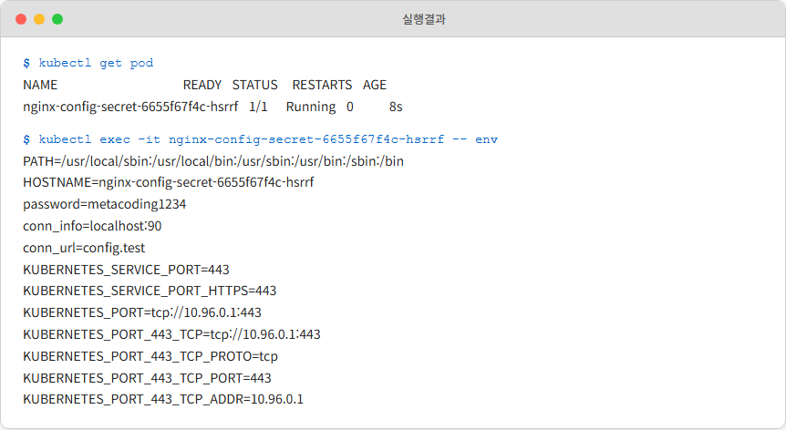

*재시작된 Pod의 환경 변수에서 포트가 90으로 바뀌어 있습니다.*

이번엔 `conn_info=localhost:90`이 제대로 찍혔습니다. Pod를 새로 뜨는 순간 ConfigMap의 새 값이 그제서야 환경 변수로 꽂힌 것이었습니다.

*apply만으로는 절반이고, 반영까지는 재시작이 있어야 한다.*

오픈이는 이걸 머릿속에 적어 뒀습니다. 설정 파일 기반으로 마운트해서 쓰면 자동 반영되는 방법도 따로 있지만, 환경 변수로 주입하는 이 방식에서는 재시작이 한 단계로 따라온다는 사실이 중요했습니다.

실습이 끝나면 다음 실습을 위해 리소스를 정리합니다.

```bash
kubectl delete deployment nginx-config-secret  # Deployment 삭제
kubectl delete configmap configmap-conn        # ConfigMap 삭제
kubectl delete secret secret-password          # Secret 삭제
```

### 6.1.5 CoreDNS : 클러스터의 전화번호부

6.3에서 실제 서비스를 올릴 때, ConfigMap 안에 DB 주소를 `db-service:3306`, Redis 주소를 `redis-service:6379`처럼 **IP가 아니라 서비스 이름** 으로 적게 됩니다. IP는 Pod가 죽었다 살아날 때마다 바뀌는데 서비스 이름은 고정되어 있기 때문입니다.

이게 가능한 이유는 쿠버네티스 안에 **CoreDNS** 라는 전용 DNS 서버가 돌고 있기 때문입니다. 2장 4.3에서 본 Docker DNS의 클러스터 버전에 해당합니다. Docker에서는 사용자 정의 네트워크 안의 컨테이너 이름을 IP로 변환해 줬습니다. 쿠버네티스에서는 Service 이름을 ClusterIP로 변환해 줍니다.

> **참고: CoreDNS**
> 쿠버네티스 클러스터 안에 기본 내장된 DNS 서버. Service가 생성되는 순간 자동으로 DNS 레코드가 등록되어, Pod는 IP 대신 Service 이름으로 상대를 부를 수 있다.

Service가 생성되면 CoreDNS에 아래 형식의 DNS 레코드가 자동 등록됩니다.

```
서비스명.네임스페이스.svc.cluster.local
```

같은 네임스페이스 안에서는 이 긴 주소 전부를 쓸 필요 없이 **서비스명만** 넣어도 됩니다. 다른 네임스페이스의 서비스를 부를 때만 `서비스명.네임스페이스` 형태가 필요합니다. `svc.cluster.local`까지 전부 붙이는 건 완전한 FQDN(Fully Qualified Domain Name)이 필요한 특수한 경우뿐입니다.


*CoreDNS가 Service 이름을 ClusterIP로 바꿔 Pod 간 통신을 이어줍니다.*

DB Pod가 어느 순간 죽어서 새로 태어나고 IP가 바뀌어도, Service의 ClusterIP는 그대로이기 때문에 설정을 따라 바꿀 필요가 없습니다. Docker DNS가 하던 일을 이름만 바꿔서 **클러스터 규모로 확장**한 구조입니다. 2장 4.4의 대응표를 다시 꺼내 보면 "Docker DNS → CoreDNS" 자리가 바로 이것입니다.

## 6.2 Volume : 데이터가 증발하지 않도록

오픈이는 ConfigMap 실습으로 가벼워진 마음에 점심을 먹고 들어왔습니다. 점심 직전에 실습용 DB Pod에 테스트 데이터를 잔뜩 넣어뒀던 참이었습니다. 회원 더미 100개, 주문 내역 몇 건. 오후 실습에 쓰려고 만든 데이터였습니다.

자리로 돌아와 `kubectl get pod`를 쳤습니다. DB Pod의 AGE가 `2m`이었습니다.

*어, 방금 뜬 건데?*

점심 전에는 한 시간 넘게 살아 있던 Pod였습니다. 오픈이는 `kubectl logs`로 이전 로그를 확인했지만 방금 올라온 것밖에 없었습니다. 점심 중에 DB Pod가 어떤 이유로 죽었고, Deployment가 알아서 살려낸 모양이었습니다. Pod는 다시 떴지만 **안에 있던 데이터는 흔적도 없이 사라진 상태** 였습니다.

*DB를 Pod에 넣어둔 게 사실 문제였나.*

Pod는 기본적으로 **휘발성** 입니다. Pod 안에서 만든 파일은 그 Pod의 수명과 함께합니다. Pod가 죽으면 같이 사라집니다. 개발용 로그야 괜찮지만, DB 데이터나 업로드된 파일처럼 **사라지면 안 되는 값** 을 Pod 안에 두는 건 위험한 선택이었습니다.

2장에서 배운 Docker의 **마운트** 가 떠올랐습니다. 호스트나 별도 볼륨에 데이터를 빼놓고, 컨테이너는 그 경로를 끌어다 쓰는 방식이었습니다. 컨테이너가 죽어도 데이터는 호스트나 볼륨에 남아 있었습니다. 쿠버네티스에서 이 개념이 같은 문제를 풀 수 있을까. 당연히 있었습니다.

> **참고: 볼륨(Volume)**
> Pod 내부 컨테이너가 사용할 수 있는 외부 저장 공간. Pod 수명과 분리되어 있어, Pod가 사라져도 데이터가 남을 수 있다.

쿠버네티스의 Volume에는 여러 종류가 있습니다.

| 종류 | 설명 | 데이터 유지 |
|------|------|------------|
| **emptyDir** | Pod 생성 시 만들어지는 임시 저장 공간. 같은 Pod 안의 컨테이너끼리 데이터를 공유할 때 사용 | Pod 삭제 시 함께 삭제 |
| **hostPath** | 워커 노드(호스트)의 특정 경로를 Pod에 마운트 | 노드에 남아 있지만, Pod가 다른 노드로 이동하면 접근 불가 |
| **PV / PVC** | 클러스터 외부에 영구 저장소를 만들고, 요청서(PVC)를 통해 Pod에 연결 | Pod가 삭제되어도 유지 |

실무에서 DB처럼 영구 데이터를 다룰 때 거의 항상 쓰는 건 세 번째인 **PV/PVC** 입니다. 나머지 둘은 "임시 스크래치 공간", "노드 로그 모아두기"처럼 용도가 다릅니다.

### 6.2.1 PV와 PVC : 창고와 신청서

PV/PVC 구조는 처음 보면 이름이 비슷해서 헷갈립니다. 선배가 종이에 간단히 그려줬습니다.


*PV는 실제 저장 공간, PVC는 저장 공간을 요청하는 신청서입니다.*

**PV(PersistentVolume)** 는 실제 저장 공간, 즉 **창고** 입니다. 몇 평짜리 창고가 있고, 어떤 성격(읽기 전용/읽기 쓰기)이며, 어디에 붙어 있는지가 PV에 정의됩니다.

**PVC(PersistentVolumeClaim)** 는 창고를 쓰겠다고 올리는 **신청서** 입니다. "나는 10Gi짜리 읽기 쓰기 가능한 창고가 필요하다"라고 적으면, 쿠버네티스가 조건에 맞는 PV를 찾아서 PVC에 연결해 줍니다. 이게 맞춰지는 순간을 **바인딩(Binding)** 이라고 부릅니다.

Pod는 PV를 직접 건드리지 않고 **PVC만** 붙여 씁니다. 실제 창고 위치는 PVC가 알아서 연결해 주기 때문에, Pod 입장에서는 "10Gi짜리 공간 하나"가 붙어 있는 것처럼 보입니다.

실습 순서는 PV 생성 → PVC 생성 → Pod 연결입니다.

#### PV 만들기

먼저 창고에 해당하는 PV를 만듭니다. 이번 실습에서는 별도의 외부 스토리지 없이 미니큐브 내부의 경로를 저장소로 사용합니다.

**yaml/volume-pv.yml**
```yaml
apiVersion: v1             # API 버전
kind: PersistentVolume     # 리소스 종류
metadata:
  name: volume-pv          # PV 이름
spec:                      # 상세 설정
  capacity:
    storage: 1Gi           # 1Gi 용량 할당
  accessModes:
    - ReadWriteOnce        # 읽기/쓰기 권한
  storageClassName: ""     # PVC가 볼륨을 자동으로 생성 못하게 방지
  hostPath:
    path: /mnt/data        # 볼륨 경로 지정
    type: DirectoryOrCreate # 경로가 없으면 자동 생성
```

`hostPath`의 `/mnt/data`는 미니큐브 내부 경로입니다. `type: DirectoryOrCreate`를 지정하면 해당 경로가 없을 때 쿠버네티스가 알아서 만들어 줍니다.

#### PVC 만들기

창고가 준비됐으니 신청서를 작성합니다.

**yaml/volume-pvc.yml**
```yaml
apiVersion: v1                 # API 버전
kind: PersistentVolumeClaim    # 리소스 종류
metadata:
  name: volume-pvc             # pod가 참조하는 pvc명
spec:                          # 상세 설정
  accessModes:
    - ReadWriteOnce        # 읽기 쓰기 권한
  storageClassName: ""     # PVC가 자동으로 PV 생성하지 않도록 설정
  resources:
    requests:
      storage: 1Gi         # 용량
  volumeName: volume-pv    # 참조할 PV명
```

PVC가 PV와 제대로 바인딩되려면 세 가지가 맞아야 합니다. `accessModes`가 같고, `storageClassName`이 같고, 요청 용량이 PV 용량 이하일 것. 하나라도 틀리면 PVC가 **Pending** 상태에 빠져 바인딩되지 않습니다.

#### Pod에 붙이기

마지막으로 Pod에서 이 PVC를 `volumes` 항목으로 선언하고, `volumeMounts`로 컨테이너 안 경로에 마운트합니다.

**yaml/volume-pod.yml**
```yaml
apiVersion: v1
kind: Pod
metadata:
  name: volume-pod
spec:                            # 상세 설정
  containers:
  - name: nginx-volume
    image: nginx
    volumeMounts:                # 사용할 볼륨 마운트
    - name: storage              # 볼륨 이름
      mountPath: /mnt/data       # 컨테이너에서 접근할 볼륨 위치
  volumes:                       # 볼륨 정의
  - name: storage                # 볼륨 이름
    persistentVolumeClaim:       # PVC 연결
      claimName: volume-pvc      # 참조할 PVC
```

Pod 입장에서는 `/mnt/data`라는 폴더가 하나 더 생긴 것처럼 보입니다. 그 폴더에 뭘 쓰면 실제 바이트는 PV가 가리키는 미니큐브 내부의 `/mnt/data` 경로에 저장됩니다.

```bash
kubectl apply -f volume-pv.yml        # PV 생성
kubectl apply -f volume-pvc.yml       # PVC 생성
kubectl apply -f volume-pod.yml       # Pod 생성
```

세 리소스를 순서대로 만들고, PV와 PVC의 바인딩 상태를 확인했습니다.

```bash
kubectl get pv,pvc            # PV와 PVC 바인딩 상태 확인
```


*STATUS가 BOUND면 PV와 PVC가 연결된 상태입니다.*

두 리소스 모두 `STATUS`가 `Bound`로 찍혔습니다. 이 순간부터 Pod의 `/mnt/data`에 쓰인 데이터는 Pod 수명과 분리됩니다.

#### 실제로 파일이 살아남는지 확인

Pod 안에 들어가 파일을 하나 만들었습니다.

```bash
kubectl exec -it volume-pod -- /bin/bash  # Pod 내부 접속
touch /mnt/data/c.txt                    # 볼륨 경로에 파일 생성
ls /mnt/data                             # 파일 목록 확인
exit                                     # Pod에서 빠져나오기
```

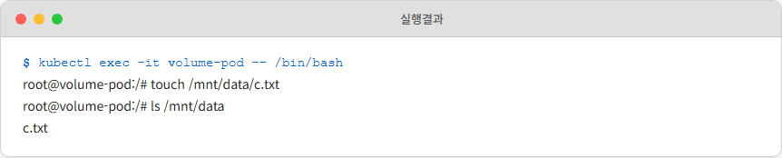

*Pod 안의 `/mnt/data`에 `c.txt` 파일이 만들어졌습니다.*

오픈이는 Pod를 일부러 삭제하고, 같은 PVC를 참조하는 Pod를 다시 만들어 파일이 남아 있는지 봤습니다.

```bash
kubectl delete pod volume-pod             # Pod 삭제
kubectl apply -f volume-pod.yml           # 같은 PVC로 Pod 재생성
kubectl exec -it volume-pod -- /bin/bash  # 파일 확인
ls /mnt/data                              # 파일 확인
```


*Pod가 새로 태어났는데도 `c.txt`가 그대로 남아 있습니다.*

Pod는 분명히 새 것이었는데 `c.txt`가 그대로 있었습니다. 파일의 실체는 Pod가 아니라 PV에 있고, PVC는 새 Pod에게도 같은 창고를 이어준 것이었습니다. 2장 2.8에서 본 볼륨 마운트의 원리가 이름과 리소스 종류만 바뀌어서 다시 나온 셈이었습니다. 범위가 호스트 한 대에서 클러스터 전체로 넓어졌을 뿐입니다.

*점심 먹으러 갔을 때 날아간 데이터가, 이제는 안 날아간다.*

정리하면 역할 분담이 다음처럼 됩니다.

- **인프라 운영자**: PV를 만들고 관리한다. 실제 저장 공간이 어디 있고 얼마나 큰지.
- **애플리케이션 개발자**: PVC를 작성한다. "얼마짜리 창고가 필요하다"는 요청.
- **Pod**: PVC를 참조해 창고를 이어 쓴다.

실습이 끝나면 리소스를 정리합니다.

```bash
kubectl delete pod volume-pod          # Pod 삭제
kubectl delete pvc volume-pvc          # PVC 삭제
kubectl delete pv volume-pv            # PV 삭제
```

## 6.3 웹사이트 : Kubernetes 배포

### 6.3.1 처음 올려보는 서비스

ConfigMap도 해봤고, Secret도 해봤고, 데이터가 증발하지 않는 것도 확인했습니다. 각각은 돌아가는 걸 봤지만, 이게 실제 서비스 한 덩어리가 되면 어떤 느낌인지는 아직 감이 없었습니다.

팀장이 자리에서 일어서며 한 마디 던졌습니다.

**팀장**: "저번에 Compose로 띄우던 거, 이번엔 K8s로 올려봐."

3장에서 Docker Compose로 돌리던 **프론트 + 백엔드 + DB** 구성에 **Redis** 한 대를 더해서 쿠버네티스 위에 올리는 작업이었습니다. Compose에서는 사용자가 늘어나면 수동으로 스케일을 바꿔야 했고, 하나가 죽으면 수동으로 띄워야 했습니다. 쿠버네티스로 옮기면 자동 복구와 무중단 배포까지 따라옵니다.

오픈이는 의자를 바짝 당겨 앉았습니다. 챕터 하나를 쭉 읽는 것과, 실제 서비스를 네 개를 엮어서 한 번에 올리는 건 분명 달랐습니다. 화면을 보는 속도가 평소보다 조금 빨라졌습니다.

*네 개를 한 번에. ConfigMap, Secret, PV/PVC, Service, Ingress가 다 들어간다.*

> 실습 코드는 https://github.com/metacoding-10-linux-docker/docker/tree/master/ex08 에서 확인할 수 있습니다.

### 6.3.2 전체 그림

배포할 애플리케이션은 네 개의 서비스로 구성됩니다. **프론트엔드(Nginx)**, **백엔드(Spring Boot)**, **DB(MySQL)**, **Redis**.


*ex08 Kubernetes 웹사이트의 전체 구성입니다.*

쿠버네티스에서는 외부 요청이 클러스터 안으로 바로 들어갈 수 없습니다. 그래서 앞단에 **Ingress** 가 놓입니다. 브라우저 요청은 Ingress를 거쳐 **Frontend Service** 로 넘어가고, 프론트엔드가 `/api/...` 요청을 받으면 **Backend Service** 로 넘깁니다. 백엔드는 **DB Service** 와 **Redis Service** 를 호출합니다.

모든 Pod 간 통신은 **Service 이름** 으로 이뤄집니다. CoreDNS가 이름을 ClusterIP로 바꿔주고, kube-proxy의 iptables 규칙이 실제 Pod로 요청을 꽂아 넣습니다. 5장에서 본 흐름이 그대로 동작하는 현장이 됩니다.

### 6.3.3 이미지 폴더

EX08 폴더는 이미지를 찍는 부분(backend, db, frontend, redis)과 쿠버네티스 배포 설정(k8s)으로 나뉩니다.

```
ex08/
├── backend/
│   ├── Dockerfile
│   └── entrypoint.sh
├── db/
│   ├── Dockerfile
│   └── init.sql
├── frontend/
│   ├── Dockerfile
│   ├── index.html
│   └── nginx.conf
├── redis/
│   └── Dockerfile
└── k8s/
```

Backend, DB, Frontend 폴더는 3장의 EX07과 거의 같은 구조입니다. 여기서는 새로 더해진 **Redis**, 그리고 **방문 횟수 카운터** 가 들어간 부분만 살펴봅니다.

**ex08/redis/Dockerfile**
```dockerfile
FROM redis:7.4-alpine       # Redis 이미지 사용
CMD ["redis-server"]         # Redis 서버 실행
```

Redis는 별도 코드가 없으니 Dockerfile이 아주 짧습니다. 공식 이미지를 가져와서 그대로 서버로 띄웁니다.

백엔드에서는 Redis를 읽고 쓰는 코드가 추가됐습니다.

**ex08/backend/entrypoint.sh**
```bash
#!/bin/bash
git clone https://github.com/metacoding-10-linux-docker/backend-redis-server  # 백엔드 서버 내려받기
cd backend-redis-server      # 내려받은 폴더로 이동
chmod +x gradlew             # 실행 권한 부여
./gradlew build              # 스프링 프로젝트 빌드
java -jar -Dspring.profiles.active=prod build/libs/*.jar  # 빌드된 파일 실행
```

이전과 차이는 `git clone` 주소뿐입니다. Redis 연동이 들어간 새 브랜치를 받아옵니다.

**UserController.java**
```java
@GetMapping("/api/users")
public ResponseEntity<?> findAll() {

    List<User> users = userRepository.findAll();       // DB에서 회원 목록 조회

    Long count = redisTemplate.opsForValue()
            .increment("cnt:/api/users:total");        // Redis 방문 횟수 증가

    Map<String, Object> response = new HashMap<>();
    response.put("users", users);                      // 회원 목록
    response.put("count", count);                      // 방문 횟수

    return Resp.ok(response);
}
```

DB에서 회원 목록을 꺼내고, Redis의 `cnt:/api/users:total` 키를 1 증가시킨 뒤, 둘을 묶어서 돌려줍니다. Redis는 요청이 들어올 때마다 카운터를 올려주는 역할입니다.

프론트엔드는 이 카운터 값을 화면에 띄웁니다.

**ex08/frontend/index.html** (핵심 부분 발췌)
```html
<h1>사용자 리스트</h1>
<h2>방문 횟수: <span id="visit-count">0</span></h2>

<script>
  fetch('/api/users')                    // nginx가 backend로 프록시
    .then(response => response.json())
    .then(data => {
      const users = data.body.users;     // 회원 목록
      const count = data.body.count;     // 방문 횟수

      users.forEach(user => {            // 응답 데이터를 테이블에 렌더링
        $("#user-list").append(render(user));
      });

      $("#visit-count").text(count);     // 방문 횟수 표시
    });
  // ... 생략
</script>
```

`/api/users`를 호출하면 Nginx가 백엔드로 프록시하고, 돌아온 응답에서 회원 목록과 방문 횟수를 화면에 렌더링합니다.

프록시 설정은 nginx.conf에서 서비스 이름으로 지정합니다. Compose 때는 컨테이너 이름을 쓰던 자리가 이제 **쿠버네티스 Service명** 으로 바뀝니다.

**ex08/frontend/nginx.conf**
```nginx
events {}

http {
    # 백엔드 서버 주소 (K8s Service명으로 수정)
    upstream backend {
        server backend-service:8080;
    }

    server {
        listen 80;
        server_name _;

        # 정적 파일 제공
        location / {
            root   /usr/share/nginx/html;
            index  index.html;
        }

        # API 요청은 백엔드로 프록시
        location /api/ {
            proxy_pass http://backend;
        }
    }
}
```

`upstream backend`의 `server backend-service:8080`이 핵심입니다. 이 이름은 곧 뒤에서 만들 Backend Service의 이름과 정확히 같아야 합니다. CoreDNS가 이 이름을 ClusterIP로 바꿔 줍니다.

### 6.3.4 k8s 폴더

이미지 네 개를 다 만들어 놨다면 다음은 쿠버네티스 리소스입니다. k8s 폴더 안에 서비스별로 YAML이 모여 있습니다.

```
k8s/
├── backend/
│   ├── backend-configmap.yml
│   ├── backend-deploy.yml
│   ├── backend-secret.yml
│   └── backend-service.yml
├── db/
│   ├── db-deploy.yml
│   ├── db-pv.yml
│   ├── db-pvc.yml
│   ├── db-secret.yml
│   └── db-service.yml
├── frontend/
│   ├── frontend-deploy.yml
│   ├── frontend-ingress.yml
│   └── frontend-service.yml
├── redis/
│   ├── redis-deploy.yml
│   └── redis-service.yml
└── namespace.yml
```

| 파일 | 설명 |
|------|------|
| namespace.yml | 리소스를 논리적으로 구분하는 `Namespace` 생성 |
| *-deploy.yml | 각 서버의 `Deployment` (Pod 생성 및 관리) |
| *-service.yml | 각 서버의 `Service` (고정 IP로 Pod 접근) |
| frontend-ingress.yml | 외부 요청을 프론트엔드 `Service`로 라우팅하는 `Ingress` |
| backend-configmap.yml | 백엔드 환경 변수 (DB 주소, Redis 주소) |
| backend-secret.yml | 백엔드 민감 정보 (DB 계정/비밀번호) |
| db-secret.yml | DB 민감 정보 (MySQL 계정/비밀번호) |
| db-pv.yml / db-pvc.yml | DB 데이터 영구 저장을 위한 `PV`/`PVC` |

#### Namespace : 층을 나눈다

지금까지 오픈이가 만든 리소스는 전부 `default`라는 기본 공간에 생겼습니다. 혼자 실습할 때는 괜찮지만, 팀의 여러 서비스가 한 `default`에 섞이면 이름 충돌이 시작됩니다. 프론트엔드 팀의 `backend-service`와 결제팀의 `backend-service`가 같은 네임스페이스에 있으면 이름이 겹쳐서 만들 수 없습니다.

**Namespace** 는 회사 건물의 **층** 과 같습니다. 1층은 프론트엔드, 2층은 백엔드, 3층은 데이터 팀. 같은 건물 안에서 층만 나눠도 각 팀이 독립적으로 공간을 관리할 수 있습니다. 이름도 층마다 따로 씁니다.


*같은 클러스터 안에서 Namespace가 리소스를 층처럼 분리합니다.*

> **참고: Namespace**
> 쿠버네티스 리소스를 논리적으로 구분하는 가상 공간. 별도로 지정하지 않으면 모든 리소스는 **default** 네임스페이스에 들어간다.

이번 실습에서는 `metacoding`이라는 네임스페이스를 만들어 모든 리소스를 그 안에 넣습니다.

**ex08/k8s/namespace.yml**
```yaml
apiVersion: v1           # API 버전
kind: Namespace          # 리소스 종류
metadata:
  name: metacoding       # 네임스페이스 이름
```

각 리소스 YAML의 `metadata`에 `namespace: metacoding`이 들어가 있는 이유가 여기 있습니다. 조회할 때는 `-n metacoding`을 붙여야 합니다.

```bash
kubectl get pod -n metacoding        # metacoding 네임스페이스의 Pod 조회
```

#### backend-deploy.yml : 모든 개념이 모이는 곳

backend-deploy.yml은 이번 실습에서 가장 많은 개념이 한 파일에 모이는 자리입니다. `replicas: 2`로 Pod를 두 개로 띄우고, `envFrom`으로 ConfigMap과 Secret을 한꺼번에 가져와 환경 변수로 주입합니다.

**ex08/k8s/backend/backend-deploy.yml**
```yaml
apiVersion: apps/v1
kind: Deployment
metadata:
  name: backend-deploy
  namespace: metacoding                        # namespace 설정
spec:
  replicas: 2                                  # pod 2개 생성
  selector:
    matchLabels:
      app: backend                             # app: backend 라벨을 가진 pod 관리
  template:
    metadata:
      labels:
        app: backend                           # pod에 app: backend 라벨 붙임
    spec:
      containers:
        - name: backend-server
          image: metacoding/backend:1
          ports:
            - containerPort: 8080               # 8080 포트 사용
          envFrom:
            - configMapRef:
                name: backend-configmap         # configmap 연결
            - secretRef:
                name: backend-secret            # secret 연결
```

`backend-configmap`에는 DB 주소와 Redis 주소 같은 일반 설정이 들어가고, `backend-secret`에는 DB 계정과 비밀번호가 들어갑니다. Spring Boot는 그 환경 변수를 `application.yml`의 placeholder로 자동으로 끌어다 씁니다. 6.1에서 연습한 구조 그대로입니다.

Service, ConfigMap, Secret 파일은 앞에서 본 형태와 동일합니다. 전체 코드는 Github을 참고합니다.

#### db-deploy.yml : 데이터를 영구히

db-deploy.yml에서는 6.2의 PV/PVC를 실제로 꽂습니다. `volumeMounts`로 컨테이너의 `/var/lib/mysql` 경로를 `db-pvc`에 연결해 놓으면, Pod가 죽어도 MySQL 데이터 파일은 PV에 그대로 남습니다.

**ex08/k8s/db/db-deploy.yml**
```yaml
apiVersion: apps/v1                    # API 버전
kind: Deployment
metadata:
  name: db-deploy
  namespace: metacoding                # namespace 설정
spec:
  replicas: 1                          # Pod 1개 유지
  selector:                            # 관리할 Pod 선택 조건
    matchLabels:
      app: db                          # app: db 라벨을 가진 pod 관리
  template:
    metadata:
      labels:
        app: db                        # pod에 app: db 라벨 부여
    spec:
      containers:
        - name: db-server
          image: metacoding/db:1
          ports:
            - containerPort: 3306      # 3306 포트 사용
          envFrom:
            - secretRef:
                name: db-secret        # DB 접속을 위한 환경 변수 연결
          volumeMounts:
            - name: data
              mountPath: /var/lib/mysql  # volume 경로 설정
      volumes:
        - name: data
          persistentVolumeClaim:
            claimName: db-pvc            # PVC 연결
```

`volumes`에서 이름을 `data`로 붙여두고, `volumeMounts`에서 같은 이름으로 참조해 컨테이너 경로에 꽂는 구조입니다. Secret, PV, PVC, Service 파일은 앞에서 본 구조와 동일합니다.

#### 나머지 리소스

frontend와 redis의 Deployment/Service는 backend와 같은 틀입니다. 이미지명, 라벨, 포트만 다릅니다.

| 항목 | frontend | redis |
|------|----------|-------|
| image | metacoding/frontend:1 | metacoding/redis:1 |
| containerPort | 80 | 6379 |
| replicas | 1 | 1 |
| Service port | 80 | 6379 |

#### frontend-ingress.yml : 외부에서 들어오는 문

마지막으로 Ingress 리소스입니다. 5장에서 본 대로 외부 HTTP 요청을 받아 `frontend-service`로 넘기는 규칙을 정의합니다.

**ex08/k8s/frontend/frontend-ingress.yml**
```yaml
apiVersion: networking.k8s.io/v1         # API 버전
kind: Ingress                            # 리소스 종류
metadata:
  name: frontend-ingress                 # Ingress 이름
  namespace: metacoding                  # 네임스페이스 지정
spec:                                    # 상세 설정
  rules:                                 # 라우팅 규칙
    - http:                              # HTTP 규칙
        paths:                           # 경로 설정
          - path: /                       # 모든 경로
            pathType: Prefix             # 경로 매칭 방식
            backend:                     # 요청을 전달할 대상
              service:                   # 서비스 지정
                name: frontend-service    # 프론트엔드 Service로 연결
                port:                    # 포트 설정
                  number: 80             # 서비스 포트 번호
```

`path: /`는 모든 경로를 받는다는 뜻입니다. 어떤 URL이든 프론트엔드로 넘기고, `/api/...`에서 갈라지는 프록시는 nginx.conf가 내부에서 처리합니다.

> 전체 k8s 설정 파일은 https://github.com/metacoding-10-linux-docker/docker/tree/master/ex08/k8s 에서 확인할 수 있습니다.

### 6.3.5 올리기

리소스 파일을 다 그려 놓고, 실제로 클러스터에 적용하는 차례입니다. 오픈이는 터미널을 네 칸으로 쪼개 놓고 키보드에 손을 올렸습니다.

미니큐브가 꺼져 있으면 먼저 켭니다.

```bash
minikube start                        # 미니큐브 클러스터 시작
```

#### Ingress Controller 활성화

Ingress **리소스** 만 YAML로 적어둔다고 외부 요청이 들어오는 게 아닙니다. 그 리소스를 실제로 해석해서 트래픽을 넘겨줄 **Ingress Controller** 가 클러스터 안에서 돌고 있어야 합니다. 미니큐브에서는 애드온으로 켭니다.

```bash
minikube addons enable ingress        # Ingress Controller 활성화
```


*애드온으로 Nginx Ingress Controller가 설치됩니다.*

```bash
kubectl get pod -n ingress-nginx      # Ingress Controller Pod 상태 확인
```


*ingress-nginx-controller Pod가 Running 상태면 정상입니다.*

#### 이미지 빌드

미니큐브는 별도의 가상 환경 안에서 도는 클러스터입니다. 로컬 PC에서 `docker build`로 찍은 이미지를 미니큐브는 바로 알아보지 못합니다. 별도 레지스트리에 올리지 않고 그대로 쓰려면 **`minikube image build`** 로 미니큐브 내부에 직접 이미지를 찍어야 합니다.

```bash
minikube image build -t metacoding/db:1 ./db            # DB 이미지 빌드
minikube image build -t metacoding/backend:1 ./backend   # 백엔드 이미지 빌드
minikube image build -t metacoding/frontend:1 ./frontend # 프론트엔드 이미지 빌드
minikube image build -t metacoding/redis:1 ./redis       # Redis 이미지 빌드
```

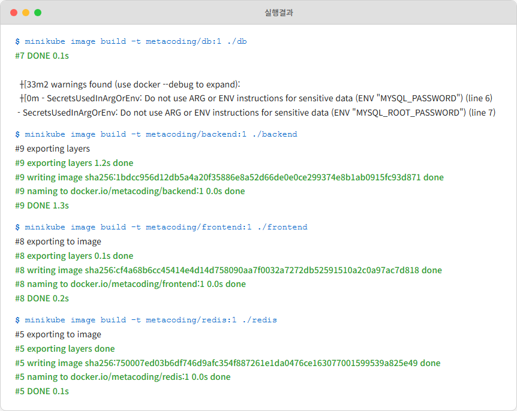

*미니큐브 내부에 네 이미지가 차례로 빌드됩니다.*

#### 리소스 생성

네임스페이스 먼저, 나머지 리소스 한 번에.

```bash
kubectl apply -f k8s/namespace.yml    # Namespace 생성
```

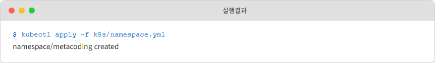

*`metacoding` 네임스페이스가 만들어집니다.*

```bash
kubectl apply -f k8s/ --recursive     # k8s 폴더의 모든 리소스 일괄 생성
```

`--recursive`는 k8s 아래 하위 폴더까지 내려가서 모든 YAML을 순회합니다. ConfigMap, Secret, PV, PVC, Deployment, Service, Ingress가 한꺼번에 올라갑니다.

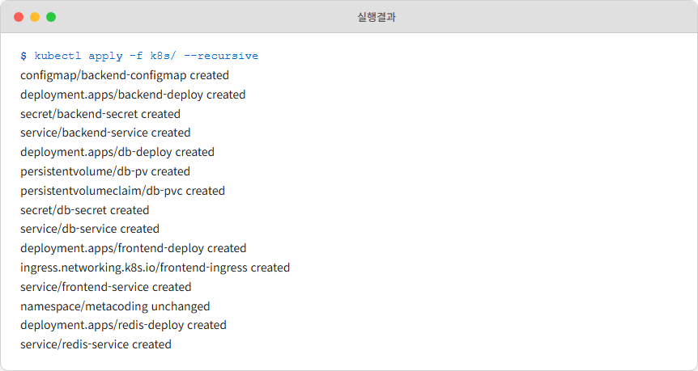

*백엔드, DB, 프론트엔드, Redis의 모든 리소스가 일괄로 생성됩니다.*

```bash
kubectl get deploy,pod,service -n metacoding  # Deployment, Pod, Service 조회
```

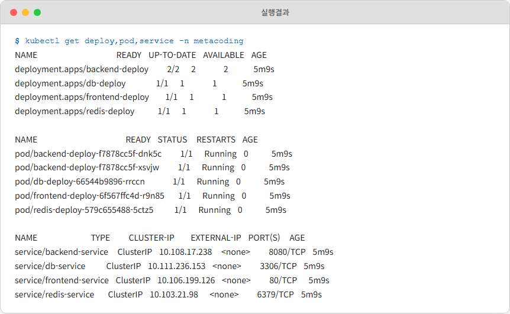

*Deployment, Pod, Service가 metacoding 네임스페이스에 나란히 떠 있습니다.*

Pod가 전부 `Running` 상태가 될 때까지는 잠깐 기다려야 합니다. 특히 backend Pod는 `git clone`과 `gradlew build`를 내부에서 돌리기 때문에 몇 분이 걸립니다. 이 시간 동안 오픈이는 `Running`이 뜨는지 `get pod`를 몇 번 새로고침하며 지켜봤습니다.

#### 로그로 실제 기동 확인

Pod STATUS가 `Running`이라는 것과 **애플리케이션이 실제로 떠 있다**는 것은 서로 다른 이야기입니다. 특히 Spring Boot는 로그에 포트 바인딩 완료 메시지가 뜨기 전까지는 요청을 받지 못합니다. 로그를 확인해야 합니다.

```bash
kubectl logs deploy/db-deploy -n metacoding --tail=5       # DB 서버 로그 확인
kubectl logs deploy/frontend-deploy -n metacoding --tail=5 # 프론트엔드 서버 로그 확인
kubectl logs deploy/backend-deploy -n metacoding --tail=5  # 백엔드 서버 로그 확인
```

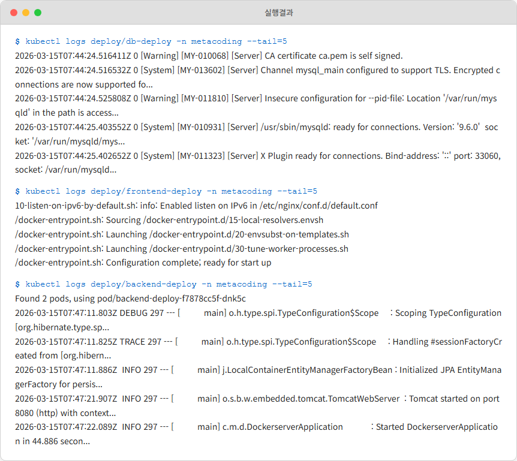

*DB, 프론트엔드, 백엔드의 시작 로그를 확인합니다.*

DB는 `ready for connections`, 프론트엔드는 nginx 시작 메시지, 백엔드는 `Tomcat started on port 8080`까지 확인하면 됩니다.

#### Ingress로 붙어 보기

```bash
kubectl get ingress -n metacoding     # Ingress 리소스 조회
```

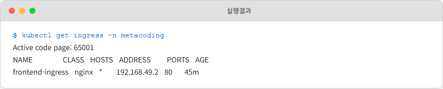

*ADDRESS 칼럼에 IP가 찍히면 Ingress가 준비된 상태입니다.*

Ingress ADDRESS가 채워지기까지 1~2분이 걸릴 수 있습니다. 그동안 `minikube tunnel`을 켜 둡니다. Docker Desktop 드라이버를 쓰는 환경에서는 로컬 PC에서 미니큐브 내부 IP로 직접 접근할 수 없어서 터널이 필요합니다.

> `minikube tunnel`은 포그라운드로 도는 명령이다. 이 터미널을 그대로 두고 새 창을 열어 다음 명령을 쳐야 한다. 터널이 꺼지면 접속도 끊긴다.

```bash
minikube tunnel                       # 로컬 PC에서 클러스터 접근을 위한 터널 생성
```


*터널이 열리고 로컬에서 클러스터에 접근할 수 있게 됩니다.*

오픈이는 브라우저 주소창에 `http://127.0.0.1`을 찍고 엔터를 눌렀습니다. 잠깐 로딩 표시가 돌더니 페이지가 떴습니다. 회원 이름이 표 형태로 쭉 내려오고, 상단에 **방문 횟수: 1** 이라는 숫자가 찍혀 있었습니다.

*떴다.*


*Ingress를 거쳐 웹사이트가 화면에 응답합니다.*

오픈이는 F5를 두 번 더 눌렀습니다. 방문 횟수가 **2**, **3** 으로 올라갔습니다. 화면 숫자가 한 칸씩 오를 때마다 안도감 같은 게 뒤늦게 올라왔습니다. 네 개의 Pod가 각자 자리에서 돌고 있고, Service가 이름으로 서로를 부르고 있고, Redis가 카운터를 받아 기록하고 있다는 뜻이었습니다.


*여러 번 새로고침하면 방문 횟수가 증가합니다.*

자동 복구와 무중단 배포까지 뒤에 딸려오는 상태였습니다. `minikube service`로 임시 URL을 뽑아 접속하던 4~5장의 방식과 달리, Ingress는 도메인 기반 라우팅이 가능해 실제 운영 환경에 훨씬 가깝습니다.

새 터미널을 하나 더 열고, 실제로 백엔드 두 Pod에 요청이 분산되는지 확인했습니다.

```bash
kubectl get pod -n metacoding         # metacoding 네임스페이스의 Pod 목록 조회
```

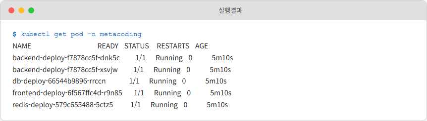

*Pod 목록에 backend-deploy가 두 개 올라와 있습니다.*

```bash
kubectl logs deploy/backend-deploy -n metacoding --tail=10  # 백엔드 서버 로그 확인
```

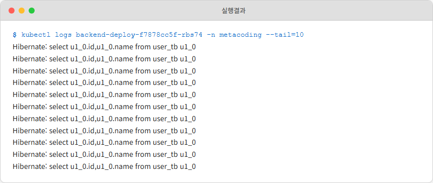

*백엔드 Pod 1에 요청이 들어와 SELECT 쿼리가 찍힙니다.*

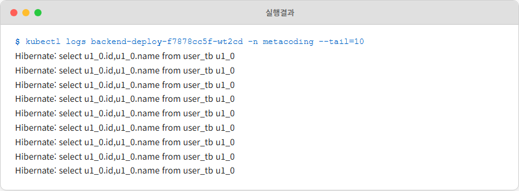

*백엔드 Pod 2에도 SELECT 쿼리가 찍힙니다. 요청이 분산된 모습입니다.*

두 Pod 모두 `SELECT * FROM users` 로그가 남아 있었습니다. `backend-service`가 들어온 요청을 두 Pod에 번갈아 넘기고 있다는 증거였습니다. 5장에서 배운 Service의 로드밸런싱이 눈으로 확인된 순간이었습니다.

### 전체 패킷 경로

오픈이가 `http://127.0.0.1`을 찍었을 때, 패킷은 아래 관문을 차례로 통과합니다.

```
브라우저 -> minikube tunnel -> Ingress Controller(Nginx Pod)
        -> frontend-service -> Frontend Pod
        -> (프론트엔드가 /api/users 요청)
        -> backend-service -> Backend Pod
        -> db-service -> DB Pod / redis-service -> Redis Pod
```

이 경로에서 모든 서비스 간 호출은 IP가 아니라 **서비스 이름** 으로 일어납니다. CoreDNS가 이름을 ClusterIP로 바꾸고, 각 Service 뒤에 놓인 **kube-proxy의 iptables 규칙** 이 실제 Pod로 DNAT을 수행합니다. 5장의 `Ingress(L7) → Service(Label-Selector) → kube-proxy(iptables) → Pod`가 말 그대로 순서대로 동작하는 현장입니다.


*전체 경로 (1) 브라우저에서 Frontend Pod까지 도달하는 과정입니다.*


*전체 경로 (2) Frontend에서 Backend, DB, Redis까지의 흐름입니다.*

## 6.4 문제가 생겼을 때 : 디버깅

### 6.4.1 Pending으로 멈춘 Pod

배포를 처음 성공한 다음 날 오후, 오픈이는 코드를 조금 고치고 새로 배포했습니다. 같은 `kubectl apply -f k8s/ --recursive`였는데 이번엔 결과가 달랐습니다. Pod 목록을 띄우자 몇 개가 **Pending** 에 머물러 있었습니다.

```bash
kubectl get pod -n metacoding
```

STATUS가 `Running`으로 넘어가지 않고 2분, 3분이 지나도 그대로였습니다. 선풍기 돌아가는 소리가 다시 크게 들렸습니다.

*왜 안 떠.*

어제는 한 번에 됐던 게 오늘은 안 되는 상황이었습니다. 오픈이는 처음엔 `kubectl apply`를 다시 쳤습니다. 결과는 같았습니다. 두 번째로 Pod를 지우고 다시 만들어 봤습니다. 그래도 Pending이었습니다.

선배가 지나가며 모니터를 봤습니다.

**선배**: "지우고 다시 만들지 말고, 왜 안 되는지부터 먼저 봐."

오픈이는 키보드에서 손을 떼고 의자에 잠깐 기댔습니다. `Pending`이라는 상태는 "아직 뜨려고 시도 중" 혹은 "뜨지 못하고 있다"는 신호였습니다. 이유는 쿠버네티스가 **자기 로그에 이미 적어 놓은 상태** 였습니다. 그 로그를 읽기만 하면 됐습니다.

쿠버네티스에는 문제를 진단할 때 네 개의 명령어가 쓰입니다. `logs`, `describe`, `get events`, `get endpoints`. 이 네 개면 대부분 해결됩니다.

### 6.4.2 네 개의 기본 진단 명령어

#### 로그 확인 : kubectl logs

Pod 안 애플리케이션의 stdout/stderr를 그대로 보여줍니다. 앱이 떠 있는데 동작이 이상할 때 가장 먼저 여는 창입니다.

```bash
kubectl logs <Pod명>                  # Pod 로그 확인
kubectl logs <Pod명> --tail=20        # 최근 20줄만 확인
kubectl logs <Pod명> -f               # 실시간 로그 스트리밍
```

#### 상태와 이벤트 확인 : kubectl describe

Pod의 현재 상태, 환경 변수, 마운트 정보, 그리고 하단의 **Events** 섹션에 쿠버네티스가 직접 남긴 메시지가 시간순으로 보입니다. `Pending` 상태의 Pod는 보통 여기에 원인이 적혀 있습니다.

```bash
kubectl describe pod <Pod명>          # Pod 상세 정보 + 이벤트
kubectl describe service <Service명>  # Service 상세 정보
```

#### 클러스터 전체 이벤트 : kubectl get events

특정 리소스가 아니라 클러스터 전체에서 일어난 이벤트를 시간순으로 봅니다.

```bash
kubectl get events --sort-by='.lastTimestamp'  # 최신 이벤트 순 조회
```

#### 연결 상태 확인 : kubectl get endpoints

Service가 실제로 어떤 Pod에 연결되어 있는지 보여줍니다. Service에 요청은 가는데 응답이 없으면 여기가 비어 있는 경우가 많습니다.

```bash
kubectl get endpoints <Service명>
```

### 6.4.3 4단계 진단 순서

오픈이는 선배의 한 마디를 따라 네 단계를 순서대로 돌려봤습니다.

**1단계. Pod 상태 확인**

```bash
kubectl get pod -n metacoding
```

Pending인 Pod 이름을 확인했습니다. backend-deploy의 한 Pod이 Pending에 멈춰 있었습니다.

**2단계. describe로 Events 읽기**

```bash
kubectl describe pod <Pending Pod명> -n metacoding
```

출력 맨 아래 Events 섹션에 이런 줄이 찍혀 있었습니다.

```
Failed to pull image "metacoding/backend:2":
rpc error: ... not found
```

이미지 태그가 `:2`로 박혀 있었는데, 오픈이는 미니큐브 내부에 아직 `:1`까지만 빌드해 놓은 상태였습니다. `backend-deploy.yml`을 수정하면서 이미지 태그를 올려놓고 빌드는 새로 안 돌린 것이었습니다. 증상은 **ImagePullBackOff** 였습니다.

*describe 한 번에 끝났는데, 아까는 왜 apply만 반복했지.*

3단계와 4단계까지 가기 전에 원인이 보였습니다.

**3단계. 앱 에러라면 logs**

`Running`인데 동작이 이상하면 `kubectl logs`로 애플리케이션 에러를 봅니다. Spring이 DB 접속 실패로 죽으면 여기서 스택트레이스가 잡힙니다.

**4단계. Service 연결이 안 되면 endpoints**

Service 호출이 연결 자체가 안 되면 `kubectl get endpoints`를 찍어 봅니다. 결과가 `<none>`이면 Service의 `selector`와 Pod의 `labels`가 안 맞는 경우가 대부분입니다.

### 6.4.4 자주 만나는 에러 모음

| 증상 | 원인 | 해결 |
|------|------|------|
| **ImagePullBackOff** | 이미지 이름 오타 또는 레지스트리 접근 불가 | `kubectl describe pod <Pod명>`으로 이미지명 확인. 오타를 수정하거나 이미지가 레지스트리에 있는지 확인 |
| **CrashLoopBackOff** | 앱 에러로 컨테이너가 반복 재시작 | `kubectl logs <Pod명>`으로 에러 로그 확인. 앱 코드나 환경 변수 설정 점검 |
| **Pending** | 리소스(CPU/메모리) 부족 또는 PVC 바인딩 실패 | `kubectl describe pod <Pod명>`의 Events에서 원인 확인. 노드 리소스나 PV 설정 점검 |
| **Service 접속 불가** | selector와 Pod labels 불일치 | `kubectl get endpoints <Service명>`으로 연결된 Pod가 있는지 확인. labels가 일치하는지 점검 |
| **Ingress 접속 불가** | Ingress Controller 미설치 또는 tunnel 미실행 | `kubectl get pod -n ingress-nginx`로 Controller 확인. `minikube tunnel` 실행 여부 점검 |

오픈이는 이미지 태그를 다시 `:1`로 돌리고 `kubectl apply -f backend-deploy.yml`을 쳤습니다. 롤아웃이 돌더니 Pod 상태가 `Running`으로 바뀌었습니다. 방문 횟수가 다시 한 칸씩 올라갔습니다.

*네 단계. 지우지 말고, 먼저 읽자.*

이게 이번 챕터에서 오픈이가 챙긴 마지막 습관이었습니다.

## 이것만은 기억하자

- **설정은 코드 밖, 데이터는 영구히.** ConfigMap과 Secret으로 설정과 민감 정보를 이미지에서 분리하고, PV/PVC로 Pod가 사라져도 데이터가 남도록 한다. 환경 변수는 프로세스 시작 시점에 한 번만 꽂히므로 ConfigMap을 바꾼 뒤에는 `kubectl rollout restart`로 Pod를 재시작해야 반영된다.
- **Secret은 금고가 아니라 더 조심히 다루는 상자다.** Base64는 암호화가 아니므로, 실제 보안은 RBAC으로 조회 권한을 제한하거나 etcd 암호화 혹은 외부 Vault를 붙여 확보한다.
- **CoreDNS는 클러스터의 전화번호부다.** 2장 Docker DNS가 클러스터 규모로 확장된 것이다. `서비스명.네임스페이스.svc.cluster.local` 형태의 레코드가 자동 등록되고, 같은 네임스페이스라면 서비스명만으로 서로를 부를 수 있다.
- **종합 배포는 이전 장의 개념이 한 자리에 합류하는 자리다.** 프론트엔드/백엔드/DB/Redis 네 개의 Pod가 Namespace로 분리되고, Service로 이름으로 불리고, Ingress로 외부와 연결되고, PV/PVC로 DB가 영구해진다.
- **문제가 생기면 지우지 말고 먼저 읽는다.** `kubectl get pod → describe → logs → get endpoints` 네 단계면 대부분의 문제는 원인까지 따라간다.

### 책 전체를 돌아보며

오픈이가 챕터 1에서 처음 겪은 배포 지옥을 다시 떠올려 봅니다. Java 버전이 서로 달라 한 서버에서 세 프로젝트가 충돌했고, 서버 증설 견적은 반려됐고, 환경 차이를 알아낼 수단이 없었습니다. 책을 따라오면서 오픈이는 여섯 개의 관문을 차례로 통과했습니다.

- **챕터 1.** 컨테이너라는 아이디어. 표준 상자에 담으면 어디서든 같은 결과가 나온다는 것.
- **챕터 2.** Docker 하나의 원리. 격리된 프로세스, 이미지와 컨테이너, 포트포워딩과 볼륨. 컨테이너 하나를 손으로 주무를 수 있게 된 지점.
- **챕터 3.** Dockerfile과 Docker Compose. 컨테이너 여러 개를 한 번에 조립하는 법. 서비스라는 단위가 처음 보이기 시작한 자리.
- **챕터 4.** 쿠버네티스의 첫 관문. Pod, Deployment. "원하는 상태를 선언하면 시스템이 맞춘다"는 감각.
- **챕터 5.** 네트워크 조립. Service, Ingress, kube-proxy, CoreDNS. Docker 시절의 용어가 이름만 바꿔 클러스터 규모로 올라가는 장면.
- **챕터 6.** 실제 운영. 설정 분리, 데이터 보존, 네 개의 서비스 종합 배포, 그리고 디버깅. 책을 덮은 뒤에도 남을 습관.

책을 덮고 나면 `kubectl` 옵션 중 상당수는 기억에서 흐려질 것입니다. 괜찮습니다. 옵션은 공식 문서에 있습니다. 남아야 할 건 **"어떤 문제가 있고, 그 문제를 어떤 도구가 풀어주고, 그 도구끼리는 어떻게 맞물리는가"** 에 대한 지도입니다. 이 지도가 머릿속에 남아 있다면 새로운 에러를 만나도 어느 문서를 펼쳐야 할지 판단할 수 있습니다. 명령어는 잊어도 됩니다. 지도가 남으면 이 책은 제 역할을 한 것입니다.

오픈이는 노트북을 덮기 전 한 줄을 적어 뒀습니다.

> "새벽에 알람이 와도 쿠버네티스가 먼저 움직인다. 물론, 알람이 아예 안 오는 게 제일 좋긴 하다."

팀장이 지나가다가 그 화면을 보고 짧게 웃었습니다.

**팀장**: "이제 운영 얘기할 때 낯설지는 않겠네."

선배도 커피잔을 들며 한 마디를 보탰습니다.

**선배**: "명령어보다 지도가 남았으면 된 거야."

오픈이는 그제야 어깨에서 힘을 뺐습니다. 사무실 창밖이 어느새 저녁이 되어 있었습니다.
