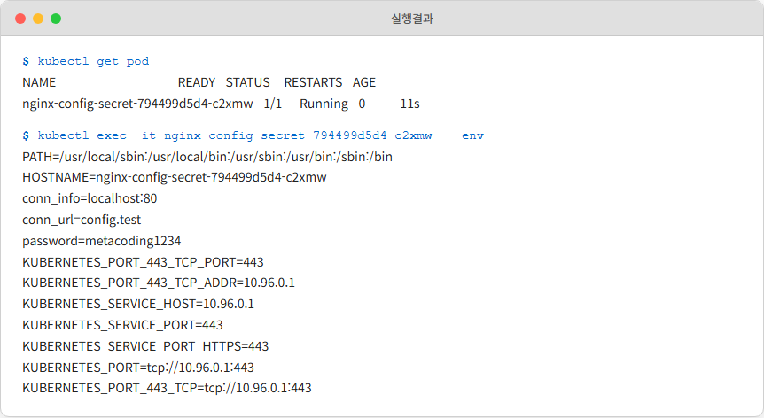
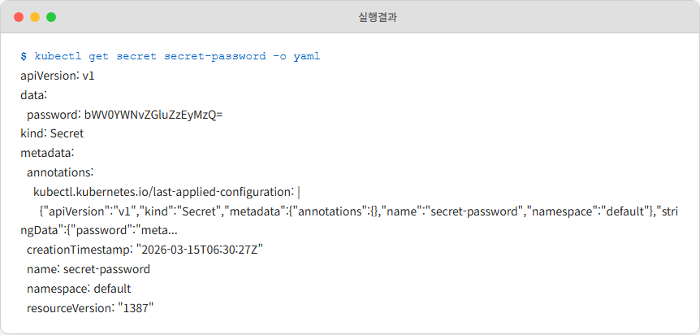
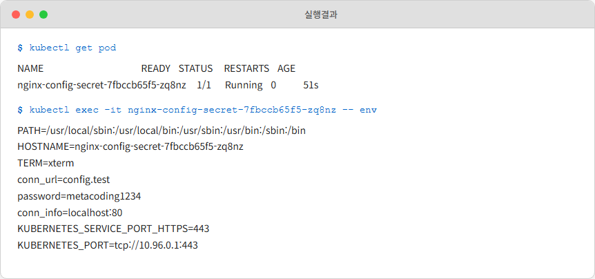
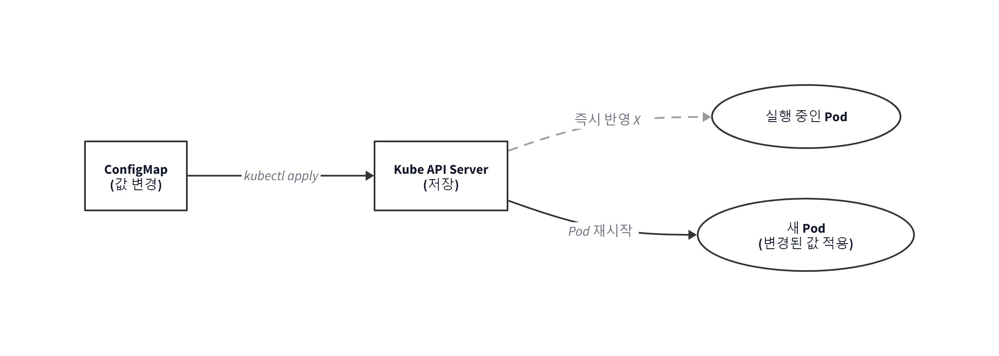
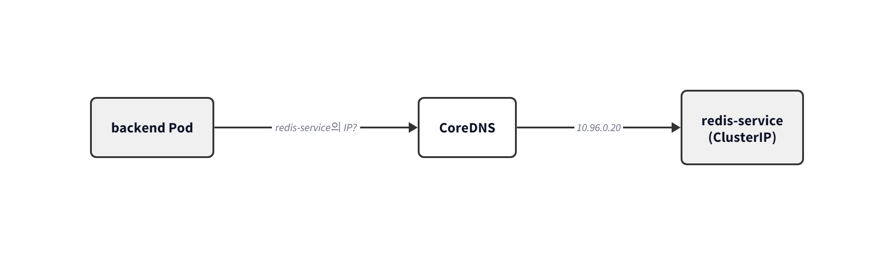
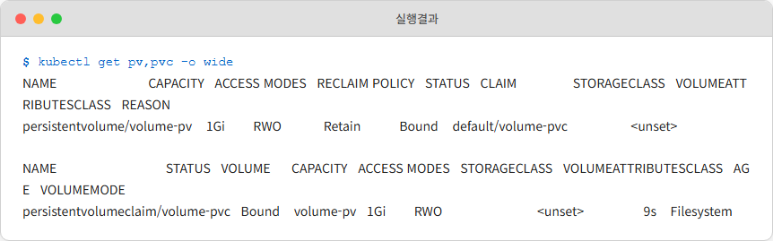
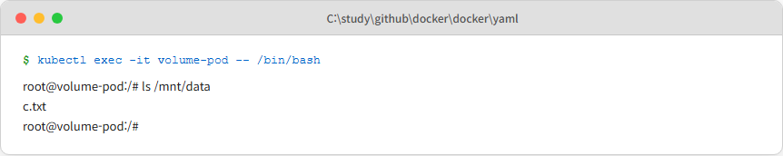
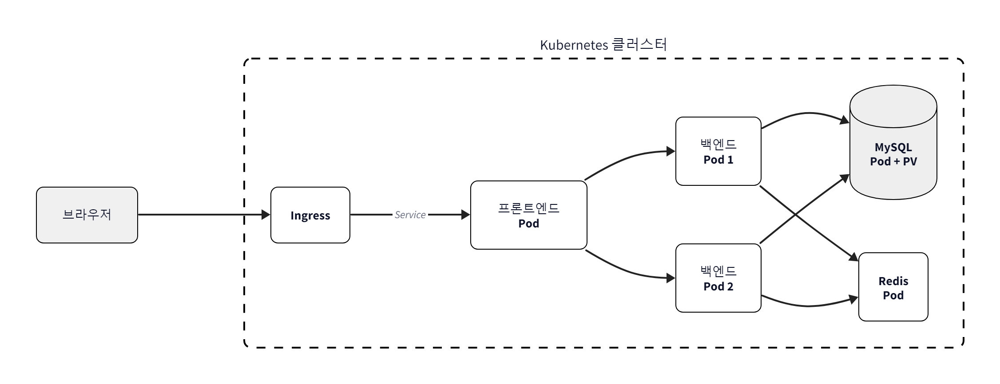
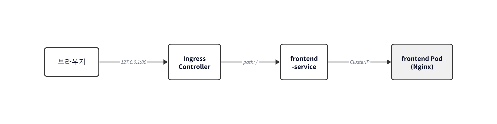
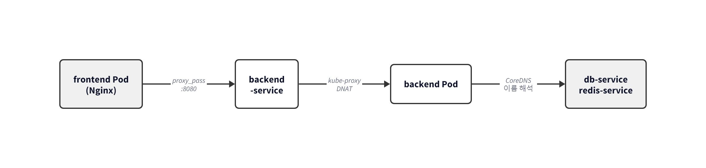

# Ch.6 Kubernetes 운영하기

네트워크는 갖춰졌습니다. 이제 프로젝트를 K8s 위에 실제로 올려볼 차례인데, 오픈이가 Deployment YAML을 쓰다가 손이 멈췄습니다. DB 비밀번호를 어디에 넣어야 할지 모르겠었습니다.

챕터 3에서는 `docker-compose.yml`에 환경 변수로 그냥 적어뒀습니다. 그때는 로컬에서 돌리는 거라 괜찮았는데, 운영 환경에 올리는 YAML에 비밀번호를 그대로 넣으면 Git 저장소에 남습니다. DB 주소 같은 설정값도 환경마다 달라질 텐데, 이미지 안에 고정해두면 환경 바꿀 때마다 이미지를 다시 빌드해야 합니다. 그리고 DB 컨테이너가 재시작되면 데이터가 날아가는 문제도 아직 남아 있었습니다.

## 6.1 설정과 비밀번호를 이미지 바깥으로

### 6.1.1 이미지에 비밀번호를 박으면 안 된다

오픈이는 잠시 상상해 봤습니다. DB 비밀번호를 교체해야 한다는 요청이 왔을 때, 비밀번호가 이미지 안에 박혀 있다면 어떻게 될까요. 비밀번호 한 자리만 바꾸려고 **이미지를 다시 빌드**합니다. **Hub에 다시 올리고** Deployment를 **새 이미지로 교체**해야 합니다. 설정 한 줄 바꾸는 데 전체 배포 사이클이 돕니다. 게다가 개발용 비밀번호가 Git 저장소에 그대로 남는 위험까지 따라옵니다.

**선배**: "비밀번호 Dockerfile에 박지 마. 설정은 이미지 바깥에, 이미지는 코드만."

*'바깥이라면… 어디에?'*

이미지 안에 넣으면 안 되고, YAML에 직접 쓰면 Git에 남습니다. 설정값과 비밀번호를 따로 보관할 장소가 필요했습니다. Kubernetes에는 그 장소가 있었습니다. 프랜차이즈로 치면, 본사가 매장에 **메뉴판**을 내려보내고 **금고 안의 레시피**는 따로 관리하는 방식입니다. 매장을 새로 짓지 않고 메뉴판만 바꿔 내려보내면 됩니다.

K8s에서 이 역할을 나눠 맡는 리소스가 두 개 있습니다.


*그림 6-1 ConfigMap과 Secret은 이미지와 별개로 Pod에 설정과 민감 정보를 주입*

- **ConfigMap** — 일반 설정값을 담는 **공용 메뉴판**. DB 주소, 접속 URL, 로그 레벨처럼 환경마다 바뀔 수 있는 값을 여기에 적어 둡니다.
- **Secret** — 비밀번호·토큰·API 키 같은 민감한 값을 담는 **공용 금고**. ConfigMap과 구조는 비슷한데, 값이 Base64로 인코딩되어 저장되고 권한 관리를 따로 합니다.

챕터 4에서 프랜차이즈 매핑 표에 "공용 메뉴판 = ConfigMap, 공용 금고 = Secret"이라고 적어뒀던 항목이 이제 실제로 쓰입니다.

### 6.1.2 ConfigMap

일반 설정을 담는 ConfigMap부터 만들어 봤습니다.

**yaml/configmap-conn.yml**
```yaml
apiVersion: v1
kind: ConfigMap
metadata:
  name: configmap-conn               # ConfigMap 이름 지정
data:                                # 설정값 넣는 영역
  conn_info: "localhost:80"
  conn_url: "config.test"
```

`data` 아래에 키-값 쌍을 적어두기만 하면 됩니다. YAML 자체는 크게 특별할 게 없습니다.

이 ConfigMap을 Pod가 쓰려면 Deployment 쪽에서 끌어와야 합니다. `envFrom.configMapRef`를 쓰면 ConfigMap의 모든 키가 한꺼번에 환경 변수로 주입됩니다.

**yaml/deploy-ex03.yml** (핵심)
```yaml
apiVersion: apps/v1
kind: Deployment
metadata:
  name: nginx-config-secret            # Deployment 이름 (재시작 시 이 이름으로 지목)
spec:
  template:
    spec:
      containers:
        - name: nginx-container
          image: nginx:1.20
          envFrom:
            - configMapRef:
                name: configmap-conn   # ConfigMap 연결
```

```bash
kubectl apply -f configmap-conn.yml
kubectl apply -f deploy-ex03.yml
kubectl exec -it <Pod명> -- env       # Pod 환경 변수 조회
```



*그림 6-2 Pod 안의 환경 변수 목록에서 ConfigMap의 값이 보임*

`conn_info=localhost:80`과 `conn_url=config.test`가 환경 변수로 그대로 들어와 있었습니다. **이미지를 건드리지 않고 설정 값만 바깥에서 주입**할 수 있었습니다.

*'이미지 재빌드 없이 설정만 바꿔 끼울 수 있다는 얘기네.'*

### 6.1.3 Secret

DB 비밀번호도 같은 식으로 ConfigMap에 적으면 될까. 그건 아닙니다. 비밀번호·토큰 같은 민감한 값은 메뉴판 위에 그대로 적어두면 안 되니까요. 이런 값을 담기 위한 별도 리소스가 **Secret**입니다.

**yaml/secret-password.yml**
```yaml
apiVersion: v1
kind: Secret
metadata:
  name: secret-password
stringData:                 # 평문을 자동으로 Base64 변환
  password: metacoding1234
```

`stringData`에 평문을 적으면 Kubernetes가 자동으로 Base64로 인코딩해서 저장합니다.

```bash
kubectl apply -f secret-password.yml
kubectl get secret secret-password -o yaml
```



*그림 6-3 Secret 내부를 보면 비밀번호가 Base64로 인코딩된 상태*

결과에서 `password` 값이 Base64로 인코딩된 문자열로 바뀌어 있었습니다.

*'인코딩은 됐지만 풀면 원문이 나온다. 암호화 아니라는 거네.'*

> **참고: Secret과 Base64**
> Secret은 비밀번호·토큰·API 키 같은 민감한 정보를 담는 리소스입니다. 값이 Base64로 인코딩되어 저장되지만, **Base64는 암호화가 아니라 단순 인코딩**입니다. `kubectl get secret -o yaml`로 뽑아 디코딩하면 원문이 그대로 보입니다. 실제 보안은 RBAC으로 조회 권한 제한, etcd 암호화, 외부 Vault 연동 같은 방법으로 확보하며, 이 책 범위를 벗어납니다. 이 단계에서는 "Secret은 ConfigMap과 구분해 관리한다"는 신호로만 이해하면 됩니다.

Pod에 주입하는 방식은 ConfigMap과 똑같습니다. `configMapRef` 옆에 `secretRef`를 한 줄 더 붙이면 됩니다.

```yaml
envFrom:
  - configMapRef:
      name: configmap-conn
  - secretRef:
      name: secret-password   # Secret 연결 (추가)
```

환경 변수 안에서 값은 이미 **평문**입니다. Base64는 저장할 때만 쓰이고, Pod에서 읽을 땐 자동으로 풀어서 넣어주기 때문입니다.



*그림 6-4 환경 변수 목록에 Secret의 값이 평문으로 들어와 있다*

이미지 안에는 비밀번호가 없고, 실행 시점에 Secret에서 꺼내 주입됩니다. 설정과 민감 정보를 이미지 바깥으로 빼는 건 됐습니다.

### 6.1.4 환경 변수는 Pod 재시작해야 반영된다

ConfigMap을 수정했을 때 주의할 점이 있습니다. ConfigMap 자체는 `kubectl apply`로 바로 업데이트되지만, **이미 떠 있는 Pod의 환경 변수는 바뀌지 않습니다**. 리눅스에서 환경 변수는 **프로세스가 시작될 때 한 번 꽂히는 값**이기 때문입니다.



*그림 6-5 ConfigMap을 수정한 뒤에는 Pod를 재시작해야 값이 환경 변수로 반영*

새 값을 반영하려면 Pod를 **재시작**해야 합니다.

```bash
kubectl apply -f configmap-conn.yml
kubectl rollout restart deployment nginx-config-secret   # Pod 재시작
```

`kubectl rollout restart`는 여러 Pod를 안전하게 순차 교체해 주는 명령입니다. "apply만으로는 절반이고, 반영까지는 재시작이 필요하다"는 점만 기억해 두면 됩니다.

*'환경변수는 시작할 때 한 번 꽂히고 끝. 리눅스 원리랑 같구나.'*

### 6.1.5 CoreDNS — 서비스 이름으로 통신

6.3 종합실습에서 ConfigMap 안에 DB 주소를 `db-service:3306`, Redis 주소를 `redis-service:6379`처럼 **IP가 아니라 서비스 이름**으로 적게 됩니다. 서비스 이름은 고정이라 IP 변동에 영향받지 않기 때문입니다.

이게 가능한 이유는 Kubernetes 안에 **CoreDNS**라는 전용 DNS 서버가 돌고 있어서입니다. 챕터 2의 Docker DNS와 원리는 같습니다. Docker는 컨테이너 이름을 내부 DNS에 자동 등록했고, Kubernetes는 **Service 이름을 CoreDNS에 자동 등록**합니다. 규모만 다르고 같은 구조입니다.



*그림 6-6 CoreDNS가 Service 이름을 ClusterIP로 변환해 Pod 간 통신을 연결*

> **참고: CoreDNS**
> Kubernetes 클러스터 안에 기본 내장된 DNS 서버입니다. Service가 생성되는 순간 자동으로 DNS 레코드가 등록되어, Pod는 IP 대신 Service 이름으로 상대를 부를 수 있습니다. 같은 네임스페이스 안에서는 서비스명만 써도 되고, 다른 네임스페이스 서비스를 부를 때만 `서비스명.네임스페이스` 형태가 필요합니다.

*'챕터 2 Docker DNS가 규모만 커져서 다시 나타난 셈이네.'*

비밀번호는 Secret에서, 설정은 ConfigMap에서 꺼내 쓰게 됐습니다. 그런데 DB 컨테이너가 재시작되면 데이터는 어떻게 될까요. 실습이 끝난 뒤 리소스를 정리했습니다.

```bash
kubectl delete deployment nginx-config-secret
kubectl delete configmap configmap-conn
kubectl delete secret secret-password
```

## 6.2 Volume — 데이터가 날아가지 않도록

### 6.2.1 Pod는 휘발성이다

프로젝트에 MySQL이 들어가는데, Pod가 재시작되면 그 안의 데이터는 어떻게 될까. Pod는 기본적으로 **휘발성**입니다. Pod 안에서 만든 파일은 그 Pod의 수명과 함께하다가, Pod가 죽으면 같이 사라집니다. 회원 정보가 담긴 DB 데이터가 Pod와 함께 날아가면 안 됩니다.

*'Pod 지워지면 DB 데이터도 같이 사라지는 거야?'*

챕터 2에서 본 Docker의 **마운트**가 떠올랐습니다. 호스트나 별도 볼륨에 데이터를 빼두고 컨테이너는 그 경로를 끌어다 쓰는 방식이었습니다. Kubernetes에도 같은 기능이 있고, 이름이 **Volume**입니다.

> **참고: 볼륨(Volume)**
> Pod 내부 컨테이너가 사용할 수 있는 외부 저장 공간입니다. Pod 수명과 분리되어 있어, Pod가 사라져도 데이터가 남을 수 있습니다.

Volume에는 여러 종류가 있습니다.

| 종류 | 설명 | 데이터 유지 |
|------|------|------------|
| **emptyDir** | Pod 생성 시 만들어지는 임시 저장 공간 | Pod 삭제 시 함께 삭제 |
| **hostPath** | 워커 노드(호스트)의 특정 경로를 Pod에 마운트 | 노드에 남지만, Pod가 다른 노드로 이동하면 접근 불가 |
| **PV / PVC** | 클러스터 외부에 영구 저장소를 만들고 요청서(PVC)로 Pod에 연결 | Pod가 삭제되어도 유지 |

오늘 대목표에 쓸 것은 세 번째, **PV / PVC**입니다. DB 데이터처럼 영구 보존이 필요한 자리에 거의 항상 쓰이는 방식입니다.

### 6.2.2 PV와 PVC — 창고와 신청서

*'Volume이 저장 공간이라는 건 알겠는데, PV랑 PVC는 왜 두 개로 나눠져 있지?'*

Pod가 직접 저장 공간을 관리하면 인프라 세부 사항까지 알아야 합니다. 그래서 Kubernetes는 저장 공간을 **만드는 쪽**과 **쓰겠다고 요청하는 쪽**을 분리해 뒀습니다. 한 장 그림으로 보면 관계가 분명해집니다.


*그림 6-7 PV는 실제 저장 공간, PVC는 그 공간을 요청하는 신청서*

- **PV(PersistentVolume)**: 실제 저장 공간, 즉 **창고**입니다. 용량, 권한, 위치 같은 창고의 사양이 정의됩니다.
- **PVC(PersistentVolumeClaim)**: 창고를 쓰겠다고 올리는 **신청서**입니다. "10Gi짜리 읽기·쓰기 가능한 창고가 필요하다"고 적어두면, Kubernetes가 조건에 맞는 PV를 찾아 자동으로 PVC와 연결합니다.

Pod는 PV를 직접 건드리지 않고 **PVC만** 붙여 씁니다. 실제 창고 위치는 PVC가 알아서 연결해 주기 때문에, Pod 입장에서는 "용량 맞는 저장 공간 하나"가 붙어 있는 모양새입니다.

실습 순서는 PV → PVC → Pod입니다.

#### PV 만들기

```yaml
# volume-pv.yml
apiVersion: v1
kind: PersistentVolume
metadata:
  name: volume-pv
spec:
  capacity:
    storage: 1Gi
  accessModes:
    - ReadWriteOnce
  storageClassName: ""                 # 자동 StorageClass 비활성, 아래 PVC에서 정적 바인딩
  hostPath:
    path: /mnt/data
    type: DirectoryOrCreate
```

이번 실습에서는 외부 스토리지 없이 Minikube 내부의 경로(`/mnt/data`)를 저장소로 썼습니다. `storageClassName: ""`은 PVC가 자동으로 StorageClass로 새 PV를 만드는 걸 막고, 지금 만든 이 PV에 **정적으로 바인딩**하게 하는 지정입니다.

#### PVC 만들기

```yaml
# volume-pvc.yml
apiVersion: v1
kind: PersistentVolumeClaim
metadata:
  name: volume-pvc
spec:
  accessModes:
    - ReadWriteOnce
  storageClassName: ""
  resources:
    requests:
      storage: 1Gi
  volumeName: volume-pv                # 바인딩할 PV 이름을 수동 지정
```

`volumeName`은 "이 PVC를 특정 PV에 수동으로 붙이라"는 지정입니다. 위 PV의 `metadata.name`과 같은 값을 적어 정적 바인딩을 보장합니다.

PVC가 PV와 바인딩되려면 `accessModes`, `storageClassName`이 같고, 요청 용량이 PV 용량 이하여야 합니다. 하나라도 안 맞으면 PVC가 **Pending** 상태에 빠져 바인딩되지 않습니다.

#### Pod에 붙이기

Pod는 `volumes`로 PVC를 선언하고, `volumeMounts`로 컨테이너 안 경로에 마운트합니다.

```yaml
# volume-pod.yml
apiVersion: v1
kind: Pod
metadata:
  name: volume-pod
spec:
  containers:
  - name: nginx-volume
    image: nginx
    volumeMounts:
    - name: storage
      mountPath: /mnt/data
  volumes:
  - name: storage
    persistentVolumeClaim:
      claimName: volume-pvc
```

Pod 입장에서는 `/mnt/data`라는 폴더 하나가 더 생긴 것처럼 보이고, 그 폴더에 뭘 쓰면 실제로는 PV가 가리키는 경로에 저장됩니다. 챕터 2에서 본 Docker 볼륨 마운트의 원리가 이름만 바뀌어 클러스터 규모로 확장됩니다.

```bash
kubectl apply -f volume-pv.yml
kubectl apply -f volume-pvc.yml
kubectl apply -f volume-pod.yml
kubectl get pv,pvc
```



*그림 6-8 STATUS가 Bound면 PV와 PVC가 연결된 상태*

*'창고와 신청서가 엮였다.'*

Pod 안에 들어가 파일을 하나 만든 뒤, Pod를 일부러 삭제하고 같은 PVC를 참조하는 Pod를 다시 만들어 봤습니다.

```bash
kubectl exec -it volume-pod -- /bin/bash
touch /mnt/data/c.txt
exit

kubectl delete pod volume-pod
kubectl apply -f volume-pod.yml
kubectl exec -it volume-pod -- ls /mnt/data
```



*그림 6-9 Pod가 새로 태어났는데도 c.txt가 그대로 남아 있다*

Pod는 분명히 새 것이었는데 `c.txt`가 그대로 있었습니다. 파일의 실체가 Pod가 아니라 PV에 있고, PVC는 새 Pod에게도 같은 창고를 이어준 결과였습니다. 세 가지 과제 중 "데이터 영속성"이 이 실습으로 해결됐습니다.

*'Pod는 갈려도 창고는 그대로. DB 데이터 날릴 걱정이 사라진다.'*

역할 분담을 정리하면 이렇게 됩니다.

- **인프라 운영자**: PV를 만들고 관리 (실제 저장 공간)
- **애플리케이션 개발자**: PVC를 작성 (얼마짜리 창고가 필요한지 요청)
- **Pod**: PVC를 참조해 창고를 이어 씀

실습이 끝난 뒤 리소스를 정리했습니다.

```bash
kubectl delete pod volume-pod
kubectl delete pvc volume-pvc
kubectl delete pv volume-pv
```

## 6.3 K8s 위에 풀스택 웹사이트 올리기 — 오늘의 대목표

설정은 빼냈고, 데이터는 보존됩니다. 네트워크도 챕터 5에서 갖춰뒀습니다. 이제 챕터 3 Compose 프로젝트를 K8s로 옮길 차례입니다.

*'지금까지 배운 걸 전부 모아서 한 번에 띄워보자.'*

오픈이는 노트를 펼쳤습니다. Deployment, Service, ConfigMap, Secret, PV/PVC, Ingress. 한 챕터씩 쌓아온 부품들이 거기 적혀 있었습니다. 이번에는 부품을 하나씩 따로 보는 게 아니라 전부 조립해서 실제로 돌아가는 서비스를 만들어야 했습니다.

> 실습 코드: https://github.com/metacoding-10-linux-docker/docker/tree/master/ex08

### 6.3.1 전체 그림

배포할 애플리케이션은 네 서비스입니다. **프론트엔드(Nginx)**, **백엔드(Spring Boot)**, **DB(MySQL)**, **Redis**. 챕터 3 EX07 구성에 Redis가 더해져, 방문 횟수 카운터까지 붙는 구조입니다.



*그림 6-10 ex08 Kubernetes 웹사이트의 전체 구성*

브라우저 요청이 Ingress → Frontend Service → Frontend Pod로 가고, 프론트의 Nginx가 `/api/...` 요청을 받으면 `nginx.conf`의 `proxy_pass`를 타고 클러스터 안 `backend-service`로 넘깁니다. 거기서 Backend Pod로 전달되고, 백엔드는 다시 DB Service와 Redis Service를 호출합니다. Spring Boot가 내부적으로 쓰는 Tomcat의 기본 포트 8080이 그대로 `containerPort: 8080`이 되고, Backend Service가 그 8080을 `targetPort`로 지목합니다.

모든 Pod 간 통신은 **Service 이름**으로 이뤄집니다. CoreDNS가 이름을 ClusterIP로 바꾸고, kube-proxy의 iptables 규칙이 실제 Pod로 요청을 밀어 넣습니다. 챕터 5에서 그린 "브라우저→Pod 전체 경로"가 그대로 쓰이는 자리입니다.

*'챕터 3 풀스택이 부품 그대로 K8s 위로 올라가는 거구나.'*

### 6.3.2 폴더 구조와 진행 방식

EX08 폴더는 이미지를 찍는 부분(backend, db, frontend, redis)과 K8s 배포 설정(k8s)으로 나뉩니다.

```
ex08/
├── backend/                          # Spring Boot 백엔드 이미지
│   ├── Dockerfile                    # JDK 이미지 + entrypoint.sh 복사
│   └── entrypoint.sh                 # Git clone + Gradle 빌드 + JAR 실행
├── db/                               # MySQL 이미지
│   ├── Dockerfile                    # MySQL 이미지 + init.sql 복사
│   └── init.sql                      # 테이블·초기 데이터 생성 스크립트
├── frontend/                         # NGINX + HTML 이미지
│   ├── Dockerfile                    # nginx 이미지 + index.html·nginx.conf 복사
│   ├── index.html                    # 로그인/게시판 UI (방문 카운터 표시)
│   └── nginx.conf                    # /api 경로를 backend-service로 프록시
├── redis/                            # Redis 이미지
│   └── Dockerfile                    # redis 공식 이미지 기반
├── k8s/                              # K8s 리소스 매니페스트
│   ├── namespace.yml                 # ex08 네임스페이스 정의
│   ├── backend/
│   │   ├── backend-configmap.yml     # 비밀이 아닌 설정값
│   │   ├── backend-deploy.yml        # 백엔드 Deployment
│   │   ├── backend-secret.yml        # DB 비밀번호 등 민감 정보
│   │   └── backend-service.yml       # 내부용 ClusterIP Service
│   ├── db/
│   │   ├── db-deploy.yml             # MySQL Deployment
│   │   ├── db-pv.yml                 # PersistentVolume (노드 로컬 저장소)
│   │   ├── db-pvc.yml                # PersistentVolumeClaim (볼륨 요청)
│   │   ├── db-secret.yml             # MySQL 계정 정보
│   │   └── db-service.yml            # 내부용 ClusterIP Service
│   ├── frontend/
│   │   ├── frontend-deploy.yml       # 프론트 Deployment
│   │   ├── frontend-ingress.yml      # 외부 진입점 (Ingress)
│   │   └── frontend-service.yml      # 내부용 ClusterIP Service
│   └── redis/
│       ├── redis-deploy.yml          # Redis Deployment
│       └── redis-service.yml         # 내부용 ClusterIP Service
└── README.md                         # 실습 안내
```

이미지 레이어는 챕터 3 EX07과 거의 같고, Redis가 새로 추가되고 백엔드에 방문 횟수 카운터 로직이 추가됐습니다. 이번 절은 이미지 제작보다 **K8s 리소스 작성**에 초점을 맞춥니다.

진행 순서는 단순합니다. 먼저 YAML을 쭉 훑어 각 리소스가 무슨 역할인지 정리하고, 그다음 `kubectl apply -f k8s/ --recursive` 한 줄로 **네 서비스를 한 번에** 올립니다. Compose 시절의 `docker compose up`처럼, K8s에서도 폴더 하나를 통째로 던져 주면 쿠버네티스가 알아서 서로를 찾아 맞물립니다. 
### 6.3.3 공통 준비

리소스를 올리기 전에 Minikube와 Ingress Controller, 네 이미지가 먼저 준비되어야 합니다.

```bash
minikube start
minikube addons enable ingress
kubectl get pod -n ingress-nginx   # Controller Pod Running 확인
```


*그림 6-11 Nginx Ingress Controller 애드온 설치*

Minikube는 별도 가상 환경 안에서 도는 클러스터라, 로컬에서 `docker build`로 찍은 이미지를 바로 알아보지 못합니다. 별도 레지스트리 없이 쓰려면 **`minikube image build`** 로 Minikube 내부에 직접 찍는 방식을 쓰면 됩니다.

```bash
minikube image build -t metacoding/db:1 ./db
minikube image build -t metacoding/backend:1 ./backend
minikube image build -t metacoding/frontend:1 ./frontend
minikube image build -t metacoding/redis:1 ./redis
```

### 6.3.4 리소스 살펴보기

K8s 리소스는 네 묶음입니다. 서비스별로 폴더가 나뉘어 있고, 폴더마다 Deployment·Service가 기본으로 들어 있습니다. Backend에는 ConfigMap과 Secret이, DB에는 PV·PVC와 Secret이 추가로 붙습니다. Frontend에는 외부 진입용 Ingress가 붙습니다.

#### Namespace — 팀별 층

지금까지 오픈이가 만든 리소스는 전부 `default`에 들어가 있었습니다. `kubectl get`을 칠 때마다 이전 실습에서 만든 리소스와 지금 만든 리소스가 뒤섞여 나왔습니다.

*'혼자 쓸 땐 그럭저럭인데, 팀 서비스가 같이 들어가면 이름이 겹치겠는데?'*

같은 건물이라도 층을 나누면 호수가 겹쳐도 문제가 없습니다. Kubernetes에도 그런 구분이 있었습니다. **Namespace**는 같은 클러스터 안을 논리적으로 나눠주는 공간입니다.


*그림 6-12 같은 클러스터 안에서 Namespace가 리소스를 층처럼 분리*

> **참고: Namespace**
> Kubernetes 리소스를 논리적으로 구분하는 가상 공간입니다. 별도로 지정하지 않으면 모든 리소스는 **default** 네임스페이스에 들어갑니다.

*'같은 건물 안에 층을 나누는 셈이네. 팀 섞여도 리소스가 안 섞이겠다.'*

이번 실습은 `metacoding` 네임스페이스를 만들어 모든 리소스를 그 안에 넣습니다.

```yaml
# k8s/namespace.yml
apiVersion: v1
kind: Namespace
metadata:
  name: metacoding
```

#### Frontend — Deployment + Service + Ingress

이미지는 `metacoding/frontend:1`. Nginx가 80포트에서 정적 HTML을 서빙하고, `/api/...` 요청은 `nginx.conf`의 `proxy_pass`를 타고 `backend-service`로 넘어갑니다.

**ex08/k8s/frontend/frontend-deploy.yml** (핵심)
```yaml
apiVersion: apps/v1
kind: Deployment
metadata:
  name: frontend-deploy
  namespace: metacoding
spec:
  replicas: 1
  selector:
    matchLabels:
      app: frontend
  template:
    metadata:
      labels:
        app: frontend
    spec:
      containers:
        - name: frontend-server
          image: metacoding/frontend:1
          ports:
            - containerPort: 80
```

Frontend Service는 Pod의 80포트를 클러스터 안 대표 번호로 묶고, Ingress는 외부 요청 `/`를 이 Service로 넘깁니다.

**ex08/k8s/frontend/frontend-ingress.yml**
```yaml
apiVersion: networking.k8s.io/v1
kind: Ingress
metadata:
  name: frontend-ingress
  namespace: metacoding
spec:
  rules:
    - http:
        paths:
          - path: /
            pathType: Prefix
            backend:
              service:
                name: frontend-service
                port:
                  number: 80
```

#### Backend — Deployment + Service + ConfigMap + Secret

Spring Boot는 DB 주소와 비밀번호를 환경 변수로 받는데, 이미지에 넣어두면 안 되는 값이라 ConfigMap과 Secret으로 바깥에 두고 Deployment에서 끌어옵니다. 포트는 Tomcat 기본값 8080을 그대로 씁니다.

**ex08/k8s/backend/backend-configmap.yml** (핵심)
```yaml
apiVersion: v1
kind: ConfigMap
metadata:
  name: backend-configmap
  namespace: metacoding
data:
  SPRING_DATASOURCE_URL: jdbc:mysql://db-service:3306/metadb?useSSL=false&serverTimezone=UTC&useLegacyDatetimeCode=false&allowPublicKeyRetrieval=true
  SPRING_DATASOURCE_DRIVER_CLASS_NAME: com.mysql.cj.jdbc.Driver
  SPRING_DATA_REDIS_HOST: redis-service
  SPRING_DATA_REDIS_PORT: "6379"
```

`db-service`, `redis-service`가 **Service 이름**입니다. IP를 직접 쓰지 않는 이유는 6.1.5 CoreDNS에서 다뤘습니다. DB Pod가 죽었다 살아도 Service 이름은 그대로입니다.

**ex08/k8s/backend/backend-secret.yml** (핵심)
```yaml
apiVersion: v1
kind: Secret
metadata:
  name: backend-secret
  namespace: metacoding
type: Opaque
stringData:
  SPRING_DATASOURCE_USERNAME: metacoding
  SPRING_DATASOURCE_PASSWORD: metacoding1234
```

**ex08/k8s/backend/backend-deploy.yml** (핵심)
```yaml
spec:
  replicas: 2
  template:
    spec:
      containers:
        - name: backend-server
          image: metacoding/backend:1
          ports:
            - containerPort: 8080
          envFrom:
            - configMapRef:
                name: backend-configmap
            - secretRef:
                name: backend-secret
```

*'이미지 태그는 안 바꾸고 설정·비밀번호만 외부에서 갈아 끼우면 끝이네.'*

#### DB — Deployment + Service + PV + PVC + Secret

DB Deployment에는 6.2에서 다룬 **PV/PVC**가 실제로 붙습니다. Pod 하나가 죽어도 회원 데이터는 PV에 남습니다.

> **참고: DB를 Deployment로 배포하는 이유**
> 실무에서 DB처럼 상태를 가진 워크로드는 **StatefulSet**이라는 별도 리소스로 관리합니다. Pod마다 고정 이름과 전용 볼륨을 보장해 주기 때문입니다. 이 실습에서는 학습 목적으로 Deployment를 사용하며, StatefulSet은 이 책의 범위 밖입니다.

**ex08/k8s/db/db-deploy.yml** (핵심)
```yaml
spec:
  replicas: 1
  template:
    spec:
      containers:
        - name: db-server
          image: metacoding/db:1
          ports:
            - containerPort: 3306
          envFrom:
            - secretRef:
                name: db-secret
          volumeMounts:
            - name: data
              mountPath: /var/lib/mysql
      volumes:
        - name: data
          persistentVolumeClaim:
            claimName: db-pvc
```

여기서 참조하는 `db-secret`은 `ex08/k8s/db/db-secret.yml`에 따로 정의되어 있습니다. MySQL 이미지가 기동 시 읽는 `MYSQL_ROOT_PASSWORD`, `MYSQL_DATABASE`, `MYSQL_USER`, `MYSQL_PASSWORD` 네 값을 `stringData`로 담아 두었습니다. 같은 Namespace 안에서 `db-deploy`가 이름만으로 꺼내 씁니다.

`volumes`에 `data`라는 이름을 두고 `volumeMounts`에서 같은 이름으로 참조해 컨테이너의 `/var/lib/mysql`에 붙이는 구조입니다. MySQL이 데이터를 쓰는 경로 자체가 PV로 연결되기 때문에, Pod가 죽어도 파일은 남습니다. DB용 PV는 `/data/mysql` 경로를 바라보도록 따로 잡아두었고, 6.2 실습에서 썼던 `/mnt/data`와는 완전히 다른 창고입니다.

#### Redis — Deployment + Service

Redis는 별다른 설정이 거의 필요 없습니다. Deployment에 이미지와 포트만 지정하고, Service가 `redis-service`라는 이름으로 6379를 묶습니다. Backend의 ConfigMap이 `redis-service`를 호스트명으로 바라보고 있어 서로 이름만 맞으면 됩니다.

### 6.3.5 한 번에 배포하고 결과 확인

리소스 구경을 마친 오픈이는 `k8s/` 폴더를 통째로 넘겼습니다.

```bash
kubectl apply -f k8s/namespace.yml           # Namespace 먼저
kubectl apply -f k8s/ --recursive            # 나머지 전부 일괄 배포
```

리소스가 한 번에 생성됩니다. `kubectl get`으로 상태를 확인합니다.

```bash
kubectl get deploy,pod,service,ingress -n metacoding
```

Pod가 준비되는 데에는 시간이 걸립니다. 백엔드 컨테이너는 내부에서 `git clone`과 Gradle 빌드를 돌리기 때문에 특히 오래 걸립니다. `kubectl get pod -n metacoding -w`로 상태를 지켜봅니다.

모든 Pod가 준비 완료가 됐으면 `minikube service`로 외부 접근 경로를 뚫습니다.

```bash
minikube service frontend-service -n metacoding --url
```

> **참고: `minikube service` vs `minikube tunnel`**
> - `minikube service <서비스명> --url` — 특정 Service 하나에 대해 임시 접근 경로를 뚫습니다. 빠른 확인용으로 챕터 5에서 썼고, 이 챕터에서도 Frontend Service를 이 방식으로 여는 것이 가장 가볍습니다.
> - `minikube tunnel` — 클러스터 전체의 LoadBalancer/Ingress 트래픽을 호스트로 끌어오는 옵션입니다. 지속 실행 상태가 필요해 이 실습에서는 쓰지 않습니다.

명령이 찍어준 URL을 브라우저에 붙여 넣었습니다.


*그림 6-13 Ingress를 거쳐 웹사이트가 화면에 응답*

회원 이름이 표 형태로 내려오고, 상단에 **방문 횟수: 1**이 찍혀 있었습니다.

*'떴다.'*

의자를 뒤로 한 번 젖히고 한숨을 돌렸습니다. F5를 두 번 더 누르자 숫자가 2, 3으로 올라갔습니다.

**동료**: "오 진짜 되네?"

네 개의 Pod가 각자 자리에서 돌고, Service가 이름으로 서로를 부르고, Redis가 카운터를 기록하고 있다는 뜻이었습니다.


*그림 6-14 새로고침 시 방문 횟수가 증가*

자동 복구와 무중단 배포까지 뒤에 깔려 있는 상태입니다. 오픈이의 풀스택 구성이 **K8s 위에서 돌아가고 있었습니다**.

백엔드 두 Pod에 요청이 실제로 분산되는지 로그로도 확인할 수 있습니다. `-l app=backend`로 라벨이 같은 Pod를 모두 고르고, `--prefix`를 붙이면 각 로그 줄 앞에 어느 Pod에서 나온 출력인지가 표시됩니다.

```bash
kubectl logs -l app=backend -n metacoding --tail=100 --prefix
```

서로 다른 Pod 이름이 앞에 붙은 로그 줄이 섞여 나오면 두 서버에 요청이 나눠 들어간 겁니다.

### 6.3.6 전체 패킷 경로

오픈이가 브라우저 주소창에 URL을 찍었을 때 패킷이 지나간 길을 한 줄로 정리했습니다.

```
브라우저 → minikube service URL → Ingress Controller(Nginx Pod)
        → frontend-service → Frontend Pod
        → (프론트가 /api/users 호출)
        → backend-service → Backend Pod
        → db-service → DB Pod / redis-service → Redis Pod
```

모든 서비스 간 호출은 IP가 아니라 **서비스 이름**으로 일어났습니다. CoreDNS가 이름을 ClusterIP로 바꾸고, 각 Service 뒤에 놓인 **kube-proxy의 iptables 규칙**이 실제 Pod로 DNAT을 수행합니다. 챕터 5에서 그린 `Ingress(L7) → Service(Label-Selector) → kube-proxy(iptables) → Pod` 경로가 그대로 쓰입니다.



*그림 6-15 전체 경로 (1) 브라우저에서 Frontend Pod까지*



*그림 6-16 전체 경로 (2) Frontend에서 Backend, DB, Redis까지*

오늘의 과정을 돌아보면 K8s가 한 일은 단순합니다. **이름만 맞춰두면 나머지는 알아서 맞물린다.** Frontend의 nginx.conf가 `backend-service`라는 이름을 부르고, Backend의 ConfigMap이 `db-service`와 `redis-service`라는 이름을 가리키고, 각 Service가 그 이름으로 등록되는 순간 CoreDNS가 이어줍니다. `kubectl apply -f k8s/ --recursive` 한 줄에 리소스가 동시에 쏟아져 들어왔는데, 시간차가 있든 없든 결국 서로를 찾아 붙었습니다.

챕터 3의 `docker compose up`이 띄워준 네 개 컨테이너가, Kubernetes에서도 같은 모습으로 살아났습니다. Pod 하나가 죽어도 다시 살아나고, 트래픽이 몰리면 복제가 붙고, 배포를 갈아 끼워도 접속이 끊기지 않습니다.

## 이것만은 기억하자

- **설정은 코드 밖, 데이터는 영구히.** ConfigMap(메뉴판)과 Secret(금고)으로 설정과 민감 정보를 이미지에서 분리하고, PV/PVC로 Pod가 사라져도 데이터가 남도록 합니다. 환경 변수는 프로세스 시작 시점에 한 번만 꽂히므로, ConfigMap을 바꾼 뒤에는 `kubectl rollout restart`로 Pod를 재시작해야 반영됩니다.
- **Secret은 Base64 저장일 뿐 암호화가 아닙니다.** 실제 보안은 RBAC으로 조회 권한 제한, etcd 암호화, 외부 Vault 연동 같은 방법으로 확보합니다.
- **CoreDNS는 클러스터의 전화번호부.** 챕터 2 Docker DNS가 클러스터 규모로 확장된 것입니다. Service 이름이 자동 등록되어, Pod는 IP 대신 이름으로 상대를 부릅니다.
- **종합 배포는 폴더 한 번이면 충분합니다.** `kubectl apply -f k8s/ --recursive` 한 줄에 네 서비스가 동시에 올라가도, 이름만 맞춰두면 Kubernetes가 순서에 상관없이 서로를 찾아 맞물려 줍니다.

### 책 전체를 돌아보며

챕터 1에서 오픈이가 처음 마주한 상황은 "내 PC에서는 되던 게 서버에서는 안 된다"였습니다. 여섯 챕터를 지나온 지금, 그 문제가 어디에서 풀렸는지 머릿속에 경로가 남습니다.

- **챕터 1.** 컨테이너라는 표준 상자의 아이디어. 환경을 통째로 담으면 어디서든 같은 결과.
- **챕터 2.** 컨테이너 하나를 띄우고 안쪽을 보고 이미지로 저장하는 Docker의 기본기.
- **챕터 3.** Dockerfile로 이미지 자동화, NGINX·Redis·MySQL·Compose로 여러 컨테이너 엮기.
- **챕터 4.** Compose의 운영 한계를 선언형 관리로 푸는 Kubernetes의 Pod와 Deployment.
- **챕터 5.** Pod IP 변동을 넘어서는 Service, 외부 URL 라우팅을 맡는 Ingress. Docker 네트워크가 이름만 바뀌어 확장됨.
- **챕터 6.** 설정·비밀·데이터 영속성까지 추가해 실제 서비스 배포.

여섯 관문의 경로가 머릿속에 남았다면, 이 책을 덮고 나서도 길을 잃지 않습니다. `kubectl` 옵션 중 많은 것은 기억에서 흐려져도 괜찮습니다. 손에 남는 건 결국 이겁니다. **어떤 문제가 있고, 어떤 도구가 그걸 풀고, 그 도구끼리 어떻게 맞물리는가.**

### 마치며

이 책은 Kubernetes의 **기초**를 다뤘습니다. 한 명의 개발자가 하나의 클러스터 위에 하나의 서비스를 올리는 자리까지. 그 너머의 운영은 이 책의 범위 밖이지만, 다음에 공부할 거리를 제목만 짚어 두면 덜 막막합니다.

- **StatefulSet**: 상태를 가진 Pod (DB 클러스터 등)
- **DaemonSet**: 모든 노드에 배포되는 Pod (로그 수집 등)
- **Job / CronJob**: 일회성·정기 작업
- **HPA(HorizontalPodAutoscaler)**: 자동 스케일링
- **RBAC**: 역할 기반 접근 제어
- **NetworkPolicy**: Pod 간 통신 제한
- **Helm**: 패키지 관리

"모든 걸 알고 시작"할 수는 없습니다. 오픈이가 그랬듯, 문제를 만나며 하나씩 알아가는 겁니다. 챕터 1에서 선배가 던졌던 **"환경이 달라서 그래. Docker 한번 알아봐."** 한 마디가 여기까지 온 출발점이었습니다. 그 한 마디에서 시작해 컨테이너를 띄우고, 서비스를 엮고, 선언 한 줄로 운영 환경을 만드는 자리까지 왔습니다. 이 책이 바라던 자리에 도착한 셈입니다.
